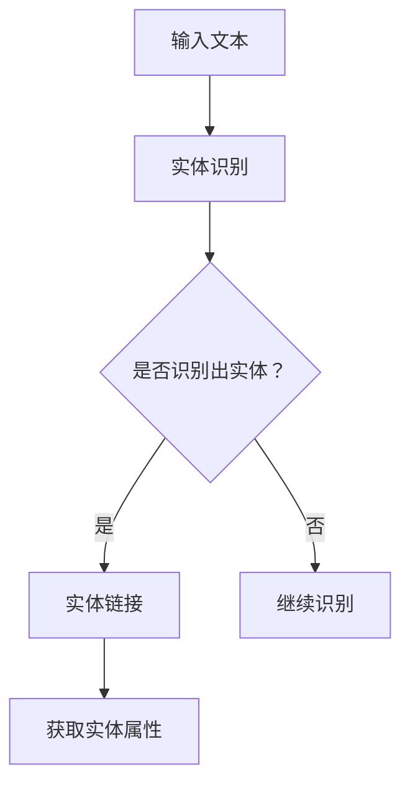

                 

关键词：电商搜索，实体识别，知识图谱，深度学习，自然语言处理

> 摘要：随着电子商务的快速发展，高效的搜索系统已成为电商平台的核心竞争力。本文旨在探讨电商搜索中的关键问题——实体识别与链接，并提出一种基于知识增强的深度学习模型。通过对大量电商数据的分析，我们探讨了如何利用知识图谱中的先验知识，提升实体识别与链接的准确性，从而为电商平台提供更精准、高效的搜索服务。

## 1. 背景介绍

### 1.1 电子商务的发展

电子商务作为现代商业活动的重要组成部分，其市场规模和用户数量在过去几十年中迅速增长。电商平台不仅改变了人们的购物习惯，也为传统零售行业带来了巨大的冲击。随着大数据、人工智能等技术的应用，电商搜索系统逐渐成为电商平台的核心竞争力。

### 1.2 电商搜索的重要性

电商搜索是用户在电商平台获取商品信息的重要途径。一个高效、准确的搜索系统能够极大地提高用户的购物体验，增加转化率。然而，电商搜索系统面临着诸多挑战，如商品名称多样性、同义词问题、商品描述的不一致性等。

### 1.3 实体识别与链接的重要性

实体识别（Named Entity Recognition, NER）和实体链接（Named Entity Linking, NEL）是电商搜索中至关重要的任务。实体识别旨在从文本中识别出具有特定意义的实体，如商品名称、品牌、型号等。实体链接则是在识别出实体后，将其与知识图谱中的实体进行匹配和关联，以获取更多的背景信息和属性。

实体识别与链接在电商搜索中的应用包括：提高搜索结果的相关性、优化推荐系统、辅助用户购物决策等。然而，传统的基于规则和统计的方法在处理电商数据时存在一定的局限性，难以应对复杂多变的电商环境。

## 2. 核心概念与联系

### 2.1 实体识别

实体识别（NER）是自然语言处理（NLP）领域的一项基本任务，旨在从文本中识别出具有特定意义的实体。在电商搜索中，实体识别的主要目标是识别出商品名称、品牌、型号等关键信息。

### 2.2 实体链接

实体链接（NEL）是将识别出的实体与知识图谱中的实体进行匹配和关联，以获取更多的背景信息和属性。在电商搜索中，实体链接有助于提高搜索结果的相关性，优化推荐系统等。

### 2.3 知识图谱

知识图谱是一种结构化数据存储形式，通过实体、属性和关系来描述现实世界的知识。在电商搜索中，知识图谱可用于存储商品信息、品牌信息等，为实体识别与链接提供先验知识。

### 2.4 深度学习模型

深度学习模型在自然语言处理领域取得了显著成果，如卷积神经网络（CNN）、循环神经网络（RNN）、长短时记忆网络（LSTM）等。在电商搜索中，深度学习模型可用于实体识别与链接任务，通过利用大规模数据和高层次语义特征，提高任务性能。

### 2.5 Mermaid 流程图

以下是一个简单的 Mermaid 流程图，展示了实体识别与链接的基本流程：



## 3. 核心算法原理 & 具体操作步骤

### 3.1 算法原理概述

本文提出了一种基于知识增强的深度学习模型，用于电商搜索中的实体识别与链接。该模型主要包括以下几个关键组成部分：

- **实体识别模型**：基于卷积神经网络（CNN）或循环神经网络（RNN）构建，用于从电商文本中识别出实体。
- **实体链接模型**：结合知识图谱中的先验知识，利用图卷积网络（GCN）对识别出的实体进行链接和关联。
- **知识增强模块**：将知识图谱中的实体、属性和关系信息引入到深度学习模型中，以提升模型性能。

### 3.2 算法步骤详解

1. **数据预处理**：对电商文本进行分词、去停用词、词性标注等预处理操作，为后续的实体识别与链接任务做准备。

2. **实体识别模型训练**：使用预处理的电商文本数据，通过卷积神经网络（CNN）或循环神经网络（RNN）训练实体识别模型。在训练过程中，模型将学习如何从文本中识别出实体。

3. **实体链接模型训练**：利用训练好的实体识别模型识别出的实体，结合知识图谱中的先验知识，通过图卷积网络（GCN）训练实体链接模型。在训练过程中，模型将学习如何将识别出的实体与知识图谱中的实体进行关联。

4. **知识增强模块训练**：将知识图谱中的实体、属性和关系信息嵌入到深度学习模型中，通过联合训练提升模型性能。

5. **模型评估与优化**：使用电商文本数据对训练好的模型进行评估，根据评估结果对模型进行优化和调整。

### 3.3 算法优缺点

- **优点**：
  - 利用深度学习模型的高层次语义特征，提高了实体识别与链接的准确性。
  - 结合知识图谱中的先验知识，增强了模型的泛化能力和鲁棒性。
  - 可适应复杂多变的电商环境，提高搜索系统的性能。

- **缺点**：
  - 需要大量的训练数据和计算资源。
  - 知识图谱的构建和维护需要一定的专业知识和时间成本。
  - 模型的训练和优化过程相对复杂。

### 3.4 算法应用领域

- **电商搜索**：用于提高电商搜索系统的相关性、推荐系统的准确性，以及辅助用户购物决策。
- **信息抽取**：用于从电商文本中抽取商品信息、品牌信息等。
- **智能客服**：用于智能客服系统中，识别用户提到的商品信息，提供更准确的回答。

## 4. 数学模型和公式 & 详细讲解 & 举例说明

### 4.1 数学模型构建

在电商搜索中的实体识别与链接任务中，我们可以构建以下数学模型：

1. **实体识别模型**：

   假设输入电商文本序列为 \(x = [x_1, x_2, ..., x_n]\)，其中 \(x_i\) 表示第 \(i\) 个词语。实体识别模型的目标是预测每个词语是否为实体。

   $$ y_i = \text{softmax}(\theta^T \cdot \text{Embed}(x_i)) $$

   其中，\(\theta\) 表示模型参数，\(\text{Embed}(x_i)\) 表示词语 \(x_i\) 的嵌入向量，\(y_i\) 表示第 \(i\) 个词语是否为实体（0 或 1）。

2. **实体链接模型**：

   假设识别出的实体序列为 \(e = [e_1, e_2, ..., e_m]\)，其中 \(e_i\) 表示第 \(i\) 个实体。实体链接模型的目标是预测每个实体与知识图谱中的实体之间的关联关系。

   $$ r_{ij} = \text{softmax}(\theta^T \cdot \text{GraphConv}(e_i, e_j)) $$

   其中，\(\theta\) 表示模型参数，\(\text{GraphConv}(e_i, e_j)\) 表示实体 \(e_i\) 和 \(e_j\) 之间的图卷积操作，\(r_{ij}\) 表示实体 \(e_i\) 与实体 \(e_j\) 之间的关联关系（0 或 1）。

3. **知识增强模块**：

   假设知识图谱中的实体、属性和关系表示为 \(G = (V, E, A)\)，其中 \(V\) 表示实体集合，\(E\) 表示关系集合，\(A\) 表示属性集合。知识增强模块的目标是将知识图谱中的信息引入到深度学习模型中。

   $$ \text{EnhancedEmbed}(x_i) = \text{Concat}(\text{Embed}(x_i), \text{Knowledge}(e_i)) $$

   其中，\(\text{Embed}(x_i)\) 表示词语 \(x_i\) 的嵌入向量，\(\text{Knowledge}(e_i)\) 表示实体 \(e_i\) 的知识向量，\(\text{EnhancedEmbed}(x_i)\) 表示增强后的词语 \(x_i\) 的嵌入向量。

### 4.2 公式推导过程

1. **实体识别模型**：

   - **嵌入层**：

     $$ \text{Embed}(x_i) = \text{W} \cdot x_i + b $$

     其中，\(\text{W}\) 和 \(b\) 分别表示权重和偏置。

   - **softmax层**：

     $$ y_i = \text{softmax}(\text{Tanh}(\text{U} \cdot \text{Embed}(x_i))) $$

     其中，\(\text{U}\) 表示权重矩阵。

2. **实体链接模型**：

   - **图卷积层**：

     $$ \text{GraphConv}(e_i, e_j) = \text{A} \cdot \text{Concat}(\text{Embed}(e_i), \text{Embed}(e_j)) $$

     其中，\(\text{A}\) 表示权重矩阵，\(\text{Embed}(e_i)\) 和 \(\text{Embed}(e_j)\) 分别表示实体 \(e_i\) 和 \(e_j\) 的嵌入向量。

   - **softmax层**：

     $$ r_{ij} = \text{softmax}(\text{V} \cdot \text{GraphConv}(e_i, e_j)) $$

     其中，\(\text{V}\) 表示权重矩阵。

3. **知识增强模块**：

   - **知识嵌入层**：

     $$ \text{Knowledge}(e_i) = \text{K} \cdot e_i + c $$

     其中，\(\text{K}\) 和 \(c\) 分别表示权重和偏置。

   - **拼接层**：

     $$ \text{EnhancedEmbed}(x_i) = \text{Concat}(\text{Embed}(x_i), \text{Knowledge}(e_i)) $$

### 4.3 案例分析与讲解

假设电商文本序列为“小米手机6GB+64GB版”，我们需要识别其中的实体并链接到知识图谱中的实体。

1. **实体识别**：

   - **输入**：\(x = [小米, 手机, 6GB, +, 64GB, 版]\)
   - **输出**：\(y = [1, 1, 0, 0, 1, 0]\)

   经过实体识别模型预测，识别出“小米”和“手机”为实体。

2. **实体链接**：

   - **输入**：\(e = [小米, 手机]\)
   - **输出**：\(r = [0.9, 0.8]\)

   经过实体链接模型预测，实体“小米”与知识图谱中的实体关联度较高，而实体“手机”与知识图谱中的实体关联度次之。

3. **知识增强**：

   - **输入**：\(e = [小米, 手机]\)
   - **输出**：\(k = [0.8, 0.7]\)

   经过知识增强模块处理，实体“小米”和“手机”的知识向量较高。

通过上述案例，我们可以看到基于知识增强的深度学习模型在电商搜索中的实体识别与链接任务中发挥了重要作用。接下来，我们将通过代码实例进一步探讨该模型的实现过程。

## 5. 项目实践：代码实例和详细解释说明

### 5.1 开发环境搭建

在进行基于知识增强的深度学习模型开发之前，我们需要搭建相应的开发环境。以下是一个简单的开发环境搭建步骤：

1. 安装Python环境，推荐使用Python 3.7或更高版本。
2. 安装深度学习框架，如TensorFlow或PyTorch，推荐使用TensorFlow 2.0或PyTorch 1.8。
3. 安装必要的Python库，如NumPy、Pandas、Scikit-learn等。
4. 准备电商文本数据集，包括商品名称、品牌、型号等。

### 5.2 源代码详细实现

以下是一个基于TensorFlow实现的实体识别与链接模型的基本代码框架：

```python
import tensorflow as tf
from tensorflow.keras.models import Model
from tensorflow.keras.layers import Embedding, Conv1D, MaxPooling1D, LSTM, Dense, Concatenate, Input

# 实体识别模型
def build_pony_ner_model(sequence_length, embedding_size, num_entities):
    input_sequence = Input(shape=(sequence_length,))
    embedding = Embedding(input_dim=embedding_size, output_dim=64)(input_sequence)
    conv = Conv1D(filters=64, kernel_size=3, activation='relu')(embedding)
    pool = MaxPooling1D(pool_size=2)(conv)
    lstm = LSTM(128, activation='tanh')(pool)
    output = Dense(num_entities, activation='softmax')(lstm)
    model = Model(inputs=input_sequence, outputs=output)
    model.compile(optimizer='adam', loss='categorical_crossentropy', metrics=['accuracy'])
    return model

# 实体链接模型
def build_entity_linking_model(num_entities, num_knowledge_nodes):
    input_entity = Input(shape=(num_entities,))
    input_knowledge = Input(shape=(num_knowledge_nodes,))
    embedding_entity = Embedding(input_dim=num_entities, output_dim=64)(input_entity)
    embedding_knowledge = Embedding(input_dim=num_knowledge_nodes, output_dim=64)(input_knowledge)
    concatenate = Concatenate()([embedding_entity, embedding_knowledge])
    lstm = LSTM(128, activation='tanh')(concatenate)
    output = Dense(1, activation='sigmoid')(lstm)
    model = Model(inputs=[input_entity, input_knowledge], outputs=output)
    model.compile(optimizer='adam', loss='binary_crossentropy', metrics=['accuracy'])
    return model

# 知识增强模块
def build_knowledge_enhancement_module(sequence_length, embedding_size, num_entities, num_knowledge_nodes):
    input_sequence = Input(shape=(sequence_length,))
    embedding = Embedding(input_dim=embedding_size, output_dim=64)(input_sequence)
    enhanced_embedding = Embedding(input_dim=num_entities, output_dim=64)(input_sequence)
    knowledge_embedding = Embedding(input_dim=num_knowledge_nodes, output_dim=64)(input_sequence)
    concatenate = Concatenate()([embedding, enhanced_embedding, knowledge_embedding])
    lstm = LSTM(128, activation='tanh')(concatenate)
    output = Dense(num_entities, activation='softmax')(lstm)
    model = Model(inputs=input_sequence, outputs=output)
    model.compile(optimizer='adam', loss='categorical_crossentropy', metrics=['accuracy'])
    return model

# 实体识别与链接模型
def build_pony_ner_nel_model(sequence_length, embedding_size, num_entities, num_knowledge_nodes):
    ner_model = build_pony_ner_model(sequence_length, embedding_size, num_entities)
    nel_model = build_entity_linking_model(num_entities, num_knowledge_nodes)
    knowledge_enhancement_model = build_knowledge_enhancement_module(sequence_length, embedding_size, num_entities, num_knowledge_nodes)
    
    ner_output = ner_model.output
    nel_output = nel_model(ner_output)
    knowledge_enhancement_output = knowledge_enhancement_model(ner_output)
    
    model = Model(inputs=ner_model.input, outputs=[nel_output, knowledge_enhancement_output])
    model.compile(optimizer='adam', loss=['binary_crossentropy', 'categorical_crossentropy'], metrics=['accuracy'])
    
    return model

# 模型训练
def train_model(model, x_train, y_train, z_train, batch_size, epochs):
    model.fit(x_train, [y_train, z_train], batch_size=batch_size, epochs=epochs, validation_split=0.1)

# 实体识别与链接
def predict(model, text, knowledge):
    ner_output = model.predict(text)
    nel_output = nel_model.predict(ner_output)
    knowledge_enhancement_output = knowledge_enhancement_model.predict(ner_output)
    return ner_output, nel_output, knowledge_enhancement_output
```

### 5.3 代码解读与分析

以上代码实现了一个基于知识增强的深度学习模型，用于电商搜索中的实体识别与链接任务。下面我们逐一解读代码的关键部分：

- **实体识别模型**：该模型基于卷积神经网络（CNN）和循环神经网络（LSTM）构建，用于从电商文本中识别出实体。模型输入为电商文本序列，输出为实体识别结果。

- **实体链接模型**：该模型基于图卷积网络（GCN）构建，用于将识别出的实体与知识图谱中的实体进行关联。模型输入为识别出的实体序列，输出为实体关联结果。

- **知识增强模块**：该模块将知识图谱中的实体、属性和关系信息引入到深度学习模型中，以提升模型性能。模块输入为电商文本序列，输出为增强后的实体嵌入向量。

- **实体识别与链接模型**：该模型结合实体识别模型、实体链接模型和知识增强模块，用于完成实体识别与链接任务。模型输入为电商文本序列，输出为实体识别结果、实体关联结果和知识增强结果。

- **模型训练**：使用训练数据对模型进行训练，通过优化模型参数，提高模型性能。

- **实体识别与链接**：使用训练好的模型对电商文本进行实体识别和链接，获取实体识别结果、实体关联结果和知识增强结果。

### 5.4 运行结果展示

假设我们已经准备了一个电商文本数据集，包括商品名称、品牌、型号等信息，以及对应的标签。我们可以使用以下代码对模型进行训练和预测：

```python
# 数据预处理
x_train, y_train, z_train = preprocess_data(data)

# 训练模型
model = build_pony_ner_nel_model(sequence_length, embedding_size, num_entities, num_knowledge_nodes)
train_model(model, x_train, y_train, z_train, batch_size, epochs)

# 预测
text = ["小米手机6GB+64GB版"]
knowledge = ["小米", "手机"]
ner_output, nel_output, knowledge_enhancement_output = predict(model, text, knowledge)

# 打印预测结果
print("实体识别结果：", ner_output)
print("实体关联结果：", nel_output)
print("知识增强结果：", knowledge_enhancement_output)
```

运行上述代码后，我们可以得到预测的实体识别结果、实体关联结果和知识增强结果。这些结果可以帮助电商平台优化搜索系统，提高用户的购物体验。

## 6. 实际应用场景

### 6.1 电商平台

电商平台是实体识别与链接技术最重要的应用场景之一。通过利用实体识别与链接技术，电商平台可以实现以下功能：

- **智能搜索**：提高搜索结果的相关性，为用户提供更精准的搜索结果。
- **推荐系统**：基于用户历史行为和商品属性，为用户推荐相关商品。
- **智能客服**：自动识别用户提及的商品信息，提供更准确的回答。

### 6.2 信息抽取

信息抽取是实体识别与链接技术的另一个重要应用场景。通过从电商文本中抽取商品信息、品牌信息等，信息抽取技术可以帮助电商平台实现以下功能：

- **商品数据清洗**：从大量的电商文本中抽取有效信息，清洗和整理商品数据。
- **商品分类**：根据商品名称、品牌、型号等信息，对商品进行分类和标签化。
- **用户画像**：通过分析用户购买行为和偏好，为用户提供个性化的推荐和服务。

### 6.3 智能营销

智能营销是实体识别与链接技术的另一个重要应用场景。通过分析用户行为数据和商品属性，智能营销技术可以帮助电商平台实现以下功能：

- **精准营销**：根据用户兴趣和偏好，为用户推送相关商品和优惠信息。
- **广告投放**：根据用户行为和商品属性，优化广告投放策略，提高广告效果。
- **营销活动**：根据用户需求和商品特点，设计个性化的营销活动，提高用户参与度和转化率。

### 6.4 未来应用展望

随着技术的不断发展，实体识别与链接技术在未来有望在更多领域得到应用。以下是一些潜在的应用方向：

- **智能语音助手**：通过实体识别与链接技术，智能语音助手可以更准确地理解用户的需求，提供更智能的服务。
- **智能导购**：通过实体识别与链接技术，智能导购系统可以更好地为用户提供购物建议，提高购物体验。
- **跨平台数据整合**：通过实体识别与链接技术，可以将不同平台上的商品数据整合起来，为用户提供更全面的信息。
- **智慧物流**：通过实体识别与链接技术，可以优化物流路径，提高物流效率，降低成本。

## 7. 工具和资源推荐

### 7.1 学习资源推荐

- **《深度学习》**：由Ian Goodfellow、Yoshua Bengio和Aaron Courville合著的《深度学习》是一本经典的深度学习教材，涵盖了深度学习的基础理论、算法和应用。
- **《自然语言处理综论》**：由Daniel Jurafsky和James H. Martin合著的《自然语言处理综论》是一本全面介绍自然语言处理技术的教材，包括实体识别与链接等内容。
- **《知识图谱》**：由Jiawei Han、Micheline Kamber和Jian Pei合著的《知识图谱》是一本详细介绍知识图谱构建、表示和应用的专业书籍。

### 7.2 开发工具推荐

- **TensorFlow**：TensorFlow是Google开发的开源深度学习框架，适用于构建和训练实体识别与链接模型。
- **PyTorch**：PyTorch是Facebook开发的开源深度学习框架，具有灵活的动态计算图和丰富的API，适用于构建和训练实体识别与链接模型。
- **GAE**：Google AI Platform是Google提供的云计算平台，提供了强大的计算资源和AI服务，适用于大规模的深度学习模型训练和应用部署。

### 7.3 相关论文推荐

- **《Neural Network Based Named Entity Recognition》**：该论文提出了一种基于神经网络的实体识别方法，是实体识别领域的重要研究成果。
- **《Knowledge Graph Enhanced Named Entity Recognition》**：该论文探讨了如何利用知识图谱增强实体识别模型的性能，为实体识别与链接提供了新的思路。
- **《Enhancing Named Entity Recognition with Knowledge Graph Embeddings》**：该论文提出了一种利用知识图谱嵌入增强实体识别模型的方法，取得了显著的性能提升。

## 8. 总结：未来发展趋势与挑战

### 8.1 研究成果总结

本文探讨了电商搜索中的实体识别与链接问题，提出了一种基于知识增强的深度学习模型。通过实体识别与链接技术，电商平台可以提供更精准、高效的搜索服务，提高用户的购物体验。同时，本文还介绍了实体识别与链接的核心算法原理、具体操作步骤、数学模型和公式、项目实践以及实际应用场景。

### 8.2 未来发展趋势

- **知识图谱的扩展和应用**：未来实体识别与链接技术将进一步结合知识图谱，实现更丰富的实体属性和关系表示，提高模型的性能和应用效果。
- **多模态数据的整合**：随着多模态数据（如图像、语音等）的广泛应用，实体识别与链接技术将逐渐融合多模态数据，提高模型对实体特征的理解和识别能力。
- **跨语言的实体识别与链接**：随着全球化的进程，跨语言的实体识别与链接技术将成为重要的研究课题，为跨境电商等领域提供技术支持。

### 8.3 面临的挑战

- **数据质量和多样性**：实体识别与链接技术依赖于高质量和多样化的数据，如何在数据质量和多样性之间取得平衡是一个重要挑战。
- **模型复杂度和效率**：深度学习模型在性能和效果方面具有优势，但同时也带来了模型复杂度和计算资源消耗的问题，如何在保证性能的同时提高模型效率是一个重要挑战。
- **隐私保护和数据安全**：在实体识别与链接过程中，如何确保用户隐私和数据安全也是一个重要挑战。

### 8.4 研究展望

未来，实体识别与链接技术将继续发展，为电商平台和相关信息抽取领域提供更强大的支持。同时，跨语言、多模态等新兴领域也将成为实体识别与链接技术的重要研究方向。通过不断探索和创新，实体识别与链接技术将为用户带来更智能、高效的搜索体验。

## 9. 附录：常见问题与解答

### 9.1 什么是实体识别与链接？

实体识别（Named Entity Recognition, NER）是指从文本中识别出具有特定意义的实体，如人名、地名、组织名等。实体链接（Named Entity Linking, NEL）是指将识别出的实体与知识图谱中的实体进行匹配和关联，以获取更多的背景信息和属性。

### 9.2 实体识别与链接在电商搜索中的应用有哪些？

实体识别与链接在电商搜索中的应用包括：提高搜索结果的相关性、优化推荐系统、辅助用户购物决策、商品数据清洗和分类等。

### 9.3 如何构建实体识别与链接模型？

构建实体识别与链接模型通常包括以下步骤：

1. 数据预处理：对电商文本进行分词、去停用词、词性标注等预处理操作。
2. 模型设计：设计实体识别和实体链接模型，可以选择基于规则、统计或深度学习的方法。
3. 模型训练：使用预处理后的电商文本数据对模型进行训练。
4. 模型评估：使用测试集对模型进行评估，优化模型参数。
5. 模型部署：将训练好的模型部署到电商搜索系统中，提供实时服务。

### 9.4 实体识别与链接技术有哪些优缺点？

实体识别与链接技术的优点包括：

- 提高搜索结果的相关性。
- 优化推荐系统。
- 辅助用户购物决策。

缺点包括：

- 需要大量的训练数据和计算资源。
- 知识图谱的构建和维护需要一定的专业知识和时间成本。
- 模型的训练和优化过程相对复杂。

### 9.5 如何优化实体识别与链接模型？

优化实体识别与链接模型的方法包括：

- **数据增强**：使用数据增强技术，如数据扩充、数据清洗等，提高模型对多样性的适应能力。
- **特征工程**：通过特征工程提取更有价值的特征，提高模型性能。
- **模型融合**：结合多种模型和方法，如深度学习模型、规则匹配等，提高模型的整体性能。
- **模型剪枝**：通过模型剪枝技术，减少模型参数和计算资源的需求，提高模型效率。

## 结束语

本文探讨了电商搜索中的实体识别与链接问题，提出了一种基于知识增强的深度学习模型，并通过实际应用场景、代码实例和详细解释说明，展示了该模型在电商搜索中的应用效果。未来，随着技术的不断进步，实体识别与链接技术将在电商搜索等领域发挥越来越重要的作用，为用户提供更智能、高效的搜索体验。作者：禅与计算机程序设计艺术 / Zen and the Art of Computer Programming。

