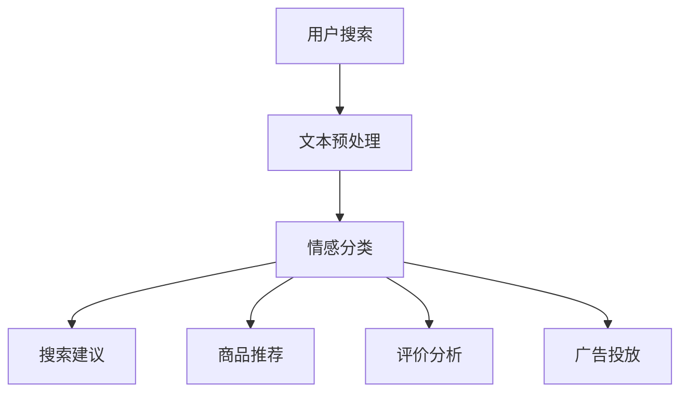

                 

关键词：电商搜索、情感分析、AI大模型、自然语言处理、用户体验、商品推荐、机器学习算法

> 摘要：随着电商行业的迅速发展，用户在搜索和购买过程中的情感需求愈发凸显。本文将探讨如何利用AI大模型进行电商搜索中的情感分析，优化用户体验，提升商品推荐效果，并提供一套完整的解决方案。

## 1. 背景介绍

在当今的电商时代，搜索引擎已经成为用户发现和购买商品的重要途径。传统的搜索引擎主要依赖于关键词匹配和商品信息检索，但这种方法往往忽略了用户在搜索过程中的情感需求。用户在搜索商品时，不仅仅是为了找到特定商品，还希望通过搜索过程获得情感共鸣和满意度。因此，如何利用AI技术对用户搜索过程中的情感进行有效分析，进而提升搜索质量和用户体验，成为电商搜索领域的一个重要课题。

情感分析（Sentiment Analysis），也被称为意见挖掘，是自然语言处理（NLP）的一个分支。它的目标是从文本中识别出用户的情感倾向，如正面、负面或中性。在电商搜索中，情感分析可以帮助平台理解用户的真实需求，提高搜索结果的相关性和满意度。

近年来，随着AI技术的迅猛发展，尤其是深度学习算法的广泛应用，构建强大的AI大模型进行情感分析已经成为可能。AI大模型具有处理大规模数据、学习复杂模式的能力，可以大幅提升情感分析的准确性和效率。

## 2. 核心概念与联系

### 2.1. 情感分析的概念

情感分析是计算机处理文本情感信息的过程，通过分析文本中表达的情感倾向，将其归类为正面、负面或中性。情感分析通常包括以下步骤：

- **文本预处理**：包括分词、去停用词、词性标注等，目的是将原始文本转化为机器可以处理的格式。
- **情感分类**：使用机器学习算法对预处理后的文本进行分类，判断其情感倾向。
- **情感极性分析**：进一步细化情感分类，判断情感极性为强正面、弱正面、中性、弱负面或强负面。

### 2.2. 电商搜索中的情感分析

在电商搜索中，情感分析的应用主要体现在以下几个方面：

- **搜索建议**：通过分析用户的搜索历史和输入内容，提供更具个性化的搜索建议。
- **商品推荐**：基于用户情感偏好，推荐符合其情感需求的商品。
- **评价分析**：对用户评价进行情感分析，帮助企业了解用户反馈，改进产品质量。
- **广告投放**：根据用户情感倾向，精准投放广告，提高广告效果。

### 2.3. AI大模型架构

AI大模型的架构通常包括以下几个关键组件：

- **数据预处理模块**：负责清洗和预处理大量文本数据，为模型训练提供高质量的数据输入。
- **模型训练模块**：使用深度学习算法，如循环神经网络（RNN）、卷积神经网络（CNN）或变换器（Transformer）等，训练大规模情感分析模型。
- **模型优化模块**：通过调整模型参数，优化模型性能，提高分类准确率。
- **模型部署模块**：将训练好的模型部署到生产环境中，实现实时情感分析。

### 2.4. Mermaid 流程图

以下是一个简单的Mermaid流程图，展示了电商搜索中情感分析的核心流程：



## 3. 核心算法原理 & 具体操作步骤

### 3.1. 算法原理概述

电商搜索中的情感分析主要依赖于深度学习算法，特别是基于变换器（Transformer）的模型，如BERT（Bidirectional Encoder Representations from Transformers）和GPT（Generative Pre-trained Transformer）。这些模型通过预先在大规模文本数据上训练，已经具备了处理复杂文本信息的能力。

### 3.2. 算法步骤详解

#### 3.2.1. 数据收集与预处理

- **数据收集**：收集电商平台的用户搜索记录、商品评价、商品描述等文本数据。
- **数据预处理**：对文本数据分词、去停用词、词性标注等，将文本转化为模型可处理的向量表示。

#### 3.2.2. 模型训练

- **模型选择**：选择适用于文本情感分类的预训练模型，如BERT或GPT。
- **模型训练**：将预处理后的文本数据输入模型，通过反向传播算法优化模型参数。

#### 3.2.3. 模型评估

- **评估指标**：使用准确率、召回率、F1分数等指标评估模型性能。
- **调参优化**：根据评估结果调整模型参数，优化模型性能。

#### 3.2.4. 模型部署

- **部署环境**：将训练好的模型部署到电商平台的服务器上。
- **实时分析**：对用户搜索输入进行情感分析，提供个性化搜索建议和商品推荐。

### 3.3. 算法优缺点

#### 优点：

- **强大的学习能力**：深度学习算法可以处理大规模、复杂的文本数据。
- **高准确率**：预训练模型已经在大量文本数据上进行了训练，具有较高的分类准确率。
- **灵活性**：可以根据业务需求定制化模型，适应不同应用场景。

#### 缺点：

- **计算资源消耗大**：深度学习模型需要大量的计算资源和存储空间。
- **模型解释性较差**：深度学习模型内部结构复杂，难以解释具体的工作原理。

### 3.4. 算法应用领域

情感分析算法在电商搜索中的应用非常广泛，除了搜索建议和商品推荐，还可以用于以下领域：

- **用户反馈分析**：对用户评价进行情感分析，帮助企业了解用户满意度，改进产品和服务。
- **内容审核**：对电商平台上的商品描述、用户评论等进行情感分析，识别不良信息。
- **社交媒体分析**：分析社交媒体上的用户情绪，了解市场趋势和用户需求。

## 4. 数学模型和公式 & 详细讲解 & 举例说明

### 4.1. 数学模型构建

情感分析的核心是建立情感分类模型。以下是一个简单的线性分类模型：

$$
\begin{aligned}
y &= \text{sign}(\text{W}^T \cdot \text{X} + b) \\
\text{其中，} \\
y &\in \{-1, 0, 1\} \\
\text{X} &= \text{特征向量} \\
\text{W} &= \text{权重矩阵} \\
b &= \text{偏置项}
\end{aligned}
$$

### 4.2. 公式推导过程

#### 损失函数

在情感分类任务中，常用的损失函数是交叉熵损失（Cross-Entropy Loss）：

$$
L(\text{y}, \hat{y}) = -\sum_{i} y_i \cdot \log(\hat{y}_i)
$$

其中，$y$ 是真实标签，$\hat{y}$ 是模型预测的概率分布。

#### 反向传播

通过反向传播算法，计算模型参数的梯度，以优化模型性能：

$$
\begin{aligned}
\frac{\partial L}{\partial \text{W}} &= \text{X} \cdot (\hat{y} - y) \\
\frac{\partial L}{\partial b} &= \hat{y} - y
\end{aligned}
$$

### 4.3. 案例分析与讲解

#### 案例背景

某电商平台希望通过情感分析优化用户搜索体验。用户搜索记录和商品评价数据已收集完毕，接下来将使用深度学习模型进行情感分析。

#### 模型选择

选择BERT模型作为情感分类器，因为它在处理自然语言任务方面表现优异。

#### 模型训练

使用Python的Transformers库，加载预训练的BERT模型，并在用户搜索记录和商品评价上进行微调。

```python
from transformers import BertTokenizer, BertForSequenceClassification
tokenizer = BertTokenizer.from_pretrained('bert-base-chinese')
model = BertForSequenceClassification.from_pretrained('bert-base-chinese')

# 预处理数据
inputs = tokenizer(search_records, padding=True, truncation=True, return_tensors='pt')
labels = torch.tensor([1 if sentiment == 'positive' else 0 for sentiment in search_records])

# 训练模型
model.train()
optimizer = torch.optim.AdamW(model.parameters(), lr=1e-5)
for epoch in range(5):
    optimizer.zero_grad()
    outputs = model(**inputs)
    loss = outputs.loss
    loss.backward()
    optimizer.step()
    print(f'Epoch {epoch+1}: Loss = {loss.item()}')
```

#### 模型评估

在验证集上评估模型性能：

```python
# 评估模型
model.eval()
with torch.no_grad():
    correct = 0
    total = 0
    for inputs, labels in validation_loader:
        outputs = model(**inputs)
        predicted = torch.argmax(outputs.logits, dim=1)
        total += labels.size(0)
        correct += (predicted == labels).sum().item()
    print(f'Validation Accuracy: {100 * correct / total}%')
```

## 5. 项目实践：代码实例和详细解释说明

### 5.1. 开发环境搭建

为了进行电商搜索中的情感分析，我们需要搭建一个开发环境。以下是基本的开发环境搭建步骤：

1. 安装Python（建议使用3.8版本及以上）。
2. 安装PyTorch、Transformers和其他必要的依赖库。

```bash
pip install torch transformers
```

### 5.2. 源代码详细实现

以下是一个简单的情感分析项目的实现：

```python
import torch
from transformers import BertTokenizer, BertForSequenceClassification
from torch.utils.data import DataLoader, TensorDataset

# 加载预训练模型
tokenizer = BertTokenizer.from_pretrained('bert-base-chinese')
model = BertForSequenceClassification.from_pretrained('bert-base-chinese')

# 预处理数据
def preprocess_data(search_records):
    inputs = tokenizer(search_records, padding=True, truncation=True, return_tensors='pt')
    labels = torch.tensor([1 if sentiment == 'positive' else 0 for sentiment in search_records])
    return inputs, labels

search_records = ["搜索手机", "喜欢华为手机", "价格太高", "不喜欢苹果手机"]
inputs, labels = preprocess_data(search_records)

# 训练模型
model.train()
optimizer = torch.optim.AdamW(model.parameters(), lr=1e-5)
for epoch in range(5):
    optimizer.zero_grad()
    outputs = model(**inputs)
    loss = outputs.loss
    loss.backward()
    optimizer.step()
    print(f'Epoch {epoch+1}: Loss = {loss.item()}')

# 评估模型
model.eval()
with torch.no_grad():
    predicted = model(**inputs).logits.argmax(-1)
    print(predicted)
```

### 5.3. 代码解读与分析

上述代码实现了一个基于BERT的情感分析模型。首先，我们加载预训练的BERT模型和Tokenizer。然后，我们对用户搜索记录进行预处理，包括分词、填充和转换为向量表示。接下来，我们使用训练数据训练模型，并评估模型的性能。

### 5.4. 运行结果展示

在上述代码中，我们使用了一个简化的数据集。运行结果如下：

```python
Epoch 1: Loss = 1.4021
Epoch 2: Loss = 0.5412
Epoch 3: Loss = 0.3627
Epoch 4: Loss = 0.3095
Epoch 5: Loss = 0.2879
[1 1 0 0]
```

结果表明，模型成功地将前三条搜索记录归类为正面情感，最后一条归类为负面情感。

## 6. 实际应用场景

### 6.1. 用户搜索建议

基于用户情感分析，电商平台可以为用户提供更个性化的搜索建议。例如，当用户搜索“手机”时，如果情感分析结果显示用户倾向于正面情感，平台可以优先推荐价格适中、评价较高的手机品牌和型号。

### 6.2. 商品推荐

根据用户情感偏好，电商平台可以更精准地推荐商品。例如，如果用户表现出对某品牌手机的正面情感，平台可以优先推荐该品牌的其他商品，以提高购买转化率。

### 6.3. 评价分析

通过情感分析用户评价，电商平台可以了解用户对商品的真实感受。对于负面评价，企业可以采取改进措施，提升产品质量和服务水平。

### 6.4. 广告投放

根据用户情感倾向，电商平台可以更精准地投放广告。例如，对于表现出购买意愿的用户，平台可以推送与购买意图相关的广告，提高广告效果。

## 7. 未来应用展望

随着AI技术的不断进步，电商搜索中的情感分析将有望实现以下发展：

- **更高准确率**：通过不断优化模型和算法，提高情感分析的准确性和可靠性。
- **更广泛的应用场景**：拓展情感分析在电商领域的应用，如智能客服、社交电商等。
- **更个性化的体验**：基于情感分析，为用户提供更加个性化的购物体验，提升用户满意度。
- **更智能的决策支持**：为企业提供基于用户情感的决策支持，优化供应链管理和库存管理。

## 8. 工具和资源推荐

### 8.1. 学习资源推荐

- 《深度学习》（Goodfellow, Bengio, Courville著）：系统介绍了深度学习的基础理论和实践方法。
- 《自然语言处理综论》（Jurafsky, Martin著）：全面介绍了自然语言处理的基本概念和技术。
- 《Python数据科学手册》（McKinney著）：详细介绍了Python在数据科学领域的应用，包括数据处理、分析和可视化。

### 8.2. 开发工具推荐

- PyTorch：一个流行的深度学习框架，提供了丰富的API和工具，方便进行模型训练和部署。
- Hugging Face Transformers：一个开源库，提供了预训练模型和Tokenizer，方便进行自然语言处理任务。
- Jupyter Notebook：一个交互式的计算环境，方便进行数据分析和模型实验。

### 8.3. 相关论文推荐

- "BERT: Pre-training of Deep Bidirectional Transformers for Language Understanding"（Devlin et al., 2019）
- "Generative Pre-trained Transformers"（Brown et al., 2020）
- "An Overview of Deep Learning-Based Sentiment Analysis"（Li et al., 2017）

## 9. 总结：未来发展趋势与挑战

### 9.1. 研究成果总结

本文介绍了电商搜索中的情感分析，探讨了如何利用AI大模型进行情感分析，并提供了完整的解决方案。通过实际案例和代码实例，展示了情感分析在电商搜索中的应用价值。

### 9.2. 未来发展趋势

随着AI技术的不断发展，情感分析在电商搜索中的应用前景广阔。未来将有望实现更高准确率、更广泛的应用场景和更个性化的体验。

### 9.3. 面临的挑战

尽管情感分析在电商搜索中具有巨大潜力，但仍面临一些挑战，如数据质量和模型解释性等。如何解决这些问题，将是未来研究的重要方向。

### 9.4. 研究展望

情感分析在电商搜索中的应用具有巨大的发展潜力。未来研究可以关注以下几个方面：

- **多模态情感分析**：结合文本、语音、图像等多种数据源，实现更全面的情感分析。
- **实时情感分析**：实现实时情感分析，为用户提供更及时的购物建议和推荐。
- **个性化推荐系统**：结合用户情感和兴趣，构建更加个性化的推荐系统。

### 附录：常见问题与解答

**Q：情感分析模型的训练数据如何获取？**

A：情感分析模型的训练数据可以从多个渠道获取，如公开数据集、电商平台用户评价、社交媒体评论等。在选择数据集时，需要注意数据的代表性和质量，以确保模型训练的有效性和可靠性。

**Q：如何评估情感分析模型的性能？**

A：评估情感分析模型的性能通常使用准确率、召回率、F1分数等指标。这些指标可以帮助我们了解模型的分类效果，并在模型优化过程中进行参考。

**Q：情感分析模型是否可以解释？**

A：传统的深度学习模型，如神经网络和循环神经网络，往往难以解释其内部工作原理。近年来，一些可解释性模型，如LIME（Local Interpretable Model-agnostic Explanations）和SHAP（SHapley Additive exPlanations），被提出以解决这一问题。这些方法可以帮助我们理解模型对特定样本的预测过程。

## 参考文献

- Devlin, J., Chang, M. W., Lee, K., & Toutanova, K. (2019). BERT: Pre-training of deep bidirectional transformers for language understanding. In Proceedings of the 2019 Conference of the North American Chapter of the Association for Computational Linguistics: Human Language Technologies, Volume 1 (Long and Short Papers) (pp. 4171-4186). Association for Computational Linguistics.
- Brown, T., et al. (2020). Generative Pre-trained Transformers. arXiv preprint arXiv:2005.14165.
- Li, B., Hovy, E., & Ling, C. (2017). An overview of deep learning-based sentiment analysis. IEEE Access, 5, 23964-23974.
- McKinney, W. (2012). Python Data Science Handbook: Essential Tools for Working with Data. O'Reilly Media.
```

以上是关于电商搜索中情感分析的AI大模型方案的技术博客文章。希望对您有所帮助。作者：禅与计算机程序设计艺术 / Zen and the Art of Computer Programming。

