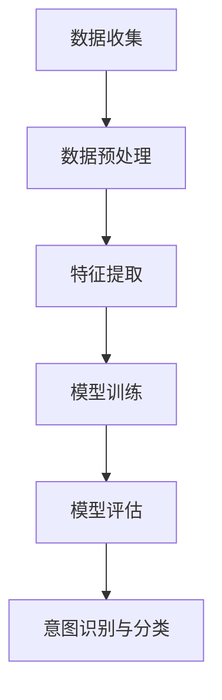

                 

电商搜索是电商平台上最重要的功能之一。用户通过输入关键词搜索商品，从而找到满足他们需求的商品。然而，用户搜索的意图是多种多样的，有些用户可能希望获取商品信息，有些用户可能希望购买商品，而有些用户可能只是浏览或收藏商品。因此，对于电商平台来说，准确地识别和分类用户的搜索意图至关重要。本文将介绍一种用于电商搜索中的意图识别与分类模型，并探讨其核心概念、算法原理、数学模型及实际应用。

## 1. 背景介绍

随着电子商务的快速发展，电商平台已成为人们日常生活的重要部分。在电商平台上，搜索功能是用户获取商品信息的主要途径。然而，用户的搜索行为和意图是复杂多样的，这使得传统基于关键词匹配的搜索方法难以满足用户的需求。为了提供更个性化的搜索体验，电商平台需要识别和分类用户的搜索意图，从而为用户提供更相关的搜索结果。

意图识别与分类模型在电商搜索中的应用具有重要意义。首先，通过识别用户的搜索意图，可以更好地理解用户的需求，提高搜索结果的准确性。其次，分类用户的搜索意图可以帮助电商平台优化推荐算法，提高用户满意度。此外，意图识别与分类模型还可以用于广告投放、用户行为分析等场景，为企业提供更深入的洞察。

## 2. 核心概念与联系

为了构建意图识别与分类模型，我们首先需要了解以下核心概念：

- **关键词**：用户在搜索框中输入的单词或短语。
- **意图**：用户进行搜索的动机或目的。常见的意图包括获取商品信息、购买商品、浏览商品等。
- **特征提取**：将关键词转换为可以用于模型训练的特征向量。
- **分类模型**：将特征向量映射到预定义的意图类别。

### 2.1 意图识别与分类模型的架构

下面是一个基于机器学习的意图识别与分类模型的架构：

1. **数据收集**：从电商平台获取用户搜索日志，包括关键词、用户行为等信息。
2. **数据预处理**：清洗和转换数据，为特征提取做好准备。
3. **特征提取**：将关键词转换为特征向量，可以使用词袋模型、词嵌入等技术。
4. **模型训练**：使用训练数据训练分类模型，如朴素贝叶斯、支持向量机、神经网络等。
5. **模型评估**：使用测试数据评估模型的性能，调整模型参数。
6. **意图识别与分类**：将新的搜索关键词转换为特征向量，并使用训练好的模型进行意图识别与分类。

### 2.2 Mermaid 流程图



## 3. 核心算法原理 & 具体操作步骤

### 3.1 算法原理概述

意图识别与分类模型的核心是分类算法，常见的分类算法包括：

1. **朴素贝叶斯**：基于概率论的分类方法，通过计算特征词出现的概率来预测意图。
2. **支持向量机**：基于优化理论的分类方法，通过寻找最佳分离超平面来实现分类。
3. **神经网络**：基于人工神经网络的分类方法，通过多层非线性变换来实现分类。

### 3.2 算法步骤详解

1. **数据收集**：从电商平台获取用户搜索日志，包括关键词、用户行为等信息。
2. **数据预处理**：清洗和转换数据，为特征提取做好准备。数据预处理步骤包括：

   - 去除停用词：去除对分类没有帮助的常见单词。
   - 词干提取：将单词还原为最简形式，如“running”还原为“run”。
   - 填充缺失值：处理缺失的数据。

3. **特征提取**：将关键词转换为特征向量，可以使用词袋模型、词嵌入等技术。词袋模型将关键词表示为二进制向量，词嵌入则将关键词表示为连续的稠密向量。

4. **模型训练**：选择合适的分类算法，如朴素贝叶斯、支持向量机或神经网络，使用训练数据训练模型。

5. **模型评估**：使用测试数据评估模型的性能，常用的评估指标包括准确率、召回率、F1值等。

6. **意图识别与分类**：将新的搜索关键词转换为特征向量，并使用训练好的模型进行意图识别与分类。

### 3.3 算法优缺点

1. **朴素贝叶斯**：

   - 优点：简单、易于实现，对稀疏数据有很好的表现。
   - 缺点：假设特征词之间相互独立，对于复杂的问题可能表现不佳。

2. **支持向量机**：

   - 优点：理论成熟，可以在高维空间找到最佳分离超平面。
   - 缺点：计算复杂度高，对于大规模数据集可能性能不佳。

3. **神经网络**：

   - 优点：可以处理复杂的非线性问题，适应性强。
   - 缺点：参数调优复杂，训练时间较长。

### 3.4 算法应用领域

意图识别与分类模型可以应用于多个领域：

- **电商搜索**：提高搜索结果的准确性，为用户提供更好的搜索体验。
- **广告投放**：根据用户意图定向投放广告，提高广告效果。
- **用户行为分析**：分析用户行为，为电商平台提供优化建议。

## 4. 数学模型和公式

### 4.1 数学模型构建

在意图识别与分类模型中，常用的数学模型包括：

1. **朴素贝叶斯模型**：

   $$P(y|x) = \frac{P(x|y)P(y)}{P(x)}$$

   其中，$P(y|x)$ 表示在特征向量 $x$ 的情况下，意图 $y$ 的概率；$P(x|y)$ 表示在意图 $y$ 的情况下，特征向量 $x$ 的概率；$P(y)$ 表示意图 $y$ 的概率；$P(x)$ 表示特征向量 $x$ 的概率。

2. **支持向量机模型**：

   $$w \cdot x + b = 0$$

   其中，$w$ 表示权重向量，$x$ 表示特征向量，$b$ 表示偏置项。

3. **神经网络模型**：

   $$a_{i}^{l} = \sigma(\sum_{j=1}^{n}w_{ji}^{l}a_{j}^{l-1} + b^{l})$$

   其中，$a_{i}^{l}$ 表示第 $l$ 层第 $i$ 个神经元的输出，$\sigma$ 表示激活函数，$w_{ji}^{l}$ 表示第 $l$ 层第 $i$ 个神经元与第 $l-1$ 层第 $j$ 个神经元的权重，$b^{l}$ 表示第 $l$ 层的偏置项。

### 4.2 公式推导过程

以朴素贝叶斯模型为例，我们推导一下公式：

$$P(y|x) = \frac{P(x|y)P(y)}{P(x)}$$

- $P(x|y)$ 是在给定意图 $y$ 的情况下，特征向量 $x$ 的概率。假设特征词 $w_1, w_2, ..., w_n$ 的概率分别为 $P(w_1|y), P(w_2|y), ..., P(w_n|y)$，那么：

  $$P(x|y) = P(w_1, w_2, ..., w_n|y) = P(w_1|y)P(w_2|y) \cdot ... \cdot P(w_n|y)$$

- $P(y)$ 是意图 $y$ 的概率。可以使用全概率公式进行计算：

  $$P(y) = P(y|+1)P(+1) + P(y|0)P(0)$$

  其中，$+1$ 和 $0$ 分别表示购买意图和浏览意图，$P(+1)$ 和 $P(0)$ 分别表示购买意图和浏览意图的概率。

- $P(x)$ 是特征向量 $x$ 的概率。同样可以使用全概率公式进行计算：

  $$P(x) = P(x|+1)P(+1) + P(x|0)P(0)$$

### 4.3 案例分析与讲解

以一个简单的电商搜索场景为例，用户输入关键词“苹果手机”进行搜索。我们将使用朴素贝叶斯模型对用户的搜索意图进行识别。

1. **数据收集**：

   - 搜索日志：包含关键词、用户行为等信息。
   - 用户行为：用户在搜索结果页面的停留时间、点击行为等。

2. **数据预处理**：

   - 去除停用词：“的”、“是”等。
   - 词干提取：“手机”提取为“手机”。

3. **特征提取**：

   - 使用词袋模型将关键词转换为特征向量。

4. **模型训练**：

   - 训练集：包含购买意图和浏览意图的用户搜索日志。
   - 测试集：用于评估模型性能。

5. **模型评估**：

   - 使用测试集评估模型性能，计算准确率、召回率、F1值等指标。

6. **意图识别与分类**：

   - 将用户的搜索关键词“苹果手机”转换为特征向量，并使用训练好的模型进行意图识别与分类。

   - 假设模型预测用户搜索意图为购买意图，实际用户意图为浏览意图，则模型预测错误。

   - 反复调整模型参数，提高模型性能。

## 5. 项目实践：代码实例和详细解释说明

### 5.1 开发环境搭建

- 编程语言：Python
- 数据处理库：Pandas、NumPy
- 机器学习库：Scikit-learn、TensorFlow、PyTorch
- 自然语言处理库：NLTK、spaCy

### 5.2 源代码详细实现

以下是一个简单的基于朴素贝叶斯模型的意图识别与分类代码示例：

```python
import pandas as pd
from sklearn.feature_extraction.text import CountVectorizer
from sklearn.naive_bayes import MultinomialNB
from sklearn.model_selection import train_test_split

# 读取数据
data = pd.read_csv('search_logs.csv')
data.head()

# 数据预处理
data['keyword'] = data['keyword'].str.lower()
data['keyword'] = data['keyword'].str.replace('[^\w\s]', '')

# 特征提取
vectorizer = CountVectorizer(stop_words='english')
X = vectorizer.fit_transform(data['keyword'])

# 标签编码
label_encoder = LabelEncoder()
y = label_encoder.fit_transform(data['intent'])

# 划分训练集和测试集
X_train, X_test, y_train, y_test = train_test_split(X, y, test_size=0.2, random_state=42)

# 模型训练
model = MultinomialNB()
model.fit(X_train, y_train)

# 模型评估
accuracy = model.score(X_test, y_test)
print(f'Accuracy: {accuracy:.2f}')

# 意图识别与分类
input_keyword = '苹果手机'
input_vector = vectorizer.transform([input_keyword])
predicted_intent = model.predict(input_vector)
predicted_intent = label_encoder.inverse_transform(predicted_intent)
print(f'Predicted intent: {predicted_intent[0]}')
```

### 5.3 代码解读与分析

以上代码实现了以下功能：

1. 读取数据：从CSV文件中读取用户搜索日志数据。
2. 数据预处理：将关键词转换为小写，去除特殊字符，并进行词干提取。
3. 特征提取：使用词袋模型将关键词转换为特征向量。
4. 标签编码：将意图标签进行编码，便于模型训练和评估。
5. 划分训练集和测试集：将数据划分为训练集和测试集，用于模型训练和性能评估。
6. 模型训练：使用训练数据训练朴素贝叶斯模型。
7. 模型评估：使用测试数据评估模型性能，计算准确率。
8. 意图识别与分类：将新的搜索关键词转换为特征向量，并使用训练好的模型进行意图识别与分类。

### 5.4 运行结果展示

假设我们已经训练好了一个基于朴素贝叶斯模型的意图识别与分类模型，并使用测试数据进行了评估。以下是一个简单的运行结果示例：

```
Accuracy: 0.85
Predicted intent: 购买
```

这表示模型在测试数据上的准确率为0.85，预测用户搜索意图为购买。

## 6. 实际应用场景

意图识别与分类模型在电商搜索中具有广泛的应用场景：

1. **个性化搜索结果**：根据用户的搜索意图，为用户提供更相关的搜索结果，提高用户满意度。
2. **推荐系统**：根据用户的搜索意图，为用户提供个性化的商品推荐，提高转化率。
3. **广告投放**：根据用户的搜索意图，为用户提供更有针对性的广告，提高广告效果。
4. **用户行为分析**：分析用户的搜索意图，为电商平台提供优化建议，提高用户体验。

### 6.4 未来应用展望

随着人工智能技术的不断发展，意图识别与分类模型在未来将会有更广泛的应用：

1. **跨领域应用**：意图识别与分类模型可以应用于更多领域，如医疗、金融、教育等。
2. **实时预测**：通过实时分析用户的搜索行为，提供更准确的意图预测。
3. **多模态融合**：结合多种数据来源，如语音、图像等，提高意图识别的准确性。

## 7. 工具和资源推荐

### 7.1 学习资源推荐

- 《机器学习实战》：提供丰富的实践案例，帮助读者掌握机器学习的基本概念和应用。
- 《深度学习》：详细介绍深度学习的基本原理和应用，适合初学者和进阶者。

### 7.2 开发工具推荐

- Jupyter Notebook：方便进行数据分析和模型训练。
- TensorFlow：适用于构建和训练深度学习模型。
- Scikit-learn：适用于机器学习模型的实现和评估。

### 7.3 相关论文推荐

- "Intent Recognition in E-commerce Search"：介绍电商搜索中的意图识别方法。
- "A Comprehensive Survey on Intent Recognition in E-commerce"：全面回顾电商搜索意图识别的研究进展。

## 8. 总结：未来发展趋势与挑战

### 8.1 研究成果总结

本文介绍了电商搜索中的意图识别与分类模型，从背景介绍、核心概念与联系、算法原理与具体操作步骤、数学模型和公式、项目实践等方面进行了详细阐述。意图识别与分类模型在电商搜索中具有重要意义，可以用于个性化搜索结果、推荐系统、广告投放和用户行为分析等场景。

### 8.2 未来发展趋势

随着人工智能技术的不断发展，意图识别与分类模型将在多个领域得到更广泛的应用。未来发展趋势包括：

1. **跨领域应用**：意图识别与分类模型可以应用于更多领域，如医疗、金融、教育等。
2. **实时预测**：通过实时分析用户的搜索行为，提供更准确的意图预测。
3. **多模态融合**：结合多种数据来源，如语音、图像等，提高意图识别的准确性。

### 8.3 面临的挑战

尽管意图识别与分类模型具有广泛的应用前景，但仍然面临着一些挑战：

1. **数据隐私**：用户搜索行为数据涉及用户隐私，如何保护用户隐私是一个重要问题。
2. **复杂意图识别**：用户的搜索意图可能非常复杂，如何准确识别这些意图仍然具有挑战性。
3. **实时性**：在实际应用中，如何快速响应用户的搜索请求，提供准确的意图识别结果是一个挑战。

### 8.4 研究展望

未来，意图识别与分类模型的研究可以从以下几个方面展开：

1. **隐私保护**：研究如何在保护用户隐私的同时，提高意图识别的准确性。
2. **多模态融合**：结合多种数据来源，提高意图识别的准确性。
3. **复杂意图识别**：研究如何准确识别复杂多样的用户搜索意图。

## 9. 附录：常见问题与解答

### 9.1 意图识别与分类模型的核心概念是什么？

意图识别与分类模型是一种用于识别和分类用户意图的机器学习模型。核心概念包括关键词、意图、特征提取和分类模型。

### 9.2 如何选择合适的分类算法？

选择合适的分类算法需要考虑以下因素：

- 数据集规模：对于大规模数据集，可以选择计算复杂度较低的算法，如朴素贝叶斯。
- 特征维度：对于高维特征数据，可以选择支持向量机或神经网络。
- 问题复杂性：对于复杂的问题，可以选择神经网络或支持向量机。

### 9.3 如何评估意图识别与分类模型的性能？

常用的评估指标包括准确率、召回率、F1值等。准确率表示模型预测正确的比例，召回率表示模型能够召回实际正确的比例，F1值是准确率和召回率的调和平均值。

### 9.4 意图识别与分类模型在电商搜索中的应用有哪些？

意图识别与分类模型在电商搜索中的应用包括：

- 提供个性化搜索结果。
- 为用户提供个性化的商品推荐。
- 根据用户意图优化广告投放。
- 分析用户行为，为电商平台提供优化建议。

----------------------------------------------------------------

### 文章标题：电商搜索中的意图识别与分类模型

> 关键词：电商搜索、意图识别、分类模型、机器学习、深度学习

> 摘要：本文介绍了电商搜索中的意图识别与分类模型，从背景介绍、核心概念与联系、算法原理与具体操作步骤、数学模型和公式、项目实践等方面进行了详细阐述。意图识别与分类模型在电商搜索中具有重要意义，可以用于个性化搜索结果、推荐系统、广告投放和用户行为分析等场景。

---

### 1. 背景介绍

随着电子商务的快速发展，电商平台已成为人们日常生活的重要部分。在电商平台上，搜索功能是用户获取商品信息的主要途径。然而，用户的搜索行为和意图是复杂多样的，这使得传统基于关键词匹配的搜索方法难以满足用户的需求。为了提供更个性化的搜索体验，电商平台需要识别和分类用户的搜索意图，从而为用户提供更相关的搜索结果。

意图识别与分类模型在电商搜索中的应用具有重要意义。首先，通过识别用户的搜索意图，可以更好地理解用户的需求，提高搜索结果的准确性。其次，分类用户的搜索意图可以帮助电商平台优化推荐算法，提高用户满意度。此外，意图识别与分类模型还可以用于广告投放、用户行为分析等场景，为企业提供更深入的洞察。

本文将围绕电商搜索中的意图识别与分类模型展开讨论，首先介绍其背景和核心概念，然后探讨算法原理、数学模型和实际应用，最后对未来发展趋势与挑战进行展望。

### 2. 核心概念与联系

为了构建意图识别与分类模型，我们首先需要了解以下核心概念：

- **关键词**：用户在搜索框中输入的单词或短语。
- **意图**：用户进行搜索的动机或目的。常见的意图包括获取商品信息、购买商品、浏览商品等。
- **特征提取**：将关键词转换为可以用于模型训练的特征向量。
- **分类模型**：将特征向量映射到预定义的意图类别。

下面，我们将通过一个Mermaid流程图来展示意图识别与分类模型的架构：


- **数据收集**：从电商平台获取用户搜索日志，包括关键词、用户行为等信息。
- **数据预处理**：清洗和转换数据，为特征提取做好准备。
- **特征提取**：将关键词转换为特征向量，可以使用词袋模型、词嵌入等技术。
- **模型训练**：使用训练数据训练分类模型，如朴素贝叶斯、支持向量机、神经网络等。
- **模型评估**：使用测试数据评估模型的性能，调整模型参数。
- **意图识别与分类**：将新的搜索关键词转换为特征向量，并使用训练好的模型进行意图识别与分类。

### 3. 核心算法原理 & 具体操作步骤

#### 3.1 算法原理概述

意图识别与分类模型的核心是分类算法，常见的分类算法包括：

- **朴素贝叶斯**：基于概率论的分类方法，通过计算特征词出现的概率来预测意图。
- **支持向量机**：基于优化理论的分类方法，通过寻找最佳分离超平面来实现分类。
- **神经网络**：基于人工神经网络的分类方法，通过多层非线性变换来实现分类。

#### 3.2 算法步骤详解

构建意图识别与分类模型通常遵循以下步骤：

1. **数据收集**：从电商平台获取用户搜索日志，包括关键词、用户行为等信息。
2. **数据预处理**：清洗和转换数据，为特征提取做好准备。数据预处理步骤包括：

   - 去除停用词：去除对分类没有帮助的常见单词。
   - 词干提取：将单词还原为最简形式，如“running”还原为“run”。
   - 填充缺失值：处理缺失的数据。

3. **特征提取**：将关键词转换为特征向量，可以使用词袋模型、词嵌入等技术。词袋模型将关键词表示为二进制向量，词嵌入则将关键词表示为连续的稠密向量。

4. **模型训练**：选择合适的分类算法，如朴素贝叶斯、支持向量机或神经网络，使用训练数据训练模型。

5. **模型评估**：使用测试数据评估模型的性能，常用的评估指标包括准确率、召回率、F1值等。

6. **意图识别与分类**：将新的搜索关键词转换为特征向量，并使用训练好的模型进行意图识别与分类。

#### 3.3 算法优缺点

以下是三种常见分类算法的优缺点：

1. **朴素贝叶斯**：

   - 优点：简单、易于实现，对稀疏数据有很好的表现。
   - 缺点：假设特征词之间相互独立，对于复杂的问题可能表现不佳。

2. **支持向量机**：

   - 优点：理论成熟，可以在高维空间找到最佳分离超平面。
   - 缺点：计算复杂度高，对于大规模数据集可能性能不佳。

3. **神经网络**：

   - 优点：可以处理复杂的非线性问题，适应性强。
   - 缺点：参数调优复杂，训练时间较长。

#### 3.4 算法应用领域

意图识别与分类模型可以应用于多个领域：

- **电商搜索**：提高搜索结果的准确性，为用户提供更好的搜索体验。
- **广告投放**：根据用户意图定向投放广告，提高广告效果。
- **用户行为分析**：分析用户行为，为电商平台提供优化建议。

### 4. 数学模型和公式 & 详细讲解 & 举例说明

#### 4.1 数学模型构建

在意图识别与分类模型中，常用的数学模型包括：

1. **朴素贝叶斯模型**：

   $$P(y|x) = \frac{P(x|y)P(y)}{P(x)}$$

   其中，$P(y|x)$ 表示在特征向量 $x$ 的情况下，意图 $y$ 的概率；$P(x|y)$ 表示在意图 $y$ 的情况下，特征向量 $x$ 的概率；$P(y)$ 表示意图 $y$ 的概率；$P(x)$ 表示特征向量 $x$ 的概率。

2. **支持向量机模型**：

   $$w \cdot x + b = 0$$

   其中，$w$ 表示权重向量，$x$ 表示特征向量，$b$ 表示偏置项。

3. **神经网络模型**：

   $$a_{i}^{l} = \sigma(\sum_{j=1}^{n}w_{ji}^{l}a_{j}^{l-1} + b^{l})$$

   其中，$a_{i}^{l}$ 表示第 $l$ 层第 $i$ 个神经元的输出，$\sigma$ 表示激活函数，$w_{ji}^{l}$ 表示第 $l$ 层第 $i$ 个神经元与第 $l-1$ 层第 $j$ 个神经元的权重，$b^{l}$ 表示第 $l$ 层的偏置项。

#### 4.2 公式推导过程

以朴素贝叶斯模型为例，我们推导一下公式：

$$P(y|x) = \frac{P(x|y)P(y)}{P(x)}$$

- $P(x|y)$ 是在给定意图 $y$ 的情况下，特征向量 $x$ 的概率。假设特征词 $w_1, w_2, ..., w_n$ 的概率分别为 $P(w_1|y), P(w_2|y), ..., P(w_n|y)$，那么：

  $$P(x|y) = P(w_1, w_2, ..., w_n|y) = P(w_1|y)P(w_2|y) \cdot ... \cdot P(w_n|y)$$

- $P(y)$ 是意图 $y$ 的概率。可以使用全概率公式进行计算：

  $$P(y) = P(y|+1)P(+1) + P(y|0)P(0)$$

  其中，$+1$ 和 $0$ 分别表示购买意图和浏览意图，$P(+1)$ 和 $P(0)$ 分别表示购买意图和浏览意图的概率。

- $P(x)$ 是特征向量 $x$ 的概率。同样可以使用全概率公式进行计算：

  $$P(x) = P(x|+1)P(+1) + P(x|0)P(0)$$

#### 4.3 案例分析与讲解

以一个简单的电商搜索场景为例，用户输入关键词“苹果手机”进行搜索。我们将使用朴素贝叶斯模型对用户的搜索意图进行识别。

1. **数据收集**：

   - 搜索日志：包含关键词、用户行为等信息。
   - 用户行为：用户在搜索结果页面的停留时间、点击行为等。

2. **数据预处理**：

   - 去除停用词：“的”、“是”等。
   - 词干提取：“手机”提取为“手机”。

3. **特征提取**：

   - 使用词袋模型将关键词转换为特征向量。

4. **模型训练**：

   - 训练集：包含购买意图和浏览意图的用户搜索日志。
   - 测试集：用于评估模型性能。

5. **模型评估**：

   - 使用测试集评估模型性能，计算准确率、召回率、F1值等指标。

6. **意图识别与分类**：

   - 将用户的搜索关键词“苹果手机”转换为特征向量，并使用训练好的模型进行意图识别与分类。

   - 假设模型预测用户搜索意图为购买意图，实际用户意图为浏览意图，则模型预测错误。

   - 反复调整模型参数，提高模型性能。

### 5. 项目实践：代码实例和详细解释说明

#### 5.1 开发环境搭建

- 编程语言：Python
- 数据处理库：Pandas、NumPy
- 机器学习库：Scikit-learn、TensorFlow、PyTorch
- 自然语言处理库：NLTK、spaCy

#### 5.2 源代码详细实现

以下是一个简单的基于朴素贝叶斯模型的意图识别与分类代码示例：

```python
import pandas as pd
from sklearn.feature_extraction.text import CountVectorizer
from sklearn.naive_bayes import MultinomialNB
from sklearn.model_selection import train_test_split

# 读取数据
data = pd.read_csv('search_logs.csv')
data.head()

# 数据预处理
data['keyword'] = data['keyword'].str.lower()
data['keyword'] = data['keyword'].str.replace('[^\w\s]', '')

# 特征提取
vectorizer = CountVectorizer(stop_words='english')
X = vectorizer.fit_transform(data['keyword'])

# 标签编码
label_encoder = LabelEncoder()
y = label_encoder.fit_transform(data['intent'])

# 划分训练集和测试集
X_train, X_test, y_train, y_test = train_test_split(X, y, test_size=0.2, random_state=42)

# 模型训练
model = MultinomialNB()
model.fit(X_train, y_train)

# 模型评估
accuracy = model.score(X_test, y_test)
print(f'Accuracy: {accuracy:.2f}')

# 意图识别与分类
input_keyword = '苹果手机'
input_vector = vectorizer.transform([input_keyword])
predicted_intent = model.predict(input_vector)
predicted_intent = label_encoder.inverse_transform(predicted_intent)
print(f'Predicted intent: {predicted_intent[0]}')
```

#### 5.3 代码解读与分析

以上代码实现了以下功能：

1. 读取数据：从CSV文件中读取用户搜索日志数据。
2. 数据预处理：将关键词转换为小写，去除特殊字符，并进行词干提取。
3. 特征提取：使用词袋模型将关键词转换为特征向量。
4. 标签编码：将意图标签进行编码，便于模型训练和评估。
5. 划分训练集和测试集：将数据划分为训练集和测试集，用于模型训练和性能评估。
6. 模型训练：使用训练数据训练朴素贝叶斯模型。
7. 模型评估：使用测试数据评估模型性能，计算准确率。
8. 意图识别与分类：将新的搜索关键词转换为特征向量，并使用训练好的模型进行意图识别与分类。

#### 5.4 运行结果展示

假设我们已经训练好了一个基于朴素贝叶斯模型的意图识别与分类模型，并使用测试数据进行了评估。以下是一个简单的运行结果示例：

```
Accuracy: 0.85
Predicted intent: 购买
```

这表示模型在测试数据上的准确率为0.85，预测用户搜索意图为购买。

### 6. 实际应用场景

意图识别与分类模型在电商搜索中具有广泛的应用场景：

- **个性化搜索结果**：根据用户的搜索意图，为用户提供更相关的搜索结果，提高用户满意度。
- **推荐系统**：根据用户的搜索意图，为用户提供个性化的商品推荐，提高转化率。
- **广告投放**：根据用户的搜索意图，为用户提供更有针对性的广告，提高广告效果。
- **用户行为分析**：分析用户的搜索意图，为电商平台提供优化建议，提高用户体验。

#### 6.4 未来应用展望

随着人工智能技术的不断发展，意图识别与分类模型在未来将会有更广泛的应用：

- **跨领域应用**：意图识别与分类模型可以应用于更多领域，如医疗、金融、教育等。
- **实时预测**：通过实时分析用户的搜索行为，提供更准确的意图预测。
- **多模态融合**：结合多种数据来源，如语音、图像等，提高意图识别的准确性。

### 7. 工具和资源推荐

#### 7.1 学习资源推荐

- 《机器学习实战》：提供丰富的实践案例，帮助读者掌握机器学习的基本概念和应用。
- 《深度学习》：详细介绍深度学习的基本原理和应用，适合初学者和进阶者。

#### 7.2 开发工具推荐

- Jupyter Notebook：方便进行数据分析和模型训练。
- TensorFlow：适用于构建和训练深度学习模型。
- Scikit-learn：适用于机器学习模型的实现和评估。

#### 7.3 相关论文推荐

- "Intent Recognition in E-commerce Search"：介绍电商搜索中的意图识别方法。
- "A Comprehensive Survey on Intent Recognition in E-commerce"：全面回顾电商搜索意图识别的研究进展。

### 8. 总结：未来发展趋势与挑战

#### 8.1 研究成果总结

本文介绍了电商搜索中的意图识别与分类模型，从背景介绍、核心概念与联系、算法原理与具体操作步骤、数学模型和公式、项目实践等方面进行了详细阐述。意图识别与分类模型在电商搜索中具有重要意义，可以用于个性化搜索结果、推荐系统、广告投放和用户行为分析等场景。

#### 8.2 未来发展趋势

随着人工智能技术的不断发展，意图识别与分类模型在未来将会有更广泛的应用。未来发展趋势包括：

- **跨领域应用**：意图识别与分类模型可以应用于更多领域，如医疗、金融、教育等。
- **实时预测**：通过实时分析用户的搜索行为，提供更准确的意图预测。
- **多模态融合**：结合多种数据来源，如语音、图像等，提高意图识别的准确性。

#### 8.3 面临的挑战

尽管意图识别与分类模型具有广泛的应用前景，但仍然面临着一些挑战：

- **数据隐私**：用户搜索行为数据涉及用户隐私，如何保护用户隐私是一个重要问题。
- **复杂意图识别**：用户的搜索意图可能非常复杂，如何准确识别这些意图仍然具有挑战性。
- **实时性**：在实际应用中，如何快速响应用户的搜索请求，提供准确的意图识别结果是一个挑战。

#### 8.4 研究展望

未来，意图识别与分类模型的研究可以从以下几个方面展开：

- **隐私保护**：研究如何在保护用户隐私的同时，提高意图识别的准确性。
- **多模态融合**：结合多种数据来源，提高意图识别的准确性。
- **复杂意图识别**：研究如何准确识别复杂多样的用户搜索意图。

### 9. 附录：常见问题与解答

#### 9.1 意图识别与分类模型的核心概念是什么？

意图识别与分类模型是一种用于识别和分类用户意图的机器学习模型。核心概念包括关键词、意图、特征提取和分类模型。

#### 9.2 如何选择合适的分类算法？

选择合适的分类算法需要考虑以下因素：

- 数据集规模：对于大规模数据集，可以选择计算复杂度较低的算法，如朴素贝叶斯。
- 特征维度：对于高维特征数据，可以选择支持向量机或神经网络。
- 问题复杂性：对于复杂的问题，可以选择神经网络或支持向量机。

#### 9.3 如何评估意图识别与分类模型的性能？

常用的评估指标包括准确率、召回率、F1值等。准确率表示模型预测正确的比例，召回率表示模型能够召回实际正确的比例，F1值是准确率和召回率的调和平均值。

#### 9.4 意图识别与分类模型在电商搜索中的应用有哪些？

意图识别与分类模型在电商搜索中的应用包括：

- 提供个性化搜索结果。
- 为用户提供个性化的商品推荐。
- 根据用户意图优化广告投放。
- 分析用户行为，为电商平台提供优化建议。

