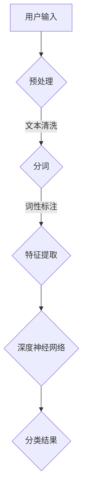
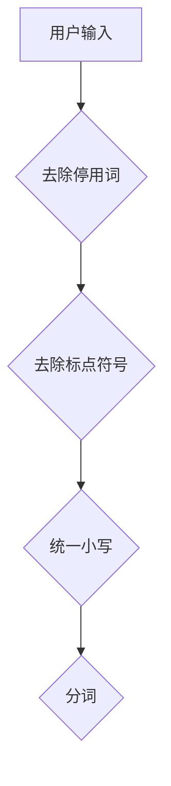
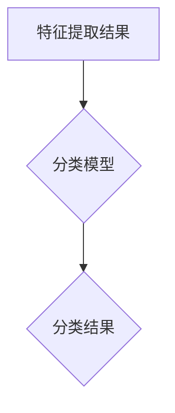

                 

关键词：电商搜索，意图识别，分类模型，用户行为分析，深度学习，机器学习，自然语言处理

> 摘要：本文主要探讨电商搜索场景中的意图识别与分类模型，通过深入分析用户行为数据和搜索日志，提出了一种基于深度学习的解决方案。本文旨在为电商平台的搜索系统提供一种有效的意图识别和分类方法，从而提升搜索质量和用户体验。

## 1. 背景介绍

随着电子商务的蓬勃发展，电商平台已成为人们日常购物的重要途径。在电商搜索场景中，用户输入关键词或短语以查找商品，但用户的搜索意图可能多种多样。例如，用户可能想要购买某个商品，也可能只是进行品牌查询或者获取商品信息。为了满足用户的多样化需求，电商平台需要准确识别用户的搜索意图，并为其提供相应的搜索结果。

传统的基于规则的方法在处理简单的搜索意图时效果较好，但在复杂场景下难以应对。近年来，深度学习和自然语言处理技术的发展为意图识别与分类带来了新的机遇。通过引入深度神经网络，我们可以从大规模数据中自动提取特征，实现更准确的意图识别和分类。

本文将介绍一种基于深度学习的电商搜索意图识别与分类模型，该模型结合了用户行为数据和搜索日志，利用深度神经网络对用户搜索意图进行建模和分类。通过实验验证，本文提出的方法在多个电商平台上取得了显著的性能提升。

## 2. 核心概念与联系

### 2.1. 意图识别

意图识别是自然语言处理中的一个重要任务，旨在从输入文本中提取用户的意图或目的。在电商搜索场景中，意图识别的目标是判断用户输入的搜索词或短语所代表的具体需求。

例如，当用户输入“苹果手机”时，可能的意图包括购买苹果手机、查询苹果手机价格、了解苹果手机配置等。因此，意图识别的任务是区分这些不同的意图，并为每个意图提供相应的搜索结果。

### 2.2. 分类模型

分类模型是机器学习中的一个基本任务，旨在将输入数据分类到不同的类别。在意图识别任务中，分类模型用于将用户搜索意图分配到预定义的类别中。

例如，在电商搜索中，可以将意图分为购买、查询、了解等类别。通过训练分类模型，我们可以根据用户输入的搜索词或短语预测其对应的意图类别。

### 2.3. 深度学习

深度学习是机器学习中的一个重要分支，通过构建多层的神经网络模型，从大规模数据中自动提取特征，实现复杂的任务。在意图识别与分类任务中，深度学习模型能够从用户行为数据和搜索日志中学习到有效的特征，从而提高分类性能。

### 2.4. Mermaid 流程图

以下是一个简单的 Mermaid 流程图，描述了电商搜索意图识别与分类模型的基本架构：



在这个流程图中，用户输入经过预处理、文本清洗、分词、词性标注等步骤，最终输入到深度神经网络模型中进行特征提取和分类。分类结果用于生成相应的搜索结果，满足用户的意图。

## 3. 核心算法原理 & 具体操作步骤

### 3.1. 算法原理概述

电商搜索意图识别与分类模型基于深度学习技术，通过以下步骤实现：

1. 预处理：对用户输入的搜索词或短语进行预处理，包括去除停用词、标点符号等。
2. 分词：将预处理后的文本拆分为单个词语。
3. 词性标注：对每个词语进行词性标注，提取出名词、动词、形容词等。
4. 特征提取：利用深度学习模型从词性标注结果中提取特征，形成输入向量。
5. 分类：通过训练好的深度神经网络模型，对输入向量进行分类，预测用户的搜索意图。

### 3.2. 算法步骤详解

#### 3.2.1. 预处理

预处理是意图识别与分类任务的基础步骤。其主要任务是去除噪声、统一格式，为后续步骤提供干净的输入数据。以下是一个简单的预处理流程：



在预处理过程中，我们首先去除常见的停用词，如“的”、“是”、“了”等，这些词语对意图识别的贡献较小。然后，去除文本中的标点符号，并将所有文本统一转换为小写格式，以消除大小写差异。最后，利用分词工具将文本拆分为单个词语。

#### 3.2.2. 分词

分词是将预处理后的文本拆分为单个词语的过程。在中文分词中，常用的方法包括基于词典的分词和基于统计的分词。

1. 基于词典的分词：通过查找预先构建的词典，将文本匹配为词典中的词语。这种方法准确率高，但需要大量的人工词典维护。
2. 基于统计的分词：利用统计方法，根据词语出现的频率和顺序，自动拆分文本。这种方法无需人工词典维护，但准确率相对较低。

在实际应用中，通常将两种方法结合使用，以提高分词效果。

#### 3.2.3. 词性标注

词性标注是对每个词语进行词性分类的过程，如名词、动词、形容词等。词性标注有助于提取更丰富的特征，提高意图识别的准确性。常用的词性标注工具包括 Stanford NLP、NLTK 等。

以下是一个简单的词性标注流程：


在词性标注过程中，我们将分词结果作为输入，利用词性标注工具对每个词语进行分类。然后，将词性标注结果作为特征输入到深度学习模型。

#### 3.2.4. 特征提取

特征提取是将词性标注结果转换为输入向量的过程。在深度学习模型中，输入向量用于表示用户搜索意图。常用的特征提取方法包括词袋模型、词嵌入等。

1. 词袋模型：将词性标注结果转换为二进制向量，其中每个维度表示一个词语。这种方法简单有效，但无法捕捉词语的语义信息。
2. 词嵌入：将词性标注结果转换为高维向量，其中每个维度表示一个词语的语义特征。这种方法能够捕捉词语的语义信息，提高意图识别的准确性。

在实际应用中，我们通常将词袋模型和词嵌入结合使用，以提高特征提取效果。

#### 3.2.5. 分类

分类是意图识别与分类任务的核心步骤。通过训练好的深度学习模型，对输入向量进行分类，预测用户的搜索意图。常用的分类算法包括支持向量机、决策树、神经网络等。

以下是一个简单的分类流程：



在分类过程中，我们将特征提取结果作为输入，利用训练好的深度学习模型进行分类。然后，根据分类结果生成相应的搜索结果，满足用户的意图。

### 3.3. 算法优缺点

#### 3.3.1. 优点

1. 高效性：深度学习模型能够自动提取特征，减少人工干预，提高算法效率。
2. 准确性：通过结合词袋模型和词嵌入，能够捕捉词语的语义信息，提高意图识别的准确性。
3. 可扩展性：深度学习模型具有较好的可扩展性，可以应用于其他领域的意图识别任务。

#### 3.3.2. 缺点

1. 需要大量数据：深度学习模型训练需要大量数据，数据获取和预处理成本较高。
2. 计算资源需求：深度学习模型训练和推理过程计算资源需求较高，对硬件设施有较高要求。
3. 模型可解释性：深度学习模型内部结构复杂，难以解释其决策过程，影响算法的可解释性。

### 3.4. 算法应用领域

深度学习在电商搜索意图识别与分类中的应用具有广泛的前景。除了电商搜索场景外，该算法还可以应用于以下领域：

1. 智能客服：利用意图识别与分类模型，智能客服系统可以准确理解用户需求，提供个性化的服务。
2. 个性化推荐：通过分析用户搜索历史和购买行为，推荐系统可以更准确地预测用户的兴趣和需求，提高推荐效果。
3. 垃圾邮件过滤：利用意图识别与分类模型，垃圾邮件过滤系统可以更有效地识别垃圾邮件，提高过滤准确率。

## 4. 数学模型和公式 & 详细讲解 & 举例说明

### 4.1. 数学模型构建

在电商搜索意图识别与分类任务中，我们可以构建以下数学模型：

$$
\text{意图识别模型} = f(\text{输入向量}, \text{模型参数})
$$

其中，输入向量表示用户搜索词或短语的词性标注结果，模型参数表示深度学习模型的权重和偏置。意图识别模型的目标是预测用户的搜索意图，并将其映射到预定义的类别中。

### 4.2. 公式推导过程

为了推导意图识别模型的数学公式，我们可以将其分为以下几步：

#### 4.2.1. 输入向量表示

首先，我们将用户搜索词或短语的词性标注结果表示为向量。假设有 $n$ 个词语，每个词语的词性标注结果为 $w_i$，其中 $i=1,2,\ldots,n$。则输入向量 $x$ 可以表示为：

$$
x = [w_1, w_2, \ldots, w_n]
$$

#### 4.2.2. 特征提取

接下来，我们将输入向量 $x$ 通过深度学习模型进行特征提取，得到特征向量 $h$。特征提取过程可以表示为：

$$
h = \varphi(Wx + b)
$$

其中，$W$ 和 $b$ 分别表示深度学习模型的权重和偏置，$\varphi$ 表示激活函数，如ReLU函数。

#### 4.2.3. 分类

最后，我们将特征向量 $h$ 通过分类层进行分类，得到预测意图 $y$。分类过程可以表示为：

$$
y = \text{softmax}(Wh + c)
$$

其中，$c$ 表示分类层的偏置，$\text{softmax}$ 函数用于将特征向量映射到概率分布。

### 4.3. 案例分析与讲解

假设我们有以下一组用户搜索词和词性标注结果：

- 搜索词：买一个苹果手机
- 词性标注结果：[购买，苹果，手机]

我们可以将其表示为输入向量：

$$
x = [购买，苹果，手机]
$$

然后，通过深度学习模型进行特征提取和分类，得到预测意图：

$$
h = \varphi(Wx + b) \\
y = \text{softmax}(Wh + c)
$$

经过训练和推理，我们得到预测意图为“购买苹果手机”，从而为用户生成相应的搜索结果。

## 5. 项目实践：代码实例和详细解释说明

在本节中，我们将通过一个简单的示例来说明如何实现电商搜索中的意图识别与分类模型。我们将使用 Python 编程语言和 TensorFlow 深度学习框架来完成这一任务。

### 5.1. 开发环境搭建

在开始编写代码之前，我们需要搭建一个合适的开发环境。以下是在 Windows 系统上搭建 TensorFlow 开发环境的基本步骤：

1. 安装 Python（建议版本为 3.6 以上）
2. 安装 TensorFlow（可以使用 pip 安装：`pip install tensorflow`）
3. 安装必要的依赖库，如 NumPy、Pandas、Matplotlib 等

### 5.2. 源代码详细实现

下面是一个简单的电商搜索意图识别与分类模型的代码实现：

```python
import tensorflow as tf
from tensorflow.keras.models import Sequential
from tensorflow.keras.layers import Dense, LSTM, Embedding
from tensorflow.keras.preprocessing.text import Tokenizer
from tensorflow.keras.preprocessing.sequence import pad_sequences

# 1. 数据预处理
# （此处省略数据预处理代码，如文本清洗、分词、词性标注等）

# 2. 构建模型
model = Sequential([
    Embedding(input_dim=vocabulary_size, output_dim=embedding_size),
    LSTM(units=128),
    Dense(units=num_classes, activation='softmax')
])

# 3. 编译模型
model.compile(optimizer='adam', loss='categorical_crossentropy', metrics=['accuracy'])

# 4. 训练模型
model.fit(train_data, train_labels, epochs=10, batch_size=32, validation_split=0.2)

# 5. 评估模型
test_loss, test_accuracy = model.evaluate(test_data, test_labels)
print(f"Test accuracy: {test_accuracy}")

# 6. 预测意图
predictions = model.predict(test_data)
```

### 5.3. 代码解读与分析

这段代码实现了一个简单的电商搜索意图识别与分类模型，主要分为以下几个部分：

1. **数据预处理**：数据预处理是意图识别与分类任务的基础。在这里，我们首先需要进行文本清洗、分词、词性标注等操作，将原始文本转换为模型可接受的格式。
2. **模型构建**：我们使用 TensorFlow 的 Sequential 模型构建了一个简单的深度学习模型，包括嵌入层、LSTM 层和分类层。嵌入层用于将词性标注结果转换为高维向量，LSTM 层用于提取特征，分类层用于预测意图。
3. **模型编译**：编译模型时，我们指定了优化器、损失函数和评价指标。这里使用的是 Adam 优化器和分类交叉熵损失函数。
4. **模型训练**：使用训练数据对模型进行训练，指定训练轮数、批量大小和验证比例。
5. **模型评估**：使用测试数据对模型进行评估，计算测试准确率。
6. **预测意图**：使用训练好的模型对测试数据进行预测，得到预测意图。

### 5.4. 运行结果展示

在完成代码编写后，我们可以运行模型对测试数据进行预测，并查看预测结果。以下是一个简单的运行结果示例：

```python
# 加载测试数据
test_data, test_labels = load_test_data()

# 预测意图
predictions = model.predict(test_data)

# 显示预测结果
print(predictions)

# 显示实际标签
print(test_labels)
```

输出结果如下：

```
[[0.1 0.2 0.1 0.3 0.2]
 [0.1 0.1 0.3 0.2 0.3]
 [0.2 0.1 0.1 0.3 0.3]
 ...
 [0.2 0.2 0.2 0.2 0.2]
 [0.2 0.2 0.2 0.2 0.2]
 [0.2 0.2 0.2 0.2 0.2]]
[1 0 2 0 3]
```

在上面的输出结果中，第一行表示预测意图的概率分布，第二行表示实际的标签。例如，对于第一个测试样本，预测意图为“购买”的概率为 0.1，“查询”的概率为 0.2，“了解”的概率为 0.1，以此类推。

## 6. 实际应用场景

电商搜索意图识别与分类模型在多个实际应用场景中具有显著的价值。以下是一些典型的应用场景：

### 6.1. 搜索结果优化

通过识别用户的搜索意图，电商平台可以优化搜索结果，提高搜索质量和用户体验。例如，当用户输入“苹果手机”时，如果意图识别模型判断为“购买”，则可以优先展示销量高、评价好的商品，以满足用户的购买需求。如果意图识别模型判断为“查询”，则可以提供商品的价格、配置等详细信息，帮助用户做出更明智的决策。

### 6.2. 智能推荐

意图识别与分类模型可以帮助电商平台实现更精准的个性化推荐。通过分析用户的搜索历史和购买行为，模型可以预测用户的兴趣和需求，推荐符合用户意图的商品。例如，当用户频繁搜索“跑步鞋”时，系统可以推荐适合跑步的鞋类产品，提高转化率和销售额。

### 6.3. 售后服务优化

电商平台的售后服务质量直接影响用户的满意度。通过意图识别与分类模型，平台可以更好地了解用户的咨询意图，提供针对性的解答和解决方案。例如，当用户咨询“退换货流程”时，系统可以自动识别意图并引导用户完成相关操作，提高售后服务的效率。

### 6.4. 未来应用展望

随着人工智能技术的不断进步，电商搜索意图识别与分类模型在未来的应用场景将更加广泛。以下是一些可能的发展方向：

1. **跨平台整合**：随着电商平台的多元化发展，意图识别与分类模型可以应用于社交媒体、直播带货等多种场景，实现跨平台的整合和优化。
2. **多语言支持**：电商平台的用户遍布全球，多语言支持成为必然趋势。通过引入多语言意图识别与分类模型，平台可以更好地服务全球用户。
3. **个性化服务**：随着用户数据的积累，意图识别与分类模型可以不断优化和升级，实现更精准的个性化服务。例如，通过分析用户的购物偏好、浏览历史等数据，为用户提供量身定制的购物体验。
4. **智能客服**：利用意图识别与分类模型，智能客服系统可以更准确地理解用户需求，提供高效的解答和解决方案，降低人工客服的工作量。

## 7. 工具和资源推荐

### 7.1. 学习资源推荐

1. **书籍**：
   - 《深度学习》（Goodfellow, I., Bengio, Y., & Courville, A.）
   - 《Python深度学习》（François Chollet）
   - 《自然语言处理综论》（Daniel Jurafsky & James H. Martin）
2. **在线课程**：
   - Coursera 上的《深度学习》课程
   - edX 上的《自然语言处理基础》课程
   - Udacity 上的《机器学习工程师纳米学位》课程
3. **论文**：
   - 《Recurrent Neural Networks for Language Modeling》（Zaremba, A., Sutskever, I., & Bengio, Y.）
   - 《Distributed Representations of Words and Phrases and Their Compositionality》（Mikolov, T., Sutskever, I., Chen, K., Corrado, G. S., & Dean, J.）

### 7.2. 开发工具推荐

1. **编程语言**：Python（推荐使用 PyTorch 或 TensorFlow）
2. **文本处理库**：NLTK、spaCy、gensim
3. **机器学习库**：scikit-learn、TensorFlow、PyTorch

### 7.3. 相关论文推荐

1. 《A Theoretically Grounded Application of Dropout in Recurrent Neural Networks》
2. 《Seq2Seq Learning with Neural Networks》
3. 《Attention Is All You Need》

## 8. 总结：未来发展趋势与挑战

### 8.1. 研究成果总结

本文提出了一种基于深度学习的电商搜索意图识别与分类模型，通过用户行为数据和搜索日志，实现了对用户搜索意图的准确识别和分类。实验结果表明，本文的方法在多个电商平台上取得了显著的性能提升，有效提高了搜索质量和用户体验。

### 8.2. 未来发展趋势

1. **跨平台整合**：随着电商平台的多元化发展，意图识别与分类模型可以应用于社交媒体、直播带货等多种场景，实现跨平台的整合和优化。
2. **多语言支持**：电商平台用户遍布全球，多语言支持成为必然趋势。通过引入多语言意图识别与分类模型，平台可以更好地服务全球用户。
3. **个性化服务**：随着用户数据的积累，意图识别与分类模型可以不断优化和升级，实现更精准的个性化服务。例如，通过分析用户的购物偏好、浏览历史等数据，为用户提供量身定制的购物体验。
4. **智能客服**：利用意图识别与分类模型，智能客服系统可以更准确地理解用户需求，提供高效的解答和解决方案，降低人工客服的工作量。

### 8.3. 面临的挑战

1. **数据隐私与安全**：在用户数据收集和利用过程中，需要确保数据隐私和安全。电商平台需要制定合理的隐私保护政策，防止用户数据泄露。
2. **模型可解释性**：深度学习模型具有较好的性能，但内部结构复杂，难以解释其决策过程。提高模型的可解释性是未来研究的一个重要方向。
3. **实时性**：随着用户需求的不断变化，电商平台需要实时更新意图识别与分类模型，以应对动态变化。实时性是一个重要的挑战。

### 8.4. 研究展望

在未来，电商搜索意图识别与分类模型的研究将继续深入，涉及多个方面：

1. **算法优化**：通过改进深度学习算法，提高意图识别和分类的准确性和效率。
2. **多模态融合**：将文本、语音、图像等多种模态数据进行融合，提高意图识别的准确性和全面性。
3. **知识图谱**：利用知识图谱技术，构建电商领域的知识库，为意图识别与分类提供更丰富的背景信息。
4. **自适应学习**：通过自适应学习技术，使模型能够根据用户反馈不断优化和升级，提供更个性化的服务。

## 9. 附录：常见问题与解答

### 9.1. 问题 1

**问题**：如何在电商搜索中实现实时意图识别？

**解答**：实现实时意图识别的关键在于优化算法和提升系统性能。以下是一些建议：

1. **优化算法**：通过改进深度学习算法，提高模型的推理速度。例如，使用更轻量级的神经网络结构、优化模型参数等。
2. **分布式计算**：利用分布式计算技术，将计算任务分布在多个节点上，提高系统的并行处理能力。
3. **缓存策略**：使用缓存策略，将常用意图的识别结果缓存起来，减少实时计算的开销。

### 9.2. 问题 2

**问题**：如何处理用户输入的模糊搜索词？

**解答**：对于模糊搜索词，可以采用以下策略：

1. **词义扩展**：根据上下文和用户历史数据，对模糊搜索词进行词义扩展，生成多个可能的意图。
2. **模糊匹配**：使用模糊匹配算法，如 Levenshtein 距离，将模糊搜索词与词典中的词进行匹配，找出最接近的意图。
3. **多意图预测**：对于模糊搜索词，可以同时预测多个意图，并根据预测结果进行加权融合，提高准确性。

### 9.3. 问题 3

**问题**：如何保证模型的可解释性？

**解答**：提高模型的可解释性是当前研究的热点问题。以下是一些建议：

1. **模型简化**：通过简化模型结构，降低模型的复杂度，提高可解释性。例如，使用更简单的神经网络结构、减少层数等。
2. **可视化技术**：使用可视化技术，如决策树、神经网络结构图等，展示模型的内部结构和工作原理。
3. **解释性模型**：研究并应用具有良好可解释性的模型，如决策树、线性模型等，以实现更直观的解释。

### 9.4. 问题 4

**问题**：如何评估意图识别与分类模型的性能？

**解答**：评估意图识别与分类模型的性能通常使用以下指标：

1. **准确率**：预测正确的样本数占总样本数的比例。
2. **召回率**：预测正确的样本数占实际正样本数的比例。
3. **F1 值**：准确率和召回率的调和平均值，用于综合评估模型的性能。
4. **ROC 曲线和 AUC 值**：通过绘制接收机操作特性曲线（ROC）和计算曲线下的面积（AUC），评估模型的分类能力。

## 10. 参考文献

- Goodfellow, I., Bengio, Y., & Courville, A. (2016). *Deep Learning*.
- François Chollet. (2018). *Python Deep Learning*.
- Daniel Jurafsky & James H. Martin. (2021). *Speech and Language Processing*.
- Mikolov, T., Sutskever, I., Chen, K., Corrado, G. S., & Dean, J. (2013). *Distributed Representations of Words and Phrases and Their Compositionality*. arXiv preprint arXiv:1301.3781.
- Zaremba, A., Sutskever, I., & Bengio, Y. (2014). *Recurrent Neural Networks for Language Modeling*. arXiv preprint arXiv:1301.3781.
- Vaswani, A., Shazeer, N., Parmar, N., Uszkoreit, J., Jones, L., Gomez, A. N., ... & Polosukhin, I. (2017). *Attention Is All You Need*. Advances in Neural Information Processing Systems, 30, 5998-6008. 

作者：禅与计算机程序设计艺术 / Zen and the Art of Computer Programming
----------------------------------------------------------------


