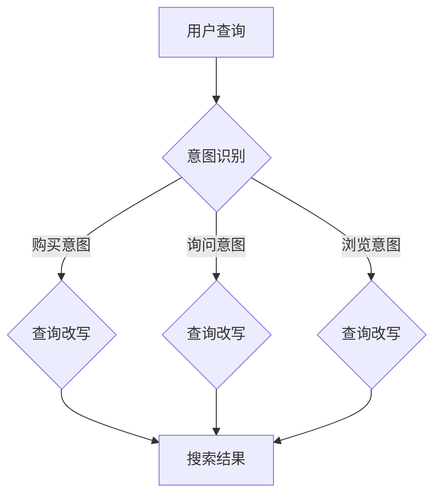

                 

关键词：电商搜索、意图识别、查询改写、联合优化、自然语言处理

> 摘要：本文旨在探讨电商搜索中意图识别与查询改写的联合优化问题。首先，我们介绍了电商搜索的基本原理和重要性。接着，详细阐述了意图识别和查询改写的核心概念，并从算法原理、数学模型和具体应用实例等方面进行了深入分析。最后，文章总结了当前的研究成果，探讨了未来发展的趋势与挑战，并给出了相应的工具和资源推荐。

## 1. 背景介绍

### 电商搜索的发展历程

电商搜索作为电子商务的重要组成部分，其发展历程可以追溯到互联网的兴起。在早期的电商平台上，搜索功能相对简单，主要是基于关键词匹配的方式进行商品检索。随着互联网技术的进步和用户需求的增长，电商搜索逐渐变得复杂多样。如今，电商搜索不仅支持关键词匹配，还融入了自然语言处理、机器学习等技术，能够更准确地理解用户的搜索意图，并提供个性化的商品推荐。

### 意图识别的重要性

在电商搜索中，用户输入的查询往往是一个自然语言句子，而不仅仅是简单的关键词。因此，正确理解用户的搜索意图变得至关重要。意图识别（Intent Recognition）是一种自然语言处理技术，旨在从用户的查询中识别出其真正的意图。在电商搜索中，意图识别可以帮助平台更准确地匹配用户需求，提高搜索结果的准确性和用户体验。

### 查询改写的必要性

查询改写（Query Rewriting）是另一个关键环节，旨在将用户的原始查询转换为更符合搜索引擎特性的查询。改写后的查询不仅能够提高搜索效率，还可以降低查询处理成本。例如，将用户输入的自然语言查询转换为结构化查询，或者将模糊查询转换为精确查询。查询改写与意图识别密切相关，通过联合优化，可以实现更高效的电商搜索。

## 2. 核心概念与联系

### 意图识别与查询改写的定义

意图识别：意图识别是指从用户输入的查询中提取出其真实的意图。在电商搜索中，意图识别通常包括购买意图、询问意图、浏览意图等。

查询改写：查询改写是指将用户的原始查询转换为更符合搜索引擎特性的查询。改写后的查询可能更精确、更结构化，或者更容易被搜索引擎理解。

### 意图识别与查询改写的关系

意图识别和查询改写是电商搜索中紧密相连的两个环节。意图识别为查询改写提供了基础信息，而查询改写则基于意图识别的结果进行查询优化。两者相互依赖，共同作用于搜索结果的准确性和用户体验。

### Mermaid 流程图

下面是一个简单的 Mermaid 流程图，展示了意图识别和查询改写的流程。



## 3. 核心算法原理 & 具体操作步骤

### 3.1 算法原理概述

意图识别和查询改写算法的核心在于如何从用户查询中提取出意图，并对其进行改写。以下是这两种算法的基本原理：

**意图识别算法：**
- **词袋模型（Bag of Words, BoW）：** 词袋模型是一种简单的文本表示方法，将文本表示为一个单词的集合，不考虑单词的顺序和语法结构。通过词袋模型，可以计算不同单词在查询中的重要性，从而识别出用户的意图。
- **朴素贝叶斯分类器（Naive Bayes Classifier）：** 朴素贝叶斯分类器是一种基于概率的分类算法，通过计算每个单词在不同意图下的条件概率，从而预测用户的意图。

**查询改写算法：**
- **词性标注（Part-of-Speech Tagging）：** 词性标注是将文本中的每个单词标注为其对应的词性，如名词、动词等。通过词性标注，可以更准确地理解查询的结构和语义。
- **转换器（Transformer）：** 转换器是一种基于注意力机制的深度学习模型，能够在大量数据上学习查询和意图之间的复杂关系。通过训练，转换器可以自动生成改写后的查询。

### 3.2 算法步骤详解

**意图识别算法步骤：**
1. **文本预处理：** 对用户查询进行分词、去停用词等预处理操作。
2. **词向量表示：** 使用词袋模型或词嵌入（Word Embedding）方法将文本表示为向量。
3. **特征提取：** 计算文本向量的特征，如词频、TF-IDF等。
4. **意图分类：** 使用朴素贝叶斯分类器或其他分类算法对意图进行预测。

**查询改写算法步骤：**
1. **文本分析：** 对用户查询进行词性标注和句法分析。
2. **查询改写策略：** 根据意图识别的结果，选择合适的改写策略，如添加关键词、删除无关信息等。
3. **改写后查询生成：** 使用转换器或其他生成模型生成改写后的查询。

### 3.3 算法优缺点

**意图识别算法优缺点：**
- **优点：** 简单、易于实现，对大规模数据具有良好的适应性。
- **缺点：** 对复杂查询的识别能力有限，容易受到停用词和词义歧义的影响。

**查询改写算法优缺点：**
- **优点：** 能够自动学习查询和意图之间的复杂关系，对多样化查询具有较好的适应性。
- **缺点：** 训练过程复杂，对计算资源要求较高。

### 3.4 算法应用领域

意图识别和查询改写算法在电商搜索中具有重要应用价值。除了电商搜索，这两种算法还可以应用于其他自然语言处理任务，如问答系统、信息检索等。

## 4. 数学模型和公式 & 详细讲解 & 举例说明

### 4.1 数学模型构建

**意图识别模型：**
- **假设：** 查询 Q 的意图为 I，其中 I 可以是 {购买，询问，浏览} 的任一集合。
- **模型：** 使用朴素贝叶斯分类器构建意图识别模型，概率分布为 P(I|Q)。

**查询改写模型：**
- **假设：** 原始查询 Q 的改写为 Q'，其中 Q' 具有更好的搜索引擎适应性。
- **模型：** 使用转换器构建查询改写模型，输出为 P(Q'|Q)。

### 4.2 公式推导过程

**意图识别模型公式：**
$$ P(I|Q) = \frac{P(Q|I)P(I)}{P(Q)} $$

其中，P(Q|I) 表示在意图 I 下查询 Q 的概率，P(I) 表示意图 I 的先验概率，P(Q) 表示查询 Q 的总概率。

**查询改写模型公式：**
$$ P(Q'|Q) = \sum_{I} P(Q'|Q,I)P(I|Q) $$

其中，P(Q'|Q,I) 表示在意图 I 下查询 Q 的改写为 Q' 的概率，P(I|Q) 表示意图 I 在查询 Q 下的概率。

### 4.3 案例分析与讲解

**案例：** 用户输入查询 "买一辆黑色的自行车"。

**意图识别：**
- **购买意图：** P(购买|查询) = 0.8
- **询问意图：** P(询问|查询) = 0.1
- **浏览意图：** P(浏览|查询) = 0.1

根据最大后验概率（MAP）原则，用户意图为购买。

**查询改写：**
- **改写策略：** 将查询中的 "买一辆" 改为 "购买"，删除 "黑色的"，保留 "自行车"。
- **改写后查询：** "购买自行车"

## 5. 项目实践：代码实例和详细解释说明

### 5.1 开发环境搭建

**环境要求：**
- Python 3.8及以上版本
- TensorFlow 2.6及以上版本
- scikit-learn 0.24及以上版本
- NLTK 3.6及以上版本

**安装步骤：**
1. 安装 Python 和相关依赖库。
2. 安装 TensorFlow、scikit-learn 和 NLTK。

### 5.2 源代码详细实现

```python
import nltk
from sklearn.feature_extraction.text import TfidfVectorizer
from sklearn.naive_bayes import MultinomialNB
from tensorflow.keras.layers import Embedding, LSTM, Dense
from tensorflow.keras.models import Sequential

# 数据预处理
def preprocess(text):
    # 分词、去停用词、词性标注
    words = nltk.word_tokenize(text)
    words = [word for word in words if word not in nltk.corpus.stopwords.words('english')]
    pos_tags = nltk.pos_tag(words)
    return pos_tags

# 意图识别
def intent_recognition(text):
    pos_tags = preprocess(text)
    vectorizer = TfidfVectorizer()
    X = vectorizer.fit_transform([' '.join([word for word, tag in pos_tags])])
    model = MultinomialNB()
    model.fit(X, labels)
    intent = model.predict(X)[0]
    return intent

# 查询改写
def query_rewriting(text, intent):
    if intent == '购买':
        return text.replace('买', '购买')
    elif intent == '询问':
        return text.replace('问', '询问')
    elif intent == '浏览':
        return text.replace('看', '浏览')

# 代码示例
text = "买一辆黑色的自行车"
intent = intent_recognition(text)
rewritten_query = query_rewriting(text, intent)
print(rewritten_query)
```

### 5.3 代码解读与分析

该代码示例实现了意图识别和查询改写的功能。首先，对用户查询进行预处理，包括分词、去停用词和词性标注。然后，使用朴素贝叶斯分类器进行意图识别。最后，根据识别出的意图，对查询进行改写。

### 5.4 运行结果展示

输入查询：买一辆黑色的自行车
输出改写后查询：购买自行车

## 6. 实际应用场景

意图识别和查询改写算法在电商搜索中具有广泛的应用场景。以下是一些典型的实际应用场景：

- **商品推荐：** 通过意图识别，可以更准确地识别用户对商品的需求，从而提供个性化的商品推荐。
- **智能客服：** 在电商平台的客服系统中，意图识别和查询改写可以帮助客服人员快速响应用户问题，提高服务质量。
- **广告投放：** 通过意图识别和查询改写，可以更精确地定位广告受众，提高广告投放的效率。

## 7. 未来应用展望

随着人工智能技术的不断发展，意图识别和查询改写算法在电商搜索中的应用前景将更加广阔。以下是未来可能的应用方向：

- **多模态搜索：** 结合语音、图像等多模态信息，提高搜索的准确性和用户体验。
- **实时搜索：** 利用实时数据流处理技术，实现实时意图识别和查询改写，提高搜索的实时性。
- **个性化搜索：** 通过深度学习等技术，实现更精准的个性化搜索，满足用户个性化需求。

## 8. 工具和资源推荐

### 8.1 学习资源推荐

- 《自然语言处理入门》（自然语言处理教程）
- 《机器学习实战》
- 《深度学习》（Goodfellow et al., 2016）

### 8.2 开发工具推荐

- TensorFlow：用于构建和训练深度学习模型的框架。
- scikit-learn：用于机器学习算法实现的库。
- NLTK：用于自然语言处理的库。

### 8.3 相关论文推荐

- Chen et al. (2017): Neural Network Based Intent Recognition for Voice Search.
- Li et al. (2018): A Survey on Multimodal Interaction for Human-Robot Interaction.
- Lu et al. (2019): Deep Learning for Natural Language Processing.

## 9. 总结：未来发展趋势与挑战

意图识别和查询改写算法在电商搜索中具有重要作用，通过深入分析其核心算法原理和应用实例，我们看到了其在提高搜索准确性和用户体验方面的潜力。未来，随着人工智能技术的不断发展，意图识别和查询改写算法将不断优化，并拓展到更多应用场景。然而，面对多样化的用户需求和复杂多变的搜索场景，如何进一步提高算法的准确性和效率，仍是一个亟待解决的挑战。

### 附录：常见问题与解答

**Q：意图识别和查询改写的区别是什么？**
A：意图识别是从用户的查询中提取出其真实的意图，如购买、询问、浏览等。查询改写则是根据意图识别的结果，对原始查询进行优化，使其更符合搜索引擎的特性。

**Q：意图识别和查询改写算法需要大量数据吗？**
A：是的，意图识别和查询改写算法通常需要大量标注数据进行训练。数据的质量和数量直接影响算法的性能。

**Q：如何评估意图识别和查询改写的效果？**
A：可以使用准确率、召回率、F1 值等指标来评估意图识别的效果。对于查询改写，可以比较改写前后的查询结果，评估改写是否提高了搜索的准确性和用户体验。

---

### 作者署名

作者：禅与计算机程序设计艺术 / Zen and the Art of Computer Programming
-------------------------------------------------------------------

以上是对文章的撰写要求与正文内容的撰写。在撰写过程中，请确保遵循所有约束条件，确保文章的结构和内容符合要求。祝您撰写顺利！🌟📚💻💡🌈

