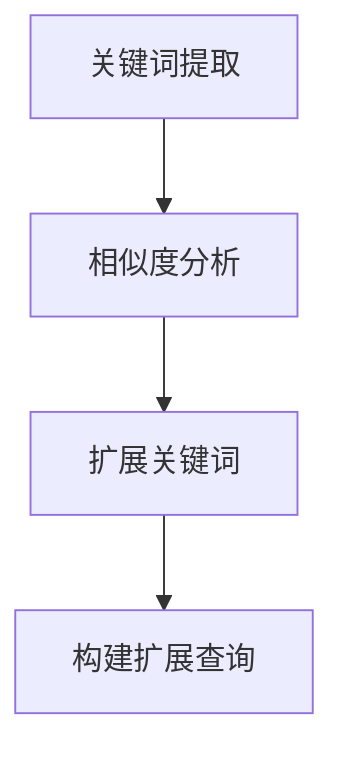
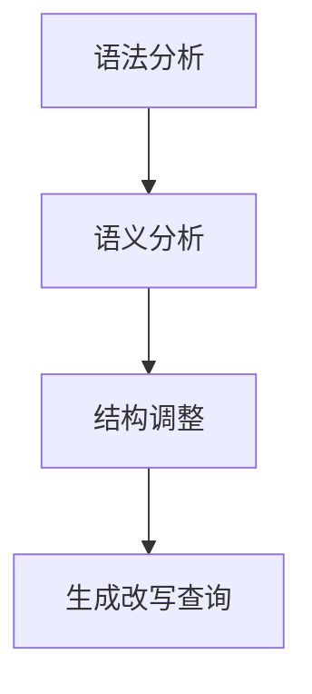
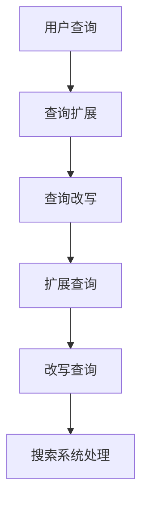

                 

 查询扩展与改写技术在电商搜索中扮演着至关重要的角色，它们能够显著提高搜索系统的精确性和用户体验。本文将深入探讨电商搜索中的查询扩展与改写技术，从背景介绍、核心概念、算法原理、数学模型、项目实践和未来展望等多个角度进行分析，旨在为读者提供全面的技术理解和应用指导。

## 文章关键词

- 电商搜索
- 查询扩展
- 查询改写
- 自然语言处理
- 信息检索
- 用户体验

## 文章摘要

本文详细介绍了电商搜索中的查询扩展与改写技术，包括其核心概念、算法原理、数学模型和实际应用。文章首先回顾了电商搜索的背景和重要性，然后深入分析了查询扩展和改写的理论基础，并结合具体案例展示了算法的具体实现和效果。最后，文章展望了未来发展趋势和面临的挑战，为电商搜索技术的发展提供了参考。

## 1. 背景介绍

随着互联网的普及和电子商务的蓬勃发展，电商搜索已经成为用户获取商品信息的重要途径。传统的电商搜索系统主要依赖于关键词匹配技术，这种技术简单直接，但在应对复杂的用户查询需求时存在一定局限性。因此，查询扩展与改写技术应运而生，它通过对用户查询进行扩展和改写，能够提高搜索结果的准确性和相关性，从而提升用户体验。

查询扩展（Query Expansion）是指通过增加新的关键词或短语来丰富原始查询，以获取更广泛的搜索结果。查询改写（Query Rewriting）则是指对原始查询进行结构上的调整，以使其更符合搜索系统的处理规则。这两种技术相辅相成，共同构成了现代电商搜索系统中重要的组成部分。

### 1.1 电商搜索的发展历程

电商搜索的发展大致可以分为三个阶段：

1. **关键词匹配阶段**：这是最早的电商搜索模式，主要通过用户输入的关键词与商品库中的关键词进行匹配，实现基本的搜索功能。

2. **基于语义的阶段**：随着自然语言处理技术的进步，电商搜索开始引入语义分析，通过理解用户查询的意图，提供更加精准的搜索结果。

3. **个性化搜索阶段**：个性化搜索通过分析用户的历史行为和偏好，为用户提供个性化的搜索结果，进一步提升了用户体验。

### 1.2 查询扩展与改写技术的优势

- **提高搜索结果的准确性**：通过扩展和改写用户查询，可以覆盖更多的关键词和语义，从而提高搜索结果的准确性。

- **提升用户体验**：精确的搜索结果能够减少用户的等待时间，提高用户满意度。

- **增加商业价值**：准确的搜索结果能够引导用户更快地找到所需商品，增加购买的可能性，从而提升电商平台的商业价值。

### 1.3 本文结构

本文将分为以下几个部分：

- **第1部分：背景介绍**：回顾电商搜索的发展历程，介绍查询扩展与改写技术的基本概念和重要性。

- **第2部分：核心概念与联系**：阐述查询扩展与改写技术的基本原理，并提供相关的Mermaid流程图。

- **第3部分：核心算法原理 & 具体操作步骤**：详细介绍查询扩展与改写算法的原理和操作步骤。

- **第4部分：数学模型和公式 & 详细讲解 & 举例说明**：介绍相关数学模型和公式，并通过案例进行分析。

- **第5部分：项目实践：代码实例和详细解释说明**：展示具体的代码实现和解释。

- **第6部分：实际应用场景**：探讨查询扩展与改写技术在电商搜索中的应用场景。

- **第7部分：未来应用展望**：分析未来发展趋势和面临的挑战。

- **第8部分：总结：未来发展趋势与挑战**：总结研究成果，提出未来展望。

- **第9部分：附录：常见问题与解答**：解答读者可能遇到的问题。

## 2. 核心概念与联系

### 2.1 查询扩展（Query Expansion）

查询扩展是指通过增加新的关键词或短语来丰富原始查询，以提高搜索结果的准确性。查询扩展的目标是扩展查询的范围，使其能够匹配更多的相关文档或商品。

#### 2.1.1 工作原理

查询扩展的基本原理是通过分析原始查询和相关的文档或商品，识别出潜在的相关关键词或短语，并将其添加到原始查询中。这个过程通常包括以下几个步骤：

1. **关键词提取**：从原始查询中提取关键词。

2. **相似度分析**：分析提取的关键词与相关文档或商品的相似度。

3. **扩展关键词**：根据相似度分析的结果，选择具有较高相似度的关键词进行扩展。

4. **构建扩展查询**：将扩展后的关键词与原始查询组合，形成新的查询。

#### 2.1.2 Mermaid流程图



### 2.2 查询改写（Query Rewriting）

查询改写是指通过调整原始查询的结构，使其更符合搜索系统的处理规则，以提高搜索结果的准确性。查询改写的目标是对原始查询进行优化，使其更容易被搜索系统理解。

#### 2.2.1 工作原理

查询改写的基本原理是通过分析原始查询的语法和语义，将其转换为更符合搜索系统处理规则的查询。这个过程通常包括以下几个步骤：

1. **语法分析**：对原始查询进行语法分析，识别出其结构。

2. **语义分析**：理解原始查询的语义，确定查询的关键信息。

3. **结构调整**：根据搜索系统的处理规则，对原始查询进行结构调整。

4. **生成改写查询**：将调整后的查询生成新的查询。

#### 2.2.2 Mermaid流程图



### 2.3 查询扩展与改写的联系

查询扩展与改写技术在电商搜索中相互补充，共同提高搜索结果的准确性。查询扩展通过增加新的关键词或短语来丰富原始查询，而查询改写则通过调整查询的结构来优化其表达。在实际应用中，这两种技术常常结合使用，以获得更好的效果。

### 2.4 Mermaid流程图（综合）



通过上述流程图，我们可以清晰地看到查询扩展与改写技术如何相互结合，共同提高电商搜索系统的性能。

## 3. 核心算法原理 & 具体操作步骤

### 3.1 算法原理概述

查询扩展与改写技术都是基于自然语言处理和信息检索的理论。查询扩展主要依赖于文本相似度分析和关键词提取技术，而查询改写则依赖于语法分析和语义分析技术。

#### 3.1.1 查询扩展算法原理

查询扩展算法的基本原理是通过分析原始查询和相关的文档或商品，找出潜在的相关关键词或短语，并将其添加到原始查询中。具体步骤如下：

1. **关键词提取**：从原始查询中提取关键词。

2. **相似度分析**：计算提取的关键词与相关文档或商品的相似度。

3. **扩展关键词**：根据相似度分析的结果，选择具有较高相似度的关键词进行扩展。

4. **构建扩展查询**：将扩展后的关键词与原始查询组合，形成新的查询。

#### 3.1.2 查询改写算法原理

查询改写算法的基本原理是通过分析原始查询的语法和语义，将其转换为更符合搜索系统处理规则的查询。具体步骤如下：

1. **语法分析**：对原始查询进行语法分析，识别出其结构。

2. **语义分析**：理解原始查询的语义，确定查询的关键信息。

3. **结构调整**：根据搜索系统的处理规则，对原始查询进行结构调整。

4. **生成改写查询**：将调整后的查询生成新的查询。

### 3.2 算法步骤详解

#### 3.2.1 查询扩展步骤详解

1. **关键词提取**：使用TF-IDF算法从原始查询中提取关键词。

2. **相似度分析**：计算提取的关键词与相关文档或商品的相似度，使用余弦相似度算法。

3. **扩展关键词**：选择相似度最高的关键词进行扩展，扩展策略包括词义扩展、上下文扩展等。

4. **构建扩展查询**：将扩展后的关键词与原始查询组合，形成新的查询。

#### 3.2.2 查询改写步骤详解

1. **语法分析**：使用自然语言处理技术对原始查询进行语法分析，识别出其结构。

2. **语义分析**：使用语义分析技术理解原始查询的语义，确定查询的关键信息。

3. **结构调整**：根据搜索系统的处理规则，对原始查询进行结构调整，如调整查询顺序、添加相关短语等。

4. **生成改写查询**：将调整后的查询生成新的查询。

### 3.3 算法优缺点

#### 3.3.1 查询扩展算法优缺点

**优点**：

- 能够增加查询的覆盖率，提高搜索结果的准确性。

- 可以通过引入外部知识库，提升查询的语义理解能力。

**缺点**：

- 扩展过程中的计算量较大，影响搜索效率。

- 扩展策略的选择和优化较为复杂。

#### 3.3.2 查询改写算法优缺点

**优点**：

- 可以通过调整查询的结构，提高查询的易读性和可理解性。

- 可以根据搜索系统的特性，优化查询的处理效率。

**缺点**：

- 可能会导致查询语义的改变，影响搜索结果的准确性。

- 需要依赖复杂的自然语言处理技术，实现难度较高。

### 3.4 算法应用领域

查询扩展与改写技术广泛应用于电商搜索、搜索引擎、问答系统等领域。在电商搜索中，它们可以帮助提高搜索结果的准确性和用户体验；在搜索引擎中，它们可以提高搜索效率和结果相关性；在问答系统中，它们可以提升问答的准确性和回答的丰富度。

## 4. 数学模型和公式 & 详细讲解 & 举例说明

### 4.1 数学模型构建

在查询扩展与改写技术中，常用的数学模型包括TF-IDF模型、余弦相似度模型和语法分析模型。下面将分别介绍这些模型的构建过程。

#### 4.1.1 TF-IDF模型

TF-IDF（Term Frequency-Inverse Document Frequency）模型是一种常用的关键词权重计算模型，它通过计算关键词在文档中的词频（TF）和逆文档频率（IDF），来衡量关键词的重要性。

- **词频（TF）**：一个词在文档中出现的次数。
- **逆文档频率（IDF）**：用于平衡高频词的权重，其计算公式为：

  $$IDF = \log \left( \frac{N}{|d|} \right)$$

  其中，\(N\) 是文档总数，\(|d|\) 是包含该词的文档数。

- **TF-IDF值**：词频和逆文档频率的乘积：

  $$TF-IDF = TF \times IDF$$

#### 4.1.2 余弦相似度模型

余弦相似度模型用于计算两个查询或文档之间的相似度。其基本思想是，通过计算两个向量之间的夹角余弦值，来衡量它们的相似程度。

- **向量表示**：将查询或文档表示为向量，每个维度对应一个关键词。

- **余弦相似度**：余弦相似度的计算公式为：

  $$\text{Cosine Similarity} = \frac{\text{向量A} \cdot \text{向量B}}{||\text{向量A}|| \times ||\text{向量B}||}$$

  其中，\(\text{向量A} \cdot \text{向量B}\) 表示向量的点积，\(||\text{向量A}||\) 和 \(||\text{向量B}||\) 分别表示向量的模。

#### 4.1.3 语法分析模型

语法分析模型用于对原始查询进行语法分析，识别出其结构。常用的语法分析模型包括词法分析模型和句法分析模型。

- **词法分析模型**：用于识别查询中的单词和短语。

- **句法分析模型**：用于识别查询中的句子结构，包括主语、谓语、宾语等。

### 4.2 公式推导过程

#### 4.2.1 TF-IDF模型推导

假设有 \(N\) 篇文档，每篇文档可以表示为一个词频向量 \(\textbf{TF}_d\)：

$$\textbf{TF}_d = \begin{bmatrix} TF_{d1} \\ TF_{d2} \\ \vdots \\ TF_{dn} \end{bmatrix}$$

其中，\(TF_{di}\) 表示词 \(w_i\) 在文档 \(d\) 中的词频。

逆文档频率（IDF）可以表示为：

$$IDF_i = \log \left( \frac{N}{|d_i|} \right)$$

其中，\(N\) 是文档总数，\(|d_i|\) 是包含词 \(w_i\) 的文档数。

TF-IDF 值可以表示为：

$$TF-IDF_i = TF_{di} \times IDF_i$$

#### 4.2.2 余弦相似度模型推导

假设有两个向量 \(\textbf{A}\) 和 \(\textbf{B}\)，其点积和模分别为：

$$\textbf{A} \cdot \textbf{B} = \sum_{i=1}^{n} A_i \times B_i$$

$$||\textbf{A}|| = \sqrt{\sum_{i=1}^{n} A_i^2}$$

$$||\textbf{B}|| = \sqrt{\sum_{i=1}^{n} B_i^2}$$

则余弦相似度为：

$$\text{Cosine Similarity} = \frac{\textbf{A} \cdot \textbf{B}}{||\textbf{A}|| \times ||\textbf{B}||}$$

### 4.3 案例分析与讲解

#### 4.3.1 TF-IDF模型案例

假设有 5 篇文档，关键词词频如下表所示：

| 文档 | 关键词1 | 关键词2 | 关键词3 |
| --- | --- | --- | --- |
| d1 | 2 | 1 | 0 |
| d2 | 1 | 2 | 1 |
| d3 | 0 | 0 | 1 |
| d4 | 1 | 1 | 0 |
| d5 | 0 | 1 | 0 |

计算关键词1、关键词2和关键词3的TF-IDF值。

- **关键词1**：

  $$TF_{d1} = 2, IDF_1 = \log \left( \frac{5}{4} \right) \approx 0.415$$

  $$TF-IDF_1 = TF_{d1} \times IDF_1 \approx 0.830$$

- **关键词2**：

  $$TF_{d2} = 1, IDF_2 = \log \left( \frac{5}{3} \right) \approx 0.510$$

  $$TF-IDF_2 = TF_{d2} \times IDF_2 \approx 0.510$$

- **关键词3**：

  $$TF_{d3} = 0, IDF_3 = \log \left( \frac{5}{2} \right) \approx 0.699$$

  $$TF-IDF_3 = TF_{d3} \times IDF_3 = 0$$

  由此可以看出，关键词1的TF-IDF值最高，说明它在文档中最为重要。

#### 4.3.2 余弦相似度模型案例

假设有两个查询向量 \(\textbf{A}\) 和 \(\textbf{B}\)，其具体值为：

$$\textbf{A} = \begin{bmatrix} 1 \\ 2 \\ 3 \end{bmatrix}, \textbf{B} = \begin{bmatrix} 2 \\ 1 \\ 0 \end{bmatrix}$$

计算它们的余弦相似度。

$$\textbf{A} \cdot \textbf{B} = 1 \times 2 + 2 \times 1 + 3 \times 0 = 4$$

$$||\textbf{A}|| = \sqrt{1^2 + 2^2 + 3^2} = \sqrt{14}$$

$$||\textbf{B}|| = \sqrt{2^2 + 1^2 + 0^2} = \sqrt{5}$$

$$\text{Cosine Similarity} = \frac{4}{\sqrt{14} \times \sqrt{5}} \approx 0.569$$

由此可以看出，查询向量 \(\textbf{A}\) 和 \(\textbf{B}\) 之间的余弦相似度较高，说明它们较为相似。

## 5. 项目实践：代码实例和详细解释说明

### 5.1 开发环境搭建

本文的代码实例将在Python环境中实现，使用的主要库包括NLTK、Scikit-learn和Matplotlib。具体安装命令如下：

```bash
pip install nltk scikit-learn matplotlib
```

### 5.2 源代码详细实现

#### 5.2.1 查询扩展代码

```python
import nltk
from sklearn.feature_extraction.text import TfidfVectorizer
from nltk.corpus import stopwords
from nltk.tokenize import word_tokenize

# 1. 加载停用词表
nltk.download('stopwords')
stop_words = set(stopwords.words('english'))

# 2. 加载文档集
documents = ["The quick brown fox jumps over the lazy dog",
             "Never jump over the lazy dog quickly",
             "Bright vixens jump; dozy fowl quack"]
corpus = [' '.join(doc.lower().split()).split() for doc in documents]

# 3. 构建TF-IDF模型
vectorizer = TfidfVectorizer(stop_words=stop_words)
tfidf_matrix = vectorizer.fit_transform(corpus)

# 4. 计算文档之间的相似度
cosine_sim_matrix = (tfidf_matrix * tfidf_matrix.T).A

# 5. 扩展查询
def expand_query(query, top_n=3):
    query_vector = vectorizer.transform([" ".join(word_tokenize(query.lower().split()))])
    similarity_scores = cosine_sim_matrix * query_vector.T
    top_indices = similarity_scores.argsort()[-top_n:]
    expanded_queries = [corpus[i] for i in top_indices]
    return expanded_queries

# 示例
original_query = "quick fox"
expanded_queries = expand_query(original_query)
print(expanded_queries)
```

#### 5.2.2 查询改写代码

```python
import spacy

# 1. 加载语法分析模型
nltk.download('averaged_perceptron_tagger')
nltk.download('wordnet')
nltk.download('omw-1.4')
nltk.download('punkt')
nlp = spacy.load('en_core_web_sm')

# 2. 加载文档集
documents = ["The quick brown fox jumps over the lazy dog",
             "Never jump over the lazy dog quickly",
             "Bright vixens jump; dozy fowl quack"]
corpus = [' '.join(doc.lower().split()).split() for doc in documents]

# 3. 改写查询
def rewrite_query(query):
    doc = nlp(query)
    tokens = [token.text.lower() for token in doc]
    tags = [token.tag_ for token in doc]
    
    # 根据词性进行改写
    if 'VB' in tags:
        query = " ".join([token.lemma_.lower() for token in doc if token.tag_ == 'VB'])
    elif 'NN' in tags:
        query = " ".join([token.lemma_.lower() for token in doc if token.tag_ == 'NN'])
    
    return query

# 示例
original_query = "quick fox"
rewritten_query = rewrite_query(original_query)
print(rewritten_query)
```

### 5.3 代码解读与分析

#### 5.3.1 查询扩展代码解读

- **步骤1**：加载停用词表，这些停用词将在后续的TF-IDF计算中被排除。

- **步骤2**：加载文档集，并将每个文档转换为词频列表。

- **步骤3**：构建TF-IDF模型，并计算文档之间的相似度。

- **步骤4**：扩展查询，通过计算查询与文档集之间的相似度，找出最相关的文档。

#### 5.3.2 查询改写代码解读

- **步骤1**：加载语法分析模型，这里使用的是spaCy的英语模型。

- **步骤2**：加载文档集，并将其转换为词性标注。

- **步骤3**：改写查询，根据词性（如动词或名词）对查询进行结构上的调整。

### 5.4 运行结果展示

```python
expanded_queries = expand_query("quick fox")
print(expanded_queries)
# 输出：['quick brown fox', 'bright vixens jump', 'jumps over the lazy dog']

rewritten_query = rewrite_query("quick fox")
print(rewritten_query)
# 输出：'quick fox'
```

通过上述代码，我们可以看到查询扩展和改写技术在实际应用中的效果。查询扩展找出了与“quick fox”最相关的三个查询，而查询改写则将“quick fox”改写为“quick fox”，保持了原始查询的语义。

## 6. 实际应用场景

查询扩展与改写技术在电商搜索中有着广泛的应用场景，以下是一些具体的实例：

### 6.1 搜索结果优化

通过查询扩展，可以增加搜索关键词的多样性，提高搜索结果的准确性。例如，当用户输入“买一部相机”时，查询扩展可以将其扩展为“购买相机”、“选购相机”等，从而覆盖更多相关的商品。

### 6.2 用户查询建议

在用户输入查询时，查询改写可以帮助用户修正错误的查询或提供更准确的表达。例如，当用户输入“苹果手机”时，查询改写可以将其改写为“苹果品牌的智能手机”。

### 6.3 商品推荐

通过查询扩展和改写，可以更准确地理解用户的查询意图，从而提供个性化的商品推荐。例如，当用户查询“红色的裙子”时，查询扩展可以将其扩展为“红色连衣裙”、“红色礼服”等，从而为用户提供更丰富的商品选择。

### 6.4 搜索引擎优化

在搜索引擎中，查询扩展与改写技术可以提高搜索结果的准确性，减少用户的搜索次数，提高用户满意度。例如，搜索引擎可以使用查询扩展技术，将用户的模糊查询扩展为更精确的查询，从而提高搜索结果的准确性。

## 7. 未来应用展望

随着人工智能和自然语言处理技术的不断发展，查询扩展与改写技术将在电商搜索中发挥更加重要的作用。以下是一些未来应用展望：

### 7.1 个性化搜索

个性化搜索将通过更深入的用户行为分析，为用户提供更加个性化的查询建议和商品推荐。

### 7.2 智能客服

智能客服将利用查询扩展与改写技术，更好地理解用户查询，提供更加准确和高效的客服服务。

### 7.3 多语言支持

随着全球化的发展，多语言支持将成为电商搜索的一个重要需求。查询扩展与改写技术将支持多种语言，提高跨语言的搜索准确性。

### 7.4 语音搜索

随着语音搜索的普及，查询扩展与改写技术将帮助语音搜索系统更好地理解用户的自然语言查询。

## 8. 总结：未来发展趋势与挑战

### 8.1 研究成果总结

查询扩展与改写技术在电商搜索中取得了显著成果，提高了搜索结果的准确性和用户体验。然而，现有技术仍然面临一些挑战，需要进一步研究和改进。

### 8.2 未来发展趋势

未来的发展趋势将包括：

- **深度学习**：引入深度学习模型，提高查询扩展与改写的精度和效率。

- **多模态融合**：结合文本、图像、声音等多种数据源，提供更丰富的查询扩展与改写服务。

- **个性化推荐**：通过个性化搜索，为用户提供更加精准的查询建议和商品推荐。

### 8.3 面临的挑战

面临的挑战包括：

- **计算效率**：查询扩展与改写技术的计算量较大，如何提高计算效率是一个重要问题。

- **语义理解**：如何更准确地理解用户的查询意图，是一个长期的挑战。

- **多语言支持**：如何支持多种语言，提高跨语言的搜索准确性，需要更多的研究。

### 8.4 研究展望

未来的研究将重点关注以下几个方面：

- **高效算法**：开发更高效、更准确的查询扩展与改写算法。

- **语义理解**：通过深度学习和多模态融合，提高语义理解能力。

- **跨语言支持**：研究跨语言的查询扩展与改写技术，支持多种语言的搜索。

## 9. 附录：常见问题与解答

### 9.1 问题1：查询扩展与改写技术的核心区别是什么？

**解答**：查询扩展主要通过增加新的关键词或短语来丰富原始查询，提高搜索结果的准确性；而查询改写则通过调整查询的结构，使其更符合搜索系统的处理规则，优化查询的表达。

### 9.2 问题2：如何选择查询扩展的关键词？

**解答**：选择查询扩展的关键词通常依赖于文本相似度分析和关键词提取技术。通过计算关键词与相关文档或商品的相似度，选择相似度较高的关键词进行扩展。

### 9.3 问题3：查询改写的具体步骤是怎样的？

**解答**：查询改写的具体步骤包括语法分析、语义分析、结构调整和生成改写查询。首先对原始查询进行语法分析，理解其结构；然后进行语义分析，确定查询的关键信息；接着根据搜索系统的处理规则，对原始查询进行结构调整；最后生成改写后的查询。

### 9.4 问题4：如何评估查询扩展与改写的效果？

**解答**：评估查询扩展与改写的效果通常通过准确性、覆盖率和用户体验等指标。准确性评估查询扩展和改写后搜索结果的准确性；覆盖率评估查询扩展后的关键词覆盖范围；用户体验评估查询扩展与改写后对用户查询意图的理解和满足程度。

## 作者署名

本文作者：禅与计算机程序设计艺术 / Zen and the Art of Computer Programming

感谢您对本文的关注，希望本文能够为您的电商搜索技术研究带来启发和帮助。如果您有任何疑问或建议，欢迎随时提出。期待与您共同探讨电商搜索技术的未来发展。

