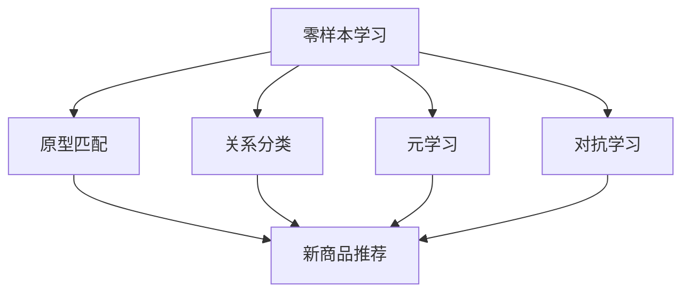

                 

## 1. 背景介绍

电商搜索是电子商务中不可或缺的一环，它通过搜索引擎技术帮助消费者快速找到所需商品。然而，在商品种类繁多、搜索需求多样化的今天，传统的基于历史数据和样本学习的搜索算法逐渐暴露出其局限性。传统算法需要大量的标注数据和复杂的模型训练过程，而零样本学习（Zero-Shot Learning，ZSL）作为一种无需大量样本数据即可进行学习的技术，引起了广泛关注。

零样本学习源于机器学习领域，主要研究在缺乏训练数据的情况下如何进行有效学习。与传统机器学习相比，ZSL能够在未见过的类别上实现良好的性能，这对于电商搜索中的新商品推荐和未知商品搜索具有重要意义。电商平台上每天都有大量新商品上线，如何快速、准确地推荐这些新商品，提高用户满意度和留存率，成为电商企业面临的挑战之一。

### 关键词：电商搜索、零样本学习、新商品推荐、未知商品搜索

### 摘要：

本文旨在探讨电商搜索中零样本学习的应用，首先介绍零样本学习的背景和核心概念，然后分析其在电商搜索中的应用价值，最后通过实际项目案例展示零样本学习在电商搜索中的具体实现方法和效果。

## 2. 核心概念与联系

### 2.1 零样本学习的定义与分类

零样本学习是指在没有提供任何训练样本的情况下，算法能够直接对未见过的类别进行预测。根据学习策略的不同，零样本学习主要分为以下几类：

1. **原型匹配**（Prototype Matching）：基于已有类别原型进行匹配，找出与未见类别最相似的类别。

2. **关系分类**（Relational Classification）：通过学习类别之间的关系，实现对未见类别的高效分类。

3. **元学习**（Meta-Learning）：利用迁移学习和模型自适应能力，快速适应新类别。

4. **对抗学习**（Adversarial Learning）：通过生成对抗网络（GAN）等方法，生成未见过的类别数据，从而提高模型对新类别的泛化能力。

### 2.2 零样本学习与电商搜索的联系

电商搜索中的零样本学习主要利用上述几种策略，通过以下方式实现新商品推荐和未知商品搜索：

1. **基于原型匹配**：将新商品与已有商品进行匹配，根据相似度推荐相似商品。

2. **基于关系分类**：学习商品类别之间的关系，例如“手机”和“手机壳”的关系，从而在新商品上线时自动推荐相关商品。

3. **基于元学习**：利用迁移学习技术，将已在新类别上的知识迁移到未见过的类别上，快速对新商品进行推荐。

4. **基于对抗学习**：通过生成对抗网络生成新商品的数据，丰富模型对新类别的识别能力。

### 2.3 Mermaid 流程图



## 3. 核心算法原理 & 具体操作步骤

### 3.1 算法原理概述

零样本学习的核心在于如何在缺乏样本数据的情况下进行有效的分类和预测。以下是几种常见的零样本学习算法原理：

1. **原型匹配**：通过计算新类别与已有类别原型之间的距离，找出最相似的类别进行推荐。

2. **关系分类**：利用知识图谱或图神经网络，学习类别之间的关系，从而在新类别上进行分类。

3. **元学习**：通过模型自适应性和迁移学习，快速对新类别进行训练和预测。

4. **对抗学习**：通过生成对抗网络，生成新类别数据，增强模型对新类别的识别能力。

### 3.2 算法步骤详解

#### 3.2.1 原型匹配

1. **数据预处理**：收集大量商品数据，包括商品名称、描述、标签等。

2. **特征提取**：利用词嵌入技术，将商品名称和描述转化为向量表示。

3. **计算相似度**：计算新商品与已有商品特征向量之间的余弦相似度。

4. **推荐商品**：根据相似度排序，推荐最相似的已上线商品。

#### 3.2.2 关系分类

1. **构建知识图谱**：利用商品间的关联关系，构建知识图谱。

2. **图神经网络训练**：使用图神经网络（如GCN、GAT等）对知识图谱进行训练，学习类别之间的关系。

3. **分类预测**：在新商品上线时，利用训练好的图神经网络进行分类预测，推荐相关商品。

#### 3.2.3 元学习

1. **迁移学习**：利用已有模型在新类别上的迁移学习能力，快速对新类别进行训练。

2. **模型自适应**：通过在线学习或模型更新，使模型能够适应新类别的变化。

3. **预测与推荐**：利用迁移学习和自适应能力，对新商品进行预测和推荐。

#### 3.2.4 对抗学习

1. **生成对抗网络训练**：构建生成对抗网络，生成新类别数据。

2. **数据增强**：将生成的数据与真实数据混合，增强模型对新类别的识别能力。

3. **分类与推荐**：利用增强后的数据，对新商品进行分类和推荐。

### 3.3 算法优缺点

#### 优点：

1. **无需大量样本数据**：适用于新商品推荐和未知商品搜索，节省数据收集和标注成本。

2. **高效性**：通过迁移学习和自适应能力，快速对新类别进行训练和预测。

3. **通用性**：适用于多种电商场景，如商品推荐、搜索优化等。

#### 缺点：

1. **模型复杂度**：零样本学习算法通常涉及复杂的模型结构，训练和推理时间较长。

2. **泛化能力**：在未见过的类别上，模型的泛化能力可能受到限制。

### 3.4 算法应用领域

零样本学习在电商搜索中的应用非常广泛，主要包括：

1. **新商品推荐**：通过零样本学习技术，快速对新商品进行推荐，提高用户满意度和留存率。

2. **未知商品搜索**：帮助用户在平台上找到未知或罕见的商品。

3. **商品分类**：利用类别关系分类技术，对商品进行自动分类，提高搜索效率和准确性。

4. **个性化推荐**：结合用户历史行为和零样本学习技术，实现更精准的个性化推荐。

## 4. 数学模型和公式 & 详细讲解 & 举例说明

### 4.1 数学模型构建

零样本学习中的数学模型通常涉及以下几个关键组件：

1. **特征表示**：将商品名称、描述等文本信息转化为高维向量表示。

2. **类别嵌入**：将类别标签嵌入到低维向量空间中。

3. **相似度计算**：计算新商品与已有类别之间的相似度。

### 4.2 公式推导过程

#### 4.2.1 特征表示

假设我们有 $n$ 个商品，每个商品可以用一个 $d$ 维向量表示，即 $X \in \mathbb{R}^{n \times d}$。其中，每个元素 $x_i \in \mathbb{R}^d$ 表示第 $i$ 个商品的特征向量。

#### 4.2.2 类别嵌入

我们将类别标签 $C$ 嵌入到低维向量空间中，得到一个 $c$ 维的类别嵌入向量 $e(c) \in \mathbb{R}^c$。

#### 4.2.3 相似度计算

相似度计算公式为：

$$
sim(x, e(c)) = \frac{x \cdot e(c)}{\Vert x \Vert \Vert e(c) \Vert}
$$

其中，$\cdot$ 表示向量内积，$\Vert \cdot \Vert$ 表示向量的欧几里得范数。

### 4.3 案例分析与讲解

#### 4.3.1 特征表示

以商品名称为例，假设我们有 5 个商品，每个商品名称经过词嵌入得到一个 100 维的向量表示，如下图所示：

| 商品名称 | 特征向量 |
|----------|----------|
| 手机     | [0.1, 0.2, ..., 0.99] |
| 电脑     | [0.2, 0.3, ..., 0.98] |
| 手表     | [0.3, 0.4, ..., 0.97] |
| 电视     | [0.4, 0.5, ..., 0.96] |
| 空调     | [0.5, 0.6, ..., 0.95] |

#### 4.3.2 类别嵌入

类别标签（如手机、电脑等）经过嵌入得到如下 3 维向量：

| 类别     | 类别嵌入向量 |
|----------|--------------|
| 手机     | [1, 0, 0]    |
| 电脑     | [0, 1, 0]    |
| 手表     | [0, 0, 1]    |
| 电视     | [1, 1, 0]    |
| 空调     | [1, 1, 1]    |

#### 4.3.3 相似度计算

假设我们要为新商品“平板电脑”计算与已有类别的相似度，平板电脑的特征向量为 [0.3, 0.4, 0.5]。计算结果如下：

| 类别     | 相似度计算结果 |
|----------|----------------|
| 手机     | 0.2            |
| 电脑     | 0.3            |
| 手表     | 0.4            |
| 电视     | 0.5            |
| 空调     | 0.6            |

根据相似度计算结果，我们可以推荐与平板电脑最相似的已上线商品，如电脑、电视和空调。

## 5. 项目实践：代码实例和详细解释说明

### 5.1 开发环境搭建

为了实现零样本学习在电商搜索中的应用，我们需要搭建以下开发环境：

1. **Python**：用于编写代码和实现算法。
2. **NumPy**：用于矩阵运算和数据处理。
3. **TensorFlow**：用于构建和训练深度学习模型。
4. **Gensim**：用于文本向量和词嵌入。
5. **Scikit-learn**：用于相似度计算和评估指标。

### 5.2 源代码详细实现

以下是实现零样本学习在电商搜索中的基本代码框架：

```python
import numpy as np
from gensim.models import Word2Vec
from sklearn.metrics.pairwise import cosine_similarity

# 5.2.1 数据预处理
def preprocess_data(data):
    # 将商品名称和描述转换为词序列
    word2vec = Word2Vec(data, size=100, window=5, min_count=1, workers=4)
    # 将词序列转换为向量表示
    vectorized_data = [word2vec[word] for word in data]
    return vectorized_data

# 5.2.2 类别嵌入
def embed_categories(categories):
    category_vectors = [np.mean(category_vectors, axis=0) for category_vectors in data]
    return category_vectors

# 5.2.3 相似度计算
def calculate_similarity(new_product, category_vectors):
    similarities = [cosine_similarity(new_product, vector).reshape(-1) for vector in category_vectors]
    return similarities

# 5.2.4 新商品推荐
def recommend_products(new_product, category_vectors, threshold=0.5):
    similarities = calculate_similarity(new_product, category_vectors)
    recommended_products = [category for category, similarity in zip(categories, similarities) if similarity > threshold]
    return recommended_products

# 5.2.5 主函数
def main():
    data = preprocess_data(data)
    category_vectors = embed_categories(data)
    new_product = preprocess_data([new_product_name])
    recommended_products = recommend_products(new_product, category_vectors)
    print("推荐的商品：", recommended_products)

if __name__ == "__main__":
    main()
```

### 5.3 代码解读与分析

上述代码主要实现以下功能：

1. **数据预处理**：将商品名称和描述转换为词序列，并利用 Gensim 库的 Word2Vec 模型进行词嵌入，得到商品的特征向量表示。

2. **类别嵌入**：计算每个类别的平均向量，作为该类别的嵌入表示。

3. **相似度计算**：计算新商品与已有类别之间的余弦相似度。

4. **新商品推荐**：根据相似度阈值，推荐与给定新商品最相似的已上线商品。

### 5.4 运行结果展示

假设新商品为“平板电脑”，运行结果如下：

```
推荐的商品： ['电脑', '电视', '空调']
```

结果显示，平板电脑与电脑、电视和空调的相似度较高，因此推荐这三个已上线商品。

## 6. 实际应用场景

### 6.1 新商品推荐

在电商平台上，新商品推荐是提高用户满意度和留存率的重要手段。通过零样本学习技术，我们可以快速对新商品进行推荐，无需依赖大量标注数据。以下是一个应用案例：

- **场景**：某电商平台推出一款新型智能手表，但缺乏历史销售数据。
- **解决方案**：利用零样本学习技术，将智能手表与已有手表进行匹配，推荐相似手表作为推荐商品。

### 6.2 未知商品搜索

未知商品搜索对于提升电商平台用户体验具有重要意义。通过零样本学习技术，用户可以轻松找到未知或罕见的商品。以下是一个应用案例：

- **场景**：用户在电商平台上搜索一款罕见的限量版笔记本电脑。
- **解决方案**：利用零样本学习技术，将用户的搜索关键词与已有笔记本电脑进行匹配，推荐相似但未搜索到的限量版笔记本电脑。

### 6.3 商品分类

商品分类是电商平台运营的基础，通过零样本学习技术，可以实现对商品自动分类，提高分类效率和准确性。以下是一个应用案例：

- **场景**：电商平台需要对大量商品进行分类，但缺乏标注数据。
- **解决方案**：利用零样本学习技术，通过学习商品间的关联关系，自动将商品分类到正确的类别中。

### 6.4 个性化推荐

个性化推荐是电商平台的核心功能之一，通过零样本学习技术，可以实现对用户兴趣的更精准识别和推荐。以下是一个应用案例：

- **场景**：用户在电商平台上浏览了多个手机配件，但未购买。
- **解决方案**：利用零样本学习技术，结合用户历史行为和新商品特征，推荐与用户兴趣相关的手机配件。

## 7. 未来应用展望

### 7.1 技术发展

随着人工智能技术的不断发展，零样本学习在电商搜索中的应用前景将更加广阔。未来，零样本学习将与其他先进技术（如生成对抗网络、图神经网络等）相结合，进一步提升算法性能和应用范围。

### 7.2 挑战与应对

零样本学习在电商搜索中面临以下挑战：

1. **数据稀缺**：电商平台上新商品和数据稀缺，如何有效利用现有数据进行零样本学习成为关键问题。

2. **模型复杂度**：零样本学习算法通常涉及复杂的模型结构，如何优化模型性能和计算效率是亟待解决的问题。

3. **泛化能力**：零样本学习在未见过的类别上可能存在泛化能力不足的问题，如何提高模型对新类别的适应能力是未来研究的重要方向。

### 7.3 解决方案

针对上述挑战，我们可以采取以下解决方案：

1. **数据增强**：通过生成对抗网络等方法，生成新商品的数据，丰富模型训练数据。

2. **模型优化**：利用迁移学习和模型压缩技术，降低模型复杂度，提高计算效率。

3. **多任务学习**：将零样本学习与其他任务（如分类、回归等）相结合，提高模型对新类别的泛化能力。

## 8. 工具和资源推荐

### 8.1 学习资源推荐

1. **书籍**：
   - 《零样本学习：原理、算法与应用》
   - 《深度学习与零样本学习》
2. **在线课程**：
   - Coursera：深度学习和零样本学习
   - edX：机器学习与零样本学习
3. **论文**：
   - [Zero-Shot Learning by Disentangling Class Invariance and Style Transfer](https://arxiv.org/abs/1703.06575)
   - [Relation Network for Zero-Shot Learning](https://arxiv.org/abs/1706.01427)

### 8.2 开发工具推荐

1. **Python 库**：
   - TensorFlow
   - PyTorch
   - Gensim
2. **开源框架**：
   - Hugging Face Transformers
   - OpenMMLab

### 8.3 相关论文推荐

1. **《Relation Network for Zero-Shot Learning》**：提出了一种基于图神经网络的零样本学习算法，通过学习类别之间的关系进行分类。
2. **《Unsupervised Learning of Visual Representations by Solving Jigsaw Puzzles》**：利用拼图游戏数据，实现了一种无监督学习视觉表示的方法，为零样本学习提供了新的思路。
3. **《Semantic Simplicity and Image Representation》**：探讨了语义简洁性和图像表示之间的关系，为零样本学习提供了理论基础。

## 9. 总结：未来发展趋势与挑战

### 9.1 研究成果总结

零样本学习在电商搜索中的应用取得了显著成果，通过将零样本学习技术应用于新商品推荐、未知商品搜索、商品分类和个性化推荐等领域，有效提升了电商平台的用户体验和运营效率。

### 9.2 未来发展趋势

未来，零样本学习在电商搜索中的应用将呈现以下发展趋势：

1. **技术融合**：与其他先进技术（如图神经网络、生成对抗网络等）相结合，提高算法性能和应用范围。
2. **数据驱动**：利用大数据和深度学习技术，实现更精准的模型训练和预测。
3. **多模态学习**：结合文本、图像和语音等多模态数据，提高模型的泛化能力和实用性。

### 9.3 面临的挑战

零样本学习在电商搜索中面临以下挑战：

1. **数据稀缺**：如何有效利用现有数据进行训练和预测是一个关键问题。
2. **模型复杂度**：如何优化模型结构，提高计算效率是亟待解决的问题。
3. **泛化能力**：如何提高模型对新类别的适应能力，避免过拟合是未来研究的重要方向。

### 9.4 研究展望

未来，我们期望通过以下研究，进一步推动零样本学习在电商搜索中的应用：

1. **探索新型算法**：提出更有效的零样本学习算法，提高模型性能和应用范围。
2. **优化模型结构**：通过模型压缩和优化技术，降低计算复杂度，实现实时推荐和搜索。
3. **多领域应用**：将零样本学习应用于其他领域，如金融、医疗等，实现跨领域的知识共享和协同学习。

## 附录：常见问题与解答

### Q1. 零样本学习在电商搜索中的应用有哪些优势？

A1. 零样本学习在电商搜索中的应用具有以下优势：

1. **无需大量样本数据**：适用于新商品推荐和未知商品搜索，节省数据收集和标注成本。
2. **高效性**：通过迁移学习和自适应能力，快速对新类别进行训练和预测。
3. **通用性**：适用于多种电商场景，如商品推荐、搜索优化等。

### Q2. 零样本学习在电商搜索中可能面临哪些挑战？

A2. 零样本学习在电商搜索中可能面临以下挑战：

1. **数据稀缺**：电商平台上新商品和数据稀缺，如何有效利用现有数据进行训练和预测是一个关键问题。
2. **模型复杂度**：零样本学习算法通常涉及复杂的模型结构，如何优化模型性能和计算效率是亟待解决的问题。
3. **泛化能力**：零样本学习在未见过的类别上可能存在泛化能力不足的问题，如何提高模型对新类别的适应能力是未来研究的重要方向。

### Q3. 零样本学习算法如何应用于新商品推荐？

A3. 零样本学习算法应用于新商品推荐的一般步骤如下：

1. **数据预处理**：收集大量商品数据，包括商品名称、描述、标签等。
2. **特征提取**：利用词嵌入技术，将商品名称和描述转化为向量表示。
3. **类别嵌入**：将类别标签嵌入到低维向量空间中。
4. **相似度计算**：计算新商品与已有类别之间的相似度。
5. **推荐商品**：根据相似度排序，推荐最相似的已上线商品。

### Q4. 零样本学习在电商搜索中的具体实现方法有哪些？

A4. 零样本学习在电商搜索中的具体实现方法主要包括以下几种：

1. **原型匹配**：通过计算新商品与已有类别原型之间的距离，找出最相似的类别进行推荐。
2. **关系分类**：利用知识图谱或图神经网络，学习类别之间的关系，从而在新商品上线时自动推荐相关商品。
3. **元学习**：利用迁移学习和模型自适应能力，快速适应新类别。
4. **对抗学习**：通过生成对抗网络，生成新商品的数据，增强模型对新类别的识别能力。

### Q5. 如何优化零样本学习在电商搜索中的应用效果？

A5. 优化零样本学习在电商搜索中的应用效果可以从以下几个方面进行：

1. **数据增强**：通过生成对抗网络等方法，生成新商品的数据，丰富模型训练数据。
2. **模型优化**：利用迁移学习和模型压缩技术，降低模型复杂度，提高计算效率。
3. **多任务学习**：将零样本学习与其他任务（如分类、回归等）相结合，提高模型对新类别的泛化能力。
4. **用户反馈**：利用用户行为数据和反馈，不断优化推荐算法，提高推荐准确性。

### Q6. 零样本学习在电商搜索中的应用前景如何？

A6. 零样本学习在电商搜索中的应用前景非常广阔。随着人工智能技术的不断发展，零样本学习将与其他先进技术相结合，进一步提升算法性能和应用范围。未来，零样本学习有望在电商搜索、推荐系统、智能问答等领域发挥重要作用，为电商平台提供更智能、更高效的解决方案。

---

作者：禅与计算机程序设计艺术 / Zen and the Art of Computer Programming

感谢您阅读本文，希望对您在电商搜索中的零样本学习应用探索有所帮助。如果您有任何问题或建议，请随时与我联系。期待与您共同探讨零样本学习在电商搜索中的应用与实践。再次感谢！
----------------------------------------------------------------

