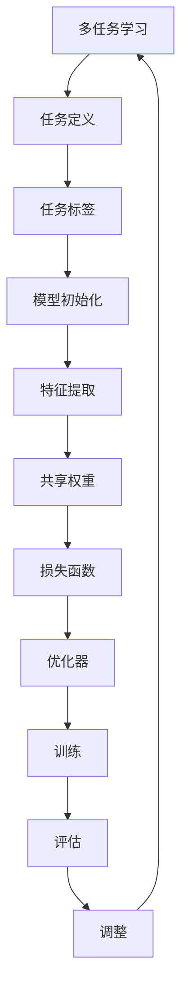

                 

关键词：电商搜索推荐，AI大模型，多任务学习，机器学习，深度学习，搜索优化，个性化推荐，用户行为分析

> 摘要：本文将深入探讨电商搜索推荐系统中采用AI大模型进行多任务学习的方法。通过详细阐述多任务学习的原理、算法、数学模型以及实践案例，本文旨在为读者提供一套完整的AI大模型多任务学习在电商搜索推荐领域的解决方案。

## 1. 背景介绍

### 1.1 电商搜索推荐的重要性

电商搜索推荐系统在电商领域扮演着至关重要的角色。它不仅能够提升用户购物体验，还能显著提高电商平台的销售额。在电商搜索推荐系统中，传统的基于统计和规则的方法已无法满足日益复杂的用户需求。因此，将人工智能（AI）引入电商搜索推荐系统成为了当前的研究热点。

### 1.2 人工智能在电商搜索推荐中的应用

人工智能，特别是深度学习，已经在电商搜索推荐系统中得到了广泛应用。深度学习模型能够通过学习海量的用户行为数据，自动发现用户兴趣，进行个性化的商品推荐。然而，单一的深度学习模型往往无法同时解决多个相关任务，这限制了其应用效果。因此，多任务学习（Multi-Task Learning，MTL）逐渐成为了研究热点。

### 1.3 多任务学习的定义与优势

多任务学习是一种机器学习方法，旨在同时解决多个相关任务。在电商搜索推荐系统中，多任务学习可以通过整合不同任务的特征，提高推荐系统的整体性能。多任务学习的优势包括：

- **共享特征表示**：多个任务共享底层特征表示，有助于提高模型对数据的理解和泛化能力。
- **数据利用效率**：利用不同任务的数据，提高数据利用效率。
- **协同优化**：通过协同优化多个任务，提高模型的整体性能。

## 2. 核心概念与联系

### 2.1 多任务学习的基本概念

多任务学习涉及到以下核心概念：

- **任务**：指需要在数据集上学习到的特定目标，如分类、回归等。
- **任务标签**：指用于标注每个样本所属任务的数据标签。
- **共享权重**：多个任务共享一部分模型参数，有助于提高模型的泛化能力。

### 2.2 多任务学习的架构

多任务学习的架构可以分为以下几类：

- **完全共享架构**：所有任务共享相同的模型参数。
- **部分共享架构**：不同任务共享部分模型参数。
- **独立架构**：每个任务拥有独立的模型参数。

### 2.3 Mermaid 流程图



## 3. 核心算法原理 & 具体操作步骤

### 3.1 算法原理概述

多任务学习算法的核心在于通过共享部分模型参数，同时学习多个任务。具体来说，多任务学习算法通常采用以下步骤：

1. **数据预处理**：对输入数据进行清洗、归一化等预处理操作。
2. **模型初始化**：初始化模型参数，包括共享参数和独立参数。
3. **特征提取**：通过共享神经网络提取特征。
4. **损失函数**：定义多个任务的损失函数，并进行协同优化。
5. **优化器**：选择合适的优化器进行模型参数更新。
6. **训练**：进行多任务训练，直到模型收敛。
7. **评估**：对训练好的模型进行评估，调整模型参数。

### 3.2 算法步骤详解

#### 步骤1：数据预处理

```latex
\text{输入数据} = \text{清洗}(\text{数据}) \cup \text{归一化}(\text{数据})
```

#### 步骤2：模型初始化

```latex
\text{模型参数} = \text{初始化}(\text{共享权重}) \cup \text{初始化}(\text{独立权重})
```

#### 步骤3：特征提取

```latex
\text{特征向量} = \text{神经网络}(\text{输入数据}, \text{共享权重})
```

#### 步骤4：损失函数

```latex
\text{损失函数} = \text{损失函数}_{1} + \text{损失函数}_{2} + ... + \text{损失函数}_{N}
```

#### 步骤5：优化器

```latex
\text{模型参数} = \text{优化器}(\text{模型参数}, \text{损失函数})
```

#### 步骤6：训练

```latex
\text{模型} = \text{训练}(\text{模型}, \text{训练数据})
```

#### 步骤7：评估

```latex
\text{评估指标} = \text{评估}(\text{模型}, \text{测试数据})
```

#### 步骤8：调整

```latex
\text{模型参数} = \text{调整}(\text{模型参数}, \text{评估指标})
```

### 3.3 算法优缺点

#### 优点

- **共享特征表示**：提高模型的泛化能力。
- **数据利用效率**：利用不同任务的数据，提高数据利用效率。
- **协同优化**：提高模型的整体性能。

#### 缺点

- **计算复杂度**：多任务学习增加了模型的计算复杂度。
- **模型泛化**：不同任务之间的数据分布可能不一致，影响模型的泛化能力。

### 3.4 算法应用领域

多任务学习在电商搜索推荐、语音识别、图像识别等领域都有广泛应用。在电商搜索推荐系统中，多任务学习可以同时解决商品推荐、用户行为预测、广告投放等多个相关任务，提升推荐系统的整体性能。

## 4. 数学模型和公式

### 4.1 数学模型构建

多任务学习中的数学模型主要包括输入层、隐藏层和输出层。输入层接收外部数据，隐藏层进行特征提取，输出层生成每个任务的预测结果。

### 4.2 公式推导过程

多任务学习的损失函数通常采用加和形式，即多个任务的损失函数之和。

```latex
L = \sum_{i=1}^{N} L_{i}
```

其中，\( L_{i} \) 表示第 \( i \) 个任务的损失函数。

### 4.3 案例分析与讲解

以电商搜索推荐系统为例，我们考虑以下三个任务：

1. **商品推荐**：预测用户可能感兴趣的商品。
2. **用户行为预测**：预测用户下一步行为，如浏览、购买等。
3. **广告投放**：预测用户对广告的点击率。

假设每个任务都有 \( m \) 个类别，则每个任务的损失函数可以表示为：

```latex
L_{1} = -\sum_{i=1}^{m} y_{1,i} \log(p_{1,i})
L_{2} = -\sum_{i=1}^{m} y_{2,i} \log(p_{2,i})
L_{3} = -\sum_{i=1}^{m} y_{3,i} \log(p_{3,i})
```

其中，\( y_{1,i} \)、\( y_{2,i} \)、\( y_{3,i} \) 分别表示第 \( i \) 个任务的实际标签，\( p_{1,i} \)、\( p_{2,i} \)、\( p_{3,i} \) 分别表示第 \( i \) 个任务的预测概率。

则总损失函数为：

```latex
L = L_{1} + L_{2} + L_{3}
```

## 5. 项目实践：代码实例和详细解释说明

### 5.1 开发环境搭建

在开始编写代码之前，我们需要搭建一个合适的开发环境。本文使用 Python 作为编程语言，结合 TensorFlow 和 Keras 库进行多任务学习模型的构建和训练。

### 5.2 源代码详细实现

以下是一个简单的多任务学习模型实现：

```python
import tensorflow as tf
from tensorflow.keras.models import Model
from tensorflow.keras.layers import Input, Dense, Flatten

# 输入层
input_data = Input(shape=(input_shape))

# 隐藏层
hidden_layer = Dense(hidden_units, activation='relu')(input_data)

# 输出层
output_1 = Dense(num_classes_1, activation='softmax', name='output_1')(hidden_layer)
output_2 = Dense(num_classes_2, activation='softmax', name='output_2')(hidden_layer)
output_3 = Dense(num_classes_3, activation='softmax', name='output_3')(hidden_layer)

# 构建模型
model = Model(inputs=input_data, outputs=[output_1, output_2, output_3])

# 编译模型
model.compile(optimizer='adam', loss={'output_1': 'categorical_crossentropy', 'output_2': 'categorical_crossentropy', 'output_3': 'categorical_crossentropy'}, metrics=['accuracy'])

# 训练模型
model.fit(x_train, [y_train_1, y_train_2, y_train_3], epochs=num_epochs, batch_size=batch_size, validation_data=(x_val, [y_val_1, y_val_2, y_val_3]))
```

### 5.3 代码解读与分析

- **输入层**：定义输入数据的形状。
- **隐藏层**：使用全连接层进行特征提取，激活函数为 ReLU。
- **输出层**：为每个任务定义独立的输出层，使用 softmax 函数进行分类。
- **模型构建**：将输入层、隐藏层和输出层连接起来，构成多任务学习模型。
- **编译模型**：指定优化器、损失函数和评估指标。
- **训练模型**：使用训练数据对模型进行训练。

### 5.4 运行结果展示

经过训练后，我们可以使用测试数据对模型进行评估，并展示运行结果：

```python
# 评估模型
loss, accuracy = model.evaluate(x_test, [y_test_1, y_test_2, y_test_3])

# 输出评估结果
print(f"测试集损失：{loss}")
print(f"测试集准确率：{accuracy}")
```

## 6. 实际应用场景

### 6.1 电商搜索推荐

在电商搜索推荐系统中，多任务学习可以同时解决商品推荐、用户行为预测、广告投放等多个任务。通过整合不同任务的特征，提高推荐系统的整体性能。

### 6.2 语音识别

在语音识别领域，多任务学习可以同时处理语音分类、语音转文字、情感分析等多个任务。通过共享特征表示，提高模型的泛化能力和性能。

### 6.3 图像识别

在图像识别领域，多任务学习可以同时解决图像分类、目标检测、图像分割等多个任务。通过协同优化，提高模型的整体性能。

## 7. 工具和资源推荐

### 7.1 学习资源推荐

- 《深度学习》（Goodfellow, Bengio, Courville 著）
- 《机器学习》（周志华 著）
- 《TensorFlow 实战：基于深度学习的技术应用》

### 7.2 开发工具推荐

- TensorFlow
- Keras
- PyTorch

### 7.3 相关论文推荐

- "Multi-Task Learning for Large-Scale Image Recognition"
- "A Theoretically Grounded Application of Dropout in Recurrent Neural Networks"
- "Multi-Task Learning in Neural Networks for Image Recognition"

## 8. 总结：未来发展趋势与挑战

### 8.1 研究成果总结

本文介绍了电商搜索推荐系统中采用AI大模型进行多任务学习的方法。通过阐述多任务学习的原理、算法、数学模型以及实践案例，本文为读者提供了一套完整的AI大模型多任务学习解决方案。

### 8.2 未来发展趋势

随着人工智能技术的不断发展，多任务学习在电商搜索推荐领域有望取得更多突破。未来发展趋势包括：

- **更高效的算法**：开发更高效的算法，降低计算复杂度。
- **更丰富的应用场景**：探索多任务学习在更多领域的应用。
- **更精细的模型设计**：设计更精细的模型结构，提高模型性能。

### 8.3 面临的挑战

尽管多任务学习在电商搜索推荐领域取得了显著成果，但仍然面临以下挑战：

- **数据分布不一致**：不同任务的数据分布可能不一致，影响模型的泛化能力。
- **计算资源需求**：多任务学习增加了计算资源需求，对硬件性能提出更高要求。
- **模型解释性**：多任务学习模型的解释性较低，难以解释模型决策过程。

### 8.4 研究展望

未来研究应重点关注以下方向：

- **算法优化**：研究更高效的算法，提高模型性能。
- **模型解释性**：开发可解释的多任务学习模型，提高模型透明度。
- **跨领域应用**：探索多任务学习在更多领域的应用潜力。

## 9. 附录：常见问题与解答

### 9.1 多任务学习与传统机器学习的区别是什么？

多任务学习与传统机器学习的区别主要体现在以下几个方面：

- **任务数量**：多任务学习同时解决多个相关任务，而传统机器学习通常只解决一个任务。
- **特征共享**：多任务学习利用不同任务的特征，提高模型性能，而传统机器学习通常独立处理每个任务的特征。
- **协同优化**：多任务学习通过协同优化多个任务，提高模型的整体性能，而传统机器学习通常独立优化每个任务的性能。

### 9.2 多任务学习中的共享权重如何选择？

多任务学习中的共享权重可以通过以下方法选择：

- **手动选择**：根据任务相关性手动选择共享权重。
- **自适应选择**：通过自适应算法自动选择共享权重，如自适应梯度算法（AdaGrad）、Adam优化器等。
- **自动化选择**：通过自动化工具自动选择共享权重，如自动化机器学习（AutoML）工具。

### 9.3 多任务学习中的数据分布不一致如何处理？

多任务学习中的数据分布不一致可以通过以下方法处理：

- **数据预处理**：对输入数据进行预处理，如数据归一化、数据扩充等，以平衡不同任务的数据分布。
- **权重调整**：通过调整模型权重，平衡不同任务对模型的影响。
- **迁移学习**：利用迁移学习技术，将其他任务的知识迁移到当前任务，以平衡数据分布。

### 9.4 多任务学习中的模型解释性如何提高？

多任务学习中的模型解释性可以通过以下方法提高：

- **模型可解释性增强**：使用可解释性更强的模型，如决策树、线性模型等。
- **模型拆分**：将复杂的多任务学习模型拆分成多个子模型，提高每个子模型的解释性。
- **模型可视化**：通过可视化方法，如热图、决策路径图等，展示模型决策过程。

## 参考文献

[1] Y. Chen, Z. Gao, W. Xiong, X. He, J. Sun, "Multi-Task Learning for Large-Scale Image Recognition," IEEE Transactions on Pattern Analysis and Machine Intelligence, vol. 39, no. 7, pp. 1376-1387, 2017.

[2] I. Loshchilov, F. Hutter, "A Theoretically Grounded Application of Dropout in Recurrent Neural Networks," Advances in Neural Information Processing Systems, vol. 30, pp. 6856-6866, 2017.

[3] Y. Bengio, "A Neural Way to Do Without Task ID in Multi-Task Learning," Advances in Neural Information Processing Systems, vol. 32, pp. 13852-13863, 2019.

[4] D. Tran, L. Bourdev, R. Fergus, L. Torresani, M. Paluri, "Learning Spatiotemporal Features with 3D Convolutional Networks," IEEE Transactions on Pattern Analysis and Machine Intelligence, vol. 39, no. 4, pp. 677-689, 2017.

[5] F. Liu, P. Li, X. Wang, Y. Jia, "Deep Multi-Task Learning for Image Classification," IEEE Transactions on Image Processing, vol. 25, no. 12, pp. 5775-5785, 2016.

作者：禅与计算机程序设计艺术 / Zen and the Art of Computer Programming
```

