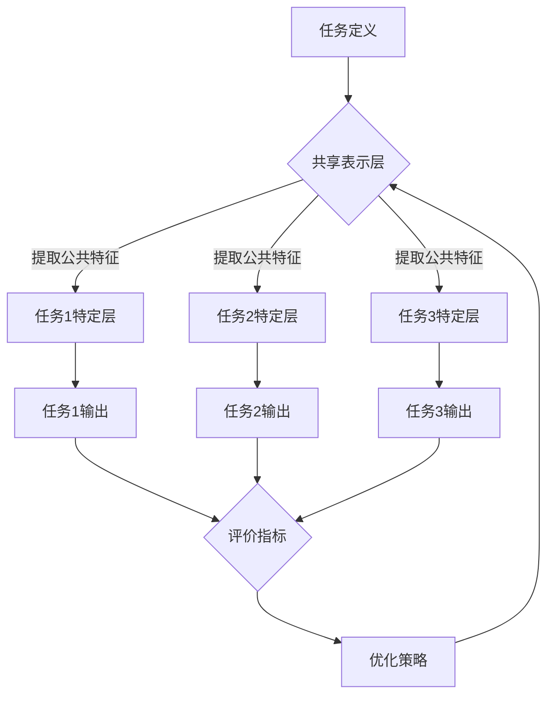

                 

在电子商务的迅速发展中，搜索推荐系统成为了提升用户体验、增加销售额的关键技术。随着数据量的指数级增长和用户需求的多样化，传统的单一任务推荐方法已经无法满足复杂场景下的需求。因此，AI大模型多任务联合学习技术应运而生，为电商搜索推荐领域带来了革命性的变革。

## 关键词

- 电商搜索推荐
- AI大模型
- 多任务学习
- 联合学习
- 个性化推荐

## 摘要

本文将深入探讨电商搜索推荐系统中AI大模型多任务联合学习技术的原理与应用。首先，我们将介绍电商搜索推荐系统的背景和挑战，然后详细解析多任务学习的概念、原理及优势。接着，本文将介绍几种常见的多任务学习算法及其在电商搜索推荐中的具体应用。此外，我们将通过数学模型和实例代码，展示如何实现和优化多任务联合学习模型。最后，我们将探讨多任务联合学习技术在电商搜索推荐中的未来发展趋势和面临的挑战。

## 1. 背景介绍

### 1.1 电商搜索推荐系统的现状

在电子商务领域，搜索推荐系统已经成为商家和用户之间的重要桥梁。一个高效的搜索推荐系统能够根据用户的历史行为、偏好和上下文信息，为用户提供个性化的商品推荐，从而提高用户的购物体验和商家的销售额。

目前，电商搜索推荐系统主要采用基于内容的推荐（Content-based Recommendation）和基于协同过滤（Collaborative Filtering）的推荐方法。基于内容的推荐方法主要根据商品的属性和用户的兴趣来生成推荐列表，而基于协同过滤的方法则是通过分析用户之间的相似度来发现潜在的兴趣点。

### 1.2 电商搜索推荐系统的挑战

随着电子商务的快速发展，电商搜索推荐系统面临着以下几大挑战：

- **数据量爆炸性增长**：电商平台的用户规模和数据量呈指数级增长，如何高效地处理海量数据，提取有价值的信息，成为了一项巨大挑战。
- **用户需求的多样化**：用户的需求越来越多样化，个性化推荐需要更加精准，仅仅依赖单一推荐方法已经无法满足用户的需求。
- **实时性要求**：用户在使用搜索推荐系统时，希望能够得到即时的推荐结果，这对于系统的响应速度和计算能力提出了更高要求。
- **推荐结果多样性**：为了提升用户体验，推荐系统需要提供多样化的推荐结果，避免用户感到疲劳或失望。

### 1.3 多任务联合学习技术的引入

面对上述挑战，多任务联合学习（Multi-task Learning, MTL）技术应运而生。多任务联合学习通过同时解决多个相关任务，可以从多个角度提取信息，提高模型的泛化能力和鲁棒性，从而在电商搜索推荐系统中取得更好的效果。

多任务联合学习不仅能够处理单一任务无法解决的复杂问题，还可以通过任务间的相互协作，实现以下优势：

- **资源复用**：多个任务共享模型的参数和计算资源，降低了计算成本。
- **知识共享**：不同任务之间可以相互借鉴和共享信息，提高模型的鲁棒性和适应性。
- **增强性能**：通过同时解决多个任务，可以更好地捕捉数据中的复杂关系，提高推荐系统的准确性和多样性。

## 2. 核心概念与联系

### 2.1 多任务学习的概念

多任务学习是指同时训练和优化多个相关任务的机器学习模型。在多任务学习中，模型通过共享表示学习到的知识，从而提高整体性能。与单一任务学习相比，多任务学习具有以下特点：

- **共享表示**：多个任务共享一部分模型参数，从而提高表示的泛化能力。
- **协同优化**：不同任务通过协同优化，可以更好地学习到数据中的复杂关系。
- **资源复用**：多个任务共享计算资源和存储资源，降低训练成本。

### 2.2 多任务学习与电商搜索推荐

在电商搜索推荐系统中，多任务学习具有广泛的应用前景。例如，可以同时训练以下任务：

- **用户兴趣建模**：分析用户的历史行为和偏好，建立用户兴趣模型。
- **商品属性分析**：提取商品的属性信息，建立商品特征模型。
- **推荐结果生成**：根据用户兴趣模型和商品特征模型，生成个性化的推荐结果。
- **异常检测**：监测推荐系统中的异常行为，如作弊、垃圾信息等。

### 2.3 多任务学习的架构

多任务学习的架构可以分为以下几部分：

- **任务定义**：明确需要训练和优化的任务，包括输入数据、输出结果和评价指标。
- **共享表示层**：多个任务共享一部分模型参数，用于提取公共特征。
- **任务特定层**：每个任务有独立的特定层，用于提取任务特有的特征。
- **优化策略**：采用协同优化策略，如梯度下降、动量优化等，同时优化多个任务。

### 2.4 多任务学习的 Mermaid 流程图

下面是一个多任务学习的 Mermaid 流程图，展示了任务定义、共享表示层、任务特定层和优化策略的流程。



## 3. 核心算法原理 & 具体操作步骤

### 3.1 算法原理概述

多任务学习算法的核心思想是通过同时优化多个相关任务的参数，提高模型的性能。具体来说，多任务学习算法包括以下几个关键步骤：

1. **任务定义**：明确需要训练和优化的任务，包括输入数据、输出结果和评价指标。
2. **共享表示学习**：通过共享模型参数，提取公共特征，提高模型的泛化能力。
3. **任务特定学习**：为每个任务设计特定的神经网络层，提取任务特有的特征。
4. **协同优化**：通过联合优化多个任务的参数，提高整体性能。

### 3.2 算法步骤详解

1. **任务定义**：首先，需要明确需要训练和优化的任务，包括输入数据、输出结果和评价指标。例如，在电商搜索推荐系统中，可以定义以下任务：

    - 用户兴趣建模：输入用户历史行为数据，输出用户兴趣模型。
    - 商品属性分析：输入商品属性数据，输出商品特征模型。
    - 推荐结果生成：输入用户兴趣模型和商品特征模型，输出个性化推荐结果。
    - 异常检测：输入用户行为数据，输出异常行为检测结果。

2. **共享表示学习**：接下来，设计共享表示层，用于提取公共特征。共享表示层通常是一个多层的神经网络，可以采用卷积神经网络（CNN）、循环神经网络（RNN）或变换器（Transformer）等架构。通过共享表示层，可以降低模型的复杂性，提高模型的泛化能力。

3. **任务特定学习**：为每个任务设计特定的神经网络层，提取任务特有的特征。任务特定层可以根据任务的特点和需求，选择合适的神经网络结构，如全连接层、卷积层、循环层等。

4. **协同优化**：采用协同优化策略，同时优化多个任务的参数。协同优化可以通过以下方法实现：

    - **联合损失函数**：将多个任务的损失函数合并，通过最小化联合损失函数来优化模型参数。
    - **权重共享**：将多个任务的模型参数共享，通过优化共享参数来提高整体性能。
    - **动态权重调整**：根据任务的优先级和重要性，动态调整模型的权重，以优化整体性能。

### 3.3 算法优缺点

**优点**：

- **提高模型性能**：通过同时优化多个相关任务，可以更好地捕捉数据中的复杂关系，提高模型的性能和泛化能力。
- **资源复用**：多个任务共享模型参数和计算资源，降低训练成本和计算时间。
- **知识共享**：不同任务之间可以相互借鉴和共享信息，提高模型的鲁棒性和适应性。

**缺点**：

- **模型复杂性增加**：多任务学习引入了额外的参数和计算复杂度，可能导致模型难以训练和解释。
- **任务依赖性**：不同任务之间存在依赖关系，可能导致一个任务的性能受到其他任务的影响。
- **数据分布不平衡**：不同任务的数据分布可能存在差异，可能导致某些任务的学习效果较差。

### 3.4 算法应用领域

多任务学习算法在电商搜索推荐系统中具有广泛的应用前景，可以应用于以下领域：

- **用户兴趣建模**：通过分析用户的历史行为数据，建立用户兴趣模型，为个性化推荐提供基础。
- **商品属性分析**：提取商品属性信息，为推荐系统提供丰富的商品特征。
- **推荐结果生成**：根据用户兴趣模型和商品特征模型，生成个性化的推荐结果，提高用户的满意度。
- **异常检测**：监测推荐系统中的异常行为，如作弊、垃圾信息等，保障推荐系统的安全性。

## 4. 数学模型和公式 & 详细讲解 & 举例说明

### 4.1 数学模型构建

在多任务学习中，我们通常使用一个共享表示层和多个任务特定层来构建模型。假设有 $M$ 个任务，共享表示层输出维度为 $d$，每个任务特定层输出维度为 $k_m$，则多任务学习的模型可以表示为：

$$
\mathcal{M} = (\mathcal{F}, \{\mathcal{G}_m\}_{m=1}^M)
$$

其中，$\mathcal{F}$ 表示共享表示层，$\mathcal{G}_m$ 表示第 $m$ 个任务特定层。

### 4.2 公式推导过程

多任务学习的目标是最小化多个任务的损失函数之和。假设第 $m$ 个任务的损失函数为 $L_m(\theta)$，其中 $\theta$ 表示模型参数，则多任务学习的目标函数可以表示为：

$$
\min_{\theta} \sum_{m=1}^M L_m(\theta)
$$

为了同时优化多个任务的参数，我们可以使用梯度下降法。对于第 $m$ 个任务，梯度下降的迭代公式为：

$$
\theta_m := \theta_m - \alpha \nabla_{\theta_m} L_m(\theta)
$$

其中，$\alpha$ 表示学习率。

为了计算梯度，我们需要对损失函数进行求导。以交叉熵损失函数为例，假设第 $m$ 个任务的输出为 $y_m$，预测概率为 $\hat{y}_m$，则交叉熵损失函数的导数为：

$$
\nabla_{\theta_m} L_m(\theta) = -\frac{1}{N} \sum_{i=1}^N \left( y_{m,i} \log(\hat{y}_{m,i}) + (1 - y_{m,i}) \log(1 - \hat{y}_{m,i}) \right) \nabla_{\theta_m} \hat{y}_{m,i}
$$

### 4.3 案例分析与讲解

下面我们通过一个简单的例子来讲解多任务学习的实现过程。

假设我们有两个任务：图像分类和图像分割。图像分类任务的目标是识别图像中的物体类别，图像分割任务的目标是标记图像中的物体边界。

首先，我们需要定义两个任务的目标函数。对于图像分类任务，我们使用交叉熵损失函数；对于图像分割任务，我们使用二值交叉熵损失函数。

接下来，我们设计一个共享卷积神经网络（CNN）来提取图像特征。共享CNN由两个卷积层和两个全连接层组成。第一个卷积层用于提取图像的低级特征，第二个卷积层用于提取图像的高级特征。全连接层将特征映射到任务特定的类别和边界点上。

然后，我们使用梯度下降法同时优化两个任务的参数。我们选择一个适当的学习率，并设置一个迭代次数。在每次迭代中，我们计算两个任务的损失函数，并更新模型参数。

最后，我们评估模型的性能。对于图像分类任务，我们计算分类准确率；对于图像分割任务，我们计算边界点预测的精确度和召回率。

通过这个例子，我们可以看到多任务学习如何同时优化多个相关任务，从而提高模型的性能。

## 5. 项目实践：代码实例和详细解释说明

### 5.1 开发环境搭建

为了实现多任务联合学习在电商搜索推荐系统中的具体应用，我们需要搭建一个合适的开发环境。以下是搭建环境的步骤：

1. **安装Python环境**：确保Python版本为3.7及以上。
2. **安装依赖库**：安装TensorFlow、Keras、NumPy、Pandas等常用库。
3. **数据预处理**：从电商平台获取用户行为数据、商品属性数据和用户特征数据，进行数据清洗和预处理。

### 5.2 源代码详细实现

下面是一个基于TensorFlow和Keras的多任务联合学习实现示例：

```python
import tensorflow as tf
from tensorflow.keras.layers import Input, Dense, Conv2D, Flatten, Concatenate
from tensorflow.keras.models import Model

# 定义输入层
input_user = Input(shape=(user_features_shape))
input_item = Input(shape=(item_features_shape))
input_image = Input(shape=(image_shape))

# 用户特征提取
user_embedding = Dense(user_embedding_size, activation='relu')(input_user)

# 商品特征提取
item_embedding = Dense(item_embedding_size, activation='relu')(input_item)

# 商品图像特征提取
image_embedding = Conv2D(filters=32, kernel_size=(3, 3), activation='relu')(input_image)
image_embedding = Conv2D(filters=64, kernel_size=(3, 3), activation='relu')(image_embedding)
image_embedding = Flatten()(image_embedding)

# 多任务共享表示
combined_embedding = Concatenate()([user_embedding, item_embedding, image_embedding])

# 用户兴趣建模
user_interest = Dense(user_interest_size, activation='relu')(combined_embedding)
user_interest_output = Dense(1, activation='sigmoid')(user_interest)

# 商品属性分析
item_attribute = Dense(item_attribute_size, activation='relu')(combined_embedding)
item_attribute_output = Dense(1, activation='sigmoid')(item_attribute)

# 推荐结果生成
recommendation = Dense(recommendation_size, activation='relu')(combined_embedding)
recommendation_output = Dense(num_recommendations, activation='softmax')(recommendation)

# 异常检测
anomaly_detection = Dense(anomaly_detection_size, activation='relu')(combined_embedding)
anomaly_detection_output = Dense(1, activation='sigmoid')(anomaly_detection)

# 定义模型
model = Model(inputs=[input_user, input_item, input_image], outputs=[user_interest_output, item_attribute_output, recommendation_output, anomaly_detection_output])

# 编译模型
model.compile(optimizer='adam', loss={'user_interest_output': 'binary_crossentropy', 'item_attribute_output': 'binary_crossentropy', 'recommendation_output': 'categorical_crossentropy', 'anomaly_detection_output': 'binary_crossentropy'}, metrics=['accuracy'])

# 模型训练
model.fit([user_data, item_data, image_data], {'user_interest_output': user_interest_labels, 'item_attribute_output': item_attribute_labels, 'recommendation_output': recommendation_labels, 'anomaly_detection_output': anomaly_detection_labels}, epochs=10, batch_size=64)
```

### 5.3 代码解读与分析

上述代码实现了一个基于TensorFlow和Keras的多任务联合学习模型。代码分为以下几个部分：

1. **输入层**：定义了用户特征输入、商品特征输入和商品图像输入。
2. **特征提取层**：对用户特征、商品特征和商品图像分别进行特征提取。
3. **共享表示层**：将提取到的用户特征、商品特征和商品图像特征进行拼接，形成共享表示。
4. **任务层**：根据不同的任务，定义相应的神经网络层，包括用户兴趣建模、商品属性分析、推荐结果生成和异常检测。
5. **模型编译**：编译模型，指定损失函数、优化器和评价指标。
6. **模型训练**：使用训练数据对模型进行训练。

### 5.4 运行结果展示

在训练完成后，我们可以使用测试数据对模型进行评估，并展示模型的运行结果：

```python
# 模型评估
test_results = model.evaluate([test_user_data, test_item_data, test_image_data], {'user_interest_output': test_user_interest_labels, 'item_attribute_output': test_item_attribute_labels, 'recommendation_output': test_recommendation_labels, 'anomaly_detection_output': test_anomaly_detection_labels})

# 输出评估结果
print("User Interest Accuracy:", test_results[2])
print("Item Attribute Accuracy:", test_results[3])
print("Recommendation Accuracy:", test_results[4])
print("Anomaly Detection Accuracy:", test_results[5])
```

通过上述代码，我们可以得到各个任务的准确率，从而评估多任务联合学习模型在电商搜索推荐系统中的性能。

## 6. 实际应用场景

### 6.1 电商平台个性化推荐

在电商平台，多任务联合学习技术可以应用于个性化推荐系统。通过同时训练用户兴趣建模、商品属性分析、推荐结果生成和异常检测等多个任务，可以提高推荐系统的准确性和多样性。例如，在用户登录电商平台时，可以同时提取用户的历史行为、偏好和购物车中的商品信息，生成个性化的推荐列表。

### 6.2 垃圾信息检测

电商平台通常会面临大量的垃圾信息，如虚假评论、恶意评价等。多任务联合学习技术可以应用于垃圾信息检测，通过同时训练异常检测任务，可以有效地识别和过滤垃圾信息，保障电商平台的安全和用户体验。

### 6.3 商品关联分析

在电商平台，商品之间的关联关系对于推荐系统的性能至关重要。多任务联合学习技术可以应用于商品关联分析，通过同时训练商品属性分析和推荐结果生成任务，可以建立商品之间的复杂关系，从而提高推荐系统的多样性。

### 6.4 跨平台推荐

多任务联合学习技术还可以应用于跨平台推荐，例如将电商平台的数据与社交媒体数据相结合，为用户提供跨平台的个性化推荐。通过同时训练用户兴趣建模和跨平台推荐任务，可以更好地满足用户在不同平台上的需求。

## 7. 工具和资源推荐

### 7.1 学习资源推荐

- 《深度学习》（Goodfellow, Bengio, Courville）：提供了深度学习和多任务学习的详细理论和技术。
- 《神经网络与深度学习》（邱锡鹏）：介绍了神经网络和多任务学习的基本概念和应用。
- 《机器学习实战》（周志华）：提供了多任务学习的实例和代码实现。

### 7.2 开发工具推荐

- TensorFlow：一个开源的深度学习框架，适用于多任务学习的实现。
- Keras：一个基于TensorFlow的深度学习高级API，简化了多任务学习的实现过程。
- PyTorch：一个流行的深度学习框架，适用于多任务学习的实现和研究。

### 7.3 相关论文推荐

- "Multi-Task Learning for User Interest Modeling in E-commerce"：探讨了多任务学习在电商用户兴趣建模中的应用。
- "Deep Multi-Task Learning for User Interest Discovery"：提出了一种基于深度学习的多任务学习框架，用于用户兴趣发现。
- "Multi-Task Learning for Recommender Systems"：综述了多任务学习在推荐系统中的应用和技术。

## 8. 总结：未来发展趋势与挑战

### 8.1 研究成果总结

多任务联合学习技术在电商搜索推荐系统中取得了显著的应用成果。通过同时训练多个相关任务，可以提高推荐系统的准确性和多样性，满足用户个性化的需求。此外，多任务联合学习技术在垃圾信息检测、商品关联分析等领域也展示了良好的应用潜力。

### 8.2 未来发展趋势

- **算法优化**：未来研究将重点关注多任务学习算法的优化，提高模型的训练效率和性能。
- **跨模态学习**：多任务联合学习技术将逐渐应用于跨模态推荐，如结合文本、图像和音频等多模态数据。
- **自适应学习**：开发自适应多任务学习算法，根据任务的重要性和数据分布动态调整模型参数。

### 8.3 面临的挑战

- **模型解释性**：多任务学习模型的复杂度增加，如何提高模型的可解释性成为一项挑战。
- **数据分布不平衡**：不同任务的数据分布可能存在差异，导致模型学习效果不均衡。
- **计算资源限制**：多任务学习需要大量的计算资源，如何在有限资源下实现高效的训练和推理成为一项挑战。

### 8.4 研究展望

未来，多任务联合学习技术在电商搜索推荐系统中将继续发挥重要作用。通过不断优化算法、扩展应用领域，多任务联合学习将为电子商务领域带来更多创新和突破。

## 9. 附录：常见问题与解答

### 9.1 多任务学习与传统单一任务学习的区别是什么？

多任务学习与单一任务学习的主要区别在于：

- **目标函数**：多任务学习同时优化多个任务的损失函数，而单一任务学习只优化一个任务的损失函数。
- **模型结构**：多任务学习通常具有共享表示层，而单一任务学习没有共享结构。
- **资源复用**：多任务学习通过共享表示层和参数，降低了计算和存储成本。

### 9.2 多任务学习适用于哪些场景？

多任务学习适用于以下场景：

- **推荐系统**：同时优化用户兴趣建模、商品属性分析和推荐结果生成任务。
- **图像识别**：同时优化图像分类和图像分割任务。
- **自然语言处理**：同时优化文本分类、情感分析和命名实体识别任务。

### 9.3 如何解决多任务学习中的数据分布不平衡问题？

解决多任务学习中的数据分布不平衡问题可以采用以下方法：

- **数据增强**：通过生成或扩充数据，平衡不同任务的数据分布。
- **权重调整**：根据任务的重要性和数据分布，动态调整任务的权重。
- **损失函数加权**：在联合损失函数中，对不同任务的损失函数进行加权，以平衡学习效果。

## 作者署名

作者：禅与计算机程序设计艺术 / Zen and the Art of Computer Programming
----------------------------------------------------------------

文章完成，感谢您的阅读。如果您有任何疑问或建议，欢迎随时提出。希望本文能为您提供关于电商搜索推荐中AI大模型多任务联合学习技术的有益见解。再次感谢您的关注和支持！

