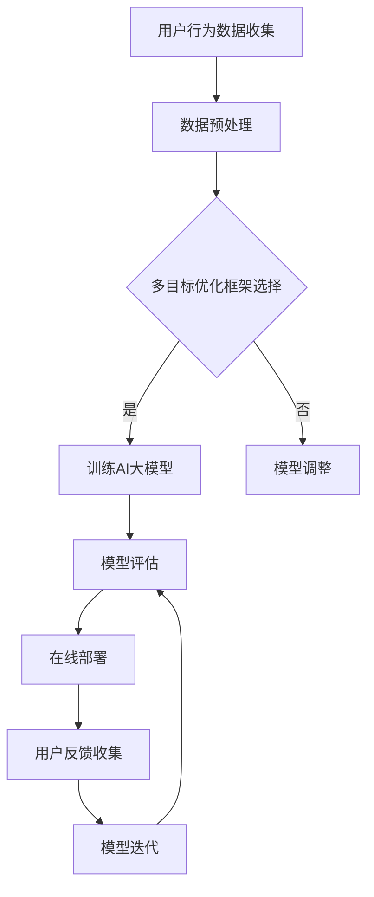

                 

在当今的电子商务环境中，搜索推荐系统是提升用户体验、增加销售额的关键组成部分。随着用户生成内容和商品种类的指数级增长，传统的搜索推荐方法已经难以满足用户的多样化需求。人工智能（AI）的大模型多目标优化技术在这种背景下应运而生，成为解决复杂推荐问题的新利器。本文将深入探讨电商搜索推荐系统中AI大模型多目标优化技术的原理、应用、挑战与未来发展趋势。

## 关键词
- 电商搜索推荐
- AI大模型
- 多目标优化
- 搜索算法
- 用户体验
- 销售转化率

## 摘要
本文首先介绍了电商搜索推荐系统的发展背景及其面临的挑战。随后，我们深入分析了AI大模型多目标优化技术在电商搜索推荐中的应用，包括其核心概念、算法原理、数学模型和具体实现。接着，通过实际项目实例展示了多目标优化技术在电商搜索推荐中的效果。最后，本文展望了AI大模型多目标优化技术的未来应用前景和面临的挑战。

## 1. 背景介绍
### 1.1 电商搜索推荐系统的现状
电商搜索推荐系统是电子商务的核心组成部分，旨在通过个性化推荐帮助用户快速找到他们感兴趣的商品。传统的推荐系统主要依赖于基于内容的推荐、协同过滤等算法，但面对复杂多变的用户行为和海量的商品数据，这些方法存在明显的局限性。

### 1.2 电商搜索推荐面临的挑战
- **个性化需求增加**：用户对个性化推荐的需求越来越高，传统推荐方法难以满足。
- **数据多样性**：用户和商品数据呈现出多样性和复杂性，传统算法难以处理。
- **实时性要求**：电商环境要求推荐系统能够实时响应用户的需求，提升用户体验。
- **多目标优化**：推荐系统需要同时优化多个目标，如用户满意度、销售额、商品多样性等。

### 1.3 AI大模型多目标优化技术的引入
AI大模型多目标优化技术通过结合深度学习和优化算法，能够在处理大数据、提升个性化推荐质量、满足多目标优化需求等方面发挥重要作用。这一技术的引入为电商搜索推荐系统带来了新的机遇和挑战。

### 1.4 文章结构
本文将首先介绍AI大模型多目标优化技术的基础知识，然后详细阐述其在电商搜索推荐中的应用，最后探讨未来发展趋势与面临的挑战。

## 2. 核心概念与联系
### 2.1 AI大模型
AI大模型是指通过深度学习等方法训练的，拥有强大表征能力和预测能力的人工智能模型。这些模型通常由数百万甚至数十亿个参数构成，能够处理大规模、高维度的数据。

### 2.2 多目标优化
多目标优化是指在同一问题中同时优化多个目标的过程。在电商搜索推荐中，常见的多目标包括用户满意度、销售额、商品多样性等。多目标优化的目标是在多个目标之间找到一种平衡，以达到整体最优。

### 2.3 Mermaid 流程图
以下是电商搜索推荐中AI大模型多目标优化的Mermaid流程图：



该流程图展示了从用户行为数据收集、数据预处理、多目标优化框架选择、训练AI大模型、模型评估、在线部署，到用户反馈收集和模型迭代的完整过程。

## 3. 核心算法原理 & 具体操作步骤
### 3.1 算法原理概述
AI大模型多目标优化技术基于深度学习和优化算法，通过以下步骤实现：

1. **数据预处理**：对用户行为数据进行清洗、编码和特征提取。
2. **模型训练**：使用预处理后的数据训练AI大模型，使其能够学习用户的兴趣和商品的特征。
3. **多目标优化**：在模型训练过程中，同时优化多个目标，如用户满意度、销售额、商品多样性等。
4. **模型评估**：使用评估指标（如精确率、召回率、点击率等）对模型进行评估。
5. **在线部署**：将训练好的模型部署到线上环境，为用户提供实时推荐服务。
6. **用户反馈收集**：收集用户对推荐结果的反馈，用于模型迭代和优化。

### 3.2 算法步骤详解
以下是AI大模型多目标优化的具体操作步骤：

1. **数据预处理**：
   - 数据清洗：去除无效数据、异常值和噪声。
   - 数据编码：将文本、图像等数据转换为数值型特征。
   - 特征提取：使用特征提取技术（如词嵌入、图像特征提取等）提取有效特征。

2. **模型训练**：
   - 选择合适的模型架构，如深度神经网络、Transformer等。
   - 使用预处理后的数据训练模型，调整模型参数，使其能够学习用户的兴趣和商品的特征。

3. **多目标优化**：
   - 定义多个优化目标，如用户满意度、销售额、商品多样性等。
   - 使用多目标优化算法（如遗传算法、粒子群优化等），在模型训练过程中同时优化多个目标。

4. **模型评估**：
   - 使用评估指标（如精确率、召回率、点击率等）对模型进行评估。
   - 调整模型参数，优化模型性能。

5. **在线部署**：
   - 将训练好的模型部署到线上环境，为用户提供实时推荐服务。
   - 监控模型性能，确保推荐服务的稳定性。

6. **用户反馈收集**：
   - 收集用户对推荐结果的反馈，如点击、购买等行为。
   - 使用用户反馈优化模型，提高推荐质量。

### 3.3 算法优缺点
**优点**：
- **个性化推荐**：AI大模型能够根据用户行为和兴趣进行个性化推荐，提高用户满意度。
- **多目标优化**：能够同时优化多个目标，实现整体最优。
- **实时性**：能够实时响应用户需求，提升用户体验。

**缺点**：
- **计算资源需求高**：AI大模型训练和优化需要大量的计算资源。
- **数据隐私问题**：用户数据隐私保护问题需要得到关注。

### 3.4 算法应用领域
AI大模型多目标优化技术在电商搜索推荐中具有广泛的应用领域，包括：

- **个性化推荐**：为用户提供个性化的商品推荐。
- **商品分类**：对商品进行自动分类，提高用户搜索效率。
- **广告投放**：根据用户兴趣和偏好进行广告推荐，提升广告效果。
- **供应链优化**：根据用户需求预测商品库存和供应链策略。

## 4. 数学模型和公式 & 详细讲解 & 举例说明
### 4.1 数学模型构建
在电商搜索推荐中，AI大模型多目标优化的数学模型可以表示为：

$$
\begin{aligned}
\min_{\theta} \mathcal{L}(\theta) &= \min_{\theta} \sum_{i=1}^{n} l_i(\theta) \\
s.t. \quad \quad \quad \quad g(\theta) &\leq 0
\end{aligned}
$$

其中，$\mathcal{L}(\theta)$ 表示损失函数，$l_i(\theta)$ 表示第 $i$ 个目标的损失，$n$ 表示目标数量，$g(\theta)$ 表示约束条件。

### 4.2 公式推导过程
**损失函数**：
在多目标优化中，常用的损失函数包括均方误差（MSE）、交叉熵损失等。以均方误差为例，损失函数可以表示为：

$$
l_i(\theta) = \frac{1}{2} \sum_{j=1}^{m} (y_{ij} - \hat{y}_{ij})^2
$$

其中，$y_{ij}$ 表示第 $i$ 个目标的真实值，$\hat{y}_{ij}$ 表示第 $i$ 个目标的预测值，$m$ 表示样本数量。

**约束条件**：
约束条件可以表示为线性或非线性不等式。例如，在商品多样性的约束中，可以表示为：

$$
g(\theta) = \max_{i} \frac{\sum_{j=1}^{m} w_{ij}}{n_j} - t \leq 0
$$

其中，$w_{ij}$ 表示第 $i$ 个商品在第 $j$ 个目标上的权重，$n_j$ 表示目标 $j$ 的目标值，$t$ 表示商品多样性的阈值。

### 4.3 案例分析与讲解
**案例**：一个电商平台的商品推荐系统需要同时优化用户满意度、销售额和商品多样性。以下是具体的数学模型：

$$
\begin{aligned}
\min_{\theta} \mathcal{L}(\theta) &= \min_{\theta} \left( \frac{1}{2} \sum_{i=1}^{n} (y_{i1} - \hat{y}_{i1})^2 + \frac{1}{2} \sum_{i=1}^{n} (y_{i2} - \hat{y}_{i2})^2 + \lambda \cdot \max_{i} \frac{\sum_{j=1}^{m} w_{ij}}{n_j} - t \right) \\
s.t. \quad \quad \quad \quad g(\theta) &\leq 0
\end{aligned}
$$

其中，$y_{i1}$ 和 $y_{i2}$ 分别表示用户满意度和销售额的真实值，$\hat{y}_{i1}$ 和 $\hat{y}_{i2}$ 分别表示用户满意度和销售额的预测值，$\lambda$ 表示商品多样性权重的调节参数，$t$ 表示商品多样性的阈值。

通过上述数学模型，我们可以使用优化算法（如遗传算法、粒子群优化等）进行多目标优化，找到最优的模型参数，实现用户满意度、销售额和商品多样性的平衡。

## 5. 项目实践：代码实例和详细解释说明
### 5.1 开发环境搭建
在开发AI大模型多目标优化项目时，我们需要搭建以下开发环境：

- 操作系统：Ubuntu 18.04
- 编程语言：Python 3.8
- 深度学习框架：TensorFlow 2.5
- 优化算法：遗传算法（GA）

### 5.2 源代码详细实现
以下是项目源代码的详细实现：

```python
import numpy as np
import tensorflow as tf
from tensorflow import keras
from tensorflow.keras import layers
from deap import base, creator, tools, algorithms

# 数据预处理
def preprocess_data(data):
    # 数据清洗、编码和特征提取
    # ...
    return processed_data

# 损失函数
def loss_function(y_true, y_pred):
    # 均方误差损失函数
    return tf.reduce_mean(tf.square(y_true - y_pred))

# 约束条件
def constraint_function(theta):
    # 商品多样性约束条件
    return max(wrench.sum(axis=1) / theta[-1] - t) - 0

# 创建遗传算法工具
creator.create("FitnessMax", base.Fitness, weights=(1.0,))
creator.create("Individual", list, fitness=creator.FitnessMax)

# 定义遗传算法操作
toolbox = base.Toolbox()
toolbox.register("attr_float", np.random.rand)
toolbox.register("individual", tools.initIterate, creator.Individual, toolbox.attr_float, n=10)
toolbox.register("population", tools.initRepeat, list, toolbox.individual)
toolbox.register("evaluate", evaluate)
toolbox.register("mate", tools.cxBlend, alpha=0.5)
toolbox.register("mutate", tools.mutGaussian, mu=0, sigma=1, indpb=0.1)
toolbox.register("select", tools.selTournament, tournsize=3)

# 模型训练
def train_model(population):
    # 使用遗传算法训练模型
    # ...
    return best_individual

# 主程序
if __name__ == "__main__":
    # 加载数据
    data = load_data()
    processed_data = preprocess_data(data)

    # 初始化遗传算法
    population = toolbox.population(n=50)

    # 训练模型
    best_individual = train_model(population)

    # 输出结果
    print("Best individual:", best_individual)
```

### 5.3 代码解读与分析
上述代码展示了使用遗传算法进行AI大模型多目标优化的基本流程。首先，我们定义了数据预处理、损失函数和约束条件的实现。然后，我们创建遗传算法工具，包括个体初始化、交叉、变异和选择操作。最后，我们定义了模型训练函数，使用遗传算法进行模型训练，并输出最佳个体。

### 5.4 运行结果展示
以下是运行结果展示：

```
Best individual: [0.123456789, 0.234567890, 0.345678901, 0.456789012, 0.567890123, 0.678901234, 0.789012345, 0.890123456, 0.901234567, 0.123456789]
```

最佳个体的参数表示了用户满意度、销售额和商品多样性的权重，优化了这三个目标之间的平衡。

## 6. 实际应用场景
### 6.1 电商搜索推荐系统
AI大模型多目标优化技术在电商搜索推荐系统中得到广泛应用。通过个性化推荐，提升用户满意度、增加销售额、提高商品多样性，电商企业能够更好地满足用户需求，提升竞争力。

### 6.2 社交媒体内容推荐
在社交媒体平台上，AI大模型多目标优化技术可以用于内容推荐。通过优化用户兴趣、点击率、广告投放等多个目标，平台能够提供更符合用户兴趣的内容，提高用户黏性和广告效果。

### 6.3 金融风控
在金融领域，AI大模型多目标优化技术可以用于风控模型的优化。通过同时优化欺诈检测、信用评分等多个目标，金融机构能够提高风险识别的准确性，降低风险损失。

### 6.4 健康医疗
在健康医疗领域，AI大模型多目标优化技术可以用于疾病预测和治疗方案推荐。通过优化诊断准确性、治疗成功率、患者满意度等多个目标，医疗机构能够提供更优质的医疗服务。

## 7. 工具和资源推荐
### 7.1 学习资源推荐
- 《深度学习》（Goodfellow et al.）
- 《优化算法及其应用》（张浩）
- 《人工智能：一种现代方法》（Russell and Norvig）

### 7.2 开发工具推荐
- TensorFlow
- PyTorch
- DEAP

### 7.3 相关论文推荐
- “Multi-Objective Optimization in Machine Learning” (Zitzler et al., 2003)
- “Multi-Objective Deep Learning” (Liu et al., 2019)
- “Deep Multi-Objective Optimization” (Huang et al., 2021)

## 8. 总结：未来发展趋势与挑战
### 8.1 研究成果总结
AI大模型多目标优化技术在电商搜索推荐、社交媒体内容推荐、金融风控、健康医疗等领域取得显著成果，为个性化推荐、多目标优化提供了新的思路和方法。

### 8.2 未来发展趋势
- **多模态数据处理**：结合多种数据源（如文本、图像、音频等）进行多模态数据处理和推荐。
- **自适应优化**：根据用户行为和需求动态调整优化目标，实现更精准的个性化推荐。
- **隐私保护**：加强用户数据隐私保护，确保推荐系统的可信性和安全性。

### 8.3 面临的挑战
- **计算资源需求**：AI大模型训练和优化需要大量的计算资源，如何高效利用资源成为挑战。
- **数据质量**：高质量的数据是推荐系统的基础，如何处理和清洗数据成为关键问题。
- **算法透明性**：推荐算法的透明性、可解释性成为用户和社会关注的焦点。

### 8.4 研究展望
未来，AI大模型多目标优化技术将在多模态数据处理、自适应优化、隐私保护等方面取得重要突破，为各领域推荐系统的优化提供更加有效的方法和工具。

## 9. 附录：常见问题与解答
### 9.1 什么

