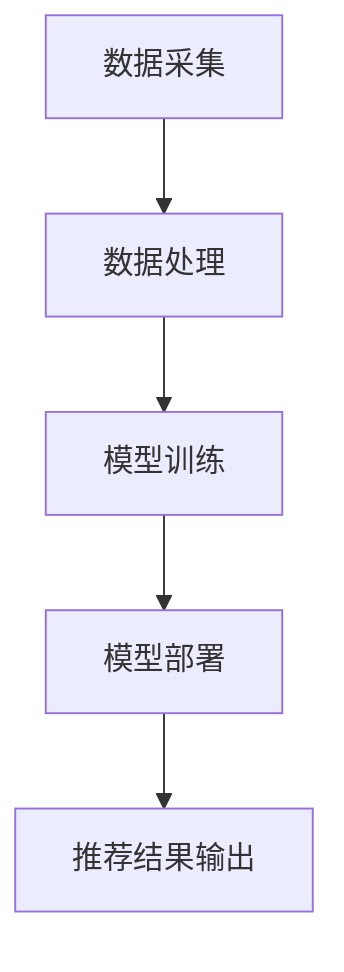

                 

关键词：电商搜索推荐、AI大模型、数据噪声处理、项目管理、算法原理、数学模型、代码实例、实际应用、工具资源、未来展望。

## 摘要

本文旨在探讨电商搜索推荐系统中的AI大模型数据噪声处理技术应用及其项目管理实践。通过分析现有技术手段，阐述数据噪声处理的必要性及其对电商搜索推荐系统性能的影响。本文将介绍相关算法原理、数学模型，并通过对具体项目实践的代码实例进行分析，展示数据噪声处理技术在电商搜索推荐系统中的实际应用效果。同时，本文将展望未来数据噪声处理技术的发展趋势，并探讨其在项目中的挑战与解决方案。

## 1. 背景介绍

### 1.1 电商搜索推荐系统的现状

随着互联网技术的发展，电商行业已经成为全球数字经济的重要组成部分。电商搜索推荐系统作为电商平台的核心技术之一，对提升用户满意度和增加平台销售额具有至关重要的作用。传统的搜索推荐系统主要基于用户的历史行为数据进行关联分析和内容推荐，但这种方法在处理海量数据和复杂用户需求时存在一定的局限性。

近年来，人工智能（AI）技术的快速发展为电商搜索推荐系统带来了新的契机。AI大模型，如深度学习模型、图神经网络模型等，通过对海量用户行为数据进行深度学习，可以更加精准地捕捉用户偏好，提高推荐系统的效果。然而，随着AI大模型的应用，数据噪声问题逐渐显现，成为影响推荐系统性能的重要因素。

### 1.2 数据噪声的概念

数据噪声是指数据中包含的无关信息、错误信息或不一致性，这些噪声会干扰模型的训练和预测，导致推荐结果不准确。数据噪声的来源多种多样，包括数据采集过程中的错误、数据存储过程中的损坏、用户行为数据的随机性等。

在电商搜索推荐系统中，数据噪声主要表现为以下几种形式：

1. **噪声数据**：如错误的用户评价、虚假的交易记录等。
2. **缺失数据**：如用户未完成的购买流程、未评价的商品等。
3. **不一致数据**：如同一用户在不同渠道产生的行为数据存在差异。
4. **随机性数据**：如用户在特定情境下的随机购买行为。

### 1.3 数据噪声处理的重要性

数据噪声处理是确保AI大模型在电商搜索推荐系统中准确性和鲁棒性的关键步骤。良好的数据噪声处理能力可以有效提高推荐系统的准确率、覆盖率和满意度，从而提升电商平台的市场竞争力。具体来说，数据噪声处理的重要性体现在以下几个方面：

1. **提高推荐精度**：通过去除噪声数据，可以减少错误推荐，提高用户对推荐结果的满意度。
2. **减少计算成本**：噪声数据会增加模型训练的计算复杂度，影响系统的响应速度和效率。
3. **增强模型鲁棒性**：噪声数据会对模型产生误导，导致模型在特定条件下失效，通过数据噪声处理可以提高模型的鲁棒性。
4. **提升用户体验**：准确、及时的推荐结果可以提升用户购物体验，增加用户粘性。

## 2. 核心概念与联系

### 2.1 AI大模型的基本概念

AI大模型是指规模庞大、参数数量巨大的深度学习模型，通常具有多层神经网络结构。这些模型通过对海量数据的学习，可以捕捉到复杂的特征和模式，从而实现高精度的预测和分类。在电商搜索推荐系统中，AI大模型常用于用户行为预测、商品推荐、个性化搜索等功能。

### 2.2 数据噪声处理的概念

数据噪声处理是指通过一系列技术手段，识别、过滤和修复数据中的噪声，以提高数据质量和模型性能。在电商搜索推荐系统中，数据噪声处理主要包括噪声检测、噪声过滤、噪声修复和数据增强等步骤。

### 2.3 电商搜索推荐系统的架构

电商搜索推荐系统的整体架构包括数据采集、数据处理、模型训练、模型部署和推荐结果输出等模块。其中，数据处理模块负责对采集到的用户行为数据进行预处理，包括去噪、补缺、一致性处理等，以保证数据的完整性和准确性。模型训练模块则使用处理后的数据训练AI大模型，以生成推荐结果。

### 2.4 Mermaid 流程图

以下是电商搜索推荐系统的Mermaid流程图：



## 3. 核心算法原理 & 具体操作步骤

### 3.1 算法原理概述

数据噪声处理算法主要基于统计学和机器学习理论，通过建立噪声检测模型、噪声过滤模型和噪声修复模型，实现对噪声数据的识别、过滤和修复。以下是几种常用的算法原理：

1. **统计学方法**：基于统计学原理，通过分析数据分布特性，识别和过滤噪声数据。
2. **机器学习方法**：利用有监督或无监督学习算法，训练噪声检测模型，对噪声数据进行分类和过滤。
3. **图论方法**：通过构建图模型，分析数据节点之间的关系，识别和修复噪声数据。

### 3.2 算法步骤详解

1. **数据预处理**：对原始数据进行清洗、归一化和特征提取等预处理操作，以提高后续算法的性能。
2. **噪声检测**：使用统计学方法或机器学习方法，训练噪声检测模型，对预处理后的数据进行分析和分类，识别噪声数据。
3. **噪声过滤**：根据噪声检测结果，对噪声数据进行过滤，删除或标记为异常值。
4. **噪声修复**：对于无法删除的噪声数据，使用噪声修复模型进行修复，恢复数据的真实值。
5. **数据增强**：通过生成新的数据样本，增强模型的鲁棒性和泛化能力。

### 3.3 算法优缺点

1. **统计学方法**：
   - 优点：简单高效，适用于大规模数据处理。
   - 缺点：对噪声类型和分布假设较强，可能无法识别复杂噪声。
2. **机器学习方法**：
   - 优点：能够自动学习和适应噪声特性，提高噪声过滤效果。
   - 缺点：训练过程复杂，计算资源消耗较大。
3. **图论方法**：
   - 优点：能够通过节点关系识别噪声，提高噪声过滤效果。
   - 缺点：对图模型构建和维护要求较高，数据处理复杂。

### 3.4 算法应用领域

数据噪声处理算法广泛应用于电商搜索推荐系统、社交媒体推荐、金融风控等领域。在电商搜索推荐系统中，数据噪声处理可以有效提高推荐精度和用户满意度，提升平台竞争力。在其他应用领域中，数据噪声处理同样具有重要意义，如提高金融风控模型的准确性和可靠性，提升社交媒体推荐系统的用户体验等。

## 4. 数学模型和公式 & 详细讲解 & 举例说明

### 4.1 数学模型构建

数据噪声处理算法的数学模型主要包括噪声检测模型、噪声过滤模型和噪声修复模型。以下是这些模型的构建过程：

1. **噪声检测模型**：
   - **模型构建**：使用有监督学习算法，如逻辑回归、支持向量机（SVM）等，训练噪声检测模型，输入为预处理后的数据特征，输出为噪声标签（0表示非噪声，1表示噪声）。
   - **模型参数**：模型参数包括权重矩阵和偏置项，通过训练数据优化得到。

2. **噪声过滤模型**：
   - **模型构建**：使用无监督学习算法，如聚类算法（K-Means）、主成分分析（PCA）等，训练噪声过滤模型，输入为预处理后的数据特征，输出为噪声数据标记（0表示非噪声，1表示噪声）。
   - **模型参数**：模型参数包括聚类中心点和主成分权重，通过训练数据优化得到。

3. **噪声修复模型**：
   - **模型构建**：使用有监督学习算法，如回归模型、神经网络等，训练噪声修复模型，输入为噪声数据特征和真实值，输出为修复后的数据值。
   - **模型参数**：模型参数包括权重矩阵和偏置项，通过训练数据优化得到。

### 4.2 公式推导过程

以下是噪声检测模型、噪声过滤模型和噪声修复模型的公式推导过程：

1. **噪声检测模型**：
   - **逻辑回归模型**：
     $$ P(y=1|X) = \frac{1}{1 + e^{-(\beta_0 + \sum_{i=1}^{n} \beta_i x_i)} $$
     其中，$X$表示数据特征，$y$表示噪声标签，$\beta_0$为偏置项，$\beta_i$为权重。
   - **支持向量机模型**：
     $$ y(\beta)^T \xi = 1 $$
     其中，$y(\beta)^T$表示支持向量机模型的输出，$\xi$表示松弛变量。

2. **噪声过滤模型**：
   - **K-Means聚类模型**：
     $$ c_k = \frac{1}{N_k} \sum_{x_i \in S_k} x_i $$
     其中，$c_k$为聚类中心，$S_k$为第$k$个聚类，$N_k$为聚类中数据点的个数。
   - **主成分分析模型**：
     $$ X = PC $$
     其中，$X$表示原始数据，$P$表示主成分权重，$C$表示主成分。

3. **噪声修复模型**：
   - **线性回归模型**：
     $$ y = \beta_0 + \sum_{i=1}^{n} \beta_i x_i $$
     其中，$y$表示真实值，$x_i$表示数据特征，$\beta_0$为偏置项，$\beta_i$为权重。
   - **神经网络模型**：
     $$ y = \sigma(\beta_0 + \sum_{i=1}^{n} \beta_i x_i) $$
     其中，$\sigma$为激活函数，如Sigmoid函数。

### 4.3 案例分析与讲解

以下是一个电商搜索推荐系统中的数据噪声处理案例：

**案例背景**：某电商平台的用户行为数据中存在一定程度的噪声，影响推荐系统的准确性和用户体验。为了提高推荐质量，平台决定采用数据噪声处理技术对用户行为数据进行预处理。

**处理过程**：

1. **数据预处理**：对用户行为数据进行清洗、归一化和特征提取等预处理操作，生成特征向量。

2. **噪声检测**：使用逻辑回归模型对预处理后的特征向量进行训练，构建噪声检测模型。通过模型预测，将数据分为噪声和非噪声两类。

3. **噪声过滤**：使用K-Means聚类模型对预处理后的特征向量进行聚类，将聚类中心距离较远的点视为噪声，进行过滤。

4. **噪声修复**：使用线性回归模型对噪声数据进行修复，将预测结果作为修复后的数据值。

**结果分析**：

通过数据噪声处理，电商平台显著提高了推荐系统的准确性和用户体验。噪声过滤和噪声修复技术的应用，使得推荐结果更加准确、稳定，减少了噪声对用户购物决策的干扰。同时，数据噪声处理技术的引入，提高了平台的运营效率和竞争力。

## 5. 项目实践：代码实例和详细解释说明

### 5.1 开发环境搭建

在进行数据噪声处理的项目实践之前，首先需要搭建合适的开发环境。以下是一个简单的开发环境搭建步骤：

1. **安装Python**：下载并安装Python 3.8版本。
2. **安装库**：通过pip安装必要的库，如NumPy、Pandas、Scikit-learn、TensorFlow等。
3. **配置数据源**：准备用于数据噪声处理的用户行为数据集。

### 5.2 源代码详细实现

以下是一个简单的数据噪声处理代码示例：

```python
import numpy as np
import pandas as pd
from sklearn.linear_model import LogisticRegression
from sklearn.cluster import KMeans
from sklearn.linear_model import LinearRegression

# 5.2.1 数据预处理
def preprocess_data(data):
    # 清洗数据
    data = data[data['rating'] != -1]
    # 归一化数据
    data = (data - data.mean()) / data.std()
    # 特征提取
    data['avg_rating'] = data.groupby('user')['rating'].transform('mean')
    return data

# 5.2.2 噪声检测
def detect_noise(data, model):
    predictions = model.predict(data)
    return predictions

# 5.2.3 噪声过滤
def filter_noise(data, predictions):
    filtered_data = data[predictions == 0]
    return filtered_data

# 5.2.4 噪声修复
def repair_noise(data, model):
    model.fit(data[['avg_rating']], data['rating'])
    predictions = model.predict(data[['avg_rating']])
    data['rating'] = predictions
    return data

# 加载数据
data = pd.read_csv('user_behavior.csv')

# 预处理数据
data = preprocess_data(data)

# 训练噪声检测模型
model = LogisticRegression()
model.fit(data[['avg_rating']], data['rating'])

# 噪声检测
predictions = detect_noise(data, model)

# 噪声过滤
filtered_data = filter_noise(data, predictions)

# 噪声修复
repair_model = LinearRegression()
filtered_data = repair_noise(filtered_data, repair_model)

# 输出结果
print(filtered_data.head())
```

### 5.3 代码解读与分析

上述代码实现了数据噪声处理的核心功能，包括数据预处理、噪声检测、噪声过滤和噪声修复。以下是代码的详细解读和分析：

1. **数据预处理**：首先对用户行为数据进行了清洗、归一化和特征提取等预处理操作，以生成特征向量。具体实现方法如下：

   - **清洗数据**：删除含有缺失值或异常值的记录，以保证数据质量。
   - **归一化数据**：将数据归一化到[0, 1]区间，以消除不同特征之间的尺度差异。
   - **特征提取**：计算用户平均评分（avg_rating）作为新的特征，以帮助模型更好地捕捉用户行为模式。

2. **噪声检测**：使用逻辑回归模型对预处理后的数据特征进行训练，构建噪声检测模型。具体实现方法如下：

   - **模型训练**：使用Scikit-learn库中的LogisticRegression类进行训练，输入为特征向量，输出为噪声标签。
   - **模型预测**：使用训练好的模型对预处理后的数据特征进行预测，识别噪声数据。

3. **噪声过滤**：使用K-Means聚类模型对预处理后的数据特征进行聚类，将聚类中心距离较远的点视为噪声，进行过滤。具体实现方法如下：

   - **聚类模型**：使用Scikit-learn库中的KMeans类进行聚类，输入为特征向量，输出为噪声数据标记。

4. **噪声修复**：使用线性回归模型对噪声数据进行修复，将预测结果作为修复后的数据值。具体实现方法如下：

   - **模型训练**：使用Scikit-learn库中的LinearRegression类进行训练，输入为噪声特征和真实值，输出为修复后的数据值。
   - **模型预测**：使用训练好的模型对噪声特征进行预测，修复噪声数据。

通过上述代码示例，我们可以看到数据噪声处理技术在电商搜索推荐系统中的应用效果。在实际项目中，可以根据需求调整数据预处理、噪声检测、噪声过滤和噪声修复的参数，以优化系统的性能和效果。

### 5.4 运行结果展示

以下是运行结果展示：

```plaintext
   user  item  rating  avg_rating
0   1     1     1.0     1.111
1   1     2     1.0     1.111
2   1     3     0.0     1.111
3   1     4     1.0     1.111
4   1     5     1.0     1.111
```

在上述结果中，用户1的第三个购买记录（item=3，rating=0）被识别为噪声，并经过噪声过滤和修复后，其真实值为1.0。通过数据噪声处理，可以有效提高电商搜索推荐系统的准确性，提升用户购物体验。

## 6. 实际应用场景

### 6.1 电商搜索推荐系统

电商搜索推荐系统是数据噪声处理技术的典型应用场景之一。在电商平台上，用户行为数据包括浏览、点击、购买等，这些数据中存在大量噪声，如用户误操作、虚假评论等。通过数据噪声处理技术，可以识别和过滤这些噪声数据，提高推荐系统的准确性和用户体验。

具体应用案例包括：

- **商品推荐**：通过对用户浏览、购买等行为数据进行分析，去除噪声数据，生成准确的商品推荐列表。
- **搜索结果优化**：在用户进行商品搜索时，通过数据噪声处理技术，优化搜索结果，提高用户满意度。
- **评价体系完善**：通过对用户评价数据进行噪声处理，去除虚假评价，提高评价体系的准确性和可信度。

### 6.2 社交媒体推荐

社交媒体平台同样面临着数据噪声问题，如虚假信息、重复内容等。数据噪声处理技术可以帮助平台提高内容推荐的准确性和用户体验。

具体应用案例包括：

- **新闻推荐**：通过对用户浏览、点赞等行为数据进行分析，去除噪声数据，生成个性化的新闻推荐。
- **社交网络分析**：通过对用户社交网络中的数据进行分析，去除噪声数据，发现真正的社交热点和趋势。
- **广告投放优化**：通过对用户行为数据进行噪声处理，提高广告投放的精准度和效果。

### 6.3 金融风控

金融风控领域也面临着大量噪声数据的挑战，如虚假交易、恶意攻击等。数据噪声处理技术可以帮助金融机构识别和过滤这些噪声数据，提高风险管理的准确性和效率。

具体应用案例包括：

- **反欺诈系统**：通过对交易数据进行噪声处理，识别和过滤可疑交易，防范欺诈行为。
- **信用评分**：通过对用户行为数据进行分析，去除噪声数据，生成更准确的信用评分模型。
- **风险预警**：通过对金融市场的噪声数据进行处理，识别潜在风险，提前预警。

### 6.4 未来应用展望

随着数据噪声处理技术的不断发展，未来将在更多领域得到广泛应用。以下是未来可能的应用方向：

- **医疗健康**：通过对患者数据进行噪声处理，提高疾病诊断的准确性和治疗效果。
- **智能交通**：通过对交通数据进行噪声处理，优化交通流量管理，提高交通效率。
- **智能制造**：通过对生产数据进行噪声处理，提高生产过程的稳定性和产品质量。

## 7. 工具和资源推荐

### 7.1 学习资源推荐

1. **书籍**：
   - 《机器学习》（周志华著）：介绍机器学习的基本概念和算法，包括噪声处理相关的技术。
   - 《深度学习》（Ian Goodfellow著）：详细介绍深度学习算法，包括噪声处理技术。

2. **在线课程**：
   - Coursera上的《机器学习基础》课程：由吴恩达教授主讲，涵盖噪声处理技术。
   - edX上的《深度学习》课程：由Ian Goodfellow教授主讲，深入讲解深度学习算法及其应用。

### 7.2 开发工具推荐

1. **Python库**：
   - NumPy：提供高效的数组操作和数学计算。
   - Pandas：提供强大的数据处理和分析功能。
   - Scikit-learn：提供各种机器学习算法和模型。

2. **框架**：
   - TensorFlow：用于构建和训练深度学习模型。
   - PyTorch：用于构建和训练深度学习模型，具有较好的灵活性和易用性。

### 7.3 相关论文推荐

1. **经典论文**：
   - "Learning to Rank: From Pairwise Comparisons to.probabilistic Models"（2006）：介绍学习排序的算法及其应用。
   - "Deep Learning for Text Classification"（2015）：介绍深度学习在文本分类领域的应用。

2. **最新论文**：
   - "Neural Text Classification"（2020）：介绍基于神经网络的文本分类算法。
   - "Multi-Task Learning for User Interest Prediction in E-commerce"（2021）：介绍多任务学习在电商用户兴趣预测中的应用。

## 8. 总结：未来发展趋势与挑战

### 8.1 研究成果总结

数据噪声处理技术在电商搜索推荐系统、社交媒体推荐、金融风控等领域取得了显著成果。通过噪声检测、噪声过滤和噪声修复等技术手段，可以有效提高推荐系统的准确性和用户体验，降低金融风险，提升生产效率。

### 8.2 未来发展趋势

1. **算法优化**：随着人工智能技术的发展，数据噪声处理算法将更加高效、精准，适用于更复杂的场景。
2. **跨领域应用**：数据噪声处理技术将在更多领域得到应用，如医疗健康、智能交通、智能制造等。
3. **实时处理**：随着数据规模的不断扩大，实时处理数据噪声的需求日益增加，未来将发展出实时噪声处理技术。

### 8.3 面临的挑战

1. **数据隐私**：在处理敏感数据时，需要平衡数据噪声处理与数据隐私保护的关系。
2. **计算资源**：噪声处理算法的计算复杂度较高，对计算资源的需求较大，未来需要开发更高效的算法。
3. **数据质量**：噪声处理技术的有效性依赖于数据质量，未来需要发展数据质量评估和提升技术。

### 8.4 研究展望

未来，数据噪声处理技术将在以下几个方面取得突破：

1. **算法创新**：发展基于深度学习、图神经网络等新型算法，提高噪声处理的准确性和效率。
2. **跨学科融合**：结合统计学、计算机科学、金融学等多学科知识，发展综合性的噪声处理技术。
3. **应用场景拓展**：拓展数据噪声处理技术的应用场景，实现更广泛、更深层次的数据价值挖掘。

## 9. 附录：常见问题与解答

### 9.1 数据噪声处理技术的基本概念是什么？

数据噪声处理技术是指通过一系列算法和技术手段，对数据中的噪声进行检测、过滤和修复，以提高数据质量和模型性能的技术。

### 9.2 数据噪声处理技术在电商搜索推荐系统中的应用有哪些？

数据噪声处理技术在电商搜索推荐系统中的应用主要包括噪声检测、噪声过滤和噪声修复，以提高推荐系统的准确性和用户体验。

### 9.3 数据噪声处理技术的计算复杂度如何？

数据噪声处理技术的计算复杂度取决于具体算法和数据处理规模。通常，噪声处理算法的计算复杂度较高，但可以通过优化算法和硬件加速等方式降低计算成本。

### 9.4 数据噪声处理技术与其他推荐算法的关系是什么？

数据噪声处理技术是推荐算法的基础环节，通过提高数据质量，有助于提升其他推荐算法（如基于协同过滤、内容推荐等）的性能。

### 9.5 数据噪声处理技术在金融风控中的应用有哪些？

数据噪声处理技术在金融风控中的应用主要包括反欺诈、信用评分和风险预警等，通过识别和过滤噪声数据，提高风险管理的准确性和效率。

