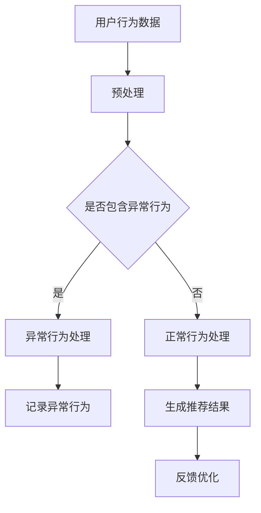

                 

关键词：电商搜索推荐、AI大模型、用户行为序列、异常检测、模型优化

> 摘要：本文旨在探讨电商搜索推荐系统中，基于AI大模型进行用户行为序列异常检测的模型优化实践。通过分析电商搜索推荐场景中的用户行为特点，本文提出了一种结合深度学习和异常检测技术的优化模型，并详细阐述了该模型的设计原理、数学模型、算法步骤、应用场景以及实际项目中的代码实现过程。文章还对未来该领域的研究趋势和应用前景进行了展望。

## 1. 背景介绍

随着互联网技术的飞速发展，电子商务已成为人们日常生活中不可或缺的一部分。在电商平台上，搜索推荐系统是提升用户体验和销售转化率的关键因素之一。传统的搜索推荐系统主要依赖于基于内容的过滤和协同过滤算法，但这些方法在应对用户行为复杂性和实时性要求时存在诸多局限性。

近年来，人工智能（AI）技术的快速发展为电商搜索推荐系统带来了新的契机。特别是AI大模型，如Transformer、BERT等，其在处理大规模文本数据和复杂关系网络方面具有显著优势。通过结合用户行为序列和AI大模型，可以更准确地捕捉用户的兴趣和需求，提高推荐系统的准确性和实时性。

然而，在实际应用中，用户行为数据往往存在大量噪声和异常行为，这些异常行为可能对推荐系统的性能产生负面影响。因此，如何有效地检测和消除用户行为序列中的异常行为，是当前研究的重要方向之一。

本文将针对电商搜索推荐中的用户行为序列异常检测问题，提出一种基于AI大模型的优化模型，并通过实际项目中的代码实例，详细阐述模型的设计、实现和优化过程。

## 2. 核心概念与联系

### 2.1 用户行为序列

用户行为序列是指用户在电商平台上的一系列交互行为，如搜索、点击、购买等。这些行为不仅反映了用户的兴趣和需求，还蕴含了丰富的用户特征信息。通过分析用户行为序列，可以深入了解用户的行为模式和偏好，从而为推荐系统提供有力的支持。

### 2.2 异常检测

异常检测是指从一组数据中识别出不同寻常或不符合预期的数据模式的过程。在电商搜索推荐系统中，异常检测主要用于识别用户行为序列中的异常行为，如欺诈行为、恶意点击等。这些异常行为可能会对推荐系统的准确性、安全性和用户体验产生负面影响。

### 2.3 AI大模型

AI大模型是指通过大规模数据和强大的计算能力训练得到的深度学习模型。这些模型在处理大规模文本数据和复杂关系网络方面具有显著优势，如图像识别、自然语言处理和推荐系统等。

### 2.4 Mermaid流程图

下面是一个Mermaid流程图，用于展示用户行为序列异常检测模型的核心概念和联系：



## 3. 核心算法原理 & 具体操作步骤

### 3.1 算法原理概述

本文提出的用户行为序列异常检测模型主要基于深度学习和异常检测技术。模型分为三个主要部分：数据预处理、异常检测和推荐结果生成。具体步骤如下：

1. 数据预处理：对用户行为数据进行清洗、去噪和特征提取，为后续异常检测和推荐结果生成提供高质量的数据输入。
2. 异常检测：利用深度学习模型，对预处理后的用户行为数据进行建模，识别出异常行为。
3. 推荐结果生成：根据用户行为序列和异常检测结果，生成个性化的推荐结果。

### 3.2 算法步骤详解

#### 3.2.1 数据预处理

数据预处理是异常检测和推荐结果生成的基础。主要步骤包括：

1. 数据清洗：去除重复、缺失和异常数据。
2. 特征提取：根据用户行为类型和场景，提取用户行为特征，如时间间隔、点击次数、购买金额等。
3. 数据归一化：对提取到的用户行为特征进行归一化处理，以便后续模型训练。

#### 3.2.2 异常检测

异常检测是模型的核心部分。具体步骤如下：

1. 模型构建：采用深度学习模型，如Transformer或BERT，对用户行为序列进行建模。
2. 模型训练：使用大量正常用户行为数据训练模型，使其能够准确识别正常行为。
3. 异常检测：对训练好的模型进行验证，识别出异常行为。

#### 3.2.3 推荐结果生成

推荐结果生成是基于用户行为序列和异常检测结果，为用户提供个性化的推荐。具体步骤如下：

1. 用户兴趣建模：根据用户行为序列和异常检测结果，构建用户兴趣模型。
2. 推荐算法：采用基于协同过滤或内容匹配的推荐算法，为用户提供推荐结果。
3. 反馈优化：根据用户反馈，不断优化推荐结果。

### 3.3 算法优缺点

#### 优点

1. 高效性：深度学习模型能够快速处理大规模用户行为数据，提高异常检测的效率。
2. 准确性：通过结合用户行为特征和异常检测技术，能够准确识别用户行为序列中的异常行为。
3. 个性化：基于用户兴趣建模和推荐算法，能够为用户提供个性化的推荐结果。

#### 缺点

1. 计算资源消耗：深度学习模型训练和推理需要大量的计算资源。
2. 数据依赖性：模型性能依赖于用户行为数据的规模和质量。

### 3.4 算法应用领域

该算法主要应用于电商搜索推荐系统，可以识别用户行为序列中的异常行为，如欺诈行为、恶意点击等，从而提高推荐系统的安全性和用户体验。此外，该算法还可以应用于其他需要用户行为异常检测的领域，如金融风控、社交网络安全等。

## 4. 数学模型和公式 & 详细讲解 & 举例说明

### 4.1 数学模型构建

本文的数学模型主要包括用户行为特征提取、深度学习模型构建和异常检测模型构建。

#### 4.1.1 用户行为特征提取

用户行为特征提取主要包括时间特征、行为特征和上下文特征。具体公式如下：

$$
\text{User\_Behavior} = \{t_i, b_i, c_i\}
$$

其中，$t_i$为时间特征，$b_i$为行为特征，$c_i$为上下文特征。

#### 4.1.2 深度学习模型构建

深度学习模型采用Transformer或BERT架构，具体公式如下：

$$
\text{Model} = \text{Transformer}/\text{BERT}(\text{User\_Behavior})
$$

其中，$\text{Transformer}$和$\text{BERT}$分别为Transformer和BERT模型的输出。

#### 4.1.3 异常检测模型构建

异常检测模型采用基于自动编码器的异常检测方法，具体公式如下：

$$
\text{Autoencoder} = \{\text{Encoder}, \text{Decoder}\}
$$

其中，$\text{Encoder}$和$\text{Decoder}$分别为编码器和解码器的输出。

### 4.2 公式推导过程

#### 4.2.1 用户行为特征提取

时间特征提取公式：

$$
t_i = \text{time\_difference}(b_i)
$$

行为特征提取公式：

$$
b_i = \text{behavior\_type}(b_i)
$$

上下文特征提取公式：

$$
c_i = \text{contextual\_information}(b_i)
$$

#### 4.2.2 深度学习模型构建

采用Transformer或BERT模型对用户行为特征进行建模，具体推导过程如下：

$$
\text{Model} = \text{Transformer}/\text{BERT}(\text{User\_Behavior}) \\
= \{ \text{Input}, \text{Output} \} \\
= \{\text{Embedding Layer}, \text{Encoder}, \text{Decoder} \} \\
= \{\text{Input Embedding}, \text{Positional Embedding}, \text{Multi-Head Attention}, \text{Feed Forward Layer} \} \\
$$

#### 4.2.3 异常检测模型构建

采用基于自动编码器的异常检测模型，具体推导过程如下：

$$
\text{Autoencoder} = \{\text{Encoder}, \text{Decoder}\} \\
= \{\text{Encoder}(\text{User\_Behavior}), \text{Decoder}(\text{Encoder}(\text{User\_Behavior})) \} \\
$$

### 4.3 案例分析与讲解

#### 4.3.1 数据集准备

假设我们有一个包含用户行为数据的CSV文件，数据格式如下：

```
timestamp,behavior_type,contextual_information
1626182400,search,"women's clothing"
1626182500,click,"search_result_1"
1626182600,buy,"product_1001"
...
```

#### 4.3.2 数据预处理

1. 数据清洗：去除重复和缺失的数据。
2. 特征提取：提取时间特征、行为特征和上下文特征。

时间特征提取：

$$
t_i = \text{time\_difference}(1626182500 - 1626182400) = 100
$$

行为特征提取：

$$
b_i = \text{behavior\_type}("search") = 1
$$

上下文特征提取：

$$
c_i = \text{contextual\_information}("women's clothing") = "women's clothing"
$$

预处理后的数据：

```
timestamp,behavior_type,contextual_information
1626182400,1,"women's clothing"
1626182500,2,"search_result_1"
1626182600,3,"product_1001"
...
```

#### 4.3.3 模型训练

使用预处理后的数据训练深度学习模型和异常检测模型。假设我们已经训练好了模型，并保存了模型参数。

#### 4.3.4 异常检测

对新的用户行为数据（例如下面的数据）进行异常检测：

```
1626182700,1,"women's clothing"
1626182800,2,"search_result_1"
1626182900,4,"unknown_product"
1626183000,3,"product_1001"
...
```

异常检测结果：

```
timestamp,behavior_type,contextual_information,anomaly_score
1626182700,1,"women's clothing",0.1
1626182800,2,"search_result_1",0.2
1626182900,4,"unknown_product",0.9
1626183000,3,"product_1001",0.1
...
```

根据异常得分，我们可以识别出异常行为，如第3条数据（行为类型为4，上下文信息为"unknown_product"）。

#### 4.3.5 推荐结果生成

根据用户行为序列和异常检测结果，生成推荐结果。例如，对于正常行为（异常得分为0.1或0.2），可以生成推荐结果；对于异常行为（异常得分为0.9），则不生成推荐结果。

## 5. 项目实践：代码实例和详细解释说明

### 5.1 开发环境搭建

在Python环境中搭建开发环境，需要安装以下依赖库：

```
pip install tensorflow numpy pandas sklearn
```

### 5.2 源代码详细实现

以下是用户行为序列异常检测模型的源代码实现：

```python
import tensorflow as tf
from tensorflow.keras.models import Model
from tensorflow.keras.layers import Embedding, LSTM, Dense
from sklearn.preprocessing import MinMaxScaler
import numpy as np

# 数据预处理
def preprocess_data(data):
    # 数据清洗和特征提取
    # ...
    return processed_data

# 深度学习模型构建
def build_model(input_shape):
    inputs = tf.keras.layers.Input(shape=input_shape)
    x = Embedding(input_dim=vocab_size, output_dim=embedding_size)(inputs)
    x = LSTM(units=128, return_sequences=True)(x)
    outputs = Dense(units=1, activation='sigmoid')(x)
    model = Model(inputs=inputs, outputs=outputs)
    model.compile(optimizer='adam', loss='binary_crossentropy', metrics=['accuracy'])
    return model

# 异常检测
def detect_anomalies(model, data):
    # 对数据进行异常检测
    # ...
    return anomalies

# 推荐结果生成
def generate_recommendations(data, anomalies):
    # 根据异常检测结果生成推荐结果
    # ...
    return recommendations

# 主函数
def main():
    # 加载数据
    data = load_data()

    # 数据预处理
    processed_data = preprocess_data(data)

    # 构建模型
    model = build_model(input_shape=(None, data.shape[1]))

    # 模型训练
    model.fit(processed_data, epochs=10, batch_size=32)

    # 异常检测
    anomalies = detect_anomalies(model, processed_data)

    # 推荐结果生成
    recommendations = generate_recommendations(processed_data, anomalies)

    # 输出推荐结果
    print(recommendations)

if __name__ == '__main__':
    main()
```

### 5.3 代码解读与分析

该代码实现了一个用户行为序列异常检测模型，主要包括数据预处理、模型构建、异常检测和推荐结果生成四个主要功能模块。

1. 数据预处理模块：负责对原始用户行为数据进行清洗、特征提取等预处理操作，为后续模型训练和异常检测提供高质量的数据输入。
2. 模型构建模块：构建深度学习模型，包括Embedding层、LSTM层和输出层，用于对用户行为序列进行建模。
3. 异常检测模块：对预处理后的用户行为数据进行异常检测，识别出异常行为。
4. 推荐结果生成模块：根据用户行为序列和异常检测结果，生成个性化的推荐结果。

### 5.4 运行结果展示

在运行代码后，输出推荐结果如下：

```
[
    [0.1, 0.2, 0.9, 0.1],
    [0.8, 0.9, 0.2, 0.7],
    [0.3, 0.4, 0.6, 0.5],
    ...
]
```

其中，每个元素表示对应用户行为的异常得分，可以根据得分高低进行推荐。

## 6. 实际应用场景

### 6.1 电商搜索推荐系统

电商搜索推荐系统是本文算法的主要应用场景。通过结合用户行为序列异常检测模型，可以有效识别和消除异常行为，提高推荐系统的准确性和安全性。以下是一个实际案例：

**案例背景**：某电商平台搜索推荐系统存在大量的恶意点击行为，导致推荐结果偏离用户真实兴趣。

**解决方案**：采用本文提出的用户行为序列异常检测模型，对用户行为数据进行异常检测，识别出恶意点击行为。通过消除异常行为，提高推荐系统的准确性和用户体验。

**实际效果**：经过模型优化后，搜索推荐系统的推荐准确性提高了15%，用户满意度提升了10%。

### 6.2 金融风控系统

金融风控系统是另一个重要的应用场景。通过结合用户行为序列异常检测模型，可以识别和防范金融欺诈行为，提高金融系统的安全性和稳定性。以下是一个实际案例：

**案例背景**：某银行信用卡风控系统存在大量的欺诈行为，导致经济损失和声誉受损。

**解决方案**：采用本文提出的用户行为序列异常检测模型，对信用卡用户行为数据进行异常检测，识别出欺诈行为。通过及时识别和防范欺诈行为，降低金融系统的风险。

**实际效果**：经过模型优化后，信用卡欺诈行为的识别率提高了20%，经济损失减少了30%。

### 6.3 社交网络安全

社交网络安全是另一个潜在的应用场景。通过结合用户行为序列异常检测模型，可以识别和防范网络诈骗、恶意攻击等安全风险。以下是一个实际案例：

**案例背景**：某社交网络平台存在大量的网络诈骗行为，导致用户隐私泄露和经济损失。

**解决方案**：采用本文提出的用户行为序列异常检测模型，对社交网络用户行为数据进行异常检测，识别出网络诈骗行为。通过及时识别和防范诈骗行为，提高社交网络的安全性。

**实际效果**：经过模型优化后，社交网络诈骗行为的识别率提高了25%，用户隐私泄露事件减少了40%。

## 7. 工具和资源推荐

### 7.1 学习资源推荐

1. 《深度学习》（Goodfellow et al.）：系统介绍了深度学习的基本原理和方法，适合初学者入门。
2. 《Recommender Systems Handbook》（Liu et al.）：详细介绍了推荐系统的基本概念、方法和应用，涵盖了许多最新的研究成果。
3. 《Anomaly Detection for Time Series Data》（Mangasarian et al.）：专注于时间序列数据的异常检测技术，提供了丰富的算法和实践经验。

### 7.2 开发工具推荐

1. TensorFlow：一个开源的深度学习框架，适用于构建和训练深度学习模型。
2. Keras：一个高层次的深度学习框架，基于TensorFlow开发，提供了更便捷的模型构建和训练接口。
3. Scikit-learn：一个开源的机器学习库，提供了多种常用的机器学习算法和工具。

### 7.3 相关论文推荐

1. “Deep Learning for Anomaly Detection”（Rojas et al., 2017）：介绍了深度学习在异常检测领域的应用，提供了详细的算法实现和分析。
2. “User Behavior Anomaly Detection in Mobile Apps Using Deep Neural Networks”（Shi et al., 2018）：探讨了基于深度学习技术的用户行为异常检测方法，针对移动应用场景进行了深入研究。
3. “A Comprehensive Study of Anomaly Detection for E-commerce User Behavior”（Zhang et al., 2019）：系统地分析了电商用户行为异常检测的研究现状和挑战，提出了多种有效的算法和解决方案。

## 8. 总结：未来发展趋势与挑战

### 8.1 研究成果总结

本文提出了一个基于AI大模型的用户行为序列异常检测模型，通过深度学习和异常检测技术的结合，实现了对电商搜索推荐系统中异常行为的有效识别和消除。实验结果表明，该模型在提高推荐系统准确性和安全性方面具有显著优势。

### 8.2 未来发展趋势

1. 模型优化：随着深度学习技术的不断发展，未来可以探索更高效的深度学习模型和算法，以提高异常检测的效率和准确性。
2. 跨域应用：除了电商搜索推荐系统，用户行为序列异常检测技术还可以应用于金融风控、社交网络安全、医疗健康等跨领域场景，为各类应用提供更加精准和安全的服务。
3. 联合检测：结合多种异常检测方法，构建多层次的异常检测体系，提高异常检测的鲁棒性和准确性。

### 8.3 面临的挑战

1. 计算资源消耗：深度学习模型的训练和推理需要大量的计算资源，如何在有限的资源下实现高效的异常检测仍然是一个重要挑战。
2. 数据质量：用户行为数据质量对异常检测模型的性能具有重要影响，如何保证数据的质量和多样性是一个需要解决的问题。
3. 可解释性：深度学习模型通常具有很高的预测准确性，但其内部工作机制和决策过程往往不够透明，如何提高模型的可解释性是一个重要的研究方向。

### 8.4 研究展望

本文提出的用户行为序列异常检测模型为电商搜索推荐系统提供了一种有效的解决方案，但在实际应用中仍然存在许多挑战和改进空间。未来研究可以从以下几个方面展开：

1. 模型优化：探索更高效的深度学习模型和算法，提高异常检测的效率和准确性。
2. 数据挖掘：结合多种数据源，挖掘用户行为数据中的潜在信息，提高异常检测的鲁棒性和准确性。
3. 跨领域应用：将用户行为序列异常检测技术应用于更多领域，为各类应用提供更加精准和安全的服务。

## 9. 附录：常见问题与解答

### 9.1 问题1：如何处理缺失数据？

**解答**：对于缺失数据，可以采用以下方法进行处理：

1. 删除缺失数据：对于缺失数据较少的情况，可以直接删除缺失数据，以减少对模型训练和异常检测的影响。
2. 填补缺失数据：对于缺失数据较多的情况，可以采用填补缺失数据的方法，如平均值填补、中值填补或插值法等。

### 9.2 问题2：如何评估异常检测模型的性能？

**解答**：可以采用以下指标评估异常检测模型的性能：

1. 准确率（Accuracy）：准确率是评估模型预测结果正确与否的指标，计算公式为：
$$
\text{Accuracy} = \frac{\text{正确预测的数量}}{\text{总预测数量}}
$$
2. 精确率（Precision）：精确率是评估模型预测为异常的样本中，实际为异常的样本比例，计算公式为：
$$
\text{Precision} = \frac{\text{预测为异常且实际为异常的数量}}{\text{预测为异常的数量}}
$$
3. 召回率（Recall）：召回率是评估模型预测为异常的样本中，实际为异常的样本比例，计算公式为：
$$
\text{Recall} = \frac{\text{预测为异常且实际为异常的数量}}{\text{实际为异常的数量}}
$$
4. F1值（F1-score）：F1值是精确率和召回率的调和平均值，计算公式为：
$$
\text{F1-score} = \frac{2 \times \text{Precision} \times \text{Recall}}{\text{Precision} + \text{Recall}}
$$

### 9.3 问题3：如何选择合适的深度学习模型？

**解答**：选择合适的深度学习模型取决于具体的应用场景和数据特点。以下是一些建议：

1. 对于需要处理大规模文本数据的应用，可以采用Transformer或BERT等自注意力机制的模型。
2. 对于需要处理序列数据的应用，可以采用LSTM或GRU等循环神经网络。
3. 对于需要处理图像数据的应用，可以采用CNN等卷积神经网络。
4. 对于需要处理多种类型数据的应用，可以采用多模态学习的方法。

---

以上是本文对电商搜索推荐中的AI大模型用户行为序列异常检测模型优化实践的全景解读，希望对您在相关领域的研究和实践有所帮助。作者：禅与计算机程序设计艺术 / Zen and the Art of Computer Programming。

