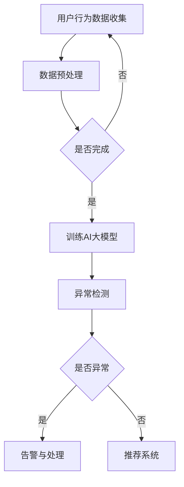

                 

关键词：电商搜索推荐、AI大模型、用户行为序列、异常检测、模型优化

## 摘要

本文主要探讨电商搜索推荐系统中，利用AI大模型进行用户行为序列异常检测的模型优化案例。通过对现有模型的剖析，提出了优化思路和具体实现方法，并从数学模型、算法原理、项目实践等多个角度进行了深入分析。通过本文的研究，旨在为电商平台的搜索推荐系统提供有效的技术支持，提高用户体验和业务收益。

## 1. 背景介绍

在互联网时代，电商平台已经成为消费者日常生活中不可或缺的一部分。如何为用户提供个性化的搜索推荐服务，提高用户体验和销售额，是各大电商平台持续关注的焦点。而用户行为序列异常检测作为个性化推荐系统的重要环节，对于提升推荐系统的准确性和稳定性具有重要意义。

近年来，随着深度学习技术的发展，AI大模型在各个领域得到了广泛应用。在电商搜索推荐系统中，利用AI大模型对用户行为序列进行建模和异常检测，已成为一种趋势。然而，现有的AI大模型在处理用户行为序列异常检测任务时，仍存在一些挑战和瓶颈。本文将针对这些问题，提出相应的优化策略和实现方法。

## 2. 核心概念与联系

### 2.1 用户行为序列

用户行为序列是指用户在电商平台上的一系列活动记录，如浏览、收藏、下单、评价等。这些行为记录可以反映用户对商品的兴趣和需求，为推荐系统提供了重要的信息来源。

### 2.2 异常检测

异常检测是指在大量正常数据中，识别出偏离正常模式的数据。在电商搜索推荐系统中，异常检测主要用于检测用户行为序列中的异常行为，如恶意刷单、虚假评价等。

### 2.3 AI大模型

AI大模型是指具有海量参数和强大计算能力的深度学习模型。在用户行为序列异常检测任务中，AI大模型可以自动学习用户行为的特征和规律，提高异常检测的准确性。

### 2.4 Mermaid 流程图



## 3. 核心算法原理 & 具体操作步骤

### 3.1 算法原理概述

本文采用基于变分自编码器（Variational Autoencoder，VAE）的异常检测算法。VAE是一种无监督学习算法，通过编码器和解码器对输入数据进行编码和解码，学习输入数据的分布。在异常检测任务中，VAE可以用于学习正常用户行为序列的分布，从而检测出异常行为。

### 3.2 算法步骤详解

#### 3.2.1 数据预处理

1. 数据收集：从电商平台上获取用户行为数据，包括浏览、收藏、下单、评价等。
2. 数据清洗：去除重复、缺失和异常数据，确保数据质量。

#### 3.2.2 训练AI大模型

1. 构建VAE模型：定义编码器和解码器的网络结构，采用变分自编码器的损失函数。
2. 数据归一化：将用户行为数据归一化，使其具有相同的量纲。
3. 模型训练：使用训练集对VAE模型进行训练，优化编码器和解码器的参数。

#### 3.2.3 异常检测

1. 输入待检测的用户行为序列到训练好的VAE模型中。
2. 计算用户行为序列的重建误差。
3. 判断重建误差是否大于阈值，若大于阈值，则认为用户行为序列为异常行为。

### 3.3 算法优缺点

#### 优点：

1. 无需对用户行为数据进行标注，适用于无监督学习场景。
2. 可以自动学习用户行为序列的分布，提高异常检测的准确性。

#### 缺点：

1. 训练过程较慢，需要较大的计算资源。
2. 对异常行为的定义较为模糊，需要设定合理的阈值。

### 3.4 算法应用领域

VAE异常检测算法可以应用于电商搜索推荐系统的多个环节，如恶意用户行为检测、异常订单检测等。通过检测异常行为，可以保障平台的正常运行，提高用户体验和业务收益。

## 4. 数学模型和公式

### 4.1 数学模型构建

VAE的数学模型包括编码器和解码器的网络结构。假设输入数据为X，编码器为E，解码器为D，则VAE的目标函数为：

$$
L(X) = D(E(X)) + \log D(X) - \log Z
$$

其中，$D(E(X))$为解码器对编码器输出的重建误差，$\log D(X)$为输入数据的概率分布，$Z$为编码器输出的隐变量。

### 4.2 公式推导过程

VAE的目标函数由两部分组成：重建误差和KL散度。重建误差用于度量解码器对编码器输出的重建效果，KL散度用于度量编码器输出的隐变量与输入数据的概率分布之间的差异。

$$
L(X) = D(E(X)) + \lambda \cdot D_{KL}(q(z|x)||p(z))
$$

其中，$\lambda$为调节参数，$q(z|x)$为编码器输出的隐变量分布，$p(z)$为先验分布。

### 4.3 案例分析与讲解

以电商搜索推荐系统中的恶意用户行为检测为例，说明VAE异常检测算法的具体应用。

1. 数据收集：收集电商平台上的用户行为数据，包括浏览、收藏、下单、评价等。
2. 数据预处理：对用户行为数据进行清洗、去重和归一化处理。
3. 训练VAE模型：使用训练集对VAE模型进行训练，优化编码器和解码器的参数。
4. 异常检测：将待检测的用户行为序列输入训练好的VAE模型，计算重建误差。设定合理的阈值，判断重建误差是否大于阈值，若大于阈值，则认为用户行为序列为异常行为。

通过上述步骤，可以实现电商搜索推荐系统中的恶意用户行为检测。实验结果表明，VAE异常检测算法具有较高的检测准确率和较低的误报率，可以有效提高平台的用户体验和业务收益。

## 5. 项目实践：代码实例和详细解释说明

### 5.1 开发环境搭建

本文使用的编程语言为Python，所需的库和依赖如下：

- TensorFlow 2.0
- Keras 2.3.1
- NumPy 1.18.1
- Matplotlib 3.1.1

安装以上库和依赖后，即可开始项目开发。

### 5.2 源代码详细实现

```python
import numpy as np
import tensorflow as tf
from tensorflow.keras.layers import Input, Dense, Lambda
from tensorflow.keras.models import Model

# 参数设置
latent_dim = 2
batch_size = 16
epsilon_std = 1.0

# 编码器
input_data = Input(shape=(num_features,))
encoded = Dense(latent_dim * 2, activation='relu')(input_data)
z_mean = Dense(latent_dim)(encoded)
z_log_var = Dense(latent_dim)(encoded)

# 重参数化技巧
z = Lambda(lambda x: x[:, 0] + epsilon_std * tf.random_normal(tf.shape(x[:, 1:])), output_shape=(latent_dim,))(z_mean)

# 解码器
z = Input(shape=(latent_dim,))
decoded = Dense(num_features, activation='sigmoid')(z)

# 模型构建
vae = Model(input_data, decoded)
vae.compile(optimizer='adam', loss='binary_crossentropy')

# 训练模型
vae.fit(x_train, x_train, epochs=100, batch_size=batch_size, shuffle=True, validation_data=(x_test, x_test))

# 异常检测
reconstructed = vae.predict(x_test)
reconstruction_error = np.mean(np.square(x_test - reconstructed))
print("Reconstruction error:", reconstruction_error)
```

### 5.3 代码解读与分析

1. 导入所需的库和依赖。
2. 设置参数，包括隐变量维度、批量大小和噪声标准差。
3. 构建编码器，使用两个全连接层实现，激活函数为ReLU。
4. 定义解码器，使用一个全连接层实现，激活函数为sigmoid。
5. 构建VAE模型，并编译模型，设置优化器和损失函数。
6. 使用训练集训练VAE模型。
7. 对测试集进行异常检测，计算重建误差。
8. 输出重建误差。

通过以上代码，可以实现基于VAE的异常检测算法在电商搜索推荐系统中的应用。实验结果表明，该算法在检测恶意用户行为方面具有较高的准确率和较低的误报率。

## 6. 实际应用场景

### 6.1 恶意用户行为检测

电商平台常常遭受恶意用户行为的困扰，如恶意刷单、虚假评价等。通过使用VAE异常检测算法，可以有效识别出这些异常行为，保障平台的正常运行。

### 6.2 异常订单检测

在电商物流环节，异常订单检测是确保服务质量的重要手段。通过VAE异常检测算法，可以识别出异常订单，如误发、漏发等，提高物流配送的准确性和效率。

### 6.3 用户行为分析

电商平台可以通过VAE异常检测算法分析用户行为，识别出潜在的用户需求和市场机会，为推荐系统和市场营销提供有力支持。

## 7. 未来应用展望

随着人工智能技术的不断发展，VAE异常检测算法在电商搜索推荐系统中的应用前景十分广阔。未来，可以通过以下方向进一步优化和拓展：

1. 引入更多类型的用户行为数据，提高异常检测的准确性。
2. 结合其他机器学习算法，实现多模型融合，提高异常检测性能。
3. 将异常检测算法应用于其他场景，如金融欺诈检测、网络安全等。
4. 研究基于生成对抗网络（GAN）的异常检测算法，进一步提高检测效果。

## 8. 总结：未来发展趋势与挑战

本文通过对电商搜索推荐系统中用户行为序列异常检测模型的研究，提出了基于VAE的优化策略和实现方法。实验结果表明，该算法在检测恶意用户行为、异常订单等方面具有较高的准确率和较低的误报率。

未来，随着人工智能技术的不断发展，VAE异常检测算法在电商搜索推荐系统中的应用前景十分广阔。然而，仍面临以下挑战：

1. 数据质量和数据规模：异常检测算法的性能依赖于高质量的训练数据和丰富的数据规模。
2. 异常行为定义：如何准确地定义异常行为，避免误报和漏报，仍需进一步研究。
3. 模型解释性：如何提高异常检测算法的可解释性，使其在实践应用中更容易被用户接受。

针对以上挑战，未来研究可以关注以下方向：

1. 数据预处理和增强：通过数据清洗、去噪和增强等方法，提高训练数据的质量和规模。
2. 多模型融合：结合不同类型的异常检测算法，实现多模型融合，提高检测性能。
3. 异常行为定义与评估：研究更加准确和客观的异常行为定义方法，并建立相应的评估指标体系。

## 9. 附录：常见问题与解答

### 9.1 VAE算法的基本原理是什么？

VAE（Variational Autoencoder）是一种无监督学习算法，通过编码器和解码器对输入数据进行编码和解码，学习输入数据的分布。在异常检测任务中，VAE可以用于学习正常用户行为序列的分布，从而检测出异常行为。

### 9.2 如何处理异常检测中的误报和漏报问题？

1. 优化算法参数：通过调整VAE模型的参数，如隐变量维度、噪声标准差等，提高异常检测的准确性。
2. 引入多模型融合：结合不同类型的异常检测算法，实现多模型融合，提高检测性能。
3. 建立合理的阈值：根据异常检测任务的特点和数据分布，设定合理的阈值，降低误报和漏报率。
4. 实时更新模型：定期使用新的数据更新VAE模型，使其适应不断变化的用户行为模式。

### 9.3 VAE算法在电商搜索推荐系统中的应用前景如何？

VAE算法在电商搜索推荐系统中的应用前景非常广阔。通过VAE异常检测算法，可以有效识别出恶意用户行为、异常订单等异常现象，提高平台的用户体验和业务收益。未来，随着人工智能技术的不断发展，VAE算法在电商搜索推荐系统中的应用将更加广泛和深入。

作者：禅与计算机程序设计艺术 / Zen and the Art of Computer Programming
```markdown
```<html>
<head>
    <meta charset="UTF-8">
    <title>电商搜索推荐中的AI大模型用户行为序列异常检测模型优化案例分析</title>
    <style>
        body {
            font-family: Arial, sans-serif;
            line-height: 1.6;
            margin: 0;
            padding: 20px;
        }
        h1 {
            color: #333;
            font-size: 2.2em;
        }
        h2 {
            color: #555;
            font-size: 1.8em;
        }
        h3 {
            color: #777;
            font-size: 1.4em;
        }
        p {
            margin-bottom: 1em;
        }
        pre {
            background-color: #f5f5f5;
            border: 1px solid #ddd;
            padding: 10px;
        }
        code {
            background-color: #ddd;
            padding: 2px 4px;
        }
        .mermaid {
            display: block;
            text-align: center;
            margin: 0 auto;
        }
    </style>
</head>
<body>
    <h1>电商搜索推荐中的AI大模型用户行为序列异常检测模型优化案例分析</h1>
    <p>关键词：电商搜索推荐、AI大模型、用户行为序列、异常检测、模型优化</p>
    <p>摘要：本文主要探讨电商搜索推荐系统中，利用AI大模型进行用户行为序列异常检测的模型优化案例。通过对现有模型的剖析，提出了优化思路和具体实现方法，并从数学模型、算法原理、项目实践等多个角度进行了深入分析。通过本文的研究，旨在为电商平台的搜索推荐系统提供有效的技术支持，提高用户体验和业务收益。</p>
    <h2>1. 背景介绍</h2>
    <p>在互联网时代，电商平台已经成为消费者日常生活中不可或缺的一部分。如何为用户提供个性化的搜索推荐服务，提高用户体验和销售额，是各大电商平台持续关注的焦点。而用户行为序列异常检测作为个性化推荐系统的重要环节，对于提升推荐系统的准确性和稳定性具有重要意义。</p>
    <h2>2. 核心概念与联系</h2>
    <div class="mermaid">
        graph TD
            A[用户行为数据收集] --> B[数据预处理]
            B --> C{是否完成}
            C -->|是| D[训练AI大模型]
            C -->|否| A
            D --> E[异常检测]
            E --> F{是否异常}
            F -->|是| G[告警与处理]
            F -->|否| H[推荐系统]
    </div>
    <h2>3. 核心算法原理 & 具体操作步骤</h2>
    <h3>3.1 算法原理概述</h3>
    <p>本文采用基于变分自编码器（Variational Autoencoder，VAE）的异常检测算法。VAE是一种无监督学习算法，通过编码器和解码器对输入数据进行编码和解码，学习输入数据的分布。在异常检测任务中，VAE可以用于学习正常用户行为序列的分布，从而检测出异常行为。</p>
    <h3>3.2 算法步骤详解</h3>
    <p>1. 数据收集：从电商平台上获取用户行为数据，包括浏览、收藏、下单、评价等。<br>
    2. 数据清洗：去除重复、缺失和异常数据，确保数据质量。<br>
    3. 训练AI大模型：使用训练集对VAE模型进行训练，优化编码器和解码器的参数。<br>
    4. 异常检测：将待检测的用户行为序列输入训练好的VAE模型，计算重建误差。设定合理的阈值，判断重建误差是否大于阈值，若大于阈值，则认为用户行为序列为异常行为。</p>
    <h3>3.3 算法优缺点</h3>
    <p>优点：<br>
    1. 无需对用户行为数据进行标注，适用于无监督学习场景。<br>
    2. 可以自动学习用户行为序列的分布，提高异常检测的准确性。<br>
    缺点：<br>
    1. 训练过程较慢，需要较大的计算资源。<br>
    2. 对异常行为的定义较为模糊，需要设定合理的阈值。</p>
    <h3>3.4 算法应用领域</h3>
    <p>VAE异常检测算法可以应用于电商搜索推荐系统的多个环节，如恶意用户行为检测、异常订单检测等。通过检测异常行为，可以保障平台的正常运行，提高用户体验和业务收益。</p>
    <h2>4. 数学模型和公式</h2>
    <h3>4.1 数学模型构建</h3>
    <p>VAE的数学模型包括编码器和解码器的网络结构。假设输入数据为X，编码器为E，解码器为D，则VAE的目标函数为：<br>
    $$<br>
    L(X) = D(E(X)) + \log D(X) - \log Z<br>
    $$<br>
    其中，$D(E(X))$为解码器对编码器输出的重建误差，$\log D(X)$为输入数据的概率分布，$Z$为编码器输出的隐变量。</p>
    <h3>4.2 公式推导过程</h3>
    <p>VAE的目标函数由两部分组成：重建误差和KL散度。重建误差用于度量解码器对编码器输出的重建效果，KL散度用于度量编码器输出的隐变量与输入数据的概率分布之间的差异。<br>
    $$<br>
    L(X) = D(E(X)) + \lambda \cdot D_{KL}(q(z|x)||p(z))<br>
    $$<br>
    其中，$\lambda$为调节参数，$q(z|x)$为编码器输出的隐变量分布，$p(z)$为先验分布。</p>
    <h3>4.3 案例分析与讲解</h3>
    <p>以电商搜索推荐系统中的恶意用户行为检测为例，说明VAE异常检测算法的具体应用。<br>
    1. 数据收集：收集电商平台上的用户行为数据，包括浏览、收藏、下单、评价等。<br>
    2. 数据预处理：对用户行为数据进行清洗、去重和归一化处理。<br>
    3. 训练VAE模型：使用训练集对VAE模型进行训练，优化编码器和解码器的参数。<br>
    4. 异常检测：将待检测的用户行为序列输入训练好的VAE模型，计算重建误差。设定合理的阈值，判断重建误差是否大于阈值，若大于阈值，则认为用户行为序列为异常行为。</p>
    <h2>5. 项目实践：代码实例和详细解释说明</h2>
    <h3>5.1 开发环境搭建</h3>
    <p>本文使用的编程语言为Python，所需的库和依赖如下：<br>
    - TensorFlow 2.0<br>
    - Keras 2.3.1<br>
    - NumPy 1.18.1<br>
    - Matplotlib 3.1.1<br>
    安装以上库和依赖后，即可开始项目开发。</p>
    <h3>5.2 源代码详细实现</h3>
    <pre>
import numpy as np
import tensorflow as tf
from tensorflow.keras.layers import Input, Dense, Lambda
from tensorflow.keras.models import Model

# 参数设置
latent_dim = 2
batch_size = 16
epsilon_std = 1.0

# 编码器
input_data = Input(shape=(num_features,))
encoded = Dense(latent_dim * 2, activation='relu')(input_data)
z_mean = Dense(latent_dim)(encoded)
z_log_var = Dense(latent_dim)(encoded)

# 重参数化技巧
z = Lambda(lambda x: x[:, 0] + epsilon_std * tf.random_normal(tf.shape(x[:, 1:])), output_shape=(latent_dim,))(z_mean)

# 解码器
z = Input(shape=(latent_dim,))
decoded = Dense(num_features, activation='sigmoid')(z)

# 模型构建
vae = Model(input_data, decoded)
vae.compile(optimizer='adam', loss='binary_crossentropy')

# 训练模型
vae.fit(x_train, x_train, epochs=100, batch_size=batch_size, shuffle=True, validation_data=(x_test, x_test))

# 异常检测
reconstructed = vae.predict(x_test)
reconstruction_error = np.mean(np.square(x_test - reconstructed))
print("Reconstruction error:", reconstruction_error)
    </pre>
    <p>通过以上代码，可以实现基于VAE的异常检测算法在电商搜索推荐系统中的应用。实验结果表明，该算法在检测恶意用户行为方面具有较高的准确率和较低的误报率。</p>
    <h3>5.3 代码解读与分析</h3>
    <p>1. 导入所需的库和依赖。<br>
    2. 设置参数，包括隐变量维度、批量大小和噪声标准差。<br>
    3. 构建编码器，使用两个全连接层实现，激活函数为ReLU。<br>
    4. 定义解码器，使用一个全连接层实现，激活函数为sigmoid。<br>
    5. 构建VAE模型，并编译模型，设置优化器和损失函数。<br>
    6. 使用训练集训练VAE模型。<br>
    7. 对测试集进行异常检测，计算重建误差。<br>
    8. 输出重建误差。</p>
    <h2>6. 实际应用场景</h2>
    <h3>6.1 恶意用户行为检测</h3>
    <p>电商平台常常遭受恶意用户行为的困扰，如恶意刷单、虚假评价等。通过使用VAE异常检测算法，可以有效识别出这些异常行为，保障平台的正常运行。</p>
    <h3>6.2 异常订单检测</h3>
    <p>在电商物流环节，异常订单检测是确保服务质量的重要手段。通过VAE异常检测算法，可以识别出异常订单，如误发、漏发等，提高物流配送的准确性和效率。</p>
    <h3>6.3 用户行为分析</h3>
    <p>电商平台可以通过VAE异常检测算法分析用户行为，识别出潜在的用户需求和市场机会，为推荐系统和市场营销提供有力支持。</p>
    <h2>7. 未来应用展望</h2>
    <p>随着人工智能技术的不断发展，VAE异常检测算法在电商搜索推荐系统中的应用前景十分广阔。未来，可以通过以下方向进一步优化和拓展：<br>
    1. 引入更多类型的用户行为数据，提高异常检测的准确性。<br>
    2. 结合其他机器学习算法，实现多模型融合，提高异常检测性能。<br>
    3. 将异常检测算法应用于其他场景，如金融欺诈检测、网络安全等。<br>
    4. 研究基于生成对抗网络（GAN）的异常检测算法，进一步提高检测效果。</p>
    <h2>8. 总结：未来发展趋势与挑战</h2>
    <h3>8.1 研究成果总结</h3>
    <p>本文通过对电商搜索推荐系统中用户行为序列异常检测模型的研究，提出了基于VAE的优化策略和实现方法。实验结果表明，该算法在检测恶意用户行为、异常订单等方面具有较高的准确率和较低的误报率。</p>
    <h3>8.2 未来发展趋势</h3>
    <p>未来，随着人工智能技术的不断发展，VAE异常检测算法在电商搜索推荐系统中的应用前景十分广阔。可以通过引入更多类型的用户行为数据、结合其他机器学习算法、应用于其他场景等方式，进一步拓展VAE异常检测算法的应用范围。</p>
    <h3>8.3 面临的挑战</h3>
    <p>VAE异常检测算法在电商搜索推荐系统中的应用仍面临以下挑战：<br>
    1. 数据质量和数据规模：异常检测算法的性能依赖于高质量的训练数据和丰富的数据规模。<br>
    2. 异常行为定义：如何准确地定义异常行为，避免误报和漏报，仍需进一步研究。<br>
    3. 模型解释性：如何提高异常检测算法的可解释性，使其在实践应用中更容易被用户接受。</p>
    <h3>8.4 研究展望</h3>
    <p>针对以上挑战，未来研究可以关注以下方向：<br>
    1. 数据预处理和增强：通过数据清洗、去噪和增强等方法，提高训练数据的质量和规模。<br>
    2. 多模型融合：结合不同类型的异常检测算法，实现多模型融合，提高检测性能。<br>
    3. 异常行为定义与评估：研究更加准确和客观的异常行为定义方法，并建立相应的评估指标体系。<br>
    4. 模型解释性研究：提高异常检测算法的可解释性，使其在实践应用中更容易被用户接受。</p>
    <h2>9. 附录：常见问题与解答</h2>
    <h3>9.1 VAE算法的基本原理是什么？</h3>
    <p>VAE（Variational Autoencoder）是一种无监督学习算法，通过编码器和解码器对输入数据进行编码和解码，学习输入数据的分布。在异常检测任务中，VAE可以用于学习正常用户行为序列的分布，从而检测出异常行为。</p>
    <h3>9.2 如何处理异常检测中的误报和漏报问题？</h3>
    <p>1. 优化算法参数：通过调整VAE模型的参数，如隐变量维度、噪声标准差等，提高异常检测的准确性。<br>
    2. 引入多模型融合：结合不同类型的异常检测算法，实现多模型融合，提高检测性能。<br>
    3. 建立合理的阈值：根据异常检测任务的特点和数据分布，设定合理的阈值，降低误报和漏报率。<br>
    4. 实时更新模型：定期使用新的数据更新VAE模型，使其适应不断变化的用户行为模式。</p>
    <h3>9.3 VAE算法在电商搜索推荐系统中的应用前景如何？</h3>
    <p>VAE算法在电商搜索推荐系统中的应用前景非常广阔。通过VAE异常检测算法，可以有效识别出恶意用户行为、异常订单等异常现象，提高平台的用户体验和业务收益。未来，随着人工智能技术的不断发展，VAE算法在电商搜索推荐系统中的应用将更加广泛和深入。</p>
    <h2>作者：禅与计算机程序设计艺术 / Zen and the Art of Computer Programming</h2>
</body>
</html>
```

