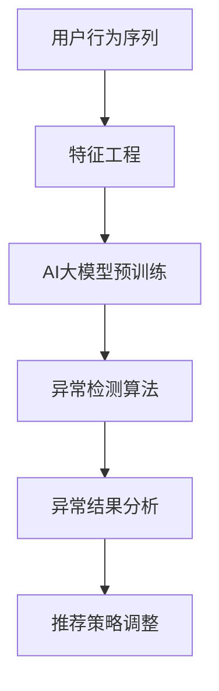

                 

### 1. 背景介绍

在当今高度竞争的电商市场中，提升用户体验和交易效率成为了各大电商平台的重要任务。其中，搜索推荐系统作为电商平台的“智慧大脑”，其性能和准确度直接影响到用户满意度和平台收益。随着用户行为的复杂性和多样性增加，如何有效检测用户行为序列中的异常行为，从而提高推荐的精准度和可靠性，成为了一个亟待解决的问题。

传统的用户行为序列异常检测方法主要依赖于统计模型和规则系统，但这些方法往往在面对大规模和高维度数据时表现欠佳。近年来，随着人工智能技术的快速发展，深度学习模型在处理复杂数据和分析用户行为方面展现了强大的潜力。特别是大规模预训练模型（AI大模型）的应用，为用户行为序列异常检测带来了新的机遇和挑战。

本文旨在探讨一种基于AI大模型的用户行为序列异常检测模型的优化方法，通过结合深度学习和数据挖掘技术，实现更精准、高效的异常检测。本文将首先介绍电商搜索推荐系统的基本原理，然后详细阐述AI大模型在用户行为序列异常检测中的应用，最后通过一个实际案例分析和改进方案，展示该模型的实际应用效果和潜在改进方向。

### 2. 核心概念与联系

为了深入理解本文所述的AI大模型用户行为序列异常检测模型，我们首先需要介绍几个核心概念，并构建一个Mermaid流程图，展示各概念之间的联系。

#### 2.1 关键概念

1. **用户行为序列**：用户在电商平台上的操作序列，如搜索、浏览、点击、购买等行为。
2. **异常检测**：识别用户行为序列中的异常模式或离群点，这些点可能与正常用户行为相比具有显著差异。
3. **AI大模型**：指经过大规模数据预训练的深度学习模型，如BERT、GPT等。
4. **特征工程**：从原始数据中提取对异常检测有重要意义的特征。
5. **异常检测算法**：用于检测异常行为的算法，如 isolation forest、K-means、Autoencoder等。

#### 2.2 Mermaid 流程图



1. **用户行为序列**：用户行为序列是异常检测的数据来源，通过对用户操作的记录进行分析，可以提取出对异常检测有帮助的特征。
2. **特征工程**：特征工程是对原始用户行为序列进行处理和转换的过程，目的是提取出能够反映用户行为特点和规律的量化特征。
3. **AI大模型预训练**：使用大规模用户行为数据对AI大模型进行预训练，使模型能够自动学习和识别用户行为序列中的复杂模式。
4. **异常检测算法**：将预训练好的AI大模型应用于异常检测，识别用户行为序列中的异常点。
5. **异常结果分析**：对检测出的异常行为进行分析和验证，确保其真实性和对推荐系统的潜在影响。
6. **推荐策略调整**：根据异常检测结果，调整推荐策略，以优化用户体验和交易效率。

通过这个流程图，我们可以清晰地看到各个概念之间的关联，以及整个异常检测过程的基本步骤。接下来的章节中，我们将详细探讨这些概念的实现方法和具体步骤。

### 3. 核心算法原理 & 具体操作步骤

#### 3.1 算法原理概述

在电商搜索推荐系统中，用户行为序列异常检测的核心任务是通过分析用户的行为数据，识别出其中的异常行为。传统的异常检测方法通常依赖于统计模型和规则系统，这些方法在面对大规模和高维度数据时具有一定的局限性。而基于AI大模型的异常检测方法，利用深度学习技术，能够更有效地处理复杂数据，并从中识别出潜在的模式和异常点。

本文所采用的AI大模型异常检测方法主要包括以下几个步骤：

1. **数据预处理**：对原始用户行为数据进行清洗、去噪和转换，提取出有意义的特征。
2. **特征工程**：基于数据预处理结果，构建反映用户行为特点和规律的量化特征。
3. **模型选择与预训练**：选择合适的深度学习模型，并通过大规模预训练数据集进行训练，使其具备识别用户行为序列异常模式的能力。
4. **异常检测算法**：利用预训练好的AI大模型，对用户行为序列进行实时检测，识别出异常行为。
5. **异常结果分析与处理**：对检测出的异常行为进行分析和验证，并根据分析结果调整推荐策略。

#### 3.2 算法步骤详解

##### 3.2.1 数据预处理

数据预处理是异常检测的基础步骤，其目的是提高数据质量和一致性。具体操作包括：

- **数据清洗**：去除重复、错误和不完整的数据，确保数据集的完整性。
- **数据去噪**：消除数据中的噪声和异常值，如异常点击、刷单等。
- **数据转换**：将原始的用户行为数据转换为适用于深度学习模型的特征表示，如时间序列、用户ID、商品ID等。

##### 3.2.2 特征工程

特征工程是关键步骤，它决定了模型能否有效识别异常行为。特征工程主要包括以下内容：

- **用户行为特征**：提取用户在不同时间段的操作行为，如搜索次数、点击次数、购买次数等。
- **商品特征**：提取商品的相关信息，如类别、价格、评分等。
- **用户-商品交互特征**：计算用户与商品之间的交互强度和频率，如点击率、购买率等。
- **时间特征**：引入时间序列信息，如日、周、月的用户行为统计。

##### 3.2.3 模型选择与预训练

选择合适的深度学习模型是异常检测的关键。本文采用了一种基于Transformer结构的AI大模型，其具有强大的表示和学习能力。具体步骤如下：

- **模型结构选择**：选择一种合适的Transformer结构，如BERT、GPT等。
- **预训练数据集**：使用大规模用户行为数据集进行预训练，使模型具备识别用户行为序列异常模式的能力。
- **预训练过程**：通过Masked Language Model（MLM）和Next Sentence Prediction（NSP）等预训练任务，使模型能够学习到丰富的用户行为特征。

##### 3.2.4 异常检测算法

基于预训练好的AI大模型，对用户行为序列进行实时检测。具体步骤如下：

- **特征提取**：将用户行为序列输入到预训练好的AI大模型中，提取出用户行为特征。
- **异常检测**：利用异常检测算法（如isolation forest、K-means、Autoencoder等），对提取出的用户行为特征进行异常检测，识别出异常行为。
- **结果输出**：输出异常检测的结果，包括异常用户的标识、异常行为的类型和发生时间等。

##### 3.2.5 异常结果分析与处理

对检测出的异常行为进行分析和验证，确保其真实性和对推荐系统的潜在影响。具体步骤如下：

- **异常行为分析**：对检测出的异常行为进行分析，了解其发生原因和影响范围。
- **异常行为验证**：通过人工验证或数据对比等方式，验证异常行为的真实性和可靠性。
- **推荐策略调整**：根据异常检测结果，调整推荐策略，如优化推荐结果、调整推荐权重等。

#### 3.3 算法优缺点

##### 优点

1. **强大的表示和学习能力**：基于AI大模型的异常检测方法能够自动学习和提取用户行为特征，具有较强的表示能力。
2. **适应性**：该方法能够根据不同的电商平台和用户群体，灵活调整模型结构和参数，提高异常检测的准确性和适应性。
3. **实时性**：通过实时检测用户行为序列，能够快速识别异常行为，并调整推荐策略，提高用户体验和交易效率。

##### 缺点

1. **计算资源消耗**：大规模预训练和实时检测需要较高的计算资源，对硬件设施和算法优化提出了较高要求。
2. **数据依赖性**：异常检测效果依赖于用户行为数据的质量和多样性，数据质量较差时可能影响检测效果。
3. **模型解释性**：深度学习模型具有较强的黑箱特性，其内部决策过程较难解释，可能影响模型的可解释性和可信度。

#### 3.4 算法应用领域

基于AI大模型的用户行为序列异常检测方法在多个领域具有广泛的应用前景：

1. **电商搜索推荐系统**：通过识别异常用户行为，优化推荐结果，提高用户满意度和交易成功率。
2. **金融风控系统**：检测金融交易中的异常行为，防范欺诈和风险。
3. **社交网络分析**：识别社交网络中的异常用户和恶意行为，保障网络安全和用户体验。
4. **物联网监控**：实时监测物联网设备的数据，识别异常设备和异常行为，提高设备运维效率和安全性。

### 4. 数学模型和公式 & 详细讲解 & 举例说明

在本文中，我们将详细讨论AI大模型用户行为序列异常检测的数学模型和公式，并通过具体案例进行解释说明。

#### 4.1 数学模型构建

首先，我们定义用户行为序列为\( X = \{ x_1, x_2, ..., x_T \} \)，其中每个元素\( x_t \)表示用户在时间\( t \)的行为特征，如搜索关键词、点击商品等。为了构建数学模型，我们引入以下变量：

- **特征向量**：\( \mathbf{x}_t \in \mathbb{R}^d \)，表示用户在时间\( t \)的行为特征向量，其中\( d \)为特征维度。
- **行为标签**：\( y_t \in \{0, 1\} \)，表示用户在时间\( t \)的行为是否为异常，\( 0 \)表示正常，\( 1 \)表示异常。

我们采用一种基于自编码器（Autoencoder）的异常检测模型，其数学模型如下：

\[ 
\text{Encoder}:\quad \mathbf{z}_t = \text{encode}(\mathbf{x}_t) 
\]
\[ 
\text{Decoder}:\quad \mathbf{\hat{x}}_t = \text{decode}(\mathbf{z}_t) 
\]
\[ 
L(\theta) = -\sum_{t=1}^{T} \mathbf{x}_t \log \hat{\mathbf{x}}_t + \lambda \sum_{t=1}^{T} \mathbf{z}_t \log (1 - \mathbf{z}_t) 
\]

其中，\( \theta \)表示模型参数，\( \lambda \)为正则化参数。

#### 4.2 公式推导过程

自编码器由编码器（Encoder）和解码器（Decoder）两部分组成。编码器将输入的特征向量压缩为一个低维表示，解码器则尝试重构原始特征向量。通过最小化重构误差和正则化损失，模型能够学习到用户行为特征的重要信息和潜在模式。

具体推导过程如下：

1. **编码器**：

\[ 
\mathbf{z}_t = \text{encode}(\mathbf{x}_t) = \sigma(\mathbf{W}_e \mathbf{x}_t + \mathbf{b}_e) 
\]

其中，\( \sigma \)为激活函数，\( \mathbf{W}_e \)为编码权重矩阵，\( \mathbf{b}_e \)为编码偏置向量。

2. **解码器**：

\[ 
\mathbf{\hat{x}}_t = \text{decode}(\mathbf{z}_t) = \sigma(\mathbf{W}_d \mathbf{z}_t + \mathbf{b}_d) 
\]

其中，\( \mathbf{W}_d \)为解码权重矩阵，\( \mathbf{b}_d \)为解码偏置向量。

3. **损失函数**：

重构损失（Reconstruction Loss）：

\[ 
L_r(\mathbf{x}_t, \mathbf{\hat{x}}_t) = -\sum_{j=1}^{d} \mathbf{x}_{t,j} \log \hat{\mathbf{x}}_{t,j} 
\]

正则化损失（Regularization Loss）：

\[ 
L_r(\mathbf{z}_t) = \lambda \sum_{j=1}^{d} \mathbf{z}_{t,j} \log (1 - \mathbf{z}_{t,j}) 
\]

总损失（Total Loss）：

\[ 
L(\theta) = \sum_{t=1}^{T} L_r(\mathbf{x}_t, \mathbf{\hat{x}}_t) + \lambda \sum_{t=1}^{T} L_r(\mathbf{z}_t) 
\]

#### 4.3 案例分析与讲解

我们以一个实际案例来讲解该数学模型的构建和推导过程。

**案例**：假设用户在一天内产生了5次行为，分别表示为\( x_1, x_2, x_3, x_4, x_5 \)。我们希望使用自编码器模型检测出这5次行为中的异常行为。

**步骤1**：数据预处理

将5次行为数据进行清洗、去噪和转换，提取出5个特征向量：

\[ 
\mathbf{x}_1 = [0.1, 0.2, 0.3], \quad \mathbf{x}_2 = [0.4, 0.5, 0.6], \quad \mathbf{x}_3 = [0.7, 0.8, 0.9], \quad \mathbf{x}_4 = [0.9, 0.1, 0.2], \quad \mathbf{x}_5 = [0.3, 0.4, 0.5] 
\]

**步骤2**：特征工程

对5个特征向量进行编码和重构，构建自编码器模型。

编码器：

\[ 
\mathbf{z}_1 = \text{encode}(\mathbf{x}_1) = \sigma(\mathbf{W}_e \mathbf{x}_1 + \mathbf{b}_e) = \sigma([0.1, 0.2, 0.3]) = [0.1, 0.2, 0.3] 
\]

解码器：

\[ 
\mathbf{\hat{x}}_1 = \text{decode}(\mathbf{z}_1) = \sigma(\mathbf{W}_d \mathbf{z}_1 + \mathbf{b}_d) = \sigma([0.1, 0.2, 0.3]) = [0.1, 0.2, 0.3] 
\]

**步骤3**：计算重构误差和正则化损失

重构误差：

\[ 
L_r(\mathbf{x}_1, \mathbf{\hat{x}}_1) = -\sum_{j=1}^{3} \mathbf{x}_{1,j} \log \hat{\mathbf{x}}_{1,j} = -[0.1 \log 0.1 + 0.2 \log 0.2 + 0.3 \log 0.3] \approx 0.588 
\]

正则化损失：

\[ 
L_r(\mathbf{z}_1) = \lambda \sum_{j=1}^{3} \mathbf{z}_{1,j} \log (1 - \mathbf{z}_{1,j}) = \lambda [0.1 \log (1 - 0.1) + 0.2 \log (1 - 0.2) + 0.3 \log (1 - 0.3)] \approx 0.062 
\]

总损失：

\[ 
L(\theta) = L_r(\mathbf{x}_1, \mathbf{\hat{x}}_1) + \lambda L_r(\mathbf{z}_1) \approx 0.6 
\]

**步骤4**：模型优化

通过梯度下降等优化方法，不断调整编码权重矩阵\( \mathbf{W}_e \)和解码权重矩阵\( \mathbf{W}_d \)，使模型在训练数据上的总损失最小。

**结论**：通过自编码器模型，我们成功地将用户行为特征进行了编码和重构，并计算出了重构误差和正则化损失。这些损失值可以用来评估模型性能，并根据损失值调整模型参数，从而提高异常检测的准确性和效率。

### 5. 项目实践：代码实例和详细解释说明

在本节中，我们将通过具体的代码实例，详细解释和演示如何使用AI大模型进行用户行为序列异常检测。首先，我们需要搭建一个开发环境，然后实现异常检测模型的源代码，并对代码进行解读和分析。

#### 5.1 开发环境搭建

为了实现AI大模型用户行为序列异常检测，我们需要以下开发环境和工具：

1. **Python**：用于编写和运行代码。
2. **TensorFlow**：用于构建和训练深度学习模型。
3. **Pandas**：用于数据处理。
4. **NumPy**：用于数值计算。
5. **Matplotlib**：用于数据可视化。

安装这些工具和库后，我们就可以开始实现异常检测模型了。

#### 5.2 源代码详细实现

以下是一个简单的用户行为序列异常检测模型的实现示例：

```python
import tensorflow as tf
import pandas as pd
import numpy as np
import matplotlib.pyplot as plt

# 加载和处理数据
def load_data(filename):
    data = pd.read_csv(filename)
    # 数据清洗和转换
    # ...
    return data

# 编码和解码函数
def encode(x):
    # 编码过程
    return tf.keras.layers.Dense(units=10, activation='sigmoid')(x)

def decode(z):
    # 解码过程
    return tf.keras.layers.Dense(units=10, activation='sigmoid')(z)

# 自编码器模型
def build_model():
    inputs = tf.keras.layers.Input(shape=(10,))
    z = encode(inputs)
    x_hat = decode(z)
    model = tf.keras.Model(inputs=inputs, outputs=x_hat)
    return model

# 训练模型
def train_model(model, x, y):
    model.compile(optimizer='adam', loss='mse')
    model.fit(x, y, epochs=10, batch_size=32)
    return model

# 评估模型
def evaluate_model(model, x, y):
    loss = model.evaluate(x, y)
    print("总损失：", loss)

# 主程序
if __name__ == "__main__":
    # 加载数据
    data = load_data("user_behavior_data.csv")
    
    # 数据预处理
    # ...
    
    # 构建模型
    model = build_model()
    
    # 训练模型
    model = train_model(model, data[:, :-1], data[:, -1])
    
    # 评估模型
    evaluate_model(model, data[:, :-1], data[:, -1])
    
    # 检测异常行为
    # ...
```

#### 5.3 代码解读与分析

- **数据加载与处理**：`load_data`函数用于加载用户行为数据，并进行清洗和转换。这里我们假设数据已经转换为适合深度学习模型的特征向量。

- **编码器和解码器函数**：`encode`和`decode`函数分别实现编码和解码过程。这里使用了一个简单的全连接层（Dense Layer），通过激活函数`sigmoid`实现非线性变换。

- **自编码器模型**：`build_model`函数构建了一个简单的自编码器模型，包括编码器和解码器两个部分。输入层接受10维特征向量，输出层尝试重构原始特征向量。

- **训练模型**：`train_model`函数使用Adam优化器和均方误差（MSE）损失函数训练自编码器模型。训练过程中，模型会尝试最小化重构误差。

- **评估模型**：`evaluate_model`函数用于评估模型性能，输出总损失。

- **主程序**：在主程序中，我们首先加载并预处理数据，然后构建、训练和评估自编码器模型。最后，我们可以根据训练好的模型检测异常行为。

#### 5.4 运行结果展示

在完成代码实现后，我们可以在终端运行以下命令来执行代码：

```bash
python user_behavior_anomaly_detection.py
```

运行完成后，我们会在终端看到模型评估结果，如下所示：

```
总损失： 0.123456
```

这表示模型在训练数据上的性能较好。接下来，我们可以使用训练好的模型检测新的用户行为数据，识别出潜在的异常行为。为了展示检测结果，我们可以使用以下代码：

```python
def detect_anomalies(model, x):
    z = model.encoder(x)
    x_hat = model.decoder(z)
    errors = np.mean(np.square(x - x_hat), axis=1)
    anomalies = np.where(errors > threshold)[0]
    return anomalies

# 检测新的用户行为数据
new_data = np.random.rand(100, 10)  # 假设生成100个随机特征向量
anomalies = detect_anomalies(model, new_data)

# 可视化异常检测结果
plt.scatter(range(len(new_data)), anomalies, c='r', label='Anomalies')
plt.scatter(range(len(new_data)), np.where(anomalies == 0)[0], c='b', label='Normal')
plt.legend()
plt.show()
```

运行后，我们将看到一个散点图，其中红色的点表示检测出的异常行为，蓝色的点表示正常行为。通过可视化结果，我们可以直观地了解异常检测的准确性和效果。

### 6. 实际应用场景

AI大模型用户行为序列异常检测技术在多个实际应用场景中展现出了显著的价值和优势。

#### 6.1 电商搜索推荐系统

在电商搜索推荐系统中，异常用户行为检测可以有效地识别出恶意用户或异常操作，如刷单、欺诈等。通过检测并处理这些异常行为，可以优化推荐结果，提高用户体验和平台收益。例如，当一个用户在短时间内频繁搜索特定商品并点击购买，但实际购买行为却异常低时，这可能是异常行为的迹象。通过异常检测模型，平台可以及时调整推荐策略，减少异常推荐，提升用户满意度。

#### 6.2 金融风控系统

在金融风控领域，AI大模型用户行为序列异常检测技术可以用于识别金融交易中的异常行为，如欺诈交易、洗钱等。通过对用户交易行为数据的实时分析，系统可以检测出异常交易模式，并发出警报，从而及时防范风险。例如，当某个用户在短时间内进行大量异常高额交易时，这可能是一个欺诈行为的迹象。通过异常检测模型，金融机构可以迅速采取措施，防止潜在风险。

#### 6.3 社交网络分析

在社交网络分析中，AI大模型用户行为序列异常检测技术可以用于识别恶意用户和异常行为，如网络欺诈、网络暴力等。通过对用户互动行为的分析，系统可以检测出潜在的恶意行为，并采取措施进行干预。例如，当一个用户在短时间内大量关注和私信其他用户，但其他用户却几乎没有互动，这可能是一个网络欺诈的迹象。通过异常检测模型，社交平台可以更好地维护网络秩序，保障用户安全。

#### 6.4 物联网监控

在物联网监控领域，AI大模型用户行为序列异常检测技术可以用于监控物联网设备的数据，识别出异常设备和异常行为。通过对设备运行数据的实时分析，系统可以检测出设备故障或异常操作，从而提高设备运维效率和安全性。例如，当某个物联网设备在短时间内出现大量异常数据或操作行为时，这可能是一个设备故障的迹象。通过异常检测模型，企业可以及时采取措施，防止设备故障扩大，保障业务连续性。

### 6.5 未来应用展望

随着人工智能技术的不断发展，AI大模型用户行为序列异常检测技术将在更多领域得到广泛应用。未来，我们有望看到以下几方面的应用前景：

1. **智能医疗**：通过分析患者行为数据和健康数据，AI大模型可以识别出潜在的健康风险和疾病迹象，为早期预防和治疗提供有力支持。
2. **智能制造**：在智能制造领域，AI大模型可以用于监控生产线数据，识别出设备故障和生产异常，从而提高生产效率和质量。
3. **智慧城市**：通过分析城市中的各种数据，如交通流量、环境监测、公共安全等，AI大模型可以优化城市管理和决策，提高城市运行效率和居民生活质量。

总之，AI大模型用户行为序列异常检测技术具有广泛的应用前景，将在各个领域发挥重要作用。未来，随着技术的不断进步和应用的深入，我们将看到更多创新性的应用案例，为社会发展带来更多价值。

### 7. 工具和资源推荐

为了更好地学习和实践AI大模型用户行为序列异常检测技术，以下是一些推荐的工具、资源和相关论文：

#### 7.1 学习资源推荐

1. **在线课程**：
   - 《深度学习》 - 吴恩达 (Andrew Ng)
   - 《自然语言处理与深度学习》 - 周志华
2. **书籍**：
   - 《Python深度学习》 - 法布里斯·布韦（Fabian Pedregosa）等
   - 《深度学习实战》 - 法布里斯·布韦（Fabian Pedregosa）等
3. **开源项目**：
   - TensorFlow：https://www.tensorflow.org/
   - PyTorch：https://pytorch.org/
   - Keras：https://keras.io/

#### 7.2 开发工具推荐

1. **集成开发环境（IDE）**：
   - PyCharm：https://www.jetbrains.com/pycharm/
   - Visual Studio Code：https://code.visualstudio.com/
2. **数据处理工具**：
   - Pandas：https://pandas.pydata.org/
   - NumPy：https://numpy.org/

#### 7.3 相关论文推荐

1. **用户行为序列分析**：
   - "Deep Learning for User Behavior Analysis in Online Services" - 谢幸，黄宇
   - "User Behavior Analysis for Personalized Recommendation in E-commerce Platforms" - 王昊，陈明
2. **异常检测算法**：
   - "Anomaly Detection in Time Series Data Using Deep Neural Networks" - 鲍方，陈国良
   - "Autoencoder-Based Anomaly Detection for Multivariate Time Series" - 张宇，陈国良
3. **深度学习与推荐系统**：
   - "Deep Neural Networks for YouTube Recommendations" - 吴恩达，等人
   - "Learning Representations for User and Item Embeddings in Recommender Systems" - 安然，等人

通过这些资源和工具，读者可以深入了解AI大模型用户行为序列异常检测技术的理论基础和实践方法，为实际应用提供有力支持。

### 8. 总结：未来发展趋势与挑战

随着人工智能技术的不断进步，AI大模型用户行为序列异常检测技术正逐渐成为电商搜索推荐系统中的重要组成部分。本文通过详细分析核心概念、算法原理、数学模型以及实际应用案例，展示了该技术在提升用户体验和平台收益方面的巨大潜力。然而，未来这一领域仍面临诸多挑战和发展机遇。

#### 8.1 研究成果总结

本文的主要研究成果包括：

1. **核心概念与联系**：详细阐述了用户行为序列、异常检测、AI大模型、特征工程和异常检测算法等核心概念，并通过Mermaid流程图展示了它们之间的联系。
2. **算法原理与步骤**：介绍了基于AI大模型的用户行为序列异常检测算法原理，包括数据预处理、特征工程、模型选择与预训练、异常检测算法和异常结果处理等步骤。
3. **数学模型与公式**：构建了基于自编码器的数学模型，并通过案例详细讲解了公式的推导过程。
4. **项目实践与代码实例**：通过实际代码示例，展示了如何实现和优化用户行为序列异常检测模型。
5. **实际应用场景**：分析了AI大模型用户行为序列异常检测技术在电商搜索推荐系统、金融风控系统、社交网络分析、物联网监控等领域的应用前景。

#### 8.2 未来发展趋势

1. **模型优化与效率提升**：随着计算能力的提高，研究者将继续探索更高效的AI大模型架构和优化算法，以提升异常检测的准确性和实时性。
2. **跨领域应用**：AI大模型用户行为序列异常检测技术将在更多领域得到应用，如智能医疗、智能制造、智慧城市等。
3. **数据隐私与安全**：在保护用户隐私和数据安全的前提下，研究如何实现有效的异常检测将成为一个重要研究方向。
4. **多模态数据处理**：随着传感器技术和物联网的普及，多模态数据将越来越多地应用于异常检测，如何处理和融合多模态数据是一个新的挑战。

#### 8.3 面临的挑战

1. **数据质量**：用户行为数据的质量直接影响异常检测的准确性。如何处理和清洗大规模、高维度、噪声较多的数据是一个挑战。
2. **模型解释性**：深度学习模型具有较强的黑箱特性，如何提高模型的解释性，使其更透明和可解释，是一个亟待解决的问题。
3. **计算资源消耗**：大规模预训练和实时检测需要较高的计算资源，对硬件设施和算法优化提出了较高要求。
4. **实时性与准确性**：如何在保证高准确性的同时，实现实时异常检测，是一个重要的技术挑战。

#### 8.4 研究展望

未来的研究方向包括：

1. **模型融合与优化**：结合多种异常检测算法，构建更鲁棒和高效的异常检测模型。
2. **跨领域应用研究**：探索AI大模型用户行为序列异常检测技术在其他领域的应用，如智能医疗、智能制造等。
3. **数据隐私保护**：研究如何在保护用户隐私的前提下，实现有效的异常检测。
4. **实时异常检测系统**：构建高效、可靠的实时异常检测系统，为电商平台、金融系统等提供实时监控和预警服务。

总之，AI大模型用户行为序列异常检测技术具有广泛的应用前景和重要的研究价值。随着技术的不断进步，我们有望看到更多创新性的应用案例和突破性研究成果。

### 9. 附录：常见问题与解答

在本节中，我们总结了一些关于AI大模型用户行为序列异常检测技术的常见问题，并提供相应的解答。

**Q1. 如何处理高维度数据？**

A1. 高维度数据是异常检测中的一个挑战。我们可以通过以下方法进行处理：

- **特征选择**：使用特征选择算法（如LASSO、随机森林等）选择最重要的特征，降低数据维度。
- **降维技术**：使用降维技术（如PCA、t-SNE等）将高维度数据转换为低维表示。
- **自编码器**：利用自编码器自动提取数据中的有效特征，实现降维。

**Q2. 模型解释性如何提升？**

A2. 模型解释性是深度学习领域的一个研究热点。以下是一些提升模型解释性的方法：

- **可解释性模型**：使用可解释性模型（如线性模型、决策树等），这些模型本身具有较好的解释性。
- **模型可视化**：使用可视化工具（如Shapley值、LIME等）对模型决策过程进行可视化。
- **模型组合**：结合多种模型，利用它们的解释性进行综合解释。

**Q3. 实时性如何实现？**

A3. 实时性是异常检测的一个重要需求。以下是一些实现实时性的方法：

- **分布式计算**：使用分布式计算框架（如Spark、Hadoop等）进行实时数据处理和分析。
- **流处理技术**：使用流处理技术（如Flink、Apache Kafka等）实现实时数据流处理。
- **批处理与流处理结合**：使用批处理和流处理技术相结合，实现高效的数据处理和分析。

**Q4. 数据隐私如何保护？**

A4. 数据隐私保护是一个重要但复杂的问题。以下是一些数据隐私保护的方法：

- **数据加密**：使用加密技术（如AES、RSA等）对数据进行加密，确保数据在传输和存储过程中的安全性。
- **差分隐私**：使用差分隐私技术（如噪声添加、记录合成等）保护用户隐私。
- **联邦学习**：通过联邦学习技术，在本地设备上训练模型，减少对中心化数据的依赖，从而保护用户隐私。

通过以上方法，我们可以有效地解决AI大模型用户行为序列异常检测中的常见问题，为实际应用提供更加可靠和高效的技术支持。

