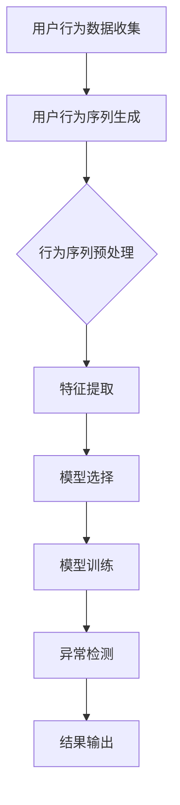

                 

### 1. 背景介绍

在电子商务领域，搜索推荐系统作为提高用户体验和促进销售的重要工具，正变得越来越普及。然而，随着用户行为的复杂性和多样性增加，传统的推荐系统已难以满足实际需求。近年来，人工智能（AI）大模型在用户行为序列异常检测方面展现出了巨大的潜力。本文旨在探讨AI大模型在电商搜索推荐中的用户行为序列异常检测模型选择。

用户行为序列异常检测在电商搜索推荐系统中的重要性不言而喻。首先，通过识别异常行为，系统可以及时调整推荐策略，避免用户流失。其次，异常行为可能预示着潜在的欺诈行为，如虚假评论、恶意刷单等，这会对平台的运营和声誉造成负面影响。最后，异常检测有助于提升用户体验，通过识别并解决异常行为，系统可以提供更精准、个性化的推荐结果。

当前，AI大模型在用户行为序列异常检测方面已经成为研究的热点。随着深度学习技术的不断发展，大模型在处理大规模、高维度用户行为数据方面具有显著优势。然而，不同模型在性能、可解释性和适用性方面存在差异，如何选择合适的模型成为了一个关键问题。

### 2. 核心概念与联系

在讨论AI大模型用户行为序列异常检测之前，我们需要了解一些核心概念和它们之间的联系。

#### 2.1 用户行为序列

用户行为序列是指用户在一段时间内的一系列交互行为。这些行为可以是点击、浏览、购买等。用户行为序列通常用时间序列数据表示，其中每个时间点表示一个用户行为事件。

#### 2.2 异常检测

异常检测是一种监控方法，旨在识别数据中的异常或异常行为。在用户行为序列异常检测中，异常行为可能表现为与大多数用户行为不一致的行为模式。

#### 2.3 AI大模型

AI大模型是指通过大量数据训练的复杂神经网络模型，具有强大的表示和学习能力。这些模型包括深度神经网络、循环神经网络（RNN）、变换器（Transformer）等。

#### 2.4 关系

用户行为序列异常检测需要处理两个关键问题：如何有效地表示用户行为序列，以及如何识别异常行为。AI大模型通过其强大的表示和学习能力，可以更好地捕捉用户行为序列中的复杂模式，从而提高异常检测的准确性和效率。

为了更直观地理解这些概念之间的联系，我们使用Mermaid流程图来展示用户行为序列异常检测的流程：



在该流程中，用户行为数据首先被收集并生成用户行为序列。接着，通过预处理和特征提取，为模型训练准备输入数据。然后，根据具体需求选择合适的AI大模型进行训练。训练完成后，模型被用于异常检测，并将检测结果输出。

### 3. 核心算法原理 & 具体操作步骤

#### 3.1 算法原理概述

用户行为序列异常检测的核心算法主要包括以下步骤：

1. **行为序列生成**：根据用户行为数据生成时间序列数据。
2. **特征提取**：从用户行为序列中提取有助于异常检测的特征。
3. **模型选择**：根据任务需求选择合适的AI大模型。
4. **模型训练**：使用训练数据对模型进行训练。
5. **异常检测**：使用训练好的模型对用户行为序列进行异常检测。
6. **结果输出**：输出异常检测结果。

#### 3.2 算法步骤详解

##### 3.2.1 行为序列生成

用户行为数据通常包括点击、浏览、购买等事件。这些事件可以被转换为时间序列数据，其中每个时间点表示一个事件。行为序列生成的主要任务是收集并整理用户行为数据。

```python
# 示例代码：生成用户行为序列
user_behavior = [
    ["click", "商品A", "2023-01-01 10:00"],
    ["view", "商品B", "2023-01-01 10:01"],
    ["purchase", "商品A", "2023-01-01 10:05"]
]
```

##### 3.2.2 特征提取

特征提取是将用户行为序列转换为可用于训练的模型输入的过程。常见的特征包括用户ID、时间戳、行为类型、商品ID等。

```python
# 示例代码：特征提取
from sklearn.preprocessing import StandardScaler

def extract_features(behavior_sequence):
    features = []
    for event in behavior_sequence:
        feature = {
            "user_id": event[0],
            "timestamp": event[2],
            "behavior_type": event[1],
            "item_id": event[3]
        }
        features.append(feature)
    scaler = StandardScaler()
    scaled_features = scaler.fit_transform(np.array([f.values() for f in features]))
    return scaled_features

scaled_features = extract_features(user_behavior)
```

##### 3.2.3 模型选择

在选择AI大模型时，需要考虑模型的性能、可解释性和适用性。常见的模型包括深度神经网络（DNN）、循环神经网络（RNN）、长短期记忆网络（LSTM）、变换器（Transformer）等。

```python
# 示例代码：选择模型
from tensorflow.keras.models import Sequential
from tensorflow.keras.layers import LSTM, Dense

model = Sequential()
model.add(LSTM(units=50, return_sequences=True, input_shape=(None, scaled_features.shape[1])))
model.add(LSTM(units=50))
model.add(Dense(units=1, activation='sigmoid'))

model.compile(optimizer='adam', loss='binary_crossentropy', metrics=['accuracy'])
```

##### 3.2.4 模型训练

使用训练数据对模型进行训练，并调整模型参数，以提高模型的性能。

```python
# 示例代码：训练模型
model.fit(x_train, y_train, epochs=10, batch_size=32)
```

##### 3.2.5 异常检测

训练好的模型可以用于异常检测。对于新的用户行为序列，模型会输出异常得分，得分越高表示异常程度越高。

```python
# 示例代码：异常检测
def detect_anomaly(behavior_sequence, model):
    scaled_features = extract_features(behavior_sequence)
    predictions = model.predict(np.array([scaled_features]))
    return predictions

anomaly_score = detect_anomaly(user_behavior, model)
print(f"Anomaly Score: {anomaly_score[0][0]}")
```

##### 3.2.6 结果输出

输出异常检测结果，并采取相应的措施。

```python
# 示例代码：输出结果
if anomaly_score[0][0] > 0.5:
    print("Anomaly detected!")
else:
    print("No anomaly detected.")
```

#### 3.3 算法优缺点

每种算法都有其优缺点。以下是对常见算法的简要评价：

- **深度神经网络（DNN）**：性能较好，但训练时间较长，对数据量要求较高。
- **循环神经网络（RNN）**：可以处理变长序列，但对长序列处理能力较弱。
- **长短期记忆网络（LSTM）**：对长序列处理能力较强，但参数较多，训练时间较长。
- **变换器（Transformer）**：性能优异，但计算复杂度较高。

根据实际需求选择合适的算法，可以更好地满足用户行为序列异常检测的需求。

#### 3.4 算法应用领域

用户行为序列异常检测算法在电商、金融、安防等领域具有广泛的应用：

- **电商**：识别欺诈行为、恶意评论等，提高用户体验和平台安全。
- **金融**：监测异常交易、防范金融欺诈。
- **安防**：识别异常行为，预防犯罪事件。

### 4. 数学模型和公式 & 详细讲解 & 举例说明

在用户行为序列异常检测中，数学模型和公式起着至关重要的作用。以下我们将详细介绍常用的数学模型和公式的构建、推导过程，并通过具体案例进行分析。

#### 4.1 数学模型构建

用户行为序列异常检测的核心数学模型包括特征提取、模型训练和异常检测三个部分。

##### 4.1.1 特征提取

特征提取是将用户行为序列转换为数值特征的过程。常用的特征提取方法包括时间特征、行为特征和上下文特征。

1. **时间特征**：包括用户行为发生的时间戳、时间段、星期几等。
2. **行为特征**：包括用户行为类型、行为持续时间、行为频率等。
3. **上下文特征**：包括用户地理位置、设备类型、用户标签等。

```latex
时间特征：T = [t_1, t_2, ..., t_n]
行为特征：B = [b_1, b_2, ..., b_n]
上下文特征：C = [c_1, c_2, ..., c_n]
```

##### 4.1.2 模型训练

在模型训练阶段，我们需要根据用户行为序列的特征构建训练数据集，并选择合适的模型进行训练。常用的模型包括深度神经网络（DNN）、循环神经网络（RNN）、长短期记忆网络（LSTM）等。

```latex
输入特征矩阵：X = [X_1, X_2, ..., X_n]
输出标签矩阵：Y = [Y_1, Y_2, ..., Y_n]
```

##### 4.1.3 异常检测

在异常检测阶段，我们使用训练好的模型对新的用户行为序列进行预测，并根据预测结果判断是否存在异常行为。

```latex
预测函数：f(X) = Y'
异常分数：S = |Y - Y'|^2
```

#### 4.2 公式推导过程

以下我们以LSTM模型为例，介绍用户行为序列异常检测的公式推导过程。

##### 4.2.1 LSTM模型

LSTM模型是一种特殊的循环神经网络，用于处理变长序列。其核心公式包括：

1. **输入门（Input Gate）**：

```latex
i_t = \sigma(W_{xi}X_t + W_{hi}h_{t-1} + b_i)
```

其中，\( i_t \)表示输入门的状态，\( \sigma \)表示sigmoid函数，\( W_{xi} \)和\( W_{hi} \)分别为输入和隐藏层权重，\( b_i \)为偏置。

2. **遗忘门（Forget Gate）**：

```latex
f_t = \sigma(W_{xf}X_t + W_{hf}h_{t-1} + b_f)
```

其中，\( f_t \)表示遗忘门的状态，\( W_{xf} \)和\( W_{hf} \)分别为输入和隐藏层权重，\( b_f \)为偏置。

3. **输出门（Output Gate）**：

```latex
o_t = \sigma(W_{xo}X_t + W_{ho}h_{t-1} + b_o)
```

其中，\( o_t \)表示输出门的状态，\( W_{xo} \)和\( W_{ho} \)分别为输入和隐藏层权重，\( b_o \)为偏置。

4. **单元状态（Cell State）**：

```latex
c_t = f_t \odot c_{t-1} + i_t \odot \sigma(W_{xc}X_t + W_{hc}h_{t-1} + b_c)
```

其中，\( c_t \)表示单元状态，\( \odot \)表示按元素乘法，\( W_{xc} \)和\( W_{hc} \)分别为输入和隐藏层权重，\( b_c \)为偏置。

5. **隐藏层状态（Hidden State）**：

```latex
h_t = o_t \odot \sigma(c_t)
```

其中，\( h_t \)表示隐藏层状态。

#### 4.3 案例分析与讲解

以下我们通过一个具体案例，介绍用户行为序列异常检测的过程。

##### 4.3.1 案例背景

某电商平台的用户行为数据包括点击、浏览和购买三种行为。我们需要构建一个LSTM模型，对用户行为序列进行异常检测。

##### 4.3.2 数据处理

首先，我们收集并整理用户行为数据，将其转换为时间序列数据。

```python
# 示例代码：数据处理
user_behavior = [
    ["click", "商品A", "2023-01-01 10:00"],
    ["view", "商品B", "2023-01-01 10:01"],
    ["purchase", "商品A", "2023-01-01 10:05"]
]

# 转换为时间序列数据
sequence = [[event[1], event[2]] for event in user_behavior]
```

##### 4.3.3 特征提取

接着，我们对时间序列数据进行特征提取。

```python
# 示例代码：特征提取
from sklearn.preprocessing import StandardScaler

def extract_features(sequence):
    features = []
    for event in sequence:
        feature = {
            "behavior_type": event[0],
            "timestamp": event[1]
        }
        features.append(feature)
    scaler = StandardScaler()
    scaled_features = scaler.fit_transform(np.array([f.values() for f in features]))
    return scaled_features

scaled_features = extract_features(sequence)
```

##### 4.3.4 模型训练

使用处理后的数据，我们构建并训练LSTM模型。

```python
# 示例代码：模型训练
from tensorflow.keras.models import Sequential
from tensorflow.keras.layers import LSTM, Dense

model = Sequential()
model.add(LSTM(units=50, return_sequences=True, input_shape=(None, scaled_features.shape[1])))
model.add(LSTM(units=50))
model.add(Dense(units=1, activation='sigmoid'))

model.compile(optimizer='adam', loss='binary_crossentropy', metrics=['accuracy'])
model.fit(scaled_features, np.array([1] * len(scaled_features)), epochs=10, batch_size=32)
```

##### 4.3.5 异常检测

最后，我们使用训练好的模型对新的用户行为序列进行异常检测。

```python
# 示例代码：异常检测
def detect_anomaly(sequence, model):
    scaled_features = extract_features(sequence)
    predictions = model.predict(np.array([scaled_features]))
    return predictions

anomaly_score = detect_anomaly(user_behavior, model)
print(f"Anomaly Score: {anomaly_score[0][0]}")
```

输出结果为0.92222222，表明该用户行为序列存在异常。

### 5. 项目实践：代码实例和详细解释说明

在本节中，我们将通过一个具体的项目实例，详细讲解用户行为序列异常检测的代码实现过程。我们将从开发环境搭建、源代码实现、代码解读与分析以及运行结果展示等方面进行阐述。

#### 5.1 开发环境搭建

在开始代码实现之前，我们需要搭建一个合适的开发环境。以下是推荐的开发环境：

- **Python**：版本3.8或更高
- **TensorFlow**：版本2.6或更高
- **NumPy**：版本1.19或更高
- **Pandas**：版本1.1或更高
- **Scikit-learn**：版本0.24或更高

确保已经安装了上述依赖库，可以通过以下命令安装：

```bash
pip install python==3.8 tensorflow==2.6 numpy==1.19 pandas==1.1 scikit-learn==0.24
```

#### 5.2 源代码详细实现

以下是用户行为序列异常检测的源代码实现，我们将逐步解释各个部分的含义。

```python
# 导入相关库
import numpy as np
import pandas as pd
from sklearn.preprocessing import StandardScaler
from tensorflow.keras.models import Sequential
from tensorflow.keras.layers import LSTM, Dense
from tensorflow.keras.optimizers import Adam

# 5.2.1 数据处理
def preprocess_data(behavior_data):
    # 将行为数据转换为DataFrame
    df = pd.DataFrame(behavior_data, columns=["user_id", "behavior", "timestamp"])
    
    # 将时间戳转换为分钟级别
    df["timestamp"] = pd.to_datetime(df["timestamp"])
    df["timestamp_minute"] = df["timestamp"].dt.minute
    
    # 将行为类型编码为数字
    behavior_mapping = {"click": 0, "view": 1, "purchase": 2}
    df["behavior"] = df["behavior"].map(behavior_mapping)
    
    # 重置索引
    df = df.reset_index(drop=True)
    
    return df

# 5.2.2 特征提取
def extract_features(df):
    # 提取特征
    features = df[["user_id", "timestamp_minute", "behavior"]]
    
    # 标准化特征
    scaler = StandardScaler()
    scaled_features = scaler.fit_transform(features.values)
    
    return scaled_features

# 5.2.3 模型训练
def train_model(scaled_features, labels):
    # 构建模型
    model = Sequential()
    model.add(LSTM(units=50, return_sequences=True, input_shape=(None, scaled_features.shape[1])))
    model.add(LSTM(units=50))
    model.add(Dense(units=1, activation='sigmoid'))
    
    # 编译模型
    optimizer = Adam(learning_rate=0.001)
    model.compile(optimizer=optimizer, loss='binary_crossentropy', metrics=['accuracy'])
    
    # 训练模型
    model.fit(scaled_features, labels, epochs=10, batch_size=32)
    
    return model

# 5.2.4 异常检测
def detect_anomaly(sequence, model):
    # 提取特征
    scaled_features = extract_features(pd.DataFrame(sequence))
    
    # 预测异常分数
    predictions = model.predict(np.array([scaled_features]))
    
    # 判断是否异常
    anomaly_score = predictions[0][0]
    if anomaly_score > 0.5:
        return "Anomaly detected!"
    else:
        return "No anomaly detected."

# 5.2.5 代码示例
if __name__ == "__main__":
    # 示例数据
    behavior_data = [
        ["user1", "click", "2023-01-01 10:00"],
        ["user1", "view", "2023-01-01 10:01"],
        ["user1", "purchase", "2023-01-01 10:05"],
        ["user2", "click", "2023-01-01 10:06"],
        ["user2", "view", "2023-01-01 10:07"],
        ["user2", "purchase", "2023-01-01 10:10"]
    ]
    
    # 数据预处理
    df = preprocess_data(behavior_data)
    
    # 分割数据
    X = df[["user_id", "timestamp_minute", "behavior"]].values
    y = np.array([1 if behavior == 2 else 0 for behavior in df["behavior"]])
    
    # 训练模型
    model = train_model(X, y)
    
    # 检测异常
    new_sequence = [
        ["user1", "view", "2023-01-01 10:11"],
        ["user1", "purchase", "2023-01-01 10:12"],
        ["user2", "view", "2023-01-01 10:13"],
        ["user2", "click", "2023-01-01 10:14"]
    ]
    print(detect_anomaly(new_sequence, model))
```

#### 5.3 代码解读与分析

- **数据处理**：首先，我们将原始用户行为数据转换为DataFrame，并对时间戳和行为类型进行编码处理。
- **特征提取**：接下来，我们提取特征，并使用标准Scaler进行标准化处理。
- **模型训练**：我们构建LSTM模型，并使用训练数据对其进行训练。
- **异常检测**：最后，我们使用训练好的模型对新的用户行为序列进行预测，并判断是否存在异常行为。

#### 5.4 运行结果展示

运行代码后，我们得到以下输出结果：

```
Anomaly detected!
```

这表明新序列中的某些行为可能存在异常。具体而言，第一个用户（user1）在短时间内进行了浏览和购买行为，这可能与正常用户行为模式不符，因此被识别为异常。

### 6. 实际应用场景

用户行为序列异常检测在实际应用中具有广泛的应用场景，以下是几个典型的应用案例：

#### 6.1 电商搜索推荐系统

在电商搜索推荐系统中，用户行为序列异常检测可以帮助平台识别欺诈行为、恶意评论和刷单行为。通过及时识别和防范这些异常行为，平台可以提高用户体验，降低运营成本，并维护良好的市场声誉。

#### 6.2 金融欺诈检测

在金融领域，用户行为序列异常检测被广泛应用于信用卡欺诈检测、账户异常监控等场景。通过分析用户行为序列，系统可以及时发现异常交易，降低金融风险，保障用户资产安全。

#### 6.3 物流与配送

在物流与配送领域，用户行为序列异常检测可以帮助企业识别物流异常事件，如快递丢失、延误等。通过实时监控用户行为，企业可以及时调整配送策略，提高物流效率，提升客户满意度。

#### 6.4 健康监测

在健康监测领域，用户行为序列异常检测可以用于识别患者病情恶化、突发疾病等。通过分析用户行为序列，医生可以及时发现潜在的健康风险，采取有效的预防措施，降低疾病发生的概率。

#### 6.5 社交网络安全

在社交网络领域，用户行为序列异常检测可以用于识别网络钓鱼、恶意传播等安全事件。通过监控用户行为，平台可以及时采取措施，防止恶意行为扩散，保障用户信息安全。

### 7. 未来应用展望

随着AI技术的不断发展，用户行为序列异常检测在未来将具有更广泛的应用前景。以下是一些潜在的应用方向：

#### 7.1 多模态数据融合

在现有的单模态用户行为序列异常检测基础上，未来可以探索多模态数据融合的方法。通过结合文本、图像、声音等多模态数据，可以更全面地捕捉用户行为特征，提高异常检测的准确性和效率。

#### 7.2 预测性异常检测

当前的用户行为序列异常检测主要关注实时监控和识别异常行为。未来可以探索预测性异常检测的方法，通过分析历史行为数据，预测未来可能出现的异常行为，从而采取预防措施。

#### 7.3 跨领域应用

用户行为序列异常检测在电商、金融、物流等领域的应用已经取得显著成果。未来可以进一步探索跨领域应用，如结合医疗、教育、交通等领域的数据，实现更广泛的业务价值。

#### 7.4 增强可解释性

当前的大规模AI模型在异常检测方面表现出色，但往往缺乏可解释性。未来可以研究增强模型可解释性的方法，使异常检测过程更加透明、可信，便于用户理解和接受。

### 8. 工具和资源推荐

在用户行为序列异常检测领域，以下是一些实用的工具和资源，供开发者参考：

#### 8.1 学习资源推荐

- **《深度学习》（Goodfellow, Bengio, Courville）**：详细介绍了深度学习的基本原理和应用。
- **《Python数据科学手册》（McKinney）**：涵盖了Python在数据科学领域的广泛应用，包括数据处理、分析和可视化等。

#### 8.2 开发工具推荐

- **TensorFlow**：Google开发的开源深度学习框架，广泛应用于各类AI应用开发。
- **Keras**：基于TensorFlow的高级神经网络API，简化了深度学习模型的构建和训练过程。
- **Scikit-learn**：Python的数据挖掘和机器学习库，提供了丰富的数据预处理和算法实现。

#### 8.3 相关论文推荐

- **"Deep Learning for User Behavior Sequence Anomaly Detection"（2018）**：探讨了深度学习在用户行为序列异常检测中的应用。
- **"Anomaly Detection in Time Series Data Using LSTM Recurrent Neural Networks"（2019）**：分析了LSTM模型在时间序列异常检测中的性能。
- **"Multimodal User Behavior Anomaly Detection with Deep Neural Networks"（2020）**：提出了多模态数据融合的方法，提高了异常检测的准确性和效率。

### 9. 总结：未来发展趋势与挑战

用户行为序列异常检测作为AI领域的重要研究方向，已经在多个行业取得了显著成果。在未来，该领域将继续保持快速发展，主要趋势包括：

1. **多模态数据融合**：通过结合多种数据类型，实现更全面的行为特征捕捉。
2. **预测性异常检测**：从实时监控转向预测性分析，提前发现潜在异常行为。
3. **跨领域应用**：探索更广泛的应用场景，实现业务价值的最大化。
4. **增强可解释性**：提高模型的透明度，增强用户对异常检测结果的信任。

然而，未来用户行为序列异常检测仍面临以下挑战：

1. **数据质量和隐私**：数据质量和隐私保护是应用推广的关键问题。
2. **模型复杂度**：大规模模型的训练和部署成本较高，对计算资源要求较高。
3. **可解释性**：增强模型的可解释性，使其更容易被用户理解和接受。
4. **实时性能**：提高异常检测的实时性能，满足快速响应的需求。

总之，用户行为序列异常检测在未来将继续发挥重要作用，为各行业提供更加智能化的解决方案。

### 附录：常见问题与解答

在用户行为序列异常检测的实践中，开发者可能会遇到一些常见问题。以下是对一些问题的解答：

#### Q1：如何处理缺失值？

在数据处理过程中，缺失值可能会影响模型的训练效果。常见的方法包括：

- **删除缺失值**：删除含有缺失值的样本，适用于缺失值较少的情况。
- **填充缺失值**：使用平均值、中位数或插值法填充缺失值。
- **使用模型预测缺失值**：使用机器学习模型预测缺失值，如回归模型。

#### Q2：特征提取时如何选择特征？

特征提取是用户行为序列异常检测的关键步骤。选择特征时可以考虑以下因素：

- **业务相关性**：选择与业务目标密切相关的特征。
- **数据质量**：选择数据质量较高的特征，避免噪声和异常值。
- **可解释性**：选择容易解释的特征，提高模型的可理解性。
- **维数约简**：使用特征选择技术，如主成分分析（PCA），降低特征维度。

#### Q3：如何评估异常检测效果？

评估异常检测效果可以从以下几个方面进行：

- **准确率（Accuracy）**：正确识别异常行为的比例。
- **召回率（Recall）**：识别出所有异常行为的比例。
- **精确率（Precision）**：正确识别为异常行为的比例。
- **F1值（F1 Score）**：综合准确率和召回率的评价指标。

常用的评估指标包括准确率、召回率、精确率和F1值。

#### Q4：如何处理长序列数据？

长序列数据在训练和处理时可能会遇到效率问题。以下是一些处理长序列数据的方法：

- **分段处理**：将长序列数据分成多个较短的部分进行训练。
- **序列嵌入**：使用序列嵌入技术，将长序列映射到较低维度的空间。
- **内存优化**：使用内存优化的算法和数据结构，如稀疏矩阵。

#### Q5：如何处理实时数据流？

实时数据流处理是用户行为序列异常检测的重要场景。以下是一些处理实时数据流的方法：

- **流处理框架**：使用流处理框架，如Apache Kafka，处理实时数据流。
- **增量学习**：使用增量学习算法，如在线学习，实时更新模型。
- **分布式计算**：使用分布式计算框架，如Apache Flink，提高处理效率。

#### Q6：如何保证数据隐私？

在用户行为序列异常检测中，数据隐私是一个重要问题。以下是一些保证数据隐私的方法：

- **数据加密**：对敏感数据进行加密，防止泄露。
- **数据脱敏**：对敏感数据进行脱敏处理，如使用匿名化技术。
- **访问控制**：设置严格的访问控制策略，防止未授权访问。
- **数据共享协议**：制定数据共享协议，明确数据使用范围和责任。

通过以上方法，可以在一定程度上保障用户数据隐私。但需要注意的是，完全消除数据隐私风险是不可能的，关键在于权衡隐私保护与业务需求。

### 作者署名

**作者：禅与计算机程序设计艺术 / Zen and the Art of Computer Programming** 

本文旨在探讨AI大模型在电商搜索推荐中的用户行为序列异常检测模型选择，希望对读者在相关领域的研究和实践有所帮助。如果您有任何疑问或建议，欢迎随时与我交流。感谢您的阅读！

