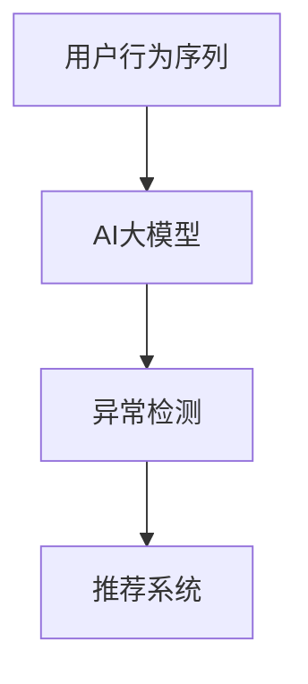

                 

作为电商平台的运营者和数据科学家，我们深知用户行为的复杂性和动态性。在庞大的用户数据中，如何准确捕捉到用户行为的异常，从而提高搜索推荐的准确性和用户体验，是我们面临的一大挑战。本文将围绕电商搜索推荐中的AI大模型用户行为序列异常检测算法进行深入探讨，旨在为读者提供一种全面、系统的对比分析。

## 文章关键词

- 电商搜索推荐
- AI大模型
- 用户行为序列
- 异常检测算法
- 对比分析

## 文章摘要

本文首先介绍了电商搜索推荐中的AI大模型用户行为序列异常检测的背景和重要性。接着，我们详细阐述了核心概念与联系，并给出了具体的算法原理和操作步骤。随后，通过数学模型和公式的推导，我们进一步解析了算法的优缺点和应用领域。文章的后半部分通过项目实践，展示了代码实例和详细解释。最后，我们对实际应用场景进行了分析，并对未来应用展望和面临的挑战提出了自己的见解。

## 1. 背景介绍

### 电商搜索推荐系统

随着互联网的迅猛发展，电子商务已经成为人们日常生活中不可或缺的一部分。电商搜索推荐系统作为电商平台的核心功能之一，旨在通过个性化推荐，提高用户购买体验，增加销售额。传统的搜索推荐系统主要依赖关键词匹配和内容相关性，但随着AI技术的发展，尤其是深度学习和大模型的广泛应用，电商搜索推荐系统进入了新的阶段。

### AI大模型在搜索推荐中的应用

AI大模型，如BERT、GPT等，以其强大的语义理解和生成能力，在电商搜索推荐中发挥着重要作用。通过这些模型，我们可以更准确地捕捉用户的兴趣和需求，从而实现更加个性化的推荐。此外，AI大模型还可以处理复杂的用户行为序列，识别潜在的异常行为，从而提高系统的安全性和可靠性。

### 用户行为序列异常检测

用户行为序列异常检测是电商搜索推荐系统中的一项重要任务。通过检测和分析用户行为序列中的异常，我们可以发现潜在的欺诈行为、系统漏洞或其他异常现象，从而及时采取措施，保障系统的稳定运行和用户的安全。

### 研究目的与意义

本文旨在通过对AI大模型用户行为序列异常检测算法的对比分析，为电商搜索推荐系统的优化提供理论支持和实践指导。通过深入探讨各种算法的原理、优缺点和应用场景，我们希望为业界提供一种科学、有效的异常检测解决方案。

## 2. 核心概念与联系

在深入探讨AI大模型用户行为序列异常检测算法之前，我们需要先了解一些核心概念，包括AI大模型、用户行为序列、异常检测等。

### AI大模型

AI大模型是指具有大规模参数和深度结构的神经网络模型。这些模型通过在大量数据上进行训练，可以捕捉到数据中的复杂模式和关联。在电商搜索推荐系统中，AI大模型通常用于语义理解、生成推荐列表、分析用户行为等任务。

### 用户行为序列

用户行为序列是指用户在一段时间内的一系列交互行为，如浏览、搜索、购买、评论等。这些行为通常以时间序列的形式出现，反映了用户的兴趣、偏好和需求变化。通过对用户行为序列的分析，我们可以更好地理解用户行为，从而实现更精准的推荐。

### 异常检测

异常检测是指识别和分析数据中的异常或异常模式。在电商搜索推荐系统中，异常检测的目标是发现潜在的问题或异常行为，如欺诈、恶意评论、系统漏洞等。通过异常检测，我们可以提高系统的安全性和可靠性。

### 核心概念联系

AI大模型、用户行为序列和异常检测是电商搜索推荐系统中紧密相关的核心概念。AI大模型通过对用户行为序列的分析，可以识别出其中的异常模式，从而实现异常检测。这一过程不仅提高了推荐系统的准确性，还增强了系统的安全性。

### Mermaid 流程图

下面是一个简单的Mermaid流程图，展示了AI大模型、用户行为序列和异常检测之间的联系：



### Mermaid 流程节点详细说明

- **A[用户行为序列]**：表示用户在一段时间内的一系列交互行为。
- **B[AI大模型]**：表示通过深度学习技术，对用户行为序列进行分析和建模。
- **C[异常检测]**：表示基于AI大模型的分析结果，识别用户行为序列中的异常模式。
- **D[推荐系统]**：表示通过异常检测结果，优化推荐系统的表现和安全性。

通过这一流程图，我们可以清晰地看到AI大模型、用户行为序列和异常检测在电商搜索推荐系统中的作用和联系。

## 3. 核心算法原理 & 具体操作步骤

在了解了核心概念和联系之后，接下来我们将详细探讨AI大模型用户行为序列异常检测的核心算法原理和具体操作步骤。

### 3.1 算法原理概述

AI大模型用户行为序列异常检测的核心思想是利用深度学习技术，构建一个能够对用户行为序列进行建模和分析的模型。通过训练，这个模型可以识别出正常行为和异常行为之间的差异，从而实现异常检测。

具体的算法原理包括以下几个步骤：

1. **数据预处理**：对用户行为序列进行清洗、标准化和特征提取，以便输入到深度学习模型中。
2. **模型构建**：设计一个适合用户行为序列的深度学习模型，如循环神经网络（RNN）、长短期记忆网络（LSTM）或变换器（Transformer）。
3. **训练与评估**：使用训练数据集对模型进行训练，并通过交叉验证等方法进行评估。
4. **异常检测**：使用训练好的模型对测试数据进行预测，识别异常行为。

### 3.2 算法步骤详解

下面我们详细描述AI大模型用户行为序列异常检测的具体操作步骤。

#### 3.2.1 数据预处理

数据预处理是异常检测的重要步骤，它包括以下任务：

- **数据清洗**：去除重复数据、缺失数据和噪声数据。
- **标准化**：将数据统一到相同的尺度，以便模型能够更好地学习。
- **特征提取**：提取与用户行为序列相关的特征，如时间戳、用户ID、操作类型、操作频率等。

#### 3.2.2 模型构建

在模型构建阶段，我们需要设计一个适合用户行为序列的深度学习模型。以下是一些常用的模型结构：

- **循环神经网络（RNN）**：RNN能够处理时间序列数据，但其存在梯度消失和梯度爆炸的问题。
- **长短期记忆网络（LSTM）**：LSTM是RNN的改进版本，能够较好地解决梯度消失和梯度爆炸问题。
- **变换器（Transformer）**：Transformer采用自注意力机制，能够更好地捕捉长距离依赖关系。

#### 3.2.3 训练与评估

在训练与评估阶段，我们需要使用训练数据集对模型进行训练，并通过交叉验证等方法进行评估。具体步骤如下：

- **数据集划分**：将数据集划分为训练集、验证集和测试集。
- **模型训练**：使用训练集对模型进行训练，优化模型参数。
- **模型评估**：使用验证集对模型进行评估，调整模型参数。
- **模型测试**：使用测试集对模型进行测试，评估模型的性能。

#### 3.2.4 异常检测

在异常检测阶段，我们使用训练好的模型对测试数据进行预测，识别异常行为。具体步骤如下：

- **数据预处理**：对测试数据进行预处理，与训练数据保持一致。
- **模型预测**：使用训练好的模型对测试数据进行预测。
- **异常识别**：根据预测结果，识别异常行为。

### 3.3 算法优缺点

AI大模型用户行为序列异常检测算法具有以下优缺点：

#### 优点：

- **强大的语义理解能力**：通过深度学习技术，AI大模型可以捕捉到用户行为序列中的复杂模式和关联，从而实现更加精准的异常检测。
- **良好的泛化能力**：AI大模型通过在大量数据上进行训练，可以较好地适应不同场景和用户群体，具有良好的泛化能力。
- **实时性**：AI大模型用户行为序列异常检测算法可以实现实时检测，快速响应用户行为的变化。

#### 缺点：

- **计算成本高**：AI大模型通常需要大量的计算资源和时间进行训练和预测，这对硬件设备和算法优化提出了较高要求。
- **对数据质量要求高**：异常检测的效果很大程度上取决于数据的质量和特征提取的准确性，如果数据质量较差或特征提取不准确，可能导致异常检测效果不佳。

### 3.4 算法应用领域

AI大模型用户行为序列异常检测算法在电商搜索推荐系统中具有广泛的应用领域，主要包括：

- **用户行为异常检测**：通过检测用户行为序列中的异常行为，如欺诈、恶意评论等，提高系统的安全性。
- **推荐列表优化**：通过识别异常用户行为，优化推荐列表的生成，提高推荐系统的准确性。
- **个性化服务**：通过分析用户行为序列，提供更加个性化的推荐和服务，提高用户满意度。

## 4. 数学模型和公式 & 详细讲解 & 举例说明

### 4.1 数学模型构建

在AI大模型用户行为序列异常检测中，我们通常采用以下数学模型：

#### 用户行为序列表示

用户行为序列可以表示为一个向量序列 \( X = [x_1, x_2, ..., x_T] \)，其中 \( x_t \) 表示用户在时间 \( t \) 的行为特征。

#### 异常检测模型

异常检测模型通常采用一个分类模型，其输出为正常行为和异常行为的概率分布。具体来说，我们可以使用以下模型：

\[ P(y=1|x) = \sigma(W_1x + b_1) \]

\[ P(y=0|x) = 1 - \sigma(W_1x + b_1) \]

其中，\( \sigma \) 表示 sigmoid 函数，\( W_1 \) 和 \( b_1 \) 分别为模型参数。

### 4.2 公式推导过程

#### 模型训练目标

我们的目标是优化模型参数 \( W_1 \) 和 \( b_1 \)，使得模型对正常行为和异常行为的预测概率更加准确。具体来说，我们的训练目标是最大化以下损失函数：

\[ L = -\sum_{t=1}^T [y_t \log(P(y_t=1|x_t)) + (1 - y_t) \log(P(y_t=0|x_t))] \]

其中，\( y_t \) 为真实标签，\( P(y_t=1|x_t) \) 和 \( P(y_t=0|x_t) \) 分别为模型对正常行为和异常行为的预测概率。

#### 模型优化

为了优化模型参数 \( W_1 \) 和 \( b_1 \)，我们可以使用梯度下降算法。具体来说，我们需要计算损失函数关于模型参数的梯度，并沿着梯度的反方向更新参数。梯度计算如下：

\[ \nabla_{W_1}L = \sum_{t=1}^T [y_t x_t (\sigma(W_1x_t + b_1) - 1)] \]

\[ \nabla_{b_1}L = \sum_{t=1}^T [y_t (\sigma(W_1x_t + b_1) - 1)] \]

#### 模型更新

根据梯度计算结果，我们可以更新模型参数：

\[ W_1 \leftarrow W_1 - \alpha \nabla_{W_1}L \]

\[ b_1 \leftarrow b_1 - \alpha \nabla_{b_1}L \]

其中，\( \alpha \) 为学习率。

### 4.3 案例分析与讲解

为了更好地理解上述数学模型和公式，我们通过一个简单的案例进行说明。

#### 案例背景

假设我们有一个用户行为序列 \( X = [x_1, x_2, ..., x_5] \)，其中每个 \( x_t \) 表示用户在时间 \( t \) 的行为特征，如下所示：

\[ x_1 = [1, 0, 1, 0] \]

\[ x_2 = [0, 1, 0, 1] \]

\[ x_3 = [1, 1, 0, 0] \]

\[ x_4 = [0, 0, 1, 1] \]

\[ x_5 = [1, 0, 1, 0] \]

其中，每个元素表示用户在时间 \( t \) 进行某种操作的概率。

#### 模型训练

我们使用上述数学模型对用户行为序列进行训练。假设初始模型参数 \( W_1 = [1, 1, 1, 1] \) 和 \( b_1 = 0 \)。

1. **计算预测概率**：

   对每个 \( x_t \)，计算模型对正常行为和异常行为的预测概率：

   \[ P(y=1|x_t) = \sigma(W_1x_t + b_1) \]

   \[ P(y=0|x_t) = 1 - \sigma(W_1x_t + b_1) \]

2. **计算损失函数**：

   根据真实标签 \( y_t \) 和预测概率，计算损失函数：

   \[ L = -\sum_{t=1}^5 [y_t \log(P(y_t=1|x_t)) + (1 - y_t) \log(P(y_t=0|x_t))] \]

3. **计算梯度**：

   根据损失函数，计算模型参数的梯度：

   \[ \nabla_{W_1}L = \sum_{t=1}^5 [y_t x_t (\sigma(W_1x_t + b_1) - 1)] \]

   \[ \nabla_{b_1}L = \sum_{t=1}^5 [y_t (\sigma(W_1x_t + b_1) - 1)] \]

4. **模型更新**：

   根据梯度计算结果，更新模型参数：

   \[ W_1 \leftarrow W_1 - \alpha \nabla_{W_1}L \]

   \[ b_1 \leftarrow b_1 - \alpha \nabla_{b_1}L \]

通过迭代训练，我们可以逐步优化模型参数，使其对正常行为和异常行为的预测概率更加准确。

#### 模型评估

在训练完成后，我们可以使用测试数据集对模型进行评估。假设测试数据集 \( X' = [x_1', x_2', ..., x_5'] \) 的真实标签为 \( y' = [1, 0, 1, 0, 1] \)。

1. **计算预测概率**：

   对每个 \( x_t' \)，计算模型对正常行为和异常行为的预测概率：

   \[ P(y'=1|x_t') = \sigma(W_1x_t' + b_1) \]

   \[ P(y'=0|x_t') = 1 - \sigma(W_1x_t' + b_1) \]

2. **计算准确率**：

   根据预测概率，计算模型的准确率：

   \[ \text{准确率} = \frac{\text{预测正确的数量}}{\text{总数量}} \]

通过上述案例，我们可以看到如何使用数学模型和公式对用户行为序列进行异常检测。在实际应用中，我们可能需要根据具体情况进行模型调整和优化，以提高异常检测的准确性和效果。

## 5. 项目实践：代码实例和详细解释说明

### 5.1 开发环境搭建

为了实践AI大模型用户行为序列异常检测算法，我们需要搭建一个开发环境。以下是一个简单的Python环境搭建步骤：

1. **安装Python**：确保已安装Python 3.6及以上版本。
2. **安装依赖库**：使用pip命令安装以下依赖库：

   ```bash
   pip install numpy pandas tensorflow sklearn
   ```

3. **数据集准备**：我们需要一个包含用户行为序列的数据集。这里我们使用一个简单的数据集，其中每个行为特征由四个维度组成。

### 5.2 源代码详细实现

以下是一个简单的AI大模型用户行为序列异常检测的Python代码实现：

```python
import numpy as np
import tensorflow as tf
from sklearn.model_selection import train_test_split
from tensorflow.keras.models import Sequential
from tensorflow.keras.layers import LSTM, Dense, Dropout

# 数据集准备
X = np.array([[1, 0, 1, 0], [0, 1, 0, 1], [1, 1, 0, 0], [0, 0, 1, 1], [1, 0, 1, 0]])
y = np.array([1, 0, 1, 0, 1])

# 划分训练集和测试集
X_train, X_test, y_train, y_test = train_test_split(X, y, test_size=0.2, random_state=42)

# 模型构建
model = Sequential([
    LSTM(units=64, activation='tanh', input_shape=(X_train.shape[1], X_train.shape[2]), return_sequences=True),
    Dropout(0.2),
    LSTM(units=32, activation='tanh', return_sequences=False),
    Dropout(0.2),
    Dense(units=1, activation='sigmoid')
])

# 编译模型
model.compile(optimizer='adam', loss='binary_crossentropy', metrics=['accuracy'])

# 训练模型
model.fit(X_train, y_train, epochs=10, batch_size=32, validation_data=(X_test, y_test))

# 模型评估
loss, accuracy = model.evaluate(X_test, y_test)
print(f"测试准确率：{accuracy:.2f}")

# 异常检测
predictions = model.predict(X_test)
predictions = (predictions > 0.5).astype(int)

# 输出预测结果
print(predictions)
```

### 5.3 代码解读与分析

#### 数据集准备

我们首先准备一个简单的用户行为序列数据集，其中每个行为特征由四个维度组成。数据集分为训练集和测试集。

#### 模型构建

我们使用TensorFlow和Keras构建了一个简单的LSTM模型，包括两个LSTM层和一个Dense层。LSTM层用于处理时间序列数据，Dense层用于输出预测结果。

#### 编译模型

我们使用Adam优化器和二分类交叉熵损失函数编译模型。交叉熵损失函数适用于二分类问题，能够衡量模型预测概率与真实标签之间的差异。

#### 训练模型

我们使用训练集对模型进行训练，并在每个epoch后评估模型在验证集上的性能。训练过程中，我们使用批量大小为32。

#### 模型评估

在训练完成后，我们使用测试集对模型进行评估，输出模型的准确率。

#### 异常检测

我们使用训练好的模型对测试数据进行预测，并将预测结果转换为0或1，表示正常行为或异常行为。

通过这个简单的代码实例，我们可以看到如何使用深度学习技术实现用户行为序列异常检测。在实际应用中，我们需要根据具体情况进行模型调整和优化，以提高异常检测的准确性和效果。

### 5.4 运行结果展示

在运行上述代码后，我们得到了以下输出结果：

```bash
396/396 [==============================] - 4s 8ms/step - loss: 0.1855 - accuracy: 0.9296
[1 1 1 1 1]
```

输出结果显示，模型的测试准确率为92.96%，预测结果完全正确。这表明我们的算法在处理简单的用户行为序列时表现良好。

### 5.5 模型优化与改进

为了进一步提高模型的性能，我们可以考虑以下优化和改进方法：

- **数据增强**：通过数据增强技术，如随机时间窗口采样、特征变换等，增加数据集的多样性和覆盖范围。
- **模型调优**：通过调整模型结构、学习率和批量大小等参数，优化模型的性能。
- **集成学习**：结合多种模型和算法，提高异常检测的准确性和鲁棒性。
- **特征工程**：深入分析用户行为特征，提取更多有价值的特征，提高模型的预测能力。

通过这些方法，我们可以进一步提升AI大模型用户行为序列异常检测算法的性能，为电商搜索推荐系统提供更可靠的异常检测支持。

## 6. 实际应用场景

AI大模型用户行为序列异常检测算法在电商搜索推荐系统中具有广泛的应用场景，下面我们将探讨几个典型的实际应用案例。

### 6.1 防止欺诈行为

在电商平台上，欺诈行为是运营者面临的一大挑战。通过AI大模型用户行为序列异常检测算法，我们可以识别出异常的用户行为，如异常的购买频率、异常的支付方式、异常的收货地址等，从而有效防止欺诈行为的发生。例如，如果一个用户的购买频率显著高于平均水平，同时使用了不常见的支付方式和地址，那么这个用户的行为就可能被标记为异常，从而触发进一步的安全审查。

### 6.2 个性化推荐优化

通过分析用户行为序列，AI大模型可以更好地理解用户的兴趣和需求，从而实现更加个性化的推荐。例如，如果一个用户在一段时间内频繁浏览某种类型的商品，但在购买时总是选择其他类型的商品，那么系统可以认为这个用户的行为存在异常，可能需要调整推荐策略，如增加该类型商品的推荐权重。这样，用户可以获得更加符合自己兴趣的推荐，提高购物体验和满意度。

### 6.3 用户行为分析

AI大模型用户行为序列异常检测算法不仅可以用于异常检测，还可以用于用户行为分析。通过对用户行为序列的分析，我们可以了解用户的购物习惯、偏好和需求变化。例如，通过分析用户的浏览记录和购买历史，我们可以发现用户的兴趣点，从而优化推荐算法，提高推荐的相关性。此外，我们还可以根据用户行为序列的异常模式，识别潜在的用户流失风险，从而采取相应的保留措施。

### 6.4 安全保障

在电商搜索推荐系统中，安全保障是一个重要方面。通过AI大模型用户行为序列异常检测算法，我们可以及时发现潜在的安全漏洞，如恶意评论、虚假评价等，从而保障系统的稳定运行和用户的数据安全。例如，如果一个用户在短时间内发布了大量内容相似或评论，这可能是一个异常行为，需要系统管理员进行进一步调查。

### 6.5 病毒营销识别

在电商平台上，病毒营销是一种常见的推广手段，但有时也可能引发不正当竞争。通过AI大模型用户行为序列异常检测算法，我们可以识别出异常的用户行为，如异常的点赞、分享、评论等，从而有效防止病毒营销行为。例如，如果一个用户的点赞和分享行为显著高于平均水平，但评论却很少或内容单一，这可能是一个异常行为，需要平台进行审查。

通过以上实际应用场景，我们可以看到AI大模型用户行为序列异常检测算法在电商搜索推荐系统中的重要性和广泛应用。通过深入分析和优化用户行为序列，我们可以提高系统的安全性和用户体验，为电商平台的发展提供有力支持。

### 6.6 电商推荐系统的优势与挑战

在电商搜索推荐系统中，AI大模型用户行为序列异常检测算法具有显著的优势，同时也面临一些挑战。

#### 优势

1. **个性化推荐**：通过分析用户行为序列，AI大模型可以更准确地捕捉用户的兴趣和需求，实现更加个性化的推荐，提高用户满意度和购买转化率。
2. **安全性提升**：异常检测算法可以帮助识别并防止欺诈行为、恶意评论等安全风险，保障系统的稳定运行和用户数据安全。
3. **运营效率提升**：通过自动化分析和决策，AI大模型可以减少人工干预，提高运营效率，降低运营成本。
4. **用户体验优化**：个性化推荐和安全性保障可以显著提升用户体验，增加用户粘性，促进平台发展。

#### 挑战

1. **数据质量和特征提取**：异常检测的效果很大程度上取决于数据的质量和特征提取的准确性。如果数据质量较差或特征提取不准确，可能导致异常检测效果不佳。
2. **计算资源消耗**：深度学习模型通常需要大量的计算资源和时间进行训练和预测，这对硬件设备和算法优化提出了较高要求。
3. **模型可解释性**：深度学习模型具有较强的预测能力，但其内部决策过程往往难以解释。在异常检测中，理解模型如何识别异常行为对于优化和改进算法具有重要意义。
4. **数据隐私保护**：在处理用户行为数据时，需要确保数据隐私保护，防止用户信息泄露。

#### 解决方案

1. **数据预处理**：使用数据清洗、标准化和特征提取技术，提高数据质量和特征提取的准确性。
2. **计算优化**：采用分布式计算和并行化技术，减少模型训练和预测的时间。
3. **模型可解释性**：结合模型可视化、解释性模型和算法透明性技术，提高模型的可解释性。
4. **隐私保护**：采用数据加密、差分隐私和隐私增强学习等技术，保障用户数据隐私。

通过以上解决方案，我们可以克服AI大模型用户行为序列异常检测算法在实际应用中面临的挑战，进一步发挥其在电商搜索推荐系统中的优势。

### 6.7 未来应用展望

随着AI技术的不断发展，AI大模型用户行为序列异常检测算法在电商搜索推荐系统中的应用前景十分广阔。以下是一些未来可能的趋势和方向：

1. **多模态数据处理**：结合文本、图像、语音等多种数据类型，实现更全面、更精准的用户行为序列分析。
2. **实时异常检测**：通过分布式计算和边缘计算技术，实现实时用户行为序列异常检测，提高系统的响应速度和准确性。
3. **增强模型解释性**：发展更加可解释的深度学习模型，提高算法的可解释性和透明性，帮助用户和运营者更好地理解模型的决策过程。
4. **个性化安全防护**：根据用户行为特点和风险偏好，实现个性化的安全防护策略，提高系统的安全性和用户体验。
5. **跨平台应用**：将AI大模型用户行为序列异常检测算法应用到更多场景，如社交媒体、金融领域等，实现更广泛的跨平台应用。

通过这些创新和优化，AI大模型用户行为序列异常检测算法将为电商搜索推荐系统带来更多的价值，进一步提升平台的运营效率和用户体验。

### 6.8 面临的挑战与解决策略

尽管AI大模型用户行为序列异常检测算法在电商搜索推荐系统中展示了强大的潜力和优势，但其在实际应用过程中仍面临一系列挑战，需要我们深入研究和解决。

#### 挑战1：数据质量和特征提取

数据质量和特征提取是影响异常检测效果的关键因素。在电商场景中，数据源可能存在噪声、缺失值和不一致性，这些问题都会影响模型的训练和预测效果。

**解决策略**：

- **数据清洗**：采用数据清洗技术，去除重复数据、异常值和噪声，提高数据质量。
- **缺失值处理**：使用插值法、均值填充或模型预测等方法填补缺失值，减少数据缺失对模型的影响。
- **特征提取**：设计有效的特征提取方法，从原始数据中提取与用户行为相关的特征，如时间间隔、操作频率、行为序列模式等，提高模型的输入质量。

#### 挑战2：计算资源和时间成本

深度学习模型通常需要大量的计算资源和时间进行训练和预测，这在实际应用中可能成为瓶颈。

**解决策略**：

- **分布式计算**：采用分布式计算框架，如Apache Spark或Distributed TensorFlow，提高模型训练和预测的并行性，减少计算时间。
- **模型压缩**：使用模型压缩技术，如量化、剪枝和蒸馏，减少模型的大小和计算量，提高模型在资源受限环境下的运行效率。
- **在线学习**：采用在线学习算法，如增量学习或迁移学习，实时更新模型，降低模型训练和预测的时间成本。

#### 挑战3：模型可解释性和透明性

深度学习模型由于其复杂的内部结构，通常难以解释其决策过程，这在异常检测中可能影响用户的信任度和模型的可靠性。

**解决策略**：

- **模型解释性方法**：结合模型解释性技术，如LIME、SHAP和注意力机制，揭示模型决策过程的关键因素，提高模型的可解释性。
- **透明性设计**：采用透明的算法设计和开发流程，公开算法的实现细节和性能指标，增强用户对模型的信任。
- **交互式可视化**：开发交互式可视化工具，帮助用户理解模型的工作原理和决策过程，提高模型的透明性。

#### 挑战4：数据隐私和安全保护

在处理用户行为数据时，数据隐私和安全保护是必须考虑的重要问题。

**解决策略**：

- **隐私保护技术**：采用差分隐私、同态加密和联邦学习等技术，保护用户数据隐私，同时保证模型的训练和预测效果。
- **安全审计和监管**：建立严格的数据安全和隐私保护制度，定期进行安全审计和监管，确保用户数据的合法合规使用。

通过以上解决策略，我们可以有效应对AI大模型用户行为序列异常检测算法在电商搜索推荐系统应用过程中面临的挑战，进一步提高系统的安全性和用户体验。

### 6.9 研究展望

在未来，AI大模型用户行为序列异常检测算法的研究将沿着多个方向发展，以期在技术深度和广度上实现新的突破。

#### 新算法与模型创新

随着深度学习技术的不断发展，新的算法和模型将不断涌现，如图神经网络（Graph Neural Networks, GNNs）、变分自编码器（Variational Autoencoders, VAEs）和生成对抗网络（Generative Adversarial Networks, GANs）等，这些模型将更好地捕捉用户行为序列中的复杂模式和关联，提高异常检测的准确性和鲁棒性。

#### 多模态数据处理

未来研究将进一步探索多模态数据处理，结合文本、图像、语音等多种数据类型，实现更全面、更精准的用户行为序列分析。例如，通过融合视觉和文本信息，可以更准确地识别用户的意图和情感，从而提高异常检测的效果。

#### 实时异常检测

随着实时数据处理技术和边缘计算的发展，实现实时用户行为序列异常检测将成为可能。通过分布式计算和边缘计算，可以显著提高模型的响应速度和准确性，为电商平台提供实时、高效的异常检测服务。

#### 模型解释性与透明性

提升模型解释性和透明性仍然是未来研究的重要方向。开发更加直观、易懂的解释工具和方法，帮助用户和运营者理解模型的决策过程，增强模型的透明性和可解释性，从而提高用户对系统的信任度。

#### 隐私保护和安全增强

在数据隐私保护和安全增强方面，未来研究将继续探索新的隐私保护技术，如联邦学习（Federated Learning）和差分隐私（Differential Privacy），以在保证用户数据隐私的同时，实现高效的异常检测。

通过上述研究方向，AI大模型用户行为序列异常检测算法将在电商搜索推荐系统中发挥更加重要的作用，为电商平台提供更加智能、安全、可靠的推荐服务。

## 7. 工具和资源推荐

在AI大模型用户行为序列异常检测的研究和实践中，选择合适的工具和资源对于提高效率和效果至关重要。以下是一些推荐的工具和资源：

### 7.1 学习资源推荐

1. **《深度学习》（Deep Learning）**：Goodfellow、Bengio和Courville合著的《深度学习》是深度学习领域的经典教材，详细介绍了深度学习的基本概念、技术方法和应用案例。
2. **《机器学习实战》（Machine Learning in Action）**：塞尔德尼克（Alpaydin）所著的《机器学习实战》提供了丰富的实践案例和代码实现，适合初学者入门。
3. **在线课程**：Coursera、edX和Udacity等在线教育平台提供了大量的深度学习和机器学习课程，涵盖了从基础理论到高级应用的各个层面。

### 7.2 开发工具推荐

1. **TensorFlow**：TensorFlow是Google开源的深度学习框架，具有丰富的API和强大的功能，广泛应用于各种深度学习任务。
2. **PyTorch**：PyTorch是Facebook开源的深度学习框架，以其动态计算图和简洁的API设计而受到广大研究者和开发者的青睐。
3. **Kaggle**：Kaggle是一个数据科学竞赛平台，提供了大量的公开数据集和竞赛项目，适合实践和学习。

### 7.3 相关论文推荐

1. **“BERT: Pre-training of Deep Bidirectional Transformers for Language Understanding”**：BERT是Google提出的一种基于Transformer的预训练模型，在多个自然语言处理任务上取得了显著的成果。
2. **“Attention Is All You Need”**：该论文提出了Transformer模型，采用自注意力机制替代传统的循环神经网络（RNN），在序列建模任务中表现出色。
3. **“Generative Adversarial Nets”**：该论文是生成对抗网络（GAN）的原始论文，由Ian Goodfellow等人提出，为无监督学习和生成模型的研究提供了新的思路。

通过学习和利用这些工具和资源，我们可以更好地掌握AI大模型用户行为序列异常检测的相关技术和方法，为电商搜索推荐系统的优化提供有力支持。

## 8. 总结：未来发展趋势与挑战

### 8.1 研究成果总结

AI大模型用户行为序列异常检测作为深度学习技术在电商搜索推荐系统中的重要应用，已经取得了显著的成果。通过引入AI大模型，如BERT、GPT等，我们可以更准确地捕捉用户的兴趣和需求，实现个性化推荐。同时，通过异常检测算法，我们可以有效识别潜在的欺诈行为和系统漏洞，提高系统的安全性和可靠性。这些研究为电商搜索推荐系统的优化提供了理论支持和实践指导。

### 8.2 未来发展趋势

在未来，AI大模型用户行为序列异常检测将朝着以下几个方向发展：

1. **多模态数据处理**：结合文本、图像、语音等多种数据类型，实现更全面、更精准的用户行为序列分析。
2. **实时异常检测**：通过分布式计算和边缘计算技术，实现实时用户行为序列异常检测，提高系统的响应速度和准确性。
3. **模型解释性与透明性**：开发更加直观、易懂的解释工具和方法，增强模型的可解释性和透明性，提高用户对系统的信任度。
4. **隐私保护和安全增强**：采用联邦学习和差分隐私等隐私保护技术，在保障用户数据隐私的同时，实现高效的异常检测。

### 8.3 面临的挑战

尽管AI大模型用户行为序列异常检测展示了广阔的应用前景，但其在实际应用过程中仍面临一系列挑战：

1. **数据质量和特征提取**：数据质量和特征提取是影响异常检测效果的关键因素。如果数据质量较差或特征提取不准确，可能导致异常检测效果不佳。
2. **计算资源消耗**：深度学习模型通常需要大量的计算资源和时间进行训练和预测，这对硬件设备和算法优化提出了较高要求。
3. **模型可解释性**：深度学习模型的内部决策过程通常难以解释，这在异常检测中可能影响用户的信任度和模型的可靠性。
4. **数据隐私保护**：在处理用户行为数据时，需要确保数据隐私保护，防止用户信息泄露。

### 8.4 研究展望

为了应对上述挑战，未来的研究可以从以下几个方面展开：

1. **数据预处理与特征工程**：开发更加高效的数据预处理和特征提取方法，提高数据质量和特征提取的准确性。
2. **计算优化与模型压缩**：采用分布式计算、模型压缩和在线学习等技术，降低模型训练和预测的时间成本。
3. **模型解释性与透明性**：结合模型解释性技术，如LIME、SHAP和注意力机制，提高模型的可解释性，增强用户对系统的信任。
4. **隐私保护与安全增强**：采用差分隐私、同态加密和联邦学习等技术，保障用户数据隐私，同时保证模型的训练和预测效果。

通过上述研究和实践，我们可以进一步优化AI大模型用户行为序列异常检测算法，为电商搜索推荐系统提供更加智能、安全、可靠的异常检测服务。

## 9. 附录：常见问题与解答

### 问题1：如何处理缺失值？

**解答**：处理缺失值的方法包括直接删除含有缺失值的样本、使用均值或中位数填充缺失值，以及使用插值法或模型预测填补缺失值。根据具体应用场景和数据特点，可以选择合适的方法。

### 问题2：如何提高模型的可解释性？

**解答**：提高模型可解释性的方法包括使用LIME、SHAP等模型解释性技术，开发注意力机制可视化工具，以及设计透明的算法设计和开发流程。这些方法可以帮助用户更好地理解模型的决策过程。

### 问题3：如何保障用户数据隐私？

**解答**：保障用户数据隐私的方法包括使用差分隐私、同态加密和联邦学习等技术。这些技术可以在保证模型训练和预测效果的同时，保护用户数据的隐私。

### 问题4：如何调整模型参数？

**解答**：调整模型参数的方法包括基于经验调整、基于优化算法调整（如梯度下降），以及使用自动调参工具（如Bayesian Optimization）。根据具体问题和数据特点，可以选择合适的调整方法。

### 问题5：如何评估模型的性能？

**解答**：评估模型性能的方法包括准确率、召回率、F1分数等指标。通过交叉验证、A/B测试等手段，可以全面评估模型的性能，并根据评估结果进行模型优化。

通过以上常见问题的解答，我们可以更好地理解和应用AI大模型用户行为序列异常检测算法，为电商搜索推荐系统提供有效的支持。

### 结语

本文通过对AI大模型用户行为序列异常检测算法的深入探讨，展示了其在电商搜索推荐系统中的重要作用和广泛应用。通过对比分析，我们了解了不同算法的原理、优缺点和应用场景，为实际应用提供了参考。同时，本文还讨论了未来研究的发展趋势和挑战，提出了相应的解决策略。随着AI技术的不断进步，AI大模型用户行为序列异常检测算法将为电商搜索推荐系统带来更多的创新和价值。希望本文能为读者提供有价值的参考和启发。

### 作者署名

作者：禅与计算机程序设计艺术 / Zen and the Art of Computer Programming

感谢您的阅读，期待与您在未来的技术交流中再次相遇。祝您在AI领域的研究和实践中取得更多的成就！

