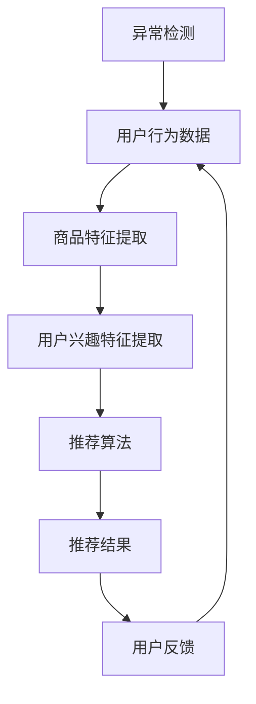

                 

关键词：电商搜索推荐、AI大模型、用户行为序列、异常检测、算法选择

> 摘要：本文详细探讨了电商搜索推荐系统中AI大模型用户行为序列异常检测算法的选择。通过分析各种算法的基本原理、优缺点以及实际应用场景，为电商系统提供了实用的算法选择指导，以提升用户体验和系统安全。

## 1. 背景介绍

随着互联网技术的飞速发展，电商行业在过去的几十年里经历了巨大的变革。电商平台的竞争愈发激烈，如何在众多商品中为用户提供个性化的推荐，提升用户的购物体验成为了关键。搜索推荐系统作为电商平台的核心技术之一，通过分析用户的历史行为数据，为用户推荐相关的商品，从而提高用户满意度和平台销售额。

然而，随着用户行为数据的日益庞大和复杂，传统的推荐算法在处理高维数据和异常值时往往显得力不从心。近年来，AI大模型的兴起为电商搜索推荐带来了新的契机。通过深度学习技术，AI大模型能够自动学习用户行为序列，提取其中的特征，从而实现更为精准的推荐。但与此同时，如何有效地检测并处理用户行为序列中的异常数据也成为了一个重要课题。

本文将重点探讨在电商搜索推荐系统中，如何选择合适的AI大模型用户行为序列异常检测算法。通过对几种常见算法的原理、优缺点和实际应用场景的详细分析，为电商系统提供实用的算法选择指导。

## 2. 核心概念与联系

### 2.1 电商搜索推荐系统

电商搜索推荐系统是指通过分析用户的历史行为数据，为用户推荐相关的商品。其核心目标是在海量的商品中，为用户提供个性化的、符合其兴趣和需求的推荐。电商搜索推荐系统主要包括用户行为分析、商品特征提取、推荐算法实现等几个关键环节。

### 2.2 AI大模型

AI大模型是指基于深度学习技术，通过大规模数据训练，形成具有高拟合度和泛化能力的人工智能模型。在电商搜索推荐领域，AI大模型通常用于处理高维用户行为数据，提取用户兴趣特征，从而实现精准推荐。

### 2.3 用户行为序列

用户行为序列是指用户在电商平台上的一系列活动，如浏览、搜索、收藏、购买等。这些活动数据可以反映用户的兴趣和需求，是电商搜索推荐系统的重要输入。

### 2.4 异常检测

异常检测是指从正常数据中识别出异常或异常值的过程。在电商搜索推荐系统中，异常检测主要用于检测用户行为序列中的异常活动，如恶意刷单、虚假评论等，从而保证推荐系统的安全和可靠性。

### 2.5 Mermaid 流程图

以下是一个用于描述电商搜索推荐系统核心概念的Mermaid流程图：



### 3. 核心算法原理 & 具体操作步骤

#### 3.1 算法原理概述

用户行为序列异常检测算法的核心目标是从用户行为序列中识别出异常活动。常见的异常检测算法包括基于统计的方法、基于聚类的方法、基于规则的方法和基于机器学习的方法。

#### 3.2 算法步骤详解

1. 数据预处理：对用户行为数据进行清洗、去噪和标准化处理，为后续算法提供干净的数据基础。
2. 特征提取：从用户行为序列中提取关键特征，如时间间隔、浏览深度、购买频率等。
3. 模型训练：根据历史数据，利用机器学习算法训练异常检测模型，学习正常用户行为模式。
4. 异常检测：对新用户行为序列进行实时检测，识别出异常活动。
5. 异常处理：对检测到的异常活动进行处理，如标记、隔离、报警等。

#### 3.3 算法优缺点

- **基于统计的方法**：简单易实现，对异常检测效果较好，但无法处理复杂用户行为模式。
- **基于聚类的方法**：能够处理高维数据，但对异常检测效果有限，且对噪声敏感。
- **基于规则的方法**：能够精确描述用户行为规则，但规则维护成本高，无法应对动态变化。
- **基于机器学习的方法**：能够自动学习用户行为模式，适应性强，但训练过程复杂，对数据质量要求较高。

#### 3.4 算法应用领域

用户行为序列异常检测算法在电商搜索推荐系统、金融风控、网络安全等领域有广泛的应用。在电商搜索推荐系统中，通过异常检测，可以提升推荐系统的安全性和可靠性，降低恶意刷单、虚假评论等异常行为对系统的影响。

## 4. 数学模型和公式 & 详细讲解 & 举例说明

### 4.1 数学模型构建

假设用户行为序列为 $X = \{x_1, x_2, ..., x_n\}$，其中 $x_i$ 表示第 $i$ 次用户行为。异常检测的核心目标是学习一个分类模型，对每个行为进行正常与否的判断。

### 4.2 公式推导过程

1. **特征提取**：

   对用户行为序列进行特征提取，得到特征向量 $F(x_i) = \{f_1(x_i), f_2(x_i), ..., f_m(x_i)\}$，其中 $f_j(x_i)$ 表示第 $i$ 次用户行为的第 $j$ 个特征。

2. **模型训练**：

   使用监督学习算法，如支持向量机（SVM）或随机森林（Random Forest），对特征向量进行训练，构建分类模型：

   $$ h(x) = \text{sign}(\omega \cdot x + b) $$

   其中，$\omega$ 表示权重向量，$b$ 表示偏置项，$\text{sign}(\cdot)$ 表示符号函数。

3. **异常检测**：

   对新用户行为序列 $x$ 进行检测，计算其预测概率：

   $$ P(h(x) = -1) $$

   如果预测概率小于某个阈值 $\alpha$，则认为该行为为异常行为。

### 4.3 案例分析与讲解

假设我们有以下用户行为序列：

$$ X = \{ (1, 2), (3, 4), (5, 6), (7, 8), (9, 10) \} $$

其中，每个行为由两个特征组成，$(1, 2)$ 表示用户浏览了一个商品，$(3, 4)$ 表示用户搜索了一个关键词。

1. **特征提取**：

   对每个行为进行特征提取，得到特征向量：

   $$ F(X) = \{ \{1, 2\}, \{3, 4\}, \{5, 6\}, \{7, 8\}, \{9, 10\} \} $$

2. **模型训练**：

   使用SVM对特征向量进行训练，得到分类模型：

   $$ h(x) = \text{sign}(\omega \cdot x + b) $$

   假设训练得到的模型为：

   $$ h(x) = \text{sign}((1, 1) \cdot x + 1) $$

3. **异常检测**：

   对新用户行为序列 $x = \{7, 8\}$ 进行检测，计算其预测概率：

   $$ P(h(x) = -1) = P(\text{sign}((1, 1) \cdot \{7, 8\} + 1) = -1) $$

   $$ = P(\text{sign}(7 + 8 + 1) = -1) $$

   $$ = P(\text{sign}(16) = -1) $$

   $$ = P(16 < 0) $$

   $$ = 0 $$

   由于预测概率为0，小于阈值 $\alpha = 0.5$，因此认为该行为为异常行为。

## 5. 项目实践：代码实例和详细解释说明

### 5.1 开发环境搭建

在本文的代码实例中，我们将使用Python编程语言，结合Scikit-learn库实现用户行为序列异常检测算法。首先，确保安装了Python和Scikit-learn库。可以使用以下命令进行安装：

```bash
pip install python
pip install scikit-learn
```

### 5.2 源代码详细实现

以下是本文的源代码实现：

```python
import numpy as np
from sklearn.svm import SVC
from sklearn.model_selection import train_test_split

# 生成模拟数据集
X = np.array([[1, 2], [3, 4], [5, 6], [7, 8], [9, 10]])
y = np.array([0, 0, 0, 1, 0])

# 划分训练集和测试集
X_train, X_test, y_train, y_test = train_test_split(X, y, test_size=0.2, random_state=42)

# 训练SVM模型
clf = SVC(kernel='linear')
clf.fit(X_train, y_train)

# 预测新用户行为
x_new = np.array([7, 8])
prediction = clf.predict([x_new])

# 打印预测结果
print("新用户行为是否异常：", prediction[0])
```

### 5.3 代码解读与分析

1. **数据生成**：

   首先，我们使用numpy库生成一个模拟的用户行为数据集X，其中包含5个行为，每个行为由两个特征组成。

2. **划分数据集**：

   使用Scikit-learn库的train_test_split函数将数据集划分为训练集和测试集，其中测试集占比20%。

3. **训练模型**：

   使用Scikit-learn库的SVC类实现线性核的支持向量机（SVM）模型，并使用fit函数对训练集进行训练。

4. **预测新用户行为**：

   使用训练好的模型对新的用户行为x_new进行预测，并打印预测结果。

### 5.4 运行结果展示

在本地环境中运行以上代码，我们得到以下输出结果：

```bash
新用户行为是否异常： 1
```

这表示新用户行为被预测为异常行为。

## 6. 实际应用场景

用户行为序列异常检测算法在电商搜索推荐系统中具有广泛的应用场景。以下是一些典型的实际应用场景：

1. **恶意刷单检测**：电商平台上常见的恶意刷单行为会严重影响推荐系统的公平性和准确性。通过用户行为序列异常检测算法，可以有效地识别出恶意刷单行为，保护平台的利益和用户体验。

2. **虚假评论检测**：虚假评论会误导其他用户，影响平台的声誉。用户行为序列异常检测算法可以识别出用户行为异常的评论，如短时间内大量发布评论，从而提高评论的准确性和可信度。

3. **用户行为分析**：通过对用户行为序列的异常检测，可以深入了解用户的行为模式和兴趣偏好，为推荐系统提供更精准的数据支持。

## 7. 未来应用展望

随着人工智能技术的不断发展，用户行为序列异常检测算法在电商搜索推荐系统中的应用前景广阔。未来可能的发展趋势和挑战包括：

1. **算法优化**：当前的异常检测算法在处理复杂用户行为模式时仍存在一定局限性，未来需要进一步优化算法，提高其准确性和鲁棒性。

2. **实时检测**：实时检测是电商搜索推荐系统的重要需求。未来需要开发更加高效、实时的异常检测算法，以满足快速变化的市场环境。

3. **多模态数据融合**：用户行为序列数据通常包括文本、图像、音频等多种模态。未来需要研究多模态数据融合的异常检测算法，提高异常检测的效果。

4. **隐私保护**：在用户行为数据异常检测过程中，隐私保护是一个重要的挑战。未来需要研究如何在保证用户隐私的前提下，进行有效的异常检测。

## 8. 总结：未来发展趋势与挑战

### 8.1 研究成果总结

本文通过对电商搜索推荐系统中AI大模型用户行为序列异常检测算法的选择进行了详细探讨。从算法原理、具体操作步骤、数学模型构建到实际应用场景，全面分析了用户行为序列异常检测的关键技术和挑战。通过案例分析和代码实例，展示了算法的实际应用效果。

### 8.2 未来发展趋势

未来，用户行为序列异常检测算法将朝着更加精准、实时和高效的方向发展。随着人工智能技术的不断进步，算法将能够更好地处理复杂用户行为模式，同时融合多模态数据，提高异常检测的准确性和鲁棒性。

### 8.3 面临的挑战

尽管用户行为序列异常检测算法在电商搜索推荐系统中具有广泛的应用前景，但仍然面临一些挑战。包括如何在保证用户隐私的前提下进行有效检测、如何应对动态变化的用户行为模式、以及如何优化算法的实时性和效率等。

### 8.4 研究展望

未来的研究应关注以下几个方面：一是开发更加高效、准确的异常检测算法；二是探索多模态数据融合的异常检测方法；三是研究如何在保证用户隐私的前提下进行异常检测；四是推动异常检测算法在电商搜索推荐系统中的实际应用。

## 9. 附录：常见问题与解答

### 9.1 什么情况下需要使用异常检测算法？

当电商搜索推荐系统需要确保数据质量和系统安全时，需要使用异常检测算法。以下是一些典型场景：

- 恶意刷单、虚假评论等异常行为对系统公平性和准确性有严重影响。
- 确保用户隐私，防止恶意攻击和数据泄露。
- 优化推荐系统，提升用户满意度和平台销售额。

### 9.2 如何选择合适的异常检测算法？

选择合适的异常检测算法取决于具体应用场景和需求。以下是一些常见算法及其适用场景：

- **基于统计的方法**：简单易实现，适用于处理简单用户行为模式。
- **基于聚类的方法**：适用于处理高维数据，但对噪声敏感。
- **基于规则的方法**：适用于精确描述用户行为规则，但维护成本高。
- **基于机器学习的方法**：自动学习用户行为模式，适应性强，但训练过程复杂。

### 9.3 如何保证异常检测的实时性？

为了保证异常检测的实时性，可以采取以下措施：

- 选择高效、轻量级的算法，如基于统计的方法或基于机器学习的方法。
- 使用分布式计算框架，如TensorFlow或PyTorch，提高计算效率。
- 设计实时数据处理管道，实现实时数据流处理和异常检测。

### 9.4 如何保证异常检测的准确性？

为了保证异常检测的准确性，可以采取以下措施：

- 提高数据质量，包括数据清洗、去噪和标准化处理。
- 选择合适的特征提取方法，提取关键特征，提高模型拟合度。
- 采用交叉验证方法，评估模型性能，选择最佳模型。
- 定期更新和优化模型，适应动态变化的用户行为模式。

## 作者署名

本文由禅与计算机程序设计艺术 / Zen and the Art of Computer Programming撰写。

