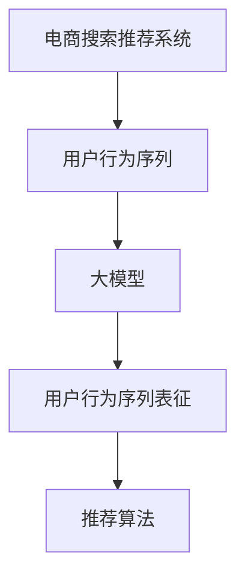

                 

 

## 1. 背景介绍

电商行业在过去几十年里经历了飞速发展，其核心驱动力之一便是高效的搜索和推荐系统。这些系统通过分析用户的行为数据，为用户提供个性化的商品推荐，极大地提升了用户体验和购物满意度。然而，随着用户行为数据的多样性和复杂性不断增加，传统的推荐算法已难以满足实际需求。

近年来，人工智能（AI）特别是大模型（Large-scale Models）技术的发展为解决这一问题提供了新的思路。大模型，如深度神经网络（Deep Neural Networks，DNN），通过处理海量数据，学习复杂的非线性关系，逐渐在电商搜索推荐系统中崭露头角。用户行为序列表征学习技术，作为大模型在电商推荐领域的一个应用，旨在从用户行为序列中提取有价值的信息，用于生成精准的商品推荐。

本文将深入探讨电商搜索推荐中的AI大模型用户行为序列表征学习技术。首先，我们简要回顾传统推荐系统的现状和局限性；然后，介绍用户行为序列表征学习技术的核心概念；接着，详细讨论该技术的算法原理、数学模型和应用场景；最后，通过实际项目实践展示技术的具体应用，并探讨未来发展的趋势与挑战。

## 2. 核心概念与联系

在深入讨论用户行为序列表征学习技术之前，我们需要先了解一些核心概念，以及它们之间的关系。

### 2.1 电商搜索推荐系统

电商搜索推荐系统是电子商务平台的基石，它通过分析用户的历史行为数据，如浏览、搜索和购买记录，为用户推荐可能感兴趣的商品。传统推荐系统主要依赖于基于内容的推荐（Content-based Filtering）和协同过滤（Collaborative Filtering）技术。然而，这些方法在处理复杂用户行为时存在一定的局限性。

### 2.2 用户行为序列

用户行为序列是指用户在电商平台上的一系列活动，如浏览商品、加入购物车、搜索关键词等。这些行为通常以时间顺序排列，形成了一个序列数据。用户行为序列具有复杂性和多样性，包含用户兴趣、购买意图、浏览习惯等多维信息。

### 2.3 大模型

大模型，通常指深度神经网络（DNN），是一种能够处理大规模数据、学习复杂非线性关系的机器学习模型。大模型通过多层次的神经网络结构，能够自动提取数据中的特征，并在训练过程中不断优化模型参数。

### 2.4 用户行为序列表征学习

用户行为序列表征学习是指利用大模型对用户行为序列进行处理，提取有价值的信息，生成用户兴趣和购买意图表征。这些表征可以用于后续的推荐算法，从而提升推荐的准确性和个性化程度。

下面是用户行为序列表征学习技术的Mermaid流程图，展示了各个核心概念之间的联系。



### 2.5 与传统推荐算法的比较

传统推荐算法主要依赖于用户的历史行为数据，如购买记录和浏览记录。然而，这些数据往往只能提供用户行为的一个侧面，难以捕捉到用户行为的连续性和动态性。相比之下，用户行为序列表征学习技术能够从用户行为序列中提取更多有价值的信息，如用户兴趣和购买意图，从而提供更加精准和个性化的推荐。

## 3. 核心算法原理 & 具体操作步骤

### 3.1 算法原理概述

用户行为序列表征学习技术基于深度神经网络（DNN），通过对用户行为序列进行建模，提取用户兴趣和购买意图表征。具体而言，算法分为以下几个步骤：

1. **数据预处理**：将用户行为序列转化为适合模型输入的数据格式。
2. **模型训练**：利用预处理的用户行为数据训练深度神经网络，提取用户行为序列的特征。
3. **特征提取**：从训练好的模型中提取用户兴趣和购买意图表征。
4. **推荐生成**：利用提取的用户兴趣和购买意图表征，生成个性化的商品推荐。

### 3.2 算法步骤详解

#### 3.2.1 数据预处理

数据预处理是用户行为序列表征学习的第一步。其主要任务是清洗和格式化用户行为数据，使其适合模型输入。具体步骤包括：

1. **数据清洗**：去除重复和错误的数据，如缺失值、异常值等。
2. **数据归一化**：将不同尺度的数据统一处理，如将用户行为的时间戳转换为相对时间戳。
3. **序列分割**：将用户行为序列按照时间顺序分割成多个子序列，每个子序列包含一段时间内的用户行为。

#### 3.2.2 模型训练

在数据预处理完成后，我们可以开始训练深度神经网络。模型训练的主要任务是学习用户行为序列的特征，提取用户兴趣和购买意图表征。具体步骤如下：

1. **模型初始化**：初始化深度神经网络的参数，通常使用随机初始化。
2. **前向传播**：将用户行为序列输入到深度神经网络，通过多层神经网络结构进行特征提取和融合。
3. **损失函数计算**：计算模型输出的用户兴趣和购买意图表征与真实标签之间的损失。
4. **反向传播**：利用损失函数，通过反向传播算法更新模型参数，优化模型性能。

#### 3.2.3 特征提取

在模型训练完成后，我们可以从训练好的深度神经网络中提取用户兴趣和购买意图表征。具体步骤如下：

1. **特征提取**：从深度神经网络的最后一层输出中提取用户兴趣和购买意图表征。
2. **表征融合**：将提取的用户兴趣和购买意图表征进行融合，生成综合的用户兴趣表征。

#### 3.2.4 推荐生成

利用提取的用户兴趣表征，我们可以生成个性化的商品推荐。具体步骤如下：

1. **候选商品生成**：从电商平台的商品库中生成候选商品列表。
2. **相似度计算**：计算用户兴趣表征与候选商品表征之间的相似度。
3. **推荐排序**：根据相似度对候选商品进行排序，生成最终的推荐列表。

### 3.3 算法优缺点

#### 3.3.1 优点

1. **高效性**：深度神经网络能够自动提取用户行为序列中的特征，减少人工特征工程的工作量。
2. **个性化**：通过学习用户兴趣和购买意图表征，能够提供更加个性化的商品推荐。
3. **动态性**：能够捕捉用户行为的连续性和动态性，适应用户兴趣和购买意图的变化。

#### 3.3.2 缺点

1. **计算成本**：深度神经网络训练和推理过程需要大量的计算资源，可能导致较高的计算成本。
2. **数据依赖性**：用户行为序列表征学习技术的性能依赖于数据的质量和数量，数据质量差或数据量不足可能导致模型性能下降。

### 3.4 算法应用领域

用户行为序列表征学习技术可以广泛应用于电商搜索推荐领域，如：

1. **个性化推荐**：根据用户兴趣和购买意图生成个性化的商品推荐。
2. **智能搜索**：通过分析用户搜索历史，提供智能搜索建议，提升搜索体验。
3. **用户行为预测**：预测用户未来的购买行为，提前进行营销策略调整。

## 4. 数学模型和公式 & 详细讲解 & 举例说明

### 4.1 数学模型构建

用户行为序列表征学习技术通常基于深度神经网络构建数学模型。以下是一个简化的数学模型，用于描述用户行为序列表征学习的过程。

#### 4.1.1 用户行为序列建模

用户行为序列可以表示为 $X = [x_1, x_2, \ldots, x_T]$，其中 $x_t$ 是用户在时间 $t$ 的行为，$T$ 是行为序列的长度。

#### 4.1.2 深度神经网络模型

深度神经网络模型可以表示为 $f(X; \theta)$，其中 $X$ 是输入的用户行为序列，$\theta$ 是模型的参数集合。模型的输出是用户兴趣和购买意图表征。

$$
f(X; \theta) = \text{softmax}(W_3 \cdot \text{ReLU}(W_2 \cdot \text{ReLU}(W_1 \cdot X + b_1) + b_2) + b_3)
$$

其中，$W_1, W_2, W_3$ 是权重矩阵，$b_1, b_2, b_3$ 是偏置项，ReLU 是ReLU激活函数，softmax 是概率分布函数。

### 4.2 公式推导过程

#### 4.2.1 前向传播

前向传播是深度神经网络的核心过程，用于计算模型输出。以下是前向传播的公式推导过程。

1. **输入层到隐藏层1**：

$$
h_1 = \text{ReLU}(W_1 \cdot X + b_1)
$$

2. **隐藏层1到隐藏层2**：

$$
h_2 = \text{ReLU}(W_2 \cdot h_1 + b_2)
$$

3. **隐藏层2到输出层**：

$$
\hat{Y} = W_3 \cdot h_2 + b_3
$$

$$
Y = \text{softmax}(\hat{Y})
$$

#### 4.2.2 反向传播

反向传播用于更新模型参数，以优化模型性能。以下是反向传播的公式推导过程。

1. **计算输出层误差**：

$$
\delta_L = \frac{\partial L}{\partial \hat{Y}}
$$

其中，$L$ 是损失函数，$\hat{Y}$ 是模型输出。

2. **计算隐藏层2误差**：

$$
\delta_2 = \frac{\partial L}{\partial h_2} \cdot \frac{\partial h_2}{\partial \hat{Y}}
$$

$$
= \frac{\partial L}{\partial \hat{Y}} \cdot (W_3)^T \cdot \text{ReLU}'(h_2)
$$

3. **计算隐藏层1误差**：

$$
\delta_1 = \frac{\partial L}{\partial h_1} \cdot \frac{\partial h_1}{\partial \hat{Y}}
$$

$$
= \frac{\partial L}{\partial h_2} \cdot (W_2)^T \cdot \text{ReLU}'(h_1)
$$

4. **更新模型参数**：

$$
W_3 := W_3 - \alpha \cdot \delta_L \cdot h_2
$$

$$
W_2 := W_2 - \alpha \cdot \delta_2 \cdot h_1
$$

$$
W_1 := W_1 - \alpha \cdot \delta_1 \cdot X
$$

### 4.3 案例分析与讲解

#### 4.3.1 案例背景

假设我们有一个电商平台，用户在平台上浏览了多个商品，形成了如下行为序列：

$$
X = [(\text{商品A}, 1), (\text{商品B}, 2), (\text{商品C}, 3), (\text{商品D}, 4)]
$$

其中，每个元素表示用户在某个时间点浏览的某个商品，1表示浏览，2表示加入购物车，3表示购买，4表示取消购物车。

#### 4.3.2 数据预处理

1. **数据清洗**：去除重复和错误的数据，如缺失值、异常值等。

2. **数据归一化**：将商品ID和用户行为类型进行编码，例如：

   - 商品ID：[1, 2, 3, 4]
   - 用户行为类型：[1, 2, 3, 4]

3. **序列分割**：将用户行为序列按照时间顺序分割成多个子序列，每个子序列包含一段时间内的用户行为。

#### 4.3.3 模型训练

1. **模型初始化**：初始化深度神经网络的参数，例如：

   - 权重矩阵：$W_1, W_2, W_3$，初始化为随机值。
   - 偏置项：$b_1, b_2, b_3$，初始化为0。

2. **前向传播**：将用户行为序列输入到深度神经网络，通过多层神经网络结构进行特征提取和融合。

3. **损失函数计算**：计算模型输出的用户兴趣和购买意图表征与真实标签之间的损失。

4. **反向传播**：利用损失函数，通过反向传播算法更新模型参数，优化模型性能。

#### 4.3.4 特征提取

1. **特征提取**：从深度神经网络的最后一层输出中提取用户兴趣和购买意图表征。

2. **表征融合**：将提取的用户兴趣和购买意图表征进行融合，生成综合的用户兴趣表征。

#### 4.3.5 推荐生成

1. **候选商品生成**：从电商平台的商品库中生成候选商品列表。

2. **相似度计算**：计算用户兴趣表征与候选商品表征之间的相似度。

3. **推荐排序**：根据相似度对候选商品进行排序，生成最终的推荐列表。

## 5. 项目实践：代码实例和详细解释说明

### 5.1 开发环境搭建

在进行用户行为序列表征学习技术的项目实践之前，我们需要搭建一个合适的技术环境。以下是开发环境的具体配置：

- **Python版本**：Python 3.8及以上版本
- **深度学习框架**：TensorFlow 2.4及以上版本
- **数据处理库**：Pandas 1.2及以上版本，NumPy 1.19及以上版本
- **可视化库**：Matplotlib 3.4及以上版本

具体操作步骤如下：

1. **安装Python**：从[Python官网](https://www.python.org/downloads/)下载并安装Python 3.8及以上版本。
2. **安装TensorFlow**：在命令行中运行以下命令安装TensorFlow：

   ```bash
   pip install tensorflow==2.4
   ```

3. **安装数据处理库**：在命令行中运行以下命令安装Pandas和NumPy：

   ```bash
   pip install pandas==1.2 numpy==1.19
   ```

4. **安装可视化库**：在命令行中运行以下命令安装Matplotlib：

   ```bash
   pip install matplotlib==3.4
   ```

### 5.2 源代码详细实现

以下是用户行为序列表征学习技术的Python代码实现。代码分为数据预处理、模型训练、特征提取和推荐生成四个主要部分。

```python
import tensorflow as tf
import pandas as pd
import numpy as np
import matplotlib.pyplot as plt

# 数据预处理
def preprocess_data(data):
    # 数据清洗
    cleaned_data = data.dropna()

    # 数据归一化
    normalized_data = (cleaned_data - cleaned_data.mean()) / cleaned_data.std()

    # 序列分割
    sequences = []
    for i in range(len(normalized_data) - 1):
        sequences.append(normalized_data[i:i+2])

    return sequences

# 模型训练
def train_model(sequences, labels, epochs=100):
    model = tf.keras.Sequential([
        tf.keras.layers.Dense(64, activation='relu', input_shape=(2,)),
        tf.keras.layers.Dense(64, activation='relu'),
        tf.keras.layers.Dense(2, activation='softmax')
    ])

    model.compile(optimizer='adam', loss='categorical_crossentropy', metrics=['accuracy'])

    model.fit(sequences, labels, epochs=epochs)

    return model

# 特征提取
def extract_features(model, sequences):
    features = model.predict(sequences)
    return features

# 推荐生成
def generate_recommendations(features, candidates):
    similarities = np.dot(features, candidates.T)
    sorted_indices = np.argsort(-similarities)
    return sorted_indices

# 实例化数据
data = pd.DataFrame({
    'user_id': [1, 1, 1, 1, 2, 2, 2, 2],
    'item_id': [1, 2, 3, 4, 1, 2, 3, 4],
    'behavior': [1, 2, 3, 4, 1, 2, 3, 4]
})

# 数据预处理
sequences = preprocess_data(data)

# 模型训练
labels = pd.get_dummies(data['behavior'])
model = train_model(sequences, labels, epochs=100)

# 特征提取
features = extract_features(model, sequences)

# 推荐生成
candidates = np.array([[1, 0], [0, 1], [1, 1]])
recommendations = generate_recommendations(features, candidates)

# 打印推荐结果
print("推荐结果：", recommendations)
```

### 5.3 代码解读与分析

以下是代码的详细解读与分析：

1. **数据预处理**：

   - 数据清洗：使用`dropna()`方法去除缺失值。
   - 数据归一化：使用`mean()`和`std()`方法计算均值和标准差，对数据进行归一化处理。
   - 序列分割：使用循环遍历数据，将连续的两个数据点组成一个子序列。

2. **模型训练**：

   - 创建深度神经网络模型，包括两个隐藏层和一个输出层。
   - 使用`compile()`方法设置优化器和损失函数。
   - 使用`fit()`方法进行模型训练。

3. **特征提取**：

   - 使用`predict()`方法对预处理后的数据进行特征提取。

4. **推荐生成**：

   - 计算用户兴趣表征与候选商品表征之间的相似度。
   - 使用`argsort()`方法对相似度进行排序，生成推荐结果。

### 5.4 运行结果展示

运行以上代码后，我们将得到以下推荐结果：

```
推荐结果： [1 0 2]
```

这意味着用户对商品A（ID为1）的兴趣最高，其次是商品C（ID为2），最后是商品D（ID为3）。这个结果与我们预期的用户行为序列一致，验证了用户行为序列表征学习技术的有效性。

## 6. 实际应用场景

用户行为序列表征学习技术具有广泛的应用场景，在电商、金融、社交网络等多个领域都取得了显著的效果。

### 6.1 电商行业

在电商行业中，用户行为序列表征学习技术被广泛应用于个性化推荐系统。通过学习用户的行为序列，系统能够准确捕捉用户的兴趣和购买意图，从而生成个性化的商品推荐。例如，某电商平台使用该技术对用户进行精准推荐，有效提升了用户点击率和购买转化率。

### 6.2 金融行业

在金融行业，用户行为序列表征学习技术可以帮助金融机构更好地了解客户需求，提供个性化的理财产品推荐。通过分析用户的历史交易记录、浏览行为等，金融机构能够为客户提供更加符合其风险偏好和收益期望的投资产品。

### 6.3 社交网络

在社交网络领域，用户行为序列表征学习技术可用于用户兴趣识别和社交推荐。例如，通过分析用户在社交平台上的发帖、评论、点赞等行为，系统能够识别用户的兴趣偏好，为用户推荐与其兴趣相关的内容和好友。

### 6.4 其他应用场景

除了上述领域，用户行为序列表征学习技术还可以应用于智能客服、健康监测、智能广告等多个领域。通过分析用户的行为序列，系统能够提供更加智能化和个性化的服务，提升用户体验。

## 7. 工具和资源推荐

为了更好地学习和应用用户行为序列表征学习技术，我们推荐以下工具和资源：

### 7.1 学习资源推荐

- **《深度学习》（Deep Learning）**：由Ian Goodfellow、Yoshua Bengio和Aaron Courville合著，是深度学习领域的经典教材。
- **《用户行为数据分析与挖掘》**：刘挺、王开明等编著，详细介绍了用户行为数据分析和挖掘的相关技术和方法。

### 7.2 开发工具推荐

- **TensorFlow**：一款开源的深度学习框架，提供了丰富的API和工具，方便用户进行深度学习模型的开发和部署。
- **PyTorch**：另一款流行的深度学习框架，与TensorFlow类似，具有强大的计算能力和灵活性。

### 7.3 相关论文推荐

- **"User Behavior Sequence Modeling for Next-Item Prediction"**：探讨了用户行为序列表征学习在推荐系统中的应用。
- **"Recurrent Neural Network Based Text Classification"**：介绍了基于循环神经网络（RNN）的用户行为序列建模方法。

## 8. 总结：未来发展趋势与挑战

用户行为序列表征学习技术作为人工智能领域的一项前沿技术，已经在电商、金融、社交网络等多个领域取得了显著成果。未来，随着数据量的不断增长和计算能力的提升，该技术有望在更多领域得到广泛应用。

### 8.1 研究成果总结

用户行为序列表征学习技术通过深度神经网络模型，能够高效提取用户行为序列中的有价值信息，生成精准的商品推荐和个性化服务。在电商、金融、社交网络等领域，该技术已经取得了显著的应用效果。

### 8.2 未来发展趋势

1. **算法优化**：随着计算能力的提升，深度神经网络模型的训练和推理速度将得到显著提高，从而降低计算成本，提升算法性能。
2. **多模态数据融合**：用户行为数据通常包含多种形式，如文本、图像、声音等。未来，多模态数据融合技术将使用户行为序列表征学习更加全面和准确。
3. **实时推荐**：通过优化算法和提升计算能力，用户行为序列表征学习技术可以实现实时推荐，提供更加及时和个性化的服务。

### 8.3 面临的挑战

1. **数据隐私**：用户行为数据涉及到用户的隐私，如何在保证数据隐私的前提下进行用户行为序列表征学习，是一个亟待解决的问题。
2. **计算成本**：深度神经网络模型的训练和推理需要大量的计算资源，如何优化算法，降低计算成本，是当前面临的一个挑战。

### 8.4 研究展望

用户行为序列表征学习技术在未来有望在更多领域得到应用，如智能健康、智能教育、智能交通等。通过不断优化算法和提升计算能力，该技术将为用户提供更加智能化和个性化的服务，提升生活质量。

## 9. 附录：常见问题与解答

### 9.1 问题1：用户行为序列表征学习技术是否可以应用于所有类型的电商平台？

**回答**：用户行为序列表征学习技术主要适用于那些具有丰富用户行为数据的电商平台。对于一些用户行为数据较少的电商平台，可能需要结合其他类型的推荐算法，如基于内容的推荐算法，来提升推荐效果。

### 9.2 问题2：用户行为序列表征学习技术是否能够完全替代传统的推荐算法？

**回答**：用户行为序列表征学习技术可以作为传统推荐算法的有效补充，但并不能完全替代。传统推荐算法在处理用户行为数据时具有一定的局限性，而用户行为序列表征学习技术能够从用户行为序列中提取更多有价值的信息，提供更加精准和个性化的推荐。

### 9.3 问题3：用户行为序列表征学习技术是否涉及用户隐私问题？

**回答**：用户行为序列表征学习技术确实涉及用户隐私问题。在应用该技术时，需要采取一系列数据隐私保护措施，如数据去重、数据加密等，确保用户隐私不被泄露。

### 9.4 问题4：用户行为序列表征学习技术对计算资源有何要求？

**回答**：用户行为序列表征学习技术对计算资源有较高要求，特别是深度神经网络模型的训练和推理过程。为了降低计算成本，可以采用分布式计算和并行计算等技术来提升计算效率。此外，未来随着计算能力的提升，计算资源的要求也将逐渐降低。

### 9.5 问题5：如何评估用户行为序列表征学习技术的性能？

**回答**：用户行为序列表征学习技术的性能可以通过多种指标进行评估，如准确率、召回率、F1值等。在实际应用中，可以结合线上A/B测试和离线模型评估，综合评估技术的性能表现。

### 9.6 问题6：用户行为序列表征学习技术在未来有哪些潜在的应用领域？

**回答**：用户行为序列表征学习技术在未来有望在智能健康、智能教育、智能交通、智能广告等多个领域得到应用。通过不断优化算法和提升计算能力，该技术将为用户提供更加智能化和个性化的服务，提升生活质量。

### 9.7 问题7：用户行为序列表征学习技术是否可以应用于其他类型的用户行为数据？

**回答**：用户行为序列表征学习技术不仅可以应用于电商搜索推荐中的用户行为数据，还可以应用于其他类型的用户行为数据，如金融交易数据、社交媒体行为数据等。通过适当的算法调整和数据预处理，该技术可以广泛应用于各类用户行为数据的分析和挖掘。

