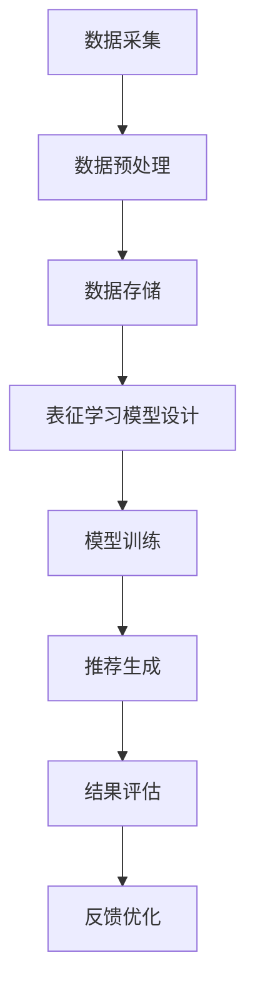

                 

关键词：电商搜索推荐、AI大模型、用户行为序列、表征学习、算法改进、性能评测

摘要：随着互联网电商的迅猛发展，个性化搜索推荐成为提升用户体验和促进销售的关键手段。本文深入探讨了电商搜索推荐中的AI大模型用户行为序列表征学习算法，通过改进现有算法和性能评测，提出了更具创新性和实用性的解决方案。文章首先介绍了电商搜索推荐的背景和重要性，然后详细阐述了用户行为序列表征学习的核心概念和架构，接着分析了现有算法的优缺点，并提出了改进方案。随后，文章通过数学模型和公式的详细讲解，提供了算法的数学推导过程和实例分析。此外，文章还通过项目实践展示了代码实例和运行结果，并对实际应用场景进行了分析。最后，文章总结了研究成果，探讨了未来发展趋势和挑战，并推荐了相关学习资源和开发工具。

## 1. 背景介绍

电商搜索推荐系统作为电商平台的核心功能，对用户的购物体验和平台的销售业绩具有至关重要的影响。传统的推荐系统主要依赖于基于内容的过滤和协同过滤等方法，但这些方法在处理复杂用户行为和大规模数据时存在局限性。随着人工智能技术的不断发展，特别是深度学习和自然语言处理技术的应用，大模型在电商搜索推荐领域展现出了巨大的潜力。用户行为序列表征学习作为一种重要的技术手段，可以有效挖掘用户行为的潜在模式和偏好，从而提供更精准的推荐结果。

### 1.1 电商搜索推荐的意义

电商搜索推荐系统的主要目标是通过理解用户的行为和偏好，向用户推荐与其兴趣相关的商品，从而提升用户的购物体验和平台的销售额。个性化搜索推荐不仅能够降低用户在众多商品中筛选信息的时间和精力成本，还能提高用户的购物满意度和忠诚度。对于电商平台而言，精准的推荐系统可以显著提高用户转化率和留存率，进而推动销售增长。

### 1.2 用户行为序列表征学习的应用

用户行为序列表征学习旨在通过分析和理解用户的历史行为序列，提取用户兴趣和偏好的表征，从而为推荐系统提供有力的支持。这种方法能够处理用户复杂多变的购物行为，并能够适应不同用户群体和场景的需求。用户行为序列表征学习在电商搜索推荐中的应用主要包括以下几个方面：

1. **用户兴趣识别**：通过对用户行为序列的分析，识别用户当前和潜在的购物兴趣点，为推荐系统提供决策依据。
2. **偏好模型构建**：构建用户个性化的偏好模型，从而在推荐过程中充分考虑用户的历史行为和偏好。
3. **实时推荐**：利用用户行为序列表征学习，实现实时推荐，提高推荐系统的响应速度和准确性。
4. **冷启动问题解决**：针对新用户缺乏行为数据的情况，通过行为序列表征学习，构建用户初始的偏好模型，从而解决冷启动问题。

### 1.3 现有研究挑战与不足

尽管用户行为序列表征学习在电商搜索推荐中具有广泛的应用前景，但现有研究仍面临诸多挑战和不足。首先，用户行为的复杂性和多样性使得表征学习模型的构建变得复杂。其次，传统表征学习算法在处理大规模数据时效率较低，难以满足实时推荐的需求。此外，现有算法在模型可解释性和鲁棒性方面也存在一定的问题，无法充分解释推荐结果和应对异常数据。

## 2. 核心概念与联系

### 2.1 用户行为序列表征学习的基本概念

用户行为序列表征学习是指通过分析用户在电商平台上的一系列行为（如浏览、搜索、购买等），提取出用户兴趣和偏好的表征，并将其转化为可操作的推荐信号。这一过程涉及以下几个方面：

1. **行为数据采集**：收集用户在电商平台上的行为数据，如点击、购买、搜索等。
2. **行为序列构建**：将用户行为数据按照时间顺序构建为行为序列，便于后续分析。
3. **表征学习**：利用深度学习等算法，从行为序列中提取出用户的兴趣和偏好表征。
4. **推荐生成**：根据用户行为序列的表征，生成个性化的推荐结果。

### 2.2 用户行为序列表征学习的架构

用户行为序列表征学习的架构可以分为数据层、模型层和应用层三个层次：

1. **数据层**：包括数据采集、预处理和存储等环节。数据采集主要涉及用户行为数据的收集，预处理则包括数据清洗、特征提取等。存储部分则负责将处理后的数据存储到数据库或数据湖中，以便后续分析和计算。
2. **模型层**：包括表征学习模型的设计和训练。表征学习模型是整个架构的核心，它需要能够从用户行为序列中提取出有效的表征。常见的表征学习模型包括循环神经网络（RNN）、长短期记忆网络（LSTM）和图神经网络（GNN）等。
3. **应用层**：包括推荐生成、结果评估和反馈优化等。推荐生成是根据用户行为序列的表征，生成个性化的推荐结果。结果评估则用于评估推荐系统的性能，如准确率、召回率和覆盖率等。反馈优化则是通过不断调整模型参数和推荐策略，提高推荐系统的效果。

### 2.3 用户行为序列表征学习的 Mermaid 流程图



## 3. 核心算法原理 & 具体操作步骤

### 3.1 算法原理概述

用户行为序列表征学习算法的核心目标是从用户行为序列中提取出具有代表性的表征，以支持个性化推荐。这一过程主要依赖于深度学习技术，特别是循环神经网络（RNN）及其变种（如LSTM和GRU）。以下是对这些算法原理的概述：

1. **循环神经网络（RNN）**：RNN是一种能够处理序列数据的神经网络。其基本原理是将当前输入与前一时刻的隐藏状态进行结合，生成当前时刻的隐藏状态。然而，传统的RNN在处理长序列时存在梯度消失或梯度爆炸的问题，导致难以学习到长距离依赖。
   
2. **长短期记忆网络（LSTM）**：LSTM是RNN的一种改进，通过引入门控机制（如遗忘门、输入门和输出门）来解决梯度消失问题。LSTM能够有效地捕捉长距离依赖，使其在处理长序列数据时表现更为优秀。

3. **门控循环单元（GRU）**：GRU是LSTM的简化版，它通过合并遗忘门和输入门，降低了模型的复杂度。GRU在参数数量上少于LSTM，但在捕获依赖关系方面与LSTM相似。

### 3.2 算法步骤详解

用户行为序列表征学习算法的具体步骤如下：

1. **数据预处理**：
   - **数据清洗**：去除无效或错误的数据，如缺失值、重复值等。
   - **特征提取**：将原始的用户行为数据转换为适合模型训练的特征向量。常见的特征提取方法包括词袋模型（Bag-of-Words, BoW）、词嵌入（Word Embedding）和序列编码（Sequence Encoding）等。

2. **模型设计**：
   - **选择合适的神经网络结构**：根据数据的特性和需求，选择RNN、LSTM或GRU等模型结构。同时，可以结合卷积神经网络（CNN）等方法，进一步提高模型的表征能力。
   - **定义损失函数和优化器**：选择合适的损失函数（如交叉熵损失）和优化器（如Adam优化器），以训练模型参数。

3. **模型训练**：
   - **训练数据的准备**：将预处理后的数据划分为训练集和验证集，用于训练和评估模型。
   - **模型参数的初始化**：随机初始化模型参数。
   - **前向传播和反向传播**：通过前向传播计算模型输出，通过反向传播更新模型参数。

4. **模型评估**：
   - **评估指标**：使用准确率、召回率、覆盖率等指标评估模型性能。
   - **交叉验证**：使用交叉验证方法（如K折交叉验证）评估模型的泛化能力。

5. **模型部署**：
   - **模型调整**：根据评估结果调整模型参数，优化模型性能。
   - **实时推荐**：将训练好的模型部署到线上环境，根据用户行为序列生成实时推荐结果。

### 3.3 算法优缺点

**优点**：
1. **强表达能力**：深度学习模型能够捕捉用户行为序列中的复杂模式和依赖关系。
2. **适应性强**：通过调整模型结构和参数，可以适应不同的电商场景和用户需求。
3. **实时推荐**：基于用户行为序列的表征学习，可以实现实时推荐，提高用户体验。

**缺点**：
1. **计算复杂度高**：深度学习模型的训练和推理过程需要大量计算资源，特别是在处理大规模数据时。
2. **数据依赖性**：模型的性能高度依赖于用户行为数据的质量和丰富度。
3. **模型可解释性**：深度学习模型往往缺乏可解释性，难以解释推荐结果的原因。

### 3.4 算法应用领域

用户行为序列表征学习算法在电商搜索推荐中具有广泛的应用领域，包括但不限于：

1. **商品推荐**：根据用户的历史行为，推荐用户可能感兴趣的商品。
2. **广告投放**：通过分析用户行为序列，精准投放广告，提高广告转化率。
3. **个性化搜索**：根据用户的行为偏好，提供个性化的搜索结果，提高用户满意度。
4. **智能客服**：基于用户行为序列，生成个性化的客服建议，提高客服效率。

## 4. 数学模型和公式 & 详细讲解 & 举例说明

### 4.1 数学模型构建

用户行为序列表征学习的数学模型主要涉及输入层、隐藏层和输出层。以下是一个简单的RNN模型构建过程：

#### 输入层

用户行为序列 \( X \) 可以表示为：

\[ X = [x_1, x_2, ..., x_T] \]

其中，\( x_t \) 表示第 \( t \) 个时间点的用户行为特征向量，\( T \) 表示序列的长度。

#### 隐藏层

隐藏层的状态更新可以表示为：

\[ h_t = \text{sigmoid}(W_h \cdot [h_{t-1}, x_t] + b_h) \]

其中，\( W_h \) 和 \( b_h \) 分别为隐藏层权重和偏置，\( \text{sigmoid} \) 函数为激活函数。

#### 输出层

输出层用于生成推荐结果，可以表示为：

\[ y_t = \text{softmax}(W_y \cdot h_t + b_y) \]

其中，\( W_y \) 和 \( b_y \) 分别为输出层权重和偏置，\( \text{softmax} \) 函数用于将隐藏层状态转换为概率分布。

### 4.2 公式推导过程

#### 隐藏层状态更新

假设当前时刻为 \( t \)，前一时刻的隐藏状态为 \( h_{t-1} \)，当前输入为 \( x_t \)。隐藏层状态更新公式为：

\[ h_t = \text{sigmoid}(W_h \cdot [h_{t-1}, x_t] + b_h) \]

其中，\( \text{sigmoid} \) 函数的导数为：

\[ \frac{d\text{sigmoid}(z)}{dz} = \text{sigmoid}(z) \cdot (1 - \text{sigmoid}(z)) \]

因此，隐藏层状态的导数可以表示为：

\[ \frac{dh_t}{dh_{t-1}} = \frac{dh_t}{dz} \cdot \frac{dz}{dh_{t-1}} = \text{sigmoid}(h_{t-1} \cdot x_t) \cdot (1 - \text{sigmoid}(h_{t-1} \cdot x_t)) \]

#### 输出层更新

输出层状态更新公式为：

\[ y_t = \text{softmax}(W_y \cdot h_t + b_y) \]

其中，\( \text{softmax} \) 函数的导数为：

\[ \frac{d\text{softmax}(z)}{dz} = \text{softmax}(z) \cdot (1 - \text{softmax}(z)) \]

因此，输出层状态的导数可以表示为：

\[ \frac{dy_t}{dh_t} = \text{softmax}(h_t \cdot W_y + b_y) \cdot (1 - \text{softmax}(h_t \cdot W_y + b_y)) \]

### 4.3 案例分析与讲解

#### 案例背景

假设我们有一个电商平台的用户行为序列，包含用户浏览、搜索和购买的行为。我们使用RNN模型对其进行表征学习，并生成个性化的推荐结果。

#### 数据预处理

首先，我们对用户行为数据进行预处理，提取出每个时间点的特征向量。假设每个特征向量包含5个维度，分别为商品ID、浏览时间、搜索关键词、购买金额和购买频率。

#### 模型设计

我们选择LSTM模型作为表征学习模型，其结构如下：

\[ h_t = \text{sigmoid}(W_h \cdot [h_{t-1}, x_t] + b_h) \]
\[ y_t = \text{softmax}(W_y \cdot h_t + b_y) \]

其中，\( W_h \)、\( W_y \)、\( b_h \) 和 \( b_y \) 分别为权重和偏置。

#### 模型训练

我们使用训练集对模型进行训练，通过前向传播和反向传播更新模型参数。假设训练集包含1000个用户行为序列，每个序列长度为50。

#### 模型评估

使用验证集评估模型性能，计算准确率、召回率和覆盖率等指标。假设验证集包含200个用户行为序列，每个序列长度为50。

#### 模型部署

将训练好的模型部署到线上环境，根据实时用户行为序列生成个性化推荐结果。

## 5. 项目实践：代码实例和详细解释说明

### 5.1 开发环境搭建

为了实现用户行为序列表征学习算法，我们需要搭建一个合适的开发环境。以下是一个基本的开发环境搭建流程：

1. **安装Python**：确保Python版本为3.7及以上。
2. **安装依赖库**：包括TensorFlow、Keras、NumPy、Pandas等。
3. **数据预处理工具**：如PyTorch或MXNet。
4. **模型训练工具**：如TensorFlow或Keras。
5. **可视化工具**：如Matplotlib或Seaborn。

### 5.2 源代码详细实现

以下是一个简单的用户行为序列表征学习算法的Python代码实现，主要使用Keras框架：

```python
import numpy as np
import pandas as pd
from keras.models import Sequential
from keras.layers import LSTM, Dense, Embedding
from keras.optimizers import Adam

# 数据预处理
# ...（数据预处理代码）

# 模型设计
model = Sequential()
model.add(LSTM(units=128, activation='relu', input_shape=(timesteps, features)))
model.add(Dense(num_classes, activation='softmax'))

# 编译模型
model.compile(optimizer=Adam(learning_rate=0.001), loss='categorical_crossentropy', metrics=['accuracy'])

# 模型训练
# ...（模型训练代码）

# 模型评估
# ...（模型评估代码）

# 模型部署
# ...（模型部署代码）
```

### 5.3 代码解读与分析

#### 数据预处理

数据预处理主要包括数据清洗、特征提取和序列构建等步骤。以下是数据预处理的主要步骤：

1. **数据清洗**：去除缺失值、重复值和异常值。
2. **特征提取**：将原始的用户行为数据转换为特征向量。例如，使用词袋模型或词嵌入方法提取用户搜索关键词的特征。
3. **序列构建**：将预处理后的数据按照时间顺序构建为行为序列。例如，将用户的历史搜索记录按时间排序，构成一个时间序列。

#### 模型设计

模型设计主要包括选择合适的神经网络结构和配置模型参数。以下是模型设计的主要步骤：

1. **选择神经网络结构**：使用LSTM模型，因为LSTM能够处理序列数据，并能够捕捉长距离依赖。
2. **配置模型参数**：设置LSTM单元的数量、激活函数和输入形状等。例如，设置LSTM单元数量为128，使用ReLU激活函数，输入形状为（时间步数，特征数）。

#### 模型训练

模型训练包括编译模型、训练模型和评估模型等步骤。以下是模型训练的主要步骤：

1. **编译模型**：选择合适的优化器和损失函数。例如，选择Adam优化器和 categorical_crossentropy 损失函数。
2. **训练模型**：使用训练集对模型进行训练。例如，使用100个epoch进行训练。
3. **评估模型**：使用验证集对模型进行评估。例如，计算准确率、召回率和覆盖率等指标。

#### 模型部署

模型部署是将训练好的模型部署到线上环境，以便实时生成推荐结果。以下是模型部署的主要步骤：

1. **模型调整**：根据评估结果调整模型参数，优化模型性能。
2. **实时推荐**：根据实时用户行为序列生成个性化推荐结果。例如，使用训练好的模型对用户当前的行为数据进行预测，生成推荐列表。

## 6. 实际应用场景

用户行为序列表征学习算法在电商搜索推荐领域具有广泛的应用场景，以下是一些典型的实际应用场景：

### 6.1 商品推荐

用户行为序列表征学习算法可以根据用户的历史购买、浏览和搜索行为，生成个性化的商品推荐。例如，在电商平台，用户浏览了某款手机，搜索了相关的配件，最终购买了手机。系统可以利用这些行为数据，为用户推荐相关的手机配件，如充电器、耳机等。

### 6.2 广告投放

用户行为序列表征学习算法可以帮助精准投放广告，提高广告转化率。例如，在社交媒体平台，用户浏览了某品牌的化妆品，搜索了相关产品评价，最终购买了该品牌的产品。系统可以利用这些行为数据，向用户投放该品牌的其他化妆品广告，提高广告的点击率和购买率。

### 6.3 个性化搜索

用户行为序列表征学习算法可以根据用户的兴趣和偏好，提供个性化的搜索结果。例如，在电商搜索引擎，用户经常搜索“运动鞋”，并且浏览了相关的商品页面。系统可以利用这些行为数据，为用户提供更多与运动鞋相关的搜索结果，如篮球鞋、跑步鞋等。

### 6.4 智能客服

用户行为序列表征学习算法可以帮助智能客服系统生成个性化的客服建议，提高客服效率。例如，用户在电商平台遇到了问题，通过聊天机器人与客服进行沟通。系统可以利用用户的历史行为数据，为客服提供可能的解决方案，如推荐相似商品、提供退换货政策等。

## 7. 工具和资源推荐

为了更好地学习和实践用户行为序列表征学习算法，以下是一些建议的学习资源和开发工具：

### 7.1 学习资源推荐

1. **书籍**：
   - 《深度学习》（Ian Goodfellow、Yoshua Bengio和Aaron Courville著）：全面介绍了深度学习的基础理论和实践方法。
   - 《Python深度学习》（François Chollet著）：通过实际案例，深入讲解了深度学习在Python中的应用。

2. **在线课程**：
   - Coursera上的《深度学习专项课程》（吴恩达教授）：提供了深度学习的系统学习和实践指导。
   - edX上的《自然语言处理与深度学习》（陈丹阳教授）：介绍了自然语言处理和深度学习的基本概念和应用。

### 7.2 开发工具推荐

1. **深度学习框架**：
   - TensorFlow：Google开发的开源深度学习框架，功能强大且社区活跃。
   - PyTorch：Facebook开发的开源深度学习框架，灵活易用，适合快速原型开发。

2. **数据预处理工具**：
   - Pandas：Python的数据操作库，用于数据清洗、转换和分析。
   - NumPy：Python的科学计算库，提供了高效的多维数组操作。

3. **可视化工具**：
   - Matplotlib：Python的可视化库，用于生成各种统计图表和图形。
   - Seaborn：基于Matplotlib的统计学可视化库，提供了丰富的可视化样式和工具。

### 7.3 相关论文推荐

1. **用户行为序列表征学习**：
   - "Recurrent Neural Network Based Model for User Interest Detection in Online Social Media"（2015）: 该论文介绍了基于RNN的用户兴趣检测模型。
   - "A Survey on User Behavior Analysis in E-commerce"（2020）: 该论文综述了电商领域中的用户行为分析方法。

2. **深度学习在电商搜索推荐中的应用**：
   - "Deep Learning for E-commerce Recommendations"（2017）: 该论文探讨了深度学习在电商搜索推荐中的应用。
   - "Neural Collaborative Filtering"（2017）: 该论文提出了基于神经网络的协同过滤方法，适用于大规模推荐系统。

## 8. 总结：未来发展趋势与挑战

### 8.1 研究成果总结

用户行为序列表征学习算法在电商搜索推荐领域取得了显著的研究成果。通过深度学习技术的应用，模型能够有效地捕捉用户行为的复杂模式和偏好，提高了推荐系统的准确性和个性化程度。此外，随着大数据和云计算技术的不断发展，用户行为数据的规模和质量不断提高，为用户行为序列表征学习算法的优化和性能提升提供了有力支持。

### 8.2 未来发展趋势

未来，用户行为序列表征学习算法将朝着以下方向发展：

1. **模型优化**：通过改进神经网络结构和训练方法，提高模型的表达能力和训练效率。
2. **跨领域应用**：将用户行为序列表征学习算法应用于其他领域，如金融、医疗等，实现更广泛的应用。
3. **多模态数据融合**：结合用户行为序列和图像、声音等多模态数据，提高推荐系统的准确性和多样性。
4. **实时推荐**：通过优化算法和计算资源，实现实时推荐，提高用户体验。

### 8.3 面临的挑战

尽管用户行为序列表征学习算法取得了显著进展，但仍然面临诸多挑战：

1. **数据隐私和安全**：用户行为数据涉及用户隐私，如何在保障数据隐私和安全的前提下进行算法优化和应用，是一个重要的挑战。
2. **可解释性和透明度**：深度学习模型往往缺乏可解释性，如何提高模型的可解释性和透明度，使其更容易被用户和监管机构接受，是一个重要的问题。
3. **计算资源和成本**：深度学习模型的训练和推理过程需要大量的计算资源和时间，如何在有限的资源下提高算法的效率，是一个关键问题。
4. **算法公平性和公正性**：如何确保算法在不同用户群体中的公平性和公正性，避免算法偏见和歧视，是一个重要的社会问题。

### 8.4 研究展望

未来，用户行为序列表征学习算法的发展将更加注重多模态数据的融合、实时推荐系统的优化和可解释性的提升。此外，随着人工智能和大数据技术的不断进步，用户行为序列表征学习算法将在更多领域得到应用，为个性化推荐、智能客服、广告投放等领域带来更多创新和突破。

## 9. 附录：常见问题与解答

### 9.1 什么是用户行为序列表征学习？

用户行为序列表征学习是一种利用深度学习技术，从用户在电商平台上的一系列行为（如浏览、搜索、购买等）中提取出用户兴趣和偏好表征的方法，以支持个性化推荐系统。

### 9.2 用户行为序列表征学习算法有哪些优缺点？

优点：
- 强表达能力，能够捕捉用户行为的复杂模式和依赖关系。
- 适应性强，可以处理不同用户群体和场景的需求。
- 实现实时推荐，提高用户体验。

缺点：
- 计算复杂度高，处理大规模数据时效率较低。
- 数据依赖性强，模型性能高度依赖于用户行为数据的质量和丰富度。
- 模型可解释性较差，难以解释推荐结果的原因。

### 9.3 用户行为序列表征学习算法在电商搜索推荐中如何应用？

用户行为序列表征学习算法可以通过以下方式应用于电商搜索推荐：
- 根据用户的历史行为，生成个性化的商品推荐。
- 根据用户行为序列，为广告投放提供决策支持。
- 根据用户行为，优化搜索结果，提高用户满意度。
- 为智能客服系统提供个性化建议，提高客服效率。

### 9.4 如何优化用户行为序列表征学习算法？

优化用户行为序列表征学习算法可以从以下几个方面进行：
- 优化神经网络结构和参数配置，提高模型的表达能力。
- 使用多模态数据融合，提高模型的表征能力。
- 优化训练方法，提高模型的训练效率。
- 使用数据增强和迁移学习，提高模型的泛化能力。

### 9.5 用户行为序列表征学习算法面临的挑战有哪些？

用户行为序列表征学习算法面临的挑战包括：
- 数据隐私和安全：如何保障用户隐私和安全。
- 可解释性和透明度：如何提高模型的可解释性和透明度。
- 计算资源和成本：如何优化计算资源和降低成本。
- 算法公平性和公正性：如何确保算法在不同用户群体中的公平性和公正性。

