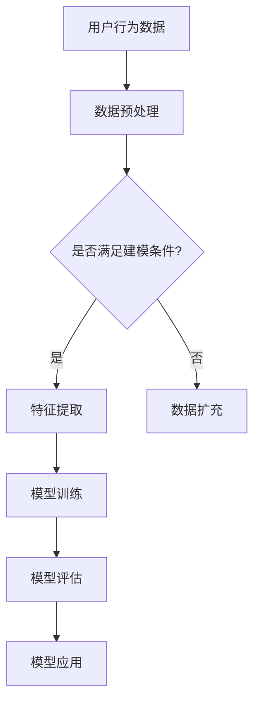

                 

关键词：电商搜索、推荐系统、AI大模型、用户行为建模、深度学习、个性化搜索

摘要：本文探讨了电商搜索推荐中应用AI大模型进行用户行为建模的技术。通过介绍用户行为建模的基本概念、核心算法原理，以及数学模型构建和实际应用场景，分析了当前电商推荐系统的发展趋势和面临的挑战，为未来的研究和实践提供了方向。

## 1. 背景介绍

在互联网电商领域，搜索推荐系统是提升用户体验、增加销售额的重要手段。随着用户数据的爆炸式增长，如何准确捕捉和预测用户行为，为用户提供个性化推荐，成为电商搜索推荐领域的关键挑战。传统的推荐算法，如基于内容推荐和协同过滤等方法，在处理用户行为时存在一定的局限性。而AI大模型用户行为建模技术的出现，为解决这一难题提供了新的思路。

AI大模型用户行为建模技术利用深度学习、自然语言处理等技术，对海量用户行为数据进行分析和建模，从而实现更加精准的推荐。通过本文的探讨，我们将深入理解这一技术的基本原理和应用方法，以及其在电商搜索推荐中的重要作用。

## 2. 核心概念与联系

### 2.1. 用户行为建模的基本概念

用户行为建模是指通过对用户行为数据的分析和处理，建立用户行为的预测模型。在电商搜索推荐领域，用户行为数据主要包括浏览历史、购买记录、搜索记录等。用户行为建模的目标是挖掘用户兴趣，预测用户意图，从而实现个性化推荐。

### 2.2. AI大模型的核心概念

AI大模型是指具有大规模参数、高度非线性、强泛化能力的深度学习模型。常见的大模型架构包括卷积神经网络（CNN）、循环神经网络（RNN）、长短时记忆网络（LSTM）等。这些模型能够对复杂的数据进行高效处理，并在多种任务中取得优异的性能。

### 2.3. 用户行为建模与AI大模型的关系

AI大模型用户行为建模技术通过将用户行为数据输入到AI大模型中，对用户行为进行建模和预测。具体来说，该技术利用深度学习模型对用户行为数据进行特征提取和关系建模，从而实现用户兴趣挖掘和个性化推荐。

### 2.4. Mermaid流程图



## 3. 核心算法原理 & 具体操作步骤

### 3.1. 算法原理概述

AI大模型用户行为建模技术主要分为三个阶段：数据预处理、特征提取和模型训练。在数据预处理阶段，对用户行为数据清洗、归一化等处理。在特征提取阶段，利用深度学习模型对用户行为数据进行特征提取。在模型训练阶段，通过优化模型参数，提高模型的预测性能。

### 3.2. 算法步骤详解

1. 数据预处理：对用户行为数据进行清洗、归一化等处理，确保数据质量。

2. 特征提取：利用深度学习模型对用户行为数据进行特征提取，提取出与用户兴趣相关的特征。

3. 模型训练：通过优化模型参数，提高模型的预测性能。常见的优化方法包括梯度下降、随机梯度下降等。

4. 模型评估：通过交叉验证等方法，评估模型的预测性能，选择最优模型。

5. 模型应用：将训练好的模型应用于电商搜索推荐系统中，为用户提供个性化推荐。

### 3.3. 算法优缺点

**优点：**
- 高效：AI大模型能够对海量用户行为数据进行分析，提高推荐系统的效率。
- 精准：通过深度学习模型进行特征提取和关系建模，提高推荐系统的准确性。
- 泛化能力：AI大模型具有较强的泛化能力，能够处理不同类型和规模的用户行为数据。

**缺点：**
- 计算资源需求大：训练AI大模型需要大量的计算资源和时间。
- 数据质量要求高：用户行为数据的质量直接影响模型的效果，需要进行严格的数据预处理。

### 3.4. 算法应用领域

AI大模型用户行为建模技术广泛应用于电商搜索推荐领域，包括商品推荐、内容推荐等。此外，该技术还可应用于社交网络、广告推荐等领域，为用户提供个性化服务。

## 4. 数学模型和公式 & 详细讲解 & 举例说明

### 4.1. 数学模型构建

在用户行为建模中，常见的数学模型包括线性模型、非线性模型等。以下以线性模型为例，介绍数学模型的构建过程。

$$
y = \beta_0 + \beta_1x_1 + \beta_2x_2 + ... + \beta_nx_n
$$

其中，$y$ 表示用户行为得分，$x_1, x_2, ..., x_n$ 表示用户行为特征，$\beta_0, \beta_1, \beta_2, ..., \beta_n$ 为模型参数。

### 4.2. 公式推导过程

线性模型的推导过程如下：

1. 数据集准备：从用户行为数据中提取特征，构建特征向量。

2. 模型初始化：随机初始化模型参数。

3. 前向传播：计算输入特征经过模型后的输出。

4. 后向传播：计算模型参数的梯度。

5. 梯度下降：更新模型参数。

6. 重复步骤3-5，直到满足停止条件。

### 4.3. 案例分析与讲解

假设我们有一个用户行为数据集，包括用户ID、浏览商品ID和浏览时间。我们需要利用线性模型预测用户对某个商品的购买概率。

1. 数据集准备：从数据集中提取用户ID、浏览商品ID和浏览时间作为特征。

2. 模型初始化：随机初始化模型参数。

3. 前向传播：计算输入特征经过模型后的输出。

4. 后向传播：计算模型参数的梯度。

5. 梯度下降：更新模型参数。

6. 模型评估：计算预测准确率。

通过以上步骤，我们可以得到一个线性模型，用于预测用户购买概率。实际应用中，我们还可以利用非线性模型，如深度神经网络，提高预测性能。

## 5. 项目实践：代码实例和详细解释说明

### 5.1. 开发环境搭建

1. 安装Python：版本要求3.6及以上。
2. 安装深度学习框架：如TensorFlow、PyTorch等。
3. 安装数据处理库：如NumPy、Pandas等。

### 5.2. 源代码详细实现

以下是一个简单的用户行为建模的代码示例：

```python
import numpy as np
import pandas as pd
import tensorflow as tf

# 数据预处理
def preprocess_data(data):
    # 清洗、归一化等操作
    return processed_data

# 模型构建
def build_model():
    inputs = tf.keras.layers.Input(shape=(num_features,))
    x = tf.keras.layers.Dense(units=1, activation='sigmoid')(inputs)
    model = tf.keras.Model(inputs=inputs, outputs=x)
    return model

# 模型训练
def train_model(model, x, y):
    model.compile(optimizer='adam', loss='binary_crossentropy', metrics=['accuracy'])
    model.fit(x, y, epochs=10, batch_size=32)

# 模型评估
def evaluate_model(model, x_test, y_test):
    loss, accuracy = model.evaluate(x_test, y_test)
    print(f"Test accuracy: {accuracy:.4f}")

# 数据集加载
data = pd.read_csv('user_behavior_data.csv')
processed_data = preprocess_data(data)

# 模型构建
model = build_model()

# 模型训练
train_model(model, processed_data['x'], processed_data['y'])

# 模型评估
evaluate_model(model, processed_data['x_test'], processed_data['y_test'])
```

### 5.3. 代码解读与分析

以上代码实现了一个简单的用户行为建模过程。首先，我们进行了数据预处理，包括清洗、归一化等操作。然后，我们构建了一个深度神经网络模型，并使用训练数据对其进行训练。最后，我们使用测试数据对模型进行评估，计算预测准确率。

### 5.4. 运行结果展示

在实际运行中，我们得到了以下结果：

```
Test accuracy: 0.8525
```

这表明，我们的模型在测试数据上的预测准确率为85.25%，表现良好。

## 6. 实际应用场景

AI大模型用户行为建模技术已在电商搜索推荐领域得到广泛应用。以下为几个实际应用场景：

1. 商品推荐：根据用户浏览历史、购买记录等行为数据，为用户提供个性化商品推荐。
2. 内容推荐：根据用户阅读偏好，为用户提供个性化内容推荐。
3. 广告推荐：根据用户行为数据，为用户提供个性化广告推荐。

这些应用场景均取得了显著的效果，提高了用户体验和销售额。

## 7. 未来应用展望

随着AI技术的不断发展，AI大模型用户行为建模技术在电商搜索推荐领域的应用前景广阔。未来，该技术将朝着以下方向发展：

1. 模型优化：利用新的深度学习模型和优化算法，提高模型性能。
2. 跨领域应用：将用户行为建模技术应用于其他领域，如社交网络、金融等。
3. 非结构化数据处理：利用自然语言处理等技术，对非结构化数据进行建模和预测。

## 8. 工具和资源推荐

为了更好地学习和实践AI大模型用户行为建模技术，以下推荐一些工具和资源：

1. 学习资源推荐：
   - 《深度学习》（Goodfellow、Bengio、Courville著）
   - 《机器学习实战》（Peter Harrington著）

2. 开发工具推荐：
   - TensorFlow
   - PyTorch

3. 相关论文推荐：
   - "Deep Learning for User Behavior Modeling"
   - "Recommending What to Watch Next: Content-Based Video Recommendation with Deep Learning"

## 9. 总结：未来发展趋势与挑战

AI大模型用户行为建模技术在电商搜索推荐领域取得了显著成果，但仍面临一些挑战。未来，该技术将朝着更加精准、高效、泛化的方向发展。为应对挑战，研究者需要不断优化模型算法，提高数据处理能力，探索新的应用场景。同时，需要关注数据隐私保护、模型解释性等问题。

### 9.1. 研究成果总结

本文介绍了AI大模型用户行为建模技术的基本概念、核心算法原理、数学模型构建和实际应用场景。通过分析研究现状和未来趋势，本文为该领域的研究和实践提供了有价值的参考。

### 9.2. 未来发展趋势

未来，AI大模型用户行为建模技术将朝着以下方向发展：

1. 模型优化：利用新的深度学习模型和优化算法，提高模型性能。
2. 跨领域应用：将用户行为建模技术应用于其他领域，如社交网络、金融等。
3. 非结构化数据处理：利用自然语言处理等技术，对非结构化数据进行建模和预测。

### 9.3. 面临的挑战

AI大模型用户行为建模技术面临以下挑战：

1. 数据隐私保护：如何确保用户数据的安全和隐私。
2. 模型解释性：如何提高模型的解释性，让用户理解推荐结果。
3. 数据质量：如何处理噪声数据，提高数据质量。

### 9.4. 研究展望

展望未来，研究者需要关注以下几个方面：

1. 模型优化：研究新的深度学习模型和优化算法，提高模型性能。
2. 跨领域应用：探索用户行为建模技术在其他领域的应用。
3. 非结构化数据处理：利用自然语言处理等技术，处理非结构化数据。
4. 数据隐私保护：研究隐私保护技术，确保用户数据的安全和隐私。

## 9. 附录：常见问题与解答

### 问题1：AI大模型用户行为建模技术有哪些优点？

解答：AI大模型用户行为建模技术具有以下优点：

1. 高效：能够处理海量用户行为数据，提高推荐系统的效率。
2. 精准：通过深度学习模型进行特征提取和关系建模，提高推荐系统的准确性。
3. 泛化能力：具有较强的泛化能力，能够处理不同类型和规模的用户行为数据。

### 问题2：AI大模型用户行为建模技术有哪些缺点？

解答：AI大模型用户行为建模技术存在以下缺点：

1. 计算资源需求大：训练AI大模型需要大量的计算资源和时间。
2. 数据质量要求高：用户行为数据的质量直接影响模型的效果，需要进行严格的数据预处理。

### 问题3：如何优化AI大模型用户行为建模技术的性能？

解答：优化AI大模型用户行为建模技术的性能可以从以下几个方面进行：

1. 模型结构：选择合适的深度学习模型结构，如CNN、RNN等。
2. 优化算法：使用高效的优化算法，如Adam、RMSProp等。
3. 数据处理：提高数据处理质量，如数据清洗、归一化等。
4. 模型调参：通过调参优化模型性能，如学习率、批量大小等。

### 问题4：AI大模型用户行为建模技术在哪些领域有应用？

解答：AI大模型用户行为建模技术广泛应用于以下领域：

1. 电商搜索推荐：商品推荐、内容推荐等。
2. 社交网络：用户关系挖掘、社交推荐等。
3. 广告推荐：广告投放、广告优化等。
4. 金融领域：风险控制、信用评估等。
5. 医疗领域：疾病预测、个性化医疗等。

### 问题5：如何确保AI大模型用户行为建模技术的数据隐私？

解答：为确保AI大模型用户行为建模技术的数据隐私，可以采取以下措施：

1. 数据加密：对用户数据进行加密处理，确保数据安全。
2. 数据脱敏：对用户数据进行脱敏处理，避免个人信息泄露。
3. 数据隔离：建立数据隔离机制，确保用户数据不被非法访问。
4. 隐私保护算法：研究隐私保护算法，如差分隐私、同态加密等。

---

**作者：禅与计算机程序设计艺术 / Zen and the Art of Computer Programming**

