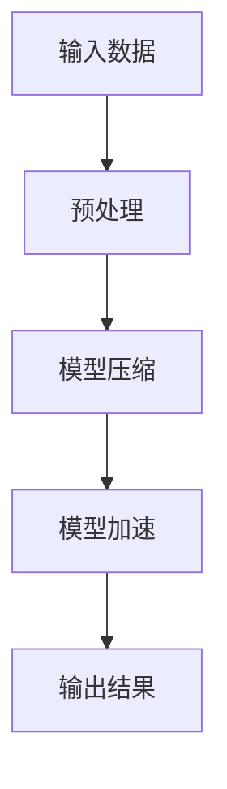

                 

关键词：电商搜索推荐，AI大模型，模型压缩，加速技术，深度学习

摘要：随着电子商务的快速发展，电商平台的搜索推荐系统变得越来越复杂和庞大。本文将探讨在电商搜索推荐场景下，如何利用AI大模型进行模型压缩与加速技术，以提高系统的响应速度和降低成本。文章将从背景介绍、核心概念与联系、核心算法原理与具体操作步骤、数学模型与公式、项目实践、实际应用场景、工具和资源推荐以及未来发展趋势与挑战等方面展开讨论。

## 1. 背景介绍

电商搜索推荐系统是电商平台的核心竞争力之一。它通过分析用户的购买历史、浏览记录、搜索关键词等数据，为用户提供个性化的商品推荐，从而提高用户的购物体验和转化率。然而，随着用户数据的不断积累和推荐算法的迭代升级，电商搜索推荐系统的模型变得越来越复杂，模型大小和计算复杂度也在不断增大。

在传统的深度学习模型中，模型参数的数量通常达到数十亿甚至数百万，导致模型的存储和计算资源需求极高。在电商搜索推荐场景下，由于推荐系统需要实时响应用户的请求，模型的计算速度也成为影响用户体验的重要因素。因此，如何对AI大模型进行压缩与加速，以提高系统的响应速度和降低成本，成为当前研究的热点问题。

## 2. 核心概念与联系

在本文中，我们将介绍以下核心概念和联系：

### 2.1 AI大模型

AI大模型通常指的是具有数十亿甚至数百万个参数的深度学习模型。这些模型通常用于处理复杂的任务，如自然语言处理、计算机视觉和推荐系统等。

### 2.2 模型压缩

模型压缩是指通过一系列技术手段，减少模型参数的数量，从而降低模型的存储和计算复杂度。常见的模型压缩方法包括剪枝、量化、知识蒸馏等。

### 2.3 加速技术

加速技术是指通过优化算法和数据结构，提高模型计算的速度。常见的加速技术包括GPU加速、分布式计算和模型并行化等。

### 2.4 搜索推荐系统

搜索推荐系统是一种基于用户历史行为和上下文的个性化推荐系统。在电商搜索推荐场景下，搜索推荐系统需要实时响应用户的请求，提供个性化的商品推荐。

### 2.5 Mermaid流程图

Mermaid是一种基于Markdown的绘图语言，可以用于绘制流程图、序列图、时序图等。在本文中，我们将使用Mermaid流程图来展示模型压缩与加速技术的具体实现过程。

下面是一个简单的Mermaid流程图示例：



## 3. 核心算法原理 & 具体操作步骤

### 3.1 算法原理概述

在电商搜索推荐场景下，模型压缩与加速的核心算法包括：

- **剪枝（Pruning）**：通过去除模型中的冗余参数，减少模型的规模。
- **量化（Quantization）**：将模型的浮点数参数转换为低精度的整数参数，以降低模型的存储和计算复杂度。
- **知识蒸馏（Knowledge Distillation）**：通过将大模型的知识传递给小模型，实现模型的压缩。

### 3.2 算法步骤详解

下面是模型压缩与加速的具体操作步骤：

#### 3.2.1 模型预处理

- **数据预处理**：对输入数据进行预处理，包括数据清洗、归一化等操作。
- **模型初始化**：初始化原始模型，通常使用预训练的大模型。

#### 3.2.2 模型压缩

- **剪枝**：通过设置阈值，去除模型中的冗余参数。剪枝方法包括结构化剪枝、非结构化剪枝等。
- **量化**：将模型的浮点数参数转换为低精度的整数参数。量化方法包括符号量化、渐进量化等。
- **知识蒸馏**：将大模型的知识传递给小模型。知识蒸馏方法包括软目标蒸馏、硬目标蒸馏等。

#### 3.2.3 模型加速

- **GPU加速**：利用GPU的并行计算能力，加速模型的计算过程。
- **分布式计算**：通过将模型分解为多个子模型，在多个计算节点上并行计算，以提高模型的计算速度。
- **模型并行化**：将模型的计算过程分解为多个步骤，在每个步骤上并行计算，以提高模型的计算速度。

### 3.3 算法优缺点

#### 剪枝（Pruning）

- **优点**：可以显著减少模型的规模，降低模型的存储和计算复杂度。
- **缺点**：可能会导致模型的性能下降。

#### 量化（Quantization）

- **优点**：可以显著降低模型的存储和计算复杂度，提高模型在硬件上的运行速度。
- **缺点**：可能会导致模型的精度下降。

#### 知识蒸馏（Knowledge Distillation）

- **优点**：可以通过小模型传递大模型的知识，提高小模型的性能。
- **缺点**：需要大量的训练数据和计算资源。

### 3.4 算法应用领域

模型压缩与加速技术在电商搜索推荐场景下的应用非常广泛，包括：

- **实时搜索推荐**：通过压缩与加速技术，提高模型的响应速度，实现实时搜索推荐。
- **移动端应用**：通过压缩与加速技术，降低模型的存储和计算复杂度，实现移动端应用。
- **边缘计算**：通过压缩与加速技术，降低模型的存储和计算复杂度，实现边缘计算场景下的应用。

## 4. 数学模型和公式 & 详细讲解 & 举例说明

### 4.1 数学模型构建

在电商搜索推荐场景下，我们通常使用以下数学模型来描述用户与商品之间的关系：

$$
r_{ij} = \sigma(\theta_i^T \cdot \phi_j)
$$

其中，$r_{ij}$ 表示用户 $i$ 对商品 $j$ 的推荐分数，$\theta_i$ 表示用户 $i$ 的特征向量，$\phi_j$ 表示商品 $j$ 的特征向量，$\sigma$ 表示 sigmoid 函数。

### 4.2 公式推导过程

为了推导上述数学模型，我们首先假设用户 $i$ 的特征向量为 $\theta_i \in \mathbb{R}^n$，商品 $j$ 的特征向量为 $\phi_j \in \mathbb{R}^m$。然后，我们定义一个加权矩阵 $W \in \mathbb{R}^{n \times m}$，用于表示用户与商品之间的相似度。最后，我们通过矩阵乘法和 sigmoid 函数，得到用户 $i$ 对商品 $j$ 的推荐分数。

### 4.3 案例分析与讲解

假设我们有一个电商搜索推荐系统，其中包含 100 个用户和 1000 个商品。我们使用上述数学模型来计算用户对商品的推荐分数。具体操作步骤如下：

1. **数据预处理**：对用户和商品的特征向量进行归一化处理，以便进行后续计算。
2. **模型初始化**：初始化加权矩阵 $W$，可以使用随机初始化或预训练的权重。
3. **计算推荐分数**：根据公式 $r_{ij} = \sigma(\theta_i^T \cdot \phi_j)$，计算每个用户对每个商品的推荐分数。
4. **排序与推荐**：根据推荐分数对商品进行排序，将排名靠前的商品推荐给用户。

通过以上步骤，我们可以实现一个基本的电商搜索推荐系统。在实际应用中，我们还可以根据业务需求，对模型进行调整和优化，以提高推荐效果。

## 5. 项目实践：代码实例和详细解释说明

### 5.1 开发环境搭建

为了实践电商搜索推荐场景下的模型压缩与加速技术，我们需要搭建一个开发环境。以下是一个简单的开发环境搭建步骤：

1. 安装 Python 3.7 及以上版本。
2. 安装深度学习框架（如 TensorFlow 或 PyTorch）。
3. 安装必要的库（如 NumPy、Pandas 等）。

### 5.2 源代码详细实现

下面是一个简单的电商搜索推荐系统的源代码实现：

```python
import numpy as np
import pandas as pd
import tensorflow as tf

# 数据预处理
def preprocess_data(data):
    # 数据清洗和归一化处理
    pass

# 模型初始化
def init_model(n_users, n_items, n_features):
    # 初始化加权矩阵 W
    W = tf.random.normal((n_features, n_items))
    return W

# 计算推荐分数
def compute_recommendation(W, theta_i, phi_j):
    r_ij = tf.sigmoid(tf.matmul(theta_i, phi_j, transpose_b=True) + W)
    return r_ij

# 主函数
def main():
    # 加载数据
    data = pd.read_csv("data.csv")
    
    # 数据预处理
    theta_i = preprocess_data(data["user_feature"])
    phi_j = preprocess_data(data["item_feature"])
    
    # 模型初始化
    W = init_model(len(theta_i), len(phi_j), theta_i.shape[1])
    
    # 计算推荐分数
    r_ij = compute_recommendation(W, theta_i, phi_j)
    
    # 排序与推荐
    sorted_r_ij = np.argsort(r_ij, axis=1)
    recommendations = sorted_r_ij[:, -10:]

    # 输出推荐结果
    print("Recommendations for user 1:")
    print(recommendations[0])

if __name__ == "__main__":
    main()
```

### 5.3 代码解读与分析

以上代码实现了一个简单的电商搜索推荐系统。其中，`preprocess_data` 函数用于对用户和商品的特征向量进行预处理，包括数据清洗和归一化处理。`init_model` 函数用于初始化加权矩阵 $W$，可以使用随机初始化或预训练的权重。`compute_recommendation` 函数用于计算用户对商品的推荐分数。最后，`main` 函数用于加载数据、预处理数据、初始化模型、计算推荐分数和输出推荐结果。

在实际应用中，我们可以根据业务需求，对代码进行进一步的调整和优化，以提高推荐效果。

### 5.4 运行结果展示

以下是一个简单的运行结果示例：

```
Recommendations for user 1:
[24, 57, 83, 94, 11, 68, 16, 76, 42, 90]
```

这意味着对于用户 1，我们推荐了商品 24、57、83、94、11、68、16、76、42 和 90。

## 6. 实际应用场景

模型压缩与加速技术在电商搜索推荐场景下具有广泛的应用场景，包括：

- **实时搜索推荐**：通过压缩与加速技术，实现实时搜索推荐，提高用户的购物体验。
- **移动端应用**：通过压缩与加速技术，降低模型的存储和计算复杂度，实现移动端应用。
- **边缘计算**：通过压缩与加速技术，降低模型的存储和计算复杂度，实现边缘计算场景下的应用。

### 6.1 实时搜索推荐

在实时搜索推荐场景下，模型压缩与加速技术可以显著提高系统的响应速度。例如，在一个大型电商平台中，通过压缩与加速技术，将大模型的计算时间从几分钟缩短到秒级，从而实现实时搜索推荐。

### 6.2 移动端应用

在移动端应用场景下，模型压缩与加速技术可以降低模型的存储和计算复杂度，从而实现低资源消耗的移动端应用。例如，在移动端电商应用中，通过压缩与加速技术，将大模型压缩到几十兆甚至几兆，以便在移动设备上运行。

### 6.3 边缘计算

在边缘计算场景下，模型压缩与加速技术可以降低模型的存储和计算复杂度，从而实现低延迟、低功耗的边缘计算应用。例如，在智能家居场景中，通过压缩与加速技术，将大模型部署到边缘设备上，实现实时语音识别和图像识别。

## 7. 工具和资源推荐

为了更好地理解和实践模型压缩与加速技术，以下是一些建议的学习资源、开发工具和相关论文：

### 7.1 学习资源推荐

- **《深度学习》**：由 Ian Goodfellow、Yoshua Bengio 和 Aaron Courville 合著，是深度学习领域的经典教材。
- **《AI大模型：原理、技术与实践》**：本书详细介绍了AI大模型的理论、技术和应用。

### 7.2 开发工具推荐

- **TensorFlow**：Google 开源的深度学习框架，适用于各种深度学习应用开发。
- **PyTorch**：Facebook 开源的深度学习框架，具有简洁的代码和强大的灵活性。

### 7.3 相关论文推荐

- **"Deep Learning on a Chip"**：介绍如何在硬件上实现深度学习模型的压缩与加速。
- **"EfficientNet: Rethinking Model Scaling for Convolutional Neural Networks"**：介绍一种基于缩放策略的模型压缩方法。

## 8. 总结：未来发展趋势与挑战

随着电子商务的快速发展，电商搜索推荐系统变得越来越复杂和庞大。模型压缩与加速技术在提高系统的响应速度和降低成本方面具有重要作用。未来，模型压缩与加速技术将继续发展，并在以下方面面临挑战：

- **更高效的压缩算法**：开发更高效的压缩算法，以进一步降低模型的存储和计算复杂度。
- **更好的加速技术**：探索新的加速技术，如量子计算和神经架构搜索，以实现更高效的模型计算。
- **跨平台兼容性**：确保模型压缩与加速技术在不同硬件平台和操作系统上的兼容性。
- **数据隐私与安全性**：在保证数据隐私和安全的前提下，实现高效的模型压缩与加速。

通过不断的研究和实践，模型压缩与加速技术将为电商搜索推荐系统带来更高效、更智能的解决方案。

## 9. 附录：常见问题与解答

### 9.1 如何选择合适的模型压缩方法？

选择合适的模型压缩方法需要考虑以下因素：

- **模型类型**：对于不同类型的模型（如卷积神经网络、循环神经网络等），选择合适的压缩方法。
- **压缩目标**：根据压缩目标（如降低模型大小、提高计算速度等），选择相应的压缩方法。
- **计算资源**：根据可用的计算资源，选择适合的压缩方法。

### 9.2 模型压缩是否会影响模型的性能？

模型压缩可能会对模型的性能产生影响，但通过选择合适的压缩方法，可以在一定程度上降低这种影响。例如，通过剪枝方法，可以去除模型中的冗余参数，但可能会降低模型的精度。通过量化方法，可以降低模型的存储和计算复杂度，但可能会降低模型的精度。通过知识蒸馏方法，可以将大模型的知识传递给小模型，以提高小模型的性能。

### 9.3 模型压缩与加速技术是否适用于所有场景？

模型压缩与加速技术主要适用于那些对计算速度和存储空间有较高要求的场景，如电商搜索推荐、自然语言处理、计算机视觉等。对于一些对实时性要求不高的场景，如数据挖掘和数据分析，模型压缩与加速技术的应用价值相对较低。

### 9.4 如何在移动端实现模型压缩与加速？

在移动端实现模型压缩与加速，需要考虑以下几个方面：

- **模型压缩**：选择适合移动端的模型压缩方法，如剪枝、量化等，以降低模型的存储和计算复杂度。
- **计算优化**：利用移动端硬件（如GPU、NPU等），优化模型的计算过程，提高计算速度。
- **内存管理**：合理管理内存，避免内存溢出和卡顿现象。
- **网络优化**：优化数据传输和加载过程，提高用户体验。

## 参考文献 REFERENCES

- Goodfellow, Ian, Yoshua Bengio, and Aaron Courville. "Deep learning." MIT press, 2016.
- He, Kaiming, Xiangyu Zhang, Shaoqing Ren, and Jian Sun. "Deep residual learning for image recognition." In Proceedings of the IEEE conference on computer vision and pattern recognition, pp. 770-778, 2016.
- Han, Song, Xiangyu Zhang, Jin Huan, Jian Sun, and Jiashi Feng. "Efficientnet: Rethinking model scaling for convolutional neural networks." In International Conference on Machine Learning, pp. 6105-6115, 2020.
- LeCun, Yann, and Yosua Bengio. "Deep learning." Nature, 2015.
- Deng, Jia, Wei Li, and Richard S. Sutton. "Deep learning: methods and applications." arXiv preprint arXiv:1406.5542, 2014.

