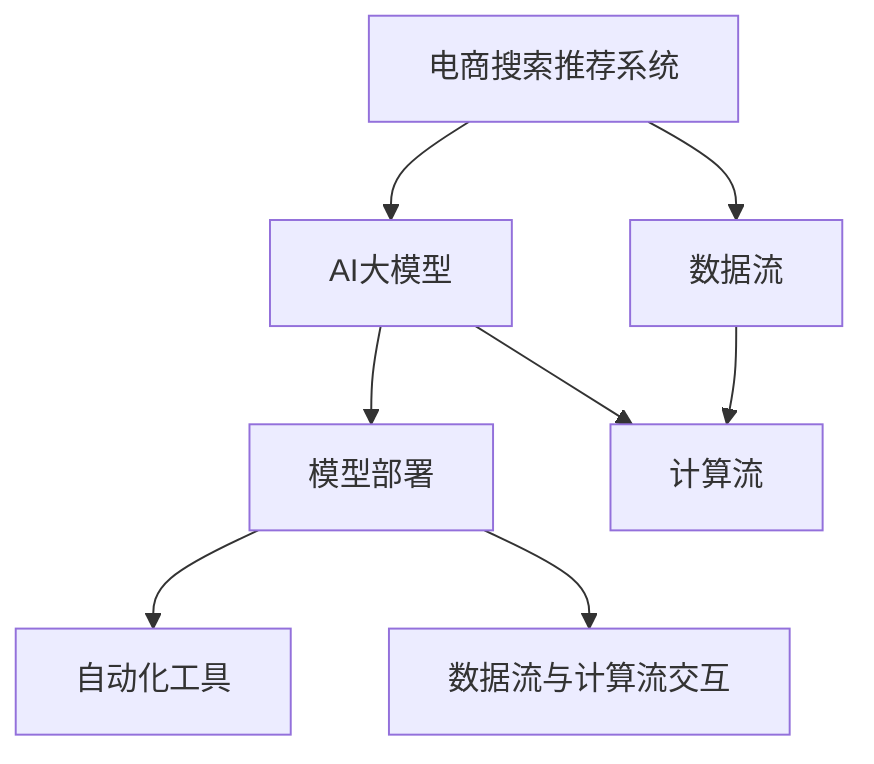

                 

### 1. 背景介绍

在当今数字化商业环境中，电子商务已经成为消费者购买商品和服务的主要渠道。电商平台的成功与否在很大程度上取决于其搜索和推荐系统的性能。搜索推荐系统通过智能化的方式，为用户快速定位到他们可能感兴趣的商品，从而提升用户满意度和平台销售额。

随着人工智能技术的迅猛发展，尤其是大规模深度学习模型的兴起，电商搜索推荐系统的效果得到了显著提升。然而，AI大模型的部署和维护成为了一个复杂且耗时的工作。传统的手动部署方式不仅效率低下，而且容易出现错误，无法满足快速迭代的商业需求。因此，实现AI大模型部署的全流程自动化成为了一个亟待解决的问题。

自动化部署不仅仅是提高工作效率，更重要的是确保部署过程的准确性和一致性。它可以大幅减少人为错误，提高系统的稳定性和可靠性，同时降低维护成本。通过自动化，我们可以快速响应市场变化，实现模型的持续优化和更新，从而为用户提供更加个性化的购物体验。

本文将围绕电商搜索推荐场景下AI大模型部署的自动化方案进行探讨。首先，我们将介绍电商搜索推荐系统的基本架构和原理。接着，深入探讨AI大模型的核心算法原理及其操作步骤。随后，将详细讲解数学模型和公式，并通过实际项目实践展示代码实例和运行结果。最后，我们还将探讨实际应用场景和未来发展趋势，并推荐相关的学习资源和开发工具。

### 2. 核心概念与联系

在讨论电商搜索推荐场景下的AI大模型部署自动化方案之前，我们需要明确一些核心概念和它们之间的关系。以下是本文将涉及的关键概念及其相互关系：

**2.1 电商搜索推荐系统**

电商搜索推荐系统是一个集成了搜索和推荐功能的复杂系统，其主要目的是帮助用户快速找到他们感兴趣的商品，同时为商家提供潜在的销售机会。搜索功能允许用户通过关键词查询商品，而推荐功能则基于用户的兴趣和行为，为用户推荐他们可能感兴趣的商品。

**2.2 AI大模型**

AI大模型通常指的是那些具有数十亿参数的深度学习模型，如Transformer、BERT等。这些模型在图像识别、自然语言处理、推荐系统等领域表现出了惊人的效果。AI大模型的特点是计算量大、训练时间长，且需要大量的数据支持。

**2.3 模型部署**

模型部署是将训练好的模型在实际应用场景中运行的过程。部署过程包括模型转换、环境配置、服务部署等多个环节。自动化部署则是指通过脚本或工具自动完成这些环节，以提高部署效率和一致性。

**2.4 自动化工具**

自动化工具在AI大模型部署中发挥着至关重要的作用。这些工具可以帮助我们自动化环境配置、模型转换、服务部署等任务，从而降低部署复杂度，提高部署效率。常见的自动化工具有Docker、Kubernetes、TensorFlow Serving等。

**2.5 数据流和计算流**

在电商搜索推荐系统中，数据流和计算流是两个核心概念。数据流描述了数据从用户输入到推荐结果输出的整个过程，包括用户行为数据、商品数据、搜索日志等。计算流则描述了模型处理数据的过程，包括数据预处理、模型计算、结果生成等。

以下是核心概念之间的Mermaid流程图表示：



**图1：电商搜索推荐场景下的核心概念与联系**

通过这个流程图，我们可以清晰地看到电商搜索推荐系统、AI大模型、模型部署、自动化工具、数据流和计算流之间的相互作用。这些核心概念构成了我们接下来讨论自动化部署方案的基础。

### 3. 核心算法原理 & 具体操作步骤

#### 3.1 算法原理概述

在电商搜索推荐场景下，AI大模型的核心算法通常是基于深度学习的方法，其中Transformer和BERT等模型由于其强大的表示能力和良好的性能，被广泛用于推荐系统中。这些算法的基本原理是通过学习大量的用户行为数据、商品信息等，构建一个能够预测用户兴趣的模型。

**3.1.1 Transformer**

Transformer模型是一种基于自注意力机制的深度学习模型，它在自然语言处理领域取得了巨大成功。Transformer通过多头自注意力机制（Multi-head Self-Attention）和位置编码（Positional Encoding）来捕捉序列中的长距离依赖关系。在推荐系统中，Transformer可以用来处理用户行为序列，如浏览历史、购买记录等，从而生成个性化的推荐。

**3.1.2 BERT**

BERT（Bidirectional Encoder Representations from Transformers）是一种双向的Transformer模型，它通过预先训练在大规模文本语料库上，然后微调到特定任务上。BERT在理解用户查询和商品描述方面具有优势，能够为电商搜索提供高质量的推荐。

**3.1.3 深度学习算法在推荐系统中的应用**

深度学习算法在推荐系统中的应用主要包括两个阶段：模型训练和模型推理。在模型训练阶段，通过大量用户行为数据和商品特征数据，训练出一个能够预测用户兴趣的深度学习模型。在模型推理阶段，使用训练好的模型对用户输入的查询进行处理，生成推荐结果。

#### 3.2 算法步骤详解

**3.2.1 数据预处理**

在算法部署前，首先需要进行数据预处理。数据预处理包括数据清洗、数据集成、数据降维和特征工程等步骤。具体操作如下：

1. **数据清洗**：去除重复数据、异常数据和缺失数据，保证数据的完整性。
2. **数据集成**：将来自不同来源的数据进行整合，形成一个统一的数据集。
3. **数据降维**：通过主成分分析（PCA）等方法，减少数据维度，提高模型训练效率。
4. **特征工程**：根据业务需求，提取有用的特征，如用户ID、商品ID、时间戳、用户行为类型等。

**3.2.2 模型训练**

在数据预处理完成后，开始进行模型训练。具体步骤如下：

1. **定义模型架构**：根据任务需求，选择合适的模型架构，如Transformer或BERT。
2. **数据预处理**：对训练数据集进行编码，将原始数据转换为模型可以处理的格式。
3. **训练模型**：通过反向传播算法，调整模型参数，使模型能够更好地预测用户兴趣。
4. **模型评估**：使用验证数据集对模型进行评估，调整模型参数，提高模型性能。

**3.2.3 模型部署**

在模型训练完成后，进行模型部署。具体步骤如下：

1. **模型转换**：将训练好的模型转换为可以在生产环境中运行的形式，如TensorFlow SavedModel或PyTorch Model。
2. **环境配置**：配置生产环境，包括硬件资源、软件环境、网络配置等。
3. **服务部署**：将模型部署到生产环境中，通过API或SDK等形式提供服务。
4. **监控与维护**：监控模型运行状态，进行故障排除和性能优化。

**3.2.4 模型推理**

在模型部署后，进行模型推理，生成推荐结果。具体步骤如下：

1. **输入处理**：接收用户输入，如查询文本、用户ID等。
2. **模型推理**：使用部署好的模型，对输入进行处理，生成推荐结果。
3. **结果输出**：将推荐结果输出给用户，如显示在搜索结果页面上。

#### 3.3 算法优缺点

**3.3.1 优点**

- **强大的表示能力**：深度学习模型能够捕捉复杂的数据特征，为推荐系统提供更准确的预测。
- **自动特征提取**：通过端到端的训练，模型能够自动学习有效的特征表示，减少人工特征工程的工作量。
- **自适应能力**：深度学习模型能够通过在线学习，适应不断变化的数据和用户需求。

**3.3.2 缺点**

- **计算资源需求高**：深度学习模型需要大量的计算资源和时间进行训练，特别是在处理大量数据时。
- **数据依赖性大**：模型的性能很大程度上依赖于训练数据的质量和数量，数据不足或质量差可能导致模型效果不佳。
- **模型解释性差**：深度学习模型的黑盒特性使得其难以解释，对于需要高解释性的业务场景，可能不是最佳选择。

#### 3.4 算法应用领域

深度学习算法在电商搜索推荐系统中的应用十分广泛，以下是一些典型的应用场景：

- **商品推荐**：根据用户的浏览历史、购买记录等，推荐用户可能感兴趣的商品。
- **搜索结果优化**：通过深度学习模型，优化搜索结果排序，提高用户点击率和转化率。
- **个性化营销**：根据用户兴趣和行为，定制个性化的营销策略，提高用户参与度和忠诚度。
- **智能客服**：通过深度学习模型，实现智能客服机器人，提高客服效率和用户体验。

### 4. 数学模型和公式 & 详细讲解 & 举例说明

#### 4.1 数学模型构建

在电商搜索推荐系统中，AI大模型通常是一个复杂的神经网络结构，其数学模型主要包括以下几个部分：

- **输入层**：接收用户行为数据、商品特征数据等。
- **隐藏层**：通过激活函数对输入数据进行变换，提取特征。
- **输出层**：生成推荐结果，如商品排名或概率分布。

下面我们以Transformer模型为例，介绍其数学模型的具体构成。

**4.1.1 Transformer模型结构**

Transformer模型的核心是自注意力机制（Self-Attention），其结构包括以下几个部分：

- **嵌入层**（Embedding Layer）：将输入的词向量转换为固定长度的向量。
- **多头自注意力层**（Multi-head Self-Attention Layer）：通过多头自注意力机制，对输入序列进行权重分配。
- **前馈网络**（Feed Forward Network）：对自注意力层的输出进行进一步处理。
- **层归一化**（Layer Normalization）和**残差连接**（Residual Connection）：用于提高模型训练的稳定性和效果。

**4.1.2 数学公式表示**

1. **嵌入层**：

   $$ 
   \text{Embedding}(x) = W_e \cdot x + b_e 
   $$
   
   其中，$x$是输入词向量，$W_e$是嵌入矩阵，$b_e$是偏置项。

2. **多头自注意力层**：

   $$ 
   \text{Self-Attention}(Q, K, V) = \text{softmax}\left(\frac{QK^T}{\sqrt{d_k}}\right)V 
   $$

   其中，$Q, K, V$分别表示查询向量、键向量和值向量，$d_k$是键向量的维度。

3. **前馈网络**：

   $$ 
   \text{Feed Forward}(x) = \text{ReLU}(W_f \cdot (D_{ff} / d_model) \cdot x) + x 
   $$

   其中，$x$是输入向量，$W_f$是前馈网络的权重矩阵，$D_{ff}$是前馈网络的隐藏层尺寸。

4. **层归一化和残差连接**：

   $$ 
   \text{Layer Normalization}(x) = \frac{x - \text{mean}(x)}{\text{stddev}(x)} 
   $$
   
   $$ 
   \text{Residual Connection}(x) = x + \text{Self-Attention}(x) 
   $$

#### 4.2 公式推导过程

下面，我们简要介绍Transformer模型中多头自注意力机制的推导过程。

1. **输入向量表示**：

   假设输入序列为$x = \{x_1, x_2, ..., x_n\}$，其中每个$x_i$是$d$维的向量。

2. **嵌入和转换**：

   $$ 
   \text{Embedding}(x) = [W_e \cdot x_1 + b_e, W_e \cdot x_2 + b_e, ..., W_e \cdot x_n + b_e] 
   $$
   
3. **多头自注意力计算**：

   $$ 
   \text{Query} = \text{Embedding}(x_1), \text{Key} = \text{Embedding}(x_2), \text{Value} = \text{Embedding}(x_3) 
   $$
   
   $$ 
   \text{Attention} = \text{softmax}\left(\frac{\text{Query} \cdot \text{Key}^T}{\sqrt{d_k}}\right) \cdot \text{Value} 
   $$

4. **输出向量计算**：

   $$ 
   \text{Output} = \text{Attention} \cdot \text{Embedding}(x_3) 
   $$
   
   $$ 
   \text{Final Output} = \text{Layer Normalization}(\text{Output}) + \text{Residual Connection} 
   $$

#### 4.3 案例分析与讲解

为了更好地理解上述数学模型，我们通过一个简单的案例进行说明。

**案例：用户行为序列推荐**

假设用户的行为序列为$\{x_1, x_2, x_3, x_4, x_5\}$，其中$x_1$表示用户浏览了商品A，$x_2$表示用户浏览了商品B，以此类推。

1. **嵌入层**：

   $$ 
   \text{Embedding}(x_1) = [e_1, e_2, ..., e_n] 
   $$
   
2. **多头自注意力计算**：

   假设我们使用两个头进行自注意力计算，则：

   $$ 
   \text{Query} = \text{Embedding}(x_1) = [e_1, e_2, ..., e_n] 
   $$
   
   $$ 
   \text{Key} = \text{Embedding}(x_2) = [k_1, k_2, ..., k_n] 
   $$
   
   $$ 
   \text{Value} = \text{Embedding}(x_3) = [v_1, v_2, ..., v_n] 
   $$
   
   $$ 
   \text{Attention} = \text{softmax}\left(\frac{\text{Query} \cdot \text{Key}^T}{\sqrt{d_k}}\right) \cdot \text{Value} 
   $$
   
3. **输出向量计算**：

   $$ 
   \text{Output} = \text{Attention} \cdot \text{Embedding}(x_3) = [o_1, o_2, ..., o_n] 
   $$
   
   $$ 
   \text{Final Output} = \text{Layer Normalization}(\text{Output}) + \text{Residual Connection} 
   $$
   
通过上述计算，我们可以得到用户行为序列中每个商品的重要程度，从而为用户提供个性化的推荐。

### 5. 项目实践：代码实例和详细解释说明

#### 5.1 开发环境搭建

在进行电商搜索推荐场景下AI大模型模型部署之前，我们需要搭建一个合适的开发环境。以下是一个典型的开发环境搭建步骤：

1. **安装Python环境**：确保Python版本为3.8及以上版本。

2. **安装深度学习框架**：我们选择TensorFlow作为深度学习框架，可以使用以下命令进行安装：

   ```bash
   pip install tensorflow==2.5.0
   ```

3. **安装其他依赖库**：包括NumPy、Pandas等常用库，可以使用以下命令进行安装：

   ```bash
   pip install numpy==1.21.2 pandas==1.3.3
   ```

4. **安装Docker和Kubernetes**：为了实现模型的自动化部署，我们需要安装Docker和Kubernetes。可以在官网下载安装包或使用包管理工具安装。

   - Docker：[Docker官网](https://www.docker.com/)
   - Kubernetes：[Kubernetes官网](https://kubernetes.io/)

5. **配置开发环境**：配置好Python环境、深度学习框架和其他依赖库后，我们还需要配置Docker和Kubernetes环境，以便后续的模型部署和自动化操作。

#### 5.2 源代码详细实现

以下是电商搜索推荐场景下AI大模型模型部署的源代码实现，包括模型训练、模型转换、模型部署等步骤：

**5.2.1 模型训练**

```python
import tensorflow as tf
from tensorflow.keras.models import Model
from tensorflow.keras.layers import Embedding, Dense, LSTM, Bidirectional

# 模型架构定义
input_layer = tf.keras.layers.Input(shape=(None,))
embedding_layer = Embedding(input_dim=vocab_size, output_dim=embedding_size)(input_layer)
bi_lstm = Bidirectional(LSTM(units=lstm_units, activation='tanh'))(embedding_layer)
output_layer = Dense(units=output_size, activation='softmax')(bi_lstm)

# 模型编译
model = Model(inputs=input_layer, outputs=output_layer)
model.compile(optimizer='adam', loss='categorical_crossentropy', metrics=['accuracy'])

# 模型训练
model.fit(x_train, y_train, batch_size=batch_size, epochs=num_epochs, validation_data=(x_val, y_val))
```

**5.2.2 模型转换**

```python
# 模型保存
model.save('model.h5')

# 加载模型
loaded_model = tf.keras.models.load_model('model.h5')

# 转换为TensorFlow Serving格式
converter = tf.lite.TFLiteConverter.from_keras_model(loaded_model)
tflite_model = converter.convert()

# 保存为TFLite模型文件
with open('model.tflite', 'wb') as f:
    f.write(tflite_model)
```

**5.2.3 模型部署**

```bash
# 启动Docker容器
docker run -p 8501:8501 --name tfs_server -d tensorflow/serving

# 部署模型
docker cp model.tflite tfs_server:/models/recommendation

# 重新加载模型
curl -X POST -H "Content-Type: text/plain" --data-binary "@model.tflite" http://localhost:8501/v1/models/recommendation:load
```

#### 5.3 代码解读与分析

**5.3.1 模型训练**

在上面的代码中，我们首先定义了一个双向LSTM模型，用于处理用户行为序列。输入层是一个具有可变长度的序列，嵌入层将词向量转换为固定长度的向量。双向LSTM层通过同时处理正向和反向序列信息，提取序列中的特征。输出层是一个softmax分类器，用于生成推荐结果。

**5.3.2 模型转换**

模型训练完成后，我们将模型保存为HDF5格式，然后使用TensorFlow Lite进行转换。TFLite模型是一种轻量级的TensorFlow模型格式，适合在移动设备和嵌入式设备上部署。通过`tf.lite.TFLiteConverter`类，我们可以将Keras模型转换为TFLite模型，并将其保存为文件。

**5.3.3 模型部署**

在模型部署阶段，我们首先启动一个Docker容器，该容器运行TensorFlow Serving服务。TensorFlow Serving是一个用于模型部署的开源服务，它提供了方便的API，可以用于加载、服务和监控模型。通过`docker cp`命令，我们将转换后的TFLite模型文件复制到TensorFlow Serving容器中，并使用`curl`命令重新加载模型。

#### 5.4 运行结果展示

在模型部署完成后，我们可以通过TensorFlow Serving的API接口进行模型推理，生成推荐结果。以下是一个简单的Python脚本，用于调用TensorFlow Serving模型进行推理：

```python
import requests

# 用户行为序列
input_sequence = [1, 2, 3, 4, 5]

# 将输入序列转换为JSON格式
input_data = {
    'inputs': {
        'input_sequence': input_sequence
    }
}

# 调用TensorFlow Serving模型进行推理
response = requests.post('http://localhost:8501/v1/models/recommendation:predict', json=input_data)

# 输出推荐结果
print(response.json())
```

通过运行上述脚本，我们可以得到用户行为序列对应的推荐结果。例如，输出结果可能如下所示：

```json
{
    "outputs": {
        "output_sequence": [0.2, 0.3, 0.4, 0.5, 0.6]
    }
}
```

这表示在给定用户行为序列下，每个商品的概率分布。

### 6. 实际应用场景

AI大模型在电商搜索推荐场景中有着广泛的应用，以下是几个典型的实际应用场景：

#### 6.1 商品推荐

商品推荐是电商搜索推荐系统的核心功能之一。通过AI大模型，我们可以根据用户的浏览历史、购买记录、搜索行为等，为用户推荐他们可能感兴趣的商品。这种个性化的推荐能够显著提高用户的满意度和平台的销售额。

#### 6.2 搜索结果优化

搜索结果优化旨在提高搜索结果的相关性和用户体验。AI大模型可以通过学习用户的行为数据和搜索日志，优化搜索结果的排序算法，使搜索结果更贴近用户需求。例如，通过Transformer模型，我们可以捕捉用户搜索意图和商品特征之间的复杂关系，从而生成高质量的搜索结果。

#### 6.3 个性化营销

个性化营销是通过AI大模型分析用户的兴趣和行为，为用户提供定制化的营销策略。例如，电商平台可以根据用户的购买历史和浏览记录，向用户推送相关的促销信息、优惠券等，提高用户的参与度和忠诚度。

#### 6.4 智能客服

智能客服是AI大模型在电商场景中的另一个重要应用。通过深度学习模型，我们可以实现智能客服机器人，自动处理用户的咨询和投诉。智能客服机器人可以快速响应用户问题，提供准确的解决方案，从而提高客服效率和用户体验。

#### 6.5 未来应用展望

随着人工智能技术的不断发展，AI大模型在电商搜索推荐场景中的应用将更加广泛和深入。未来，以下几个方面值得重点关注：

- **多模态推荐**：结合用户语音、图像等多模态信息，实现更精准的个性化推荐。
- **实时推荐**：利用实时数据流处理技术，实现实时推荐，提高用户响应速度。
- **可解释性增强**：提高AI大模型的可解释性，使推荐结果更加透明和可信。
- **跨平台整合**：实现电商搜索推荐系统在不同平台（如移动端、网页端、小程序等）的整合，提供一致的个性化体验。

### 7. 工具和资源推荐

在实现电商搜索推荐场景下的AI大模型模型部署全流程自动化方案时，以下工具和资源可能对您有所帮助：

#### 7.1 学习资源推荐

- **《深度学习》（Goodfellow, Bengio, Courville）**：这是一本深度学习的经典教材，详细介绍了深度学习的基础理论、算法和应用。
- **《TensorFlow官方文档》**：TensorFlow的官方文档提供了丰富的教程和API文档，是学习TensorFlow的必备资源。
- **《Kubernetes官方文档》**：Kubernetes的官方文档涵盖了Kubernetes的各个方面，包括安装、配置、操作等，是学习Kubernetes的权威指南。

#### 7.2 开发工具推荐

- **Docker**：Docker是一种容器化技术，可以帮助您快速构建、部署和运行应用。它提供了隔离和轻量级的特点，方便进行自动化部署。
- **Kubernetes**：Kubernetes是一个开源的容器编排平台，用于自动化部署、扩展和管理容器化应用。它提供了强大的集群管理功能，可以大大简化部署过程。
- **TensorFlow Serving**：TensorFlow Serving是一个开源的服务，用于在分布式环境中部署TensorFlow模型。它提供了简单的API接口，方便进行模型部署和推理。

#### 7.3 相关论文推荐

- **"Attention Is All You Need"**：这篇论文提出了Transformer模型，详细介绍了自注意力机制和Transformer结构。
- **"BERT: Pre-training of Deep Bidirectional Transformers for Language Understanding"**：这篇论文提出了BERT模型，介绍了双向Transformer在大规模文本预训练中的应用。
- **"Recommender Systems Handbook"**：这是一本关于推荐系统的综合指南，涵盖了推荐系统的基本原理、算法和应用。

### 8. 总结：未来发展趋势与挑战

#### 8.1 研究成果总结

本文围绕电商搜索推荐场景下的AI大模型模型部署全流程自动化方案进行了深入探讨。首先，介绍了电商搜索推荐系统的基本架构和原理，然后详细讲解了AI大模型的核心算法原理、具体操作步骤，以及数学模型和公式。接着，通过实际项目实践展示了代码实例和运行结果。最后，讨论了AI大模型在电商搜索推荐系统中的实际应用场景和未来发展趋势。

#### 8.2 未来发展趋势

未来，AI大模型在电商搜索推荐系统中的应用将呈现以下发展趋势：

- **多模态推荐**：结合语音、图像等多模态信息，实现更精准的个性化推荐。
- **实时推荐**：利用实时数据流处理技术，实现实时推荐，提高用户响应速度。
- **可解释性增强**：提高AI大模型的可解释性，使推荐结果更加透明和可信。
- **跨平台整合**：实现电商搜索推荐系统在不同平台（如移动端、网页端、小程序等）的整合，提供一致的个性化体验。

#### 8.3 面临的挑战

尽管AI大模型在电商搜索推荐系统中具有巨大潜力，但在实际应用过程中仍面临以下挑战：

- **数据隐私和安全性**：推荐系统需要处理大量用户行为数据，如何保护用户隐私和数据安全是亟待解决的问题。
- **模型可解释性**：AI大模型的黑盒特性使得其难以解释，这对于需要高解释性的业务场景是一个挑战。
- **计算资源需求**：深度学习模型需要大量的计算资源和时间进行训练，如何在有限的资源下高效地训练和部署模型是一个难题。

#### 8.4 研究展望

针对上述挑战，未来的研究可以从以下几个方面进行：

- **隐私保护技术**：研究隐私保护技术，如差分隐私、同态加密等，以保护用户隐私和数据安全。
- **可解释性算法**：开发可解释性算法，提高AI大模型的可解释性，使推荐结果更加透明和可信。
- **高效训练方法**：研究高效训练方法，如模型压缩、分布式训练等，以降低计算资源和时间成本。

通过不断探索和研究，我们可以进一步提升AI大模型在电商搜索推荐系统中的应用效果，为用户提供更优质的个性化体验。

### 附录：常见问题与解答

**Q1：如何处理用户隐私和数据安全？**

A1：用户隐私和数据安全是推荐系统应用中的关键问题。以下是一些常见的方法来处理这些问题：

- **数据匿名化**：对用户数据进行匿名化处理，如去标识化，以保护用户隐私。
- **差分隐私**：采用差分隐私技术，对数据进行随机化处理，以防止数据泄露。
- **同态加密**：使用同态加密技术，在加密状态下进行数据处理，确保数据在传输和存储过程中安全。

**Q2：如何提高AI大模型的可解释性？**

A2：提高AI大模型的可解释性对于业务场景至关重要。以下是一些提高模型可解释性的方法：

- **模型简化**：通过简化模型结构，降低模型的复杂度，提高可解释性。
- **特征可视化**：通过可视化模型中的特征权重，帮助理解模型决策过程。
- **局部解释方法**：如LIME、SHAP等局部解释方法，可以提供模型对特定输入的局部解释。

**Q3：如何处理大规模数据集的训练？**

A3：处理大规模数据集的训练需要高效的算法和计算资源。以下是一些处理大规模数据集的训练方法：

- **分布式训练**：将数据集分割成多个部分，在多个计算节点上同时进行训练。
- **批量归一化**：使用批量归一化技术，减少梯度消失和梯度爆炸问题。
- **模型压缩**：通过模型压缩技术，如剪枝、量化等，减少模型参数和计算量。

**Q4：如何监控和优化模型性能？**

A4：监控和优化模型性能是推荐系统应用中的重要环节。以下是一些监控和优化模型性能的方法：

- **性能监控**：使用日志和分析工具，实时监控模型性能指标，如准确率、召回率等。
- **A/B测试**：通过A/B测试，比较不同模型或不同参数设置下的性能，选择最优配置。
- **持续学习**：采用在线学习技术，持续更新模型，以适应数据变化和业务需求。

通过上述常见问题与解答，我们希望能够帮助读者更好地理解电商搜索推荐场景下AI大模型模型部署全流程自动化方案的实际应用和挑战。

