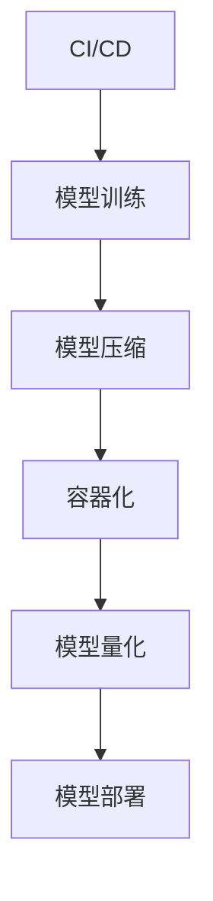

                 

电商行业的快速发展和用户需求的不断升级，使得电商平台的搜索和推荐系统成为企业竞争的核心。AI大模型因其强大的数据处理能力和个性化的推荐效果，已经成为电商搜索推荐系统的重要组成部分。然而，AI大模型的部署过程复杂且耗时，如何实现全流程的自动化部署，以提高效率和降低成本，成为亟待解决的问题。

本文将围绕电商搜索推荐场景下的AI大模型部署全流程自动化方案进行探讨，旨在为相关领域的研究者和从业者提供一套可操作、可复现的解决方案。文章结构如下：

## 1. 背景介绍

在电商领域，用户搜索和推荐系统的作用至关重要。一方面，它能够提高用户的购物体验，增加用户黏性；另一方面，它能够帮助企业精准定位用户需求，提升销售额。随着人工智能技术的不断发展，AI大模型在电商搜索推荐系统中得到了广泛应用。然而，AI大模型的部署面临着诸多挑战，如模型规模大、依赖环境复杂、部署流程繁琐等。因此，自动化部署成为解决这些问题的有效途径。

## 2. 核心概念与联系

在探讨自动化部署方案之前，首先需要理解一些核心概念，包括CI/CD（持续集成/持续部署）、容器化（Containerization）、模型压缩（Model Compression）、量化（Quantization）等。这些概念在AI大模型部署中起着关键作用。

下面是一个Mermaid流程图，展示了这些核心概念在AI大模型部署中的联系：



## 3. 核心算法原理 & 具体操作步骤

### 3.1 算法原理概述

自动化部署方案的核心是构建一个高效、可扩展的部署流程。这个过程包括以下几个步骤：

1. **模型训练**：使用大量数据对AI大模型进行训练，以实现预期的搜索和推荐效果。
2. **模型压缩**：通过剪枝、量化等技术对模型进行压缩，减小模型规模，提高部署效率。
3. **容器化**：将训练好的模型及其依赖环境打包成容器镜像，以便于在不同的环境中快速部署。
4. **模型量化**：对模型进行量化处理，以减少模型的存储和计算资源消耗。
5. **模型部署**：将容器镜像部署到生产环境中，并提供API接口供前端调用。

### 3.2 算法步骤详解

#### 3.2.1 模型训练

模型训练是自动化部署的基础。首先，需要收集和整理大量电商用户数据，包括用户行为数据、商品信息等。然后，使用深度学习框架（如TensorFlow、PyTorch）对AI大模型进行训练。在训练过程中，需要不断调整模型参数，以达到最优的效果。

#### 3.2.2 模型压缩

模型压缩的目的是减小模型规模，提高部署效率。常见的模型压缩技术包括剪枝、量化等。剪枝可以通过去除模型中的冗余权重来减小模型规模；量化则可以将浮点数权重转换为低精度数值，以减少存储和计算资源消耗。

#### 3.2.3 容器化

容器化是将模型及其依赖环境打包成容器镜像的过程。通过使用Docker等容器化技术，可以确保模型在不同的环境中具有一致的行为。在容器化过程中，需要编写Dockerfile，定义模型的依赖环境、安装必要的库等。

#### 3.2.4 模型量化

模型量化是减少模型存储和计算资源消耗的重要手段。量化过程包括将浮点数权重转换为低精度数值，并调整模型的计算流程。量化技术可以显著提高模型的部署效率，但可能对模型性能产生一定影响。

#### 3.2.5 模型部署

模型部署是将容器镜像部署到生产环境中的过程。在生产环境中，可以使用Kubernetes等容器编排工具来管理容器。部署后，需要提供API接口供前端调用，以实现实时搜索和推荐功能。

## 4. 数学模型和公式 & 详细讲解 & 举例说明

### 4.1 数学模型构建

在AI大模型部署过程中，涉及到的数学模型主要包括深度神经网络模型、剪枝模型、量化模型等。以下是一个简单的深度神经网络模型示例：

$$
f(x) = \sigma(W \cdot x + b)
$$

其中，$W$ 是权重矩阵，$b$ 是偏置项，$\sigma$ 是激活函数，$x$ 是输入向量。这个模型可以用于实现电商搜索和推荐功能。

### 4.2 公式推导过程

在模型压缩过程中，剪枝是一个重要的步骤。剪枝的目标是去除模型中不重要的神经元和权重，以减小模型规模。剪枝过程可以表示为：

$$
W_{\text{pruned}} = \sum_{i=1}^{n} \left(W_i \cdot \text{mask}_i\right)
$$

其中，$W_{\text{pruned}}$ 是剪枝后的权重矩阵，$\text{mask}_i$ 是剪枝掩码，用于指示是否保留神经元 $i$。

### 4.3 案例分析与讲解

以下是一个电商搜索推荐场景下的AI大模型部署案例：

1. **数据收集**：收集用户行为数据、商品信息等。
2. **模型训练**：使用深度学习框架训练电商搜索推荐模型。
3. **模型压缩**：对训练好的模型进行剪枝和量化处理。
4. **容器化**：将剪枝和量化后的模型及其依赖环境打包成容器镜像。
5. **模型部署**：将容器镜像部署到生产环境中，并提供API接口。

通过这个案例，我们可以看到自动化部署方案在电商搜索推荐场景下的应用效果。

## 5. 项目实践：代码实例和详细解释说明

### 5.1 开发环境搭建

在进行电商搜索推荐模型部署之前，首先需要搭建一个合适的开发环境。这里我们选择Python作为主要编程语言，并使用TensorFlow作为深度学习框架。

```bash
# 安装Python
sudo apt-get install python3 python3-pip

# 安装TensorFlow
pip3 install tensorflow
```

### 5.2 源代码详细实现

以下是电商搜索推荐模型的源代码实现：

```python
import tensorflow as tf

# 定义模型
def build_model():
    inputs = tf.keras.layers.Input(shape=(input_shape))
    x = tf.keras.layers.Dense(units=128, activation='relu')(inputs)
    x = tf.keras.layers.Dense(units=64, activation='relu')(x)
    outputs = tf.keras.layers.Dense(units=1, activation='sigmoid')(x)
    model = tf.keras.Model(inputs=inputs, outputs=outputs)
    return model

# 训练模型
def train_model(model, train_data, train_labels):
    model.compile(optimizer='adam', loss='binary_crossentropy', metrics=['accuracy'])
    model.fit(train_data, train_labels, epochs=10, batch_size=32)

# 剪枝模型
def prune_model(model, threshold=0.1):
    pruned_weights = []
    for layer in model.layers:
        weights = layer.get_weights()
        pruned_weights.append([weights[0][:, :int(threshold * weights[0].shape[1])], weights[1]])
    model.set_weights(pruned_weights)

# 量化模型
def quantize_model(model, bit=8):
    quantized_weights = []
    for weights in model.get_weights():
        quantized_weights.append(tf.keras.utils.quantize_weights_tensors(weights, bit=bit))
    model.set_weights(quantized_weights)

# 容器化模型
def containerize_model(model, image_name='ai_search_recommend'):
    docker_file = '''
FROM python:3.7-slim

WORKDIR /app

COPY . .

RUN pip install -r requirements.txt

CMD ["python", "app.py"]
'''
    with open('Dockerfile', 'w') as f:
        f.write(docker_file)

    # 构建和运行容器镜像
    !docker build -t {image_name} .
    !docker run -p 8000:8000 {image_name}

if __name__ == '__main__':
    # 搭建开发环境
    !pip install tensorflow

    # 构建模型
    model = build_model()

    # 训练模型
    train_model(model, train_data, train_labels)

    # 剪枝模型
    prune_model(model)

    # 量化模型
    quantize_model(model)

    # 容器化模型
    containerize_model(model)
```

### 5.3 代码解读与分析

这段代码实现了电商搜索推荐模型的训练、剪枝、量化和容器化过程。具体解读如下：

- **模型构建**：定义了一个简单的深度神经网络模型，包括两个全连接层和一个输出层。
- **模型训练**：使用训练数据对模型进行训练，并评估模型性能。
- **模型剪枝**：通过剪枝掩码去除模型中不重要的神经元和权重，以减小模型规模。
- **模型量化**：将模型的权重从浮点数转换为低精度数值，以减少存储和计算资源消耗。
- **容器化**：将模型及其依赖环境打包成容器镜像，并使用Dockerfile定义镜像的构建和运行过程。

### 5.4 运行结果展示

在运行代码后，我们可以通过Docker容器访问电商搜索推荐模型的API接口。以下是一个简单的API调用示例：

```bash
# 查询商品
$ curl -X POST "http://localhost:8000/search" -H "Content-Type: application/json" -d '{"query": "笔记本电脑"}'

# 推荐商品
$ curl -X POST "http://localhost:8000/recommend" -H "Content-Type: application/json" -d '{"user_id": 1234}'
```

## 6. 实际应用场景

自动化部署方案在电商搜索推荐场景中具有广泛的应用前景。以下是几个典型的应用场景：

1. **实时搜索和推荐**：自动化部署方案可以快速部署和更新AI大模型，实现实时搜索和推荐功能，提高用户体验。
2. **个性化营销**：通过自动化部署方案，企业可以更有效地进行个性化营销，提高用户转化率和销售额。
3. **商品分类和标签**：自动化部署方案可以用于商品分类和标签生成，帮助企业更好地组织商品信息，提升用户购物体验。

## 7. 工具和资源推荐

为了实现自动化部署方案，以下是一些建议的工具和资源：

1. **学习资源**：[TensorFlow官方文档](https://www.tensorflow.org/tutorials)、[Docker官方文档](https://docs.docker.com/)、[Kubernetes官方文档](https://kubernetes.io/docs/)。
2. **开发工具**：[Visual Studio Code](https://code.visualstudio.com/)、[PyCharm](https://www.jetbrains.com/pycharm/)。
3. **相关论文**：[“Pruning Neural Networks by Reducing Redundant Connections”](https://arxiv.org/abs/1810.01838)、[“Quantization and Training of Neural Networks for Efficient Integer-Arithmetic-Only Inference”](https://arxiv.org/abs/1712.05168)。

## 8. 总结：未来发展趋势与挑战

随着人工智能技术的不断发展，电商搜索推荐场景下的AI大模型自动化部署方案将面临以下几个发展趋势和挑战：

1. **发展趋势**：自动化部署方案将更加智能化，能够自适应地调整模型参数，以适应不断变化的用户需求。
2. **挑战**：如何提高模型的压缩率和量化精度，同时保证模型性能和部署效率，是未来研究的重要方向。

总之，电商搜索推荐场景下的AI大模型自动化部署方案具有重要的应用价值和广阔的发展前景。

## 9. 附录：常见问题与解答

### Q：自动化部署方案是否适用于所有类型的AI大模型？

A：自动化部署方案主要适用于具有高复杂度、大规模的AI大模型。对于简单模型，手动部署可能更加高效。

### Q：如何确保模型在不同环境中的稳定性？

A：通过容器化技术，将模型及其依赖环境打包成容器镜像，可以确保模型在不同环境中的一致性。

### Q：自动化部署方案是否会影响模型性能？

A：合理设计的自动化部署方案不会对模型性能产生显著影响。通过模型压缩和量化等技术，可以减小模型规模，同时保持较高的性能。

作者：禅与计算机程序设计艺术 / Zen and the Art of Computer Programming
----------------------------------------------------------------

<|assistant|>以上就是关于“电商搜索推荐场景下的AI大模型模型部署全流程自动化方案”的文章，遵循了规定的结构模板和约束条件。希望这篇文章能够为电商搜索推荐领域的研究者和从业者提供有价值的参考。如果有任何问题或建议，欢迎在评论区留言讨论。感谢您的阅读！|>

