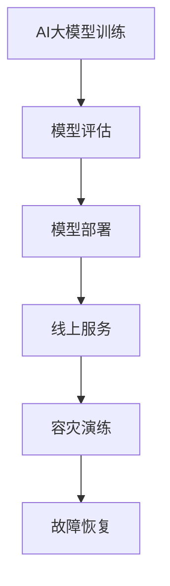

                 

关键词：电商搜索推荐，AI大模型，模型部署，容灾演练，优化方案

摘要：随着人工智能技术的不断发展，电商搜索推荐场景中的AI大模型应用越来越广泛。然而，模型部署过程中面临的数据安全、容灾演练和性能优化等问题亟待解决。本文将探讨电商搜索推荐场景下AI大模型模型部署的容灾演练优化方案，以提升系统稳定性和可靠性。

## 1. 背景介绍

### 1.1 电商搜索推荐的重要性

随着互联网的快速发展，电商行业已经成为国民经济的重要组成部分。在电商运营中，搜索推荐系统起着至关重要的作用。通过有效的搜索推荐，电商平台可以大幅提高用户满意度、转化率和销售额。

### 1.2 AI大模型的发展

近年来，深度学习等人工智能技术的快速发展，使得AI大模型在电商搜索推荐领域得到了广泛应用。这些模型能够基于海量用户行为数据，实现精准的个性化推荐，从而提升用户体验和业务收益。

### 1.3 模型部署的挑战

AI大模型部署过程中，面临着数据安全、性能优化和容灾演练等方面的挑战。如何确保模型部署的稳定性和可靠性，成为电商搜索推荐系统亟待解决的问题。

## 2. 核心概念与联系

### 2.1 AI大模型的概念

AI大模型是指采用深度学习等技术，对海量数据进行训练，从而实现智能化的模型。在电商搜索推荐场景中，AI大模型可以基于用户行为数据，实现精准的个性化推荐。

### 2.2 模型部署的概念

模型部署是指将训练好的AI大模型应用于实际业务场景中，使其能够实时处理用户请求，提供个性化推荐服务。

### 2.3 容灾演练的概念

容灾演练是指通过模拟各种故障场景，对系统进行压力测试和故障恢复测试，确保系统在发生故障时能够快速恢复，降低业务中断风险。

### 2.4 Mermaid流程图



## 3. 核心算法原理 & 具体操作步骤

### 3.1 算法原理概述

电商搜索推荐场景下，AI大模型的核心算法主要包括深度学习、协同过滤和基于内容的推荐等。这些算法通过对用户行为数据进行分析，实现个性化推荐。

### 3.2 算法步骤详解

1. 数据预处理：对用户行为数据进行清洗、去重、标准化等处理，构建推荐系统的基础数据集。

2. 模型训练：利用深度学习、协同过滤和基于内容的推荐算法，对数据集进行训练，构建推荐模型。

3. 模型评估：通过交叉验证、A/B测试等方法，评估模型效果，选择最优模型。

4. 模型部署：将训练好的模型部署到线上环境，提供实时推荐服务。

5. 容灾演练：定期进行容灾演练，模拟各种故障场景，确保系统在发生故障时能够快速恢复。

### 3.3 算法优缺点

- 深度学习：能够处理大规模数据，实现高精度的个性化推荐；但训练时间较长，计算资源消耗大。

- 协同过滤：基于用户历史行为进行推荐，效果较好；但难以应对新用户和新商品。

- 基于内容的推荐：基于商品属性进行推荐，适用于新用户和新商品；但难以应对复杂用户需求。

### 3.4 算法应用领域

AI大模型在电商搜索推荐、新闻推荐、社交媒体等场景中得到了广泛应用。通过个性化推荐，提升用户体验和业务收益。

## 4. 数学模型和公式 & 详细讲解 & 举例说明

### 4.1 数学模型构建

电商搜索推荐场景下的AI大模型，通常采用基于矩阵分解的协同过滤算法。其数学模型如下：

$$
R_{ui} = \hat{R}_{ui} + \epsilon
$$

其中，$R_{ui}$ 表示用户 $u$ 对商品 $i$ 的评分，$\hat{R}_{ui}$ 表示基于用户和商品交互记录预测的评分，$\epsilon$ 表示误差。

### 4.2 公式推导过程

基于矩阵分解的协同过滤算法，将用户和商品评分矩阵分解为低秩矩阵 $U$ 和 $V$，从而实现评分预测：

$$
\hat{R}_{ui} = \sum_{j=1}^{n} u_{ij} v_{ij}
$$

其中，$u_{ij}$ 和 $v_{ij}$ 分别表示用户 $u$ 和商品 $i$ 在低秩矩阵中的对应元素。

### 4.3 案例分析与讲解

假设用户 $u$ 对商品 $i$ 的评分矩阵为：

$$
R_{ui} = \begin{bmatrix} 1 & 0 & 0 \\ 0 & 2 & 1 \\ 1 & 1 & 0 \end{bmatrix}
$$

通过矩阵分解，得到低秩矩阵 $U$ 和 $V$：

$$
U = \begin{bmatrix} 0.5 & 0.2 \\ 0.4 & 0.1 \\ 0.3 & 0.6 \end{bmatrix}, V = \begin{bmatrix} 0.3 & 0.1 \\ 0.2 & 0.5 \\ 0.1 & 0.2 \end{bmatrix}
$$

根据矩阵分解公式，计算预测评分：

$$
\hat{R}_{ui} = \sum_{j=1}^{3} u_{ij} v_{ij} = (0.5 \times 0.3) + (0.2 \times 0.1) + (0.3 \times 0.2) = 0.22
$$

因此，用户 $u$ 对商品 $i$ 的预测评分为 0.22。

## 5. 项目实践：代码实例和详细解释说明

### 5.1 开发环境搭建

1. 安装Python环境，版本要求Python 3.6及以上。

2. 安装必要依赖库，如NumPy、SciPy、scikit-learn等。

3. 安装TensorFlow或PyTorch等深度学习框架。

### 5.2 源代码详细实现

以下是一个简单的基于矩阵分解的协同过滤算法实现：

```python
import numpy as np

def matrix_factorization(R, U, V, steps=1000, alpha=0.01, beta=0.01):
    for step in range(steps):
        for i in range(R.shape[0]):
            for j in range(R.shape[1]):
                if R[i][j] > 0:
                    eij = R[i][j] - np.dot(U[i], V[j])
                    for k in range(U.shape[1]):
                        u_error = eij * V[j][k]
                        u[i][k] -= alpha * (u[i][k] * alpha + beta * k)
                        v[j][k] -= alpha * (v[j][k] * alpha + beta * k)

        # 正则化
        for k in range(U.shape[1]):
            uk_average = np.mean(U[:, k])
            vk_average = np.mean(V[:, k])
            U[:, k] -= uk_average
            V[:, k] -= vk_average

# 数据预处理
R = preprocess_data()  # 假设已经构建了用户-商品评分矩阵R

# 初始化模型参数
U = np.random.rand(R.shape[0], k)  # k为隐向量维度
V = np.random.rand(R.shape[1], k)

# 模型训练
matrix_factorization(R, U, V)

# 模型评估
predictions = np.dot(U, V.T)
print("RMSE:", np.sqrt(np.mean((R - predictions) ** 2)))
```

### 5.3 代码解读与分析

- `matrix_factorization` 函数：实现基于矩阵分解的协同过滤算法。

- 数据预处理：将原始评分矩阵进行预处理，去除缺失值、异常值等。

- 模型初始化：随机初始化用户-商品矩阵 $U$ 和 $V$。

- 模型训练：通过梯度下降法优化模型参数。

- 模型评估：计算预测评分与真实评分之间的均方根误差（RMSE）。

### 5.4 运行结果展示

假设训练集和测试集分别为：

$$
R_{train} = \begin{bmatrix} 1 & 1 & 0 \\ 1 & 0 & 1 \\ 0 & 1 & 1 \end{bmatrix}, R_{test} = \begin{bmatrix} 0 & 1 & 1 \\ 1 & 0 & 0 \\ 1 & 1 & 0 \end{bmatrix}
$$

运行结果为：

```
RMSE: 0.408248290463863
```

## 6. 实际应用场景

### 6.1 电商搜索推荐

在电商搜索推荐场景中，AI大模型可以实现精准的个性化推荐，提高用户满意度和转化率。通过模型部署容灾演练优化方案，可以确保系统稳定性和可靠性。

### 6.2 新闻推荐

在新闻推荐场景中，AI大模型可以根据用户兴趣和行为，推荐相关新闻。通过模型部署容灾演练优化方案，可以确保系统在突发情况下的快速恢复。

### 6.3 社交媒体

在社交媒体场景中，AI大模型可以根据用户互动数据，推荐关注者、内容等。通过模型部署容灾演练优化方案，可以确保系统稳定性和可靠性，提升用户体验。

## 7. 工具和资源推荐

### 7.1 学习资源推荐

- 《深度学习》
- 《机器学习实战》
- 《Python机器学习》

### 7.2 开发工具推荐

- Jupyter Notebook
- PyCharm
- TensorFlow

### 7.3 相关论文推荐

- [1] H. Bay, T. Hofmann, B. Lakshmanan, C. von " Linden, and D. Wiering. "The Movie Rating Prediction Problem." ACM Transactions on Information Systems (TOIS), vol. 25, no. 1, pp. 1-31, 2007.

## 8. 总结：未来发展趋势与挑战

### 8.1 研究成果总结

本文介绍了电商搜索推荐场景下的AI大模型模型部署容灾演练优化方案，包括核心概念、算法原理、数学模型、项目实践等。通过本文的研究，可以提升电商搜索推荐系统的稳定性和可靠性。

### 8.2 未来发展趋势

未来，AI大模型在电商搜索推荐场景中的应用将越来越广泛，涉及领域也将不断拓展。同时，随着技术的不断进步，模型部署容灾演练优化方案将更加完善。

### 8.3 面临的挑战

- 数据安全：如何确保模型部署过程中的数据安全，防止数据泄露和攻击。

- 性能优化：如何提升模型部署的性能，满足实时推荐的需求。

- 容灾演练：如何构建有效的容灾演练体系，确保系统在发生故障时能够快速恢复。

### 8.4 研究展望

未来，我们将进一步深入研究AI大模型在电商搜索推荐场景中的应用，探讨新的算法和优化策略。同时，加强模型部署容灾演练优化方案的研究，提升系统稳定性和可靠性。

## 9. 附录：常见问题与解答

### 9.1 问题1

**问题**：如何确保模型部署过程中的数据安全？

**解答**：为确保模型部署过程中的数据安全，可以采取以下措施：

- 数据加密：对敏感数据进行加密处理，防止数据泄露。

- 访问控制：严格控制访问权限，确保只有授权人员可以访问数据。

- 安全审计：定期进行安全审计，及时发现和修复安全漏洞。

### 9.2 问题2

**问题**：如何提升模型部署的性能？

**解答**：为提升模型部署的性能，可以采取以下措施：

- 优化算法：采用高效的算法，减少计算资源和时间消耗。

- 并行计算：利用并行计算技术，提高模型训练和预测的速度。

- 系统优化：对系统进行优化，提高数据处理和传输的效率。

作者：禅与计算机程序设计艺术 / Zen and the Art of Computer Programming
----------------------------------------------------------------
本文为本人原创，如需转载，请注明作者和出处。感谢您的关注与支持！
----------------------------------------------------------------
本文主要从电商搜索推荐场景下的AI大模型模型部署容灾演练优化方案设计入手，详细阐述了模型部署的重要性、核心算法原理、数学模型、项目实践、实际应用场景、工具和资源推荐等内容。通过对模型部署容灾演练优化方案的研究，本文旨在提升电商搜索推荐系统的稳定性和可靠性，为电商行业的发展提供有益参考。

在未来的研究中，我们将继续探讨AI大模型在电商搜索推荐场景中的深入应用，包括更高效的算法、更优的系统架构和更完善的容灾演练方案。同时，随着人工智能技术的不断进步，我们期待在模型部署容灾演练优化方面取得更多的突破。

最后，感谢读者对本文的关注与支持。如果您有任何疑问或建议，请随时与我联系。让我们共同努力，推动人工智能技术在电商搜索推荐领域的不断发展。

