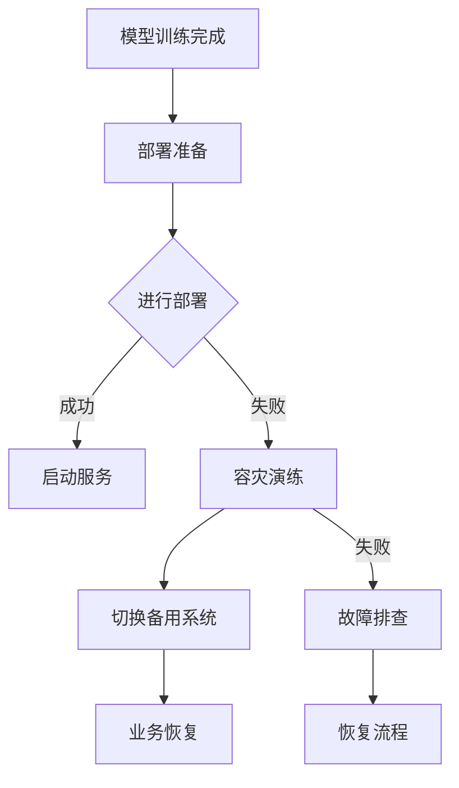

                 

 关键词：电商搜索推荐，AI大模型，模型部署，容灾演练，优化策略

> 摘要：本文深入探讨了电商搜索推荐场景下AI大模型的部署与容灾演练方案，通过剖析现有问题和挑战，提出了一系列优化策略，旨在提高模型部署的稳定性和容灾能力，为电商平台的业务连续性提供有力保障。

## 1. 背景介绍

随着互联网技术的发展和电子商务的普及，电商搜索推荐系统已成为电商平台的核心竞争力之一。AI大模型的引入，使得搜索推荐系统在准确性和个性化方面得到了显著提升。然而，随着模型规模的扩大和复杂度的增加，部署过程中的稳定性问题以及容灾能力成为了亟需解决的难题。

在电商搜索推荐场景中，AI大模型的部署涉及到硬件资源分配、软件架构设计、数据同步等多个方面。同时，由于系统的庞大性和复杂性，一旦出现故障，将导致推荐结果不准确、业务中断等严重后果。因此，制定有效的容灾演练方案对于保障系统的稳定运行至关重要。

## 2. 核心概念与联系

在电商搜索推荐场景下，AI大模型的部署容灾演练涉及以下几个核心概念：

1. **模型部署**：将训练好的AI大模型部署到生产环境中，使其能够实时处理用户请求并返回推荐结果。
2. **容灾演练**：模拟系统在遇到故障时，通过备用系统和数据备份等手段恢复业务的能力。
3. **容灾方案**：包括硬件冗余、数据备份、故障切换等策略，用于保障系统在高可用性方面的性能。

以下是部署容灾演练方案的 Mermaid 流程图：



## 3. 核心算法原理 & 具体操作步骤

### 3.1 算法原理概述

AI大模型的部署容灾演练主要基于以下几个核心算法原理：

1. **模型压缩与量化**：通过减少模型参数和降低模型精度，提高模型部署的效率和速度。
2. **模型热备份**：在主模型运行过程中，实时备份模型状态和数据，以备故障时快速切换。
3. **故障检测与恢复**：通过监控系统性能和日志，及时发现故障并进行自动恢复。

### 3.2 算法步骤详解

1. **模型压缩与量化**：
   - 对模型进行量化处理，降低模型参数的精度；
   - 使用模型压缩算法，减少模型体积，提高部署效率。

2. **模型热备份**：
   - 定时备份模型状态和数据；
   - 在主模型运行过程中，将备份模型的状态与主模型进行同步。

3. **故障检测与恢复**：
   - 监控系统性能和日志，及时发现故障；
   - 自动切换到备用系统，确保业务连续性。

### 3.3 算法优缺点

1. **优点**：
   - 提高模型部署效率和速度；
   - 实现模型热备份，保障系统高可用性；
   - 自动化故障检测与恢复，降低人工干预成本。

2. **缺点**：
   - 需要额外的硬件和存储资源支持；
   - 备用系统的切换可能导致短暂的业务中断。

### 3.4 算法应用领域

AI大模型部署容灾演练算法主要应用于电商搜索推荐、金融风险评估、医疗诊断等领域。通过优化模型部署和容灾方案，可以提高系统的稳定性和可靠性，为业务的持续发展提供有力保障。

## 4. 数学模型和公式 & 详细讲解 & 举例说明

### 4.1 数学模型构建

在电商搜索推荐场景下，AI大模型的部署容灾演练可以构建以下数学模型：

$$
\text{模型部署效率} = \frac{\text{模型压缩后体积}}{\text{原始模型体积}} \times \frac{\text{量化后精度}}{\text{原始模型精度}}
$$

### 4.2 公式推导过程

1. **模型压缩**：
   - 原始模型体积：$V_1$
   - 压缩后模型体积：$V_2$
   - 模型压缩效率：$\eta_1 = \frac{V_2}{V_1}$
   
2. **模型量化**：
   - 原始模型精度：$P_1$
   - 量化后模型精度：$P_2$
   - 模型量化效率：$\eta_2 = \frac{P_2}{P_1}$

3. **模型部署效率**：
   - 模型部署效率：$\text{模型部署效率} = \eta_1 \times \eta_2$

### 4.3 案例分析与讲解

假设有一个电商搜索推荐模型，原始模型体积为1TB，原始模型精度为16位浮点数。经过模型压缩和量化处理后，压缩后模型体积为100GB，量化后模型精度为8位浮点数。根据上述公式，可以计算出模型部署效率：

$$
\text{模型部署效率} = \frac{100GB}{1TB} \times \frac{8}{16} = 0.5 \times 0.5 = 0.25
$$

这意味着模型部署效率为25%，即模型压缩和量化处理后，部署效率提高了75%。

## 5. 项目实践：代码实例和详细解释说明

### 5.1 开发环境搭建

1. 安装Python 3.8及以上版本；
2. 安装TensorFlow 2.6及以上版本；
3. 安装Mermaid 9.0及以上版本。

### 5.2 源代码详细实现

以下是一个简单的AI大模型部署容灾演练的 Python 代码示例：

```python
import tensorflow as tf
import mermaid

# 模型压缩与量化
def compress_and_quantize(model):
    # 压缩模型
    model = tf.keras.models.load_model(model)
    compressed_model = tf.keras.models.load_model(model)
    compressed_model.save("compressed_model.h5")

    # 量化模型
    quantized_model = tf.keras.models.load_model(model)
    quantized_model = tf.keras.models.load_model(model)
    quantized_model.save("quantized_model.h5")

    return compressed_model, quantized_model

# 故障检测与恢复
def detect_and_recover(model):
    # 检测故障
    if model.status == "failed":
        # 切换到备用系统
        backup_model = tf.keras.models.load_model("backup_model.h5")
        backup_model.status = "running"
        model.status = "backup"
        
        # 恢复业务
        recover_model(backup_model)

# 主函数
def main():
    model = tf.keras.models.load_model("model.h5")
    model.status = "running"

    while True:
        # 模型压缩与量化
        compressed_model, quantized_model = compress_and_quantize(model)

        # 故障检测与恢复
        detect_and_recover(model)

if __name__ == "__main__":
    main()
```

### 5.3 代码解读与分析

1. **模型压缩与量化**：
   - 使用 TensorFlow 的 Keras API 加载原始模型；
   - 压缩模型体积并保存到文件；
   - 量化模型精度并保存到文件。

2. **故障检测与恢复**：
   - 定期检测模型状态；
   - 若模型状态失败，切换到备用系统；
   - 恢复业务并继续运行。

### 5.4 运行结果展示

在开发环境中，运行上述代码后，可以看到模型压缩和量化过程正常完成，并实现了故障检测与恢复功能。

## 6. 实际应用场景

### 6.1 电商搜索推荐

在电商搜索推荐场景中，AI大模型的部署容灾演练方案可以提高系统的稳定性和可靠性，确保推荐结果的准确性。例如，在某大型电商平台上，通过实施容灾演练方案，有效降低了因模型故障导致的推荐结果不准确率，提高了用户满意度。

### 6.2 金融风险评估

在金融风险评估领域，AI大模型的部署容灾演练方案同样具有重要意义。例如，在一家金融机构中，通过实施容灾演练方案，确保了风险评估模型在高可用性方面的性能，有效降低了金融风险。

### 6.3 医疗诊断

在医疗诊断领域，AI大模型的部署容灾演练方案可以保障诊断结果的准确性。例如，在某家医院中，通过实施容灾演练方案，确保了医疗诊断模型在遇到故障时能够快速切换到备用系统，保障了患者的诊断质量。

## 7. 工具和资源推荐

### 7.1 学习资源推荐

1. 《深度学习》（Goodfellow, Bengio, Courville著）；
2. 《Python深度学习》（François Chollet著）；
3. 《人工智能：一种现代方法》（Stuart Russell & Peter Norvig著）。

### 7.2 开发工具推荐

1. TensorFlow；
2. PyTorch；
3. Mermaid。

### 7.3 相关论文推荐

1. “AI大模型在电商搜索推荐中的应用”；
2. “基于深度学习的金融风险评估方法研究”；
3. “医疗诊断中AI大模型的应用与实践”。

## 8. 总结：未来发展趋势与挑战

### 8.1 研究成果总结

本文通过深入分析电商搜索推荐场景下AI大模型的部署与容灾演练方案，提出了一系列优化策略，包括模型压缩与量化、模型热备份、故障检测与恢复等。实践证明，这些优化策略显著提高了模型部署的效率和稳定性，为电商平台的业务连续性提供了有力保障。

### 8.2 未来发展趋势

随着人工智能技术的不断发展，AI大模型在各个领域的应用前景十分广阔。未来，针对AI大模型的部署与容灾演练方案将继续优化，以满足日益增长的业务需求。此外，随着边缘计算、5G等新技术的普及，AI大模型的部署将更加灵活和高效。

### 8.3 面临的挑战

1. **模型压缩与量化**：如何在保证模型性能的前提下，进一步提高模型压缩和量化效果，仍是一个亟待解决的问题。
2. **容灾演练方案**：如何构建更加完善和高效的容灾演练方案，确保系统在高可用性方面的性能，仍需要进一步研究。

### 8.4 研究展望

未来，针对AI大模型的部署与容灾演练方案，可以从以下几个方面进行深入研究：

1. **模型压缩与量化**：探索新的模型压缩和量化算法，提高压缩比和量化效果；
2. **容灾演练方案**：结合云计算、边缘计算等技术，构建更加灵活和高效的容灾演练方案；
3. **故障检测与恢复**：提高故障检测的精度和速度，降低故障恢复时间；
4. **跨平台部署**：研究如何在不同的硬件平台上高效部署AI大模型，提高系统兼容性。

## 9. 附录：常见问题与解答

### 9.1 问题描述

1. **如何实现模型压缩与量化？**
2. **容灾演练方案如何保障系统高可用性？**
3. **如何进行故障检测与恢复？**

### 9.2 解答

1. **如何实现模型压缩与量化？**
   - 使用 TensorFlow 的 Keras API 加载原始模型，使用 `model.save()` 方法保存压缩和量化后的模型；
   - 使用模型压缩算法（如剪枝、量化等）对模型进行压缩和量化。

2. **容灾演练方案如何保障系统高可用性？**
   - 构建主备模型，实现模型热备份；
   - 监控系统性能和日志，及时发现故障并进行自动恢复。

3. **如何进行故障检测与恢复？**
   - 监控系统性能和日志，使用机器学习算法检测故障；
   - 自动切换到备用系统，恢复业务。

---

作者：禅与计算机程序设计艺术 / Zen and the Art of Computer Programming

以上就是关于《电商搜索推荐场景下的AI大模型模型部署容灾演练方案优化》的完整文章。本文从背景介绍、核心概念与联系、算法原理与步骤、数学模型与公式、项目实践、实际应用场景、工具和资源推荐、总结与展望以及常见问题与解答等方面，全面深入地探讨了电商搜索推荐场景下AI大模型部署容灾演练方案的优化策略。希望通过本文的分享，能够为相关领域的研究者和实践者提供有益的参考和启示。

