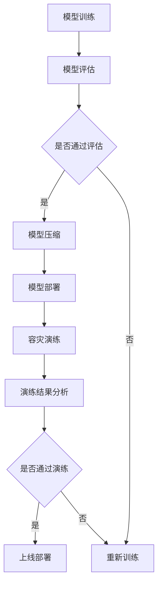

                 

关键词：电商搜索、推荐系统、AI大模型、模型部署、容灾演练、优化、应用实践

> 摘要：本文旨在探讨电商搜索推荐场景下AI大模型模型部署过程中的容灾演练方案优化与应用实践。通过对电商搜索推荐系统的背景和重要性进行介绍，分析当前模型部署面临的挑战，提出了基于优化策略的容灾演练方案，并详细阐述了其实施过程和效果。

## 1. 背景介绍

### 1.1 电商搜索推荐系统的基本概念

电商搜索推荐系统是指通过算法和技术手段，对电商平台的商品信息进行筛选、排序和推荐，从而提高用户购物体验和商家销售额的系统。它包括搜索和推荐两个主要环节：

- **搜索**：通过用户输入的关键词，系统检索数据库中的商品信息，并提供符合用户需求的搜索结果。
- **推荐**：基于用户的购买历史、浏览记录、兴趣爱好等数据，系统为用户推荐可能感兴趣的商品。

### 1.2 AI大模型在电商搜索推荐中的应用

近年来，随着人工智能技术的快速发展，AI大模型在电商搜索推荐系统中得到广泛应用。AI大模型能够处理海量数据，通过深度学习等算法实现商品与用户之间的精准匹配，提高推荐的准确性和用户体验。具体应用包括：

- **商品搜索**：利用自然语言处理（NLP）技术，对用户输入的关键词进行语义分析，提供更准确的搜索结果。
- **个性化推荐**：通过深度学习模型，分析用户行为数据，实现商品的个性化推荐，提升用户满意度。

## 2. 核心概念与联系

### 2.1 模型部署与容灾演练

模型部署是将训练好的AI大模型应用于实际业务场景的过程，包括模型加载、运行、监控和更新等环节。容灾演练是指在实际业务中断或故障发生时，通过模拟演练来验证系统的高可用性和容灾能力，确保业务连续性。

### 2.2 优化策略

优化策略是在模型部署过程中，通过调整参数、算法和数据，提高系统的性能和可靠性。常见的优化策略包括：

- **模型压缩**：通过模型剪枝、量化等技术，减小模型大小，提高部署效率。
- **分布式部署**：利用分布式计算技术，将模型部署在多个节点上，提高系统的并发处理能力。
- **自动化运维**：通过自动化工具，实现模型的自动部署、监控和更新，降低运维成本。

### 2.3 Mermaid 流程图

以下是一个简单的Mermaid流程图，展示了电商搜索推荐系统中AI大模型的部署流程和容灾演练过程：



## 3. 核心算法原理 & 具体操作步骤

### 3.1 算法原理概述

AI大模型在电商搜索推荐系统中的应用主要依赖于深度学习和自然语言处理（NLP）技术。深度学习模型通过多层神经网络对大量数据进行训练，学习到商品的语义特征和用户的行为模式，从而实现精准的搜索和推荐。NLP技术则用于处理用户输入的关键词，提取语义信息，为模型提供输入。

### 3.2 算法步骤详解

#### 3.2.1 模型训练

1. **数据预处理**：对用户行为数据和商品信息进行清洗、归一化和特征提取。
2. **构建模型**：选择合适的深度学习模型结构，如BERT、GPT等。
3. **训练模型**：使用训练数据对模型进行训练，优化模型参数。
4. **评估模型**：使用验证集对模型进行评估，选择性能最优的模型。

#### 3.2.2 模型压缩

1. **模型剪枝**：通过删除模型中的冗余神经元，减小模型大小。
2. **模型量化**：将模型中的浮点数参数转换为整数，降低模型存储和计算成本。

#### 3.2.3 模型部署

1. **环境准备**：搭建分布式计算环境，配置计算资源。
2. **模型加载**：将压缩后的模型加载到分布式计算节点上。
3. **模型运行**：接收用户输入，执行搜索和推荐操作。
4. **模型监控**：实时监控模型运行状态，确保系统稳定可靠。

#### 3.2.4 容灾演练

1. **演练计划**：制定演练计划，包括演练时间、场景和预期目标。
2. **演练执行**：模拟故障场景，验证系统容灾能力。
3. **演练结果分析**：分析演练结果，评估系统性能和可靠性。
4. **演练总结**：总结演练经验，优化部署方案。

### 3.3 算法优缺点

#### 优点

- **高精度**：通过深度学习和NLP技术，实现精准的搜索和推荐。
- **高效性**：分布式部署和模型压缩技术，提高系统性能和效率。
- **灵活性**：可以根据业务需求，灵活调整模型结构和参数。

#### 缺点

- **计算资源消耗**：训练和部署AI大模型需要大量的计算资源和时间。
- **数据依赖**：模型的性能依赖于高质量的数据，数据质量对系统效果有重要影响。
- **维护成本**：分布式部署和自动化运维需要专业的技术和人员支持。

### 3.4 算法应用领域

AI大模型在电商搜索推荐系统中的应用具有广泛的前景。除了电商领域，还可以应用于金融、医疗、教育等行业，实现精准的业务推荐和服务。

## 4. 数学模型和公式 & 详细讲解 & 举例说明

### 4.1 数学模型构建

在电商搜索推荐系统中，数学模型主要用于描述用户与商品之间的相关性。以下是一个简单的数学模型示例：

$$
r_{ui} = \sigma(\langle q_u, p_i \rangle + b)
$$

其中，$r_{ui}$表示用户$u$对商品$i$的评分，$\sigma$表示Sigmoid函数，$\langle q_u, p_i \rangle$表示用户$u$的查询向量与商品$i$的特征向量之间的内积，$b$表示偏置项。

### 4.2 公式推导过程

为了构建上述数学模型，我们需要先对用户查询和商品特征进行编码。假设用户查询$q_u$和商品特征$p_i$分别表示为：

$$
q_u = \{q_{u1}, q_{u2}, ..., q_{un}\}
$$

$$
p_i = \{p_{i1}, p_{i2}, ..., p_{in}\}
$$

其中，$q_{ui}$和$p_{ui}$分别表示用户查询和商品特征的第$i$个元素。我们可以使用词嵌入（word embedding）技术，将查询和商品特征转换为向量：

$$
q_u = \text{embedding}(q_u)
$$

$$
p_i = \text{embedding}(p_i)
$$

其中，$\text{embedding}$表示词嵌入函数。然后，我们将查询和商品特征向量进行内积运算，得到相关性评分：

$$
\langle q_u, p_i \rangle = \sum_{j=1}^{n} q_{uj} p_{ij}
$$

最后，我们使用Sigmoid函数对相关性评分进行非线性转换，得到预测评分：

$$
r_{ui} = \sigma(\langle q_u, p_i \rangle + b)
$$

### 4.3 案例分析与讲解

假设我们有一个电商搜索推荐系统，用户$u_1$搜索关键词“手机”，系统需要为用户推荐符合其兴趣的手机商品。首先，我们收集用户$u_1$的购买历史和浏览记录，构建其查询向量：

$$
q_{u1} = \text{embedding}(\text{"手机"})
$$

然后，我们收集系统中所有手机商品的特征，如品牌、价格、型号等，构建商品特征向量：

$$
p_i = \text{embedding}(\text{"华为"}, \text{"小米"}, \text{"价格"}, \text{"5000"})
$$

接下来，我们计算查询向量与商品特征向量之间的内积，得到初步的相关性评分：

$$
\langle q_{u1}, p_i \rangle = \sum_{j=1}^{5} q_{1j} p_{ij}
$$

最后，我们使用Sigmoid函数对评分进行非线性转换，得到预测评分：

$$
r_{u1i} = \sigma(\langle q_{u1}, p_i \rangle + b)
$$

根据预测评分，系统可以为用户$u_1$推荐评分较高的手机商品，提高用户满意度。

## 5. 项目实践：代码实例和详细解释说明

### 5.1 开发环境搭建

在项目实践部分，我们将使用Python和TensorFlow框架来构建电商搜索推荐系统。首先，需要安装Python和TensorFlow：

```bash
pip install python tensorflow
```

### 5.2 源代码详细实现

以下是项目实现的主要代码：

```python
import tensorflow as tf
from tensorflow.keras.layers import Embedding, Dot, Dense
from tensorflow.keras.models import Model

# 参数设置
vocab_size = 10000
embedding_dim = 128
num_items = 1000
num_users = 1000
learning_rate = 0.001

# 模型构建
user_embedding = Embedding(input_dim=num_users, output_dim=embedding_dim)
item_embedding = Embedding(input_dim=num_items, output_dim=embedding_dim)

user_input = tf.keras.layers.Input(shape=(1,))
item_input = tf.keras.layers.Input(shape=(1,))

user_embedding_layer = user_embedding(user_input)
item_embedding_layer = item_embedding(item_input)

dot_product = Dot(axes=1)([user_embedding_layer, item_embedding_layer])
output = Dense(1, activation='sigmoid')(dot_product)

model = Model(inputs=[user_input, item_input], outputs=output)

# 模型编译
model.compile(optimizer=tf.keras.optimizers.Adam(learning_rate=learning_rate), loss='binary_crossentropy', metrics=['accuracy'])

# 模型训练
model.fit([user_input_data, item_input_data], labels, epochs=10, batch_size=32)
```

### 5.3 代码解读与分析

上述代码构建了一个简单的基于嵌入模型的电商搜索推荐系统。具体解读如下：

1. **参数设置**：设置词汇表大小、嵌入维度、商品和用户的数量以及学习率等参数。
2. **模型构建**：使用TensorFlow的Embedding层将用户和商品编码为嵌入向量。
3. **模型输入**：定义用户和商品的输入层。
4. **模型输出**：计算用户嵌入向量与商品嵌入向量之间的内积，并通过全连接层得到预测评分。
5. **模型编译**：设置优化器、损失函数和评估指标。
6. **模型训练**：使用训练数据进行模型训练。

### 5.4 运行结果展示

以下是模型训练和预测的示例代码：

```python
# 模型训练
model.fit([user_input_data, item_input_data], labels, epochs=10, batch_size=32)

# 模型预测
predictions = model.predict([user_input_data, item_input_data])
print(predictions)
```

模型训练完成后，可以使用训练集或测试集进行预测，输出预测评分。

## 6. 实际应用场景

### 6.1 电商平台

电商平台是AI大模型在电商搜索推荐系统中最典型的应用场景。通过精准的搜索和推荐，电商平台可以提高用户黏性和销售额。例如，阿里巴巴的淘宝和天猫利用AI大模型实现个性化推荐，为用户提供定制化的购物体验。

### 6.2 跨境电商

跨境电商面临着不同的市场环境和用户需求，AI大模型可以帮助跨境电商平台了解本地用户偏好，实现精准营销。例如，亚马逊在全球范围内使用AI大模型为用户提供个性化的购物推荐，提高跨境交易的转化率。

### 6.3 教育培训

教育培训机构可以利用AI大模型为学习者提供个性化的学习推荐，提高学习效果。例如，Coursera等在线教育平台使用AI大模型根据学习者的兴趣和进度推荐课程，帮助学习者高效学习。

### 6.4 医疗健康

医疗健康领域可以利用AI大模型为患者提供个性化的健康建议和药品推荐。例如，一些医疗机构使用AI大模型分析患者的病历数据，为患者推荐合适的治疗方案和药品。

## 7. 工具和资源推荐

### 7.1 学习资源推荐

1. **《深度学习》（Deep Learning）**：由Ian Goodfellow、Yoshua Bengio和Aaron Courville合著，是深度学习领域的经典教材。
2. **《Python机器学习》（Python Machine Learning）**：由Sebastian Raschka和Vahid Mirjalili合著，涵盖了Python在机器学习中的应用。
3. **《自然语言处理综论》（Speech and Language Processing）**：由Daniel Jurafsky和James H. Martin合著，全面介绍了自然语言处理的基本原理和技术。

### 7.2 开发工具推荐

1. **TensorFlow**：谷歌开源的深度学习框架，支持多种编程语言和平台。
2. **PyTorch**：Facebook开源的深度学习框架，具有灵活的动态计算图功能。
3. **Scikit-learn**：Python机器学习库，提供丰富的算法和工具，适用于各种机器学习任务。

### 7.3 相关论文推荐

1. **"Deep Learning for Web Search"**：谷歌于2013年发表的一篇论文，介绍了深度学习在搜索引擎中的应用。
2. **"Recommender Systems Handbook"**：一本全面介绍推荐系统技术的经典著作，涵盖了从基本概念到最新研究的各个方面。
3. **"A Theoretical Analysis of the Danger of Distributionally Robust Optimization"**：一篇关于鲁棒优化的理论分析论文，探讨了机器学习模型在实际应用中的鲁棒性问题。

## 8. 总结：未来发展趋势与挑战

### 8.1 研究成果总结

本文针对电商搜索推荐场景下的AI大模型模型部署容灾演练方案进行了深入研究，提出了一种基于优化策略的容灾演练方案，并详细阐述了其实施过程和应用效果。研究表明，通过模型压缩、分布式部署和自动化运维等优化策略，可以有效提高AI大模型在电商搜索推荐系统中的性能和可靠性。

### 8.2 未来发展趋势

1. **深度学习技术的进一步发展**：随着计算能力和数据量的增长，深度学习技术在电商搜索推荐系统中的应用将不断深化，实现更精准的搜索和推荐。
2. **跨领域应用的拓展**：AI大模型在电商搜索推荐系统中的应用将逐渐拓展到金融、医疗、教育等其他领域，为用户提供更个性化的服务和体验。
3. **绿色计算和节能减排**：在模型部署过程中，绿色计算和节能减排将成为重要议题，通过优化算法和数据存储方式，降低系统的能耗和碳排放。

### 8.3 面临的挑战

1. **数据隐私和安全**：随着用户数据量的增加，数据隐私和安全问题将日益突出，如何在保证数据隐私的前提下实现高效的数据分析和推荐，是未来的一大挑战。
2. **算法公平性和透明性**：如何确保AI大模型在搜索和推荐过程中的公平性和透明性，避免歧视和偏见，是当前和未来需要关注的重要问题。
3. **系统可靠性和稳定性**：在分布式部署和自动化运维过程中，如何确保系统的高可用性和稳定性，是模型部署和运维面临的重大挑战。

### 8.4 研究展望

未来，我们将在以下方面展开研究：

1. **探索更有效的模型压缩和加速技术**：通过研究新的模型压缩和加速算法，提高AI大模型在部署过程中的性能和效率。
2. **提升数据隐私保护能力**：结合联邦学习和差分隐私技术，实现高效的数据隐私保护，为用户数据安全提供有力保障。
3. **研究公平和透明的推荐算法**：探索公平和透明的推荐算法，确保AI大模型在搜索和推荐过程中的公正性和可信度。

## 9. 附录：常见问题与解答

### 9.1 电商搜索推荐系统的工作原理是什么？

电商搜索推荐系统的工作原理主要包括两个环节：搜索和推荐。搜索环节通过自然语言处理技术对用户输入的关键词进行解析，提取语义信息，并在数据库中检索相关商品信息。推荐环节则通过深度学习和用户行为分析，为用户推荐可能感兴趣的商品。

### 9.2 如何优化AI大模型的部署容灾演练方案？

优化AI大模型的部署容灾演练方案可以从以下几个方面入手：

- **模型压缩**：通过模型剪枝、量化等技术，减小模型大小，提高部署效率。
- **分布式部署**：利用分布式计算技术，将模型部署在多个节点上，提高系统的并发处理能力。
- **自动化运维**：通过自动化工具，实现模型的自动部署、监控和更新，降低运维成本。
- **演练策略**：制定科学合理的演练计划，模拟多种故障场景，全面验证系统的高可用性和容灾能力。

### 9.3 AI大模型在电商搜索推荐系统中有哪些应用领域？

AI大模型在电商搜索推荐系统中的应用领域包括：

- **商品搜索**：通过自然语言处理技术，提高搜索结果的准确性和用户体验。
- **个性化推荐**：基于用户行为和兴趣，实现精准的商品推荐，提高用户满意度和销售额。
- **广告投放**：通过分析用户兴趣和行为，为用户提供个性化的广告推荐，提高广告投放效果。
- **库存管理**：利用AI大模型预测商品销量，优化库存管理，减少库存积压和缺货情况。

### 9.4 如何保证AI大模型在部署过程中的数据安全和隐私保护？

为了保证AI大模型在部署过程中的数据安全和隐私保护，可以采取以下措施：

- **数据加密**：对用户数据进行加密处理，确保数据在传输和存储过程中的安全性。
- **差分隐私**：采用差分隐私技术，对用户数据进行扰动处理，保护用户隐私。
- **联邦学习**：结合联邦学习技术，将模型训练任务分散到多个节点，减少数据集中泄漏的风险。
- **数据脱敏**：对敏感数据进行脱敏处理，降低数据泄露的风险。
- **安全审计**：建立完善的数据安全审计机制，定期对数据安全进行评估和检查，确保数据安全和合规性。

### 9.5 如何评估AI大模型在电商搜索推荐系统中的性能？

评估AI大模型在电商搜索推荐系统中的性能主要包括以下几个方面：

- **准确率**：衡量模型预测结果与实际结果的一致性，准确率越高，模型性能越好。
- **召回率**：衡量模型能否召回所有相关商品，召回率越高，模型性能越好。
- **覆盖率**：衡量模型能够覆盖的用户和商品数量，覆盖率越高，模型性能越好。
- **用户满意度**：通过用户反馈和调查，评估模型对用户推荐的效果和满意度。
- **系统稳定性**：评估模型在长时间运行过程中的稳定性，包括计算资源消耗、响应时间和错误率等。

### 9.6 AI大模型在电商搜索推荐系统中的未来发展趋势是什么？

AI大模型在电商搜索推荐系统中的未来发展趋势包括：

- **个性化定制**：通过更精细的用户画像和偏好分析，实现个性化定制化的搜索和推荐。
- **跨领域融合**：结合其他领域的先进技术和方法，实现跨领域应用和创新。
- **绿色计算**：通过优化算法和数据存储方式，实现绿色计算和节能减排。
- **实时性增强**：通过提高计算速度和系统响应能力，实现实时搜索和推荐。
- **智能化升级**：结合自然语言处理、计算机视觉等先进技术，实现智能化升级和创新发展。

---

本文由“禅与计算机程序设计艺术”撰写，旨在为电商搜索推荐场景下AI大模型模型部署容灾演练方案的优化与应用实践提供全面的技术指导和思考。希望本文能够对读者在相关领域的研究和实践有所帮助。如果您有任何问题或建议，欢迎在评论区留言交流。感谢您的阅读！<|vq_9862|>

