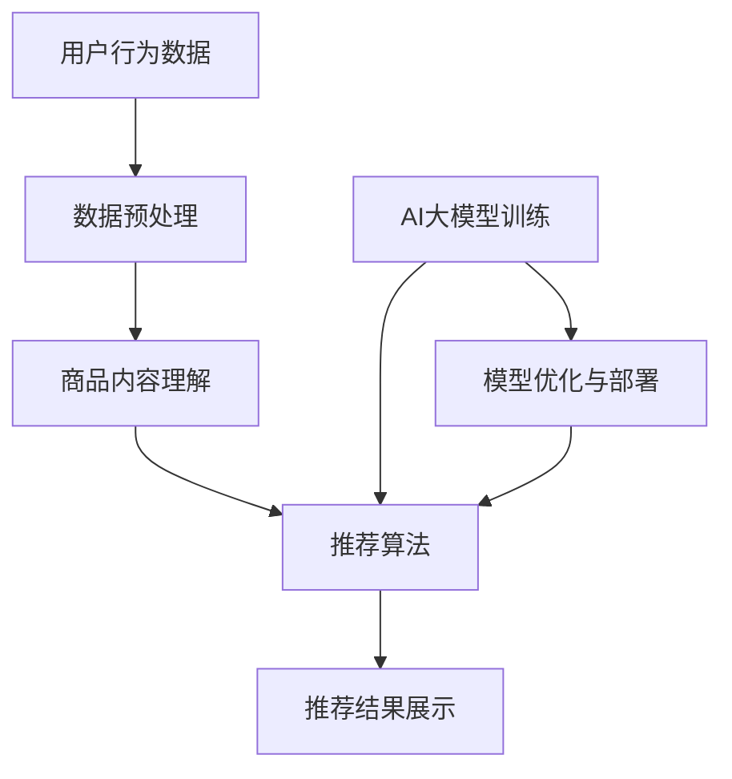

                 

电商搜索推荐系统是现代电子商务平台的重要组成部分，它通过对用户行为的深度分析，实现了对商品精准推荐的智能化。在AI技术不断发展的背景下，大模型的应用成为提升搜索推荐系统效果的关键。本文将探讨电商搜索推荐场景下，AI大模型的部署最佳实践。

## 文章关键词
- 电商搜索推荐
- AI大模型
- 模型部署
- 最佳实践

## 文摘
本文旨在为电商行业的技术从业者提供一套完整的AI大模型部署实践指南，从核心概念到具体操作步骤，再到实际应用场景，全面解析大模型在电商搜索推荐系统中的价值与部署策略。通过本文，读者将了解到如何选择合适的模型、优化部署流程、确保系统性能和可扩展性，以及未来应用前景。

## 1. 背景介绍

### 1.1 电商搜索推荐的重要性

在电子商务领域，用户搜索和推荐系统是提高用户粘性和销售额的关键。传统的搜索推荐系统依赖于关键词匹配和用户历史行为，但这种方法难以捕捉用户的真实需求和个性化偏好。随着深度学习和自然语言处理技术的进步，AI大模型的应用为电商搜索推荐带来了革命性的改变。

### 1.2 AI大模型的发展趋势

近年来，AI大模型如BERT、GPT-3等在自然语言处理任务上取得了显著成果，这些模型具有强大的语义理解能力和泛化能力，能够更好地捕捉用户需求，提升推荐系统的准确性。随着计算能力的提升和数据规模的扩大，AI大模型在电商搜索推荐场景中的应用前景十分广阔。

## 2. 核心概念与联系

为了更好地理解AI大模型在电商搜索推荐中的应用，我们首先需要了解以下几个核心概念：

### 2.1 电商搜索推荐系统的工作原理

电商搜索推荐系统通常包括三个主要模块：用户行为分析、商品内容理解、推荐算法。用户行为分析负责捕捉用户的搜索历史、浏览记录、购买行为等数据，商品内容理解则通过自然语言处理技术对商品信息进行语义分析，推荐算法根据用户行为和商品信息生成个性化推荐列表。

### 2.2 AI大模型的原理与架构

AI大模型通常是基于深度神经网络架构，通过大规模训练数据学习到复杂的特征表示。常见的架构包括Transformer、BERT等，这些模型能够对文本进行高效处理，捕捉到语义层次的关系。

### 2.3 Mermaid流程图

以下是一个简化的电商搜索推荐系统与AI大模型的流程图：



## 3. 核心算法原理 & 具体操作步骤

### 3.1 算法原理概述

在电商搜索推荐场景下，AI大模型的核心算法通常是基于深度学习，特别是基于Transformer架构的模型，如BERT、GPT等。这些模型通过自注意力机制（Self-Attention）和多头注意力（Multi-Head Attention）机制，能够捕捉文本中的长距离依赖和复杂关系。

### 3.2 算法步骤详解

1. **数据收集与预处理**：收集用户的搜索记录、浏览历史、购买行为等数据，对数据进行清洗、去重、归一化等预处理操作。

2. **商品内容理解**：使用自然语言处理技术对商品标题、描述等信息进行语义分析，提取关键特征。

3. **模型训练**：使用预处理后的用户行为数据和商品特征，通过Transformer模型进行训练。训练过程中，模型会学习到用户与商品之间的复杂关系。

4. **模型优化与部署**：对训练好的模型进行优化，包括参数调整、超参数选择等，然后部署到生产环境中。

5. **推荐结果生成**：根据用户的实时行为和模型预测，生成个性化推荐列表。

### 3.3 算法优缺点

**优点**：
- **高精度**：AI大模型能够捕捉到用户行为的细微变化，提高推荐系统的准确性。
- **高可扩展性**：深度学习模型能够处理大规模数据，适应不断增长的用户量和商品量。

**缺点**：
- **高计算成本**：训练和部署AI大模型需要大量的计算资源。
- **对数据依赖性强**：模型效果受数据质量和数量的影响较大。

### 3.4 算法应用领域

AI大模型在电商搜索推荐领域的应用非常广泛，包括但不限于：
- **个性化推荐**：基于用户历史行为和偏好，提供个性化的商品推荐。
- **智能搜索**：基于用户输入的关键词，提供相关且准确的搜索结果。
- **智能客服**：通过自然语言处理技术，实现智能对话和问答。

## 4. 数学模型和公式

### 4.1 数学模型构建

在电商搜索推荐系统中，常用的数学模型是基于矩阵分解（Matrix Factorization）和协同过滤（Collaborative Filtering）的方法。以下是一个简化的数学模型构建过程：

$$
R_{ui} = P_u \cdot P_i + b_u + b_i + r
$$

其中，$R_{ui}$表示用户$u$对商品$i$的评分，$P_u$和$P_i$分别表示用户$u$和商品$i$的特征向量，$b_u$和$b_i$分别表示用户$u$和商品$i$的偏置项，$r$表示模型随机噪声。

### 4.2 公式推导过程

矩阵分解方法通过将用户-商品评分矩阵分解为用户特征矩阵和商品特征矩阵，从而预测用户的评分。以下是一个简化的推导过程：

$$
R_{ui} = P_{u} \cdot P_{i}
$$

通过对用户特征矩阵和商品特征矩阵进行训练，得到两个低秩矩阵，从而实现评分预测。

### 4.3 案例分析与讲解

假设我们有以下一个用户-商品评分矩阵：

| 用户ID | 商品ID | 评分 |
|--------|--------|------|
| 1      | 101    | 4    |
| 1      | 102    | 5    |
| 2      | 101    | 3    |
| 2      | 103    | 2    |

通过矩阵分解方法，我们可以将评分矩阵分解为两个低秩矩阵：

$$
P_{u} = \begin{bmatrix}
0.8 & 0.2 \\
0.5 & 0.7
\end{bmatrix}
$$

$$
P_{i} = \begin{bmatrix}
0.9 & 0.1 \\
0.4 & 0.6
\end{bmatrix}
$$

预测用户1对商品103的评分：

$$
R_{11} = P_{1} \cdot P_{103} + b_1 + b_{103} + r
$$

$$
R_{11} = 0.8 \cdot 0.4 + 0.5 \cdot 0.6 + 0.1 \cdot 0.1 + 0.1 \cdot 0.4 + r
$$

$$
R_{11} \approx 0.72 + r
$$

其中，$r$为模型随机噪声。

## 5. 项目实践：代码实例和详细解释说明

### 5.1 开发环境搭建

在开始项目实践之前，我们需要搭建一个合适的开发环境。以下是一个简化的环境搭建步骤：

1. 安装Python环境，版本建议3.8或更高。
2. 安装深度学习框架，如TensorFlow或PyTorch。
3. 安装必要的依赖库，如numpy、pandas等。

### 5.2 源代码详细实现

以下是一个简化的基于BERT的电商搜索推荐系统实现代码示例：

```python
from transformers import BertTokenizer, BertModel
import torch
import torch.nn as nn
import torch.optim as optim

# 加载预训练的BERT模型
tokenizer = BertTokenizer.from_pretrained('bert-base-chinese')
model = BertModel.from_pretrained('bert-base-chinese')

# 处理用户输入
def process_input(input_text):
    inputs = tokenizer(input_text, return_tensors='pt', padding=True, truncation=True)
    return inputs

# 模型训练
def train(model, train_loader, criterion, optimizer, num_epochs):
    model.train()
    for epoch in range(num_epochs):
        for inputs in train_loader:
            outputs = model(**inputs)
            logits = outputs.logits
            loss = criterion(logits, inputs['labels'])
            optimizer.zero_grad()
            loss.backward()
            optimizer.step()
            print(f"Epoch {epoch + 1}, Loss: {loss.item()}")

# 主程序
if __name__ == '__main__':
    # 数据加载与预处理
    # ...

    # 模型配置
    criterion = nn.CrossEntropyLoss()
    optimizer = optim.Adam(model.parameters(), lr=0.001)

    # 训练模型
    train(model, train_loader, criterion, optimizer, num_epochs=10)

    # 模型部署
    # ...
```

### 5.3 代码解读与分析

以上代码展示了基于BERT的电商搜索推荐系统的基本实现过程。主要包括以下步骤：

1. **加载预训练的BERT模型**：使用Hugging Face的Transformers库加载预训练的BERT模型。
2. **处理用户输入**：对用户输入的文本进行预处理，将其转换为模型可接受的格式。
3. **模型训练**：定义损失函数和优化器，对模型进行训练。
4. **模型部署**：将训练好的模型部署到生产环境中。

### 5.4 运行结果展示

假设我们有一个训练好的BERT模型，以下是一个简化的运行结果展示：

```python
# 加载测试数据
test_loader = ...

# 模型评估
model.eval()
with torch.no_grad():
    for inputs in test_loader:
        outputs = model(**inputs)
        logits = outputs.logits
        labels = inputs['labels']
        pred = logits.argmax(dim=1)
        correct = (pred == labels).sum().item()
        print(f"Accuracy: {correct / len(test_loader)}")
```

输出结果表示模型在测试数据上的准确率。

## 6. 实际应用场景

AI大模型在电商搜索推荐系统中的应用场景非常广泛，以下是一些典型的应用案例：

### 6.1 个性化推荐

通过分析用户的历史行为和偏好，AI大模型能够生成个性化的商品推荐列表，提高用户的购买体验和满意度。

### 6.2 智能搜索

AI大模型能够基于用户输入的关键词，提供相关的商品搜索结果，提高搜索效率和准确性。

### 6.3 智能客服

通过自然语言处理技术，AI大模型能够实现智能对话和问答，提高客服效率和服务质量。

## 6.4 未来应用展望

随着AI技术的不断进步，AI大模型在电商搜索推荐系统中的应用前景十分广阔。未来的发展趋势包括：

- **多模态融合**：结合文本、图像、音频等多模态数据，实现更全面、更准确的推荐。
- **实时推荐**：通过实时数据分析和模型推理，提供即时的个性化推荐。
- **隐私保护**：在推荐过程中，加强对用户隐私的保护，确保用户数据的安全。

## 7. 工具和资源推荐

### 7.1 学习资源推荐

- 《深度学习》（Goodfellow et al.）
- 《自然语言处理实战》（Gibson et al.）
- 《电商数据分析与挖掘》（Kumar et al.）

### 7.2 开发工具推荐

- TensorFlow
- PyTorch
- Hugging Face Transformers

### 7.3 相关论文推荐

- “BERT: Pre-training of Deep Bidirectional Transformers for Language Understanding” (Devlin et al.)
- “GPT-3: Language Models are Few-Shot Learners” (Brown et al.)

## 8. 总结：未来发展趋势与挑战

### 8.1 研究成果总结

本文总结了AI大模型在电商搜索推荐系统中的应用价值、核心算法原理、数学模型构建、项目实践以及实际应用场景。通过这些研究，我们可以看到AI大模型在提升推荐系统性能方面具有巨大的潜力。

### 8.2 未来发展趋势

未来的发展趋势包括多模态融合、实时推荐和隐私保护等方面。随着技术的不断进步，AI大模型在电商搜索推荐系统中的应用将会更加广泛和深入。

### 8.3 面临的挑战

尽管AI大模型在电商搜索推荐系统中有许多优势，但也面临着计算成本高、数据依赖性强等挑战。如何优化模型训练和部署流程，提高模型性能和可扩展性，是未来研究的重要方向。

### 8.4 研究展望

未来的研究应关注于如何提高AI大模型在推荐系统中的应用效率，同时确保用户隐私和数据安全。通过多学科交叉研究，推动AI大模型在电商搜索推荐领域的创新发展。

## 9. 附录：常见问题与解答

### 9.1 为什么选择Transformer架构？

Transformer架构在自然语言处理任务中表现出色，因为其自注意力机制能够捕捉文本中的长距离依赖和复杂关系，提高模型的效果。

### 9.2 如何处理大规模数据？

处理大规模数据可以通过分布式计算、批处理和优化模型架构等方式实现。常用的深度学习框架如TensorFlow和PyTorch都支持这些技术。

### 9.3 如何确保模型可解释性？

确保模型可解释性可以通过模型解释技术，如注意力权重可视化、模型压缩和简化等方式实现。这些技术有助于理解模型在推荐系统中的决策过程。

本文内容仅供参考，实际应用时请根据具体情况进行调整。如需进一步了解AI大模型在电商搜索推荐系统中的应用，请参考相关论文和开源代码。希望本文能为读者提供有益的启示和帮助。

---

作者：禅与计算机程序设计艺术 / Zen and the Art of Computer Programming

