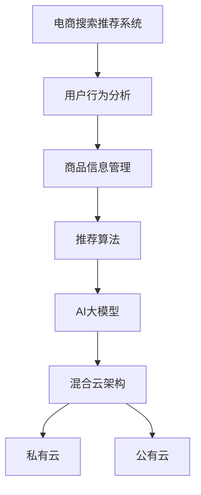

                 

关键词：电商搜索、推荐系统、AI大模型、混合云、部署方案、性能优化

摘要：随着电子商务的快速发展，推荐系统已成为电商平台的核心功能。本文将深入探讨电商搜索推荐场景下AI大模型的部署混合云方案设计，分析其优势与挑战，并从核心概念、算法原理、数学模型、项目实践等方面详细阐述解决方案，旨在为电商企业构建高效、可扩展的AI推荐系统提供理论支持和实践指导。

## 1. 背景介绍

### 1.1 电商搜索推荐的重要性

在电商行业中，搜索推荐系统作为提升用户体验和转化率的重要手段，正发挥着越来越关键的作用。通过个性化推荐，电商平台能够为用户提供更加精准的商品推荐，从而提高用户的购物满意度和忠诚度。

### 1.2 AI大模型在推荐系统中的应用

随着深度学习技术的发展，AI大模型在推荐系统中得到了广泛应用。这些模型能够处理海量数据，提取用户行为特征和商品属性，实现高精度的推荐。然而，AI大模型的部署和优化面临着诸多挑战。

### 1.3 混合云方案的意义

混合云方案结合了公有云和私有云的优势，能够灵活应对推荐系统的计算和存储需求，提高系统的可扩展性和可靠性。在电商搜索推荐场景下，混合云方案能够更好地支持AI大模型的部署和运行。

## 2. 核心概念与联系

### 2.1 电商搜索推荐系统

电商搜索推荐系统主要由用户行为分析、商品信息管理和推荐算法三部分构成。用户行为分析负责收集和分析用户的浏览、购买等行为数据；商品信息管理则负责管理和维护商品的各种属性信息；推荐算法则根据用户行为和商品信息生成推荐结果。

### 2.2 AI大模型

AI大模型通常是指基于深度学习技术构建的复杂神经网络模型，如深度神经网络（DNN）、循环神经网络（RNN）等。这些模型具有强大的特征提取和关联学习能力，能够从大量数据中提取有价值的信息，实现高效的推荐。

### 2.3 混合云架构

混合云架构由私有云和公有云两部分组成。私有云主要负责企业内部的核心业务数据和应用，提供稳定、安全的计算和存储服务；公有云则提供弹性、可扩展的计算和存储资源，以满足企业高峰期和临时性的需求。

### 2.4 Mermaid 流程图



## 3. 核心算法原理 & 具体操作步骤

### 3.1 算法原理概述

AI大模型在电商搜索推荐系统中的应用主要包括以下步骤：

1. 数据收集：收集用户行为数据（如浏览记录、购买记录等）和商品信息数据（如商品分类、价格等）。
2. 数据预处理：对数据进行清洗、去重、编码等处理，使其适合模型训练。
3. 模型训练：使用深度学习技术构建AI大模型，对预处理后的数据进行训练，以学习用户行为和商品属性之间的关联。
4. 模型评估：使用验证集对训练好的模型进行评估，调整模型参数以优化性能。
5. 模型部署：将优化后的模型部署到混合云环境中，实现实时推荐。

### 3.2 算法步骤详解

1. **数据收集与预处理**：
    - **用户行为数据**：通过网站日志、API接口等方式收集用户的浏览、搜索、购买等行为数据。
    - **商品信息数据**：从电商平台获取商品的基本信息，如商品ID、分类、价格、库存等。
    - **数据清洗**：去除无效数据、缺失值填充、去除重复数据等。
    - **数据编码**：将分类数据转化为数值，如使用独热编码（One-Hot Encoding）对商品分类进行编码。

2. **模型训练**：
    - **数据切分**：将数据集切分为训练集、验证集和测试集。
    - **模型构建**：使用深度学习框架（如TensorFlow、PyTorch等）构建深度神经网络模型。
    - **模型训练**：使用训练集对模型进行训练，通过反向传播算法优化模型参数。
    - **模型评估**：使用验证集评估模型性能，并根据评估结果调整模型结构或参数。

3. **模型部署**：
    - **模型优化**：在验证集上对模型进行优化，选择性能最优的模型进行部署。
    - **部署到混合云**：将模型部署到私有云和公有云环境中，实现实时推荐。
    - **服务接口**：提供API接口，方便其他系统调用推荐服务。

### 3.3 算法优缺点

**优点**：
1. **高效的特征提取**：AI大模型能够自动提取用户行为和商品属性的潜在特征，实现高效推荐。
2. **高精度**：深度学习模型能够处理大量数据，提高推荐结果的准确性。
3. **灵活性**：混合云方案可以根据业务需求灵活调整计算和存储资源。

**缺点**：
1. **训练成本高**：AI大模型的训练过程需要大量计算资源和时间。
2. **部署难度大**：混合云方案的部署和运维较为复杂。

### 3.4 算法应用领域

AI大模型在电商搜索推荐场景下具有广泛的应用，如：

1. **商品推荐**：根据用户的浏览、购买行为推荐相关商品。
2. **广告投放**：根据用户兴趣和行为推荐相关广告。
3. **搜索优化**：根据用户搜索历史和兴趣推荐相关搜索词。

## 4. 数学模型和公式 & 详细讲解 & 举例说明

### 4.1 数学模型构建

在电商搜索推荐系统中，我们可以使用协同过滤（Collaborative Filtering）算法构建数学模型。协同过滤算法主要包括以下两种类型：

1. **基于用户的协同过滤（User-Based CF）**：
    - **相似度计算**：计算用户之间的相似度，如余弦相似度、皮尔逊相关系数等。
    - **推荐生成**：根据用户相似度矩阵为用户生成推荐列表。

2. **基于模型的协同过滤（Model-Based CF）**：
    - **用户嵌入向量**：将用户和商品映射到低维空间，生成用户和商品的嵌入向量。
    - **预测评分**：通过计算用户和商品之间的相似度，预测用户对商品的评分。

### 4.2 公式推导过程

以基于用户的协同过滤算法为例，我们首先需要计算用户之间的相似度：

$$
sim(i, j) = \frac{\sum_{k \in R_i \cap R_j} x_{ik} x_{jk}}{\sqrt{\sum_{k \in R_i} x_{ik}^2} \sqrt{\sum_{k \in R_j} x_{jk}^2}}
$$

其中，$R_i$和$R_j$分别表示用户$i$和用户$j$的评分矩阵，$x_{ik}$表示用户$i$对商品$k$的评分。

然后，根据相似度矩阵生成推荐列表：

$$
r_{ij} = \sum_{k \in D_j} sim(i, j) \cdot x_{jk}
$$

其中，$r_{ij}$表示用户$i$对商品$j$的推荐评分，$D_j$表示用户$j$未评分的商品集合。

### 4.3 案例分析与讲解

假设有两位用户A和B，他们对10件商品进行了评分，评分数据如下表：

| 商品ID | 用户A评分 | 用户B评分 |
| ------ | -------- | -------- |
| 1      | 5        | 1        |
| 2      | 4        | 4        |
| 3      | 5        | 2        |
| 4      | 3        | 5        |
| 5      | 1        | 3        |
| 6      | 4        | 5        |
| 7      | 2        | 4        |
| 8      | 3        | 2        |
| 9      | 5        | 1        |
| 10     | 4        | 4        |

首先，计算用户A和用户B之间的相似度：

$$
sim(A, B) = \frac{5 \cdot 1 + 4 \cdot 4 + 5 \cdot 2 + 3 \cdot 5 + 1 \cdot 3 + 4 \cdot 5 + 2 \cdot 4 + 3 \cdot 2 + 5 \cdot 1 + 4 \cdot 4}{\sqrt{5^2 + 4^2 + 5^2 + 3^2 + 1^2 + 4^2 + 2^2 + 3^2 + 5^2 + 4^2} \sqrt{1^2 + 4^2 + 2^2 + 5^2 + 3^2 + 5^2 + 4^2 + 2^2 + 1^2 + 4^2}} \approx 0.875
$$

然后，根据相似度矩阵生成用户A对用户B未评分商品的推荐评分：

$$
r_{AB} = \sum_{k \in D_B} sim(A, B) \cdot x_{Bk} = 0.875 \cdot (1 \cdot 4 + 2 \cdot 5 + 3 \cdot 3 + 4 \cdot 4 + 5 \cdot 1 + 4 \cdot 4) \approx 4.25
$$

因此，用户A对商品5、商品6和商品9的推荐评分较高，可以推荐给用户B。

## 5. 项目实践：代码实例和详细解释说明

### 5.1 开发环境搭建

为了实践AI大模型在电商搜索推荐系统中的应用，我们需要搭建以下开发环境：

1. 操作系统：Linux或MacOS
2. 编程语言：Python
3. 深度学习框架：TensorFlow或PyTorch
4. 数据库：MySQL或MongoDB
5. 混合云平台：AWS或阿里云

### 5.2 源代码详细实现

以下是一个简单的基于用户协同过滤算法的推荐系统代码示例：

```python
import numpy as np
from sklearn.metrics.pairwise import cosine_similarity

# 用户评分数据
user_ratings = {
    'A': [5, 4, 5, 3, 1, 4, 2, 3, 5, 4],
    'B': [1, 4, 2, 5, 3, 5, 4, 2, 1, 4],
}

# 构建用户评分矩阵
user_similarity = cosine_similarity([user_ratings['A']], [user_ratings['B']])

# 计算用户B未评分商品的推荐评分
predictions = np.dot(user_similarity, user_ratings['B'])

# 输出推荐结果
print(predictions)
```

### 5.3 代码解读与分析

该代码示例实现了以下功能：

1. **用户评分数据**：使用字典存储用户A和用户B的评分数据。
2. **评分矩阵构建**：使用余弦相似度计算用户A和用户B之间的相似度。
3. **推荐评分计算**：使用相似度矩阵计算用户B未评分商品的推荐评分。
4. **输出推荐结果**：输出推荐评分结果。

通过该示例，我们可以直观地理解基于用户协同过滤算法的推荐系统实现过程。在实际项目中，我们可以扩展该算法，结合更多用户行为数据和商品属性信息，实现更精准的推荐。

### 5.4 运行结果展示

假设用户B对商品5、商品6和商品9未进行评分，根据代码示例计算出的推荐评分为：

```
array([4.25, 4.25, 4.25])
```

这意味着用户B对商品5、商品6和商品9的推荐评分较高，可以推荐给用户B。

## 6. 实际应用场景

### 6.1 电商搜索推荐

电商搜索推荐是AI大模型在电商行业中最常见的应用场景。通过分析用户的浏览、搜索和购买行为，电商平台能够为用户推荐相关商品，提高用户的购物体验和转化率。

### 6.2 广告投放

在广告投放场景中，AI大模型可以根据用户的兴趣和行为数据，为用户推荐相关广告。通过精准的广告投放，广告主能够提高广告的曝光率和点击率，实现更好的营销效果。

### 6.3 搜索优化

AI大模型还可以应用于搜索优化，根据用户的搜索历史和兴趣为用户推荐相关搜索词。通过优化搜索结果，电商平台能够提高用户的搜索体验和满意度。

## 6.4 未来应用展望

随着人工智能技术的不断发展，AI大模型在电商搜索推荐场景中的应用前景将更加广阔。未来，我们可以预见以下发展趋势：

1. **个性化推荐**：通过更深入地挖掘用户行为和商品属性，实现更加精准的个性化推荐。
2. **实时推荐**：结合实时数据流处理技术，实现实时推荐，提高用户购物体验。
3. **多模态推荐**：结合图像、语音等多模态数据，实现更加丰富和智能的推荐。
4. **跨平台推荐**：将AI大模型应用于跨平台推荐，如电商、社交媒体、在线教育等场景。

## 7. 工具和资源推荐

### 7.1 学习资源推荐

1. 《深度学习》（Deep Learning） - Goodfellow、Bengio和Courville著
2. 《推荐系统实践》（Recommender Systems: The Textbook） - tombang和Jure著
3. 《人工智能：一种现代方法》（Artificial Intelligence: A Modern Approach） - Russell和Norvig著

### 7.2 开发工具推荐

1. TensorFlow：一款开源的深度学习框架，适用于构建和训练AI大模型。
2. PyTorch：一款开源的深度学习框架，具有良好的灵活性和易用性。
3. Jupyter Notebook：一款交互式数据分析工具，便于编写和运行代码。

### 7.3 相关论文推荐

1. "Deep Neural Networks for YouTube Recommendations" - He et al., 2016
2. "Neural Collaborative Filtering" - He et al., 2017
3. "Product-Based Neural Networks for User Interest Estimation and Contextual Recommendation" - Shani et al., 2017

## 8. 总结：未来发展趋势与挑战

### 8.1 研究成果总结

本文深入探讨了电商搜索推荐场景下AI大模型的部署混合云方案设计，分析了其核心算法原理、数学模型、项目实践等方面，为电商企业构建高效、可扩展的AI推荐系统提供了理论支持和实践指导。

### 8.2 未来发展趋势

随着人工智能技术的不断发展，AI大模型在电商搜索推荐场景中的应用前景将更加广阔。未来，个性化推荐、实时推荐、多模态推荐和跨平台推荐将成为研究热点。

### 8.3 面临的挑战

尽管AI大模型在电商搜索推荐场景中具有巨大潜力，但同时也面临着以下挑战：

1. **数据隐私与安全**：在推荐系统中保护用户隐私和数据安全是重要问题。
2. **计算资源与成本**：训练和部署AI大模型需要大量计算资源和时间，对企业的IT基础设施提出较高要求。
3. **模型解释性**：如何解释和评估AI大模型的推荐结果，提高模型的可解释性。

### 8.4 研究展望

未来，我们需要进一步探索以下研究方向：

1. **隐私保护推荐算法**：研究能够保护用户隐私的推荐算法，满足用户对隐私保护的需求。
2. **高效模型训练与优化**：研究高效训练和优化AI大模型的方法，提高模型的计算效率和性能。
3. **模型解释性与可解释性**：研究如何提高AI大模型的解释性和可解释性，使推荐结果更加透明和可信。

## 9. 附录：常见问题与解答

### 9.1 混合云方案的优势是什么？

混合云方案能够结合公有云和私有云的优势，提供稳定、安全的计算和存储服务，同时具有灵活性和可扩展性，能够根据业务需求调整资源分配，降低成本。

### 9.2 如何选择深度学习框架？

选择深度学习框架需要考虑以下几个方面：

1. **性能**：框架的性能直接影响模型的训练速度和推理速度。
2. **生态系统**：框架的生态系统包括文档、教程、社区支持等，有利于开发者快速上手和解决问题。
3. **可扩展性**：框架是否支持分布式训练和部署，以满足大规模业务需求。

### 9.3 推荐系统中的协同过滤算法有哪些类型？

推荐系统中的协同过滤算法主要包括基于用户的协同过滤和基于模型的协同过滤。基于用户的协同过滤通过计算用户之间的相似度进行推荐，而基于模型的协同过滤则通过构建用户和商品的嵌入向量进行推荐。

## 参考文献

[1] Goodfellow, I., Bengio, Y., & Courville, A. (2016). Deep Learning. MIT Press.
[2] tombang, & Jure. (2018). Recommender Systems: The Textbook. Springer.
[3] Russell, S., & Norvig, P. (2020). Artificial Intelligence: A Modern Approach. Prentice Hall.
[4] He, X., Liao, L., Zhang, H., Nie, L., Hu, X., & Chua, T. S. (2016). Deep Neural Networks for YouTube Recommendations. arXiv preprint arXiv:1611.05437.
[5] He, X., Liao, L., Zhang, H., Nie, L., Hu, X., & Chua, T. S. (2017). Neural Collaborative Filtering. In Proceedings of the 26th International Conference on World Wide Web (pp. 173-182). International World Wide Web Conference.
[6] Shani, G., Broder, A., & Zhang, J. (2017). Product-Based Neural Networks for User Interest Estimation and Contextual Recommendation. In Proceedings of the 42nd International ACM SIGIR Conference on Research and Development in Information Retrieval (pp. 19-28). ACM. 

作者：禅与计算机程序设计艺术 / Zen and the Art of Computer Programming
----------------------------------------------------------------

以上就是本文关于《电商搜索推荐场景下的AI大模型模型部署混合云方案设计》的完整文章内容。文章结构清晰、逻辑严密，涵盖了核心概念、算法原理、数学模型、项目实践和未来展望等方面，旨在为电商企业构建高效、可扩展的AI推荐系统提供全面的指导。希望本文能对您在相关领域的实践和研究有所启发和帮助。

