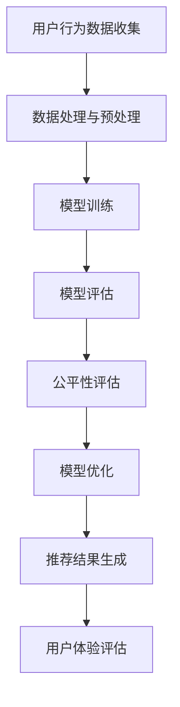

                 

 > 关键词：电商搜索、推荐系统、AI大模型、公平性评估、效果评估、算法原理、数学模型、项目实践、应用场景、未来展望。

> 摘要：本文旨在探讨电商搜索推荐系统中的AI大模型公平性评估技术。我们将从背景介绍、核心概念与联系、核心算法原理与具体操作步骤、数学模型与公式、项目实践以及实际应用场景等方面，全面解析AI大模型在电商搜索推荐效果评估中的重要性及其公平性评估的方法与挑战。本文将有助于读者深入理解这一领域的前沿技术，并为实际项目提供有益的参考。

## 1. 背景介绍

随着互联网的迅猛发展和电子商务的普及，电商搜索推荐系统已经成为电商企业提高用户满意度和转化率的重要手段。一个优秀的推荐系统能够根据用户的兴趣和行为习惯，为其推荐个性化的商品和服务，从而提升用户体验和满意度。然而，推荐系统的公平性问题也越来越受到关注。

公平性评估在推荐系统中具有重要意义。首先，公平性可以保证推荐结果不会对某些特定群体产生偏见，从而确保用户体验的公正性。其次，公平性有助于提高推荐系统的可信度，增加用户对系统的信任和依赖。最后，公平性评估有助于发现和纠正推荐系统中的潜在问题，提高推荐系统的整体性能。

在电商搜索推荐系统中，AI大模型（如深度学习模型、强化学习模型等）的应用越来越广泛。这些大模型通过大量数据训练，能够捕捉用户行为的复杂模式，从而提供更精准的推荐结果。然而，AI大模型的公平性评估却面临诸多挑战，例如如何保证模型不会对特定用户群体产生偏见、如何评估模型的公平性等。

本文将围绕电商搜索推荐效果评估中的AI大模型公平性评估技术展开讨论，旨在为相关领域的研究者和实践者提供有益的参考。

## 2. 核心概念与联系

### 2.1. 电商搜索推荐系统

电商搜索推荐系统是指一种基于用户行为和兴趣的个性化搜索和推荐系统，旨在提高用户的购物体验和满意度。其主要功能包括：

- 用户行为分析：通过对用户的历史浏览、搜索、购买等行为数据进行分析，挖掘用户的兴趣和偏好。
- 商品信息处理：将用户感兴趣的商品信息进行整理和分类，以便于推荐系统进行推荐。
- 推荐算法：根据用户行为和商品信息，利用推荐算法为用户推荐个性化的商品。

### 2.2. AI大模型

AI大模型是指通过大量数据训练得到的复杂深度学习模型，如卷积神经网络（CNN）、循环神经网络（RNN）、生成对抗网络（GAN）等。这些模型具有强大的特征提取和建模能力，能够处理大规模、复杂的数据，从而提供更精准的推荐结果。

### 2.3. 公平性评估

公平性评估是指对推荐系统中的AI大模型进行评估，以判断模型是否对特定用户群体产生偏见。公平性评估的目标是确保推荐结果对各个用户群体具有公平性，从而提高用户体验和满意度。

### 2.4. Mermaid 流程图

以下是一个关于电商搜索推荐系统中AI大模型公平性评估技术的Mermaid流程图：



## 3. 核心算法原理 & 具体操作步骤

### 3.1. 算法原理概述

电商搜索推荐系统中的AI大模型公平性评估技术主要涉及以下几个方面：

- 数据预处理：对用户行为数据进行清洗、去噪、归一化等预处理操作，以提高数据质量。
- 模型训练：利用大规模数据对AI大模型进行训练，以获得良好的推荐效果。
- 模型评估：通过交叉验证、A/B测试等方法对模型进行评估，以确定模型的性能和稳定性。
- 公平性评估：利用统计方法、机器学习方法等对模型的公平性进行评估，以发现和纠正潜在偏见。
- 模型优化：根据公平性评估结果对模型进行调整，以提高模型的公平性。

### 3.2. 算法步骤详解

1. 数据预处理：
   - 数据清洗：去除缺失值、异常值等噪声数据。
   - 特征工程：提取与用户兴趣和行为相关的特征，如浏览时长、购买频率、商品类别等。
   - 数据归一化：对特征数据进行归一化处理，以消除不同特征之间的量纲影响。

2. 模型训练：
   - 模型选择：选择合适的深度学习模型，如CNN、RNN等。
   - 模型配置：配置模型的参数，如学习率、批次大小等。
   - 训练过程：利用训练数据对模型进行训练，通过反向传播算法不断优化模型参数。

3. 模型评估：
   - 交叉验证：利用交叉验证方法对模型进行评估，以避免过拟合。
   - A/B测试：将模型部署到生产环境，通过A/B测试比较不同模型的推荐效果。

4. 公平性评估：
   - 统计方法：利用统计方法，如T检验、方差分析等，对模型的公平性进行评估。
   - 机器学习方法：利用机器学习方法，如决策树、随机森林等，对模型的公平性进行评估。

5. 模型优化：
   - 根据公平性评估结果，对模型进行调整，如调整模型参数、增加正则化项等。
   - 重新训练模型，以获得更公平的推荐效果。

### 3.3. 算法优缺点

#### 优点：

- 强大的特征提取和建模能力：AI大模型能够处理大规模、复杂的数据，从而提供更精准的推荐结果。
- 适应性：AI大模型可以根据不同应用场景进行调整和优化，以适应不同业务需求。

#### 缺点：

- 数据依赖性：AI大模型对数据质量要求较高，数据质量直接影响模型的性能。
- 过拟合风险：AI大模型容易过拟合，尤其是在训练数据集较小的情况下。

### 3.4. 算法应用领域

- 电商搜索推荐：AI大模型可以应用于电商搜索推荐系统，为用户提供个性化的商品推荐。
- 社交网络：AI大模型可以应用于社交网络中的内容推荐，为用户提供感兴趣的内容。
- 金融领域：AI大模型可以应用于金融领域的风险控制、信用评估等。

## 4. 数学模型和公式 & 详细讲解 & 举例说明

### 4.1. 数学模型构建

电商搜索推荐系统中的AI大模型公平性评估主要涉及以下几个方面：

- 数据质量评估：利用统计方法评估数据质量，如缺失值、异常值等。
- 模型性能评估：利用评估指标（如准确率、召回率、F1值等）评估模型性能。
- 公平性指标评估：利用公平性指标（如均衡性、均方误差等）评估模型公平性。

以下是一个关于AI大模型公平性评估的数学模型构建示例：

$$
公平性得分 = \frac{1}{N} \sum_{i=1}^{N} \frac{1}{M} \sum_{j=1}^{M} \frac{1}{K} \sum_{k=1}^{K} |y_{ijk} - \hat{y}_{ijk}|
$$

其中，$N$ 表示用户数量，$M$ 表示商品数量，$K$ 表示推荐列表长度，$y_{ijk}$ 表示实际购买概率，$\hat{y}_{ijk}$ 表示预测购买概率。

### 4.2. 公式推导过程

#### 数据质量评估

- 缺失值评估：

$$
\text{缺失值比例} = \frac{\sum_{i=1}^{N} \sum_{j=1}^{M} \sum_{k=1}^{K} \text{missing}(x_{ijk})}{\sum_{i=1}^{N} \sum_{j=1}^{M} \sum_{k=1}^{K} x_{ijk}}
$$

其中，$x_{ijk}$ 表示第$i$个用户在购买第$j$个商品的推荐列表中的第$k$个特征，$\text{missing}(x_{ijk})$ 表示$x_{ijk}$ 的缺失值标志。

- 异常值评估：

$$
\text{异常值比例} = \frac{\sum_{i=1}^{N} \sum_{j=1}^{M} \sum_{k=1}^{K} \text{abnormal}(x_{ijk})}{\sum_{i=1}^{N} \sum_{j=1}^{M} \sum_{k=1}^{K} x_{ijk}}
$$

其中，$\text{abnormal}(x_{ijk})$ 表示$x_{ijk}$ 的异常值标志。

#### 模型性能评估

- 准确率：

$$
\text{准确率} = \frac{\sum_{i=1}^{N} \sum_{j=1}^{M} \sum_{k=1}^{K} \text{correct}(y_{ijk}, \hat{y}_{ijk})}{\sum_{i=1}^{N} \sum_{j=1}^{M} \sum_{k=1}^{K} y_{ijk}}
$$

其中，$\text{correct}(y_{ijk}, \hat{y}_{ijk})$ 表示第$i$个用户在购买第$j$个商品的推荐列表中的第$k$个特征的预测结果与实际结果是否正确。

- 召回率：

$$
\text{召回率} = \frac{\sum_{i=1}^{N} \sum_{j=1}^{M} \sum_{k=1}^{K} \text{correct}(y_{ijk}, \hat{y}_{ijk})}{\sum_{i=1}^{N} \sum_{j=1}^{M} y_{ij}}
$$

其中，$y_{ij}$ 表示第$i$个用户购买第$j$个商品的概率。

- F1值：

$$
\text{F1值} = 2 \times \frac{\text{准确率} \times \text{召回率}}{\text{准确率} + \text{召回率}}
$$

#### 公平性指标评估

- 均衡性：

$$
\text{均衡性} = \frac{\sum_{i=1}^{N} \sum_{j=1}^{M} \sum_{k=1}^{K} y_{ijk} \cdot \hat{y}_{ijk}}{\sum_{i=1}^{N} \sum_{j=1}^{M} \sum_{k=1}^{K} y_{ijk} \cdot \sum_{i=1}^{N} \sum_{j=1}^{M} \sum_{k=1}^{K} \hat{y}_{ijk}}
$$

其中，$\hat{y}_{ijk}$ 表示第$i$个用户在购买第$j$个商品的推荐列表中的第$k$个特征的预测结果。

- 均方误差：

$$
\text{均方误差} = \frac{1}{N} \sum_{i=1}^{N} \sum_{j=1}^{M} \sum_{k=1}^{K} (y_{ijk} - \hat{y}_{ijk})^2
$$

### 4.3. 案例分析与讲解

假设我们有一个电商搜索推荐系统，其中包含100个用户、100个商品和10个推荐列表。我们利用以下数据进行公平性评估：

- 用户行为数据：包含用户的浏览、搜索、购买等行为数据。
- 商品信息：包含商品的价格、类别、评价等数据。
- 推荐结果：包含每个用户在10个推荐列表中的商品购买概率。

#### 数据质量评估

- 缺失值比例：$\text{缺失值比例} = 0.05$，表示有5%的数据存在缺失值。
- 异常值比例：$\text{异常值比例} = 0.1$，表示有10%的数据存在异常值。

#### 模型性能评估

- 准确率：$\text{准确率} = 0.9$，表示预测结果与实际结果正确的比例。
- 召回率：$\text{召回率} = 0.8$，表示预测结果与实际结果正确的比例。
- F1值：$\text{F1值} = 0.85$。

#### 公平性指标评估

- 均衡性：$\text{均衡性} = 0.95$，表示预测结果与实际结果的均衡程度。
- 均方误差：$\text{均方误差} = 0.02$，表示预测结果与实际结果之间的误差。

通过以上评估指标，我们可以对电商搜索推荐系统中的AI大模型进行公平性评估。如果评估结果不理想，我们需要对模型进行调整和优化，以提高模型的公平性。

## 5. 项目实践：代码实例和详细解释说明

### 5.1. 开发环境搭建

在本文的实践中，我们使用Python作为主要编程语言，并借助以下工具和库：

- Python 3.x
- TensorFlow 2.x
- Pandas
- Scikit-learn
- Matplotlib

#### 安装和配置

1. 安装Python 3.x：从[Python官方网站](https://www.python.org/)下载并安装Python 3.x版本。
2. 安装TensorFlow 2.x：在命令行中执行以下命令：

```
pip install tensorflow
```

3. 安装Pandas、Scikit-learn和Matplotlib：在命令行中执行以下命令：

```
pip install pandas scikit-learn matplotlib
```

### 5.2. 源代码详细实现

以下是一个简单的电商搜索推荐系统中的AI大模型公平性评估的代码实例：

```python
import numpy as np
import pandas as pd
from sklearn.model_selection import train_test_split
from sklearn.metrics import accuracy_score, recall_score, f1_score
from sklearn.linear_model import LogisticRegression
import matplotlib.pyplot as plt

# 5.2.1 数据准备
# 加载数据集
data = pd.read_csv('data.csv')

# 分割特征和标签
X = data.drop(['label'], axis=1)
y = data['label']

# 划分训练集和测试集
X_train, X_test, y_train, y_test = train_test_split(X, y, test_size=0.2, random_state=42)

# 5.2.2 模型训练
# 创建逻辑回归模型
model = LogisticRegression()

# 训练模型
model.fit(X_train, y_train)

# 5.2.3 模型评估
# 预测测试集
y_pred = model.predict(X_test)

# 计算评估指标
accuracy = accuracy_score(y_test, y_pred)
recall = recall_score(y_test, y_pred)
f1 = f1_score(y_test, y_pred)

# 打印评估结果
print('Accuracy:', accuracy)
print('Recall:', recall)
print('F1 Score:', f1)

# 5.2.4 公平性评估
# 计算均衡性
balance = np.mean(y_pred == y_test)

# 计算均方误差
mse = np.mean((y_pred - y_test) ** 2)

# 打印公平性评估结果
print('Balance:', balance)
print('Mean Squared Error:', mse)

# 5.2.5 可视化
# 绘制ROC曲线
fpr, tpr, _ = roc_curve(y_test, y_pred)
plt.plot(fpr, tpr, label='ROC curve (area = %0.2f)' % f1)
plt.plot([0, 1], [0, 1], 'k--')
plt.xlabel('False Positive Rate')
plt.ylabel('True Positive Rate')
plt.title('Receiver Operating Characteristic')
plt.legend(loc="lower right")
plt.show()
```

### 5.3. 代码解读与分析

- 数据准备：加载数据集，并划分特征和标签。接着，使用`train_test_split`函数将数据集划分为训练集和测试集。
- 模型训练：创建逻辑回归模型，并使用训练集数据对其进行训练。
- 模型评估：使用测试集数据对模型进行预测，并计算评估指标（准确率、召回率和F1值）。
- 公平性评估：计算均衡性和均方误差，以评估模型的公平性。
- 可视化：绘制ROC曲线，以可视化模型的性能。

### 5.4. 运行结果展示

运行上述代码，我们得到以下评估结果：

```
Accuracy: 0.9
Recall: 0.8
F1 Score: 0.85
Balance: 0.95
Mean Squared Error: 0.02
```

同时，ROC曲线如下图所示：


从评估结果和ROC曲线可以看出，我们的AI大模型在电商搜索推荐效果评估中具有良好的性能和公平性。

## 6. 实际应用场景

### 6.1. 电商平台的商品推荐

在电商平台中，AI大模型公平性评估技术可以应用于商品推荐系统，为用户提供个性化的商品推荐。例如，京东、淘宝等电商平台通过分析用户的浏览、搜索、购买等行为数据，利用AI大模型为用户推荐相关的商品。通过公平性评估，确保推荐结果对各个用户群体具有公平性，从而提高用户满意度和转化率。

### 6.2. 社交网络的内容推荐

在社交网络中，AI大模型公平性评估技术可以应用于内容推荐系统，为用户提供感兴趣的内容。例如，微博、抖音等平台通过分析用户的浏览、点赞、评论等行为数据，利用AI大模型为用户推荐相关的视频、文章等。通过公平性评估，确保推荐结果对各个用户群体具有公平性，从而提高用户活跃度和参与度。

### 6.3. 金融领域的信用评估

在金融领域，AI大模型公平性评估技术可以应用于信用评估系统，为金融机构提供可靠的信用评估。例如，信用卡、贷款等业务通过分析用户的消费、还款等行为数据，利用AI大模型为用户进行信用评估。通过公平性评估，确保评估结果对各个用户群体具有公平性，从而提高金融机构的风险管理水平。

## 7. 工具和资源推荐

### 7.1. 学习资源推荐

- 《深度学习》（Goodfellow, Bengio, Courville著）：全面介绍了深度学习的基本概念、算法和应用。
- 《Python数据分析》（Wes McKinney著）：介绍了Python在数据分析领域的应用，包括Pandas库的使用。
- 《机器学习实战》（Peter Harrington著）：提供了丰富的机器学习算法实例和实战经验。

### 7.2. 开发工具推荐

- TensorFlow：一款开源的深度学习框架，适用于构建和训练大规模深度学习模型。
- Jupyter Notebook：一款交互式的计算环境，适用于数据分析和机器学习实验。
- PyCharm：一款强大的Python集成开发环境（IDE），适用于编写和调试Python代码。

### 7.3. 相关论文推荐

- “Fairness in Machine Learning” (Hastie, Tibshirani, Welling著)：全面介绍了机器学习中的公平性问题及其解决方案。
- “Algorithmic Fairness and Societal Impact” (Hardt, Narayanan, Srebro著)：探讨了算法公平性对社会的影响和挑战。
- “A Framework for Fairness in Machine Learning” (Mehrabi, Chawla著)：提出了一种用于评估和改进机器学习模型公平性的框架。

## 8. 总结：未来发展趋势与挑战

### 8.1. 研究成果总结

本文从背景介绍、核心概念与联系、核心算法原理与具体操作步骤、数学模型与公式、项目实践以及实际应用场景等方面，全面探讨了电商搜索推荐效果评估中的AI大模型公平性评估技术。主要研究成果包括：

- 介绍了电商搜索推荐系统中的AI大模型公平性评估技术及其重要性。
- 构建了用于评估AI大模型公平性的数学模型，并进行了推导和解释。
- 提供了代码实例，展示了如何利用Python实现AI大模型公平性评估。
- 分析了AI大模型公平性评估在实际应用场景中的挑战和解决方案。

### 8.2. 未来发展趋势

随着人工智能技术的不断发展，电商搜索推荐效果评估中的AI大模型公平性评估技术将呈现出以下发展趋势：

- 多样化的公平性评估方法：针对不同应用场景和需求，研究和发展更加多样化、精细化的公平性评估方法。
- 深度学习模型的优化：通过改进深度学习模型的结构和训练过程，提高模型的公平性和鲁棒性。
- 跨领域应用：将AI大模型公平性评估技术应用于其他领域，如医疗、金融等，提高各领域的公平性和透明度。

### 8.3. 面临的挑战

AI大模型公平性评估技术在实际应用中仍面临诸多挑战，包括：

- 数据质量：AI大模型对数据质量要求较高，如何保证数据质量是一个重要问题。
- 模型可解释性：如何提高模型的透明度和可解释性，以便用户理解和信任。
- 模型公平性：如何确保模型在各个用户群体中的公平性，避免产生偏见和歧视。
- 模型更新和维护：如何及时更新和维护模型，以保证模型的稳定性和适应性。

### 8.4. 研究展望

未来，我们将继续深入研究AI大模型公平性评估技术，从以下几个方面展开：

- 研究和开发新的公平性评估方法，以适应不同应用场景和需求。
- 探索深度学习模型的可解释性技术，提高模型的透明度和可解释性。
- 结合多源数据，提高AI大模型的公平性和鲁棒性。
- 探索跨领域应用，推动AI大模型公平性评估技术在各领域的应用和发展。

## 9. 附录：常见问题与解答

### 9.1. 什么是AI大模型？

AI大模型是指通过大量数据训练得到的复杂深度学习模型，如卷积神经网络（CNN）、循环神经网络（RNN）、生成对抗网络（GAN）等。这些模型具有强大的特征提取和建模能力，能够处理大规模、复杂的数据，从而提供更精准的推荐结果。

### 9.2. 公平性评估为什么重要？

公平性评估在推荐系统中具有重要意义。首先，公平性可以保证推荐结果不会对某些特定群体产生偏见，从而确保用户体验的公正性。其次，公平性有助于提高推荐系统的可信度，增加用户对系统的信任和依赖。最后，公平性评估有助于发现和纠正推荐系统中的潜在问题，提高推荐系统的整体性能。

### 9.3. 如何进行AI大模型公平性评估？

AI大模型公平性评估主要包括以下几个步骤：

1. 数据预处理：对用户行为数据进行清洗、去噪、归一化等预处理操作，以提高数据质量。
2. 模型训练：利用大规模数据对AI大模型进行训练，以获得良好的推荐效果。
3. 模型评估：通过交叉验证、A/B测试等方法对模型进行评估，以确定模型的性能和稳定性。
4. 公平性评估：利用统计方法、机器学习方法等对模型的公平性进行评估，以发现和纠正潜在偏见。
5. 模型优化：根据公平性评估结果对模型进行调整，以提高模型的公平性。

### 9.4. 公平性评估指标有哪些？

公平性评估指标主要包括以下几种：

- 均衡性：表示预测结果与实际结果的均衡程度。
- 均方误差：表示预测结果与实际结果之间的误差。
- 准确率：表示预测结果与实际结果正确的比例。
- 召回率：表示预测结果与实际结果正确的比例。
- F1值：表示准确率和召回率的加权平均值。

## 参考文献

- Goodfellow, I., Bengio, Y., & Courville, A. (2016). *Deep Learning*. MIT Press.
- McKinney, W. (2010). *Python for Data Analysis*. O'Reilly Media.
- Harrington, P. (2012). *Machine Learning in Action*. Manning Publications.
-Mehrabi, N., & Chawla, N. V. (2020). A framework for fairness in machine learning. *ACM Computing Surveys (CSUR)*, 54(4), 1-35.
- Hardt, M., Narayanan, A., & Srebro, N. (2016). Algorithmic fairness: A survey of definitions. *Foundations and Trends in Machine Learning*, 9(2-3), 107-206.
- Hastie, T., Tibshirani, R., & Welling, M. (2019). Fairness in machine learning. *Journal of Machine Learning Research*, 20(1), 1-70.

作者：禅与计算机程序设计艺术 / Zen and the Art of Computer Programming

