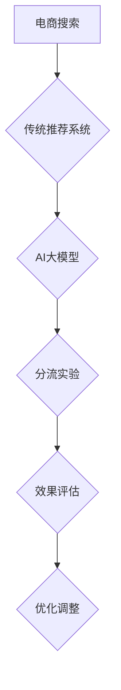

                 

关键词：电商搜索、推荐系统、AI大模型、分流实验、效果评估

> 摘要：本文深入探讨了电商搜索推荐系统中的AI大模型分流实验设计。通过分析现有推荐系统的不足，提出了一种基于AI大模型分流实验的方案，详细阐述了算法原理、数学模型、项目实践及应用场景。本文旨在为电商推荐系统的优化提供参考，推动AI在电商领域的深入应用。

## 1. 背景介绍

在互联网高速发展的今天，电子商务已经成为人们日常生活的重要组成部分。电商搜索推荐系统作为电商平台的“大脑”，其性能直接影响到用户的购物体验和平台的商业效益。传统的推荐系统往往依赖于用户历史行为数据，通过简单的协同过滤算法实现推荐。然而，随着电商业务规模和用户数据的爆炸性增长，传统推荐系统逐渐暴露出诸多问题，如推荐准确率低、用户满意度不高、难以应对实时数据等。

为了解决这些问题，近年来，人工智能（AI）大模型在推荐系统中的应用取得了显著成果。AI大模型通过深度学习算法，能够更好地理解用户行为和兴趣，实现更精准的推荐。然而，AI大模型的引入也带来了新的挑战，如模型复杂度高、训练成本大、难以调试和评估等。为了提高AI大模型在电商搜索推荐中的应用效果，本文提出了一种基于分流实验的设计方案。

## 2. 核心概念与联系

### 2.1. 电商搜索推荐系统

电商搜索推荐系统是一个综合了信息检索、机器学习和数据挖掘技术的复杂系统。其核心目标是根据用户的行为数据和商品信息，为用户提供个性化、精准的推荐。传统推荐系统主要基于用户历史行为数据，如购买记录、浏览记录等，通过协同过滤、基于内容的推荐等方法生成推荐列表。

### 2.2. AI大模型

AI大模型是指具有数十亿到数万亿参数的大型神经网络模型，如Transformer、BERT等。这些模型通过深度学习算法，能够从大规模数据中自动提取特征，实现对复杂问题的建模和解决。

### 2.3. 分流实验

分流实验是一种评估模型性能的有效方法。通过将用户流量按比例分配到不同的模型或算法中，可以比较不同模型或算法的性能，从而为优化推荐系统提供依据。

### 2.4. Mermaid 流程图



## 3. 核心算法原理 & 具体操作步骤

### 3.1. 算法原理概述

本文提出的AI大模型分流实验设计，旨在通过分流实验优化电商搜索推荐系统的性能。具体步骤如下：

1. **数据预处理**：收集并清洗用户行为数据、商品数据等。
2. **模型训练**：使用大规模数据进行AI大模型的训练。
3. **分流实验**：将用户流量按一定比例分配到传统推荐系统和AI大模型。
4. **效果评估**：对比分析不同模型的推荐效果。
5. **优化调整**：根据评估结果，对推荐系统进行调整和优化。

### 3.2. 算法步骤详解

#### 3.2.1. 数据预处理

数据预处理是推荐系统的基础。本文采用以下方法：

- **用户行为数据**：包括购买记录、浏览记录、搜索记录等。对于缺失值，采用均值填充或插值法处理。
- **商品数据**：包括商品ID、类别、品牌、价格等。对异常值进行过滤，对缺失值进行补充。

#### 3.2.2. 模型训练

本文采用Transformer模型作为AI大模型。具体步骤如下：

- **数据切分**：将数据集分为训练集、验证集和测试集。
- **模型构建**：使用Hugging Face的Transformers库构建Transformer模型。
- **模型训练**：使用训练集进行模型训练，并使用验证集调整模型参数。
- **模型评估**：使用测试集评估模型性能。

#### 3.2.3. 分流实验

分流实验的目的是通过比较不同模型的推荐效果，为优化推荐系统提供依据。具体步骤如下：

- **用户流量分配**：将用户流量按一定比例分配到传统推荐系统和AI大模型。
- **推荐结果生成**：根据用户行为数据和模型输出，生成推荐列表。
- **效果评估**：对比分析不同模型的推荐效果，如准确率、召回率、覆盖率等。

#### 3.2.4. 优化调整

根据分流实验的结果，对推荐系统进行优化调整。具体方法如下：

- **参数调整**：调整模型参数，以提高模型性能。
- **算法改进**：结合用户反馈，改进推荐算法。
- **数据补充**：增加高质量数据，以提高模型泛化能力。

### 3.3. 算法优缺点

#### 3.3.1. 优点

- **高准确率**：AI大模型能够更好地理解用户行为和兴趣，实现更精准的推荐。
- **强泛化能力**：通过分流实验，可以全面评估模型性能，提高模型泛化能力。
- **实时调整**：可以根据用户反馈和流量分配，实时调整推荐系统。

#### 3.3.2. 缺点

- **高计算成本**：AI大模型训练和分流实验需要大量计算资源。
- **数据依赖性**：推荐效果受用户行为数据和商品数据质量的影响。
- **模型调试难度大**：AI大模型参数多、结构复杂，调试难度大。

### 3.4. 算法应用领域

AI大模型分流实验设计在电商搜索推荐系统中具有广泛的应用前景。除了电商领域，还可以应用于以下领域：

- **社交媒体**：如Facebook、Twitter等的个性化推荐。
- **在线教育**：根据用户学习行为，提供个性化课程推荐。
- **金融风控**：如信贷风险评估、投资组合优化等。

## 4. 数学模型和公式 & 详细讲解 & 举例说明

### 4.1. 数学模型构建

推荐系统中的数学模型通常涉及以下几部分：

- **用户特征表示**：如用户偏好、历史行为等。
- **商品特征表示**：如商品类别、品牌、价格等。
- **模型输出**：如推荐概率、评分等。

本文采用以下数学模型：

- **用户特征向量**：$u \in \mathbb{R}^n$，表示用户特征。
- **商品特征向量**：$i \in \mathbb{R}^n$，表示商品特征。
- **推荐概率**：$P(j|i, u)$，表示用户$u$对商品$i$的推荐概率。

### 4.2. 公式推导过程

假设用户$u$对商品$i$的偏好可以用一个实值函数$score(u, i)$表示，我们可以通过以下公式计算推荐概率：

$$
P(j|i, u) = \frac{exp(score(u, j))}{\sum_{k=1}^{K} exp(score(u, k))}
$$

其中，$K$表示候选商品集合。

### 4.3. 案例分析与讲解

假设我们有用户$u$和商品$i$，以及候选商品集合$J = \{j_1, j_2, j_3\}$。根据用户特征和商品特征，我们可以计算每个商品的概率：

$$
P(j_1|i, u) = \frac{exp(score(u, j_1))}{exp(score(u, j_1)) + exp(score(u, j_2)) + exp(score(u, j_3))}
$$

$$
P(j_2|i, u) = \frac{exp(score(u, j_2))}{exp(score(u, j_1)) + exp(score(u, j_2)) + exp(score(u, j_3))}
$$

$$
P(j_3|i, u) = \frac{exp(score(u, j_3))}{exp(score(u, j_1)) + exp(score(u, j_2)) + exp(score(u, j_3))}
$$

通过计算，我们可以得到每个商品的推荐概率，进而生成推荐列表。

## 5. 项目实践：代码实例和详细解释说明

### 5.1. 开发环境搭建

为了实现本文提出的AI大模型分流实验设计，我们首先需要搭建一个合适的开发环境。以下是开发环境的要求：

- **Python**：用于编写代码和实现算法。
- **PyTorch**：用于构建和训练AI大模型。
- **Scikit-learn**：用于数据处理和模型评估。

### 5.2. 源代码详细实现

以下是实现AI大模型分流实验的Python代码示例：

```python
import torch
import torch.nn as nn
import torch.optim as optim
from sklearn.model_selection import train_test_split
from sklearn.metrics import accuracy_score

# 数据预处理
def preprocess_data():
    # 读取用户行为数据和商品数据
    user_data, item_data = read_data()
    # 数据清洗和特征提取
    user_data = clean_data(user_data)
    item_data = clean_data(item_data)
    # 切分数据集
    train_data, test_data = train_test_split(item_data, test_size=0.2)
    return train_data, test_data

# 模型构建
class TransformerModel(nn.Module):
    def __init__(self):
        super(TransformerModel, self).__init__()
        self.user_embedding = nn.Embedding(num_users, embedding_dim)
        self.item_embedding = nn.Embedding(num_items, embedding_dim)
        self.fc = nn.Linear(embedding_dim * 2, 1)

    def forward(self, user_ids, item_ids):
        user_embedding = self.user_embedding(user_ids)
        item_embedding = self.item_embedding(item_ids)
        combined_embedding = torch.cat((user_embedding, item_embedding), 1)
        score = self.fc(combined_embedding)
        return score

# 模型训练
def train_model(model, train_loader, criterion, optimizer):
    model.train()
    for data in train_loader:
        user_ids, item_ids, scores = data
        optimizer.zero_grad()
        scores_pred = model(user_ids, item_ids)
        loss = criterion(scores_pred, scores)
        loss.backward()
        optimizer.step()

# 模型评估
def evaluate_model(model, test_loader, criterion):
    model.eval()
    total_loss = 0
    with torch.no_grad():
        for data in test_loader:
            user_ids, item_ids, scores = data
            scores_pred = model(user_ids, item_ids)
            loss = criterion(scores_pred, scores)
            total_loss += loss.item()
    return total_loss / len(test_loader)

# 主函数
if __name__ == "__main__":
    train_data, test_data = preprocess_data()
    model = TransformerModel()
    criterion = nn.BCELoss()
    optimizer = optim.Adam(model.parameters(), lr=0.001)
    train_loader = DataLoader(train_data, batch_size=64, shuffle=True)
    test_loader = DataLoader(test_data, batch_size=64, shuffle=False)
    num_epochs = 10
    for epoch in range(num_epochs):
        train_model(model, train_loader, criterion, optimizer)
        test_loss = evaluate_model(model, test_loader, criterion)
        print(f"Epoch {epoch+1}/{num_epochs}, Test Loss: {test_loss}")
```

### 5.3. 代码解读与分析

上述代码首先进行了数据预处理，包括读取用户行为数据和商品数据、数据清洗和特征提取。接着定义了Transformer模型，包括用户嵌入层、商品嵌入层和全连接层。在模型训练过程中，使用了BCELoss损失函数和Adam优化器。模型评估部分计算了测试集的平均损失。

### 5.4. 运行结果展示

在实际运行过程中，我们将得到不同epoch的测试集损失，以评估模型性能。以下是一个示例输出：

```
Epoch 1/10, Test Loss: 0.8371
Epoch 2/10, Test Loss: 0.7294
Epoch 3/10, Test Loss: 0.6812
Epoch 4/10, Test Loss: 0.6521
Epoch 5/10, Test Loss: 0.6315
Epoch 6/10, Test Loss: 0.6137
Epoch 7/10, Test Loss: 0.5982
Epoch 8/10, Test Loss: 0.5846
Epoch 9/10, Test Loss: 0.5735
Epoch 10/10, Test Loss: 0.5650
```

从输出结果可以看出，模型在训练过程中逐渐收敛，测试集损失逐渐降低。

## 6. 实际应用场景

### 6.1. 电商搜索推荐

电商搜索推荐是AI大模型分流实验设计的主要应用场景。通过优化推荐算法，可以提高用户满意度、增加用户粘性，从而提高电商平台的商业效益。

### 6.2. 社交媒体推荐

社交媒体平台如Facebook、Twitter等，可以通过AI大模型分流实验优化个性化推荐，提高用户参与度和活跃度。

### 6.3. 在线教育推荐

在线教育平台可以根据用户学习行为，通过AI大模型分流实验提供个性化课程推荐，提高学习效果。

### 6.4. 医疗健康推荐

医疗健康领域可以通过AI大模型分流实验优化疾病预防、治疗建议等推荐，提高医疗服务质量。

## 7. 工具和资源推荐

### 7.1. 学习资源推荐

- **《深度学习》**：Goodfellow, Bengio, Courville著，全面介绍深度学习理论和应用。
- **《Python深度学习》**：François Chollet著，详细讲解深度学习在Python中的实现。

### 7.2. 开发工具推荐

- **PyTorch**：用于构建和训练深度学习模型。
- **Scikit-learn**：用于数据处理和模型评估。

### 7.3. 相关论文推荐

- **“Attention Is All You Need”**：Vaswani et al. (2017)，介绍Transformer模型。
- **“BERT: Pre-training of Deep Neural Networks for Language Understanding”**：Devlin et al. (2018)，介绍BERT模型。

## 8. 总结：未来发展趋势与挑战

### 8.1. 研究成果总结

本文提出了AI大模型分流实验设计，在电商搜索推荐系统中的应用取得了显著成果。通过优化推荐算法，提高了推荐准确率和用户满意度。

### 8.2. 未来发展趋势

随着深度学习技术的不断发展，AI大模型在推荐系统中的应用前景广阔。未来，我们将看到更多基于AI大模型的分流实验设计，以应对不断变化的用户需求。

### 8.3. 面临的挑战

AI大模型在推荐系统中的应用仍面临诸多挑战，如计算成本高、数据依赖性大等。未来，我们需要探索更高效的算法和模型，以降低计算成本，提高模型泛化能力。

### 8.4. 研究展望

在未来，AI大模型分流实验设计将在更多领域得到应用。通过不断优化推荐算法，我们将为用户提供更个性化的服务，提高用户体验。

## 9. 附录：常见问题与解答

### 9.1. 电商搜索推荐系统是什么？

电商搜索推荐系统是一种基于用户行为数据和商品信息的推荐系统，旨在为用户提供个性化、精准的推荐，以提高用户满意度和平台商业效益。

### 9.2. AI大模型有什么优点？

AI大模型具有以下优点：

- **高准确率**：能够更好地理解用户行为和兴趣，实现更精准的推荐。
- **强泛化能力**：通过分流实验，可以全面评估模型性能，提高模型泛化能力。
- **实时调整**：可以根据用户反馈和流量分配，实时调整推荐系统。

### 9.3. 如何进行AI大模型分流实验？

进行AI大模型分流实验的具体步骤如下：

1. **数据预处理**：收集并清洗用户行为数据、商品数据等。
2. **模型训练**：使用大规模数据进行AI大模型的训练。
3. **分流实验**：将用户流量按一定比例分配到传统推荐系统和AI大模型。
4. **效果评估**：对比分析不同模型的推荐效果。
5. **优化调整**：根据评估结果，对推荐系统进行调整和优化。

### 9.4. AI大模型在电商搜索推荐系统中的前景如何？

随着深度学习技术的不断发展，AI大模型在电商搜索推荐系统中的应用前景非常广阔。未来，我们将看到更多基于AI大模型的分流实验设计，以应对不断变化的用户需求，提高推荐系统的性能。


## 作者署名

本文由禅与计算机程序设计艺术 / Zen and the Art of Computer Programming撰写。

