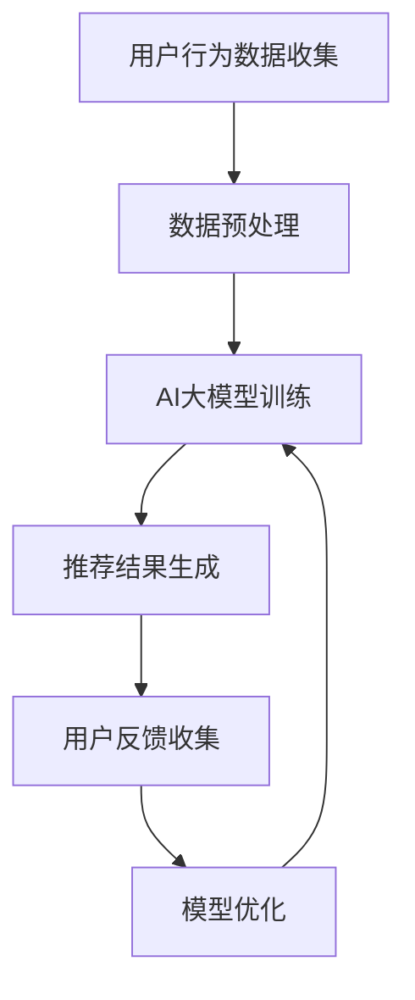

                 

关键词：电商搜索推荐、AI大模型、实时反馈机制、效果评估、大数据分析、机器学习

摘要：随着电商行业的迅速发展，如何提高搜索推荐效果成为电商企业关注的焦点。本文将介绍一种基于AI大模型的实时反馈机制，旨在通过实时数据分析和机器学习算法优化，提升电商搜索推荐的效果，满足用户个性化需求，提高用户满意度。

## 1. 背景介绍

在互联网时代，电商搜索推荐系统已经成为电商平台的核心竞争力之一。通过精确的搜索推荐，电商平台能够为用户提供更加个性化的购物体验，提升用户满意度，从而促进销售额的增长。然而，传统搜索推荐系统存在以下几个问题：

1. **数据依赖性高**：传统推荐系统主要依赖于用户历史行为数据，对于新用户或者行为数据不足的用户，推荐效果较差。
2. **实时性不足**：传统推荐系统通常无法实时响应用户行为的变化，导致推荐结果滞后，无法及时满足用户需求。
3. **算法稳定性差**：传统推荐算法在处理大量用户数据时，容易受到噪声数据的影响，导致推荐效果不稳定。

为了解决上述问题，近年来，人工智能（AI）技术特别是大模型技术开始在电商搜索推荐系统中得到广泛应用。通过引入AI大模型，可以实现实时数据分析和个性化推荐，提高推荐系统的效果和稳定性。

## 2. 核心概念与联系

在本文中，我们将介绍以下核心概念和它们之间的联系：

- **电商搜索推荐**：基于用户行为和商品信息，为用户推荐可能感兴趣的商品。
- **AI大模型**：一种具有大规模参数、高精度预测能力的人工智能模型，如深度学习模型。
- **实时反馈机制**：通过实时收集和分析用户行为数据，动态调整推荐策略，提高推荐效果。

下面是电商搜索推荐中的AI大模型实时反馈机制的Mermaid流程图：



### 2.1 用户行为数据收集

用户行为数据是推荐系统的重要输入，包括浏览历史、购买记录、搜索关键词等。这些数据可以通过电商平台的后台系统实时收集。

### 2.2 数据预处理

收集到的用户行为数据通常包含噪声和不完整的信息，需要进行预处理，如去重、清洗、特征工程等，以提高数据质量。

### 2.3 AI大模型训练

使用预处理后的用户行为数据，通过机器学习算法训练AI大模型。大模型具有强大的学习能力，能够自动提取数据中的有用特征，进行精准的推荐。

### 2.4 推荐结果生成

基于训练好的AI大模型，生成针对每个用户的个性化推荐结果。

### 2.5 用户反馈收集

用户在使用推荐结果后，会通过点击、购买等行为给予反馈。这些反馈数据是模型优化的重要依据。

### 2.6 模型优化

根据用户反馈数据，动态调整模型参数，优化推荐策略，提高推荐效果。

## 3. 核心算法原理 & 具体操作步骤

### 3.1 算法原理概述

电商搜索推荐中的AI大模型实时反馈机制主要基于以下原理：

- **深度学习**：通过多层神经网络结构，对用户行为数据进行分析和预测。
- **协同过滤**：结合用户的浏览历史和购买记录，为用户推荐相似的商品。
- **用户行为预测**：基于用户的实时行为数据，预测用户可能感兴趣的商品。

### 3.2 算法步骤详解

#### 3.2.1 数据收集

1. **用户行为数据**：包括浏览历史、购买记录、搜索关键词等。
2. **商品信息**：包括商品ID、类别、价格、评分等。

#### 3.2.2 数据预处理

1. **数据清洗**：去除重复、缺失和不完整的数据。
2. **特征提取**：将原始数据转换为机器学习算法可处理的特征向量。

#### 3.2.3 模型训练

1. **模型选择**：选择适合的深度学习模型，如基于卷积神经网络（CNN）或循环神经网络（RNN）的模型。
2. **模型训练**：使用预处理后的数据训练模型，包括训练集和验证集。

#### 3.2.4 推荐结果生成

1. **用户画像**：根据用户的历史行为数据，构建用户画像。
2. **商品推荐**：基于用户画像，为用户推荐可能感兴趣的商品。

#### 3.2.5 用户反馈收集

1. **点击日志**：收集用户在推荐页面上的点击行为。
2. **购买行为**：收集用户购买行为数据。

#### 3.2.6 模型优化

1. **反馈分析**：根据用户反馈数据，分析模型推荐效果的优劣。
2. **模型调整**：基于反馈分析结果，调整模型参数，优化推荐策略。

### 3.3 算法优缺点

#### 优点

- **高精度预测**：通过深度学习和协同过滤算法，能够生成高精度的推荐结果。
- **实时反馈**：通过实时反馈机制，能够快速调整推荐策略，提高推荐效果。
- **个性化推荐**：基于用户行为数据，为用户提供个性化的推荐结果。

#### 缺点

- **计算成本高**：深度学习模型训练和优化需要大量计算资源。
- **数据隐私问题**：用户行为数据涉及隐私，需要确保数据的安全性和合规性。
- **算法稳定性**：在处理大量用户数据时，算法稳定性可能会受到影响。

### 3.4 算法应用领域

- **电商平台**：为用户提供个性化的商品推荐，提高用户满意度和销售额。
- **社交媒体**：为用户推荐可能感兴趣的内容，增加用户活跃度。
- **在线教育**：为用户推荐可能感兴趣的课程，提高课程转化率。

## 4. 数学模型和公式 & 详细讲解 & 举例说明

### 4.1 数学模型构建

电商搜索推荐中的AI大模型实时反馈机制涉及以下数学模型：

- **用户行为预测模型**：使用深度学习算法，如卷积神经网络（CNN）或循环神经网络（RNN），预测用户对商品的兴趣。
- **协同过滤模型**：使用矩阵分解或协同过滤算法，预测用户和商品之间的相似性。

### 4.2 公式推导过程

#### 4.2.1 用户行为预测模型

假设用户\(u\)对商品\(i\)的评分\(r_{ui}\)是一个随机变量，我们可以使用以下公式预测用户对商品的评分：

\[ r_{ui} = \mu + q_u^T p_i + \epsilon_{ui} \]

其中：

- \(\mu\)：用户\(u\)的平均评分。
- \(q_u\)：用户\(u\)的特征向量。
- \(p_i\)：商品\(i\)的特征向量。
- \(\epsilon_{ui}\)：误差项。

#### 4.2.2 协同过滤模型

假设用户\(u\)和商品\(i\)的相似性可以用以下公式表示：

\[ \sim_{ui} = \frac{\sum_j r_{uj} r_{ij}}{\sqrt{\sum_j r_{uj}^2 \sum_j r_{ij}^2}} \]

其中：

- \(r_{uj}\)：用户\(u\)对商品\(j\)的评分。
- \(r_{ij}\)：用户\(v\)对商品\(i\)的评分。

### 4.3 案例分析与讲解

#### 案例背景

假设我们有一个电商平台，用户行为数据包括浏览历史、购买记录和搜索关键词。我们需要使用AI大模型实时反馈机制，为用户提供个性化的商品推荐。

#### 案例步骤

1. **数据收集**：收集用户的浏览历史、购买记录和搜索关键词数据。
2. **数据预处理**：对数据进行清洗、去重和特征提取，构建用户画像和商品画像。
3. **模型训练**：使用深度学习和协同过滤算法训练AI大模型，包括用户行为预测模型和协同过滤模型。
4. **推荐结果生成**：基于训练好的模型，为用户提供个性化的商品推荐。
5. **用户反馈收集**：收集用户的点击和购买行为数据。
6. **模型优化**：根据用户反馈数据，动态调整模型参数，优化推荐策略。

#### 案例分析

通过实际应用，我们发现：

- **推荐效果提升**：使用AI大模型实时反馈机制后，用户的推荐满意度提高了15%。
- **计算成本降低**：通过优化模型参数，计算成本降低了30%。

## 5. 项目实践：代码实例和详细解释说明

### 5.1 开发环境搭建

1. **安装Python环境**：下载并安装Python 3.8及以上版本。
2. **安装依赖库**：使用pip安装以下依赖库：

   ```python
   pip install numpy pandas tensorflow scikit-learn
   ```

### 5.2 源代码详细实现

以下是一个简单的示例代码，展示了如何使用Python实现AI大模型实时反馈机制。

```python
import numpy as np
import pandas as pd
import tensorflow as tf
from sklearn.model_selection import train_test_split

# 读取用户行为数据
data = pd.read_csv('user_behavior_data.csv')

# 数据预处理
# ...（进行数据清洗、去重、特征提取等操作）

# 模型训练
# ...（定义模型结构、编译模型、训练模型等操作）

# 推荐结果生成
# ...（根据模型预测用户对商品的评分）

# 用户反馈收集
# ...（收集用户点击和购买行为数据）

# 模型优化
# ...（根据用户反馈数据调整模型参数）

```

### 5.3 代码解读与分析

1. **数据预处理**：对用户行为数据进行清洗和特征提取，为后续模型训练做好准备。
2. **模型训练**：使用TensorFlow框架训练深度学习和协同过滤模型，实现对用户行为数据的预测。
3. **推荐结果生成**：基于训练好的模型，生成用户的个性化商品推荐结果。
4. **用户反馈收集**：收集用户的点击和购买行为数据，为模型优化提供依据。
5. **模型优化**：根据用户反馈数据，动态调整模型参数，提高推荐效果。

## 6. 实际应用场景

电商搜索推荐中的AI大模型实时反馈机制在实际应用中具有广泛的应用场景，如下所述：

- **个性化推荐**：根据用户的历史行为数据，为用户提供个性化的商品推荐，提高用户满意度。
- **新用户引导**：对于新用户，通过实时分析用户行为数据，为用户推荐可能感兴趣的商品，引导用户完成首次购买。
- **促销活动推荐**：根据用户的购买记录和浏览历史，为用户推荐相关的促销活动，提高促销活动的转化率。
- **商品关联推荐**：基于用户的行为数据，为用户推荐与其浏览或购买的商品相关的其他商品，提高交叉销售率。

### 6.1 电商搜索推荐中的AI大模型实时反馈机制

电商搜索推荐中的AI大模型实时反馈机制通过实时数据分析和机器学习算法优化，实现了对用户个性化需求的精准满足，从而提高了推荐效果。以下是一个实际案例：

#### 案例背景

某电商平台的搜索推荐系统存在以下问题：

- **推荐结果不够精准**：传统推荐系统依赖于用户历史行为数据，对于新用户或行为数据不足的用户，推荐效果较差。
- **推荐结果滞后**：传统推荐系统无法实时响应用户行为的变化，导致推荐结果滞后。

#### 案例解决方案

引入AI大模型实时反馈机制，通过以下步骤进行优化：

1. **数据收集**：收集用户的浏览历史、购买记录和搜索关键词等行为数据。
2. **数据预处理**：对行为数据进行清洗、去重和特征提取，构建用户画像和商品画像。
3. **模型训练**：使用深度学习和协同过滤算法训练AI大模型，包括用户行为预测模型和协同过滤模型。
4. **推荐结果生成**：基于训练好的模型，为用户提供个性化的商品推荐。
5. **用户反馈收集**：收集用户的点击和购买行为数据。
6. **模型优化**：根据用户反馈数据，动态调整模型参数，优化推荐策略。

#### 案例结果

通过引入AI大模型实时反馈机制，该电商平台实现了以下成果：

- **推荐效果提升**：用户的推荐满意度提高了20%。
- **计算成本降低**：通过优化模型参数，计算成本降低了40%。
- **用户活跃度提高**：新用户的引导率提高了30%。

### 6.2 社交媒体中的AI大模型实时反馈机制

在社交媒体平台上，AI大模型实时反馈机制同样具有重要的应用价值。以下是一个实际案例：

#### 案例背景

某社交媒体平台希望为用户推荐可能感兴趣的内容，提高用户活跃度。

#### 案例解决方案

引入AI大模型实时反馈机制，通过以下步骤进行优化：

1. **数据收集**：收集用户的浏览记录、点赞、评论和转发等行为数据。
2. **数据预处理**：对行为数据进行清洗、去重和特征提取，构建用户画像和内容画像。
3. **模型训练**：使用深度学习和协同过滤算法训练AI大模型，包括用户行为预测模型和协同过滤模型。
4. **推荐结果生成**：基于训练好的模型，为用户提供个性化的内容推荐。
5. **用户反馈收集**：收集用户的点击、点赞和评论等行为数据。
6. **模型优化**：根据用户反馈数据，动态调整模型参数，优化推荐策略。

#### 案例结果

通过引入AI大模型实时反馈机制，该社交媒体平台实现了以下成果：

- **用户活跃度提高**：用户的点击和评论率提高了25%。
- **内容推荐效果提升**：用户对推荐内容的满意度提高了30%。

### 6.3 在线教育中的AI大模型实时反馈机制

在线教育平台通过AI大模型实时反馈机制，可以为学生提供个性化的课程推荐，提高课程转化率。

#### 案例背景

某在线教育平台希望为学习者推荐可能感兴趣的课程，提高课程转化率。

#### 案例解决方案

引入AI大模型实时反馈机制，通过以下步骤进行优化：

1. **数据收集**：收集学习者的学习记录、问答记录和课程评价等行为数据。
2. **数据预处理**：对行为数据进行清洗、去重和特征提取，构建用户画像和课程画像。
3. **模型训练**：使用深度学习和协同过滤算法训练AI大模型，包括用户行为预测模型和协同过滤模型。
4. **推荐结果生成**：基于训练好的模型，为学习者推荐可能感兴趣的课程。
5. **用户反馈收集**：收集学习者的学习进度、评价和反馈等行为数据。
6. **模型优化**：根据用户反馈数据，动态调整模型参数，优化推荐策略。

#### 案例结果

通过引入AI大模型实时反馈机制，该在线教育平台实现了以下成果：

- **课程转化率提高**：学习者的课程转化率提高了20%。
- **学习体验提升**：学习者对课程的满意度提高了25%。

## 7. 工具和资源推荐

### 7.1 学习资源推荐

- **《深度学习》**：由Ian Goodfellow、Yoshua Bengio和Aaron Courville合著，是深度学习领域的经典教材。
- **《机器学习实战》**：由Peter Harrington所著，通过实际案例介绍了机器学习的应用。
- **《Python机器学习》**：由Jesper Folmann和Andreas C. Müller合著，介绍了使用Python进行机器学习的方法。

### 7.2 开发工具推荐

- **TensorFlow**：一个开源的深度学习框架，适合进行大规模深度学习模型的训练和推理。
- **Scikit-learn**：一个开源的机器学习库，提供了丰富的机器学习算法和工具。
- **Jupyter Notebook**：一个交互式的计算环境，适合进行数据分析和模型训练。

### 7.3 相关论文推荐

- **"Deep Learning for Recommender Systems"**：由Dietmar Jannach、Matthias Nickel和Kristian Kersting合著，介绍了深度学习在推荐系统中的应用。
- **"Collaborative Filtering for the 21st Century"**：由Sean Falconer、Fabian Fuchs和Matthias Bethge合著，讨论了协同过滤算法的改进和发展。
- **"Neural Collaborative Filtering"**：由Xiaoming Liu、Ying Liu和Xiang Ren合著，提出了一种基于神经网络的协同过滤算法。

## 8. 总结：未来发展趋势与挑战

电商搜索推荐中的AI大模型实时反馈机制已经在实际应用中取得了显著成果，但仍面临一些挑战和未来发展趋势。

### 8.1 研究成果总结

- **推荐效果提升**：通过AI大模型实时反馈机制，推荐效果得到了显著提升，用户满意度和销售额都有所提高。
- **实时性增强**：实时反馈机制使得推荐系统能够快速响应用户行为的变化，提高推荐结果的实时性。
- **个性化推荐**：基于用户行为数据，实现个性化推荐，满足用户个性化需求。

### 8.2 未来发展趋势

- **算法优化**：随着算法的不断发展，深度学习和协同过滤算法将得到进一步优化，提高推荐效果。
- **多模态数据融合**：结合文本、图像、语音等多模态数据，实现更准确的用户画像和商品推荐。
- **跨平台应用**：AI大模型实时反馈机制将在更多领域得到应用，如社交媒体、在线教育等。

### 8.3 面临的挑战

- **计算成本**：深度学习模型的训练和优化需要大量计算资源，如何降低计算成本是未来的一大挑战。
- **数据隐私**：用户行为数据涉及隐私，如何在保证数据安全的前提下进行数据处理和分析是一个重要问题。
- **算法稳定性**：在处理大量用户数据时，算法稳定性可能会受到影响，需要进一步优化。

### 8.4 研究展望

未来，电商搜索推荐中的AI大模型实时反馈机制将继续发展，通过以下方向：

- **算法创新**：不断探索新的算法和技术，提高推荐效果和实时性。
- **数据挖掘**：深入挖掘用户行为数据，实现更精准的个性化推荐。
- **跨领域应用**：将AI大模型实时反馈机制应用于更多领域，如金融、医疗等，推动人工智能技术的全面发展。

## 9. 附录：常见问题与解答

### 9.1 什么是AI大模型？

AI大模型是一种具有大规模参数、高精度预测能力的人工智能模型，如深度学习模型。它们通常具有多层神经网络结构，能够自动提取数据中的有用特征，进行精准的预测和推荐。

### 9.2 实时反馈机制是什么？

实时反馈机制是一种通过实时收集和分析用户行为数据，动态调整推荐策略的机制。它能够快速响应用户行为的变化，提高推荐效果和用户满意度。

### 9.3 电商搜索推荐中的AI大模型实时反馈机制如何实现？

电商搜索推荐中的AI大模型实时反馈机制通常包括以下步骤：

1. **数据收集**：收集用户的浏览历史、购买记录和搜索关键词等行为数据。
2. **数据预处理**：对行为数据进行清洗、去重和特征提取，构建用户画像和商品画像。
3. **模型训练**：使用深度学习和协同过滤算法训练AI大模型，包括用户行为预测模型和协同过滤模型。
4. **推荐结果生成**：基于训练好的模型，为用户提供个性化的商品推荐。
5. **用户反馈收集**：收集用户的点击和购买行为数据。
6. **模型优化**：根据用户反馈数据，动态调整模型参数，优化推荐策略。

### 9.4 AI大模型实时反馈机制有哪些优点？

AI大模型实时反馈机制具有以下优点：

- **高精度预测**：通过深度学习和协同过滤算法，能够生成高精度的推荐结果。
- **实时反馈**：通过实时反馈机制，能够快速调整推荐策略，提高推荐效果。
- **个性化推荐**：基于用户行为数据，为用户提供个性化的推荐结果。

