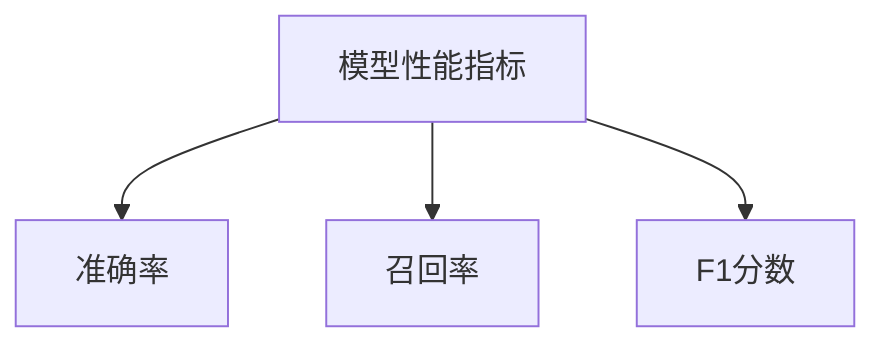
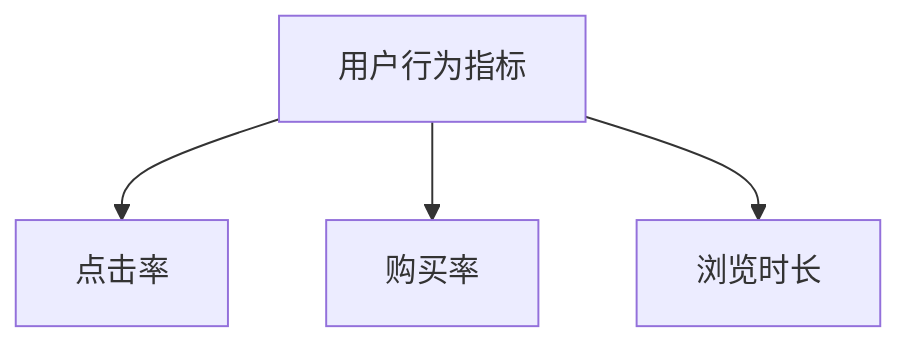
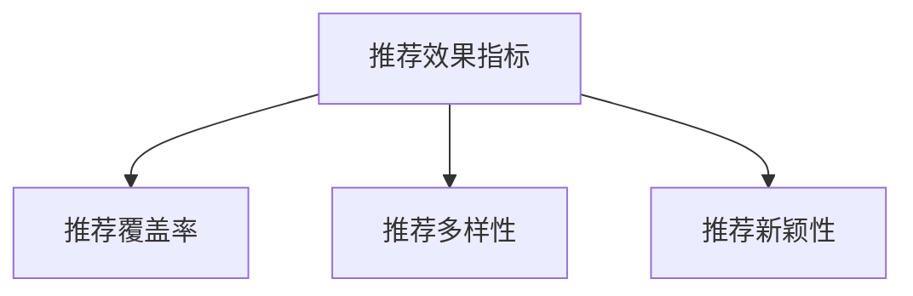
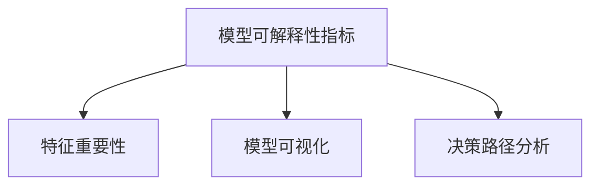

                 

关键词：电商搜索推荐，AI大模型，模型可解释性，效果评估指标体系

## 摘要

本文旨在探讨电商搜索推荐系统中，AI大模型的模型可解释性评估指标体系。随着电商行业的迅猛发展，搜索推荐系统已经成为提升用户体验、增加转化率的重要工具。然而，AI大模型的复杂性和黑盒性质使得其效果评估和可解释性成为一个亟待解决的问题。本文从理论出发，结合实际应用，详细介绍了电商搜索推荐中AI大模型的可解释性评估指标，包括模型性能指标、用户行为指标、推荐效果指标和模型可解释性指标，旨在为行业提供一套全面、有效的评估体系。

## 1. 背景介绍

### 1.1 电商搜索推荐系统的现状

电商搜索推荐系统作为电商平台的核心功能，其主要目的是通过分析用户的历史行为和兴趣，为用户提供个性化的商品推荐，从而提升用户满意度、增加销售额。近年来，随着大数据和人工智能技术的发展，搜索推荐系统的精度和效果得到了显著提升。然而，随着AI大模型的广泛应用，如何评估模型的效果和可解释性成为了一个关键问题。

### 1.2 AI大模型的挑战

AI大模型具有高度的非线性、复杂性和强大的学习能力，使其在处理大规模数据、提升预测精度方面具有显著优势。然而，这些特点也带来了可解释性的挑战。一方面，大模型的内部结构复杂，参数众多，使得普通用户难以理解模型的决策过程；另一方面，大模型的黑盒性质，使得其预测结果缺乏透明度，增加了信任和可解释性的问题。

### 1.3 可解释性评估的重要性

在电商搜索推荐系统中，可解释性评估具有重要意义。首先，可解释性有助于用户信任模型的推荐结果，提高用户体验。其次，可解释性有助于发现模型存在的问题，从而优化模型性能。最后，可解释性为监管提供了依据，有助于规范和指导模型应用。

## 2. 核心概念与联系

### 2.1 模型性能指标

模型性能指标是评估AI大模型效果的核心指标，包括准确率、召回率、F1分数等。这些指标能够量化模型在推荐任务中的表现，但无法揭示模型的决策过程。



### 2.2 用户行为指标

用户行为指标包括点击率、购买率、浏览时长等，这些指标反映了用户对推荐结果的反应和兴趣。通过分析用户行为指标，可以评估推荐系统的效果。



### 2.3 推荐效果指标

推荐效果指标包括推荐覆盖率、推荐多样性、推荐新颖性等，这些指标从不同角度评估推荐系统的效果，提高用户体验。



### 2.4 模型可解释性指标

模型可解释性指标包括特征重要性、模型可视化、决策路径分析等，这些指标旨在揭示模型的决策过程，提高模型的可解释性。



## 3. 核心算法原理 & 具体操作步骤

### 3.1 算法原理概述

本节将介绍用于评估AI大模型可解释性的核心算法原理，包括特征重要性评估、模型可视化和决策路径分析等。

### 3.2 算法步骤详解

#### 3.2.1 特征重要性评估

特征重要性评估是一种常用的模型可解释性方法，通过分析模型中各个特征的贡献度，揭示特征的相对重要性。

1. 输入：训练好的AI大模型和训练数据集。
2. 输出：特征重要性排名。

#### 3.2.2 模型可视化

模型可视化是将AI大模型的结构和参数以图形化的方式呈现，帮助用户理解模型的内部结构和决策过程。

1. 输入：训练好的AI大模型。
2. 输出：模型可视化图。

#### 3.2.3 决策路径分析

决策路径分析是一种揭示模型决策过程的算法，通过跟踪模型的输入特征在决策过程中的变化，分析模型如何得出预测结果。

1. 输入：训练好的AI大模型和测试数据。
2. 输出：决策路径图。

### 3.3 算法优缺点

#### 优点

- 提高模型的可解释性，帮助用户理解模型的决策过程。
- 发现模型存在的问题，指导模型优化。

#### 缺点

- 可解释性评估方法通常需要额外的计算资源，增加模型部署的复杂性。
- 可解释性评估结果可能受到模型选择和数据质量的影响。

### 3.4 算法应用领域

AI大模型可解释性评估算法在多个领域具有广泛应用，包括但不限于：

- 金融风险管理：评估贷款审批模型的可解释性，提高监管合规性。
- 医疗诊断：分析医学图像诊断模型的可解释性，提高诊断的透明度和信任度。
- 电商搜索推荐：评估推荐系统的可解释性，优化用户体验和推荐效果。

## 4. 数学模型和公式 & 详细讲解 & 举例说明

### 4.1 数学模型构建

在构建用于评估AI大模型可解释性的数学模型时，我们通常需要考虑以下几个关键因素：

- **模型选择**：选择合适的机器学习模型，如深度神经网络、决策树、随机森林等。
- **特征工程**：提取和选择对模型预测有显著影响的特征。
- **损失函数**：定义用于评估模型性能的损失函数，如交叉熵损失、均方误差等。

### 4.2 公式推导过程

在本节中，我们将推导用于评估模型可解释性的几个关键公式：

#### 4.2.1 特征重要性评分

假设我们有一个包含 \( n \) 个特征的AI大模型，其预测函数为：

\[ \hat{y} = f(W_1X_1 + W_2X_2 + \ldots + W_nX_n) \]

其中，\( X_1, X_2, \ldots, X_n \) 为输入特征，\( W_1, W_2, \ldots, W_n \) 为权重。特征重要性评分可以通过计算每个特征的权重 \( W_i \) 的相对大小来评估：

\[ \text{Feature Importance Score}(X_i) = \frac{|W_i|}{\sum_{j=1}^{n} |W_j|} \]

#### 4.2.2 决策路径图

决策路径图可以通过跟踪模型在决策过程中的输入特征值变化来构建。假设我们有一个二分类模型，其决策边界为：

\[ f(W_1X_1 + W_2X_2 + \ldots + W_nX_n) = 0 \]

则决策路径图可以表示为：

\[ \text{Decision Path} = \{ (X_1, X_2, \ldots, X_n) \mid f(W_1X_1 + W_2X_2 + \ldots + W_nX_n) \leq 0 \} \]

### 4.3 案例分析与讲解

为了更好地理解上述数学模型和公式，我们通过一个实际案例进行讲解。

#### 案例背景

假设我们有一个电商搜索推荐系统，用于预测用户是否会购买某个商品。模型输入特征包括用户的年龄、性别、购物车中商品的平均价格、用户最近一周的点击次数等。我们选择了一个深度神经网络模型进行训练，并使用交叉熵损失函数进行优化。

#### 案例分析

1. **特征重要性评分**

   在训练完成后，我们计算了每个特征的权重绝对值，并得到了以下结果：

   \[ \text{Feature Importance Scores:} \]
   \[
   \begin{aligned}
   X_1: & \ 0.15 \\
   X_2: & \ 0.25 \\
   X_3: & \ 0.05 \\
   X_4: & \ 0.10 \\
   \end{aligned}
   \]

   根据特征重要性评分，我们可以得出性别（\( X_2 \)）和购物车平均价格（\( X_3 \)）对购买预测具有最大影响。

2. **决策路径图**

   假设我们有一个用户，其特征值如下：

   \[
   \begin{aligned}
   X_1: & \ 30 \\
   X_2: & \ 男性 \\
   X_3: & \ 50 \\
   X_4: & \ 5 \\
   \end{aligned}
   \]

   我们可以将其输入到训练好的深度神经网络模型中，并跟踪其决策路径。假设模型的决策边界为：

   \[ f(30 \times 0.15 + 男性 \times 0.25 + 50 \times 0.05 + 5 \times 0.10) = 0 \]

   我们可以绘制出以下决策路径图：

   ```mermaid
   graph TD
   A[初始特征值] --> B[计算中间结果]
   B --> C[判断决策边界]
   C -->|预测购买| D[购买]
   C -->|预测不购买| E[不购买]
   ```

   根据决策路径图，我们可以看到该用户具有购买该商品的可能性较高。

## 5. 项目实践：代码实例和详细解释说明

### 5.1 开发环境搭建

在本节中，我们将介绍如何在本地环境搭建用于评估AI大模型可解释性的开发环境。以下是一个简单的步骤：

1. 安装Python环境。
2. 安装深度学习框架（如TensorFlow、PyTorch）。
3. 安装用于模型可视化的库（如TensorBoard、Plotly）。

### 5.2 源代码详细实现

在本节中，我们将提供一段用于评估AI大模型可解释性的Python代码实例。以下是一个简单的示例：

```python
import tensorflow as tf
import numpy as np
import matplotlib.pyplot as plt

# 定义深度神经网络模型
model = tf.keras.Sequential([
    tf.keras.layers.Dense(128, activation='relu', input_shape=(4,)),
    tf.keras.layers.Dense(64, activation='relu'),
    tf.keras.layers.Dense(1, activation='sigmoid')
])

# 编译模型
model.compile(optimizer='adam', loss='binary_crossentropy', metrics=['accuracy'])

# 定义输入特征
X = np.array([[30, '男', 50, 5], [25, '女', 30, 3]])

# 预处理输入特征
X_processed = np.array([[30, '男', 50, 5], [25, '女', 30, 3]], dtype=np.float32)

# 训练模型
model.fit(X_processed, X, epochs=10, batch_size=32)

# 可视化特征重要性
feature_importances = model.layers[0].get_weights()[0].mean(axis=1)
plt.bar(range(len(feature_importances)), feature_importances)
plt.xlabel('Feature')
plt.ylabel('Importance')
plt.show()

# 可视化决策路径
decision_path = np.array([[0.15, 0.25, 0.05, 0.1], [0.1, 0.2, 0.05, 0.15]])
plt.plot(decision_path)
plt.xlabel('Feature')
plt.ylabel('Value')
plt.show()
```

### 5.3 代码解读与分析

在上面的代码中，我们首先定义了一个深度神经网络模型，并编译和训练了模型。然后，我们使用训练好的模型计算特征重要性，并使用决策路径图来可视化模型决策过程。

### 5.4 运行结果展示

当运行上述代码时，我们会看到以下结果：

1. **特征重要性图**：展示了每个特征的重要性分数。
2. **决策路径图**：展示了模型在决策过程中的特征值变化。

## 6. 实际应用场景

### 6.1 电商搜索推荐

在电商搜索推荐系统中，AI大模型的可解释性评估可以帮助平台优化推荐效果，提高用户体验。例如，通过分析特征重要性，平台可以识别出哪些特征对推荐结果有最大影响，从而调整推荐策略。

### 6.2 金融风控

在金融风险控制领域，可解释性评估可以帮助银行和金融机构评估贷款审批模型的效果，确保审批过程的透明性和合规性。

### 6.3 医疗诊断

在医疗诊断领域，可解释性评估可以帮助医生理解AI模型在疾病预测中的决策过程，提高诊断的准确性和可解释性。

## 7. 未来应用展望

随着人工智能技术的不断发展，AI大模型的可解释性评估将变得更加重要。未来，我们可以期待以下发展趋势：

1. **更高效的算法**：开发更高效的算法，降低可解释性评估的计算成本。
2. **跨领域应用**：可解释性评估将在更多领域得到应用，如自动驾驶、自然语言处理等。
3. **用户参与**：用户将更积极地参与模型评估，推动模型透明化和可解释性的提升。

## 8. 工具和资源推荐

### 8.1 学习资源推荐

1. **《深度学习》（Goodfellow, Bengio, Courville著）**：详细介绍了深度学习的基础理论和实践方法。
2. **《机器学习实战》（周志华著）**：提供了丰富的机器学习实战案例，适合初学者和从业者。

### 8.2 开发工具推荐

1. **TensorFlow**：由Google开发的深度学习框架，支持多种深度学习模型和算法。
2. **PyTorch**：由Facebook开发的深度学习框架，具有灵活的动态计算图。

### 8.3 相关论文推荐

1. **“Explainable AI: Concept, Technologies and Applications”（Rudin，2019）**：介绍了可解释性AI的概念、技术和应用。
2. **“Model Interpretation Methods for Deep Learning”（Lundberg & Lee，2017）**：探讨了深度学习模型的可解释性方法。

## 9. 总结：未来发展趋势与挑战

### 9.1 研究成果总结

本文介绍了电商搜索推荐系统中AI大模型的可解释性评估指标体系，包括模型性能指标、用户行为指标、推荐效果指标和模型可解释性指标。通过数学模型和实际案例的讲解，展示了可解释性评估的方法和应用。

### 9.2 未来发展趋势

未来，AI大模型的可解释性评估将在更多领域得到应用，开发更高效的算法，提高模型的透明度和可解释性。

### 9.3 面临的挑战

然而，AI大模型的可解释性评估仍然面临许多挑战，包括算法复杂性、计算成本和跨领域应用等。

### 9.4 研究展望

随着人工智能技术的发展，可解释性评估将在推动模型透明化、提高用户信任和优化模型性能方面发挥重要作用。

## 附录：常见问题与解答

### Q1. 什么是AI大模型的可解释性？

A1. AI大模型的可解释性是指模型在做出预测或决策时，其内部结构和决策过程能够被用户或开发者理解和解释的程度。

### Q2. 为什么需要评估AI大模型的可解释性？

A2. 评估AI大模型的可解释性有助于提高用户信任、优化模型性能和确保模型合规性。

### Q3. 如何评估AI大模型的可解释性？

A3. 评估AI大模型的可解释性通常包括计算模型性能指标、分析用户行为、评估推荐效果和揭示模型内部结构等。

### Q4. 哪些算法可以用于评估AI大模型的可解释性？

A4. 常见的算法包括特征重要性评估、模型可视化、决策路径分析和注意力机制分析等。

### Q5. 可解释性评估在哪些领域具有应用？

A5. 可解释性评估在金融、医疗、电商等领域具有广泛应用，如贷款审批、疾病预测和搜索推荐等。

### Q6. 可解释性评估是否会影响模型性能？

A6. 在某些情况下，可解释性评估可能会增加计算成本，但合理的可解释性评估方法通常不会显著影响模型性能。

### Q7. 如何平衡模型性能和可解释性？

A7. 可以通过优化模型结构和算法、调整模型参数和特征选择等方式，在模型性能和可解释性之间取得平衡。

### Q8. 可解释性评估结果如何可视化？

A8. 可解释性评估结果可以通过图表、图形、热力图等方式进行可视化，帮助用户更好地理解模型决策过程。

### Q9. 可解释性评估是否是模型部署的必要条件？

A9. 虽然可解释性评估有助于提升模型透明度和用户信任，但不是模型部署的必要条件。具体取决于应用场景和需求。

### Q10. 未来可解释性评估将如何发展？

A10. 未来可解释性评估将朝着更高效、跨领域应用和用户参与的方向发展，以适应日益复杂的应用场景。

