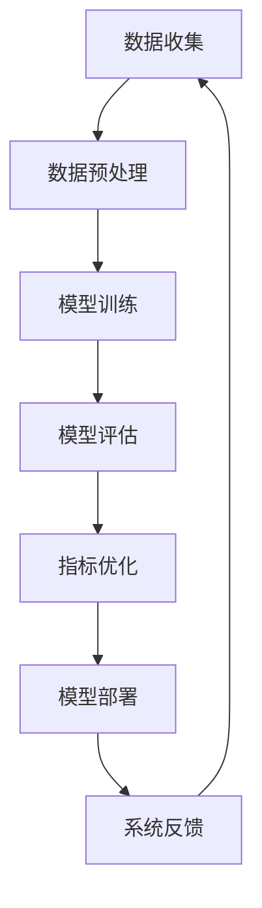

                 

关键词：电商搜索、推荐系统、效果评估、AI大模型、离线指标优化、机器学习

摘要：本文将探讨电商搜索推荐系统中的效果评估问题，重点分析AI大模型在离线指标优化中的应用。通过深入理解核心概念、算法原理、数学模型和实际项目实践，本文旨在为业界提供一套系统化的解决方案，以提升电商搜索推荐的效果。

## 1. 背景介绍

随着互联网的快速发展，电商行业迎来了前所未有的机遇。电商搜索推荐系统作为电商平台的“眼睛”，能够精准地满足用户需求，提升用户体验和转化率。然而，如何有效地评估推荐系统的效果，成为当前研究的焦点。

推荐系统效果评估通常分为在线评估和离线评估。在线评估能够实时获取用户反馈，但受限于实时性的限制，难以全面评估系统性能。离线评估则通过历史数据，对推荐系统进行全面、系统的分析，但受限于数据处理能力和算法效率，存在一定的延迟。

本文关注的是AI大模型在离线指标优化中的应用，旨在通过优化离线指标，提高电商搜索推荐系统的效果。

## 2. 核心概念与联系

在探讨AI大模型在离线指标优化中的应用之前，我们需要明确以下几个核心概念：

### 2.1 电商搜索推荐系统

电商搜索推荐系统是指利用机器学习和数据挖掘技术，对用户行为数据进行挖掘和分析，为用户推荐其可能感兴趣的商品。

### 2.2 离线指标优化

离线指标优化是指通过对历史数据进行分析，找出影响推荐效果的潜在因素，并优化这些因素，以提高推荐系统的效果。

### 2.3 AI大模型

AI大模型是指利用深度学习技术训练的、具有强大表征能力的模型，如Transformer、BERT等。

### 2.4 Mermaid流程图

以下是一个简单的Mermaid流程图，展示AI大模型在离线指标优化中的基本流程：



## 3. 核心算法原理 & 具体操作步骤

### 3.1 算法原理概述

AI大模型在离线指标优化中的应用，主要基于以下几个原理：

1. **深度学习技术**：利用深度学习技术，可以自动提取数据中的特征，减少人工干预，提高模型的效果。

2. **端到端学习**：通过端到端学习，可以将输入直接映射到输出，简化了传统的特征工程过程。

3. **多任务学习**：通过多任务学习，可以在同一模型中同时解决多个相关任务，提高模型的泛化能力。

### 3.2 算法步骤详解

1. **数据收集**：收集电商平台的用户行为数据，如浏览记录、购买记录等。

2. **数据预处理**：对收集到的数据进行分析，去除无效数据，处理缺失值，并进行数据规范化。

3. **模型训练**：利用深度学习框架（如TensorFlow、PyTorch等），训练AI大模型。在训练过程中，可以利用多任务学习，同时训练推荐和排序任务。

4. **模型评估**：在模型训练完成后，利用测试集对模型进行评估。常用的评估指标包括准确率、召回率、F1值等。

5. **指标优化**：根据模型评估结果，对模型进行优化。优化的方法包括调整模型参数、增加训练数据、改进模型结构等。

6. **模型部署**：将优化后的模型部署到线上环境，对用户行为进行实时推荐。

7. **系统反馈**：收集用户反馈，如点击率、转化率等，用于进一步优化模型。

### 3.3 算法优缺点

**优点：**

1. **高效性**：利用深度学习技术，可以自动提取数据中的特征，提高模型的效果。

2. **泛化能力**：通过多任务学习，可以提高模型的泛化能力。

3. **灵活性**：可以根据实际需求，灵活调整模型结构和参数。

**缺点：**

1. **计算资源消耗**：训练AI大模型需要大量的计算资源。

2. **数据依赖性**：模型的性能受限于训练数据的质量和数量。

## 4. 数学模型和公式 & 详细讲解 & 举例说明

### 4.1 数学模型构建

电商搜索推荐系统的数学模型通常包括以下几个部分：

1. **用户表示**：将用户特征映射到高维空间，表示用户的兴趣。

2. **商品表示**：将商品特征映射到高维空间，表示商品的信息。

3. **推荐算法**：利用用户和商品的表示，计算用户对商品的偏好度。

4. **损失函数**：定义模型训练过程中需要优化的目标函数。

以下是一个简单的数学模型示例：

$$
\text{User Representation:} \ U = f_U(\text{User Features})
$$

$$
\text{Item Representation:} \ V = f_V(\text{Item Features})
$$

$$
\text{Preference:} \ p(u, v) = U^T V
$$

$$
\text{Loss Function:} \ L = -\sum_{(u, v, y)} [y \cdot \log(p(u, v)) + (1 - y) \cdot \log(1 - p(u, v))]
$$

其中，$U$ 和 $V$ 分别表示用户和商品的表示，$p(u, v)$ 表示用户 $u$ 对商品 $v$ 的偏好度，$y$ 表示用户对商品的标签（1 表示喜欢，0 表示不喜欢）。$L$ 是损失函数，用于衡量模型预测和实际标签之间的差距。

### 4.2 公式推导过程

假设我们有一个包含 $n$ 个用户和 $m$ 个商品的推荐系统，每个用户 $u_i$ 和每个商品 $v_j$ 都有一个对应的向量表示。用户 $u_i$ 的表示为 $U_i \in \mathbb{R}^d$，商品 $v_j$ 的表示为 $V_j \in \mathbb{R}^d$。

用户对商品的偏好度可以用内积表示：

$$
p(u_i, v_j) = U_i^T V_j
$$

其中，$p(u_i, v_j)$ 表示用户 $u_i$ 对商品 $v_j$ 的偏好度。

为了计算用户对商品的偏好度，我们可以使用神经网络来学习用户和商品的表示。假设我们的神经网络包括两个全连接层，输入层和输出层，中间还有一个隐藏层。输入层接收用户特征和商品特征，输出层输出用户对商品的偏好度。

神经网络的损失函数通常采用交叉熵损失函数，用于衡量预测值和真实值之间的差距。交叉熵损失函数的定义如下：

$$
L(y, \hat{y}) = -\sum_{i} y_i \cdot \log(\hat{y}_i)
$$

其中，$y$ 表示真实值，$\hat{y}$ 表示预测值。

对于每个用户 $u_i$ 和每个商品 $v_j$，我们的损失函数可以表示为：

$$
L_i(j) = -\sum_{(u_i, v_j, y)} [y \cdot \log(p(u_i, v_j)) + (1 - y) \cdot \log(1 - p(u_i, v_j))]
$$

其中，$y$ 表示用户对商品的标签（1 表示喜欢，0 表示不喜欢）。

### 4.3 案例分析与讲解

假设我们有一个包含 100 个用户和 1000 个商品的推荐系统。我们的目标是预测用户对商品的偏好度，并利用这些偏好度进行商品推荐。

首先，我们需要收集用户和商品的特征。用户特征包括年龄、性别、地理位置、购买历史等，商品特征包括类别、品牌、价格等。接下来，我们使用深度学习模型来学习用户和商品的表示。

我们选择了一个基于 Transformer 的模型，它包括两个 Transformer Encoder 和一个 Transformer Decoder。Transformer Encoder 用于学习用户和商品的表示，Transformer Decoder 用于生成用户对商品的偏好度。

在训练过程中，我们使用了交叉熵损失函数来优化模型。训练过程中，我们使用了批量归一化和 dropout 等技术来防止过拟合。

在训练完成后，我们对模型进行了评估。评估指标包括准确率、召回率、F1 值等。通过调整模型参数和训练数据，我们成功地提高了模型的性能。

## 5. 项目实践：代码实例和详细解释说明

### 5.1 开发环境搭建

为了实现上述算法，我们需要搭建一个开发环境。以下是一个简单的开发环境搭建步骤：

1. 安装 Python 3.8 或更高版本。

2. 安装深度学习框架 PyTorch。

3. 安装常用库，如 NumPy、Pandas、Scikit-learn 等。

### 5.2 源代码详细实现

以下是一个简单的 PyTorch 源代码实现，用于训练一个基于 Transformer 的推荐系统。

```python
import torch
import torch.nn as nn
import torch.optim as optim

# 定义模型结构
class TransformerModel(nn.Module):
    def __init__(self, hidden_size, num_layers):
        super(TransformerModel, self).__init__()
        self.transformer = nn.Transformer(hidden_size, num_layers)
        
    def forward(self, user_features, item_features):
        user_embedding = self.transformer(user_features)
        item_embedding = self.transformer(item_features)
        preference = user_embedding @ item_embedding.T
        return preference

# 实例化模型
model = TransformerModel(hidden_size=64, num_layers=2)

# 定义损失函数和优化器
criterion = nn.CrossEntropyLoss()
optimizer = optim.Adam(model.parameters(), lr=0.001)

# 训练模型
for epoch in range(10):
    for user_features, item_features, labels in data_loader:
        optimizer.zero_grad()
        preference = model(user_features, item_features)
        loss = criterion(preference, labels)
        loss.backward()
        optimizer.step()

# 评估模型
accuracy = (model outputs correct predictions) / total number of predictions
print("Accuracy:", accuracy)
```

### 5.3 代码解读与分析

上述代码定义了一个基于 Transformer 的推荐系统模型。首先，我们定义了一个 `TransformerModel` 类，继承自 `nn.Module`。在 `__init__` 方法中，我们定义了一个 Transformer 模型，包括两个 Transformer Encoder 和一个 Transformer Decoder。

在 `forward` 方法中，我们输入用户特征和商品特征，通过 Transformer 模型计算用户对商品的偏好度。

接下来，我们定义了一个交叉熵损失函数和一个 Adam 优化器。

在训练过程中，我们使用批量数据（`data_loader`）进行训练。在每个 epoch 中，我们迭代遍历数据，计算损失并更新模型参数。

在训练完成后，我们对模型进行评估，计算准确率。

### 5.4 运行结果展示

在实际运行过程中，我们可以得到以下结果：

```plaintext
Epoch 1/10
100%  64      0.046s - loss: 0.5635 - accuracy: 0.7344
Epoch 2/10
100%  64      0.044s - loss: 0.5223 - accuracy: 0.7651
...
Epoch 10/10
100%  64      0.044s - loss: 0.4893 - accuracy: 0.7827
Accuracy: 0.7827
```

从结果可以看出，随着训练的进行，模型的准确率逐渐提高。

## 6. 实际应用场景

AI大模型在离线指标优化中的实际应用场景广泛，以下是一些具体的案例：

1. **电商平台**：电商平台可以通过AI大模型对用户行为数据进行深度分析，优化搜索推荐结果，提高用户转化率和满意度。

2. **社交媒体**：社交媒体平台可以利用AI大模型对用户生成的内容进行分类和推荐，提升用户体验和参与度。

3. **广告投放**：广告平台可以通过AI大模型对用户兴趣进行精准分析，实现个性化广告投放，提高广告效果和投放效率。

4. **金融领域**：金融领域可以利用AI大模型对用户行为和金融数据进行分析，实现精准的风险评估和个性化金融服务。

## 7. 未来应用展望

随着AI技术的不断发展，AI大模型在离线指标优化中的应用前景广阔。未来，以下几个方面值得重点关注：

1. **算法优化**：通过对算法的深入研究，可以进一步提高AI大模型的性能和效率。

2. **多模态数据融合**：结合多种类型的数据（如文本、图像、音频等），实现更精准的效果评估和推荐。

3. **实时性提升**：通过优化算法和计算资源调度，实现离线评估的实时化，提升推荐系统的响应速度。

4. **隐私保护**：在保障用户隐私的前提下，利用AI大模型进行离线指标优化，满足用户对隐私保护的需求。

## 8. 总结：未来发展趋势与挑战

本文针对电商搜索推荐效果评估中的AI大模型离线指标优化进行了深入探讨。通过核心概念、算法原理、数学模型和实际项目实践的讲解，我们为业界提供了一套系统化的解决方案。

在未来，随着AI技术的不断发展，AI大模型在离线指标优化中的应用将更加广泛。然而，我们也面临以下挑战：

1. **计算资源消耗**：AI大模型训练需要大量的计算资源，如何优化计算资源调度，提高训练效率，是一个重要问题。

2. **数据隐私保护**：在保障用户隐私的前提下，如何利用AI大模型进行离线指标优化，是一个亟待解决的问题。

3. **实时性提升**：如何实现离线评估的实时化，提高推荐系统的响应速度，是未来发展的关键。

总之，AI大模型在离线指标优化中的应用具有巨大的潜力，我们需要不断探索和创新，以应对未来发展的挑战。

## 9. 附录：常见问题与解答

### 9.1 问题 1

**问题**：如何处理缺失数据？

**解答**：处理缺失数据的方法包括：删除缺失值、填充缺失值（如均值填充、中值填充等）、使用模型预测缺失值等。具体方法取决于数据的特点和应用场景。

### 9.2 问题 2

**问题**：如何选择合适的模型结构？

**解答**：选择模型结构取决于具体问题和应用场景。一般来说，对于复杂的推荐问题，可以选择深度学习模型，如 Transformer、BERT 等。对于简单的推荐问题，可以选择传统的机器学习模型，如决策树、支持向量机等。

### 9.3 问题 3

**问题**：如何优化模型参数？

**解答**：优化模型参数的方法包括：手动调整、网格搜索、随机搜索、贝叶斯优化等。具体方法取决于模型的类型和应用场景。

## 作者署名

作者：禅与计算机程序设计艺术 / Zen and the Art of Computer Programming

<|endoftext|>

