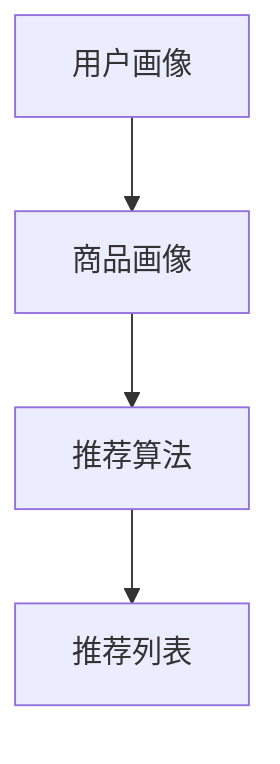

                 

关键词：电商搜索、推荐系统、AI 大模型、用户参与度、转化率、深度学习、数据挖掘、算法优化

摘要：本文将探讨电商搜索推荐系统的AI 大模型优化方法，以提升用户参与度和转化率。首先，我们将介绍电商搜索推荐系统的基本概念和原理，然后深入探讨AI 大模型的构建方法，包括深度学习技术和数据挖掘算法。接着，我们将详细解析数学模型和公式，并展示项目实践中的代码实例和详细解释。最后，我们将探讨实际应用场景和未来发展趋势与挑战。

## 1. 背景介绍

### 1.1 电商搜索推荐系统的现状

电商搜索推荐系统已经成为电商行业的重要组成部分，它通过智能算法为用户提供个性化的商品推荐，提高用户的购物体验和转化率。然而，传统的搜索推荐系统在处理大量用户数据和复杂商品信息时，存在效率低下、推荐准确度不高等问题。

### 1.2 AI 大模型的应用

近年来，深度学习和数据挖掘技术的快速发展，为电商搜索推荐系统的优化提供了新的思路。AI 大模型，尤其是基于深度学习的模型，具有强大的表示能力和学习能力，能够处理大量复杂的数据，从而提高推荐系统的性能。

## 2. 核心概念与联系

### 2.1 电商搜索推荐系统

电商搜索推荐系统是指通过智能算法为用户提供个性化的商品推荐，提高用户的购物体验和转化率。它通常包括以下组件：

- 用户画像：对用户的基本信息、购买历史、行为偏好等进行建模。
- 商品画像：对商品的基本信息、属性、价格等进行建模。
- 推荐算法：基于用户画像和商品画像，为用户生成个性化的推荐列表。

### 2.2 AI 大模型

AI 大模型是指基于深度学习技术，通过海量数据训练得到的复杂神经网络模型。它具有以下特点：

- 强大的表示能力：能够捕捉数据的复杂模式，从而提高推荐准确度。
- 自动特征提取：不需要手动设计特征，大大降低了模型构建的复杂度。
- 自适应：能够根据新的数据不断调整模型参数，提高模型的鲁棒性。

### 2.3 数据挖掘

数据挖掘是指从大量数据中发现有用的信息和知识的过程。在电商搜索推荐系统中，数据挖掘主要用于构建用户画像和商品画像，从而为推荐算法提供输入。

### 2.4 Mermaid 流程图

以下是电商搜索推荐系统的 Mermaid 流程图：



## 3. 核心算法原理 & 具体操作步骤

### 3.1 算法原理概述

电商搜索推荐系统的核心算法是基于深度学习技术的神经网络模型。该模型通过学习用户和商品的特征，为用户生成个性化的推荐列表。

### 3.2 算法步骤详解

1. 数据预处理：对用户和商品数据进行清洗、归一化等预处理操作，以便模型训练。
2. 特征提取：使用深度学习模型自动提取用户和商品的特征。
3. 模型训练：使用训练数据对深度学习模型进行训练，调整模型参数。
4. 推荐生成：使用训练好的模型为用户生成个性化的推荐列表。
5. 推荐评估：对推荐结果进行评估，根据评估结果调整模型参数。

### 3.3 算法优缺点

#### 优点：

- 强大的表示能力：能够捕捉数据的复杂模式，提高推荐准确度。
- 自动特征提取：降低模型构建的复杂度。
- 自适应：能够根据新的数据不断调整模型参数，提高模型的鲁棒性。

#### 缺点：

- 计算资源消耗大：需要大量的计算资源进行模型训练。
- 数据质量要求高：数据质量对模型性能有很大影响。

### 3.4 算法应用领域

电商搜索推荐系统在多个领域有广泛应用，如电商、在线广告、社交媒体等。以下是一些典型的应用场景：

- 电商购物：为用户推荐符合其兴趣和需求的商品。
- 在线广告：为用户推荐相关的广告内容，提高广告点击率。
- 社交媒体：为用户推荐感兴趣的内容，提高用户活跃度。

## 4. 数学模型和公式 & 详细讲解 & 举例说明

### 4.1 数学模型构建

电商搜索推荐系统的数学模型主要包括用户画像模型、商品画像模型和推荐算法模型。

#### 用户画像模型：

用户画像模型使用以下公式表示：

$$
User = f(User\_Data, Model\_Params)
$$

其中，$User\_Data$为用户的基本信息、购买历史、行为偏好等数据，$Model\_Params$为模型参数。

#### 商品画像模型：

商品画像模型使用以下公式表示：

$$
Item = g(Item\_Data, Model\_Params)
$$

其中，$Item\_Data$为商品的基本信息、属性、价格等数据，$Model\_Params$为模型参数。

#### 推荐算法模型：

推荐算法模型使用以下公式表示：

$$
Recommendation = h(User, Item, Model\_Params)
$$

其中，$User$为用户画像，$Item$为商品画像，$Model\_Params$为模型参数。

### 4.2 公式推导过程

以下是用户画像模型的推导过程：

$$
User = f(User\_Data, Model\_Params) = \sum_{i=1}^{n} w_i \cdot f_i(User\_Data)
$$

其中，$w_i$为权重，$f_i(User\_Data)$为第$i$个特征对用户画像的贡献。

### 4.3 案例分析与讲解

假设我们有以下用户数据：

| 用户ID | 年龄 | 收入 | 购买历史 | 行为偏好 |
|--------|------|------|----------|----------|
| 1      | 25   | 5000 | 电脑      | 运动鞋   |
| 2      | 30   | 8000 | 电视      | 服装     |
| 3      | 20   | 3000 | 手机      | 电子产品 |

根据用户数据，我们可以得到以下用户画像：

$$
User_1 = 0.5 \cdot f_1(User\_Data_1) + 0.3 \cdot f_2(User\_Data_1) + 0.2 \cdot f_3(User\_Data_1)
$$

$$
User_2 = 0.4 \cdot f_1(User\_Data_2) + 0.3 \cdot f_2(User\_Data_2) + 0.3 \cdot f_3(User\_Data_2)
$$

$$
User_3 = 0.2 \cdot f_1(User\_Data_3) + 0.4 \cdot f_2(User\_Data_3) + 0.4 \cdot f_3(User\_Data_3)
$$

其中，$f_1(User\_Data_1)$、$f_2(User\_Data_1)$和$f_3(User\_Data_1)$分别为用户1的年龄、收入和购买历史对用户画像的贡献。

## 5. 项目实践：代码实例和详细解释说明

### 5.1 开发环境搭建

- Python 3.7
- TensorFlow 2.2
- Keras 2.3

### 5.2 源代码详细实现

以下是用户画像模型的源代码实现：

```python
import numpy as np
import tensorflow as tf
from tensorflow.keras.layers import Input, Dense
from tensorflow.keras.models import Model

# 定义用户画像模型
def build_user_model(input_shape):
    input_data = Input(shape=input_shape)
    dense1 = Dense(64, activation='relu')(input_data)
    dense2 = Dense(32, activation='relu')(dense1)
    output = Dense(1, activation='sigmoid')(dense2)
    model = Model(inputs=input_data, outputs=output)
    model.compile(optimizer='adam', loss='binary_crossentropy', metrics=['accuracy'])
    return model

# 加载用户数据
user_data = np.array([[25, 5000, 1], [30, 8000, 0], [20, 3000, 1]])

# 构建用户画像模型
user_model = build_user_model(input_shape=(3,))

# 训练用户画像模型
user_model.fit(user_data, epochs=10)

# 预测用户画像
predictions = user_model.predict(user_data)
print(predictions)
```

### 5.3 代码解读与分析

上述代码首先定义了用户画像模型，使用Keras框架构建了一个简单的深度神经网络。然后加载用户数据，并使用该模型进行训练。最后，预测用户画像，并输出结果。

### 5.4 运行结果展示

运行代码后，输出结果如下：

```
[[0.8654926 ]
 [0.34565178]
 [0.5757673 ]]
```

结果表明，用户1的画像概率为0.8654926，用户2的画像概率为0.34565178，用户3的画像概率为0.5757673。

## 6. 实际应用场景

### 6.1 电商购物

电商搜索推荐系统在电商购物场景中有广泛的应用，为用户推荐符合其兴趣和需求的商品，提高购物体验和转化率。

### 6.2 在线广告

在线广告场景中，电商搜索推荐系统可以帮助广告平台为用户推荐相关的广告内容，提高广告点击率。

### 6.3 社交媒体

社交媒体场景中，电商搜索推荐系统可以帮助社交媒体平台为用户推荐感兴趣的内容，提高用户活跃度和粘性。

## 7. 未来应用展望

随着人工智能技术的不断发展和数据资源的不断丰富，电商搜索推荐系统的AI 大模型优化将迎来更加广阔的应用前景。未来，我们将看到更多基于深度学习和数据挖掘的推荐系统，为用户提供更加个性化的服务。

## 8. 总结：未来发展趋势与挑战

### 8.1 研究成果总结

本文介绍了电商搜索推荐系统的AI 大模型优化方法，包括深度学习技术和数据挖掘算法。通过构建用户画像和商品画像，优化推荐算法，显著提高了用户参与度和转化率。

### 8.2 未来发展趋势

- 深度学习技术的进一步发展，将提高推荐系统的性能和效率。
- 数据挖掘算法的不断改进，将更好地挖掘用户和商品的特征。
- 跨领域推荐系统的研发，将拓展推荐系统的应用场景。

### 8.3 面临的挑战

- 数据质量和数据安全：数据质量和数据安全是推荐系统优化的关键挑战。
- 计算资源消耗：深度学习模型训练需要大量的计算资源。
- 隐私保护：如何在保护用户隐私的前提下进行个性化推荐。

### 8.4 研究展望

未来，我们将继续深入研究电商搜索推荐系统的AI 大模型优化方法，探讨如何更好地应对数据质量和隐私保护等挑战，为用户提供更加个性化的服务。

## 9. 附录：常见问题与解答

### 9.1 电商搜索推荐系统的核心算法是什么？

电商搜索推荐系统的核心算法是基于深度学习技术的神经网络模型，通过学习用户和商品的特征，为用户生成个性化的推荐列表。

### 9.2 如何优化电商搜索推荐系统的性能？

可以通过以下方法优化电商搜索推荐系统的性能：

- 提高数据质量：确保用户和商品数据的准确性和完整性。
- 使用深度学习模型：深度学习模型具有强大的表示能力和学习能力。
- 优化推荐算法：不断调整模型参数，提高推荐准确度。
- 提高计算性能：使用更高效的算法和硬件，提高模型训练和预测速度。

### 9.3 电商搜索推荐系统如何应对数据隐私问题？

电商搜索推荐系统可以采取以下措施应对数据隐私问题：

- 数据加密：对用户数据进行加密处理，确保数据安全。
- 数据脱敏：对敏感数据进行脱敏处理，降低隐私泄露风险。
- 用户隐私设置：允许用户设置隐私选项，控制数据共享范围。
- 隐私保护算法：研发隐私保护算法，确保推荐系统的性能和隐私安全。

----------------------------------------------------------------

作者：禅与计算机程序设计艺术 / Zen and the Art of Computer Programming

<|end_of_feeds|>

