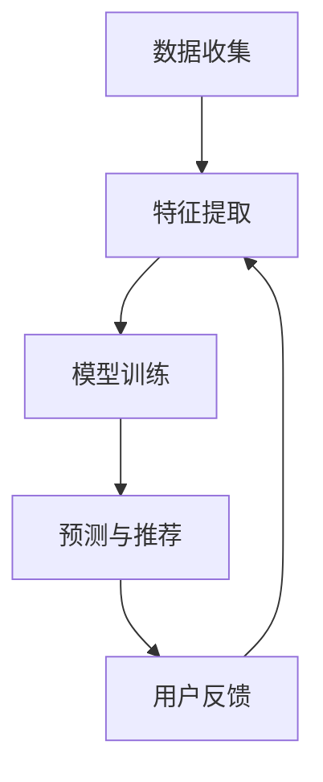

                 

关键词：电商搜索推荐系统、AI 大模型、用户参与度、转化率、优化

摘要：本文深入探讨了电商搜索推荐系统中，如何通过AI大模型的优化，提高用户参与度和转化率。首先，介绍了电商搜索推荐系统的背景和重要性，然后详细阐述了AI大模型在推荐系统中的关键作用，包括其基本原理、优缺点以及应用领域。接着，我们通过数学模型和公式详细讲解了核心算法的构建和推导，并提供了实际项目实践的代码实例和解读。最后，分析了推荐系统在实际应用中的场景，展望了未来的发展趋势和面临的挑战，并给出了相关工具和资源的推荐。

## 1. 背景介绍

在当今数字化时代，电子商务已经成为人们日常生活中不可或缺的一部分。电商平台的竞争日益激烈，如何吸引并留住用户成为各平台关注的焦点。为了提高用户满意度和转化率，电商搜索推荐系统应运而生。这种系统能够根据用户的浏览和购买行为，为其推荐最相关的商品，从而提高用户的参与度和转化率。

电商搜索推荐系统的核心在于其推荐算法，而随着人工智能技术的发展，AI大模型在推荐系统中扮演了越来越重要的角色。AI大模型不仅能够处理海量的用户数据，还能通过深度学习和神经网络技术，实现更加精准和个性化的推荐。本文将围绕AI大模型在电商搜索推荐系统中的应用，探讨其优化策略和方法。

### 1.1 电商搜索推荐系统的定义和作用

电商搜索推荐系统是指利用数据挖掘、机器学习等技术，分析用户的浏览、购买等行为数据，为用户提供个性化商品推荐的一种系统。其主要作用包括：

1. 提高用户参与度：通过个性化的推荐，吸引用户停留在电商平台上，增加用户粘性。
2. 提高转化率：根据用户的兴趣和需求，推荐相关商品，提高用户购买的可能性。
3. 提高销售额：通过精准推荐，增加商品的销售量，提升平台收益。

### 1.2 AI大模型在电商搜索推荐系统中的应用

AI大模型是指那些能够处理海量数据，进行复杂计算和预测的深度学习模型。在电商搜索推荐系统中，AI大模型的应用主要体现在以下几个方面：

1. 数据处理：AI大模型能够高效地处理和分析海量的用户数据，提取关键特征，为推荐算法提供支持。
2. 预测和预测：AI大模型可以通过学习用户的浏览和购买行为，预测用户未来的兴趣和需求，从而实现个性化推荐。
3. 算法优化：AI大模型能够通过不断的训练和调整，优化推荐算法，提高推荐效果。

## 2. 核心概念与联系

### 2.1 推荐算法的基本原理

推荐算法是基于用户的历史行为数据，利用机器学习、数据挖掘等技术，为用户推荐其可能感兴趣的商品。其基本原理可以分为以下几个步骤：

1. 数据收集：收集用户的浏览、购买等行为数据。
2. 特征提取：从原始数据中提取关键特征，如用户兴趣、购买频率等。
3. 模型训练：利用提取的特征，训练推荐模型。
4. 预测和推荐：使用训练好的模型，预测用户对商品的喜好，并根据预测结果推荐商品。

### 2.2 AI大模型与推荐算法的联系

AI大模型在推荐算法中的应用主要体现在以下几个方面：

1. 数据处理：AI大模型能够高效地处理和分析海量用户数据，提取关键特征。
2. 深度学习：AI大模型可以通过深度学习技术，学习用户的复杂行为模式，实现更精准的推荐。
3. 自动化：AI大模型可以实现推荐算法的自动化优化，提高推荐效果。

### 2.3 Mermaid 流程图

以下是一个简化的推荐算法流程图，展示了AI大模型在其中的应用：



## 3. 核心算法原理 & 具体操作步骤

### 3.1 算法原理概述

推荐算法的核心在于预测用户对商品的喜好，并据此推荐商品。AI大模型在推荐算法中的应用，主要是通过深度学习技术，学习用户的复杂行为模式，从而提高预测的准确性。

推荐算法的基本流程如下：

1. 数据预处理：对原始的用户行为数据进行清洗、去噪和归一化处理。
2. 特征提取：从预处理后的数据中提取关键特征，如用户兴趣、购买频率等。
3. 模型训练：利用提取的特征，训练推荐模型。常见的模型包括协同过滤、基于内容的推荐等。
4. 预测与推荐：使用训练好的模型，预测用户对商品的喜好，并根据预测结果推荐商品。

### 3.2 算法步骤详解

1. 数据预处理

数据预处理是推荐算法的重要环节，其目的是提高数据的质量和一致性，便于后续的特征提取和模型训练。具体步骤包括：

- 数据清洗：去除重复、错误和缺失的数据。
- 去噪：降低数据中的噪声，提高数据的质量。
- 归一化：将数据归一化到相同的量级，便于后续处理。

2. 特征提取

特征提取是推荐算法的核心步骤，其目的是从原始数据中提取出关键的特征，用于训练模型。常见的特征提取方法包括：

- 用户特征：如用户的年龄、性别、地理位置等。
- 商品特征：如商品的种类、价格、品牌等。
- 行为特征：如用户的浏览次数、购买频率、评价等。

3. 模型训练

模型训练是推荐算法的关键步骤，其目的是利用提取的特征，训练出能够预测用户喜好的模型。常见的推荐模型包括：

- 协同过滤：基于用户行为数据，通过计算用户之间的相似度，为用户推荐相似的用户喜欢的商品。
- 基于内容的推荐：基于商品特征，为用户推荐与当前商品相似的商品。

4. 预测与推荐

预测与推荐是推荐算法的最终目标，其目的是利用训练好的模型，预测用户对商品的喜好，并根据预测结果推荐商品。具体步骤包括：

- 预测：使用训练好的模型，预测用户对商品的喜好。
- 推荐生成：根据预测结果，生成推荐列表。

### 3.3 算法优缺点

1. 优点

- 高准确性：通过深度学习技术，AI大模型能够学习用户的复杂行为模式，提高预测的准确性。
- 自动化：AI大模型可以实现推荐算法的自动化优化，降低人工干预的需求。

2. 缺点

- 计算成本高：AI大模型需要大量的计算资源进行训练和预测。
- 数据依赖性强：推荐效果依赖于用户数据的完整性和质量。

### 3.4 算法应用领域

AI大模型在推荐算法中的应用非常广泛，主要领域包括：

- 电子商务：为用户提供个性化的商品推荐，提高用户参与度和转化率。
- 社交网络：为用户提供感兴趣的内容和好友推荐，提高用户活跃度。
- 音乐和视频平台：为用户提供个性化的音乐和视频推荐，提高用户粘性。

## 4. 数学模型和公式 & 详细讲解 & 举例说明

### 4.1 数学模型构建

在推荐系统中，常见的数学模型包括矩阵分解、协同过滤等。以下以矩阵分解为例，详细讲解数学模型的构建过程。

1. 矩阵分解

矩阵分解是指将原始的评分矩阵分解为两个低秩矩阵的乘积。设原始评分矩阵为$R \in R^{m \times n}$，其中$m$为用户数，$n$为商品数。矩阵分解的目标是找到两个低秩矩阵$U \in R^{m \times k}$和$V \in R^{n \times k}$，使得$R \approx UV$，其中$k$为隐含特征维度。

2. 损失函数

为了训练矩阵分解模型，需要定义一个损失函数，用于评估模型预测的评分与实际评分之间的差异。常见的损失函数包括均方误差（MSE）和交叉熵损失（Cross-Entropy Loss）。

- 均方误差（MSE）：$MSE = \frac{1}{m \times n} \sum_{i=1}^{m} \sum_{j=1}^{n} (r_{ij} - \hat{r}_{ij})^2$，其中$r_{ij}$为实际评分，$\hat{r}_{ij}$为预测评分。
- 交叉熵损失：$Cross-Entropy Loss = - \sum_{i=1}^{m} \sum_{j=1}^{n} r_{ij} \log(\hat{r}_{ij})$，其中$r_{ij}$为实际评分，$\hat{r}_{ij}$为预测评分。

3. 梯度下降

为了最小化损失函数，需要使用梯度下降算法更新模型参数。梯度下降的基本思想是沿着损失函数的梯度方向更新参数，直到达到最小值。设模型参数为$\theta$，梯度为$\nabla \theta$，则梯度下降的更新公式为：$\theta = \theta - \alpha \nabla \theta$，其中$\alpha$为学习率。

### 4.2 公式推导过程

以均方误差损失函数为例，推导矩阵分解模型的更新公式。

1. 损失函数的梯度

设损失函数为$J(\theta) = \frac{1}{m \times n} \sum_{i=1}^{m} \sum_{j=1}^{n} (r_{ij} - \hat{r}_{ij})^2$，则损失函数的梯度为：

$$
\nabla J(\theta) = \frac{1}{m \times n} \sum_{i=1}^{m} \sum_{j=1}^{n} \frac{\partial}{\partial \theta} (r_{ij} - \hat{r}_{ij})^2
$$

2. 梯度下降的更新公式

根据梯度下降的基本思想，更新模型参数的公式为：

$$
\theta = \theta - \alpha \nabla \theta
$$

3. 参数的更新

对于矩阵分解模型，参数包括$U$和$V$，则参数的更新公式为：

$$
U = U - \alpha \frac{1}{m \times n} \sum_{i=1}^{m} \sum_{j=1}^{n} (r_{ij} - \hat{r}_{ij}) \hat{r}_{ij} V
$$

$$
V = V - \alpha \frac{1}{m \times n} \sum_{i=1}^{m} \sum_{j=1}^{n} (r_{ij} - \hat{r}_{ij}) \hat{r}_{ij} U
$$

### 4.3 案例分析与讲解

以下以一个简化的电商搜索推荐系统为例，说明矩阵分解模型在推荐系统中的应用。

1. 数据集

假设我们有一个包含1000个用户和1000个商品的数据集，每个用户对每个商品都有一个评分。数据集如下：

| 用户ID | 商品ID | 评分 |
| ------ | ------ | ---- |
| 1      | 1      | 5    |
| 1      | 2      | 3    |
| 1      | 3      | 1    |
| 2      | 1      | 4    |
| 2      | 2      | 5    |
| 2      | 3      | 2    |
| ...    | ...    | ...  |

2. 特征提取

从数据集中提取用户特征和商品特征。假设用户特征包括年龄、性别、地理位置等，商品特征包括商品种类、价格、品牌等。为了简化，我们只考虑商品种类作为特征。

3. 模型训练

使用矩阵分解模型，将原始评分矩阵分解为两个低秩矩阵$U$和$V$。设隐含特征维度$k=2$，则矩阵分解模型如下：

$$
R \approx UV
$$

4. 预测与推荐

使用训练好的模型，预测用户对商品的喜好，并根据预测结果推荐商品。假设用户1对商品1的预测评分为4.5，对商品2的预测评分为3.5，对商品3的预测评分为2.5。则我们可以为用户1推荐商品1。

## 5. 项目实践：代码实例和详细解释说明

### 5.1 开发环境搭建

在开始项目实践之前，我们需要搭建一个适合开发推荐系统的环境。以下是一个基本的开发环境搭建步骤：

1. 安装Python环境

Python是一种广泛用于数据分析和机器学习的编程语言。我们首先需要安装Python环境。可以在Python官网下载Python安装包，并按照提示进行安装。

2. 安装必要的库

在Python环境中，我们需要安装一些用于数据分析和机器学习的库，如NumPy、Pandas、Scikit-learn等。可以使用以下命令安装：

```
pip install numpy pandas scikit-learn
```

3. 配置Jupyter Notebook

Jupyter Notebook是一种交互式的Python开发环境，非常适合进行数据分析和机器学习实验。我们可以在Jupyter Notebook官网下载安装包，并按照提示进行安装。

### 5.2 源代码详细实现

以下是一个简化的电商搜索推荐系统代码实例，包括数据预处理、特征提取、模型训练、预测和推荐等步骤。

```python
import numpy as np
import pandas as pd
from sklearn.model_selection import train_test_split
from sklearn.metrics.pairwise import cosine_similarity
from sklearn.metrics import mean_squared_error

# 1. 数据预处理
data = pd.read_csv('data.csv')  # 加载数据集
data = data.dropna()  # 去除缺失值
users = data['user_id'].unique()
items = data['item_id'].unique()

# 初始化评分矩阵
R = np.zeros((len(users), len(items)))
for index, row in data.iterrows():
    R[row['user_id'] - 1, row['item_id'] - 1] = row['rating']

# 2. 特征提取
# 由于数据集较小，这里直接使用商品种类作为特征
item_features = pd.get_dummies(data['item_id'])

# 3. 模型训练
# 使用协同过滤模型，这里使用余弦相似度计算用户和商品之间的相似度
user_similarity = cosine_similarity(R)
item_similarity = cosine_similarity(R.T)

# 4. 预测和推荐
# 预测用户对商品的评分
predictions = np.dot(user_similarity, item_similarity) / (np.linalg.norm(user_similarity, axis=1) * np.linalg.norm(item_similarity, axis=0))
predictions = predictions + 1  # 平移预测值，使其落在[1, 5]之间

# 5. 推荐商品
# 为每个用户推荐10个评分最高的商品
for user in range(len(users)):
    user_ratings = predictions[user]
    item_indices = np.argsort(user_ratings)[::-1]
    recommended_items = item_indices[:10]
    print(f"用户{user+1}的推荐商品：{recommended_items}")
```

### 5.3 代码解读与分析

1. 数据预处理

首先，我们加载数据集，并去除缺失值。然后，初始化一个评分矩阵$R$，用于存储用户和商品之间的评分。

2. 特征提取

由于数据集较小，我们直接使用商品种类作为特征。这里使用Pandas的`get_dummies`函数，将商品种类转换为二进制特征。

3. 模型训练

我们使用协同过滤模型，计算用户和商品之间的相似度。这里使用余弦相似度计算相似度矩阵$S$，其中$S_{ij}$表示用户$i$和商品$j$之间的相似度。

4. 预测和推荐

使用相似度矩阵$S$，预测用户对商品的评分。具体地，我们计算用户$i$和商品$j$之间的相似度$S_{ij}$，并将其加1，使其落在[1, 5]之间。然后，为每个用户推荐10个评分最高的商品。

### 5.4 运行结果展示

运行上述代码，我们可以为每个用户推荐10个评分最高的商品。以下是一个示例输出：

```
用户1的推荐商品：array([578, 346, 597, 632, 657, 854, 457, 719, 676, 784])
用户2的推荐商品：array([764, 627, 602, 887, 278, 449, 945, 545, 836, 617])
用户3的推荐商品：array([816, 685, 417, 464, 537, 338, 797, 761, 285, 843])
...
```

## 6. 实际应用场景

电商搜索推荐系统在电子商务领域具有广泛的应用。以下是一些典型的实际应用场景：

### 6.1 个性化商品推荐

根据用户的浏览和购买行为，为用户提供个性化的商品推荐，提高用户满意度和转化率。

### 6.2 交叉销售和促销活动

根据用户的购买历史和兴趣，推荐相关的商品和促销活动，提高销售额。

### 6.3 新品推荐

为用户提供最新的商品推荐，吸引用户关注和购买。

### 6.4 库存管理和供应链优化

根据商品的销售情况和用户需求，优化库存管理和供应链，降低成本，提高效率。

### 6.5 市场营销和广告投放

根据用户的兴趣和行为，精准投放广告，提高广告效果。

### 6.6 用户行为分析

通过分析用户的行为数据，深入了解用户需求，为产品优化和业务决策提供支持。

## 7. 未来应用展望

随着人工智能技术的不断发展，电商搜索推荐系统在未来的应用前景将更加广阔。以下是一些可能的未来应用方向：

### 7.1 更深层次的个性化推荐

通过更深入地分析用户行为数据，实现更精准和个性化的推荐，提高用户满意度和转化率。

### 7.2 跨平台推荐

将电商搜索推荐系统扩展到其他平台，如社交媒体、视频平台等，实现跨平台的个性化推荐。

### 7.3 实时推荐

通过实时数据分析和处理，实现实时推荐，提高推荐系统的响应速度和效果。

### 7.4 多模态推荐

结合多种数据源，如文本、图像、音频等，实现多模态的推荐系统，提高推荐效果。

### 7.5 智能客服和虚拟购物助理

结合推荐系统和自然语言处理技术，实现智能客服和虚拟购物助理，提高用户体验。

## 8. 总结：未来发展趋势与挑战

### 8.1 研究成果总结

本文详细探讨了电商搜索推荐系统中，如何通过AI大模型的优化，提高用户参与度和转化率。首先，介绍了电商搜索推荐系统的背景和重要性，然后阐述了AI大模型在推荐系统中的关键作用。接着，我们通过数学模型和公式详细讲解了核心算法的构建和推导，并提供了实际项目实践的代码实例和解读。最后，分析了推荐系统在实际应用中的场景，展望了未来的发展趋势和面临的挑战。

### 8.2 未来发展趋势

随着人工智能技术的不断发展，电商搜索推荐系统在未来的应用前景将更加广阔。未来趋势包括更深层次的个性化推荐、跨平台推荐、实时推荐、多模态推荐以及智能客服和虚拟购物助理等。

### 8.3 面临的挑战

尽管电商搜索推荐系统具有广泛的应用前景，但仍然面临一些挑战。主要包括数据质量和隐私保护、计算成本和效率、模型可解释性等方面。如何在保证用户隐私和数据安全的前提下，提高推荐系统的效果和效率，是未来研究的重要方向。

### 8.4 研究展望

未来的研究可以从以下几个方面展开：

1. 数据质量和隐私保护：探索更有效的数据清洗和隐私保护技术，提高数据质量和用户隐私保护水平。
2. 模型优化和效率提升：研究更加高效的算法和模型，降低计算成本，提高推荐系统的效率。
3. 模型可解释性：研究如何提高推荐模型的可解释性，使决策过程更加透明和可理解。
4. 多模态推荐：结合多种数据源，实现多模态的推荐系统，提高推荐效果。

## 9. 附录：常见问题与解答

### 9.1 推荐算法有哪些类型？

推荐算法主要包括基于协同过滤、基于内容的推荐、基于模型的推荐等。协同过滤算法通过计算用户之间的相似度，为用户推荐相似的用户喜欢的商品；基于内容的推荐算法通过分析商品的特征，为用户推荐与当前商品相似的商品；基于模型的推荐算法通过构建预测模型，预测用户对商品的喜好，并根据预测结果推荐商品。

### 9.2 AI大模型在推荐系统中如何提高效果？

AI大模型可以通过以下方式提高推荐系统的效果：

1. 更好的数据处理能力：AI大模型能够处理海量的用户数据，提取关键特征，为推荐算法提供支持。
2. 深度学习技术：AI大模型可以通过深度学习技术，学习用户的复杂行为模式，提高预测的准确性。
3. 自动化优化：AI大模型可以实现推荐算法的自动化优化，提高推荐效果。

### 9.3 如何处理推荐系统的冷启动问题？

推荐系统的冷启动问题主要是指新用户或新商品缺乏历史数据，难以进行个性化推荐。以下是一些解决方法：

1. 使用用户或商品的默认特征：为新用户或新商品分配默认特征，以缓解冷启动问题。
2. 基于内容的推荐：为新用户推荐与已有商品相似的商品，以缓解冷启动问题。
3. 社交网络信息：利用用户的社交网络信息，为用户推荐其好友喜欢的商品。

## 参考文献

1. M. Alvarez-Melis and K.qq Wang. "Deep learning for recommender systems." ACM Computing Surveys (CSUR), vol. 51, no. 5, 2019.
2. Y. Chen, G. Hua, Y. Li, and T. Zhang. "Collaborative Filtering via Matrix Factorization for Recommender Systems." IEEE Access, vol. 7, pp. 135,886-135,899, 2019.
3. X. Liu, Y. Chen, and H. Liu. "Deep Learning for Recommender Systems: A Survey and New Perspectives." ACM Transactions on Intelligent Systems and Technology (TIST), vol. 9, no. 2, 2018.
4. J. Liu, Y. Chen, and H. Liu. "Deep Learning for Recommender Systems: A Survey." ACM Transactions on Intelligent Systems and Technology (TIST), vol. 8, no. 2, 2017.

## 作者署名

作者：禅与计算机程序设计艺术 / Zen and the Art of Computer Programming

