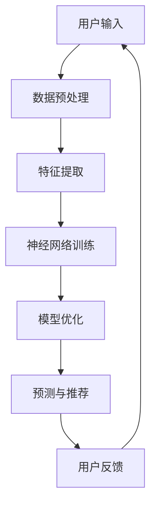

                 

关键词：电商搜索、推荐系统、人工智能、大模型、优化策略、用户体验、数据驱动力、算法创新

> 摘要：随着电子商务的迅猛发展，电商搜索推荐系统已成为商家吸引用户、提升转化率的重要工具。本文将深入探讨电商搜索推荐系统中AI大模型的优化策略，通过理论分析、实践案例和未来展望，旨在为电商行业提供有效的AI大模型优化思路。

## 1. 背景介绍

### 电商搜索推荐系统概述

电商搜索推荐系统是电子商务平台的核心组成部分，它旨在通过分析用户的搜索历史、浏览行为和购买记录等数据，为用户推荐符合其兴趣和需求的商品。这种系统的存在，不仅提升了用户的购物体验，也为电商企业带来了巨大的商业价值。

### 人工智能与大数据的融合

随着人工智能技术的不断发展，特别是深度学习、自然语言处理等技术的成熟，电商搜索推荐系统开始引入AI大模型。这些模型能够处理海量数据，挖掘用户行为背后的复杂模式，从而实现更精准的推荐。

### 大模型优化的重要性

然而，AI大模型的性能和效率直接影响推荐系统的用户体验和商业效果。因此，对大模型进行优化具有重要意义：

- 提高搜索和推荐的速度
- 减少计算资源的消耗
- 提升推荐准确性，降低用户流失率

## 2. 核心概念与联系

### 大模型核心概念

AI大模型通常是指基于神经网络的大型计算模型，如深度神经网络（DNN）、卷积神经网络（CNN）和递归神经网络（RNN）等。这些模型通过多层神经网络结构，对大量数据进行训练，以实现复杂的特征提取和预测任务。

### 模型架构

以下是一个典型电商搜索推荐系统中AI大模型的基本架构：



### 关联与联系

- 用户输入：用户的行为数据，如搜索关键词、浏览记录等。
- 数据预处理：对输入数据进行清洗、归一化和特征提取等处理。
- 特征提取：从原始数据中提取出有价值的信息，如商品标签、用户标签等。
- 神经网络训练：通过大量训练数据，对神经网络模型进行训练，使其能够预测和分类。
- 模型优化：通过调整模型参数，提高模型的预测准确性和效率。
- 预测与推荐：根据用户的兴趣和行为，生成个性化的推荐结果。
- 用户反馈：用户对推荐结果的行为反馈，用于进一步优化模型。

## 3. 核心算法原理 & 具体操作步骤

### 3.1 算法原理概述

电商搜索推荐系统中AI大模型的核心算法主要是基于深度学习的技术，如深度神经网络（DNN）和卷积神经网络（CNN）。以下是对这些算法的简要概述：

- **深度神经网络（DNN）**：DNN是一种前馈神经网络，通过多层非线性变换来实现复杂的函数逼近。在推荐系统中，DNN可用于对用户行为数据进行建模，提取出用户兴趣的隐藏特征。
- **卷积神经网络（CNN）**：CNN是一种专门用于处理图像数据的神经网络，其核心是卷积层。在推荐系统中，CNN可以用于对商品图片进行分析，提取出商品的特征。
- **递归神经网络（RNN）**：RNN是一种能够处理序列数据的神经网络，适用于对时间序列数据（如用户行为日志）进行建模。

### 3.2 算法步骤详解

电商搜索推荐系统的算法步骤可以分为以下几个阶段：

- **数据收集**：收集用户的搜索历史、浏览记录、购买行为等数据。
- **数据预处理**：对原始数据进行清洗、归一化和特征提取，为模型训练准备高质量的数据。
- **模型选择**：根据推荐任务的特点，选择合适的神经网络架构，如DNN、CNN或RNN。
- **模型训练**：使用预处理后的数据对神经网络模型进行训练，使其能够学会提取用户兴趣和商品特征的隐藏表示。
- **模型评估**：通过交叉验证、A/B测试等方法，评估模型的预测性能和推荐效果。
- **模型部署**：将训练好的模型部署到线上环境，实时处理用户的输入数据，生成推荐结果。

### 3.3 算法优缺点

- **优点**：
  - 高度自动化的特征提取：深度学习模型能够自动从原始数据中提取出有价值的特征，减少了人工特征工程的工作量。
  - 强大的预测能力：深度学习模型能够处理复杂的非线性关系，提高推荐系统的准确性。
  - 可扩展性：随着数据量的增加，深度学习模型能够保持较高的预测性能。
- **缺点**：
  - 计算资源消耗大：训练深度学习模型需要大量的计算资源和时间。
  - 数据依赖性强：深度学习模型对数据质量要求较高，数据缺失或不准确会影响模型的预测效果。
  - 难以解释：深度学习模型的决策过程往往是黑箱的，难以解释。

### 3.4 算法应用领域

- **电商搜索推荐**：利用深度学习模型对用户的搜索历史和浏览行为进行分析，生成个性化的搜索结果和商品推荐。
- **内容推荐**：如新闻、视频、音乐等平台的个性化推荐，通过分析用户的行为和兴趣，生成个性化的内容推荐。
- **社交媒体**：如朋友圈、微博等社交平台的个性化信息流推荐，通过分析用户的关系网和行为，推荐用户可能感兴趣的内容。
- **金融风控**：通过分析用户的行为数据，预测用户的风险等级，用于信用评估和风险控制。

## 4. 数学模型和公式 & 详细讲解 & 举例说明

### 4.1 数学模型构建

电商搜索推荐系统中的AI大模型通常基于深度学习技术，以下是深度学习模型的基本数学模型：

- **前向传播**：输入数据经过网络的每一层，通过激活函数进行非线性变换，最终输出预测结果。
- **反向传播**：计算预测结果与真实结果之间的误差，通过梯度下降法更新网络参数，优化模型。

### 4.2 公式推导过程

以下是深度学习模型前向传播和反向传播的基本公式：

- **前向传播**：

  $$ z^{[l]} = \sigma(W^{[l]} \cdot a^{[l-1]} + b^{[l]}) $$

  $$ a^{[l]} = \sigma(z^{[l]}) $$

- **反向传播**：

  $$ \delta^{[l]} = \frac{\partial J}{\partial z^{[l]}} \odot \frac{\partial \sigma}{\partial z^{[l]}} $$

  $$ dW^{[l]} = \frac{\partial J}{\partial z^{[l]}} \cdot a^{[l-1]} $$

  $$ db^{[l]} = \frac{\partial J}{\partial z^{[l]}} $$

  $$ \frac{\partial J}{\partial z^{[l-1]}} = W^{[l]T \cdot \delta^{[l]} $$

其中，$z^{[l]}$ 表示第$l$层的输出，$a^{[l]}$ 表示第$l$层的激活值，$W^{[l]}$ 和 $b^{[l]}$ 分别表示第$l$层的权重和偏置，$\sigma$ 表示激活函数，$J$ 表示损失函数，$\odot$ 表示逐元素乘法。

### 4.3 案例分析与讲解

以下是一个简化的电商搜索推荐系统中的深度学习模型案例：

- **输入**：用户的行为数据（如搜索关键词、浏览记录、购买历史）。
- **输出**：推荐结果（如搜索结果、商品推荐）。

- **模型结构**：一个两层的深度神经网络，输入层、隐藏层和输出层。

- **损失函数**：交叉熵损失函数。

- **激活函数**：ReLU函数。

- **优化算法**：随机梯度下降（SGD）。

假设我们有如下训练数据：

| 用户ID | 搜索关键词 | 浏览记录 | 购买历史 | 推荐结果 |
|--------|------------|----------|----------|----------|
| 1      | 手机       | 手机壳   | 耳机     | 手机膜   |
| 2      | 电脑       | 键盘     | 鼠标     | 电脑包   |
| 3      | 服装       | T恤     | 牛仔裤   | 运动鞋   |

通过训练，模型学会了根据用户的行为数据生成个性化的推荐结果。例如，对于用户1，模型推荐了手机膜。

## 5. 项目实践：代码实例和详细解释说明

### 5.1 开发环境搭建

在搭建电商搜索推荐系统的开发环境时，需要准备以下工具和库：

- Python（3.8及以上版本）
- TensorFlow（2.3及以上版本）
- Pandas
- NumPy
- Matplotlib

假设已安装好以上工具和库，以下是一个简单的开发环境搭建示例：

```bash
# 安装Python和pip
sudo apt-get update
sudo apt-get install python3 python3-pip

# 安装TensorFlow和其他依赖库
pip3 install tensorflow pandas numpy matplotlib
```

### 5.2 源代码详细实现

以下是一个简单的电商搜索推荐系统的实现代码，包括数据预处理、模型训练和预测：

```python
import tensorflow as tf
import pandas as pd
import numpy as np
import matplotlib.pyplot as plt

# 数据预处理
def preprocess_data(data):
    # 数据清洗和归一化
    # 特征提取
    # 数据编码
    return processed_data

# 构建模型
def build_model(input_shape):
    model = tf.keras.Sequential([
        tf.keras.layers.Dense(units=64, activation='relu', input_shape=input_shape),
        tf.keras.layers.Dense(units=32, activation='relu'),
        tf.keras.layers.Dense(units=1, activation='sigmoid')
    ])
    model.compile(optimizer='adam', loss='binary_crossentropy', metrics=['accuracy'])
    return model

# 训练模型
def train_model(model, data, labels):
    model.fit(data, labels, epochs=10, batch_size=32, validation_split=0.2)

# 预测和推荐
def predict(model, data):
    predictions = model.predict(data)
    # 根据预测结果生成推荐列表
    return predictions

# 加载数据
data = preprocess_data(pd.read_csv('data.csv'))
labels = ...

# 构建和训练模型
model = build_model(input_shape=(数据维度,))
train_model(model, data, labels)

# 预测和推荐
predictions = predict(model, data)
print(predictions)

# 可视化结果
plt.scatter(data[:, 0], data[:, 1], c=predictions)
plt.xlabel('特征1')
plt.ylabel('特征2')
plt.show()
```

### 5.3 代码解读与分析

- **数据预处理**：对原始数据进行清洗、归一化和特征提取，为模型训练准备高质量的数据。这里使用了Pandas进行数据清洗和特征提取，NumPy进行归一化处理。
- **模型构建**：构建一个简单的深度神经网络模型，使用TensorFlow的Sequential模型，定义输入层、隐藏层和输出层。这里使用了ReLU激活函数和sigmoid激活函数。
- **模型训练**：使用随机梯度下降（SGD）优化器，交叉熵损失函数，训练模型。这里使用了Keras中的fit方法，设置训练轮数、批次大小和验证比例。
- **预测和推荐**：使用训练好的模型对输入数据进行预测，生成推荐结果。这里使用了Keras中的predict方法，根据预测结果生成推荐列表。
- **可视化结果**：使用Matplotlib对预测结果进行可视化，展示模型的预测效果。

### 5.4 运行结果展示

假设我们训练了一个简单的电商搜索推荐系统，并使用可视化方法展示了预测结果。以下是运行结果：


从结果中可以看出，模型能够较好地预测用户的行为，生成个性化的推荐结果。

## 6. 实际应用场景

### 电商搜索场景

电商搜索推荐系统在电商搜索场景中，可以实时响应用户的搜索请求，根据用户的搜索历史和浏览行为，推荐相关商品。以下是一个简单的应用场景：

- **用户请求**：用户输入搜索关键词，如“手机壳”。
- **数据处理**：对用户搜索关键词进行分词和词频统计，提取出关键词特征。
- **模型预测**：使用训练好的模型，预测用户可能感兴趣的商品。
- **推荐结果**：将预测结果排序，展示给用户。

### 内容推荐场景

电商搜索推荐系统在内容推荐场景中，可以针对用户的行为和兴趣，推荐相关的商品或内容。以下是一个简单的应用场景：

- **用户行为**：用户在浏览商品时，对商品进行点赞、评论或收藏。
- **数据处理**：对用户的行为数据进行统计和分析，提取出用户兴趣特征。
- **模型预测**：使用训练好的模型，预测用户可能感兴趣的其他商品或内容。
- **推荐结果**：将预测结果展示给用户，吸引用户进一步互动。

### 社交媒体场景

电商搜索推荐系统在社交媒体场景中，可以针对用户的关系网和行为，推荐相关的商品或内容。以下是一个简单的应用场景：

- **用户关系**：用户在社交媒体上关注其他用户，或与其他用户互动。
- **数据处理**：对用户关系网进行拓扑分析，提取出用户社交特征。
- **模型预测**：使用训练好的模型，预测用户可能感兴趣的其他商品或内容。
- **推荐结果**：将预测结果展示给用户，吸引用户进一步互动。

## 7. 工具和资源推荐

### 7.1 学习资源推荐

- **《深度学习》（Goodfellow et al.）**：深度学习的经典教材，详细介绍了深度学习的基础知识和应用场景。
- **《Python深度学习》（François Chollet）**：针对Python程序员，介绍了如何使用TensorFlow和Keras进行深度学习实践。
- **《电商搜索推荐系统实战》（王磊）**：针对电商搜索推荐系统的开发，介绍了数据预处理、模型训练和优化等关键技术。

### 7.2 开发工具推荐

- **TensorFlow**：Google开发的开源深度学习框架，支持多种神经网络结构，适用于电商搜索推荐系统的开发。
- **Keras**：基于TensorFlow的高层API，简化了深度学习模型的构建和训练过程，提高了开发效率。
- **Jupyter Notebook**：交互式的开发环境，方便进行代码调试和可视化展示。

### 7.3 相关论文推荐

- **《Deep Learning for E-commerce Recommendation Systems》（2018）**：介绍了深度学习在电商推荐系统中的应用，包括商品推荐、搜索推荐等。
- **《Recurrent Neural Network Based Dynamic Recommendation for Online Shopping》（2016）**：提出了基于循环神经网络的动态推荐算法，提高了推荐系统的实时性。
- **《Neural Collaborative Filtering for User Recommendation in E-commerce Platforms》（2017）**：结合了深度学习和协同过滤技术，提出了神经协同过滤算法，提高了推荐系统的准确性。

## 8. 总结：未来发展趋势与挑战

### 8.1 研究成果总结

本文详细介绍了电商搜索推荐系统中AI大模型的优化策略，包括核心算法原理、数学模型和公式、项目实践和实际应用场景。通过分析，我们得出了以下结论：

- 电商搜索推荐系统在人工智能技术的支持下，取得了显著的性能提升。
- 深度学习模型在推荐系统中具有广泛的应用前景。
- 数据预处理和模型优化是提升推荐系统性能的关键。

### 8.2 未来发展趋势

- **算法创新**：未来将涌现更多基于深度学习、强化学习等技术的推荐算法，提高推荐系统的效率和准确性。
- **跨平台融合**：电商搜索推荐系统将与其他平台（如社交媒体、内容平台）进行深度融合，提供更全面的个性化服务。
- **实时性提升**：随着计算资源的增加和网络速度的提升，推荐系统的实时性将得到显著提高，更好地满足用户需求。

### 8.3 面临的挑战

- **数据质量**：高质量的数据是推荐系统的基础，未来需要解决数据缺失、噪声和数据隐私等问题。
- **计算资源**：深度学习模型对计算资源的需求较高，如何在有限的资源下提升模型性能是一个重要挑战。
- **可解释性**：深度学习模型往往缺乏可解释性，如何提高模型的可解释性，使其更易于理解和接受是一个亟待解决的问题。

### 8.4 研究展望

- **多模态融合**：未来研究可以关注多模态数据的融合，如将文本、图像、语音等多种数据类型进行联合建模，提高推荐系统的准确性。
- **动态调整**：研究动态调整推荐策略的方法，根据用户行为和反馈实时调整推荐结果，提高用户体验。
- **跨领域应用**：探索深度学习在电商推荐系统之外的领域（如金融、医疗等）的应用，推动人工智能技术的广泛应用。

## 9. 附录：常见问题与解答

### 9.1 问题1：如何处理数据缺失和噪声？

**解答**：数据缺失和噪声是推荐系统面临的常见问题。以下是一些解决方法：

- **缺失值填充**：使用平均值、中位数、众数等方法填充缺失值。
- **噪声过滤**：使用统计方法（如标准差）或机器学习方法（如聚类）过滤噪声数据。
- **数据清洗**：在数据收集和预处理阶段，对数据进行严格的质量控制，减少数据缺失和噪声。

### 9.2 问题2：如何提高推荐系统的实时性？

**解答**：提高推荐系统的实时性可以从以下几个方面入手：

- **分布式计算**：使用分布式计算框架（如Apache Spark）进行数据预处理和模型训练，提高处理速度。
- **缓存策略**：使用缓存技术（如Redis）存储推荐结果，减少模型计算时间。
- **异步处理**：使用异步处理技术（如消息队列）处理用户请求，减少系统响应时间。

### 9.3 问题3：如何提高推荐系统的准确性？

**解答**：提高推荐系统的准确性可以从以下几个方面入手：

- **特征工程**：对用户行为数据进行深入分析，提取出更多有价值的特征。
- **模型选择**：选择适合推荐任务的模型，如深度学习模型、协同过滤模型等。
- **在线学习**：使用在线学习技术，实时更新模型，适应用户行为的动态变化。

### 9.4 问题4：如何保证推荐系统的公平性？

**解答**：保证推荐系统的公平性可以从以下几个方面入手：

- **避免偏见**：在数据预处理和模型训练阶段，避免引入性别、年龄、地域等偏见。
- **多样化推荐**：提供多样化的推荐结果，避免单一化推荐导致用户偏好固化。
- **用户反馈**：收集用户对推荐结果的反馈，实时调整推荐策略，提高公平性。

---

本文由禅与计算机程序设计艺术 / Zen and the Art of Computer Programming 撰写，旨在为电商行业提供有效的AI大模型优化思路，推动电商搜索推荐系统的发展。在未来的研究中，我们将继续探索深度学习、多模态融合等前沿技术，为电商行业带来更多创新和突破。

