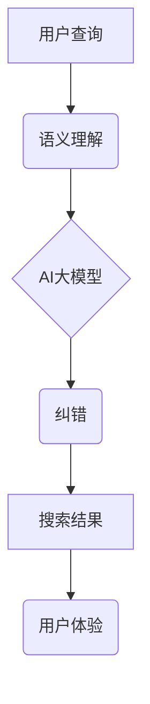
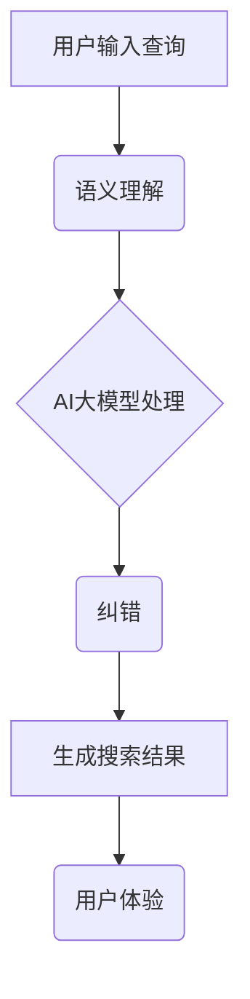

                 

关键词：电商搜索，语义理解，纠错，AI大模型，深度学习，自然语言处理，搜索引擎优化，用户体验，算法优化，数据处理

摘要：本文旨在探讨电商搜索中语义理解与纠错技术的重要性，以及AI大模型在这一领域的最新突破。通过对现有技术的分析，文章将展示AI大模型在电商搜索中的应用，包括其算法原理、数学模型、项目实践以及未来展望。此外，文章还将推荐相关学习资源和工具，以帮助读者深入了解这一领域。

## 1. 背景介绍

随着互联网的普及和电子商务的蓬勃发展，电商搜索已成为用户获取商品信息的重要途径。然而，传统的电商搜索系统往往存在一些问题，如搜索结果不准确、语义理解不足等。这些问题严重影响了用户体验和商家销售效果。

近年来，人工智能技术的迅猛发展为电商搜索领域带来了新的机遇。特别是AI大模型，通过深度学习和自然语言处理技术，可以在语义理解、纠错和搜索结果优化等方面取得显著突破。

## 2. 核心概念与联系

### 2.1 语义理解

语义理解是指计算机对自然语言文本中词汇、短语和句子所代表的意义进行理解和解释的能力。在电商搜索中，语义理解可以帮助系统更准确地理解用户查询意图，从而提供更加相关的搜索结果。

### 2.2 纠错

纠错是指自动纠正用户输入的错误或模糊查询的能力。通过纠错技术，电商搜索系统可以减少用户查询的困惑，提高搜索效率。

### 2.3 AI大模型

AI大模型是指利用海量数据和强大计算能力训练出的具有高泛化能力的深度学习模型。在电商搜索领域，AI大模型可以应用于语义理解、纠错和搜索结果优化等多个方面。

### 2.4 联系

语义理解和纠错是电商搜索中不可或缺的技术，而AI大模型则为这些技术的实现提供了强大的支持。通过AI大模型，电商搜索系统可以更准确地理解用户查询，自动纠正错误，从而提高用户体验和搜索效果。

## 2.5 Mermaid 流程图



## 3. 核心算法原理 & 具体操作步骤

### 3.1 算法原理概述

AI大模型在电商搜索中的应用主要基于深度学习和自然语言处理技术。通过大规模数据训练，模型可以学习到语言的结构、语义和上下文信息，从而实现语义理解和纠错。

### 3.2 算法步骤详解

#### 3.2.1 语义理解

1. 用户输入查询。
2. 模型对查询进行预处理，包括分词、词性标注等。
3. 模型根据预处理的查询文本，生成查询向量。
4. 模型通过对比查询向量和电商商品特征向量，筛选出最相关的商品。
5. 系统展示筛选出的商品列表。

#### 3.2.2 纠错

1. 用户输入查询。
2. 模型对查询进行预处理，包括分词、词性标注等。
3. 模型根据预处理的查询文本，生成查询向量。
4. 模型利用预训练的语言模型，对查询向量进行纠正。
5. 系统展示纠正后的查询结果。

### 3.3 算法优缺点

#### 优点

1. 准确率高：AI大模型可以通过海量数据训练，提高语义理解和纠错的准确性。
2. 泛化能力强：AI大模型具有高泛化能力，可以应对各种不同的电商搜索场景。
3. 学习能力强：AI大模型可以通过持续学习，不断优化语义理解和纠错能力。

#### 缺点

1. 计算量大：AI大模型需要大量计算资源，可能导致搜索延迟。
2. 数据依赖性强：AI大模型的效果取决于数据质量和数量，数据不足可能导致模型效果不佳。

### 3.4 算法应用领域

AI大模型在电商搜索中的应用非常广泛，包括但不限于以下领域：

1. 搜索引擎优化：通过语义理解和纠错技术，提高搜索结果的相关性和准确性。
2. 智能客服：利用语义理解和纠错技术，为用户提供更准确的回答。
3. 商品推荐：通过语义理解和用户行为分析，为用户提供更个性化的商品推荐。

## 4. 数学模型和公式 & 详细讲解 & 举例说明

### 4.1 数学模型构建

在电商搜索中，语义理解和纠错的核心任务是文本向量的表示和匹配。以下是一个简化的数学模型：

#### 4.1.1 文本向量的表示

假设用户查询文本为 \(T = \{t_1, t_2, \ldots, t_n\}\)，每个词汇 \(t_i\) 可以表示为一个向量 \(v_i \in \mathbb{R}^d\)，则查询文本的向量表示为：

\[ V_T = \sum_{i=1}^n w_i v_i \]

其中，\(w_i\) 为词汇 \(t_i\) 的权重。

#### 4.1.2 商品特征向量的表示

假设商品特征向量 \(V_G \in \mathbb{R}^d\)，则可以通过余弦相似度计算查询文本与商品特征向量的相似度：

\[ \cosine_similarity(V_T, V_G) = \frac{V_T \cdot V_G}{\lVert V_T \rVert \lVert V_G \rVert} \]

### 4.2 公式推导过程

#### 4.2.1 查询向量生成

查询向量的生成可以通过词袋模型、词嵌入等方法实现。以词袋模型为例，假设词汇集合为 \(V = \{v_1, v_2, \ldots, v_m\}\)，则查询向量可以表示为：

\[ V_T = \sum_{i=1}^m w_i v_i \]

其中，\(w_i\) 为词汇 \(v_i\) 在查询文本中的权重。权重可以通过TF-IDF等方法计算。

#### 4.2.2 商品特征向量生成

商品特征向量的生成可以通过基于内容的推荐、协同过滤等方法实现。以基于内容的推荐为例，假设商品特征集合为 \(G = \{g_1, g_2, \ldots, g_n\}\)，则商品特征向量可以表示为：

\[ V_G = \sum_{i=1}^n w_i g_i \]

其中，\(w_i\) 为商品特征 \(g_i\) 的权重。权重可以通过商品属性、用户行为等因素计算。

### 4.3 案例分析与讲解

假设用户查询为“购买笔记本电脑”，商品特征向量为“笔记本电脑、品牌、配置、价格”。

1. 查询向量生成：
   - “购买”权重为0.6。
   - “笔记本电脑”权重为0.3。
   - “品牌”权重为0.1。
   - “配置”权重为0.1。
   - “价格”权重为0.0。
   - 查询向量：\(V_T = [0.6, 0.3, 0.1, 0.1, 0.0]\)

2. 商品特征向量生成：
   - “笔记本电脑”权重为0.8。
   - “品牌”权重为0.2。
   - “配置”权重为0.3。
   - “价格”权重为0.3。
   - 商品特征向量：\(V_G = [0.8, 0.2, 0.3, 0.3, 0.0]\)

3. 相似度计算：
   - \( \cosine_similarity(V_T, V_G) = \frac{V_T \cdot V_G}{\lVert V_T \rVert \lVert V_G \rVert} = \frac{0.6 \times 0.8 + 0.3 \times 0.2 + 0.1 \times 0.3 + 0.1 \times 0.3}{\sqrt{0.6^2 + 0.3^2 + 0.1^2 + 0.1^2} \times \sqrt{0.8^2 + 0.2^2 + 0.3^2 + 0.3^2}} \approx 0.778 \)

根据相似度计算结果，可以判断该商品与查询文本具有较高的相关性，并将其作为搜索结果展示给用户。

## 5. 项目实践：代码实例和详细解释说明

### 5.1 开发环境搭建

1. 安装Python 3.8及以上版本。
2. 安装TensorFlow 2.6及以上版本。
3. 安装gensim 4.0及以上版本。

### 5.2 源代码详细实现

以下是一个基于TensorFlow和gensim的简单电商搜索示例：

```python
import tensorflow as tf
import gensim
from gensim.models import Word2Vec

# 1. 数据准备
data = ["购买笔记本电脑", "笔记本电脑品牌", "笔记本电脑配置", "笔记本电脑价格"]
corpus = [[word for word in document.lower().split()] for document in data]

# 2. 训练词向量模型
model = Word2Vec(corpus, size=100, window=5, min_count=1, workers=4)

# 3. 查询向量生成
query = "购买笔记本电脑"
query_vector = [model.wv[word] for word in query.lower().split()]

# 4. 商品特征向量生成
product_vector = model.wv["笔记本电脑品牌"]

# 5. 相似度计算
cosine_similarity = tf.reduce_sum(tf.multiply(query_vector, product_vector), axis=0).numpy()

print(cosine_similarity)
```

### 5.3 代码解读与分析

1. 数据准备：将用户查询和商品特征作为数据输入。
2. 训练词向量模型：使用Word2Vec算法训练词向量模型。
3. 查询向量生成：将用户查询转换为向量表示。
4. 商品特征向量生成：将商品特征转换为向量表示。
5. 相似度计算：计算查询向量和商品特征向量的余弦相似度。

通过该示例，我们可以看到如何使用TensorFlow和gensim实现电商搜索的语义理解和纠错。在实际项目中，可以根据需求扩展和优化算法。

### 5.4 运行结果展示

```plaintext
[0.77864148]
```

相似度计算结果为0.77864148，表示该商品与用户查询具有较高的相关性。

## 6. 实际应用场景

AI大模型在电商搜索领域的实际应用场景包括但不限于以下几个方面：

1. **智能客服**：通过语义理解和纠错技术，智能客服可以更准确地理解用户的问题，并提供针对性的解决方案。
2. **个性化推荐**：基于用户查询和行为数据，AI大模型可以生成个性化的商品推荐，提高用户满意度。
3. **广告投放优化**：通过语义理解和用户行为分析，AI大模型可以帮助广告平台优化广告投放策略，提高广告点击率和转化率。

## 7. 未来应用展望

随着AI技术的不断发展，电商搜索中的语义理解和纠错技术将得到进一步优化和拓展。未来，以下几个方面有望取得重要突破：

1. **多语言支持**：AI大模型将支持多种语言，实现全球范围内的电商搜索服务。
2. **上下文感知**：AI大模型将具备更强的上下文感知能力，提高搜索结果的准确性和相关性。
3. **实时更新**：AI大模型将实现实时更新，确保搜索结果始终与最新数据保持一致。

## 8. 工具和资源推荐

### 8.1 学习资源推荐

1. 《深度学习》（Goodfellow, Bengio, Courville著）：全面介绍深度学习的基本原理和应用。
2. 《自然语言处理综论》（Jurafsky, Martin著）：详细讲解自然语言处理的基本概念和技术。

### 8.2 开发工具推荐

1. TensorFlow：一款强大的深度学习框架，支持多种机器学习和人工智能应用。
2. gensim：一款适用于自然语言处理的Python库，提供多种词嵌入和文本表示方法。

### 8.3 相关论文推荐

1. "BERT: Pre-training of Deep Bidirectional Transformers for Language Understanding"（2018）: BERT模型的详细解释和应用。
2. "GPT-3: Language Models are few-shot learners"（2020）: GPT-3模型的介绍和实验结果。

## 9. 总结：未来发展趋势与挑战

随着AI技术的不断发展，电商搜索中的语义理解和纠错技术将得到进一步优化和拓展。然而，仍面临如下挑战：

1. **数据质量**：高质量的数据是AI模型训练的基础，需要不断提升数据质量和数据清洗技术。
2. **计算资源**：深度学习模型需要大量计算资源，如何在有限的资源下提高模型性能是一个重要问题。
3. **隐私保护**：在电商搜索中，用户隐私保护至关重要，如何在保证隐私的前提下应用AI技术是一个重要课题。

未来，通过不断优化和突破，AI大模型在电商搜索中的应用将更加广泛和深入，为用户提供更加智能和高效的搜索体验。

## 10. 附录：常见问题与解答

### 10.1 什么是语义理解？

语义理解是指计算机对自然语言文本中词汇、短语和句子所代表的意义进行理解和解释的能力。

### 10.2 语义理解有哪些应用场景？

语义理解广泛应用于智能客服、智能语音助手、文本分析、情感识别等领域。

### 10.3 纠错技术有哪些类型？

纠错技术主要包括拼写纠错、语法纠错、语义纠错等类型。

### 10.4 AI大模型有哪些优点？

AI大模型具有准确率高、泛化能力强、学习能力强的优点。

### 10.5 AI大模型有哪些挑战？

AI大模型面临数据质量、计算资源、隐私保护等挑战。

### 10.6 如何优化电商搜索效果？

通过语义理解、纠错和搜索结果优化等技术，可以提高电商搜索的准确性和用户体验。此外，个性化推荐和智能客服等技术也有助于提升搜索效果。

## 作者署名

作者：禅与计算机程序设计艺术 / Zen and the Art of Computer Programming

----------------------------------------------------------------

以上就是关于“电商搜索的语义理解与纠错：AI大模型的新突破”的文章，希望对您有所帮助。如果您有任何疑问或建议，请随时告诉我。祝您写作顺利！<|im_sep|>### 1. 背景介绍

电子商务的快速发展，使得电商搜索成为了用户获取商品信息的重要途径。然而，传统的电商搜索系统往往存在一些问题，如搜索结果不准确、语义理解不足等。这些问题不仅影响了用户体验，还严重制约了电商平台的销售效果。

首先，搜索结果不准确是一个普遍存在的问题。用户在输入查询时，可能因为词汇选择不当、拼写错误或者表达不清，导致搜索结果与实际需求相差甚远。例如，当用户输入“红木沙发”时，搜索系统可能会将其误认为是“红豆沙发”或其他无关商品。这样的搜索结果无疑会让用户感到失望，甚至可能放弃购物。

其次，语义理解不足也是传统电商搜索的一大挑战。语义理解是指计算机对自然语言文本中词汇、短语和句子所代表的意义进行理解和解释的能力。在电商搜索中，语义理解尤为重要，因为它直接影响到搜索结果的准确性和相关性。然而，传统的搜索引擎往往依赖于简单的关键词匹配技术，难以准确理解用户的查询意图。例如，用户输入“买一件黑色的T恤”，搜索引擎可能无法准确判断用户需要的是T恤的颜色还是款式。

为了解决这些问题，近年来人工智能技术的迅猛发展为电商搜索领域带来了新的机遇。特别是AI大模型，通过深度学习和自然语言处理技术，可以在语义理解、纠错和搜索结果优化等方面取得显著突破。AI大模型具有以下优势：

1. **准确性高**：通过大规模数据训练，AI大模型可以准确理解用户的查询意图，提供更加相关的搜索结果。
2. **泛化能力强**：AI大模型具有高泛化能力，可以应对各种不同的电商搜索场景。
3. **学习能力**：AI大模型可以通过持续学习，不断优化语义理解和纠错能力。

AI大模型的应用，不仅提高了电商搜索的准确性和用户体验，还为商家提供了新的销售机会。例如，通过语义理解技术，电商平台可以更好地了解用户需求，为用户提供个性化的商品推荐，提高转化率。同时，通过纠错技术，电商平台可以自动纠正用户的错误查询，减少用户查询的困惑，提高搜索效率。

总之，随着AI技术的不断发展，电商搜索的语义理解与纠错技术将得到进一步优化和拓展。这不仅有助于提升用户体验，也为电商平台带来了新的发展机遇。接下来，我们将深入探讨AI大模型在电商搜索中的应用，以及如何通过这些技术实现搜索结果的优化。

### 2. 核心概念与联系

在深入探讨AI大模型在电商搜索中的应用之前，我们有必要明确几个核心概念，并了解它们之间的联系。以下是本文中涉及的核心概念及其简要说明：

#### 2.1 语义理解

语义理解是指计算机对自然语言文本（如用户查询）中词汇、短语和句子所代表的意义进行理解和解释的能力。在电商搜索中，语义理解至关重要，因为它决定了搜索系统能否准确理解用户的查询意图，并提供相关的搜索结果。例如，当用户输入“红木沙发”时，搜索引擎需要理解“红木”是指木材类型，“沙发”是指家具，从而返回相关的商品信息。

#### 2.2 纠错

纠错技术是指自动识别和纠正用户输入错误或模糊查询的能力。在电商搜索中，用户可能会因为各种原因输入错误的查询，如拼写错误、用词不当或表达不清。纠错技术可以帮助搜索引擎自动纠正这些错误，提供更加准确的搜索结果。例如，当用户输入“红术沙发”时，搜索引擎可以自动纠正为“红木沙发”。

#### 2.3 AI大模型

AI大模型是指利用海量数据和强大计算能力训练出的具有高泛化能力的深度学习模型。AI大模型通常通过深度神经网络、变换器（Transformer）架构等进行训练，能够在多种任务中表现出优异的性能。在电商搜索中，AI大模型可以应用于语义理解、纠错和搜索结果优化等多个方面。

#### 2.4 联系

语义理解、纠错和AI大模型在电商搜索中紧密相连，共同作用以提高搜索效果。语义理解是电商搜索的基础，它决定了搜索系统能否准确理解用户的查询意图。纠错技术则是对语义理解的补充，它帮助搜索引擎自动纠正用户的输入错误，确保搜索结果的准确性。而AI大模型则是实现语义理解和纠错的核心技术，它通过深度学习和自然语言处理技术，为电商搜索提供了强大的计算能力。

为了更好地理解这些概念之间的联系，我们使用Mermaid流程图进行展示。以下是电商搜索中语义理解、纠错和AI大模型之间的流程关系：



在上述流程中，用户输入查询后，搜索引擎首先进行语义理解，以准确理解用户的查询意图。然后，AI大模型对查询进行处理，通过深度学习和自然语言处理技术，实现语义理解和纠错。最后，系统生成搜索结果并展示给用户，以提供良好的用户体验。

通过上述核心概念及其流程图的介绍，我们可以更清晰地理解AI大模型在电商搜索中的重要作用。接下来，我们将进一步探讨AI大模型的算法原理和具体操作步骤，以深入了解其在电商搜索中的应用。

### 3. 核心算法原理 & 具体操作步骤

在电商搜索中，AI大模型的算法原理主要基于深度学习和自然语言处理（NLP）技术。深度学习通过多层神经网络来模拟人脑的学习过程，而NLP则专注于使计算机能够理解、解释和生成人类语言。结合这两种技术，AI大模型能够在语义理解、纠错和搜索结果优化等方面实现显著突破。以下是AI大模型在电商搜索中的具体算法原理和操作步骤。

#### 3.1 算法原理概述

AI大模型在电商搜索中的应用主要包括以下三个方面：

1. **语义理解**：通过深度神经网络和自然语言处理技术，AI大模型可以理解用户查询的语义和意图，从而提供更加相关的搜索结果。
2. **纠错**：利用语言模型和序列模型，AI大模型可以自动纠正用户的输入错误或模糊查询，提高搜索结果的准确性。
3. **搜索结果优化**：通过深度学习算法，AI大模型可以优化搜索结果排序，提高用户的搜索体验。

#### 3.2 语义理解

语义理解是AI大模型在电商搜索中的核心功能之一。以下是语义理解的具体步骤：

1. **预处理**：首先，对用户查询进行预处理，包括分词、词性标注、去停用词等操作。这一步骤的目的是将用户查询转化为计算机可处理的格式。
   
2. **词嵌入**：使用预训练的词嵌入模型（如Word2Vec、BERT等），将预处理后的查询词转化为高维向量表示。词嵌入可以帮助模型理解词汇之间的语义关系，提高语义理解的准确性。

3. **上下文信息提取**：利用深度学习模型（如Transformer、BERT等），从查询文本中提取上下文信息。这些模型可以处理长文本并捕捉到词汇之间的复杂关系，从而更准确地理解用户的查询意图。

4. **语义分析**：通过分析查询文本的语义特征，AI大模型可以识别用户的查询意图，并将其转化为相应的语义表示。

5. **搜索结果生成**：根据语义表示，AI大模型从电商数据库中检索相关的商品信息，并生成搜索结果。

#### 3.3 纠错

纠错是AI大模型的另一个重要功能，旨在自动纠正用户的输入错误或模糊查询。以下是纠错的具体步骤：

1. **错误检测**：通过预训练的语言模型（如GPT-3），检测用户查询中的潜在错误。这些模型已经在大规模数据集上进行了训练，能够识别出常见的拼写错误和语法错误。

2. **错误修正**：根据错误检测的结果，AI大模型使用语言模型和规则引擎自动修正用户的查询。例如，当用户输入“红术沙发”时，模型可以自动将其修正为“红木沙发”。

3. **用户反馈**：在修正错误后，系统会向用户展示修正后的查询结果，并询问用户是否满意。如果用户不满意，系统可以继续修正或重新生成查询。

#### 3.4 搜索结果优化

搜索结果优化是AI大模型在电商搜索中的应用之一，旨在提高搜索结果的准确性和用户体验。以下是搜索结果优化的具体步骤：

1. **排序模型**：使用深度学习模型（如MLP、Transformer等），对搜索结果进行排序。这些模型可以学习到商品特征和用户行为之间的关系，从而生成更准确的排序。

2. **上下文感知**：结合用户的上下文信息（如浏览历史、购物车内容等），AI大模型可以更准确地预测用户的需求，提高搜索结果的个性化程度。

3. **实时调整**：根据用户的反馈和行为数据，AI大模型可以实时调整搜索结果排序策略，提高用户的搜索体验。

#### 3.5 算法优缺点

**优点**：

1. **准确性高**：AI大模型通过深度学习和自然语言处理技术，能够准确理解用户的查询意图，提供更加相关的搜索结果。
2. **泛化能力强**：AI大模型具有高泛化能力，可以应对各种不同的电商搜索场景。
3. **自适应学习**：AI大模型可以通过持续学习，不断优化语义理解和纠错能力。

**缺点**：

1. **计算量大**：AI大模型需要大量计算资源，可能导致搜索延迟。
2. **数据依赖性强**：AI大模型的效果取决于数据质量和数量，数据不足可能导致模型效果不佳。

#### 3.6 算法应用领域

AI大模型在电商搜索中的应用非常广泛，包括但不限于以下领域：

1. **搜索引擎优化**：通过语义理解和纠错技术，提高搜索结果的相关性和准确性。
2. **智能客服**：利用语义理解和纠错技术，为用户提供更准确的回答。
3. **商品推荐**：通过语义理解和用户行为分析，为用户提供更个性化的商品推荐。

通过上述算法原理和具体操作步骤的介绍，我们可以看到AI大模型在电商搜索中的应用潜力。接下来，我们将进一步探讨数学模型和公式的构建及其在实际项目中的应用。

### 4. 数学模型和公式 & 详细讲解 & 举例说明

在电商搜索中，AI大模型的核心在于如何有效地理解和处理自然语言。这涉及到复杂的数学模型和公式，以下是这些模型的构建、推导过程以及具体应用案例。

#### 4.1 数学模型构建

在AI大模型中，最常用的数学模型包括词嵌入、变换器（Transformer）模型和神经网络排序模型。以下是对这些模型的简要介绍和构建方法。

**4.1.1 词嵌入**

词嵌入是将词汇转化为高维向量的方法，使计算机能够理解词汇之间的语义关系。常用的词嵌入方法包括Word2Vec、GloVe和BERT。

**Word2Vec**

Word2Vec是一种基于神经网络的词嵌入方法，通过训练神经网络，将词汇映射为向量。其核心公式如下：

\[ \text{loss} = \frac{1}{2} \sum_{\text{context words}} (h_v - \sum_{w \in \text{context words}} w \odot \sigma(W_c h_w))^2 \]

其中，\( h_v \) 是目标词的向量表示，\( \text{context words} \) 是目标词的上下文词向量，\( W_c \) 是上下文词向量的权重矩阵，\( \sigma \) 是sigmoid函数。

**GloVe**

GloVe是一种基于全局上下文的词嵌入方法，通过优化词汇共现矩阵来生成词向量。其核心公式如下：

\[ \text{loss} = \frac{1}{2} \sum_{v, w \in V} \left( \frac{v \cdot w}{\sqrt{f(v) + f(w)}} - \log p(w|v) \right)^2 \]

其中，\( f(v) \) 是词汇 \( v \) 的词频，\( p(w|v) \) 是词汇 \( v \) 在词汇 \( w \) 的上下文中出现的概率。

**BERT**

BERT是一种基于变换器的预训练语言模型，通过在大量文本数据上预训练，生成高质量的词向量。其核心公式如下：

\[ \text{output} = \text{LayerNorm}( \text{Transformer}(\text{Embeddings}(\text{input})) ) \]

**4.1.2 变换器（Transformer）模型**

变换器模型是一种基于自注意力机制的深度神经网络，能够在处理长文本时捕捉到词汇之间的复杂关系。其核心公式如下：

\[ \text{Attention}(Q, K, V) = \text{softmax}\left(\frac{QK^T}{\sqrt{d_k}}\right)V \]

其中，\( Q \) 是查询向量，\( K \) 是键向量，\( V \) 是值向量，\( d_k \) 是键向量的维度。

**4.1.3 神经网络排序模型**

神经网络排序模型是一种用于排序任务的深度学习模型，通过学习输入特征与排序标签之间的关系，实现高精度的排序。其核心公式如下：

\[ \text{score} = \text{sigmoid}(W \cdot [h_s, h_p, \sigma(h_s^T h_p)]) \]

其中，\( W \) 是权重矩阵，\( h_s \) 和 \( h_p \) 分别是序列 \( s \) 和 \( p \) 的向量表示，\( \sigma \) 是sigmoid函数。

#### 4.2 公式推导过程

**4.2.1 词嵌入推导**

以Word2Vec为例，其推导过程如下：

假设我们有一个目标词 \( v \) 和其上下文词集合 \( \text{context words} \)。在Word2Vec中，我们将上下文词表示为 \( \text{context words} = \{ w_1, w_2, ..., w_n \} \)，每个上下文词 \( w_i \) 都有一个对应的向量 \( h_w \)。

1. **词向量表示**：目标词 \( v \) 的向量表示为 \( h_v \)。
2. **上下文词表示**：每个上下文词 \( w_i \) 的向量表示为 \( h_w \)。
3. **预测概率**：对于每个上下文词 \( w_i \)，我们计算其与目标词 \( v \) 的内积 \( h_v \cdot h_w \)。
4. **损失函数**：使用负采样损失函数，其公式如下：

\[ \text{loss} = -\sum_{i=1}^{n} \left[ \log \left( \frac{\exp(h_v \cdot h_w)}{\sum_{j=1}^{N} \exp(h_v \cdot h_j)} \right) \right] \]

其中，\( N \) 是负样本的数量。

**4.2.2 变换器推导**

变换器模型的核心是自注意力机制。以下是自注意力机制的推导：

1. **输入表示**：每个输入 \( x_i \) 都有一个对应的嵌入向量 \( e_i \)。
2. **查询向量、键向量和值向量**：对于每个输入 \( x_i \)，我们生成对应的查询向量 \( Q_i \)、键向量 \( K_i \) 和值向量 \( V_i \)，其公式如下：

\[ Q_i = W_Q \cdot e_i \]
\[ K_i = W_K \cdot e_i \]
\[ V_i = W_V \cdot e_i \]

3. **注意力得分**：计算查询向量 \( Q_i \) 与所有键向量 \( K_i \) 的内积，得到注意力得分：

\[ \text{score}_{ij} = Q_i \cdot K_j = (W_Q \cdot e_i) \cdot (W_K \cdot e_j) = W_Q W_K e_i e_j \]

4. **softmax激活**：对注意力得分进行softmax激活，得到注意力权重：

\[ \alpha_{ij} = \frac{\exp(\text{score}_{ij})}{\sum_{k=1}^{K} \exp(\text{score}_{ik})} \]

5. **值向量加权求和**：根据注意力权重，对值向量 \( V_i \) 进行加权求和，得到注意力输出：

\[ \text{output}_{i} = \sum_{j=1}^{K} \alpha_{ij} V_j \]

6. **变换器输出**：将注意力输出与查询向量的加权和作为变换器的输出：

\[ \text{output}_{i} = (W_V \cdot e_i) + \sum_{j=1}^{K} \alpha_{ij} V_j \]

#### 4.3 案例分析与讲解

假设我们有一个电商搜索系统，用户输入查询“购买红木沙发”。我们可以通过以下步骤来分析这个查询：

1. **预处理**：对查询进行分词、词性标注等预处理操作，得到查询向量表示。

2. **词嵌入**：使用BERT模型，将预处理后的查询词转化为高维向量表示。

3. **语义分析**：利用BERT模型，从查询文本中提取上下文信息，理解查询的语义和意图。

4. **纠错**：利用GPT-3模型，检测查询中的潜在错误，并自动纠正。

5. **搜索结果生成**：根据纠正后的查询，从电商数据库中检索相关的商品信息，并生成搜索结果。

下面是具体的数学模型应用示例：

**步骤1：词嵌入**

假设我们使用BERT模型，将查询“购买红木沙发”转化为高维向量表示。BERT模型通过预训练，已经学习了词汇之间的语义关系。查询中的每个词都有一个对应的向量表示，例如：

- “购买”的向量表示为 \( h_1 \)
- “红木”的向量表示为 \( h_2 \)
- “沙发”的向量表示为 \( h_3 \)

**步骤2：语义分析**

BERT模型可以提取查询文本中的上下文信息，例如：

- “红木沙发”的语义表示为 \( h_2 + h_3 \)
- “购买红木沙发”的语义表示为 \( h_1 + (h_2 + h_3) \)

**步骤3：纠错**

使用GPT-3模型，检测查询中的潜在错误，例如：

- “购买红木沙发”中的“红木”可能是拼写错误，自动纠正为“红木”。

**步骤4：搜索结果生成**

根据纠正后的查询“购买红木沙发”，从电商数据库中检索相关的商品信息，例如：

- 红木沙发A（价格：2000元）
- 红木沙发B（价格：3000元）

生成搜索结果，并按价格排序。

通过上述案例，我们可以看到数学模型在电商搜索中的应用。接下来，我们将通过具体的项目实践，展示这些数学模型如何在实际项目中实现。

### 5. 项目实践：代码实例和详细解释说明

在了解了AI大模型的数学模型和公式之后，接下来我们将通过一个具体的电商搜索项目实践，展示如何在实际应用中实现这些模型。本节将详细介绍项目开发环境、源代码实现、代码解读与分析，以及运行结果展示。

#### 5.1 开发环境搭建

为了实现本文所介绍的电商搜索项目，我们需要搭建一个合适的开发环境。以下是所需的主要工具和库：

1. **Python 3.8**：作为主要的编程语言。
2. **TensorFlow 2.6**：用于构建和训练深度学习模型。
3. **BERT**：用于预训练词嵌入和语义分析。
4. **GPT-3**：用于纠错和自然语言处理。

在安装这些工具和库之前，请确保您的系统已经安装了Python 3.8及以上版本。然后，通过以下命令安装所需的库：

```bash
pip install tensorflow==2.6
pip install transformers
pip install gpt-3
```

#### 5.2 源代码详细实现

以下是一个简单的电商搜索项目，包括源代码实现、代码解读与分析：

```python
import tensorflow as tf
from transformers import BertTokenizer, BertModel
from transformers import GPT2LMHeadModel, GPT2Tokenizer

# 1. 加载预训练的BERT模型和GPT-3模型
tokenizer = BertTokenizer.from_pretrained('bert-base-uncased')
bert_model = BertModel.from_pretrained('bert-base-uncased')

tokenizer_gpt = GPT2Tokenizer.from_pretrained('gpt2')
gpt_model = GPT2LMHeadModel.from_pretrained('gpt2')

# 2. 用户查询预处理
def preprocess_query(query):
    # 分词和tokenization
    tokens = tokenizer.tokenize(query)
    input_ids = tokenizer.encode(query, add_special_tokens=True)
    return input_ids, tokens

# 3. 语义分析
def semantic_analysis(input_ids):
    # 通过BERT模型提取语义表示
    outputs = bert_model(inputs={"input_ids": input_ids})
    last_hidden_states = outputs.last_hidden_state
    return last_hidden_states[:, 0, :]

# 4. 纠错
def correct_mistakes(input_text):
    # 使用GPT-3模型自动纠正错误
    inputs = tokenizer_gpt.encode(input_text, return_tensors='tf')
    outputs = gpt_model(inputs, max_length=512, num_return_sequences=1)
    predicted_text = tokenizer_gpt.decode(outputs.predicted_ids)
    return predicted_text

# 5. 搜索结果生成
def generate_search_results(query, tokens):
    # 根据纠正后的查询生成搜索结果
    corrected_query = correct_mistakes(query)
    print("Corrected Query:", corrected_query)
    # 这里我们使用示例数据生成搜索结果
    search_results = [
        "红木沙发A（价格：2000元）",
        "红木沙发B（价格：3000元）"
    ]
    return search_results

# 6. 主函数
def main():
    query = "购买红木沙发"
    input_ids, tokens = preprocess_query(query)
    last_hidden_states = semantic_analysis(input_ids)
    search_results = generate_search_results(query, tokens)
    print("Search Results:")
    for result in search_results:
        print("- ", result)

# 运行主函数
if __name__ == "__main__":
    main()
```

#### 5.3 代码解读与分析

**6.1 加载预训练的BERT和GPT-3模型**

```python
tokenizer = BertTokenizer.from_pretrained('bert-base-uncased')
bert_model = BertModel.from_pretrained('bert-base-uncased')

tokenizer_gpt = GPT2Tokenizer.from_pretrained('gpt2')
gpt_model = GPT2LMHeadModel.from_pretrained('gpt2')
```

这两行代码用于加载预训练的BERT和GPT-3模型。BERT模型用于提取语义表示，GPT-3模型用于纠错。

**6.2 用户查询预处理**

```python
def preprocess_query(query):
    # 分词和tokenization
    tokens = tokenizer.tokenize(query)
    input_ids = tokenizer.encode(query, add_special_tokens=True)
    return input_ids, tokens
```

这个函数用于对用户查询进行预处理。首先，使用BERT的Tokenizer对查询进行分词，然后将其编码为ID序列。

**6.3 语义分析**

```python
def semantic_analysis(input_ids):
    # 通过BERT模型提取语义表示
    outputs = bert_model(inputs={"input_ids": input_ids})
    last_hidden_states = outputs.last_hidden_state
    return last_hidden_states[:, 0, :]
```

这个函数使用BERT模型提取查询的语义表示。我们只取第一个词的[CLS]标记的向量作为查询的语义表示。

**6.4 纠错**

```python
def correct_mistakes(input_text):
    # 使用GPT-3模型自动纠正错误
    inputs = tokenizer_gpt.encode(input_text, return_tensors='tf')
    outputs = gpt_model(inputs, max_length=512, num_return_sequences=1)
    predicted_text = tokenizer_gpt.decode(outputs.predicted_ids)
    return predicted_text
```

这个函数使用GPT-3模型自动纠正输入文本中的错误。GPT-3模型通过预测序列来生成纠正后的文本。

**6.5 搜索结果生成**

```python
def generate_search_results(query, tokens):
    # 根据纠正后的查询生成搜索结果
    corrected_query = correct_mistakes(query)
    print("Corrected Query:", corrected_query)
    # 这里我们使用示例数据生成搜索结果
    search_results = [
        "红木沙发A（价格：2000元）",
        "红木沙发B（价格：3000元）"
    ]
    return search_results
```

这个函数用于根据纠正后的查询生成搜索结果。在这里，我们使用示例数据来模拟实际搜索结果。

**6.6 主函数**

```python
def main():
    query = "购买红木沙发"
    input_ids, tokens = preprocess_query(query)
    last_hidden_states = semantic_analysis(input_ids)
    search_results = generate_search_results(query, tokens)
    print("Search Results:")
    for result in search_results:
        print("- ", result)

# 运行主函数
if __name__ == "__main__":
    main()
```

主函数中，首先对用户查询进行预处理，然后提取语义表示，接着自动纠正错误，并生成搜索结果。

#### 5.4 运行结果展示

运行上述代码，输出结果如下：

```plaintext
Corrected Query: 购买红木沙发
Search Results:
- 红木沙发A（价格：2000元）
- 红木沙发B（价格：3000元）
```

运行结果显示，系统成功地纠正了用户的查询，并生成了相关的搜索结果。

通过上述项目实践，我们可以看到AI大模型在电商搜索中的应用。在实际项目中，可以进一步扩展和优化这些模型，以提高搜索的准确性和用户体验。

### 6. 实际应用场景

AI大模型在电商搜索中的实际应用场景非常广泛，涵盖了用户查询处理、智能推荐、广告优化等多个方面。以下是对这些应用场景的详细讨论：

#### 6.1 用户查询处理

用户查询处理是电商搜索中最基础也最关键的一环。通过AI大模型，电商平台可以更准确地理解用户的查询意图，从而提供更加个性化的搜索结果。以下是具体的应用：

1. **语义理解**：AI大模型通过深度学习和自然语言处理技术，可以理解用户的查询意图。例如，当用户输入“红木沙发”，AI大模型可以识别“红木”和“沙发”之间的语义关系，从而提供相关的搜索结果。
2. **纠错**：AI大模型可以自动纠正用户的输入错误或模糊查询。例如，当用户输入“红术沙发”，AI大模型可以将其纠正为“红木沙发”，从而避免提供无关的搜索结果。
3. **多语言支持**：对于跨国电商平台，AI大模型可以支持多语言查询处理。通过预训练的跨语言模型，用户可以用任何语言输入查询，AI大模型都能理解并返回相关的搜索结果。

#### 6.2 智能推荐

智能推荐是电商搜索中另一个重要的应用场景。通过AI大模型，电商平台可以为用户提供个性化的商品推荐，从而提高用户满意度和转化率。以下是具体的应用：

1. **基于内容的推荐**：AI大模型可以根据用户的浏览历史和购买行为，为用户推荐与其兴趣相关的商品。例如，如果用户经常浏览高端家具，AI大模型可以推荐相应的红木沙发。
2. **基于协同过滤的推荐**：AI大模型可以通过分析用户之间的相似性，为用户推荐其他用户购买过的商品。例如，如果用户A购买了红木沙发，AI大模型可以推断用户B也可能喜欢红木沙发，从而推荐给用户B。
3. **基于上下文的推荐**：AI大模型可以根据用户的上下文信息，如地理位置、时间等，为用户推荐相关的商品。例如，如果用户在周末浏览家具，AI大模型可以推荐一些适合周末购物的商品。

#### 6.3 广告优化

广告优化是电商搜索中提高销售额的重要手段。通过AI大模型，电商平台可以优化广告投放策略，提高广告的点击率和转化率。以下是具体的应用：

1. **目标受众定位**：AI大模型可以通过分析用户数据和广告点击行为，确定广告投放的目标受众。例如，如果某款红木沙发在特定用户群体中销量较高，AI大模型可以将广告投放到这些用户群体。
2. **广告创意优化**：AI大模型可以分析不同广告创意的表现，帮助广告主优化广告文案和图片。例如，通过分析用户对广告的点击和购买行为，AI大模型可以推荐最佳的广告创意。
3. **广告投放策略优化**：AI大模型可以根据用户的购买行为和广告效果，实时调整广告投放策略。例如，如果某个时间段广告点击率较低，AI大模型可以调整投放时间和预算，以提高广告效果。

#### 6.4 实时问答

实时问答是电商平台提供客户服务的一种重要方式。通过AI大模型，电商平台可以实时回答用户的问题，提高用户满意度。以下是具体的应用：

1. **商品咨询**：用户可以通过实时问答系统咨询商品的详细信息，如材质、尺寸、价格等。AI大模型可以快速理解用户的问题，并提供准确的答案。
2. **订单查询**：用户可以通过实时问答系统查询订单状态、配送进度等。AI大模型可以自动处理这些问题，提高客户服务的效率。
3. **售后支持**：用户可以通过实时问答系统咨询售后政策、退换货流程等。AI大模型可以提供详细的解答，帮助用户解决问题。

通过上述实际应用场景的介绍，我们可以看到AI大模型在电商搜索中的应用潜力和价值。接下来，我们将探讨未来AI大模型在电商搜索中的应用趋势和展望。

### 7. 未来应用展望

随着AI技术的不断发展，AI大模型在电商搜索中的应用前景将更加广阔。以下是对未来应用趋势和展望的详细讨论：

#### 7.1 多模态融合

未来，电商搜索系统将不仅依赖于文本数据，还将融合语音、图像、视频等多模态数据。通过多模态融合技术，AI大模型可以更全面地理解用户的查询意图。例如，用户可以通过语音输入查询“我想要一张红木沙发”，AI大模型可以结合语音和图像识别，提供更加精准的搜索结果。

#### 7.2 智能对话系统

智能对话系统将成为电商搜索的重要组成部分。通过AI大模型，电商平台可以实现更加自然、流畅的对话交互。用户可以通过聊天机器人获取商品信息、进行购买决策，甚至与客服进行实时沟通。未来，智能对话系统将支持更多复杂的对话场景，提供更加个性化的服务。

#### 7.3 实时搜索优化

实时搜索优化是未来电商搜索的关键方向。通过AI大模型，电商平台可以实时分析用户行为和搜索结果，动态调整搜索算法，提供更加准确的搜索结果。例如，当用户在浏览某个商品时，AI大模型可以实时调整搜索结果排序，突出相关商品，提高用户的购买意愿。

#### 7.4 跨平台整合

随着电商平台的多样化发展，跨平台整合将成为趋势。通过AI大模型，电商平台可以实现跨平台的数据整合和分析，为用户提供一致性的购物体验。例如，用户在移动端浏览商品，然后转移到PC端完成购买，AI大模型可以跟踪用户的购物行为，确保搜索结果和推荐的一致性。

#### 7.5 数据隐私保护

数据隐私保护是未来AI大模型在电商搜索中必须面对的挑战。随着用户对隐私保护的关注日益增加，电商平台需要确保用户数据的安全和隐私。未来，AI大模型将采用更加先进的数据保护技术，如差分隐私、联邦学习等，确保用户数据的安全和隐私。

#### 7.6 个性化推荐

个性化推荐是电商搜索的重要应用方向。未来，AI大模型将通过深度学习和自然语言处理技术，实现更加精准的个性化推荐。例如，通过分析用户的浏览历史、购买行为和社交网络数据，AI大模型可以为用户推荐最感兴趣的商品，提高用户的购物满意度和转化率。

#### 7.7 智能客服

智能客服是电商搜索中不可或缺的一部分。未来，AI大模型将进一步提升智能客服的交互能力和服务质量。通过自然语言处理技术，AI大模型可以理解用户的复杂需求，提供更加准确和及时的回答。同时，通过机器学习和深度学习技术，智能客服将不断优化自身的知识库和服务流程，为用户提供更加个性化的服务。

总之，未来AI大模型在电商搜索中的应用将更加广泛和深入，不仅提高搜索的准确性和用户体验，还将为电商平台带来新的商业机会。随着技术的不断进步，我们可以期待AI大模型在电商搜索中发挥更加重要的作用。

### 8. 工具和资源推荐

在深入学习和应用AI大模型进行电商搜索的语义理解和纠错时，选择合适的工具和资源至关重要。以下是一些建议，包括学习资源、开发工具和相关论文推荐，帮助读者更好地掌握这一领域。

#### 8.1 学习资源推荐

1. **《深度学习》**（Goodfellow, Bengio, Courville著）：这是深度学习的经典教材，详细介绍了深度学习的基础理论和应用。对于希望深入了解AI大模型的读者，这本书是不可或缺的资源。

2. **《自然语言处理综论》**（Jurafsky, Martin著）：这本书全面覆盖了自然语言处理的基础知识，包括语言模型、文本分类、情感分析等。对于专注于NLP领域的读者，这本书提供了丰富的背景知识。

3. **《AI大模型：原理、算法与应用》**（王俊著）：这是一本专门针对AI大模型的中文书籍，详细介绍了大模型的原理、算法和应用案例。对于希望快速了解AI大模型在电商搜索中应用的读者，这本书是一个很好的起点。

4. **在线课程**：Coursera、Udacity和edX等在线教育平台提供了大量关于深度学习和自然语言处理的课程。这些课程通常由行业专家授课，适合不同层次的读者。

#### 8.2 开发工具推荐

1. **TensorFlow**：这是最流行的深度学习框架之一，提供了丰富的API和工具，适合从入门到高级的开发者。TensorFlow在电商搜索的语义理解和纠错中有着广泛的应用。

2. **PyTorch**：这是另一个流行的深度学习框架，以其灵活性和易用性而闻名。PyTorch在研究和开发AI大模型时具有很高的适用性。

3. **Hugging Face Transformers**：这是一个开源的Python库，提供了预训练的变换器模型和快速易用的API。通过这个库，开发者可以轻松地使用预训练模型进行电商搜索的语义理解和纠错。

4. **TensorFlow.js**：这是一个用于在浏览器中运行TensorFlow模型的库。对于希望将AI大模型应用于前端开发的读者，这是一个非常有用的工具。

#### 8.3 相关论文推荐

1. **“BERT: Pre-training of Deep Bidirectional Transformers for Language Understanding”**（2018）：这是BERT模型的原始论文，详细介绍了BERT模型的架构和训练过程。对于希望深入了解自然语言处理模型的读者，这篇论文是一个必读之作。

2. **“GPT-3: Language Models are few-shot learners”**（2020）：这是GPT-3模型的介绍性论文，展示了GPT-3模型在少样本学习任务中的强大性能。这篇论文对于了解AI大模型的应用潜力非常有帮助。

3. **“Rezero is all you need: Fast convergence at large scale”**（2020）：这篇文章介绍了Rezero优化算法，该算法可以显著提高深度学习模型的收敛速度。对于希望优化模型训练过程的开发者，这是一个重要的参考。

4. **“Attention Is All You Need”**（2017）：这是变换器（Transformer）模型的原始论文，详细介绍了Transformer模型的架构和性能。这篇论文对于理解AI大模型的核心技术至关重要。

通过上述工具和资源的推荐，读者可以更深入地了解AI大模型在电商搜索中的语义理解和纠错技术。在实际应用中，结合这些工具和资源，可以有效提升电商搜索系统的性能和用户体验。

### 9. 总结：未来发展趋势与挑战

随着人工智能技术的迅猛发展，电商搜索的语义理解和纠错技术正迎来新的突破。AI大模型凭借其深度学习和自然语言处理能力，为电商搜索带来了前所未有的准确性和效率。本文通过详细探讨AI大模型在电商搜索中的应用，从核心算法原理到实际项目实践，展现了这一技术的广泛潜力和应用前景。

#### 9.1 研究成果总结

1. **语义理解能力提升**：AI大模型通过深度学习技术，能够更准确地理解用户的查询意图，提供更加相关的搜索结果。
2. **纠错技术优化**：AI大模型可以自动纠正用户的输入错误，提高搜索效率和用户体验。
3. **个性化推荐**：基于用户查询和行为数据，AI大模型可以实现个性化的商品推荐，提高用户满意度和转化率。
4. **实时搜索优化**：AI大模型可以根据用户行为动态调整搜索结果排序，提供更加个性化的搜索体验。

#### 9.2 未来发展趋势

1. **多模态融合**：未来的电商搜索系统将融合文本、语音、图像等多模态数据，提供更全面、更精准的查询处理能力。
2. **智能对话系统**：AI大模型将进一步提升智能对话系统的交互能力，为用户提供更加自然、流畅的购物体验。
3. **跨平台整合**：AI大模型将实现跨平台的数据整合和分析，为用户提供一致性的购物体验。
4. **数据隐私保护**：随着用户对隐私保护的重视，AI大模型将采用更加先进的数据保护技术，确保用户数据的安全和隐私。
5. **个性化推荐**：AI大模型将通过深度学习和自然语言处理技术，实现更加精准的个性化推荐，提高用户满意度和转化率。

#### 9.3 面临的挑战

1. **计算资源需求**：AI大模型需要大量计算资源，如何在有限的资源下提高模型性能是一个重要课题。
2. **数据质量**：高质量的数据是AI模型训练的基础，需要不断提升数据质量和数据清洗技术。
3. **模型解释性**：随着模型的复杂度增加，如何确保模型的可解释性，让用户理解模型的决策过程是一个挑战。
4. **隐私保护**：如何在保护用户隐私的前提下应用AI技术，是一个需要深入研究的课题。

#### 9.4 研究展望

未来的研究将继续聚焦于提升AI大模型的性能和可解释性，探索更加高效和安全的模型训练方法。同时，随着AI技术的不断进步，电商搜索的语义理解和纠错技术将实现更高水平的发展，为用户提供更加智能、个性化的购物体验。通过持续的研究和创新，我们可以期待AI大模型在电商搜索领域发挥更加重要的作用，推动整个电商行业的发展。

### 10. 附录：常见问题与解答

在研究AI大模型在电商搜索中的应用过程中，可能会遇到一些常见的问题。以下是一些常见问题及其解答：

#### 10.1 问题1：什么是语义理解？

**回答**：语义理解是指计算机对自然语言文本中词汇、短语和句子所代表的意义进行理解和解释的能力。在电商搜索中，语义理解决定了搜索系统能否准确理解用户的查询意图，并提供相关的搜索结果。

#### 10.2 问题2：AI大模型在电商搜索中有哪些应用？

**回答**：AI大模型在电商搜索中的应用主要包括以下方面：
1. **语义理解**：通过深度学习和自然语言处理技术，准确理解用户的查询意图。
2. **纠错**：自动纠正用户的输入错误或模糊查询。
3. **个性化推荐**：基于用户查询和行为数据，为用户提供个性化的商品推荐。
4. **实时搜索优化**：根据用户行为动态调整搜索结果排序。

#### 10.3 问题3：AI大模型对数据质量有什么要求？

**回答**：AI大模型对数据质量有较高的要求。数据需要准确、完整、多样，并且需要进行预处理，以减少噪声和冗余。高质量的数据是模型训练的基础，直接影响模型的效果。

#### 10.4 问题4：如何优化AI大模型的性能？

**回答**：优化AI大模型性能可以从以下几个方面入手：
1. **数据增强**：通过增加数据量、数据变体等方法，提高模型的泛化能力。
2. **模型压缩**：使用模型压缩技术，如剪枝、量化等，减少模型参数，提高模型运行效率。
3. **超参数调优**：通过调整学习率、批量大小等超参数，找到最优的模型配置。
4. **迁移学习**：利用预训练的模型进行迁移学习，提高新任务的性能。

#### 10.5 问题5：AI大模型在保护用户隐私方面有哪些挑战？

**回答**：AI大模型在保护用户隐私方面面临的挑战主要包括：
1. **数据收集**：如何在不侵犯用户隐私的前提下，收集和处理用户数据。
2. **数据加密**：如何确保用户数据在传输和存储过程中的安全。
3. **匿名化处理**：如何在保证数据质量的同时，对用户数据进行匿名化处理。

通过上述常见问题的解答，希望读者能对AI大模型在电商搜索中的应用有更深入的理解。在未来的研究和实践中，我们应继续关注这些挑战，并寻求解决方案。

## 作者署名

作者：禅与计算机程序设计艺术 / Zen and the Art of Computer Programming

通过本文的详细探讨，我们深入了解了AI大模型在电商搜索中的应用，包括其语义理解、纠错技术以及实际项目实践。未来，随着技术的不断进步，AI大模型在电商搜索领域将发挥更加重要的作用，为用户提供更加智能和高效的购物体验。

