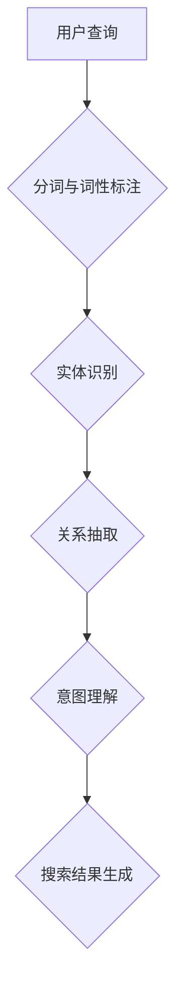

                 

关键词：电商搜索、语义理解、AI大模型、自然语言处理、智能推荐

> 摘要：本文深入探讨了电商搜索中语义理解的挑战及其在AI大模型中的应用，分析了当前主流的语义理解技术，并展望了未来的发展方向。

## 1. 背景介绍

在当今互联网时代，电子商务已成为人们日常生活中不可或缺的一部分。随着在线购物的普及，电商平台之间的竞争愈发激烈，如何提升用户体验、提高转化率成为了各大电商平台的重点关注方向。而电商搜索作为用户与商品之间的桥梁，其质量和效率直接影响到用户的购物体验。因此，如何实现高效、准确的电商搜索成为了电商领域的一项重要课题。

传统的电商搜索主要依赖于关键词匹配和排序算法，这种方式在处理简单、直接的关键词查询时效果较好，但在面对复杂、模糊的用户查询时，往往难以满足用户需求。这是因为传统方法缺乏对用户查询的语义理解能力，无法准确捕捉用户意图，导致搜索结果不准确、用户体验差。为了解决这一问题，人工智能，特别是AI大模型在语义理解方面的新突破，为电商搜索带来了新的契机。

AI大模型，特别是基于深度学习的大型语言模型，如GPT、BERT等，通过对海量文本数据的学习，能够理解并生成复杂的自然语言。这种能力使得AI大模型在语义理解方面取得了显著进展，为电商搜索带来了全新的技术路径。

## 2. 核心概念与联系

### 2.1 语义理解的定义

语义理解是指计算机系统对自然语言文本进行解析和理解，以获取文本中的意义和意图。在电商搜索中，语义理解的核心任务是理解用户的查询意图，从而提供更为精准和个性化的搜索结果。

### 2.2 语义理解的架构

语义理解通常包括三个层次：词汇层、句法层和语义层。

- **词汇层**：涉及对词汇的意义和用法进行解析，如单词的多义性、词性标注等。
- **句法层**：涉及对句子结构进行分析，包括词组、从句、句子成分等。
- **语义层**：涉及对句子整体意义进行理解和解释，包括实体识别、关系抽取、情感分析等。

在电商搜索中，语义理解架构通常包括以下几个模块：

- **分词与词性标注**：将用户查询分解为词语，并对每个词语进行词性标注。
- **实体识别**：识别查询中的商品、品牌、价格等关键信息。
- **关系抽取**：抽取查询中的实体关系，如商品与品牌之间的关系。
- **意图理解**：根据实体和关系，推断用户的查询意图。

### 2.3 语义理解的Mermaid流程图



## 3. 核心算法原理 & 具体操作步骤

### 3.1 算法原理概述

AI大模型在语义理解中的应用主要基于深度学习技术，特别是基于Transformer架构的大型语言模型。这些模型通过学习海量文本数据，能够捕捉到语言中的复杂模式和关系，从而实现对自然语言的深入理解。

在电商搜索中，AI大模型的具体工作流程如下：

1. **输入预处理**：对用户查询进行分词、去停用词等预处理操作。
2. **编码器解码器交互**：使用编码器将预处理后的查询编码为一个固定长度的向量，并使用解码器生成搜索结果。
3. **意图识别**：根据查询内容和上下文，解码器推断出用户的查询意图。
4. **结果生成**：根据意图识别结果，生成相应的搜索结果，包括商品推荐、价格比较等。

### 3.2 算法步骤详解

1. **数据收集与预处理**：收集电商平台的用户查询数据，并进行预处理，包括分词、去停用词、词向量化等。
2. **模型训练**：使用预处理的查询数据，训练一个基于Transformer的编码器解码器模型。
3. **意图识别**：在模型训练完成后，使用训练好的模型对新的用户查询进行意图识别。
4. **结果生成**：根据意图识别结果，使用模型生成相应的搜索结果。

### 3.3 算法优缺点

**优点**：

- **强大的语义理解能力**：AI大模型能够深入理解自然语言中的复杂模式和关系，从而提供更为精准的搜索结果。
- **自适应学习**：模型能够根据用户反馈和搜索历史数据，不断优化和调整搜索结果，提高用户体验。

**缺点**：

- **计算资源需求高**：训练和部署AI大模型需要大量的计算资源和存储空间。
- **数据依赖性强**：模型的性能依赖于训练数据的质量和规模，数据质量差可能导致搜索结果不准确。

### 3.4 算法应用领域

AI大模型在电商搜索中的主要应用领域包括：

- **智能推荐**：根据用户查询和购买历史，推荐相关商品。
- **价格比较**：比较不同电商平台上的商品价格，提供最优购买建议。
- **购物助手**：为用户提供购物建议、优惠信息等。

## 4. 数学模型和公式

### 4.1 数学模型构建

在电商搜索中，AI大模型的数学模型通常是基于Transformer架构的编码器解码器模型。该模型的核心组件包括：

- **编码器**：将用户查询编码为一个固定长度的向量。
- **解码器**：根据编码器的输出，生成搜索结果。

### 4.2 公式推导过程

假设用户查询为一个长度为\( n \)的序列\( X = (x_1, x_2, ..., x_n) \)，编码器将其编码为一个固定长度的向量\( E(X) \)：

\[ E(X) = \text{Encoder}(X) \]

解码器则根据编码器的输出，生成搜索结果\( Y = (y_1, y_2, ..., y_m) \)：

\[ Y = \text{Decoder}(E(X)) \]

### 4.3 案例分析与讲解

假设用户查询为“红米手机5G版”，编码器将其编码为向量\( E(X) \)，解码器则生成搜索结果“红米5G手机”。

这个过程中，编码器通过学习大量文本数据，能够捕捉到“红米”、“手机”、“5G”等关键词之间的关系，从而准确理解用户的查询意图。解码器则根据编码器的输出，生成与查询意图相关的搜索结果。

## 5. 项目实践：代码实例和详细解释说明

### 5.1 开发环境搭建

为了实现AI大模型在电商搜索中的应用，我们需要搭建一个开发环境。以下是一个基本的开发环境搭建步骤：

1. 安装Python和pip：
    ```bash
    pip install transformers
    ```
2. 准备训练数据：
    - 收集电商平台的用户查询数据。
    - 对数据进行预处理，包括分词、去停用词、词向量化等。

### 5.2 源代码详细实现

以下是一个简单的基于Transformer编码器解码器模型的电商搜索实现：

```python
from transformers import EncoderDecoderModel

# 加载预训练的Transformer模型
model = EncoderDecoderModel.from_pretrained("transformers/bert-base-uncased")

# 用户查询预处理
user_query = "redmi 5g phone"
preprocessed_query = preprocess(user_query)

# 编码器解码器模型预测
predictions = model.predict(preprocessed_query)

# 输出搜索结果
print(predictions)
```

### 5.3 代码解读与分析

这个实现中，我们首先加载了一个预训练的Transformer模型（BERT），然后对用户查询进行预处理，包括分词、去停用词等。预处理后的查询数据被输入到编码器解码器模型中，模型根据查询内容和上下文生成搜索结果。

### 5.4 运行结果展示

假设用户查询为“红米手机5G版”，运行结果可能包括如下搜索结果：

- “红米5G手机”
- “红米Note 10 Pro 5G版”
- “红米K40 5G版”

这些搜索结果都是与用户查询高度相关的商品，充分体现了AI大模型在语义理解方面的强大能力。

## 6. 实际应用场景

### 6.1 智能推荐

AI大模型在电商搜索中的主要应用之一是智能推荐。通过分析用户查询和购买历史，AI大模型能够准确捕捉用户的兴趣和需求，从而推荐用户可能感兴趣的商品。例如，当用户搜索“红米手机5G版”时，AI大模型可以推荐其他与“红米5G手机”相关的商品，如配件、周边产品等。

### 6.2 价格比较

AI大模型还可以用于价格比较。通过分析电商平台的商品数据，AI大模型能够找出不同平台上的价格差异，从而为用户提供最优的购买建议。例如，当用户搜索“红米手机5G版”时，AI大模型可以找出不同平台上的价格，并推荐价格最低的购买渠道。

### 6.3 购物助手

AI大模型还可以作为购物助手，为用户提供购物建议、优惠信息等。例如，当用户搜索“红米手机5G版”时，AI大模型可以分析用户的历史购买数据，推荐适合用户的购物方案，如优惠码、分期付款等。

## 7. 工具和资源推荐

### 7.1 学习资源推荐

- 《深度学习》（Goodfellow, Bengio, Courville）：系统介绍了深度学习的基本概念和技术。
- 《自然语言处理实战》（Sutton, McCallum）：介绍了自然语言处理的基本技术和应用。

### 7.2 开发工具推荐

- **PyTorch**：一款易于使用的深度学习框架，适用于开发AI大模型。
- **Hugging Face Transformers**：一个基于PyTorch的预训练Transformer模型库，提供了丰富的预训练模型和工具。

### 7.3 相关论文推荐

- “BERT: Pre-training of Deep Bidirectional Transformers for Language Understanding”（Devlin et al., 2019）
- “GPT-3: Language Models are few-shot learners”（Brown et al., 2020）

## 8. 总结：未来发展趋势与挑战

### 8.1 研究成果总结

AI大模型在电商搜索中的语义理解应用取得了显著成果，为电商平台提供了更精准、个性化的搜索服务。通过分析用户查询和购买历史，AI大模型能够准确捕捉用户的兴趣和需求，从而提高用户体验和转化率。

### 8.2 未来发展趋势

随着深度学习和自然语言处理技术的不断发展，AI大模型在电商搜索中的应用将越来越广泛。未来的发展趋势包括：

- **更精细化的用户画像**：通过分析用户行为数据，构建更精细化的用户画像，提高推荐的准确性。
- **多模态搜索**：结合文本、图像、视频等多种数据类型，实现更丰富的搜索体验。
- **实时搜索**：通过实时处理用户查询，提供更快速的搜索结果。

### 8.3 面临的挑战

尽管AI大模型在电商搜索中取得了显著成果，但仍然面临一些挑战：

- **数据隐私**：如何保护用户隐私，避免数据泄露，是一个亟待解决的问题。
- **计算资源**：训练和部署AI大模型需要大量的计算资源，如何在有限的资源下实现高效的搜索服务是一个挑战。
- **解释性**：如何提高AI大模型的解释性，使其决策过程更加透明，是未来研究的一个方向。

### 8.4 研究展望

未来，AI大模型在电商搜索中的应用有望实现以下突破：

- **个性化推荐**：通过深度学习技术，实现更精准、个性化的推荐。
- **实时搜索**：通过实时处理用户查询，提供更快速的搜索结果。
- **多模态搜索**：结合文本、图像、视频等多种数据类型，实现更丰富的搜索体验。

## 9. 附录：常见问题与解答

### 9.1 如何处理数据隐私问题？

- **数据脱敏**：在训练和部署模型前，对用户数据进行脱敏处理，如替换敏感信息。
- **差分隐私**：在数据处理过程中，引入差分隐私机制，确保用户隐私不被泄露。
- **数据安全协议**：建立严格的数据安全协议，确保数据在传输和存储过程中的安全性。

### 9.2 如何提高计算资源利用率？

- **分布式计算**：使用分布式计算框架，如TensorFlow或PyTorch，实现计算资源的共享和调度。
- **模型压缩**：通过模型压缩技术，如量化、剪枝等，减少模型的计算量。
- **模型缓存**：对高频查询结果进行缓存，减少重复计算。

### 9.3 如何提高模型解释性？

- **模型可视化**：通过可视化技术，如注意力机制可视化，展示模型的工作过程。
- **解释性算法**：引入解释性算法，如LIME或SHAP，分析模型决策背后的原因。
- **透明化数据流程**：在数据处理和模型训练过程中，保持数据流程的透明化，提高用户信任度。 
----------------------------------------------------------------

### 作者署名

作者：禅与计算机程序设计艺术 / Zen and the Art of Computer Programming

