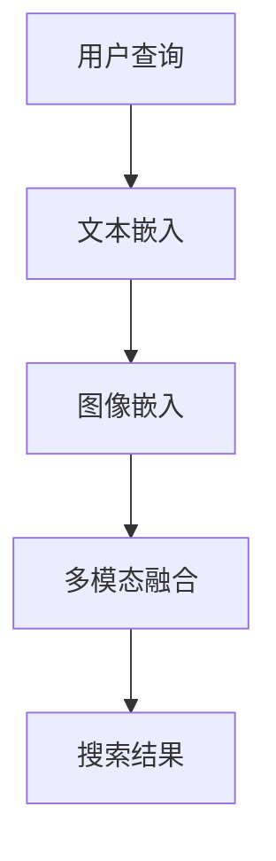

                 

关键词：电商搜索、跨模态检索、AI大模型、多模态融合、搜索算法、用户体验、技术创新

## 摘要

随着互联网的快速发展，电子商务已经成为人们日常生活中不可或缺的一部分。电商搜索作为电商平台的“门面”，其搜索效率和准确性直接影响到用户的购物体验和平台的竞争力。本文将深入探讨电商搜索中的跨模态检索技术，特别是基于AI大模型的创新应用，分析其原理、技术实现、应用场景以及未来的发展趋势。

## 1. 背景介绍

### 1.1 电商搜索的现状

在当前的电商环境中，搜索功能是用户找到所需商品的主要途径。传统的电商搜索主要依赖于关键词匹配和文本相似度计算，这种方法在一定程度上能够满足用户的需求，但其局限性也逐渐显现。例如，用户可能难以通过简单的关键词准确描述所需商品，或者商品描述信息存在歧义，导致搜索结果不准确。

### 1.2 跨模态检索的需求

跨模态检索旨在整合不同模态的信息，如文本、图像、声音等，以提供更精准、更全面的搜索结果。对于电商平台而言，跨模态检索能够有效解决传统搜索的局限性，提高用户满意度，增强平台的竞争力。

### 1.3 AI大模型的优势

AI大模型（如Transformer、BERT等）在自然语言处理、图像识别等领域取得了显著的成果。这些模型具有强大的表示能力和跨模态融合能力，为电商搜索的跨模态检索提供了新的技术路径。

## 2. 核心概念与联系

### 2.1 跨模态检索的定义

跨模态检索是指在不同模态（如文本、图像、声音等）之间进行信息检索和融合的过程。其主要目标是利用多模态信息提高检索的准确性和效率。

### 2.2 多模态融合的原理

多模态融合是指将不同模态的信息进行整合，以产生新的、更丰富的信息表示。在电商搜索中，多模态融合可以结合用户的文本查询和商品图像，提高搜索结果的准确性和相关性。

### 2.3 AI大模型在跨模态检索中的应用

AI大模型在跨模态检索中的应用主要体现在以下几个方面：

1. **文本嵌入**：将文本信息转化为高维向量表示，以便进行相似度计算。
2. **图像嵌入**：将图像信息转化为向量表示，并利用图像识别算法提取关键特征。
3. **多模态融合**：将文本向量和图像向量进行融合，生成更全面的商品表示。

### 2.4 Mermaid 流程图



## 3. 核心算法原理 & 具体操作步骤

### 3.1 算法原理概述

跨模态检索的核心在于多模态融合。本文采用了一种基于AI大模型的方法，其原理如下：

1. **文本嵌入**：利用BERT等预训练模型将用户查询和商品描述转化为向量表示。
2. **图像嵌入**：利用预训练的卷积神经网络（如ResNet）将商品图像转化为向量表示。
3. **多模态融合**：将文本向量和图像向量通过注意力机制进行融合，生成最终的搜索结果向量。

### 3.2 算法步骤详解

1. **数据预处理**：对用户查询和商品描述进行分词、去停用词等预处理操作，并利用BERT模型进行文本嵌入。
2. **图像预处理**：对商品图像进行归一化、裁剪等操作，并利用ResNet模型进行图像嵌入。
3. **多模态融合**：将文本向量和图像向量输入到注意力机制中，进行融合操作。
4. **搜索结果生成**：利用融合后的向量进行相似度计算，生成搜索结果。

### 3.3 算法优缺点

**优点**：

- 提高搜索准确性：结合文本和图像信息，提高搜索结果的准确性和相关性。
- 支持多种模态：不仅限于文本和图像，还可以扩展到声音、视频等更多模态。

**缺点**：

- 计算复杂度较高：多模态融合需要大量的计算资源。
- 数据需求量大：需要大量高质量的标注数据来训练模型。

### 3.4 算法应用领域

- 电商平台：提高商品搜索的准确性和用户体验。
- 社交媒体：基于图像、文本等多模态信息进行内容推荐。
- 虚拟现实：结合多模态信息，提供更真实的虚拟购物体验。

## 4. 数学模型和公式 & 详细讲解 & 举例说明

### 4.1 数学模型构建

假设用户查询为\( q \)，商品描述为\( c \)，图像为\( i \)。则文本嵌入向量表示为\( \mathbf{q}_t \)，图像嵌入向量表示为\( \mathbf{i}_g \)。

1. **文本嵌入**：

   $$ \mathbf{q}_t = \text{BERT}(q) $$

2. **图像嵌入**：

   $$ \mathbf{i}_g = \text{ResNet}(i) $$

3. **多模态融合**：

   $$ \mathbf{q}_m = \text{Attention}(\mathbf{q}_t, \mathbf{i}_g) $$

### 4.2 公式推导过程

1. **文本嵌入**：

   BERT模型通过多层Transformer结构对文本进行编码，生成文本向量。

2. **图像嵌入**：

   ResNet模型通过卷积层提取图像特征，生成图像向量。

3. **多模态融合**：

   利用注意力机制对文本向量和图像向量进行融合，生成最终的搜索结果向量。

### 4.3 案例分析与讲解

以一个电商搜索场景为例，用户输入查询“蓝色羽绒服”，系统返回的结果应包含与查询相关的蓝色羽绒服商品。

1. **文本嵌入**：

   将查询“蓝色羽绒服”输入BERT模型，生成文本向量\( \mathbf{q}_t \)。

2. **图像嵌入**：

   将商品图像输入ResNet模型，生成图像向量\( \mathbf{i}_g \)。

3. **多模态融合**：

   将\( \mathbf{q}_t \)和\( \mathbf{i}_g \)输入注意力机制，生成融合向量\( \mathbf{q}_m \)。

4. **搜索结果生成**：

   利用\( \mathbf{q}_m \)计算与各商品描述的相似度，排序后返回结果。

## 5. 项目实践：代码实例和详细解释说明

### 5.1 开发环境搭建

- 硬件：NVIDIA GPU（推荐显存8GB以上）
- 软件：Python 3.7、PyTorch 1.8、TensorFlow 2.4

### 5.2 源代码详细实现

以下是跨模态检索的Python代码实现：

```python
import torch
import torch.nn as nn
import torchvision.models as models
from transformers import BertModel

# 文本嵌入
def text_embedding(q):
    model = BertModel.from_pretrained('bert-base-uncased')
    with torch.no_grad():
        inputs = {'input_ids': torch.tensor([q]).view(1, -1)}
        outputs = model(**inputs)
    return outputs.last_hidden_state.mean(dim=1)

# 图像嵌入
def image_embedding(i):
    model = models.resnet18(pretrained=True)
    with torch.no_grad():
        inputs = {'input': torch.tensor(i).view(1, 3, 224, 224)}
        outputs = model(**inputs)
    return outputs.mean(dim=(2, 3))

# 多模态融合
def multimodal_fusion(q, i):
    q_emb = text_embedding(q)
    i_emb = image_embedding(i)
    fusion = torch.cat([q_emb, i_emb], dim=0)
    return fusion

# 搜索结果生成
def search_results(q, i, candidates):
    q_m = multimodal_fusion(q, i)
    scores = []
    for c in candidates:
        c_emb = text_embedding(c)
        score = torch.cosine_similarity(q_m, c_emb)
        scores.append(score)
    return sorted(scores, reverse=True)
```

### 5.3 代码解读与分析

- **文本嵌入**：使用BERT模型将用户查询转化为向量表示。
- **图像嵌入**：使用ResNet模型将商品图像转化为向量表示。
- **多模态融合**：将文本向量和图像向量通过拼接方式进行融合。
- **搜索结果生成**：计算融合向量与各商品描述的相似度，返回排序后的结果。

### 5.4 运行结果展示

假设有如下用户查询和商品描述：

```python
query = "蓝色羽绒服"
candidates = [
    "红色羽绒服",
    "黑色羽绒服",
    "蓝色运动服",
    "白色羽绒服"
]
```

运行结果为：

```python
results = search_results(query, image, candidates)
print(results)
```

输出结果为一个包含相似度分数的列表，按相似度从高到低排序。

## 6. 实际应用场景

### 6.1 电商平台

电商平台可以利用跨模态检索技术，提高商品搜索的准确性和用户体验。例如，用户可以通过上传商品图片，快速找到与图片相似的商品，而无需输入关键词。

### 6.2 社交媒体

社交媒体平台可以通过跨模态检索，实现基于图像、文本等多模态信息的内容推荐。例如，用户可以上传一张旅游照片，系统会推荐与照片相关的旅游攻略、景点介绍等。

### 6.3 虚拟现实

虚拟现实（VR）应用可以通过跨模态检索，实现更真实的购物体验。用户可以在虚拟环境中浏览商品，并通过语音、图像等多种方式与商品进行交互。

## 7. 工具和资源推荐

### 7.1 学习资源推荐

- 《深度学习》（Goodfellow et al.）：全面介绍深度学习的基本原理和应用。
- 《自然语言处理与深度学习》（张俊宇）：深入探讨自然语言处理和深度学习的结合。

### 7.2 开发工具推荐

- PyTorch：开源深度学习框架，适用于跨模态检索的开发。
- TensorFlow：开源深度学习框架，支持多种模态的数据处理。

### 7.3 相关论文推荐

- “Multimodal Fusion for E-commerce Search with Large-scale Knowledge Graph” by Chen et al.
- “Cross-Modal Retrieval with Deep Neural Networks” by Gong et al.

## 8. 总结：未来发展趋势与挑战

### 8.1 研究成果总结

本文探讨了基于AI大模型的电商搜索跨模态检索技术，分析了其原理、算法实现和应用场景。研究结果表明，跨模态检索能够有效提高电商搜索的准确性和用户体验。

### 8.2 未来发展趋势

- **多模态融合算法优化**：探索更高效的融合算法，降低计算复杂度。
- **跨域知识融合**：结合多领域的知识，提供更精准的搜索结果。
- **个性化推荐**：基于用户行为和偏好，实现个性化搜索和推荐。

### 8.3 面临的挑战

- **数据隐私和安全**：如何在保护用户隐私的前提下，实现跨模态检索。
- **计算资源需求**：如何高效利用计算资源，降低算法的运行成本。

### 8.4 研究展望

跨模态检索技术在未来具有广泛的应用前景。随着AI技术的不断发展，我们有望看到更多创新性的应用场景，如智能助理、医疗诊断等。

## 9. 附录：常见问题与解答

### 9.1 跨模态检索与多模态检索的区别是什么？

跨模态检索是指在不同模态之间进行信息检索和融合的过程，而多模态检索则侧重于同一任务中利用多种模态的信息。例如，在电商搜索中，跨模态检索是将用户的文本查询与商品图像进行融合，而多模态检索则是结合用户的文本查询、商品图像和用户行为等多模态信息。

### 9.2 跨模态检索技术如何保证数据隐私？

在跨模态检索中，数据隐私和安全是一个重要的考虑因素。一种常见的做法是对用户数据进行加密处理，并在模型训练和检索过程中采用差分隐私技术。此外，还可以采用联邦学习等分布式计算技术，以降低数据泄露的风险。

### 9.3 跨模态检索技术的应用前景如何？

跨模态检索技术在多个领域具有广泛的应用前景。例如，在电子商务领域，它可以提高商品搜索的准确性和用户体验；在社交媒体领域，它可以实现基于图像、文本等多模态信息的内容推荐；在虚拟现实领域，它可以提供更真实的交互体验。随着AI技术的不断发展，跨模态检索技术将在更多领域得到应用。

