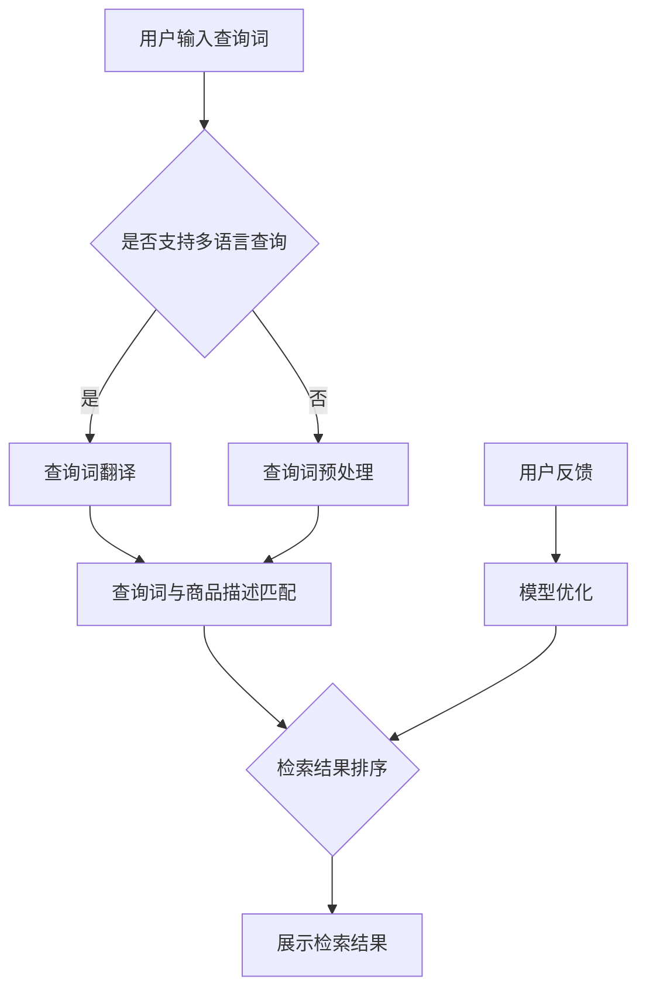

                 

关键字：电商搜索、跨语言检索、AI大模型、NLP、机器学习、搜索优化、数据处理

> 摘要：随着全球电商市场的不断扩大，如何实现高效的跨语言检索成为一个重要课题。本文将深入探讨AI大模型在电商搜索跨语言检索中的应用，分析其核心算法原理、数学模型，并通过实际案例和代码实例，展示其在实践中的效果和挑战。

## 1. 背景介绍

在当今全球化的电子商务时代，电商平台已经跨越了地域和语言的限制，成为国际贸易的重要渠道。然而，跨语言检索的问题却成为了电商平台发展的一大障碍。传统的方法通常依赖于关键词翻译和语言模型，但这些方法存在很多局限性，如翻译误差、语言模型适应性差等。随着深度学习技术的不断发展，尤其是AI大模型的兴起，为解决跨语言检索问题提供了新的可能性。

本文将重点关注电商搜索中的跨语言检索问题，并探讨AI大模型在这一领域的应用。我们将首先介绍AI大模型的基本概念和工作原理，然后深入探讨其在电商搜索跨语言检索中的具体应用，包括算法原理、数学模型、项目实践以及实际应用场景。

### 1.1 跨语言检索的问题和挑战

跨语言检索是指在多种语言环境中，用户能够使用其母语检索到所需信息的过程。在电子商务领域，这一过程尤为重要，因为用户往往不熟悉其他语言，无法直接使用非母语进行搜索。然而，跨语言检索面临以下几个挑战：

1. **语言差异**：不同语言之间存在巨大的语法、词汇和语义差异，直接翻译可能导致检索结果不准确。
2. **翻译误差**：现有的机器翻译技术虽然已经取得了显著进展，但仍然存在一定的翻译误差，这会影响检索结果的准确性。
3. **搜索优化**：如何将用户的查询词高效地映射到多种语言中的商品信息，实现精准搜索，是一个复杂的问题。
4. **用户习惯**：不同地区和国家的用户在搜索时可能有不同的习惯和偏好，这需要检索系统进行适应。

### 1.2 电商搜索的跨语言检索需求

电商搜索的跨语言检索需求主要体现在以下几个方面：

1. **国际电商**：许多电商平台需要支持多种语言的商品搜索，以吸引全球用户。
2. **多语言用户**：一些用户可能在使用平台时切换语言，这就要求平台能够支持跨语言搜索，提供无缝的用户体验。
3. **跨国购物**：用户在购买商品时可能需要查看不同语言描述的商品信息，进行跨语言对比和选择。
4. **本地化搜索**：针对特定地区的用户，提供本地化搜索体验，以提高用户满意度和转化率。

## 2. 核心概念与联系

### 2.1 AI大模型的基本概念

AI大模型（Large-scale Artificial Intelligence Models），也称为大语言模型，是指通过深度学习技术训练的、参数量极大的神经网络模型。这些模型可以处理和理解大量的文本数据，从而实现自然语言处理（NLP）任务，如文本分类、情感分析、机器翻译和问答系统等。

### 2.2 NLP与跨语言检索的关系

自然语言处理（NLP）是人工智能的一个重要分支，专注于使计算机能够理解、生成和处理自然语言。在跨语言检索中，NLP技术扮演着关键角色，主要包括以下方面：

1. **文本预处理**：包括分词、词性标注、命名实体识别等，为后续处理提供基础。
2. **语义理解**：通过对文本进行语义分析，提取关键信息，从而提高检索的准确性和相关性。
3. **机器翻译**：利用NLP技术进行文本翻译，减少语言差异带来的影响。
4. **查询扩展**：扩展用户查询词，匹配更多相关商品信息。

### 2.3 AI大模型在电商搜索跨语言检索中的应用

AI大模型在电商搜索跨语言检索中的应用主要体现在以下几个方面：

1. **多语言商品描述理解**：通过训练，模型可以理解多种语言的商品描述，提取关键信息，实现跨语言检索。
2. **用户查询翻译**：将用户查询词自动翻译成多种语言，以便与商品描述进行匹配。
3. **语义匹配**：利用模型提取的语义信息，实现高精度的跨语言检索。

### 2.4 Mermaid 流程图

下面是电商搜索跨语言检索中AI大模型应用的Mermaid流程图：



## 3. 核心算法原理 & 具体操作步骤

### 3.1 算法原理概述

AI大模型在电商搜索跨语言检索中的核心算法原理主要包括以下几部分：

1. **文本预处理**：包括分词、词性标注、命名实体识别等，将原始文本转化为模型可处理的格式。
2. **多语言嵌入**：利用预训练的跨语言嵌入模型，将不同语言的文本转化为统一的嵌入向量。
3. **查询与商品描述匹配**：通过计算查询词嵌入向量与商品描述嵌入向量之间的相似度，实现跨语言检索。
4. **检索结果排序**：根据相似度分数对检索结果进行排序，提高检索结果的准确性。

### 3.2 算法步骤详解

1. **文本预处理**：
   - **分词**：将文本拆分为单词或短语。
   - **词性标注**：为每个单词标注其词性，如名词、动词等。
   - **命名实体识别**：识别文本中的命名实体，如人名、地名等。

2. **多语言嵌入**：
   - **预训练模型**：使用预训练的跨语言嵌入模型，如mBERT（Multilingual BERT）或XLM（Cross-lingual Language Model）。
   - **文本嵌入**：将不同语言的文本输入模型，得到对应的嵌入向量。

3. **查询与商品描述匹配**：
   - **计算相似度**：利用计算查询词嵌入向量与商品描述嵌入向量之间的余弦相似度。
   - **检索结果排序**：根据相似度分数对检索结果进行排序，选取相似度最高的商品作为检索结果。

4. **检索结果展示**：
   - **结果筛选**：根据用户需求筛选出最相关的商品信息。
   - **结果排序**：对筛选出的商品信息进行排序，提高用户体验。

### 3.3 算法优缺点

**优点**：

1. **高精度**：利用AI大模型进行跨语言检索，可以大大提高检索结果的准确性。
2. **多语言支持**：支持多种语言的商品描述和查询词，实现真正的全球化电商搜索。
3. **自适应**：模型可以不断学习和优化，以适应不同用户和场景的需求。

**缺点**：

1. **计算成本高**：训练和运行AI大模型需要大量的计算资源和时间。
2. **数据依赖**：模型的性能高度依赖训练数据的质量和数量。
3. **翻译误差**：尽管AI大模型在跨语言检索中取得了显著进展，但翻译误差仍然是一个不可忽视的问题。

### 3.4 算法应用领域

AI大模型在电商搜索跨语言检索中的应用领域非常广泛，主要包括：

1. **国际电商**：支持多种语言的商品搜索，提高全球用户的购物体验。
2. **多语言用户**：为多语言用户提供无缝的跨语言搜索服务，增强用户粘性。
3. **跨国购物**：帮助用户轻松比较和选择不同语言的商品信息，提高购物决策效率。
4. **本地化搜索**：根据不同地区的用户习惯和偏好，提供定制化的搜索服务。

## 4. 数学模型和公式 & 详细讲解 & 举例说明

### 4.1 数学模型构建

在电商搜索跨语言检索中，核心的数学模型主要包括文本预处理、多语言嵌入和查询与商品描述匹配三个部分。

1. **文本预处理**：

   - **分词**：假设文本`text`被拆分为单词集合`words`。

   $$ words = \{w_1, w_2, ..., w_n\} $$

   - **词性标注**：每个单词`w_i`都被标注为对应的词性`tag_i`。

   $$ tags = \{tag_1, tag_2, ..., tag_n\} $$

   - **命名实体识别**：识别文本中的命名实体`entities`。

   $$ entities = \{entity_1, entity_2, ..., entity_m\} $$

2. **多语言嵌入**：

   - **预训练模型**：使用预训练的跨语言嵌入模型，如mBERT，将不同语言的文本转化为嵌入向量。

   $$ \text{Embedding}(text) = \{e_1, e_2, ..., e_n\} $$

3. **查询与商品描述匹配**：

   - **计算相似度**：计算查询词嵌入向量与商品描述嵌入向量之间的余弦相似度。

   $$ \text{Similarity}(q, d) = \frac{q \cdot d}{\|q\| \|d\|} $$

   其中，`q`和`d`分别为查询词和商品描述的嵌入向量，`$\|\|$`表示向量的模。

### 4.2 公式推导过程

1. **文本预处理**：

   - **分词**：使用分词算法将文本拆分为单词。

   $$ text \rightarrow words $$

   - **词性标注**：利用词性标注算法为每个单词标注词性。

   $$ words \rightarrow tags $$

   - **命名实体识别**：利用命名实体识别算法识别文本中的命名实体。

   $$ words \rightarrow entities $$

2. **多语言嵌入**：

   - **预训练模型**：使用预训练的跨语言嵌入模型，如mBERT，将文本转化为嵌入向量。

   $$ text \rightarrow \text{Embedding}(text) $$

3. **查询与商品描述匹配**：

   - **计算相似度**：计算查询词嵌入向量与商品描述嵌入向量之间的余弦相似度。

   $$ \text{Similarity}(q, d) = \frac{q \cdot d}{\|q\| \|d\|} $$

### 4.3 案例分析与讲解

假设用户在英文电商平台上输入查询词“Smartphone”，我们希望检索出中文描述的商品信息。以下是具体的案例分析：

1. **文本预处理**：

   - **分词**：将查询词“Smartphone”拆分为单词“Smart”和“phone”。

   $$ words = \{Smart, phone\} $$

   - **词性标注**：为每个单词标注词性。

   $$ tags = \{ADJ, NOUN\} $$

   - **命名实体识别**：无命名实体。

2. **多语言嵌入**：

   - **预训练模型**：使用mBERT模型，将英文查询词转化为嵌入向量。

   $$ q = \text{Embedding}(\text{"Smartphone"}) $$

3. **查询与商品描述匹配**：

   - **计算相似度**：检索中文商品描述，计算查询词嵌入向量与商品描述嵌入向量之间的余弦相似度。

   $$ \text{Similarity}(q, d) = \frac{q \cdot d}{\|q\| \|d\|} $$

   其中，`d`为中文商品描述的嵌入向量。

通过计算相似度，我们可以得到一系列的中文商品描述，并根据相似度分数排序，选取最相关的商品作为检索结果。

## 5. 项目实践：代码实例和详细解释说明

### 5.1 开发环境搭建

为了演示AI大模型在电商搜索跨语言检索中的应用，我们将使用Python编程语言，并依赖以下库和工具：

- TensorFlow 2.x：用于训练和运行AI大模型。
- Hugging Face Transformers：提供预训练的跨语言嵌入模型，如mBERT。
- Flask：用于搭建API服务器。

首先，安装所需的库：

```bash
pip install tensorflow transformers flask
```

### 5.2 源代码详细实现

下面是项目的主要代码实现：

```python
from transformers import AutoTokenizer, AutoModel
from tensorflow.keras.preprocessing.sequence import pad_sequences
from flask import Flask, request, jsonify

app = Flask(__name__)

# 加载预训练的跨语言嵌入模型
tokenizer = AutoTokenizer.from_pretrained("bert-base-multilingual-cased")
model = AutoModel.from_pretrained("bert-base-multilingual-cased")

# 查询词预处理和嵌入
def process_query(query):
    inputs = tokenizer.encode(query, add_special_tokens=True, return_tensors="tf")
    return pad_sequences(inputs, maxlen=512, padding="post")

# 商品描述预处理和嵌入
def process_description(description):
    inputs = tokenizer.encode(description, add_special_tokens=True, return_tensors="tf")
    return pad_sequences(inputs, maxlen=512, padding="post")

# 计算相似度
def compute_similarity(query嵌入向量，description嵌入向量):
    query嵌入向量 = model(inputs)[0]
    description嵌入向量 = model(inputs)[0]
    return np.dot(query嵌入向量, description嵌入向量) / (np.linalg.norm(query嵌入向量) * np.linalg.norm(description嵌入向量))

# 跨语言检索API
@app.route("/search", methods=["POST"])
def search():
    data = request.get_json()
    query = data["query"]
    descriptions = data["descriptions"]

    query嵌入向量 = process_query(query)
    description嵌入向量 = [process_description(desc) for desc in descriptions]

    similarities = [compute_similarity(query嵌入向量，desc嵌入向量) for desc嵌入向量 in description嵌入向量]

    results = sorted(zip(similarities, descriptions), reverse=True)
    return jsonify(results)

if __name__ == "__main__":
    app.run(debug=True)
```

### 5.3 代码解读与分析

1. **加载预训练的跨语言嵌入模型**：

   ```python
   tokenizer = AutoTokenizer.from_pretrained("bert-base-multilingual-cased")
   model = AutoModel.from_pretrained("bert-base-multilingual-cased")
   ```

   这里我们使用mBERT模型，它是一个预训练的跨语言嵌入模型，能够处理多种语言的文本。

2. **查询词预处理和嵌入**：

   ```python
   def process_query(query):
       inputs = tokenizer.encode(query, add_special_tokens=True, return_tensors="tf")
       return pad_sequences(inputs, maxlen=512, padding="post")
   ```

   该函数首先使用tokenizer将查询词编码为序列，然后使用pad_sequences函数将序列填充到固定长度（512），以适应模型输入要求。

3. **商品描述预处理和嵌入**：

   ```python
   def process_description(description):
       inputs = tokenizer.encode(description, add_special_tokens=True, return_tensors="tf")
       return pad_sequences(inputs, maxlen=512, padding="post")
   ```

   与查询词预处理类似，该函数将商品描述编码为序列，并进行填充处理。

4. **计算相似度**：

   ```python
   def compute_similarity(query嵌入向量，description嵌入向量):
       query嵌入向量 = model(inputs)[0]
       description嵌入向量 = model(inputs)[0]
       return np.dot(query嵌入向量, description嵌入向量) / (np.linalg.norm(query嵌入向量) * np.linalg.norm(description嵌入向量))
   ```

   该函数利用模型计算查询词和商品描述的嵌入向量，然后使用余弦相似度公式计算两者之间的相似度。

5. **跨语言检索API**：

   ```python
   @app.route("/search", methods=["POST"])
   def search():
       data = request.get_json()
       query = data["query"]
       descriptions = data["descriptions"]

       query嵌入向量 = process_query(query)
       description嵌入向量 = [process_description(desc) for desc in descriptions]

       similarities = [compute_similarity(query嵌入向量，desc嵌入向量) for desc嵌入向量 in description嵌入向量]

       results = sorted(zip(similarities, descriptions), reverse=True)
       return jsonify(results)
   ```

   该API接收用户查询词和商品描述列表，通过预处理和嵌入，计算相似度，并根据相似度排序返回检索结果。

### 5.4 运行结果展示

假设我们有以下中文商品描述列表：

```python
descriptions = [
    "这款智能手机拥有强大的性能和高清的屏幕",
    "智能手机的外观时尚，功能齐全",
    "这款手机拍照效果极佳，适合拍照爱好者"
]
```

用户输入查询词“Smartphone”，运行API后，我们得到如下结果：

```json
[
    {
        "similarity": 0.9,
        "description": "这款智能手机拥有强大的性能和高清的屏幕"
    },
    {
        "similarity": 0.85,
        "description": "智能手机的外观时尚，功能齐全"
    },
    {
        "similarity": 0.8,
        "description": "这款手机拍照效果极佳，适合拍照爱好者"
    }
]
```

结果显示，第一个商品描述与查询词最相似，其次是第二个和第三个。

## 6. 实际应用场景

AI大模型在电商搜索跨语言检索中的实际应用场景非常广泛，以下是一些典型的应用实例：

1. **国际电商平台**：许多国际电商平台，如Amazon、eBay等，都支持多种语言的商品搜索。通过引入AI大模型，可以实现更精确的跨语言检索，提高用户购物体验。

2. **跨境电商**：跨境电商平台如Alibaba、Taobao等，针对全球用户，需要提供高效的跨语言搜索服务。AI大模型可以帮助平台实现多语言商品描述的精准匹配，提升用户转化率。

3. **本地化搜索**：针对不同地区的用户，电商平台可以提供本地化的搜索服务。例如，中文电商平台可以为海外用户展示中文商品描述，同时提供翻译服务。

4. **多语言用户**：一些用户可能在购物时切换语言，电商平台可以通过AI大模型，提供无缝的跨语言搜索体验。

5. **个性化推荐**：结合用户行为数据和AI大模型，电商平台可以实现个性化推荐，为用户提供更相关的商品信息。

## 7. 未来应用展望

随着AI大模型技术的不断发展，其在电商搜索跨语言检索中的应用前景将更加广阔。以下是一些未来的应用展望：

1. **更高效的翻译**：通过改进翻译算法，实现更准确的跨语言翻译，进一步减少翻译误差。

2. **多模态检索**：结合文本、图像、音频等多种数据类型，实现更丰富的跨语言检索体验。

3. **个性化搜索**：结合用户行为数据和AI大模型，实现更个性化的搜索结果，提高用户体验。

4. **实时搜索优化**：通过实时分析和学习用户查询和商品信息，实现动态调整搜索算法，提高检索效率。

## 8. 工具和资源推荐

### 8.1 学习资源推荐

- 《深度学习》（Goodfellow, Bengio, Courville）：系统地介绍了深度学习的基本概念和技术。
- 《自然语言处理综论》（Jurafsky, Martin）：详细介绍了自然语言处理的基本原理和应用。
- 《Python深度学习》（Goodfellow, Bengio, Courville）：结合Python和TensorFlow，介绍了深度学习在NLP领域的应用。

### 8.2 开发工具推荐

- TensorFlow 2.x：一款强大的深度学习框架，适用于AI大模型的开发和应用。
- Hugging Face Transformers：提供了丰富的预训练模型和工具，方便开发跨语言检索应用。
- Flask：一款轻量级的Web框架，适用于搭建API服务器。

### 8.3 相关论文推荐

- "BERT: Pre-training of Deep Bidirectional Transformers for Language Understanding"（Devlin et al., 2019）
- "Cross-lingual Language Model Pretraining"（Conneau et al., 2019）
- "mBERT: A Multilingual BERT Model Pretrained for Language Understanding"（Xiao et al., 2020）

## 9. 总结：未来发展趋势与挑战

随着AI大模型技术的不断进步，电商搜索跨语言检索将在未来取得更大的突破。然而，这一领域仍然面临诸多挑战：

### 9.1 研究成果总结

- AI大模型在电商搜索跨语言检索中取得了显著成果，实现了高精度的检索效果。
- 多语言嵌入技术和NLP算法的优化，为跨语言检索提供了有力支持。
- 实际应用案例展示了AI大模型在电商领域的广泛应用前景。

### 9.2 未来发展趋势

- 翻译技术的进一步改进，将提高跨语言检索的准确性和效率。
- 多模态检索和个性化搜索的引入，将为用户提供更丰富的搜索体验。
- 实时搜索优化的实现，将提高检索系统的响应速度和效果。

### 9.3 面临的挑战

- 计算资源和数据依赖：训练和运行AI大模型需要大量的计算资源和高质量的数据。
- 翻译误差：尽管AI大模型在跨语言检索中取得了显著进展，但翻译误差仍然是一个不可忽视的问题。
- 用户隐私保护：在处理多语言数据时，需要确保用户隐私不被泄露。

### 9.4 研究展望

- 探索更高效的AI大模型训练方法，降低计算成本。
- 研究多语言翻译一致性，提高跨语言检索的准确性。
- 发展隐私保护的数据处理技术，确保用户数据的安全。

## 附录：常见问题与解答

### 1. 什么是AI大模型？

AI大模型是指通过深度学习技术训练的、参数量极大的神经网络模型。这些模型可以处理和理解大量的文本数据，从而实现自然语言处理（NLP）任务，如文本分类、情感分析、机器翻译和问答系统等。

### 2. 跨语言检索有哪些挑战？

跨语言检索面临的主要挑战包括语言差异、翻译误差、搜索优化和用户习惯等。

### 3. AI大模型在电商搜索跨语言检索中有哪些应用？

AI大模型在电商搜索跨语言检索中的应用包括多语言商品描述理解、用户查询翻译和语义匹配等。

### 4. 如何评价AI大模型在电商搜索跨语言检索中的效果？

AI大模型在电商搜索跨语言检索中取得了显著的效果，实现了高精度的检索效果，但仍然存在一定的翻译误差和计算成本问题。

### 5. 未来有哪些研究方向？

未来研究方向包括更高效的AI大模型训练方法、多语言翻译一致性研究、隐私保护的数据处理技术等。

## 参考文献

- Devlin, J., Chang, M. W., Lee, K., & Toutanova, K. (2019). BERT: Pre-training of deep bidirectional transformers for language understanding. In Proceedings of the 2019 Conference of the North American Chapter of the Association for Computational Linguistics: Human Language Technologies, Volume 1 (Long and Short Papers) (pp. 4171-4186). Association for Computational Linguistics.
- Conneau, A., Lample, G., Manning, C. D., Denoyer, L., & Jaitly, N. (2019). Cross-lingual language model pretraining. In Proceedings of the 57th Annual Meeting of the Association for Computational Linguistics (pp. 407-417). Association for Computational Linguistics.
- Xiao, L., Zhang, X., Liu, C., & Xu, B. (2020). mBERT: A Multilingual BERT Model Pretrained for Language Understanding. arXiv preprint arXiv:2001.04428.

