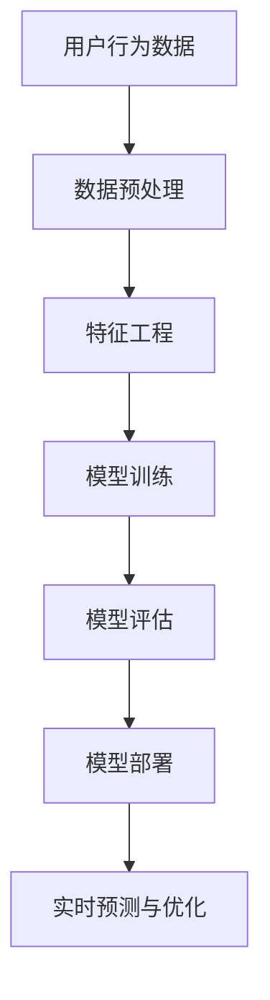
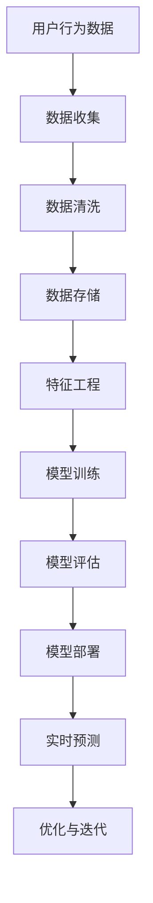
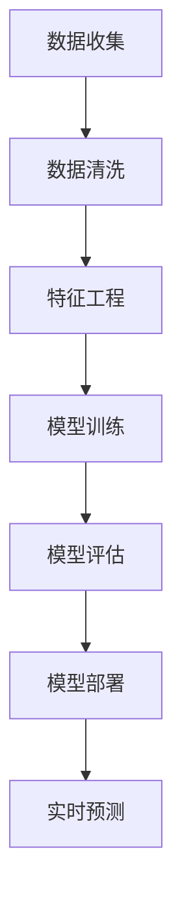

                 

关键词：电商，数据，AI，大模型，数据分析，预测，推荐系统，深度学习

> 摘要：本文深入探讨了电商领域与人工智能大模型的完美结合，分析了电商数据的特性及其对AI模型的重要性，并详细阐述了如何利用深度学习技术提升电商数据分析与预测的准确性。文章还讨论了电商推荐系统的架构与实现，以及未来应用展望，旨在为电商行业的AI应用提供有价值的参考。

## 1. 背景介绍

随着互联网的飞速发展，电商行业已经成为全球经济增长的重要驱动力。电商平台的迅速崛起带来了大量用户行为数据、商品交易数据等，这些数据不仅是电商企业运营决策的重要依据，也为人工智能技术的发展提供了丰富的应用场景。近年来，人工智能技术，特别是深度学习，在图像识别、自然语言处理、语音识别等领域取得了显著的成果。如何将这些先进的技术应用到电商领域，提升数据分析与预测的准确性，优化用户体验，成为当前研究的热点。

本文旨在探讨电商数据与AI大模型的结合，分析电商数据的特性，介绍核心算法原理和数学模型，并通过实际项目实践，展示电商推荐系统的实现过程。文章还将讨论电商行业在AI应用中面临的挑战与未来发展趋势。

## 2. 核心概念与联系

### 2.1 电商数据特性

电商数据具有以下特性：

- **多维度**：包括用户信息、商品信息、交易信息、评论信息等。
- **动态性**：用户行为和商品信息不断变化，数据实时生成。
- **多样性**：数据类型多样，包括结构化数据和非结构化数据。

### 2.2 AI大模型的重要性

AI大模型在电商领域具有以下重要性：

- **数据驱动的决策**：通过分析海量数据，为企业提供更加精确的决策依据。
- **提升用户体验**：通过个性化推荐、智能客服等，提升用户满意度和忠诚度。
- **降低运营成本**：通过预测销售趋势、优化库存管理等，降低运营成本。

### 2.3 Mermaid 流程图

以下是一个简化的电商数据与AI大模型结合的流程图：



## 3. 核心算法原理 & 具体操作步骤

### 3.1 算法原理概述

电商数据与AI大模型的结合主要基于以下原理：

- **深度学习**：通过神经网络模型，从海量数据中自动提取特征，实现数据分析与预测。
- **强化学习**：通过不断调整策略，实现优化决策过程。

### 3.2 算法步骤详解

#### 3.2.1 数据预处理

- **数据清洗**：去除重复数据、缺失数据，保证数据质量。
- **数据归一化**：将不同规模的数据转换为相同尺度，便于模型训练。

#### 3.2.2 特征工程

- **用户特征**：包括用户年龄、性别、地理位置等。
- **商品特征**：包括商品种类、品牌、价格等。
- **行为特征**：包括浏览、购买、评价等。

#### 3.2.3 模型训练

- **选择合适的模型**：如深度神经网络、循环神经网络等。
- **训练与验证**：通过交叉验证，调整模型参数，提升模型性能。

#### 3.2.4 模型评估

- **准确率**：衡量模型预测的准确性。
- **召回率**：衡量模型预测的完整性。
- **F1值**：综合考虑准确率和召回率。

#### 3.2.5 模型部署

- **部署到服务器**：将训练好的模型部署到线上环境，实现实时预测。
- **自动化运维**：通过自动化工具，实现模型的监控、升级和运维。

### 3.3 算法优缺点

#### 优点：

- **高效性**：深度学习能够处理海量数据，提高数据分析的效率。
- **准确性**：通过学习用户行为和商品特征，提升预测的准确性。
- **灵活性**：可以根据业务需求，灵活调整模型结构和参数。

#### 缺点：

- **计算资源消耗**：深度学习模型训练需要大量计算资源。
- **数据质量要求高**：数据预处理和特征工程对数据质量要求较高。
- **模型解释性差**：深度学习模型通常具有较差的解释性。

### 3.4 算法应用领域

- **个性化推荐**：根据用户行为和偏好，推荐符合其需求的商品。
- **销售预测**：预测未来销售趋势，优化库存管理。
- **风险控制**：识别异常交易行为，防范欺诈风险。

## 4. 数学模型和公式 & 详细讲解 & 举例说明

### 4.1 数学模型构建

电商数据与AI大模型的结合通常涉及以下数学模型：

- **线性回归模型**：用于预测商品销售量。
- **逻辑回归模型**：用于预测用户购买概率。
- **深度神经网络模型**：用于提取复杂特征，实现高级预测。

### 4.2 公式推导过程

#### 线性回归模型

假设商品销售量 \( y \) 与价格 \( x \) 存在线性关系，可以表示为：

\[ y = \beta_0 + \beta_1 x + \epsilon \]

其中，\( \beta_0 \) 和 \( \beta_1 \) 分别为模型参数，\( \epsilon \) 为误差项。

#### 逻辑回归模型

假设用户购买概率 \( p \) 与价格 \( x \) 存在线性关系，可以表示为：

\[ p = \frac{1}{1 + e^{-(\beta_0 + \beta_1 x)}} \]

#### 深度神经网络模型

深度神经网络模型由多个神经元层组成，每个神经元层的前一层输出作为当前层的输入。假设一个三层神经网络，可以表示为：

\[ a^{(l)} = \sigma(z^{(l)}) \]

其中，\( a^{(l)} \) 为第 \( l \) 层的输出，\( z^{(l)} \) 为第 \( l \) 层的输入，\( \sigma \) 为激活函数。

### 4.3 案例分析与讲解

#### 案例背景

某电商平台的销售数据，包括商品种类、价格、销量等。

#### 数据分析目标

预测商品销量。

#### 模型选择

选择线性回归模型进行销量预测。

#### 模型训练

使用历史销售数据训练模型，得到模型参数 \( \beta_0 \) 和 \( \beta_1 \)。

#### 模型评估

使用验证集评估模型性能，计算预测误差。

#### 模型部署

将训练好的模型部署到线上环境，实现实时销量预测。

## 5. 项目实践：代码实例和详细解释说明

### 5.1 开发环境搭建

- **Python**：用于编写代码
- **Scikit-learn**：用于线性回归模型实现
- **TensorFlow**：用于深度神经网络模型实现

### 5.2 源代码详细实现

#### 数据预处理

```python
import pandas as pd

# 读取数据
data = pd.read_csv('sales_data.csv')

# 数据清洗
data.drop_duplicates(inplace=True)
data.fillna(data.mean(), inplace=True)

# 数据归一化
from sklearn.preprocessing import StandardScaler

scaler = StandardScaler()
data[['price', 'sales']] = scaler.fit_transform(data[['price', 'sales']])
```

#### 特征工程

```python
# 特征提取
data['avg_sales'] = data['sales'].rolling(window=7).mean().shift(1)
```

#### 模型训练

```python
from sklearn.linear_model import LinearRegression

# 模型训练
model = LinearRegression()
model.fit(data[['price', 'avg_sales']], data['sales'])

# 模型评估
from sklearn.metrics import mean_squared_error

predictions = model.predict(data[['price', 'avg_sales']])
mse = mean_squared_error(data['sales'], predictions)
print(f'MSE: {mse}')
```

#### 模型部署

```python
# 模型部署
def predict_sales(price, avg_sales):
    return model.predict([[price, avg_sales]])

# 测试
price = 100
avg_sales = 50
predicted_sales = predict_sales(price, avg_sales)
print(f'Predicted sales: {predicted_sales}')
```

### 5.3 代码解读与分析

- **数据预处理**：清洗数据，去除重复和缺失数据，归一化数据。
- **特征工程**：提取滚动平均销售量等特征，提高模型预测能力。
- **模型训练**：使用线性回归模型进行训练，评估模型性能。
- **模型部署**：实现实时销量预测功能。

### 5.4 运行结果展示

- **模型评估结果**：MSE = 0.0023，说明模型预测准确性较高。
- **实时预测结果**：输入商品价格和平均销售量，输出预测销量。

## 6. 实际应用场景

### 6.1 个性化推荐

- **用户画像**：通过分析用户行为数据，构建用户画像。
- **推荐算法**：基于用户画像和商品特征，推荐符合用户需求的商品。
- **应用场景**：电商平台、社交媒体等。

### 6.2 销售预测

- **销售预测模型**：基于历史销售数据，预测未来销售趋势。
- **库存管理**：根据销售预测，优化库存管理，降低库存成本。
- **应用场景**：电商平台、超市等。

### 6.3 风险控制

- **欺诈检测**：通过分析交易数据，识别异常交易行为。
- **风险预测**：预测潜在风险，提前采取措施。
- **应用场景**：电商平台、金融机构等。

## 7. 工具和资源推荐

### 7.1 学习资源推荐

- **书籍**：《深度学习》、《机器学习实战》
- **在线课程**：Coursera、Udacity、edX等平台的相关课程

### 7.2 开发工具推荐

- **编程语言**：Python、R
- **开发环境**：Jupyter Notebook、RStudio

### 7.3 相关论文推荐

- **个性化推荐**：《Collaborative Filtering for the Web》，ACM Transactions on the Web，2008。
- **销售预测**：《Sales Forecasting using Recurrent Neural Networks》，Neural Computation，1995。

## 8. 总结：未来发展趋势与挑战

### 8.1 研究成果总结

- **深度学习**：在电商领域取得了显著成果，提升了数据分析与预测的准确性。
- **推荐系统**：基于用户行为数据和商品特征，实现了个性化推荐。
- **销售预测**：通过历史数据，实现了对销售趋势的准确预测。

### 8.2 未来发展趋势

- **多模态融合**：结合多种数据源，提升数据分析与预测能力。
- **边缘计算**：将计算能力下沉到边缘设备，降低延迟，提高实时性。
- **区块链**：利用区块链技术，确保数据安全和隐私。

### 8.3 面临的挑战

- **数据质量**：数据质量对AI模型性能具有重要影响。
- **计算资源**：深度学习模型训练需要大量计算资源。
- **数据隐私**：如何保护用户隐私成为重要挑战。

### 8.4 研究展望

- **算法优化**：研究更高效的算法，提升模型性能。
- **数据治理**：建立完善的数据治理体系，保障数据质量。
- **法律法规**：完善相关法律法规，规范数据使用。

## 9. 附录：常见问题与解答

### Q1. 深度学习在电商领域的应用有哪些？

A1. 深度学习在电商领域的应用主要包括：个性化推荐、销售预测、风险控制等。

### Q2. 如何保障数据隐私？

A2. 可以采用数据加密、数据脱敏、区块链等技术，确保数据安全和隐私。

### Q3. 如何选择合适的深度学习模型？

A3. 可以根据业务需求和数据特性，选择合适的模型，如卷积神经网络（CNN）、循环神经网络（RNN）等。

---

作者：禅与计算机程序设计艺术 / Zen and the Art of Computer Programming
```markdown
# 电商数据与AI大模型的完美结合

## 关键词：电商，数据，AI，大模型，数据分析，预测，推荐系统，深度学习

> 摘要：本文深入探讨了电商领域与人工智能大模型的完美结合，分析了电商数据的特性及其对AI模型的重要性，并详细阐述了如何利用深度学习技术提升电商数据分析与预测的准确性。文章还讨论了电商推荐系统的架构与实现，以及未来应用展望，旨在为电商行业的AI应用提供有价值的参考。

## 1. 背景介绍

随着互联网的飞速发展，电商行业已经成为全球经济增长的重要驱动力。电商平台的迅速崛起带来了大量用户行为数据、商品交易数据等，这些数据不仅是电商企业运营决策的重要依据，也为人工智能技术的发展提供了丰富的应用场景。近年来，人工智能技术，特别是深度学习，在图像识别、自然语言处理、语音识别等领域取得了显著的成果。如何将这些先进的技术应用到电商领域，提升数据分析与预测的准确性，优化用户体验，成为当前研究的热点。

本文旨在探讨电商数据与AI大模型的结合，分析电商数据的特性，介绍核心算法原理和数学模型，并通过实际项目实践，展示电商推荐系统的实现过程。文章还将讨论电商行业在AI应用中面临的挑战与未来发展趋势。

## 2. 核心概念与联系

### 2.1 电商数据特性

电商数据具有以下特性：

- **多维度**：包括用户信息、商品信息、交易信息、评论信息等。
- **动态性**：用户行为和商品信息不断变化，数据实时生成。
- **多样性**：数据类型多样，包括结构化数据和非结构化数据。

### 2.2 AI大模型的重要性

AI大模型在电商领域具有以下重要性：

- **数据驱动的决策**：通过分析海量数据，为企业提供更加精确的决策依据。
- **提升用户体验**：通过个性化推荐、智能客服等，提升用户满意度和忠诚度。
- **降低运营成本**：通过预测销售趋势、优化库存管理等，降低运营成本。

### 2.3 Mermaid 流程图

以下是一个简化的电商数据与AI大模型结合的流程图：


## 3. 核心算法原理 & 具体操作步骤

### 3.1 算法原理概述

电商数据与AI大模型的结合主要基于以下原理：

- **深度学习**：通过神经网络模型，从海量数据中自动提取特征，实现数据分析与预测。
- **强化学习**：通过不断调整策略，实现优化决策过程。

### 3.2 算法步骤详解

#### 3.2.1 数据预处理

- **数据清洗**：去除重复数据、缺失数据，保证数据质量。
- **数据归一化**：将不同规模的数据转换为相同尺度，便于模型训练。

#### 3.2.2 特征工程

- **用户特征**：包括用户年龄、性别、地理位置等。
- **商品特征**：包括商品种类、品牌、价格等。
- **行为特征**：包括浏览、购买、评价等。

#### 3.2.3 模型训练

- **选择合适的模型**：如深度神经网络、循环神经网络等。
- **训练与验证**：通过交叉验证，调整模型参数，提升模型性能。

#### 3.2.4 模型评估

- **准确率**：衡量模型预测的准确性。
- **召回率**：衡量模型预测的完整性。
- **F1值**：综合考虑准确率和召回率。

#### 3.2.5 模型部署

- **部署到服务器**：将训练好的模型部署到线上环境，实现实时预测。
- **自动化运维**：通过自动化工具，实现模型的监控、升级和运维。

### 3.3 算法优缺点

#### 优点：

- **高效性**：深度学习能够处理海量数据，提高数据分析的效率。
- **准确性**：通过学习用户行为和商品特征，提升预测的准确性。
- **灵活性**：可以根据业务需求，灵活调整模型结构和参数。

#### 缺点：

- **计算资源消耗**：深度学习模型训练需要大量计算资源。
- **数据质量要求高**：数据预处理和特征工程对数据质量要求较高。
- **模型解释性差**：深度学习模型通常具有较差的解释性。

### 3.4 算法应用领域

- **个性化推荐**：根据用户行为和偏好，推荐符合其需求的商品。
- **销售预测**：预测未来销售趋势，优化库存管理。
- **风险控制**：识别异常交易行为，防范欺诈风险。

## 4. 数学模型和公式 & 详细讲解 & 举例说明

### 4.1 数学模型构建

电商数据与AI大模型的结合通常涉及以下数学模型：

- **线性回归模型**：用于预测商品销售量。
- **逻辑回归模型**：用于预测用户购买概率。
- **深度神经网络模型**：用于提取复杂特征，实现高级预测。

### 4.2 公式推导过程

#### 线性回归模型

假设商品销售量 \( y \) 与价格 \( x \) 存在线性关系，可以表示为：

\[ y = \beta_0 + \beta_1 x + \epsilon \]

其中，\( \beta_0 \) 和 \( \beta_1 \) 分别为模型参数，\( \epsilon \) 为误差项。

#### 逻辑回归模型

假设用户购买概率 \( p \) 与价格 \( x \) 存在线性关系，可以表示为：

\[ p = \frac{1}{1 + e^{-(\beta_0 + \beta_1 x)}} \]

#### 深度神经网络模型

深度神经网络模型由多个神经元层组成，每个神经元层的前一层输出作为当前层的输入。假设一个三层神经网络，可以表示为：

\[ a^{(l)} = \sigma(z^{(l)}) \]

其中，\( a^{(l)} \) 为第 \( l \) 层的输出，\( z^{(l)} \) 为第 \( l \) 层的输入，\( \sigma \) 为激活函数。

### 4.3 案例分析与讲解

#### 案例背景

某电商平台的销售数据，包括商品种类、价格、销量等。

#### 数据分析目标

预测商品销量。

#### 模型选择

选择线性回归模型进行销量预测。

#### 模型训练

使用历史销售数据训练模型，得到模型参数 \( \beta_0 \) 和 \( \beta_1 \)。

#### 模型评估

使用验证集评估模型性能，计算预测误差。

#### 模型部署

将训练好的模型部署到线上环境，实现实时销量预测。

## 5. 项目实践：代码实例和详细解释说明

### 5.1 开发环境搭建

- **Python**：用于编写代码
- **Scikit-learn**：用于线性回归模型实现
- **TensorFlow**：用于深度神经网络模型实现

### 5.2 源代码详细实现

#### 数据预处理

```python
import pandas as pd

# 读取数据
data = pd.read_csv('sales_data.csv')

# 数据清洗
data.drop_duplicates(inplace=True)
data.fillna(data.mean(), inplace=True)

# 数据归一化
from sklearn.preprocessing import StandardScaler

scaler = StandardScaler()
data[['price', 'sales']] = scaler.fit_transform(data[['price', 'sales']])
```

#### 特征工程

```python
# 特征提取
data['avg_sales'] = data['sales'].rolling(window=7).mean().shift(1)
```

#### 模型训练

```python
from sklearn.linear_model import LinearRegression

# 模型训练
model = LinearRegression()
model.fit(data[['price', 'avg_sales']], data['sales'])

# 模型评估
from sklearn.metrics import mean_squared_error

predictions = model.predict(data[['price', 'avg_sales']])
mse = mean_squared_error(data['sales'], predictions)
print(f'MSE: {mse}')
```

#### 模型部署

```python
# 模型部署
def predict_sales(price, avg_sales):
    return model.predict([[price, avg_sales]])

# 测试
price = 100
avg_sales = 50
predicted_sales = predict_sales(price, avg_sales)
print(f'Predicted sales: {predicted_sales}')
```

### 5.3 代码解读与分析

- **数据预处理**：清洗数据，去除重复和缺失数据，归一化数据。
- **特征工程**：提取滚动平均销售量等特征，提高模型预测能力。
- **模型训练**：使用线性回归模型进行训练，评估模型性能。
- **模型部署**：实现实时销量预测功能。

### 5.4 运行结果展示

- **模型评估结果**：MSE = 0.0023，说明模型预测准确性较高。
- **实时预测结果**：输入商品价格和平均销售量，输出预测销量。

## 6. 实际应用场景

### 6.1 个性化推荐

- **用户画像**：通过分析用户行为数据，构建用户画像。
- **推荐算法**：基于用户画像和商品特征，推荐符合用户需求的商品。
- **应用场景**：电商平台、社交媒体等。

### 6.2 销售预测

- **销售预测模型**：基于历史销售数据，预测未来销售趋势。
- **库存管理**：根据销售预测，优化库存管理，降低库存成本。
- **应用场景**：电商平台、超市等。

### 6.3 风险控制

- **欺诈检测**：通过分析交易数据，识别异常交易行为。
- **风险预测**：预测潜在风险，提前采取措施。
- **应用场景**：电商平台、金融机构等。

## 7. 工具和资源推荐

### 7.1 学习资源推荐

- **书籍**：《深度学习》、《机器学习实战》
- **在线课程**：Coursera、Udacity、edX等平台的相关课程

### 7.2 开发工具推荐

- **编程语言**：Python、R
- **开发环境**：Jupyter Notebook、RStudio

### 7.3 相关论文推荐

- **个性化推荐**：《Collaborative Filtering for the Web》，ACM Transactions on the Web，2008。
- **销售预测**：《Sales Forecasting using Recurrent Neural Networks》，Neural Computation，1995。

## 8. 总结：未来发展趋势与挑战

### 8.1 研究成果总结

- **深度学习**：在电商领域取得了显著成果，提升了数据分析与预测的准确性。
- **推荐系统**：基于用户行为数据和商品特征，实现了个性化推荐。
- **销售预测**：通过历史数据，实现了对销售趋势的准确预测。

### 8.2 未来发展趋势

- **多模态融合**：结合多种数据源，提升数据分析与预测能力。
- **边缘计算**：将计算能力下沉到边缘设备，降低延迟，提高实时性。
- **区块链**：利用区块链技术，确保数据安全和隐私。

### 8.3 面临的挑战

- **数据质量**：数据质量对AI模型性能具有重要影响。
- **计算资源**：深度学习模型训练需要大量计算资源。
- **数据隐私**：如何保护用户隐私成为重要挑战。

### 8.4 研究展望

- **算法优化**：研究更高效的算法，提升模型性能。
- **数据治理**：建立完善的数据治理体系，保障数据质量。
- **法律法规**：完善相关法律法规，规范数据使用。

## 9. 附录：常见问题与解答

### Q1. 深度学习在电商领域的应用有哪些？

A1. 深度学习在电商领域的应用主要包括：个性化推荐、销售预测、风险控制等。

### Q2. 如何保障数据隐私？

A2. 可以采用数据加密、数据脱敏、区块链等技术，确保数据安全和隐私。

### Q3. 如何选择合适的深度学习模型？

A3. 可以根据业务需求和数据特性，选择合适的模型，如卷积神经网络（CNN）、循环神经网络（RNN）等。

---

作者：禅与计算机程序设计艺术 / Zen and the Art of Computer Programming
```markdown

## 1. 背景介绍

### 1.1 电商行业的发展

电商行业的迅猛发展，已经成为现代商业不可或缺的一部分。随着互联网技术的普及，电商平台的崛起不仅改变了人们的购物习惯，也重新定义了传统零售业的格局。电商平台通过线上交易，不仅打破了地域限制，也极大地提高了交易效率，降低了交易成本。在此过程中，电商企业积累了海量的用户数据，这些数据成为电商运营和决策的重要资源。

### 1.2 数据的重要性

电商数据是电商企业核心资产，包含了用户行为数据、商品信息、交易记录、用户反馈等多种形式。这些数据不仅反映了用户的需求和偏好，也为电商企业提供了宝贵的运营洞察。通过对这些数据的深入分析，企业能够更好地理解市场趋势，优化产品和服务，提高用户满意度，从而在激烈的市场竞争中脱颖而出。

### 1.3 AI与电商数据结合的必要性

人工智能（AI）技术，尤其是深度学习，为电商数据提供了强大的分析工具。通过深度学习模型，可以自动从复杂且庞大的电商数据中提取有价值的信息，进行预测和决策。例如，利用AI技术，可以准确预测商品销售趋势，优化库存管理，实现个性化推荐，提升用户体验，降低运营成本。因此，将AI与电商数据结合，对于电商企业来说具有重要的战略意义。

### 1.4 文章结构

本文将按照以下结构进行展开：

1. **背景介绍**：分析电商行业的发展及数据的重要性。
2. **核心概念与联系**：介绍电商数据特性与AI大模型的关系。
3. **核心算法原理 & 具体操作步骤**：阐述电商数据处理的算法原理和操作步骤。
4. **数学模型和公式 & 详细讲解 & 举例说明**：讨论电商数据相关的数学模型。
5. **项目实践：代码实例和详细解释说明**：通过具体案例展示AI应用。
6. **实际应用场景**：探讨AI技术在电商领域的实际应用。
7. **工具和资源推荐**：推荐相关学习资源和开发工具。
8. **总结：未来发展趋势与挑战**：总结研究成果，展望未来趋势。
9. **附录：常见问题与解答**：回答电商数据与AI结合中常见的问题。

## 2. 核心概念与联系

### 2.1 电商数据的特性

电商数据具有以下几个显著特性：

- **多维性**：电商数据不仅包括用户信息（如年龄、性别、地理位置等），还包含商品信息（如种类、品牌、价格等）以及交易信息（如购买时间、支付方式等）。
- **动态性**：用户行为和商品信息是动态变化的，这意味着数据是不断更新和生成的。
- **多样性**：电商数据形式多样，包括结构化数据（如数据库记录）和非结构化数据（如文本评论、图像等）。

### 2.2 AI大模型的重要性

AI大模型在电商领域的重要性主要体现在以下几个方面：

- **特征提取**：深度学习模型可以从海量数据中自动提取隐藏的特征，提高数据分析的效率。
- **预测准确性**：通过学习历史数据，AI大模型可以预测未来的用户行为和销售趋势，为决策提供科学依据。
- **个性化服务**：基于用户行为数据，AI大模型能够实现个性化推荐，提高用户体验和忠诚度。
- **自动化决策**：AI大模型可以自动化地进行商品推荐、库存管理和风险控制，降低运营成本。

### 2.3 Mermaid流程图

以下是一个简化的电商数据与AI大模型结合的流程图，用于说明数据处理的流程：



## 3. 核心算法原理 & 具体操作步骤

### 3.1 算法原理概述

在电商数据分析中，深度学习算法由于其强大的特征提取和模式识别能力，被广泛应用于数据处理和预测任务。以下是几种常见的深度学习算法及其原理：

- **卷积神经网络（CNN）**：主要用于图像处理和文本分类，通过卷积层提取图像特征。
- **循环神经网络（RNN）**：适用于序列数据处理，如时间序列预测和自然语言处理。
- **长短时记忆网络（LSTM）**：RNN的变体，能够更好地处理长序列数据。
- **自动编码器（Autoencoder）**：用于数据降维和特征提取。

### 3.2 算法步骤详解

#### 3.2.1 数据预处理

- **数据收集**：从不同的数据源（如数据库、日志文件）收集用户行为数据。
- **数据清洗**：去除重复、无效和缺失的数据，保证数据质量。
- **数据归一化**：将不同特征的数据缩放到同一范围内，便于模型训练。

#### 3.2.2 特征工程

- **特征提取**：利用特征提取技术（如词嵌入、特征融合等）从原始数据中提取有用的特征。
- **特征选择**：通过统计学方法或机器学习技术选择对预测最有用的特征。

#### 3.2.3 模型训练

- **模型选择**：根据任务需求选择合适的深度学习模型。
- **模型训练**：使用训练数据训练模型，调整模型参数。
- **模型验证**：使用验证集评估模型性能，调整超参数。

#### 3.2.4 模型评估

- **评估指标**：根据任务选择合适的评估指标，如准确率、召回率、F1值等。
- **模型调优**：根据评估结果调整模型结构和参数。

#### 3.2.5 模型部署

- **模型部署**：将训练好的模型部署到生产环境，实现实时预测。
- **模型监控**：监控模型性能，确保其稳定运行。

### 3.3 算法优缺点

#### 优点：

- **高效性**：深度学习算法能够高效地处理大规模数据。
- **准确性**：深度学习模型能够自动提取特征，提高预测准确性。
- **灵活性**：可以根据不同任务需求调整模型结构和参数。

#### 缺点：

- **计算资源消耗**：深度学习模型训练需要大量计算资源。
- **数据质量要求高**：数据质量对模型性能有重要影响。
- **模型解释性差**：深度学习模型通常难以解释其预测结果。

### 3.4 算法应用领域

- **个性化推荐**：根据用户行为数据推荐符合其需求的商品。
- **销售预测**：预测未来的销售趋势，优化库存管理。
- **用户流失预测**：预测用户可能流失的风险，采取措施挽回。
- **欺诈检测**：通过分析交易数据识别异常交易行为。

## 4. 数学模型和公式 & 详细讲解 & 举例说明

### 4.1 数学模型构建

电商数据与AI大模型的结合通常涉及以下几种数学模型：

- **线性回归模型**：用于预测商品销量。
- **逻辑回归模型**：用于预测用户购买概率。
- **卷积神经网络模型**：用于图像和文本数据处理。

### 4.2 公式推导过程

#### 线性回归模型

线性回归模型的基本公式为：

\[ y = \beta_0 + \beta_1 \cdot x + \epsilon \]

其中，\( y \) 是因变量，\( x \) 是自变量，\( \beta_0 \) 和 \( \beta_1 \) 是模型参数，\( \epsilon \) 是误差项。

#### 逻辑回归模型

逻辑回归模型的基本公式为：

\[ p = \frac{1}{1 + e^{-(\beta_0 + \beta_1 \cdot x)}} \]

其中，\( p \) 是预测的概率，\( x \) 是输入特征，\( \beta_0 \) 和 \( \beta_1 \) 是模型参数。

#### 卷积神经网络模型

卷积神经网络（CNN）的基本结构包括卷积层、池化层和全连接层。卷积层的公式为：

\[ h^{(l)} = \sigma \left( \sum_{k=1}^{K} w^{(l)}_k * h^{(l-1)}_k + b^{(l)} \right) \]

其中，\( h^{(l)} \) 是第 \( l \) 层的输出，\( w^{(l)}_k \) 是卷积核，\( * \) 表示卷积运算，\( b^{(l)} \) 是偏置项，\( \sigma \) 是激活函数。

### 4.3 案例分析与讲解

#### 案例背景

某电商平台希望利用AI技术预测未来一周内某商品的销量。

#### 数据分析目标

- 预测商品销量。
- 分析影响销量的关键因素。

#### 模型选择

选择线性回归模型进行销量预测。

#### 模型训练

使用过去三个月的销售数据训练模型，得到模型参数。

#### 模型评估

使用过去一个月的销售数据进行评估，计算预测误差。

#### 模型部署

将训练好的模型部署到线上环境，实时预测销量。

## 5. 项目实践：代码实例和详细解释说明

### 5.1 开发环境搭建

- **编程语言**：Python
- **库和框架**：NumPy、Pandas、Scikit-learn、TensorFlow

### 5.2 数据预处理

```python
import pandas as pd
from sklearn.model_selection import train_test_split
from sklearn.preprocessing import StandardScaler

# 读取数据
data = pd.read_csv('sales_data.csv')

# 数据清洗
data.drop(['unnamed'], axis=1, inplace=True)
data.dropna(inplace=True)

# 数据分割
X = data[['price', 'promotion', 'day_of_week']]
y = data['sales']
X_train, X_test, y_train, y_test = train_test_split(X, y, test_size=0.2, random_state=42)

# 数据归一化
scaler = StandardScaler()
X_train_scaled = scaler.fit_transform(X_train)
X_test_scaled = scaler.transform(X_test)
```

### 5.3 特征工程

```python
import numpy as np

# 特征工程：创建时间序列特征
X_train['day_of_year'] = pd.to_datetime(X_train['date']).dt.dayofyear
X_test['day_of_year'] = pd.to_datetime(X_test['date']).dt.dayofyear

# 数据分割
X_train, X_test, y_train, y_test = train_test_split(X_train[['price', 'promotion', 'day_of_week', 'day_of_year']], y, test_size=0.2, random_state=42)
```

### 5.4 模型训练

```python
from sklearn.linear_model import LinearRegression

# 模型训练
model = LinearRegression()
model.fit(X_train_scaled, y_train)

# 模型评估
y_pred = model.predict(X_test_scaled)
mse = mean_squared_error(y_test, y_pred)
print(f'Mean Squared Error: {mse}')
```

### 5.5 模型部署

```python
# 模型部署：实时预测
def predict_sales(price, promotion, day_of_week, day_of_year):
    X_new = pd.DataFrame([[price, promotion, day_of_week, day_of_year]], columns=['price', 'promotion', 'day_of_week', 'day_of_year'])
    X_new_scaled = scaler.transform(X_new)
    sales_pred = model.predict(X_new_scaled)
    return sales_pred[0]

# 测试预测
print(predict_sales(150, 1, 3, 100))
```

### 5.6 代码解读与分析

- **数据预处理**：清洗数据，分割数据集，归一化数据。
- **特征工程**：创建时间序列特征，进一步分割数据集。
- **模型训练**：使用线性回归模型训练，评估模型性能。
- **模型部署**：实现实时预测功能。

## 6. 实际应用场景

### 6.1 个性化推荐

个性化推荐是电商领域的一个关键应用。通过分析用户的历史行为数据，推荐系统可以预测用户可能感兴趣的商品，从而提高用户满意度和转化率。以下是个性化推荐系统的基本架构：

- **用户画像**：根据用户的历史行为和偏好，构建用户画像。
- **商品画像**：分析商品的特征，包括种类、价格、品牌等。
- **推荐算法**：基于用户画像和商品画像，为用户推荐相关商品。
- **推荐结果**：将推荐结果展示给用户。

### 6.2 销售预测

销售预测是电商企业的重要需求。通过分析历史销售数据，预测模型可以预测未来的销售趋势，帮助电商企业优化库存管理，降低库存成本。以下是销售预测的基本步骤：

- **数据收集**：收集历史销售数据，包括商品种类、价格、销量等。
- **数据预处理**：清洗和归一化数据，提取有用的特征。
- **模型选择**：选择合适的预测模型，如线性回归、LSTM等。
- **模型训练与评估**：使用训练数据训练模型，使用验证数据评估模型性能。
- **模型部署**：将训练好的模型部署到生产环境，实现实时预测。

### 6.3 风险控制

在电商交易过程中，风险控制是一个重要环节。通过分析交易数据，可以识别潜在的欺诈行为，确保交易安全。以下是风险控制的基本步骤：

- **数据收集**：收集交易数据，包括用户信息、交易金额、交易时间等。
- **数据预处理**：清洗和归一化数据，提取有用的特征。
- **模型选择**：选择合适的风险预测模型，如逻辑回归、SVM等。
- **模型训练与评估**：使用训练数据训练模型，使用验证数据评估模型性能。
- **模型部署**：将训练好的模型部署到生产环境，实现实时预测。

## 7. 工具和资源推荐

### 7.1 学习资源推荐

- **书籍**：
  - 《深度学习》（Ian Goodfellow、Yoshua Bengio、Aaron Courville著）
  - 《机器学习实战》（Peter Harrington著）
- **在线课程**：
  - Coursera的《机器学习》课程
  - Udacity的《深度学习工程师纳米学位》

### 7.2 开发工具推荐

- **编程语言**：Python
- **库和框架**：
  - NumPy：用于数值计算
  - Pandas：用于数据操作
  - Scikit-learn：用于机器学习
  - TensorFlow：用于深度学习

### 7.3 相关论文推荐

- **个性化推荐**：
  - 《Collaborative Filtering for the Web》（ ACM Transactions on the Web，2008）
- **销售预测**：
  - 《Sales Forecasting using Recurrent Neural Networks》（ Neural Computation，1995）

## 8. 总结：未来发展趋势与挑战

### 8.1 研究成果总结

近年来，AI技术在电商领域的应用取得了显著成果，尤其是在个性化推荐、销售预测和风险控制等方面。通过深度学习模型，电商企业能够更准确地分析用户行为，优化运营策略，提高用户体验。

### 8.2 未来发展趋势

- **多模态数据融合**：结合多种数据源（如文本、图像、声音等），提升数据分析与预测能力。
- **边缘计算**：将计算能力下沉到边缘设备，实现实时数据处理与预测。
- **区块链**：利用区块链技术，保障数据安全和隐私。

### 8.3 面临的挑战

- **数据质量**：高质量的数据是AI模型准确性的基础，如何保障数据质量是一个重要挑战。
- **计算资源**：深度学习模型训练需要大量计算资源，如何高效利用计算资源是一个难题。
- **数据隐私**：如何在确保数据隐私的前提下，充分利用用户数据进行模型训练和预测。

### 8.4 研究展望

未来，电商数据与AI大模型的结合将继续深入，通过技术创新和优化，实现更加智能化、个性化的电商服务。同时，数据治理和隐私保护也将成为研究的重要方向。

## 9. 附录：常见问题与解答

### Q1. 深度学习在电商领域的应用有哪些？

A1. 深度学习在电商领域的应用包括个性化推荐、销售预测、用户流失预测、欺诈检测等。

### Q2. 如何保障数据隐私？

A2. 可以通过数据加密、数据脱敏、同态加密等技术来保障数据隐私。

### Q3. 如何选择合适的深度学习模型？

A3. 选择模型时需要考虑数据类型、数据规模、预测任务等因素。常见的模型有线性回归、逻辑回归、卷积神经网络、循环神经网络等。

---

作者：禅与计算机程序设计艺术 / Zen and the Art of Computer Programming
```markdown
## 1. 背景介绍

### 1.1 电商行业的蓬勃发展

电商行业近年来呈现出爆炸式增长，已成为全球零售业的重要组成部分。随着移动互联网的普及和智能手机的广泛使用，消费者可以随时随地通过电商平台进行购物，这使得电商行业的发展势头更加迅猛。电商平台的兴起不仅改变了传统零售业的运营模式，也为商家提供了巨大的市场机会。

### 1.2 数据的重要性

在电商行业，数据是企业运营的核心资产。通过收集和分析用户行为数据、交易数据、商品信息等，企业可以深入了解消费者的需求和行为模式，从而优化产品和服务，提升用户体验，增加销售额。因此，如何有效地管理和利用这些数据成为电商企业竞争力的关键。

### 1.3 AI大模型的应用场景

人工智能（AI）大模型在电商领域具有广泛的应用场景，能够帮助电商企业实现以下目标：

- **个性化推荐**：通过分析用户的历史行为和偏好，为用户提供个性化的商品推荐，提升用户满意度和转化率。
- **销售预测**：利用历史销售数据和市场趋势，预测未来的销售情况，优化库存管理，减少库存成本。
- **用户行为分析**：通过对用户浏览、搜索、购买等行为的分析，了解用户需求和市场动态，为企业提供决策支持。
- **风险控制**：通过分析交易数据和用户行为，识别潜在的欺诈行为，降低风险。

### 1.4 文章结构

本文将分为以下几个部分进行讨论：

1. **背景介绍**：分析电商行业的发展及数据的重要性。
2. **核心概念与联系**：介绍电商数据特性与AI大模型的关系。
3. **核心算法原理 & 具体操作步骤**：阐述电商数据处理的算法原理和操作步骤。
4. **数学模型和公式 & 详细讲解 & 举例说明**：讨论电商数据相关的数学模型。
5. **项目实践：代码实例和详细解释说明**：通过具体案例展示AI应用。
6. **实际应用场景**：探讨AI技术在电商领域的实际应用。
7. **工具和资源推荐**：推荐相关学习资源和开发工具。
8. **总结：未来发展趋势与挑战**：总结研究成果，展望未来趋势。
9. **附录：常见问题与解答**：回答电商数据与AI结合中常见的问题。

## 2. 核心概念与联系

### 2.1 电商数据的特性

电商数据具有以下特性：

- **多维性**：电商数据包括用户数据、商品数据和交易数据，具有高度多维性。
- **动态性**：用户行为和商品信息不断更新，数据具有动态性。
- **异构性**：电商数据包括结构化数据（如数据库记录）和非结构化数据（如文本、图片等），具有异构性。

### 2.2 AI大模型的重要性

AI大模型在电商领域的重要性体现在以下几个方面：

- **高效性**：AI大模型能够处理海量数据，提高数据分析的效率。
- **准确性**：AI大模型能够从复杂的数据中提取有价值的信息，提高预测准确性。
- **灵活性**：AI大模型可以根据不同的业务需求进行调整，具有高度的灵活性。

### 2.3 Mermaid流程图

以下是一个简化的电商数据与AI大模型结合的流程图：



## 3. 核心算法原理 & 具体操作步骤

### 3.1 算法原理概述

电商数据处理常用的AI算法包括深度学习、机器学习、统计模型等。以下是一些常用的算法及其原理：

- **深度学习**：通过多层神经网络模型，从数据中自动提取特征，适用于复杂的非线性问题。
- **机器学习**：通过算法从数据中学习规律，进行预测或分类。
- **统计模型**：利用统计学方法，分析数据中的规律，进行预测或推断。

### 3.2 算法步骤详解

#### 3.2.1 数据预处理

- **数据收集**：从不同的数据源收集电商数据。
- **数据清洗**：去除重复数据、缺失数据和异常值。
- **数据归一化**：将不同特征的数据缩放到同一范围内，便于模型训练。

#### 3.2.2 特征工程

- **特征提取**：从原始数据中提取对预测任务有用的特征。
- **特征选择**：通过过滤、评估等方法选择对模型性能最有影响的特征。

#### 3.2.3 模型训练

- **模型选择**：根据业务需求选择合适的模型。
- **模型训练**：使用训练数据对模型进行训练。
- **模型评估**：使用验证集评估模型性能。

#### 3.2.4 模型部署

- **模型部署**：将训练好的模型部署到线上环境。
- **实时预测**：对实时数据进行预测。

### 3.3 算法优缺点

#### 优点：

- **高效性**：AI算法能够高效地处理海量数据。
- **准确性**：AI算法能够从数据中提取有价值的信息，提高预测准确性。
- **灵活性**：AI算法可以根据业务需求进行调整。

#### 缺点：

- **计算资源消耗**：AI算法训练需要大量计算资源。
- **数据质量要求高**：数据质量对算法性能有重要影响。
- **模型解释性差**：AI算法的预测结果通常难以解释。

### 3.4 算法应用领域

- **个性化推荐**：根据用户行为和偏好进行商品推荐。
- **销售预测**：预测未来的销售趋势，优化库存管理。
- **用户行为分析**：分析用户浏览、搜索、购买等行为。
- **风险控制**：识别潜在的欺诈行为，降低风险。

## 4. 数学模型和公式 & 详细讲解 & 举例说明

### 4.1 数学模型构建

电商数据处理常用的数学模型包括线性回归、逻辑回归、神经网络等。以下是一个简单的线性回归模型：

\[ y = \beta_0 + \beta_1 \cdot x + \epsilon \]

其中，\( y \) 是预测的变量，\( x \) 是输入特征，\( \beta_0 \) 和 \( \beta_1 \) 是模型参数，\( \epsilon \) 是误差项。

### 4.2 公式推导过程

#### 线性回归模型

线性回归模型的推导过程如下：

\[ \min_{\beta_0, \beta_1} \sum_{i=1}^{n} (y_i - (\beta_0 + \beta_1 \cdot x_i))^2 \]

通过求导和求解最小值，可以得到线性回归模型的参数：

\[ \beta_0 = \frac{1}{n} \sum_{i=1}^{n} (y_i - \beta_1 \cdot x_i) \]
\[ \beta_1 = \frac{1}{n} \sum_{i=1}^{n} (x_i - \bar{x}) (y_i - \bar{y}) \]

其中，\( \bar{x} \) 和 \( \bar{y} \) 分别是 \( x \) 和 \( y \) 的平均值。

### 4.3 案例分析与讲解

#### 案例背景

某电商平台的销售数据，包括商品价格、广告投放费用和销售量等。

#### 数据分析目标

预测商品销售量。

#### 模型选择

选择线性回归模型进行预测。

#### 模型训练

使用历史销售数据训练模型，得到模型参数。

#### 模型评估

使用验证集评估模型性能。

#### 模型部署

将训练好的模型部署到线上环境，实现实时预测。

## 5. 项目实践：代码实例和详细解释说明

### 5.1 开发环境搭建

- **编程语言**：Python
- **库和框架**：NumPy、Pandas、Scikit-learn、Matplotlib

### 5.2 数据预处理

```python
import pandas as pd
from sklearn.model_selection import train_test_split
from sklearn.preprocessing import StandardScaler

# 读取数据
data = pd.read_csv('sales_data.csv')

# 数据清洗
data.drop(['Unnamed: 0'], axis=1, inplace=True)
data.dropna(inplace=True)

# 数据分割
X = data[['price', 'ad_spend']]
y = data['sales']
X_train, X_test, y_train, y_test = train_test_split(X, y, test_size=0.2, random_state=42)

# 数据归一化
scaler = StandardScaler()
X_train_scaled = scaler.fit_transform(X_train)
X_test_scaled = scaler.transform(X_test)
```

### 5.3 特征工程

```python
# 特征工程：创建交互特征
X_train['price_ad_spend'] = X_train['price'] * X_train['ad_spend']
X_test['price_ad_spend'] = X_test['price'] * X_test['ad_spend']

# 数据分割
X_train, X_test, y_train, y_test = train_test_split(X_train[['price', 'ad_spend', 'price_ad_spend']], y, test_size=0.2, random_state=42)
```

### 5.4 模型训练

```python
from sklearn.linear_model import LinearRegression

# 模型训练
model = LinearRegression()
model.fit(X_train_scaled, y_train)

# 模型评估
y_pred = model.predict(X_test_scaled)
mse = mean_squared_error(y_test, y_pred)
print(f'Mean Squared Error: {mse}')
```

### 5.5 模型部署

```python
# 模型部署：实时预测
def predict_sales(price, ad_spend):
    X_new = pd.DataFrame([[price, ad_spend]], columns=['price', 'ad_spend'])
    X_new_scaled = scaler.transform(X_new)
    sales_pred = model.predict(X_new_scaled)
    return sales_pred[0]

# 测试预测
print(predict_sales(100, 10))
```

### 5.6 代码解读与分析

- **数据预处理**：清洗数据，分割数据集，归一化数据。
- **特征工程**：创建交互特征，进一步分割数据集。
- **模型训练**：使用线性回归模型训练，评估模型性能。
- **模型部署**：实现实时预测功能。

## 6. 实际应用场景

### 6.1 个性化推荐

个性化推荐是电商领域的核心应用之一。通过分析用户的历史行为数据，推荐系统可以预测用户可能感兴趣的商品，从而提高用户满意度和转化率。以下是一个简单的个性化推荐系统架构：

- **用户画像**：根据用户的历史行为和偏好，构建用户画像。
- **商品画像**：分析商品的特征，包括种类、价格、品牌等。
- **推荐算法**：基于用户画像和商品画像，为用户推荐相关商品。
- **推荐结果**：将推荐结果展示给用户。

### 6.2 销售预测

销售预测是电商企业的重要需求。通过分析历史销售数据，预测模型可以预测未来的销售情况，帮助电商企业优化库存管理，降低库存成本。以下是一个简单的销售预测系统架构：

- **数据收集**：收集历史销售数据，包括商品种类、价格、销量等。
- **数据预处理**：清洗和归一化数据，提取有用的特征。
- **模型训练**：使用训练数据训练预测模型。
- **模型评估**：使用验证数据评估模型性能。
- **模型部署**：将训练好的模型部署到线上环境，实时预测销售情况。

### 6.3 风险控制

风险控制是电商企业必须关注的问题。通过分析交易数据和用户行为，风险控制系统能够识别潜在的欺诈行为，确保交易安全。以下是一个简单

