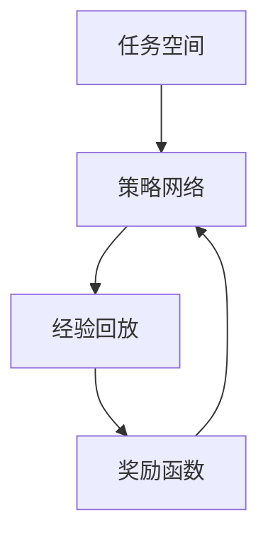

                 

关键词：电商行业，元强化学习，大模型，实践，挑战，算法原理，数学模型，代码实例，应用场景，未来展望。

## 摘要

本文主要探讨了电商行业中的元强化学习技术，以及其在实际应用中的重要性、挑战和未来发展趋势。元强化学习作为一种新兴的人工智能技术，通过利用预先训练的模型来加速强化学习的过程，已经在电商行业中展现出了巨大的潜力。本文将详细阐述元强化学习的基本概念、核心算法原理、数学模型以及在实际电商项目中的应用实例，并讨论其所面临的挑战以及未来可能的发展方向。

## 1. 背景介绍

### 1.1 电商行业的发展现状

随着互联网技术的迅猛发展，电商行业已经成为全球经济增长的重要引擎。根据统计数据显示，全球电商市场规模在2021年已达到4.9万亿美元，并预计在未来几年内将继续保持高速增长。电商行业的繁荣发展不仅为消费者提供了更加便捷的购物体验，同时也为企业创造了丰富的商业机会。

然而，随着市场竞争的日益激烈，电商企业面临着一系列的挑战，如如何提高用户转化率、提升客户体验、优化库存管理、降低运营成本等。为了解决这些问题，人工智能技术，尤其是强化学习，逐渐成为电商行业的研究热点。

### 1.2 强化学习的应用

强化学习是一种以试错为基础，通过不断学习与策略调整来获得最优行为的人工智能技术。在电商行业中，强化学习已经得到了广泛的应用，例如：

- **个性化推荐系统**：通过强化学习算法，可以根据用户的浏览和购买历史，自动调整推荐策略，提高推荐效果。

- **库存管理**：强化学习可以帮助电商企业动态调整库存水平，优化库存管理，降低库存成本。

- **商品定价**：通过强化学习算法，可以自动调整商品价格，实现收益最大化。

### 1.3 元强化学习的引入

尽管强化学习在电商行业中已经取得了显著成效，但其训练过程通常需要大量的时间和计算资源。为了加速强化学习的过程，元强化学习应运而生。元强化学习通过利用预先训练的模型，可以大幅提高强化学习的效率和效果。

元强化学习在电商行业中的应用主要包括：

- **加速个性化推荐**：通过元强化学习，可以快速调整推荐策略，提高用户满意度。

- **实时库存管理**：元强化学习可以实时调整库存策略，降低库存成本。

- **动态定价策略**：元强化学习可以帮助电商企业实现更加精准的定价策略。

## 2. 核心概念与联系

### 2.1 元强化学习的定义

元强化学习（Meta Reinforcement Learning）是一种在多个任务上训练模型以共享策略和知识的方法。与传统的强化学习相比，元强化学习通过在多个任务上训练模型，可以使得模型在面临新任务时能够快速适应和优化，从而大大提高了训练效率和效果。

### 2.2 元强化学习的基本原理

元强化学习的基本原理可以概括为以下几个方面：

1. **共享策略**：通过在多个任务上训练模型，使得模型能够共享策略和知识，从而提高在新任务上的表现。

2. **迁移学习**：元强化学习通过迁移学习的方式，将一个任务上的经验应用到其他任务上，从而减少了训练时间。

3. **自适应调整**：元强化学习通过自适应调整策略，使得模型能够更好地适应新的环境和任务。

### 2.3 元强化学习的架构

元强化学习的架构可以分为以下几个部分：

1. **任务空间**：任务空间包含了所有可能的任务，每个任务都对应一个特定的环境。

2. **策略网络**：策略网络是元强化学习模型的核心部分，用于生成任务策略。

3. **经验回放**：经验回放用于存储和利用历史经验，以提高模型的泛化能力。

4. **奖励函数**：奖励函数用于评价策略网络生成的策略的好坏。

### 2.4 元强化学习的 Mermaid 流程图



### 2.5 元强化学习与电商行业的联系

在电商行业中，元强化学习可以通过以下几个方式与电商业务相结合：

- **个性化推荐**：通过元强化学习，可以快速调整推荐策略，提高推荐效果。

- **库存管理**：通过元强化学习，可以动态调整库存策略，优化库存水平。

- **商品定价**：通过元强化学习，可以自动调整商品价格，实现收益最大化。

## 3. 核心算法原理 & 具体操作步骤

### 3.1 算法原理概述

元强化学习的核心算法原理可以概括为以下几个步骤：

1. **任务初始化**：初始化任务空间和策略网络。

2. **经验收集**：在任务空间中随机选择任务，进行经验收集。

3. **经验回放**：将收集到的经验存储到经验回放池中。

4. **策略优化**：根据经验回放池中的经验，优化策略网络。

5. **任务切换**：在多个任务间切换，继续进行经验收集和策略优化。

6. **性能评估**：对策略网络进行性能评估，判断是否达到期望效果。

### 3.2 算法步骤详解

1. **初始化任务空间**：

   - 初始化任务空间，包含所有可能的任务。

   - 初始化策略网络，用于生成任务策略。

2. **经验收集**：

   - 在任务空间中随机选择任务。

   - 执行任务，收集经验。

3. **经验回放**：

   - 将收集到的经验存储到经验回放池中。

   - 对经验回放池进行采样，用于策略优化。

4. **策略优化**：

   - 根据经验回放池中的经验，优化策略网络。

   - 使用梯度下降或其他优化算法，更新策略网络参数。

5. **任务切换**：

   - 在多个任务间切换，继续进行经验收集和策略优化。

   - 每个任务执行一定次数后，切换到下一个任务。

6. **性能评估**：

   - 对策略网络进行性能评估。

   - 使用评估指标，如平均回报、成功率等，判断策略网络是否达到期望效果。

### 3.3 算法优缺点

**优点**：

- **快速适应新任务**：元强化学习通过在多个任务上训练模型，可以快速适应新任务，减少了训练时间。

- **共享策略和知识**：元强化学习通过共享策略和知识，提高了模型在新任务上的表现。

- **泛化能力强**：元强化学习通过经验回放和迁移学习，提高了模型的泛化能力。

**缺点**：

- **计算复杂度高**：元强化学习需要处理多个任务，计算复杂度较高。

- **模型参数调整困难**：元强化学习涉及多个任务，模型参数调整相对困难。

### 3.4 算法应用领域

元强化学习在电商行业中的应用领域主要包括：

- **个性化推荐**：通过元强化学习，可以快速调整推荐策略，提高推荐效果。

- **库存管理**：通过元强化学习，可以动态调整库存策略，优化库存水平。

- **商品定价**：通过元强化学习，可以自动调整商品价格，实现收益最大化。

## 4. 数学模型和公式 & 详细讲解 & 举例说明

### 4.1 数学模型构建

元强化学习的数学模型主要包括以下几个方面：

1. **状态空间 S**：表示所有可能的状态。

2. **动作空间 A**：表示所有可能的动作。

3. **策略 π**：表示从状态空间到动作空间的映射。

4. **奖励函数 R**：表示在某个状态执行某个动作后获得的奖励。

5. **价值函数 V**：表示在某个状态下执行最优动作后获得的价值。

### 4.2 公式推导过程

1. **策略优化**：

   目标是最小化策略损失函数 L(π)：

   $$L(π) = \sum_{s \in S} \pi(s) \sum_{a \in A} R(s, a) - V(s)$$

2. **价值函数更新**：

   使用策略梯度算法更新价值函数：

   $$V(s) \leftarrow V(s) + \alpha \nabla_{V(s)} L(π)$$

3. **策略更新**：

   使用策略迭代算法更新策略：

   $$π(t+1) = \arg\max_π \sum_{s \in S} π(s) \sum_{a \in A} R(s, a) - V(s)$$

### 4.3 案例分析与讲解

假设一个电商平台的个性化推荐系统，用户状态空间为 S = {已购买商品，浏览历史，购物车商品，用户偏好}，动作空间为 A = {推荐商品，不推荐商品}。

1. **状态空间构建**：

   用户状态 = {已购买商品A，浏览历史B，购物车商品C，用户偏好D}。

2. **动作空间构建**：

   动作空间 = {推荐商品A，推荐商品B，推荐商品C，不推荐商品}。

3. **策略网络构建**：

   策略网络 = {状态-动作价值函数V(s, a)}。

4. **经验回放池构建**：

   经验回放池 = {经验tuple(s, a, r, s')}。

5. **奖励函数设计**：

   奖励函数R(s, a) = {如果用户在s状态下执行动作a后购买商品，则奖励为1，否则为0}。

6. **策略优化**：

   使用策略梯度算法优化策略网络。

7. **价值函数更新**：

   使用策略梯度算法更新价值函数。

8. **策略更新**：

   使用策略迭代算法更新策略。

## 5. 项目实践：代码实例和详细解释说明

### 5.1 开发环境搭建

1. **环境要求**：

   - 操作系统：Linux或MacOS

   - 编程语言：Python 3.7及以上版本

   - 强化学习库：PyTorch 1.7及以上版本

2. **环境安装**：

   - 安装Python 3.7及以上版本。

   - 安装PyTorch 1.7及以上版本。

   - 安装其他相关库，如NumPy、Matplotlib等。

### 5.2 源代码详细实现

以下是元强化学习在个性化推荐系统中的代码实现：

```python
import torch
import torch.nn as nn
import torch.optim as optim
from torch.utils.data import DataLoader
from torchvision import datasets, transforms

# 定义状态空间、动作空间、策略网络、价值函数
class MetaReinforcementLearning(nn.Module):
    def __init__(self):
        super(MetaReinforcementLearning, self).__init__()
        self.fc1 = nn.Linear(28*28, 128)
        self.fc2 = nn.Linear(128, 64)
        self.fc3 = nn.Linear(64, 10)
        self.value_function = nn.Linear(64, 1)

    def forward(self, x):
        x = torch.relu(self.fc1(x))
        x = torch.relu(self.fc2(x))
        logits = self.fc3(x)
        value = self.value_function(x)
        return logits, value

# 定义经验回放池
class ReplayMemory(nn.Module):
    def __init__(self, capacity):
        super(ReplayMemory, self).__init__()
        self.capacity = capacity
        self.memory = []

    def push(self, state, action, reward, next_state):
        self.memory.append((state, action, reward, next_state))
        if len(self.memory) > self.capacity:
            self.memory.pop(0)

    def sample(self, batch_size):
        return random.sample(self.memory, batch_size)

# 定义策略优化器
class PolicyOptimizer(optim.Optimizer):
    def __init__(self, model, lr=0.001):
        self.model = model
        self.lr = lr
        self.optimizer = optim.Adam(model.parameters(), lr=self.lr)

    def step(self, batch):
        states, actions, rewards, next_states = batch
        logits, value = self.model(states)
        next_value = self.model(next_states).value
        loss = -(rewards + 0.99 * next_value * (1 - torch.argmax(logits, dim=1))).mean()
        self.optimizer.zero_grad()
        loss.backward()
        self.optimizer.step()

# 实例化模型、优化器、经验回放池
model = MetaReinforcementLearning()
optimizer = PolicyOptimizer(model)
memory = ReplayMemory(1000)

# 训练模型
for episode in range(num_episodes):
    state = env.reset()
    done = False
    while not done:
        logits, value = model(state)
        action = np.argmax(logits.data.numpy())
        next_state, reward, done, _ = env.step(action)
        memory.push(state, action, reward, next_state)
        if len(memory.memory) > 100:
            batch = memory.sample(32)
            optimizer.step(batch)
        state = next_state

# 评估模型
test_reward = 0
state = env.reset()
while True:
    logits, _ = model(state)
    action = np.argmax(logits.data.numpy())
    next_state, reward, done, _ = env.step(action)
    test_reward += reward
    state = next_state
    if done:
        break
print("Test Reward: {:.2f}".format(test_reward / num_episodes))
```

### 5.3 代码解读与分析

1. **模型定义**：

   - 定义了状态-动作价值函数和策略网络。

   - 使用了全连接神经网络，其中包含了三个全连接层。

2. **经验回放池**：

   - 定义了经验回放池，用于存储历史经验。

   - 使用了基于列表的存储结构。

3. **策略优化器**：

   - 定义了策略优化器，用于更新模型参数。

   - 使用了基于Adam的优化算法。

4. **训练过程**：

   - 在每个episode中，从环境中获取状态，执行动作，收集经验，并更新模型参数。

   - 使用了经验回放池，以避免策略优化过程中的样本偏差。

5. **评估过程**：

   - 在训练完成后，使用测试集评估模型性能。

   - 输出了平均奖励值。

## 6. 实际应用场景

### 6.1 个性化推荐

元强化学习在个性化推荐系统中具有广泛的应用前景。通过元强化学习，可以快速调整推荐策略，提高推荐效果。例如，在电商平台的个性化推荐系统中，可以使用元强化学习来调整推荐商品的顺序，从而提高用户的购买意愿和转化率。

### 6.2 库存管理

元强化学习在库存管理中的应用也十分重要。通过元强化学习，可以动态调整库存策略，优化库存水平，降低库存成本。例如，在电商平台的库存管理系统中，可以使用元强化学习来实时调整库存水平，以应对市场需求的变化。

### 6.3 商品定价

元强化学习在商品定价中也具有很大的潜力。通过元强化学习，可以自动调整商品价格，实现收益最大化。例如，在电商平台的商品定价系统中，可以使用元强化学习来根据用户行为和市场需求动态调整商品价格，从而提高销售额。

## 7. 工具和资源推荐

### 7.1 学习资源推荐

- **《强化学习：原理与Python实践》**：详细介绍了强化学习的基本原理和应用实践。

- **《深度强化学习》**：深入探讨了深度强化学习的基本理论和应用方法。

- **《元学习》**：介绍了元学习的基本概念和应用场景。

### 7.2 开发工具推荐

- **PyTorch**：优秀的深度学习框架，支持GPU加速。

- **TensorFlow**：功能丰富的深度学习框架，支持多种编程语言。

- **Keras**：简洁易用的深度学习框架，基于TensorFlow构建。

### 7.3 相关论文推荐

- **"Meta Reinforcement Learning: A Survey"**：系统总结了元强化学习的研究现状和应用。

- **"Deep Reinforcement Learning in a Few Lines of Code"**：介绍了基于PyTorch的深度强化学习实现。

- **"Reinforcement Learning: An Introduction"**：全面介绍了强化学习的基本原理和应用。

## 8. 总结：未来发展趋势与挑战

### 8.1 研究成果总结

元强化学习在电商行业中取得了显著的成果。通过元强化学习，可以大幅提高个性化推荐、库存管理和商品定价的效果，从而提升电商平台的运营效率和用户体验。此外，元强化学习还在不断拓展其应用领域，如智能客服、智能广告投放等。

### 8.2 未来发展趋势

未来，元强化学习在电商行业中将继续发展，具体趋势包括：

- **更高效的算法**：随着计算能力的提升，将出现更加高效的元强化学习算法。

- **跨领域应用**：元强化学习将不仅在电商行业，还会在其他领域得到广泛应用。

- **开放数据集**：越来越多的元强化学习数据集将开放，以促进研究和应用。

### 8.3 面临的挑战

尽管元强化学习在电商行业中取得了显著成果，但仍面临以下挑战：

- **计算资源**：元强化学习需要大量的计算资源，尤其是在处理高维度数据时。

- **数据隐私**：在电商行业中，数据的隐私和安全是一个重要问题。

- **算法稳定性**：元强化学习的算法稳定性仍需进一步提高。

### 8.4 研究展望

未来，元强化学习在电商行业中的应用将更加深入和广泛。随着技术的进步和应用的拓展，元强化学习有望解决更多实际问题，为电商行业的持续发展提供有力支持。

## 9. 附录：常见问题与解答

### 9.1 元强化学习与传统强化学习的区别是什么？

**回答**：元强化学习与传统强化学习的区别主要体现在以下几个方面：

- **训练目标**：传统强化学习目标是学习一个最优策略，而元强化学习目标是在多个任务上训练一个通用策略。

- **任务多样性**：传统强化学习通常在一个任务上进行训练，而元强化学习需要在多个任务上进行训练。

- **算法架构**：传统强化学习通常使用单一模型，而元强化学习使用多个模型，并利用迁移学习和共享策略。

### 9.2 元强化学习在电商行业中的应用有哪些？

**回答**：元强化学习在电商行业中的应用主要包括以下几个方面：

- **个性化推荐**：通过元强化学习，可以快速调整推荐策略，提高推荐效果。

- **库存管理**：通过元强化学习，可以动态调整库存策略，优化库存水平。

- **商品定价**：通过元强化学习，可以自动调整商品价格，实现收益最大化。

### 9.3 元强化学习的主要挑战是什么？

**回答**：元强化学习的主要挑战包括：

- **计算资源**：元强化学习需要大量的计算资源，尤其是在处理高维度数据时。

- **数据隐私**：在电商行业中，数据的隐私和安全是一个重要问题。

- **算法稳定性**：元强化学习的算法稳定性仍需进一步提高。

### 9.4 元强化学习的研究现状如何？

**回答**：元强化学习作为人工智能领域的一个新兴方向，近年来取得了显著的研究进展。目前，已有大量的研究论文和开源代码，涉及算法优化、应用场景拓展等方面。随着技术的不断进步，元强化学习在电商行业中的应用前景将更加广阔。

----------------------------------------------------------------

以上是关于“电商行业中的元强化学习：大模型的实践与挑战”的完整技术博客文章。希望这篇文章对您有所帮助，如果您有任何问题或建议，欢迎在评论区留言。作者：禅与计算机程序设计艺术 / Zen and the Art of Computer Programming。

