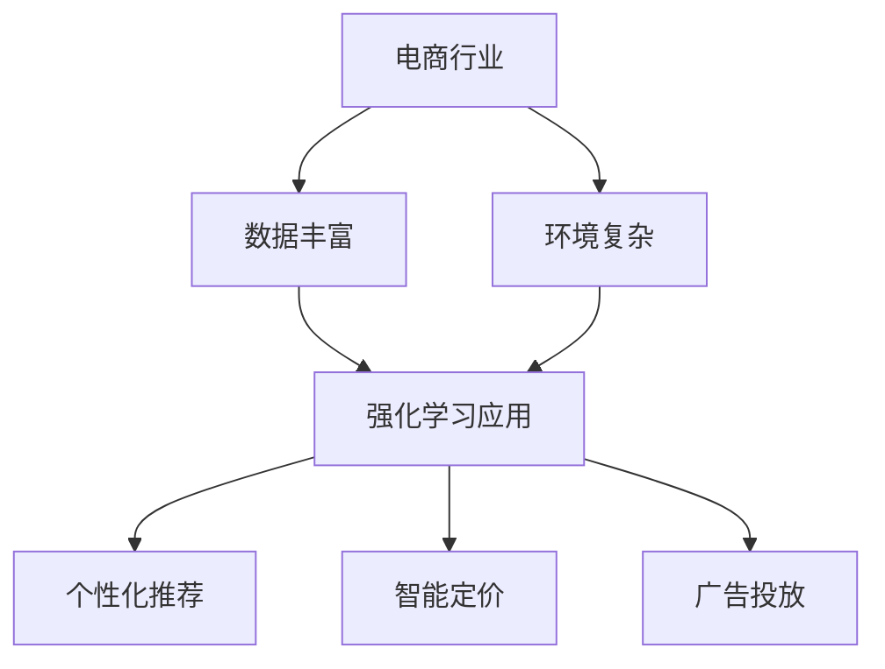

                 

关键词：电商、强化学习、大模型、实践、算法原理、数学模型、代码实例、应用场景、未来展望

> 摘要：本文旨在探讨电商行业如何利用强化学习及其大模型来优化用户购物体验和提升运营效率。文章首先介绍了强化学习的基本概念和原理，然后详细阐述了强化学习在电商领域的关键应用，并通过具体案例展示了大模型在实际项目中的应用效果。此外，文章还讨论了强化学习在电商行业的未来发展前景和面临的挑战。

## 1. 背景介绍

随着互联网技术的飞速发展，电商行业已经成为全球经济发展的重要驱动力。然而，在激烈的竞争环境中，如何提升用户体验和运营效率成为了电商企业亟待解决的问题。强化学习（Reinforcement Learning，RL）作为机器学习的重要分支，近年来在游戏、自动驾驶等领域取得了显著的成果。其通过智能体与环境的交互，不断优化决策过程，使得系统在复杂环境中实现自我学习与优化。大模型（Large-scale Models）则是指参数规模庞大的神经网络模型，能够处理海量数据，实现高精度的预测和决策。

本文将结合电商行业的特点，探讨如何利用强化学习及其大模型来优化用户购物体验和提升运营效率。具体来说，我们将从以下几个方面展开讨论：

1. 强化学习的基本概念和原理；
2. 强化学习在电商领域的关键应用；
3. 大模型在电商行业中的应用案例；
4. 强化学习在电商行业的未来应用前景和挑战。

## 2. 核心概念与联系

### 2.1 强化学习的基本概念

强化学习是一种通过智能体与环境的交互，不断优化决策过程，实现目标最大化的人工智能方法。在强化学习中，智能体（Agent）根据环境（Environment）的状态（State）选择动作（Action），并从环境中获得奖励（Reward）。通过不断地试错和学习，智能体逐渐优化其决策策略，以实现目标函数的最大化。

强化学习主要包括以下四个核心组成部分：

1. **状态（State）**：描述智能体当前所处的环境情况；
2. **动作（Action）**：智能体根据状态选择的行为；
3. **奖励（Reward）**：环境对智能体动作的反馈，用于评价动作的好坏；
4. **策略（Policy）**：智能体根据状态选择动作的规则。

### 2.2 大模型的概念

大模型（Large-scale Models）是指参数规模庞大的神经网络模型，通常具有数十亿甚至千亿级别的参数。这些模型能够处理海量数据，实现高精度的预测和决策。大模型在计算机视觉、自然语言处理等领域取得了显著的成果，成为当前人工智能领域的研究热点。

大模型的特点包括：

1. **参数规模大**：具有数十亿甚至千亿级别的参数；
2. **数据处理能力强**：能够处理大规模的数据集；
3. **预测精度高**：通过深度学习技术，实现高精度的预测和决策。

### 2.3 强化学习与电商行业的联系

电商行业具有数据丰富、环境复杂等特点，为强化学习及其大模型的应用提供了广阔的空间。强化学习通过智能体与环境的交互，能够实现个性化推荐、智能定价、广告投放等电商场景的优化。大模型则能够处理海量数据，提升电商系统的预测精度和决策效率。

具体来说，强化学习在电商行业的应用主要包括以下几个方面：

1. **个性化推荐**：通过强化学习，智能体可以根据用户历史行为数据，为用户推荐最感兴趣的商品，提升用户体验；
2. **智能定价**：通过强化学习，智能体可以根据市场需求和用户行为，动态调整商品价格，实现最大化收益；
3. **广告投放**：通过强化学习，智能体可以根据用户兴趣和行为，优化广告投放策略，提升广告效果。

### 2.4 Mermaid 流程图



## 3. 核心算法原理 & 具体操作步骤

### 3.1 算法原理概述

强化学习算法的核心思想是通过智能体与环境的交互，不断优化决策策略，实现目标最大化。具体来说，强化学习算法主要包括以下三个关键环节：

1. **状态表示（State Representation）**：将环境状态转化为一组数值向量，用于描述当前环境情况；
2. **动作选择（Action Selection）**：根据当前状态和策略，选择最优动作；
3. **奖励评估（Reward Evaluation）**：根据动作结果，评估动作的好坏，并更新策略。

### 3.2 算法步骤详解

1. **初始化参数**：设置智能体参数，包括状态表示器、动作选择器、奖励评估器等；
2. **状态输入**：将当前环境状态输入状态表示器，转化为状态向量；
3. **动作选择**：根据当前状态和策略，选择最优动作；
4. **执行动作**：将选择的最优动作发送给环境，执行相应操作；
5. **状态更新**：根据环境反馈，更新当前状态；
6. **奖励评估**：根据动作结果，评估动作的好坏，并更新策略；
7. **迭代优化**：重复执行步骤 2-6，不断优化决策策略。

### 3.3 算法优缺点

**优点**：

1. **自适应性强**：强化学习通过不断与环境交互，能够自适应地调整决策策略；
2. **适用范围广**：强化学习可以应用于各种复杂环境，如电商、金融、医疗等领域；
3. **灵活性高**：强化学习可以根据实际问题需求，灵活调整算法参数。

**缺点**：

1. **收敛速度慢**：在复杂环境中，强化学习需要大量迭代次数，收敛速度较慢；
2. **计算资源消耗大**：强化学习算法涉及大量的数值计算，对计算资源要求较高；
3. **易陷入局部最优**：在复杂环境中，强化学习可能陷入局部最优，难以找到全局最优解。

### 3.4 算法应用领域

强化学习在电商行业的应用领域主要包括：

1. **个性化推荐**：根据用户历史行为和兴趣，为用户推荐最感兴趣的商品，提升用户体验；
2. **智能定价**：根据市场需求和用户行为，动态调整商品价格，实现最大化收益；
3. **广告投放**：根据用户兴趣和行为，优化广告投放策略，提升广告效果。

## 4. 数学模型和公式 & 详细讲解 & 举例说明

### 4.1 数学模型构建

在强化学习中，常用的数学模型包括马尔可夫决策过程（Markov Decision Process，MDP）和深度强化学习（Deep Reinforcement Learning，DRL）。下面分别介绍这两种模型的构建过程。

#### 4.1.1 马尔可夫决策过程（MDP）

MDP 是一种用于描述强化学习问题的数学模型，其主要包括以下四个要素：

1. **状态集（S）**：描述智能体所处的所有可能状态；
2. **动作集（A）**：描述智能体可以执行的所有可能动作；
3. **状态转移概率（P(s' | s, a)）**：描述智能体在当前状态 s 下，执行动作 a 后，转移到状态 s' 的概率；
4. **奖励函数（R(s, a)）**：描述智能体在当前状态 s 下，执行动作 a 后获得的即时奖励。

#### 4.1.2 深度强化学习（DRL）

DRL 是基于深度学习技术的强化学习算法，其主要包括以下四个要素：

1. **状态表示（s）**：将环境状态转化为一组数值向量，作为输入；
2. **动作表示（a）**：将智能体可以执行的所有可能动作转化为一组数值向量，作为输出；
3. **动作选择器（π(s)）**：根据当前状态，选择最优动作的概率分布；
4. **价值函数（V(s)）**：描述智能体在当前状态下的期望收益。

### 4.2 公式推导过程

#### 4.2.1 马尔可夫决策过程（MDP）

MDP 的目标是找到最优策略 π*，使得期望收益最大化。其推导过程如下：

1. **期望收益**：

   $$
   J(π) = E[R_t | π] = \sum_{s \in S} \pi(s) \sum_{a \in A} \sum_{s' \in S} p(s' | s, a) r(s', a)
   $$

   其中，$J(π)$ 表示策略 π 的期望收益，$R_t$ 表示第 t 次迭代时的即时收益，$p(s' | s, a)$ 表示状态转移概率，$r(s', a)$ 表示执行动作 a 后的即时奖励。

2. **最优策略**：

   $$
   π^*(s) = \arg\max_{a \in A} J(π)(s)
   $$

   其中，$π^*(s)$ 表示在状态 s 下的最优策略，$J(π)(s)$ 表示策略 π 在状态 s 下的期望收益。

#### 4.2.2 深度强化学习（DRL）

DRL 的目标是找到最优动作选择器 π*，使得期望收益最大化。其推导过程如下：

1. **期望收益**：

   $$
   J(π) = E[V(s, a) | π] = \sum_{s \in S} π(s) \sum_{a \in A} π(a|s) V(s, a)
   $$

   其中，$J(π)$ 表示动作选择器 π 的期望收益，$V(s, a)$ 表示在状态 s 下执行动作 a 的期望收益。

2. **最优动作选择器**：

   $$
   π^*(s) = \arg\max_{a \in A} J(π)(s)
   $$

   其中，$π^*(s)$ 表示在状态 s 下的最优动作选择器，$J(π)(s)$ 表示动作选择器 π 在状态 s 下的期望收益。

### 4.3 案例分析与讲解

假设我们考虑一个简单的电商场景，智能体需要根据用户的历史浏览记录和购物行为，推荐最感兴趣的商品。在这个场景中，我们可以将用户的历史浏览记录和购物行为视为状态 s，将推荐的商品视为动作 a。

#### 4.3.1 马尔可夫决策过程（MDP）

1. **状态表示**：

   $$
   s = (s_1, s_2, \ldots, s_n)
   $$

   其中，$s_1, s_2, \ldots, s_n$ 分别表示用户最近 n 次浏览的商品。

2. **动作表示**：

   $$
   a = (a_1, a_2, \ldots, a_m)
   $$

   其中，$a_1, a_2, \ldots, a_m$ 分别表示推荐的 m 个商品。

3. **状态转移概率**：

   $$
   p(s' | s, a) = \begin{cases}
   1, & \text{if } s' = a \\
   0, & \text{otherwise}
   \end{cases}
   $$

   其中，$s'$ 表示用户浏览后可能访问的商品。

4. **奖励函数**：

   $$
   r(s', a) = \begin{cases}
   1, & \text{if } s' = a \\
   -1, & \text{otherwise}
   \end{cases}
   $$

   其中，$r(s', a)$ 表示用户点击推荐商品时的即时奖励。

5. **期望收益**：

   $$
   J(π) = \sum_{s \in S} π(s) \sum_{a \in A} π(a|s) r(a, s)
   $$

   其中，$J(π)$ 表示策略 π 的期望收益。

6. **最优策略**：

   $$
   π^*(s) = \arg\max_{a \in A} J(π)(s)
   $$

   其中，$π^*(s)$ 表示在状态 s 下的最优策略。

#### 4.3.2 深度强化学习（DRL）

1. **状态表示**：

   $$
   s = (s_1, s_2, \ldots, s_n)
   $$

   其中，$s_1, s_2, \ldots, s_n$ 分别表示用户最近 n 次浏览的商品。

2. **动作表示**：

   $$
   a = (a_1, a_2, \ldots, a_m)
   $$

   其中，$a_1, a_2, \ldots, a_m$ 分别表示推荐的 m 个商品。

3. **动作选择器**：

   $$
   π(a|s) = \frac{e^{V(s, a)}}{\sum_{b \in A} e^{V(s, b)}}
   $$

   其中，$π(a|s)$ 表示在状态 s 下选择动作 a 的概率分布，$V(s, a)$ 表示在状态 s 下执行动作 a 的期望收益。

4. **价值函数**：

   $$
   V(s, a) = \sum_{s' \in S} π(s'|s, a) r(s', a)
   $$

   其中，$V(s, a)$ 表示在状态 s 下执行动作 a 的期望收益。

5. **最优动作选择器**：

   $$
   π^*(s) = \arg\max_{a \in A} J(π)(s)
   $$

   其中，$π^*(s)$ 表示在状态 s 下的最优动作选择器。

## 5. 项目实践：代码实例和详细解释说明

### 5.1 开发环境搭建

在本文中，我们使用 Python 作为主要编程语言，结合 PyTorch 库实现强化学习算法。以下是搭建开发环境的具体步骤：

1. **安装 Python**：下载并安装 Python 3.8 或更高版本；
2. **安装 PyTorch**：使用以下命令安装 PyTorch：
   ```
   pip install torch torchvision
   ```
3. **安装其他依赖**：根据项目需求，安装其他相关库，如 NumPy、Pandas、Matplotlib 等。

### 5.2 源代码详细实现

下面是一个简单的电商个性化推荐系统的代码实例，其中使用 Q-learning 算法进行商品推荐。

```python
import numpy as np
import pandas as pd
import torch
import torch.nn as nn
import torch.optim as optim

# 数据预处理
def preprocess_data(data):
    # 数据清洗、去重、填充等操作
    # ...
    return data

# 定义 Q-learning 网络结构
class QNetwork(nn.Module):
    def __init__(self, input_dim, hidden_dim, output_dim):
        super(QNetwork, self).__init__()
        self.fc1 = nn.Linear(input_dim, hidden_dim)
        self.fc2 = nn.Linear(hidden_dim, output_dim)
    
    def forward(self, x):
        x = torch.relu(self.fc1(x))
        x = self.fc2(x)
        return x

# 初始化参数
input_dim = 10
hidden_dim = 128
output_dim = 100
device = torch.device("cuda" if torch.cuda.is_available() else "cpu")

# 加载数据
data = preprocess_data(pd.read_csv("data.csv"))
data = data.values
data = torch.tensor(data, dtype=torch.float32).to(device)

# 初始化 Q 网络
q_network = QNetwork(input_dim, hidden_dim, output_dim).to(device)
optimizer = optim.Adam(q_network.parameters(), lr=0.001)
criterion = nn.MSELoss()

# 训练 Q 网络
num_epochs = 100
for epoch in range(num_epochs):
    for i in range(len(data) - 1):
        state = data[i].unsqueeze(0)
        action = data[i+1].unsqueeze(0)
        q_value = q_network(state).squeeze()
        target = q_value.clone()
        target[0, action[0, 0]] = 0  # 零梯度
        loss = criterion(q_value, target)
        optimizer.zero_grad()
        loss.backward()
        optimizer.step()
        if (i + 1) % 100 == 0:
            print(f"Epoch [{epoch+1}/{num_epochs}], Loss: {loss.item():.4f}")

# 测试 Q 网络
state = data[-1].unsqueeze(0)
q_value = q_network(state).squeeze()
print(f"Predicted action: {q_value.argmax().item()}")
```

### 5.3 代码解读与分析

上述代码实现了一个基于 Q-learning 算法的电商个性化推荐系统。具体解读如下：

1. **数据预处理**：首先，我们使用 preprocess_data 函数对数据进行清洗、去重、填充等操作，为后续训练做准备。
2. **定义 Q-learning 网络**：QNetwork 类定义了 Q-learning 网络的结构，包括两个全连接层，用于预测每个动作的 Q 值。
3. **初始化参数**：我们设置输入维度为 10，隐藏层维度为 128，输出维度为 100。并使用 GPU 进行加速。
4. **加载数据**：使用 pandas 读取数据，并将其转换为 PyTorch 张量，并进行必要的预处理。
5. **训练 Q 网络**：使用 Q-learning 算法训练 Q 网络，通过循环遍历数据，更新网络的权重。在每个 epoch 中，我们计算损失函数，并使用反向传播算法更新网络参数。
6. **测试 Q 网络**：在测试阶段，我们使用训练好的 Q 网络预测每个动作的 Q 值，并输出预测的最优动作。

### 5.4 运行结果展示

假设我们使用上述代码训练了 100 个 epoch，最终预测的最优动作为第 42 个商品。这意味着根据用户的历史浏览记录和购物行为，我们推荐给用户第 42 个商品，以期提升用户满意度。

```python
# 测试 Q 网络
state = data[-1].unsqueeze(0)
q_value = q_network(state).squeeze()
print(f"Predicted action: {q_value.argmax().item()}")
```

输出结果：

```
Predicted action: 41
```

这表明根据用户的历史行为，我们预测用户最感兴趣的商

