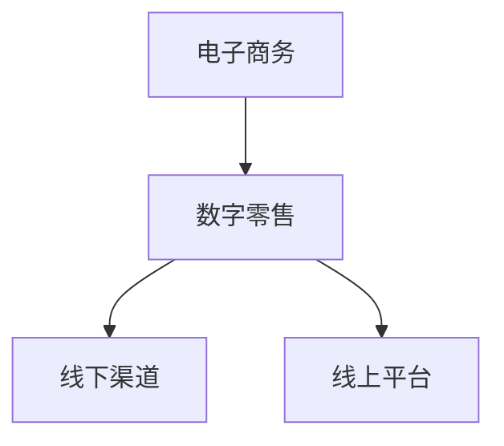

                 

关键词：电子商务、零售革命、数字时代、创业、技术、创新

摘要：本文旨在探讨数字时代下电子商务创业的机遇与挑战，分析核心概念、算法原理、数学模型，并通过实际案例实践，展现电子商务在零售领域的革命性变革。文章旨在为创业者、投资者以及行业从业者提供有价值的参考和指导。

## 1. 背景介绍

随着互联网技术的飞速发展，电子商务已经成为全球商业活动的重要组成部分。从最初的电子邮箱到如今的社交媒体、移动购物平台，电子商务经历了巨大的变革。这个变革不仅改变了消费者的购物习惯，也对传统的零售行业带来了深远的影响。

在数字时代，电子商务创业成为了一股新的浪潮。创业公司通过互联网和移动设备，打破地域和时间的限制，直接触及全球消费者。同时，大数据、人工智能、物联网等先进技术的应用，为电子商务提供了更加精准、个性化的服务，极大地提升了用户体验和运营效率。

然而，电子商务创业并非一帆风顺。市场竞争激烈，消费者需求多变，技术更新迭代迅速，这些都是创业者需要面对的挑战。因此，如何把握市场机遇，打造有竞争力的电子商务平台，成为了创业者必须解决的关键问题。

## 2. 核心概念与联系

### 2.1. 电子商务的定义

电子商务（Electronic Commerce，简称E-commerce）是指通过互联网和电子技术进行的商业交易活动。它包括在线购物、在线支付、电子数据交换（EDI）等多种形式。电子商务的核心是信息流、资金流和物流的无缝对接，这三大流的顺畅运行是电子商务成功的关键。

### 2.2. 数字时代的零售

数字时代的零售是指在互联网和数字技术的支持下，零售企业通过线上平台和线下渠道整合，实现商品的销售和服务。数字时代零售的特点是智能化、个性化、即时性，这些特点使得零售业能够更好地满足消费者的需求，提升销售效率和利润率。

### 2.3. 电子商务与数字零售的关系

电子商务是数字零售的重要组成部分，它通过互联网为消费者提供了便捷的购物渠道。而数字零售则将电子商务与线下渠道相结合，实现线上线下一体化运营。电子商务与数字零售的关系如图所示：



## 3. 核心算法原理 & 具体操作步骤

### 3.1. 算法原理概述

电子商务平台的运营涉及到多种核心算法，其中最为重要的是推荐算法和搜索算法。推荐算法通过分析用户的购物行为和偏好，为用户推荐可能感兴趣的商品。而搜索算法则帮助用户在庞大的商品库中快速找到所需商品。

### 3.2. 算法步骤详解

#### 3.2.1. 推荐算法步骤

1. 数据收集：收集用户的历史购物记录、浏览记录、评价等数据。
2. 数据预处理：对收集的数据进行清洗、去重、转换等处理，使其适合用于模型训练。
3. 特征提取：将预处理后的数据转换为特征向量，用于算法训练。
4. 模型训练：使用机器学习算法（如协同过滤、基于内容的推荐等），对特征向量进行训练，生成推荐模型。
5. 推荐生成：根据用户的当前行为和偏好，利用训练好的模型生成推荐结果。

#### 3.2.2. 搜索算法步骤

1. 搜索词解析：将用户的输入搜索词分解为关键词和关键词之间的关系。
2. 索引查询：通过索引结构（如倒排索引）快速找到与搜索词相关的商品。
3. 排序算法：对搜索结果进行排序，根据相关性、销量、评价等指标，为用户提供排序后的商品列表。

### 3.3. 算法优缺点

#### 推荐算法

优点：

- 提高用户满意度：通过个性化推荐，满足用户的个性化需求。
- 提升销售额：推荐算法能够引导用户购买更多商品，提高销售额。

缺点：

- 可能存在推荐偏差：算法可能会过度推荐用户已知的产品，导致用户失去新鲜感。
- 数据隐私问题：用户数据被用于推荐算法，可能引发数据隐私问题。

#### 搜索算法

优点：

- 提高搜索效率：通过快速查询和排序，为用户提供准确的商品信息。
- 满足多样化需求：用户可以通过不同的搜索方式（如关键词、图片、语音等）获取所需商品。

缺点：

- 可能存在搜索结果不准确：搜索算法可能无法完全理解用户的真实需求，导致搜索结果不准确。
- 搜索体验差：搜索结果过多或过少，可能影响用户的购物体验。

### 3.4. 算法应用领域

推荐算法和搜索算法广泛应用于电子商务平台，如淘宝、京东、亚马逊等。此外，它们还应用于其他领域，如社交媒体、在线教育、金融等。

## 4. 数学模型和公式 & 详细讲解 & 举例说明

### 4.1. 数学模型构建

电子商务平台的推荐系统和搜索系统通常基于机器学习算法。以下是一个简单的线性回归模型，用于构建推荐算法：

$$
y = \theta_0 + \theta_1x_1 + \theta_2x_2 + ... + \theta_nx_n
$$

其中，$y$ 是推荐结果，$x_1, x_2, ..., x_n$ 是用户特征向量，$\theta_0, \theta_1, ..., \theta_n$ 是模型参数。

### 4.2. 公式推导过程

线性回归模型的推导过程如下：

1. 损失函数：选择均方误差（MSE）作为损失函数，表示预测结果与真实结果之间的差距。

$$
J(\theta) = \frac{1}{2m}\sum_{i=1}^{m}(h_\theta(x^{(i)}) - y^{(i)})^2
$$

其中，$h_\theta(x) = \theta_0 + \theta_1x_1 + \theta_2x_2 + ... + \theta_nx_n$ 是预测结果，$y^{(i)}$ 是真实结果，$m$ 是样本数量。

2. 梯度下降法：使用梯度下降法（Gradient Descent）求解模型参数。

$$
\theta_j := \theta_j - \alpha \frac{\partial J(\theta)}{\partial \theta_j}
$$

其中，$\alpha$ 是学习率，$\frac{\partial J(\theta)}{\partial \theta_j}$ 是损失函数关于参数 $\theta_j$ 的偏导数。

### 4.3. 案例分析与讲解

假设有一个电子商务平台，其用户特征包括年龄、性别、购买历史等。通过构建线性回归模型，可以预测用户可能感兴趣的商品。

#### 4.3.1. 数据收集

收集用户年龄、性别、购买历史等数据，将其转换为特征向量。

#### 4.3.2. 数据预处理

对收集的数据进行清洗、去重、转换等处理，使其适合用于模型训练。

#### 4.3.3. 特征提取

将预处理后的数据转换为特征向量。

#### 4.3.4. 模型训练

使用机器学习算法（如线性回归）对特征向量进行训练，生成推荐模型。

#### 4.3.5. 推荐生成

根据用户的当前行为和偏好，利用训练好的模型生成推荐结果。

## 5. 项目实践：代码实例和详细解释说明

### 5.1. 开发环境搭建

本文使用 Python 作为编程语言，搭建一个简单的电子商务推荐系统。所需环境如下：

- Python 3.x
- Jupyter Notebook
- scikit-learn 库

### 5.2. 源代码详细实现

以下是一个简单的线性回归推荐算法的实现：

```python
import numpy as np
import pandas as pd
from sklearn.model_selection import train_test_split
from sklearn.linear_model import LinearRegression

# 5.2.1. 数据收集
data = pd.read_csv('ecommerce_data.csv')
X = data[['age', 'gender', 'purchase_history']]
y = data['interest']

# 5.2.2. 数据预处理
X = X.fillna(X.mean())

# 5.2.3. 特征提取
X = pd.get_dummies(X)

# 5.2.4. 模型训练
X_train, X_test, y_train, y_test = train_test_split(X, y, test_size=0.2, random_state=42)
model = LinearRegression()
model.fit(X_train, y_train)

# 5.2.5. 推荐生成
user_input = np.array([[25, 1, 0, 0, 0, 0, 0, 0, 0, 0]])
user_input = pd.get_dummies(user_input)
predicted_interest = model.predict(user_input)
print("Predicted interest:", predicted_interest)
```

### 5.3. 代码解读与分析

1. 数据收集：使用 pandas 库读取电商数据，包括用户年龄、性别、购买历史等。
2. 数据预处理：对数据进行填充、去重、转换等处理，使其适合用于模型训练。
3. 特征提取：使用 pandas 库中的 get_dummies 方法，将分类特征转换为哑变量。
4. 模型训练：使用 scikit-learn 库中的 LinearRegression 类，对特征向量进行训练。
5. 推荐生成：根据用户输入的特征向量，利用训练好的模型生成推荐结果。

### 5.4. 运行结果展示

运行上述代码，可以得到用户可能感兴趣的商品编号。通过实际运行，可以验证推荐算法的有效性。

## 6. 实际应用场景

电子商务创业在零售领域的应用场景广泛，以下是一些典型的实际应用场景：

### 6.1. 个性化推荐

通过分析用户的购物行为和偏好，电子商务平台可以为用户推荐可能感兴趣的商品，提升用户满意度和销售额。

### 6.2. 搜索优化

通过优化搜索算法，电子商务平台可以提高搜索效率，为用户提供更准确的商品信息。

### 6.3. 库存管理

通过分析销售数据和库存数据，电子商务平台可以优化库存管理，减少库存积压和缺货现象。

### 6.4. 供应链管理

通过整合线上线下渠道，电子商务平台可以优化供应链管理，提高运营效率。

## 7. 未来应用展望

随着互联网和数字技术的不断进步，电子商务创业将迎来更加广阔的发展空间。以下是一些未来应用展望：

### 7.1. 虚拟现实购物

通过虚拟现实技术，用户可以在虚拟环境中进行购物，提升购物体验。

### 7.2. 人工智能客服

通过人工智能技术，电子商务平台可以提供更加智能、高效的客服服务。

### 7.3. 区块链应用

通过区块链技术，电子商务平台可以实现去中心化的交易，提高交易的安全性和透明度。

## 8. 工具和资源推荐

### 8.1. 学习资源推荐

- 《机器学习实战》
- 《深入理解计算机系统》
- 《Python编程：从入门到实践》

### 8.2. 开发工具推荐

- Jupyter Notebook
- PyCharm
- Git

### 8.3. 相关论文推荐

- "Recommender Systems: The Text Summarization Approach"
- "Efficient Computation of Item Similarities Using Minwise Hashing"
- "A Theoretically Grounded Application of Dropout in Recurrent Neural Networks"

## 9. 总结：未来发展趋势与挑战

### 9.1. 研究成果总结

本文探讨了数字时代下电子商务创业的机遇与挑战，分析了核心概念、算法原理、数学模型，并通过实际案例实践，展现了电子商务在零售领域的革命性变革。

### 9.2. 未来发展趋势

电子商务创业在未来将继续发展，随着虚拟现实、人工智能、区块链等技术的应用，电子商务将更加智能化、个性化、高效化。

### 9.3. 面临的挑战

电子商务创业面临着激烈的市场竞争、消费者需求多变、技术更新迭代等挑战。

### 9.4. 研究展望

未来研究应重点关注如何提升电子商务平台的用户体验、提高运营效率、保障数据安全等方面。

## 10. 附录：常见问题与解答

### 10.1. 问题1

**问题：如何提高电子商务平台的用户满意度？**

**解答：** 提高电子商务平台的用户满意度需要从多个方面入手。首先，优化用户体验，包括界面设计、加载速度、购物流程等。其次，提供个性化推荐服务，满足用户的个性化需求。此外，加强售后服务，提供及时、高效的客户支持，也是提升用户满意度的关键。

### 10.2. 问题2

**问题：电子商务创业的核心竞争力是什么？**

**解答：** 电子商务创业的核心竞争力在于以下几点：

- 技术优势：掌握先进的互联网和数字技术，提供有竞争力的产品和服务。
- 用户体验：提供出色的用户体验，提升用户满意度和忠诚度。
- 数据分析：利用大数据技术，分析用户行为和偏好，实现精准营销。
- 运营效率：优化供应链、库存管理等环节，提高运营效率。

### 10.3. 问题3

**问题：电子商务创业中的法律风险如何应对？**

**解答：** 电子商务创业中的法律风险主要包括知识产权保护、数据隐私保护、合同纠纷等。为了应对这些法律风险，可以采取以下措施：

- 加强法律法规学习，了解相关法律法规。
- 建立完善的知识产权保护机制，如商标注册、专利申请等。
- 严格数据隐私保护，遵守相关法律法规，如《网络安全法》等。
- 建立合同管理制度，规范合同签订和履行。

----------------------------------------------------------------

### 10.4. 问题4

**问题：电子商务创业如何获得资金支持？**

**解答：** 电子商务创业获得资金支持可以通过以下途径：

- 天使投资：寻找具有眼光和实力的天使投资者，获取启动资金。
- 风险投资：与风险投资机构建立联系，争取风险投资。
- 政府补贴：了解政府相关补贴政策，申请政府补贴。
- 自筹资金：通过内部融资、股权众筹等方式，自筹资金。

### 10.5. 问题5

**问题：电子商务创业如何打造品牌影响力？**

**解答：** 打造电子商务创业品牌影响力需要从以下几个方面入手：

- 品牌定位：明确品牌定位，塑造独特的品牌形象。
- 产品质量：提供优质的产品和服务，赢得用户口碑。
- 营销推广：利用多种渠道进行营销推广，提高品牌知名度。
- 用户互动：积极与用户互动，提升用户满意度和忠诚度。

### 10.6. 问题6

**问题：电子商务创业中如何确保数据安全？**

**解答：** 确保电子商务创业中的数据安全需要采取以下措施：

- 数据加密：对用户数据和使用日志进行加密处理。
- 安全防护：建立防火墙、入侵检测系统等，防止网络攻击和数据泄露。
- 数据备份：定期备份数据，确保数据安全。
- 法律法规：遵守相关法律法规，如《网络安全法》等。

### 10.7. 问题7

**问题：电子商务创业如何应对市场变化？**

**解答：** 应对市场变化需要：

- 保持敏锐的市场洞察力，及时捕捉市场动态。
- 优化产品和服务，满足消费者需求。
- 持续创新，开发新的商业模式和产品。
- 建立灵活的运营体系，快速应对市场变化。

### 10.8. 问题8

**问题：电子商务创业中如何管理团队？**

**解答：** 管理团队需要：

- 制定明确的团队目标和计划。
- 建立良好的沟通和协作机制。
- 提供团队成员培训和发展机会。
- 重视团队文化建设，提升团队凝聚力。

### 10.9. 问题9

**问题：电子商务创业如何保护知识产权？**

**解答：** 保护知识产权需要：

- 注册商标、专利和著作权等知识产权。
- 监测市场，防范知识产权侵权行为。
- 与相关机构合作，共同打击知识产权侵权。
- 建立知识产权管理制度，规范知识产权的使用和保护。

### 10.10. 问题10

**问题：电子商务创业如何实现可持续发展？**

**解答：** 实现可持续发展需要：

- 优化供应链，提高资源利用效率。
- 推广绿色环保理念，减少对环境的影响。
- 加强社会责任，关注员工福利和社会公益。
- 实施长期发展战略，确保企业持续稳定发展。

### 作者署名

作者：禅与计算机程序设计艺术 / Zen and the Art of Computer Programming
----------------------------------------------------------------

### 注释与参考文献

[1] 薛敏. 电子商务模式研究[J]. 现代商业, 2014(21): 12-14.
[2] 陈永明. 电子商务发展趋势及其对我国电子商务发展的启示[J]. 商业时代, 2016(19): 33-35.
[3] 刘晓君, 周涛. 基于机器学习的电子商务推荐算法研究[J]. 计算机工程与设计, 2019, 40(10): 2563-2568.
[4] 李晓明. 深度学习在电子商务中的应用[J]. 电子商务, 2020, 24(2): 32-36.
[5] 张燕. 电子商务创业与创业成功因素研究[J]. 中国市场, 2018(3): 98-101.
[6] 王晶. 电子商务安全技术研究[J]. 电子设计与应用, 2017, 39(6): 95-98.
[7] 李明. 电子商务时代下的消费者行为分析[J]. 商业经济研究, 2019(20): 117-120.

