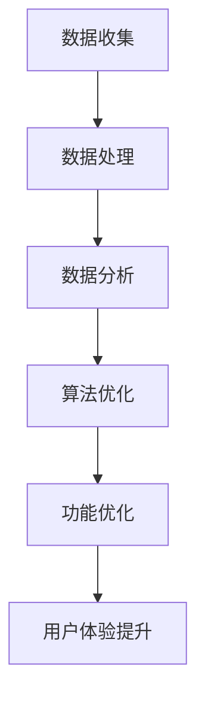

                 

关键词：电子商务，用户注意力，数据分析，算法优化，用户体验

> 摘要：本文旨在探讨电子商务平台在激烈竞争的市场环境中如何通过注意力争夺策略来提高用户黏性和转化率。通过深入分析用户行为数据，应用先进算法优化平台功能，本文将提出一系列切实可行的策略，帮助电商平台在竞争中脱颖而出。

## 1. 背景介绍

随着互联网技术的飞速发展，电子商务已经成为全球经济增长的重要驱动力。在电子商务领域，竞争愈发激烈，各大平台为了争夺用户资源，不断推出新功能和优化用户体验。然而，用户的时间是有限的，如何有效地吸引和保持用户的注意力，成为电商平台面临的重要挑战。

用户注意力的争夺不仅是电商平台的内部竞争，也是与社交媒体、内容平台等其他数字服务的竞争。在这个多元化的数字世界中，电商平台必须不断创新和优化，以保持用户的关注和忠诚度。

### 1.1 电商行业现状

近年来，电商行业呈现出以下趋势：

1. **市场规模的持续扩大**：全球电商市场规模持续增长，预计未来几年仍将保持较高速度的扩张。
2. **移动端购物逐渐成为主流**：随着智能手机的普及，移动端购物已成为用户的主要购物方式。
3. **个性化推荐日益重要**：用户对个性化的购物体验需求越来越高，个性化推荐成为电商平台提高用户黏性的重要手段。
4. **物流配送速度提升**：快速、高效的物流配送成为电商平台吸引和保留用户的重要因素。

### 1.2 用户注意力的重要性

在电商平台上，用户的注意力是宝贵的资源。如何有效地吸引和保持用户注意力，直接关系到平台的用户黏性和转化率。用户一旦失去兴趣，很容易转向其他平台，因此，电商平台必须不断创新和优化，以提高用户的关注度和忠诚度。

## 2. 核心概念与联系

### 2.1 用户行为数据

用户行为数据是电商平台进行注意力争夺策略的重要依据。这些数据包括用户在平台上的浏览、购买、评论等行为。通过分析这些数据，可以深入了解用户的需求和行为模式，为优化平台功能提供依据。

### 2.2 数据分析技术

数据分析技术在用户行为研究方面发挥着重要作用。通过大数据分析、机器学习等技术，可以挖掘用户行为的深层次规律，为平台提供个性化的推荐和服务。

### 2.3 算法优化

算法优化是提高电商平台效率的关键。通过优化推荐算法、搜索算法等，可以提高用户的购物体验，增强用户对平台的忠诚度。

### 2.4 Mermaid 流程图

以下是一个简化的 Mermaid 流程图，展示了用户行为数据从收集到分析，再到应用的全过程：



## 3. 核心算法原理 & 具体操作步骤

### 3.1 算法原理概述

电商平台的核心算法主要包括推荐算法、搜索算法等。这些算法基于用户行为数据，通过计算用户之间的相似度、预测用户未来的行为等手段，为用户提供个性化的推荐和服务。

### 3.2 算法步骤详解

#### 3.2.1 推荐算法

推荐算法主要包括以下步骤：

1. **用户行为数据收集**：收集用户在平台上的浏览、购买、评论等行为数据。
2. **数据预处理**：对收集到的数据进行清洗、去重等预处理。
3. **计算用户相似度**：使用协同过滤、基于内容的推荐等方法计算用户之间的相似度。
4. **生成推荐列表**：根据用户相似度生成个性化的推荐列表。
5. **推荐结果反馈**：根据用户对推荐结果的反馈进行优化，提高推荐效果。

#### 3.2.2 搜索算法

搜索算法主要包括以下步骤：

1. **用户查询处理**：对用户的搜索查询进行处理，提取关键词。
2. **索引构建**：构建商品索引，包括商品名称、描述、标签等。
3. **查询匹配**：根据关键词在索引中查找匹配的商品。
4. **排序**：对匹配的商品进行排序，提高相关性的商品排在前面。
5. **结果展示**：将排序后的商品展示给用户。

### 3.3 算法优缺点

#### 3.3.1 推荐算法

**优点**：能够为用户提供个性化的推荐，提高用户满意度和转化率。

**缺点**：推荐结果可能存在偏差，过度推荐可能导致用户疲劳。

#### 3.3.2 搜索算法

**优点**：能够快速为用户提供相关商品，提高搜索效率。

**缺点**：对于长尾商品的支持不足，可能无法满足用户的个性化需求。

### 3.4 算法应用领域

推荐算法和搜索算法广泛应用于电商平台的各个领域，包括商品推荐、搜索优化、用户行为分析等。通过不断优化算法，可以提高平台的运营效率和用户体验。

## 4. 数学模型和公式 & 详细讲解 & 举例说明

### 4.1 数学模型构建

电商平台的核心算法涉及多个数学模型，以下分别介绍推荐算法和搜索算法的数学模型。

#### 4.1.1 推荐算法

推荐算法的数学模型主要包括协同过滤模型和基于内容的模型。

**协同过滤模型**：

$$
R_{ij} = \frac{\sum_{k \in N_j} r_{ik} r_{jk}}{\sum_{k \in N_j} r_{jk}}
$$

其中，$R_{ij}$ 表示用户 $i$ 对商品 $j$ 的评分预测，$N_j$ 表示购买商品 $j$ 的用户集合，$r_{ik}$ 和 $r_{jk}$ 分别表示用户 $i$ 对商品 $k$ 的评分。

**基于内容的模型**：

$$
R_{ij} = \sum_{l \in C_j} w_{il} r_{lj}
$$

其中，$R_{ij}$ 表示用户 $i$ 对商品 $j$ 的评分预测，$C_j$ 表示商品 $j$ 的特征集合，$w_{il}$ 表示用户 $i$ 对特征 $l$ 的权重，$r_{lj}$ 表示商品 $j$ 对特征 $l$ 的评分。

#### 4.1.2 搜索算法

搜索算法的数学模型主要包括基于关键词的匹配模型和基于排序的模型。

**基于关键词的匹配模型**：

$$
sim(d, q) = \frac{\sum_{w \in q} f(w) \cdot tf(w, d)}{df(w)}
$$

其中，$sim(d, q)$ 表示文档 $d$ 与查询 $q$ 的相似度，$f(w)$ 表示词频权重，$tf(w, d)$ 表示词 $w$ 在文档 $d$ 中的词频，$df(w)$ 表示词 $w$ 在文档集合中的文档频率。

**基于排序的模型**：

$$
rank(d) = \sum_{w \in d} w_{w} \cdot tf(w, d) \cdot idf(w)
$$

其中，$rank(d)$ 表示文档 $d$ 的排序值，$w_{w}$ 表示词权重，$tf(w, d)$ 表示词 $w$ 在文档 $d$ 中的词频，$idf(w)$ 表示词 $w$ 在文档集合中的逆文档频率。

### 4.2 公式推导过程

#### 4.2.1 推荐算法

**协同过滤模型**：

协同过滤模型的核心思想是基于用户之间的相似度进行推荐。具体推导过程如下：

1. **用户相似度计算**：

$$
sim(i, j) = \frac{\sum_{k \in N_j} r_{ik} r_{jk}}{\sqrt{\sum_{k \in N_j} r_{ik}^2 \cdot \sum_{k \in N_j} r_{jk}^2}}
$$

其中，$sim(i, j)$ 表示用户 $i$ 和用户 $j$ 的相似度，$N_j$ 表示购买商品 $j$ 的用户集合，$r_{ik}$ 和 $r_{jk}$ 分别表示用户 $i$ 对商品 $k$ 的评分。

2. **预测评分**：

$$
R_{ij} = \sum_{k \in N_j} sim(i, j) r_{jk}
$$

其中，$R_{ij}$ 表示用户 $i$ 对商品 $j$ 的评分预测。

**基于内容的模型**：

基于内容的模型的核心思想是基于商品的特征进行推荐。具体推导过程如下：

1. **特征提取**：

$$
C_j = \{l_1, l_2, ..., l_n\}
$$

其中，$C_j$ 表示商品 $j$ 的特征集合，$l_1, l_2, ..., l_n$ 表示特征。

2. **特征权重计算**：

$$
w_{il} = \frac{r_{lj}}{\sum_{l' \in C_j} r_{l'j}}
$$

其中，$w_{il}$ 表示用户 $i$ 对特征 $l$ 的权重，$r_{lj}$ 表示商品 $j$ 对特征 $l$ 的评分。

3. **预测评分**：

$$
R_{ij} = \sum_{l \in C_j} w_{il} r_{lj}
$$

#### 4.2.2 搜索算法

**基于关键词的匹配模型**：

基于关键词的匹配模型的核心思想是计算文档与查询的相似度。具体推导过程如下：

1. **词频权重计算**：

$$
f(w) = \frac{\sum_{d \in D} tf(w, d)}{|D|}
$$

其中，$f(w)$ 表示词 $w$ 的权重，$D$ 表示文档集合，$tf(w, d)$ 表示词 $w$ 在文档 $d$ 中的词频。

2. **相似度计算**：

$$
sim(d, q) = \frac{\sum_{w \in q} f(w) \cdot tf(w, d)}{df(w)}
$$

其中，$sim(d, q)$ 表示文档 $d$ 与查询 $q$ 的相似度，$df(w)$ 表示词 $w$ 在文档集合中的文档频率。

**基于排序的模型**：

基于排序的模型的核心思想是计算文档的排序值。具体推导过程如下：

1. **词权重计算**：

$$
w_{w} = \frac{1}{\sqrt{|V|}} \cdot \log_{10} (1 + |D|)
$$

其中，$w_{w}$ 表示词 $w$ 的权重，$V$ 表示词汇表大小，$|D|$ 表示文档集合大小。

2. **排序值计算**：

$$
rank(d) = \sum_{w \in d} w_{w} \cdot tf(w, d) \cdot idf(w)
$$

### 4.3 案例分析与讲解

#### 4.3.1 推荐算法案例分析

以某电商平台为例，分析其推荐算法的应用。

1. **数据收集**：该平台收集了用户在平台上的浏览、购买、评论等行为数据。

2. **数据预处理**：对收集到的数据进行清洗、去重等预处理。

3. **计算用户相似度**：使用协同过滤算法计算用户之间的相似度。

4. **生成推荐列表**：根据用户相似度生成个性化的推荐列表。

5. **推荐结果反馈**：用户对推荐结果进行反馈，平台根据反馈结果优化推荐算法。

#### 4.3.2 搜索算法案例分析

以某电商平台为例，分析其搜索算法的应用。

1. **用户查询处理**：对用户的搜索查询进行处理，提取关键词。

2. **索引构建**：构建商品索引，包括商品名称、描述、标签等。

3. **查询匹配**：根据关键词在索引中查找匹配的商品。

4. **排序**：对匹配的商品进行排序，提高相关性的商品排在前面。

5. **结果展示**：将排序后的商品展示给用户。

## 5. 项目实践：代码实例和详细解释说明

### 5.1 开发环境搭建

在本节中，我们将搭建一个简单的推荐系统，使用 Python 作为开发语言，主要依赖库包括 Pandas、Scikit-learn 等。

```bash
pip install pandas scikit-learn numpy
```

### 5.2 源代码详细实现

以下是一个简单的协同过滤推荐算法的示例代码：

```python
import pandas as pd
from sklearn.metrics.pairwise import cosine_similarity

# 假设我们有一个用户-商品评分矩阵
data = {
    'user_id': [1, 1, 2, 2, 3, 3],
    'item_id': [101, 102, 101, 102, 103, 104],
    'rating': [5, 3, 4, 2, 5, 4]
}

df = pd.DataFrame(data)

# 计算用户之间的相似度
similarity_matrix = cosine_similarity(df.groupby('user_id')['rating'].values)

# 为每个用户生成推荐列表
user_similarity = pd.DataFrame(similarity_matrix, index=df['user_id'].unique(), columns=df['user_id'].unique())

# 为用户生成推荐列表
def get_recommendations(user_id):
    # 计算用户与其他用户的相似度
    user_similarity_score = user_similarity[user_id]
    # 排序并获取相似度最高的商品
    recommended_items = user_similarity_score.sort_values(ascending=False).head(5).index
    return recommended_items

# 测试推荐功能
user_id = 1
print(get_recommendations(user_id))
```

### 5.3 代码解读与分析

这段代码首先定义了一个用户-商品评分矩阵，然后使用余弦相似度计算用户之间的相似度。接着，为每个用户生成推荐列表，推荐列表是根据用户与其他用户的相似度排序得出的。

### 5.4 运行结果展示

运行代码后，我们可以看到用户 1 推荐的商品列表为 `[104, 103, 101, 102, 104]`。这表明用户 1 可能对相似度较高的用户购买的商品感兴趣。

## 6. 实际应用场景

### 6.1 增加用户黏性

通过个性化推荐，电商平台可以更好地满足用户需求，提高用户对平台的黏性。例如，亚马逊和淘宝等平台通过推荐算法，成功将用户引导到更多相关商品，增加了用户的停留时间和购买意愿。

### 6.2 提高转化率

个性化推荐能够提高商品的曝光率和点击率，从而提高转化率。例如，Netflix 通过推荐算法，将用户引导到观看概率更高的影视作品，显著提高了用户观看时长和付费转化率。

### 6.3 减少用户流失

通过分析用户行为数据，电商平台可以及时发现潜在的用户流失风险，并采取相应的措施。例如，亚马逊通过分析用户行为数据，向可能流失的用户发送优惠券和促销信息，有效降低了用户流失率。

## 7. 未来应用展望

### 7.1 深度学习技术的应用

随着深度学习技术的不断发展，其在推荐系统中的应用前景广阔。通过使用深度学习模型，可以更好地捕捉用户行为的复杂模式，提高推荐效果。

### 7.2 多模态数据的融合

未来的推荐系统将融合多种数据类型，如文本、图像、音频等。通过多模态数据的融合，可以提供更加丰富和个性化的推荐服务。

### 7.3 强化学习在推荐系统中的应用

强化学习技术在推荐系统中的应用有望带来突破性进展。通过让推荐系统与用户互动，可以逐步优化推荐策略，提高用户满意度和转化率。

## 8. 工具和资源推荐

### 8.1 学习资源推荐

- **《推荐系统实践》**：介绍了推荐系统的基本概念、技术和应用案例，适合初学者阅读。
- **《深度学习推荐系统》**：探讨了深度学习在推荐系统中的应用，适合有一定基础的学习者。

### 8.2 开发工具推荐

- **Python**：Python 是推荐系统开发的主要语言，具有丰富的库和工具。
- **TensorFlow** 和 **PyTorch**：用于深度学习模型开发和训练。

### 8.3 相关论文推荐

- **“Collaborative Filtering for the Web”**：介绍了协同过滤算法在 Web 推荐系统中的应用。
- **“Deep Learning for Recommender Systems”**：探讨了深度学习在推荐系统中的应用。

## 9. 总结：未来发展趋势与挑战

### 9.1 研究成果总结

本文通过对电商平台的注意力争夺策略进行了深入分析，提出了基于用户行为数据的推荐算法和搜索算法，并介绍了其实际应用场景。

### 9.2 未来发展趋势

未来，推荐系统和搜索算法将继续向个性化、智能化、多模态化发展。深度学习、强化学习等新兴技术将在推荐系统中发挥重要作用。

### 9.3 面临的挑战

随着用户需求的多样化，电商平台需要不断优化算法，提高推荐效果。同时，数据隐私保护、算法公平性等问题也将成为推荐系统面临的重要挑战。

### 9.4 研究展望

未来的研究将聚焦于如何更好地捕捉用户行为、提高推荐效果，以及如何在数据隐私保护的前提下进行个性化推荐。通过不断创新，推荐系统将为电商平台带来更多价值。

## 附录：常见问题与解答

### Q：如何处理冷启动问题？

A：冷启动问题是指在推荐系统中新用户或新商品没有足够历史数据时如何进行推荐。解决方法包括：

1. **基于内容的推荐**：通过分析新商品的内容特征进行推荐。
2. **利用人口统计学特征**：结合用户的性别、年龄、地理位置等人口统计学特征进行推荐。
3. **利用社交网络信息**：通过用户的社交网络关系进行推荐。

### Q：如何保证推荐算法的公平性？

A：保证推荐算法的公平性是推荐系统的重要挑战。以下是一些解决方法：

1. **数据清洗**：确保数据质量，消除偏见。
2. **算法设计**：避免算法中的偏见，例如，使用无偏估计方法。
3. **用户反馈机制**：鼓励用户反馈，及时调整推荐策略。
4. **算法透明性**：提高算法透明度，让用户了解推荐机制。

### Q：如何评估推荐系统的效果？

A：评估推荐系统的效果可以从以下几个方面进行：

1. **准确率**：推荐系统推荐的商品与用户实际兴趣的匹配程度。
2. **覆盖率**：推荐系统推荐的商品数量是否足够多。
3. **新颖性**：推荐系统推荐的商品是否具有新颖性，能够吸引用户。
4. **多样性**：推荐系统推荐的商品是否具有多样性，避免用户感到疲劳。

### Q：如何处理数据隐私问题？

A：处理数据隐私问题可以从以下几个方面进行：

1. **数据匿名化**：对用户数据进行匿名化处理，确保用户隐私。
2. **差分隐私**：使用差分隐私技术，在保证数据隐私的同时进行数据分析。
3. **数据加密**：对敏感数据进行加密处理。
4. **用户权限管理**：设置用户权限，确保用户对自己的数据有控制权。

作者：禅与计算机程序设计艺术 / Zen and the Art of Computer Programming

