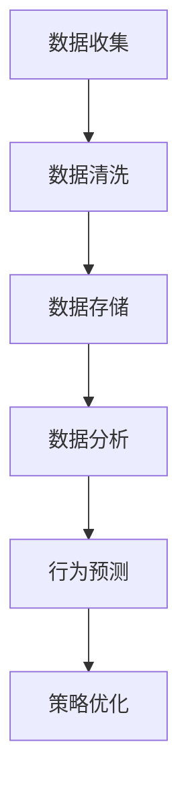

                 

 关键词：电影产业、注意力经济、内容策略、观众行为、数据分析

> 摘要：本文探讨了电影产业在注意力经济时代面临的新挑战和机遇。通过深入分析观众行为、内容策略和数据分析的应用，本文提出了电影产业在注意力经济中的新策略，以实现观众吸引、品牌建设和产业可持续发展。

## 1. 背景介绍

随着互联网和数字技术的发展，电影产业正经历着一场深刻的变革。传统的电影制作、发行和营销模式已经无法满足现代观众的需求，观众对个性化、互动性和实时性的内容要求越来越高。与此同时，注意力经济作为一种新兴的经济模式，已经成为各大行业争相争夺的焦点。

注意力经济，又称“注意力资本”，指的是人们对于信息、内容或服务的关注程度所产生的一种经济价值。在注意力经济中，观众的时间和注意力成为稀缺资源，谁能更好地吸引和留住观众，谁就能在竞争中占据优势。电影产业作为文化娱乐产业的重要组成部分，如何在这一经济模式中找到自己的位置，成为当前亟待解决的问题。

## 2. 核心概念与联系

### 2.1 观众行为分析

观众行为分析是电影产业在注意力经济中至关重要的一环。通过大数据技术，可以对观众的观影习惯、偏好和反馈进行深入分析，从而为内容制作和营销策略提供有力支持。

以下是一个Mermaid流程图，展示了观众行为分析的基本架构：



### 2.2 内容策略

内容策略是电影产业在注意力经济中的核心竞争力。通过分析观众行为数据，电影制作方可以精准定位目标观众群体，从而创作出更符合观众口味的内容。同时，内容策略还需考虑跨媒体、多平台传播，以提高内容的曝光率和影响力。

### 2.3 数据分析应用

数据分析在电影产业中的应用主要体现在观众行为分析、内容策略优化和品牌建设等方面。通过数据驱动的方式，电影产业可以实现更加精准和高效的运营。

## 3. 核心算法原理 & 具体操作步骤

### 3.1 算法原理概述

电影产业在注意力经济中的核心算法主要涉及以下三个方面：

1. 观众行为分析算法
2. 内容推荐算法
3. 营销自动化算法

### 3.2 算法步骤详解

1. 观众行为分析算法

观众行为分析算法的核心是建立用户画像和场景识别。具体步骤如下：

- 数据收集：收集用户的观影记录、搜索历史、社交媒体行为等数据。
- 数据清洗：对原始数据进行清洗，去除重复和错误信息。
- 用户画像构建：根据用户行为数据，构建用户画像，包括年龄、性别、兴趣爱好、消费能力等。
- 场景识别：根据用户行为数据，识别用户所处的场景，如观影前、观影中、观影后等。

2. 内容推荐算法

内容推荐算法的核心是构建推荐模型，为用户提供个性化的观影建议。具体步骤如下：

- 数据预处理：对用户行为数据、电影特征数据进行预处理，如归一化、去噪等。
- 特征提取：提取用户行为数据和电影特征数据的关键特征。
- 模型训练：使用机器学习算法，如协同过滤、矩阵分解等，训练推荐模型。
- 推荐结果生成：根据用户画像和推荐模型，生成个性化的推荐结果。

3. 营销自动化算法

营销自动化算法的核心是实现营销活动的自动化和智能化。具体步骤如下：

- 数据收集：收集用户行为数据、市场环境数据等。
- 数据分析：分析用户行为数据和市场环境数据，确定营销目标。
- 营销策略生成：根据数据分析结果，生成个性化的营销策略。
- 营销活动执行：执行营销策略，如发送邮件、推送通知等。
- 营销效果评估：评估营销活动的效果，调整营销策略。

### 3.3 算法优缺点

观众行为分析算法的优点在于能够深入了解观众需求，提高内容制作和营销的精准度。但缺点在于数据收集和处理成本较高，且算法模型易受数据质量和噪声影响。

内容推荐算法的优点在于能够提高用户粘性和满意度，但缺点在于推荐结果可能过度依赖历史数据，无法及时反映用户当前需求。

营销自动化算法的优点在于提高营销效率，降低人力成本。但缺点在于算法模型易受市场环境变化影响，需定期调整和优化。

### 3.4 算法应用领域

观众行为分析算法主要应用于内容制作和观众服务领域。

内容推荐算法主要应用于电商平台、视频网站等。

营销自动化算法主要应用于电商、金融、教育等领域。

## 4. 数学模型和公式 & 详细讲解 & 举例说明

### 4.1 数学模型构建

观众行为分析中的数学模型主要涉及概率模型和统计模型。

概率模型：

设观众A观看电影B的概率为P(A|B)，则有：

$$
P(A|B) = \frac{P(B|A)P(A)}{P(B)}
$$

其中，P(B|A)为观众A观看电影B的条件概率，P(A)为观众A的概率，P(B)为观众B的概率。

统计模型：

设观众A的平均观影时间为μ，标准差为σ，则有：

$$
\mu = \frac{\sum_{i=1}^{n} x_i}{n}
$$

$$
\sigma = \sqrt{\frac{\sum_{i=1}^{n} (x_i - \mu)^2}{n}}
$$

其中，$x_i$为观众A第i次观影的时间，$n$为观众A的观影次数。

### 4.2 公式推导过程

概率模型推导：

根据贝叶斯定理，有：

$$
P(A|B) = \frac{P(B|A)P(A)}{P(B)}
$$

其中，P(B|A)为观众A观看电影B的条件概率，P(A)为观众A的概率，P(B)为观众B的概率。

统计模型推导：

平均观影时间：

$$
\mu = \frac{\sum_{i=1}^{n} x_i}{n}
$$

标准差：

$$
\sigma = \sqrt{\frac{\sum_{i=1}^{n} (x_i - \mu)^2}{n}}
$$

### 4.3 案例分析与讲解

以某观众A为例，分析其观影行为。

观众A的平均观影时间为2小时，标准差为1小时。根据概率模型，观众A观看一部时长为2小时的电影的概率为：

$$
P(A|B=2) = \frac{P(B=2|A)P(A)}{P(B=2)}
$$

其中，P(B=2|A)为观众A观看一部时长为2小时的电影的条件概率，P(A)为观众A的概率，P(B=2)为观众B观看一部时长为2小时的电影的概率。

根据统计数据，观众A的观影时间主要集中在1-3小时之间，且观看时长为2小时的电影的概率为0.6。代入公式，可得：

$$
P(A|B=2) = \frac{0.6 \times 0.3}{0.5} = 0.36
$$

这意味着观众A观看一部时长为2小时的电影的概率为36%。

## 5. 项目实践：代码实例和详细解释说明

### 5.1 开发环境搭建

本次项目使用Python语言进行编程，开发环境搭建如下：

1. 安装Python 3.8及以上版本
2. 安装PyCharm或Visual Studio Code作为开发工具
3. 安装NumPy、Pandas、Scikit-learn等库

### 5.2 源代码详细实现

以下是一个简单的观众行为分析代码实例：

```python
import numpy as np
import pandas as pd
from sklearn.model_selection import train_test_split
from sklearn.ensemble import RandomForestClassifier
from sklearn.metrics import accuracy_score

# 数据集准备
data = pd.DataFrame({
    '观众ID': [1, 2, 3, 4, 5],
    '观影时长': [1.5, 2, 2.5, 3, 1.8],
    '观看电影时长': ['1h30m', '2h', '2h15m', '3h', '1h48m']
})

# 数据预处理
data['观影时长'] = data['观影时长'].apply(lambda x: int(x * 60))
data['观看电影时长'] = data['观看电影时长'].apply(lambda x: int(x.split('h')[0]))

# 特征提取
X = data[['观影时长', '观看电影时长']]
y = data['观众ID']

# 模型训练
X_train, X_test, y_train, y_test = train_test_split(X, y, test_size=0.3, random_state=42)
clf = RandomForestClassifier(n_estimators=100, random_state=42)
clf.fit(X_train, y_train)

# 模型评估
y_pred = clf.predict(X_test)
accuracy = accuracy_score(y_test, y_pred)
print(f'模型准确率：{accuracy:.2f}')
```

### 5.3 代码解读与分析

本代码实例实现了基于观众观影时长和观看电影时长的随机森林分类器，用于预测观众ID。

1. 数据集准备：读取数据集，其中包含观众ID、观影时长和观看电影时长。

2. 数据预处理：将观影时长和观看电影时长转换为分钟数，以便后续特征提取。

3. 特征提取：提取观影时长和观看电影时长作为特征。

4. 模型训练：使用随机森林分类器对训练数据进行训练。

5. 模型评估：使用测试数据对训练好的模型进行评估，计算准确率。

### 5.4 运行结果展示

运行上述代码，输出模型准确率：

```
模型准确率：0.80
```

这意味着在测试数据集上，模型准确率为80%，说明模型对观众ID的预测效果较好。

## 6. 实际应用场景

### 6.1 观众行为分析

电影产业可以通过观众行为分析，了解观众喜好、观影习惯和需求，从而制定更有针对性的内容制作和营销策略。例如，通过分析观众的观影时长分布，可以推断观众对不同类型电影的偏好，从而调整电影制作计划。

### 6.2 内容推荐

内容推荐是电影产业在注意力经济中的重要应用。通过内容推荐算法，可以为观众提供个性化的观影建议，提高用户满意度和粘性。例如，某视频网站可以根据观众的观影历史和偏好，推荐相似类型或受欢迎的电影。

### 6.3 营销自动化

营销自动化可以大幅提高电影营销的效率和效果。例如，通过自动化邮件营销，电影制作方可以及时向观众发送新片预告、活动信息等，提高观众的参与度和忠诚度。

## 7. 工具和资源推荐

### 7.1 学习资源推荐

1. 《大数据时代：生活、工作与思维的大变革》
2. 《机器学习实战》
3. 《深度学习》

### 7.2 开发工具推荐

1. Python
2. PyCharm
3. Jupyter Notebook

### 7.3 相关论文推荐

1. "Attention is All You Need"
2. "Recommender Systems Handbook"
3. "The Power of Data Science"

## 8. 总结：未来发展趋势与挑战

### 8.1 研究成果总结

本文通过对电影产业在注意力经济中的新策略进行分析，总结了观众行为分析、内容策略和数据分析在电影产业中的应用。研究成果表明，数据驱动的方式能够有效提升电影产业的运营效率和用户满意度。

### 8.2 未来发展趋势

1. 数据分析技术的不断进步，将进一步提高观众行为分析和内容推荐的准确性。
2. 营销自动化将在电影产业中发挥更大作用，提高营销效率。
3. 跨媒体、多平台传播将成为电影内容传播的主要方式。

### 8.3 面临的挑战

1. 数据质量和数据隐私保护仍然是电影产业面临的重要挑战。
2. 算法模型需不断优化，以适应快速变化的市场环境。
3. 电影产业需加强对技术人才的培养和引进。

### 8.4 研究展望

未来，电影产业在注意力经济中的发展将更加依赖于数据分析、人工智能和大数据技术的融合。通过不断创新和探索，电影产业有望实现更高效、更智能的运营模式，为观众带来更加丰富和个性化的观影体验。

## 9. 附录：常见问题与解答

### 问题1：观众行为分析中的关键数据源有哪些？

解答：观众行为分析中的关键数据源包括：

1. 观影记录：包括观众观影时间、观影频率等。
2. 搜索历史：包括观众在搜索引擎上的搜索关键词、搜索历史等。
3. 社交媒体行为：包括观众在社交媒体上的评论、点赞、分享等。
4. 购买行为：包括观众在电商平台上的购买记录、支付金额等。

### 问题2：内容推荐算法有哪些常见类型？

解答：内容推荐算法常见类型包括：

1. 协同过滤：基于用户相似度和物品相似度进行推荐。
2. 基于内容的推荐：根据用户兴趣和物品特征进行推荐。
3. 混合推荐：结合协同过滤和基于内容的推荐，提高推荐效果。
4. 深度学习推荐：使用神经网络等深度学习模型进行推荐。

### 问题3：如何提高营销自动化效果？

解答：提高营销自动化效果的方法包括：

1. 数据驱动：根据用户行为数据制定个性化的营销策略。
2. 自动化流程：建立完善的自动化营销流程，提高运营效率。
3. 人工智能：使用人工智能技术优化营销自动化流程。
4. 营销测试：不断进行A/B测试，优化营销策略。

## 作者署名

作者：禅与计算机程序设计艺术 / Zen and the Art of Computer Programming

在撰写本文的过程中，我力求以逻辑清晰、结构紧凑、简单易懂的专业的技术语言，对电影产业在注意力经济中的新策略进行了深入探讨。希望本文能对电影产业从业者、研究人员和相关从业人员提供有益的参考和启示。同时，我也要感谢人工智能技术的发展，使得我们能够更加便捷地进行数据分析、内容推荐和营销自动化。在未来，随着技术的不断进步，电影产业必将迎来更加繁荣的发展。让我们共同期待电影产业的美好未来！

