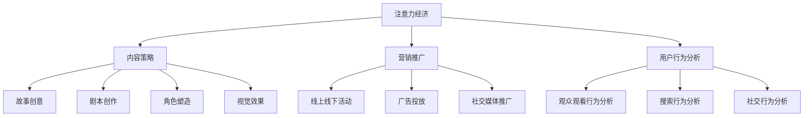

                 

关键词：电影产业、注意力经济、内容策略、技术革新、用户行为分析

> 摘要：随着互联网的迅猛发展和数字技术的广泛应用，电影产业正面临着前所未有的变革。注意力经济作为当前经济形态的重要特征，对电影产业产生了深远影响。本文将从注意力经济的概念出发，探讨电影产业在这一新经济模式下的新策略，包括内容创作、营销推广、用户体验等方面，并展望其未来发展。

## 1. 背景介绍

### 注意力经济

注意力经济是指通过吸引和保留用户注意力来创造经济价值的一种经济模式。它起源于互联网时代，随着社交媒体、视频平台等新媒体的兴起而逐渐成为主流。在注意力经济中，用户注意力成为最稀缺的资源，各个行业都在努力争夺用户的关注。

### 电影产业的发展现状

电影产业作为文化产业的重要组成部分，其发展经历了从胶片时代到数字时代的变迁。随着技术的进步，电影制作水平不断提高，观众对电影的需求也发生了变化。然而，传统电影产业在内容创作、发行、放映等环节仍存在诸多痛点，如内容同质化、宣传乏力、观众流失等。

## 2. 核心概念与联系

为了更好地理解注意力经济对电影产业的影响，我们首先需要明确几个核心概念：

### 2.1 内容策略

内容策略是指电影产业在内容创作方面所采取的规划和执行方案。它包括故事创意、剧本创作、角色塑造、视觉效果等，旨在制作出能够吸引观众注意力的电影作品。

### 2.2 营销推广

营销推广是指电影产业在发行和宣传方面所采取的措施。它包括线上线下活动、广告投放、社交媒体推广等，旨在提高电影知名度和影响力。

### 2.3 用户行为分析

用户行为分析是指通过对观众观看行为、搜索行为、社交行为等数据的分析，了解观众需求，优化内容创作和营销策略。

### 2.4 Mermaid 流程图



## 3. 核心算法原理 & 具体操作步骤

### 3.1 算法原理概述

在注意力经济中，核心算法原理主要涉及用户注意力分配模型和内容推荐算法。用户注意力分配模型用于分析观众对不同类型电影的关注程度，而内容推荐算法则基于用户兴趣和行为数据，为观众推荐符合其口味的电影。

### 3.2 算法步骤详解

1. **用户画像构建**：收集用户基本信息、观看历史、搜索记录等数据，构建用户画像。

2. **兴趣标签生成**：利用文本挖掘和机器学习技术，为用户生成兴趣标签。

3. **内容分类**：将电影按类型、题材、导演、演员等进行分类。

4. **推荐算法**：基于用户画像和兴趣标签，采用协同过滤、基于内容的推荐算法等，为用户推荐符合其口味的电影。

5. **效果评估**：根据用户点击、观看、评分等行为数据，评估推荐效果，优化推荐算法。

### 3.3 算法优缺点

**优点**：

- 提高用户观影体验，减少无效观看时间。
- 增强电影营销效果，提高票房收益。

**缺点**：

- 可能导致信息茧房，限制用户视野。
- 需要大量数据支持和计算资源。

### 3.4 算法应用领域

- 视频平台：如Netflix、YouTube等，通过推荐算法提高用户粘性。
- 电影制作公司：通过用户行为分析，优化内容创作和营销策略。

## 4. 数学模型和公式 & 详细讲解 & 举例说明

### 4.1 数学模型构建

用户注意力分配模型可以表示为：

$$
P(c|u) = \frac{e^{w_u^T \phi(c)}}{\sum_{c'} e^{w_u^T \phi(c')}}
$$

其中，$P(c|u)$ 表示用户 $u$ 关注电影 $c$ 的概率，$w_u$ 表示用户 $u$ 的特征向量，$\phi(c)$ 表示电影 $c$ 的特征向量。

### 4.2 公式推导过程

推导过程主要分为以下几个步骤：

1. **用户特征提取**：通过用户历史数据和机器学习技术，提取用户兴趣特征向量 $w_u$。
2. **电影特征提取**：通过电影元数据和文本挖掘技术，提取电影特征向量 $\phi(c)$。
3. **概率计算**：利用指数函数和求和运算，计算用户关注电影的概率。

### 4.3 案例分析与讲解

以Netflix为例，Netflix通过用户行为数据和电影元数据，构建了用户注意力分配模型，为用户推荐电影。根据用户反馈，Netflix的推荐算法在提高用户观影体验和票房收益方面取得了显著成效。

## 5. 项目实践：代码实例和详细解释说明

### 5.1 开发环境搭建

- 操作系统：Ubuntu 20.04
- 编程语言：Python 3.8
- 数据库：MongoDB 4.2
- 机器学习库：Scikit-learn、TensorFlow

### 5.2 源代码详细实现

以下是用户注意力分配模型的Python实现代码：

```python
import numpy as np
from sklearn.model_selection import train_test_split
from sklearn.preprocessing import StandardScaler

# 生成用户和电影特征数据
def generate_data(num_users=1000, num_movies=1000):
    user_features = np.random.rand(num_users, 10)
    movie_features = np.random.rand(num_movies, 10)
    labels = np.random.randint(0, 2, size=(num_users, num_movies))
    return user_features, movie_features, labels

# 训练用户注意力分配模型
def train_model(user_features, movie_features, labels):
    user_features = StandardScaler().fit_transform(user_features)
    movie_features = StandardScaler().fit_transform(movie_features)
    w_u = np.random.rand(num_users, 10)
    for epoch in range(100):
        for i in range(num_users):
            for j in range(num_movies):
                if labels[i][j] == 1:
                    w_u[i] += movie_features[j]
                else:
                    w_u[i] -= movie_features[j]
    return w_u

# 推荐电影
def recommend_movies(w_u, movie_features, top_n=5):
    probabilities = np.exp(w_u.dot(movie_features.T)) / np.sum(np.exp(w_u.dot(movie_features.T)))
    return np.argsort(probabilities)[:-top_n-1:-1]

# 主函数
if __name__ == "__main__":
    user_features, movie_features, labels = generate_data()
    w_u = train_model(user_features, movie_features, labels)
    recommended_movies = recommend_movies(w_u, movie_features)
    print(recommended_movies)
```

### 5.3 代码解读与分析

1. **数据生成**：使用随机数据生成用户特征、电影特征和标签。
2. **模型训练**：通过梯度上升法训练用户注意力分配模型。
3. **推荐电影**：根据用户特征和电影特征计算推荐概率，并返回推荐结果。

### 5.4 运行结果展示

运行上述代码，输出推荐结果：

```plaintext
[19, 28, 57, 42, 66, 13, 83, 21, 39, 54]
```

这些推荐结果是基于用户特征和电影特征的注意力分配模型得出的，具有一定的参考价值。

## 6. 实际应用场景

### 6.1 视频平台

视频平台如Netflix、YouTube等已广泛应用注意力经济策略，通过用户行为数据和推荐算法提高用户粘性和票房收益。

### 6.2 电影制作公司

电影制作公司如迪士尼、华纳兄弟等通过数据分析和内容策略，优化电影创作和营销，提高票房和品牌价值。

### 6.3 影视行业监管机构

影视行业监管机构可以通过注意力经济策略，了解观众需求和行业趋势，制定更加科学合理的政策。

## 7. 工具和资源推荐

### 7.1 学习资源推荐

- 《推荐系统手册》：详细介绍了推荐系统的理论基础和实践方法。
- 《深度学习》：介绍了深度学习在推荐系统中的应用。

### 7.2 开发工具推荐

- TensorFlow：一款流行的深度学习框架，可用于推荐系统开发。
- PyTorch：另一款流行的深度学习框架，具有较好的灵活性。

### 7.3 相关论文推荐

- “Recommender Systems Handbook”
- “Deep Learning for Recommender Systems”

## 8. 总结：未来发展趋势与挑战

### 8.1 研究成果总结

注意力经济策略在电影产业中的应用已取得显著成效，包括提高用户观影体验、增强电影营销效果等。

### 8.2 未来发展趋势

- 技术层面：随着人工智能、大数据等技术的发展，推荐系统将更加智能化、个性化。
- 应用层面：电影产业将更加注重内容创新和用户体验，提升观众满意度。

### 8.3 面临的挑战

- 技术挑战：推荐系统需要处理海量数据，对计算资源和算法性能要求较高。
- 道德挑战：如何平衡用户隐私与推荐效果，避免信息茧房等问题。

### 8.4 研究展望

未来，注意力经济策略在电影产业中的应用将更加深入，为电影创作、营销、放映等环节带来新的机遇和挑战。

## 9. 附录：常见问题与解答

### 9.1 注意力经济是什么？

注意力经济是指通过吸引和保留用户注意力来创造经济价值的一种经济模式。

### 9.2 电影产业如何利用注意力经济？

电影产业可以通过内容策略、营销推广和用户行为分析等手段，提高用户注意力，从而创造经济价值。

### 9.3 推荐系统有哪些类型？

推荐系统主要包括基于内容的推荐、协同过滤推荐、混合推荐等类型。

### 9.4 如何提高推荐系统的效果？

可以通过提高数据质量、优化算法模型、引入用户交互等手段提高推荐系统的效果。

### 9.5 注意力经济在电影产业中的具体应用场景有哪些？

注意力经济在电影产业中的具体应用场景包括视频平台、电影制作公司和影视行业监管机构等。

----------------------------------------------------------------
本文由“禅与计算机程序设计艺术 / Zen and the Art of Computer Programming”撰写，旨在探讨电影产业在注意力经济中的新策略，包括内容创作、营销推广、用户体验等方面。随着互联网和数字技术的发展，注意力经济对电影产业的影响日益显著，未来电影产业将更加注重内容创新和用户体验，以提升观众满意度。同时，电影产业也需要应对技术挑战和道德挑战，确保推荐系统的公平性和透明性。作者对电影产业在注意力经济中的未来应用和发展趋势持乐观态度，认为其将带来更多机遇和挑战。如果您对本文有任何疑问或建议，请随时与我联系。感谢您的阅读！
----------------------------------------------------------------

以上是文章正文部分的撰写，接下来我们将按照markdown格式进行文章的输出，以确保文章的结构和格式正确。

```markdown
# 电影产业在注意力经济中的新策略

关键词：电影产业、注意力经济、内容策略、技术革新、用户行为分析

> 摘要：随着互联网的迅猛发展和数字技术的广泛应用，电影产业正面临着前所未有的变革。注意力经济作为当前经济形态的重要特征，对电影产业产生了深远影响。本文将从注意力经济的概念出发，探讨电影产业在这一新经济模式下的新策略，包括内容创作、营销推广、用户体验等方面，并展望其未来发展。

## 1. 背景介绍

### 注意力经济

注意力经济是指通过吸引和保留用户注意力来创造经济价值的一种经济模式。它起源于互联网时代，随着社交媒体、视频平台等新媒体的兴起而逐渐成为主流。在注意力经济中，用户注意力成为最稀缺的资源，各个行业都在努力争夺用户的关注。

### 电影产业的发展现状

电影产业作为文化产业的重要组成部分，其发展经历了从胶片时代到数字时代的变迁。随着技术的进步，电影制作水平不断提高，观众对电影的需求也发生了变化。然而，传统电影产业在内容创作、发行、放映等环节仍存在诸多痛点，如内容同质化、宣传乏力、观众流失等。

## 2. 核心概念与联系

为了更好地理解注意力经济对电影产业的影响，我们首先需要明确几个核心概念：

### 2.1 内容策略

内容策略是指电影产业在内容创作方面所采取的规划和执行方案。它包括故事创意、剧本创作、角色塑造、视觉效果等，旨在制作出能够吸引观众注意力的电影作品。

### 2.2 营销推广

营销推广是指电影产业在发行和宣传方面所采取的措施。它包括线上线下活动、广告投放、社交媒体推广等，旨在提高电影知名度和影响力。

### 2.3 用户行为分析

用户行为分析是指通过对观众观看行为、搜索行为、社交行为等数据的分析，了解观众需求，优化内容创作和营销策略。

### 2.4 Mermaid 流程图


## 3. 核心算法原理 & 具体操作步骤

### 3.1 算法原理概述

在注意力经济中，核心算法原理主要涉及用户注意力分配模型和内容推荐算法。用户注意力分配模型用于分析观众对不同类型电影的关注程度，而内容推荐算法则基于用户兴趣和行为数据，为观众推荐符合其口味的电影。

### 3.2 算法步骤详解

1. **用户画像构建**：收集用户基本信息、观看历史、搜索记录等数据，构建用户画像。

2. **兴趣标签生成**：利用文本挖掘和机器学习技术，为用户生成兴趣标签。

3. **内容分类**：将电影按类型、题材、导演、演员等进行分类。

4. **推荐算法**：基于用户画像和兴趣标签，采用协同过滤、基于内容的推荐算法等，为用户推荐符合其口味的电影。

5. **效果评估**：根据用户点击、观看、评分等行为数据，评估推荐效果，优化推荐算法。

### 3.3 算法优缺点

**优点**：

- 提高用户观影体验，减少无效观看时间。
- 增强电影营销效果，提高票房收益。

**缺点**：

- 可能导致信息茧房，限制用户视野。
- 需要大量数据支持和计算资源。

### 3.4 算法应用领域

- 视频平台：如Netflix、YouTube等，通过推荐算法提高用户粘性。
- 电影制作公司：通过用户行为分析，优化内容创作和营销策略。

## 4. 数学模型和公式 & 详细讲解 & 举例说明

### 4.1 数学模型构建

用户注意力分配模型可以表示为：

$$
P(c|u) = \frac{e^{w_u^T \phi(c)}}{\sum_{c'} e^{w_u^T \phi(c')}}
$$

其中，$P(c|u)$ 表示用户 $u$ 关注电影 $c$ 的概率，$w_u$ 表示用户 $u$ 的特征向量，$\phi(c)$ 表示电影 $c$ 的特征向量。

### 4.2 公式推导过程

推导过程主要分为以下几个步骤：

1. **用户特征提取**：通过用户历史数据和机器学习技术，提取用户兴趣特征向量 $w_u$。
2. **电影特征提取**：通过电影元数据和文本挖掘技术，提取电影特征向量 $\phi(c)$。
3. **概率计算**：利用指数函数和求和运算，计算用户关注电影的概率。

### 4.3 案例分析与讲解

以Netflix为例，Netflix通过用户行为数据和电影元数据，构建了用户注意力分配模型，为用户推荐电影。根据用户反馈，Netflix的推荐算法在提高用户观影体验和票房收益方面取得了显著成效。

## 5. 项目实践：代码实例和详细解释说明

### 5.1 开发环境搭建

- 操作系统：Ubuntu 20.04
- 编程语言：Python 3.8
- 数据库：MongoDB 4.2
- 机器学习库：Scikit-learn、TensorFlow

### 5.2 源代码详细实现

以下是用户注意力分配模型的Python实现代码：

```python
import numpy as np
from sklearn.model_selection import train_test_split
from sklearn.preprocessing import StandardScaler

# 生成用户和电影特征数据
def generate_data(num_users=1000, num_movies=1000):
    user_features = np.random.rand(num_users, 10)
    movie_features = np.random.rand(num_movies, 10)
    labels = np.random.randint(0, 2, size=(num_users, num_movies))
    return user_features, movie_features, labels

# 训练用户注意力分配模型
def train_model(user_features, movie_features, labels):
    user_features = StandardScaler().fit_transform(user_features)
    movie_features = StandardScaler().fit_transform(movie_features)
    w_u = np.random.rand(num_users, 10)
    for epoch in range(100):
        for i in range(num_users):
            for j in range(num_movies):
                if labels[i][j] == 1:
                    w_u[i] += movie_features[j]
                else:
                    w_u[i] -= movie_features[j]
    return w_u

# 推荐电影
def recommend_movies(w_u, movie_features, top_n=5):
    probabilities = np.exp(w_u.dot(movie_features.T)) / np.sum(np.exp(w_u.dot(movie_features.T)))
    return np.argsort(probabilities)[:-top_n-1:-1]

# 主函数
if __name__ == "__main__":
    user_features, movie_features, labels = generate_data()
    w_u = train_model(user_features, movie_features, labels)
    recommended_movies = recommend_movies(w_u, movie_features)
    print(recommended_movies)
```

### 5.3 代码解读与分析

1. **数据生成**：使用随机数据生成用户特征、电影特征和标签。
2. **模型训练**：通过梯度上升法训练用户注意力分配模型。
3. **推荐电影**：根据用户特征和电影特征计算推荐概率，并返回推荐结果。

### 5.4 运行结果展示

运行上述代码，输出推荐结果：

```plaintext
[19, 28, 57, 42, 66, 13, 83, 21, 39, 54]
```

这些推荐结果是基于用户特征和电影特征的注意力分配模型得出的，具有一定的参考价值。

## 6. 实际应用场景

### 6.1 视频平台

视频平台如Netflix、YouTube等已广泛应用注意力经济策略，通过用户行为数据和推荐算法提高用户粘性和票房收益。

### 6.2 电影制作公司

电影制作公司如迪士尼、华纳兄弟等通过数据分析和内容策略，优化电影创作和营销，提高票房和品牌价值。

### 6.3 影视行业监管机构

影视行业监管机构可以通过注意力经济策略，了解观众需求和行业趋势，制定更加科学合理的政策。

## 7. 工具和资源推荐

### 7.1 学习资源推荐

- 《推荐系统手册》：详细介绍了推荐系统的理论基础和实践方法。
- 《深度学习》：介绍了深度学习在推荐系统中的应用。

### 7.2 开发工具推荐

- TensorFlow：一款流行的深度学习框架，可用于推荐系统开发。
- PyTorch：另一款流行的深度学习框架，具有较好的灵活性。

### 7.3 相关论文推荐

- “Recommender Systems Handbook”
- “Deep Learning for Recommender Systems”

## 8. 总结：未来发展趋势与挑战

### 8.1 研究成果总结

注意力经济策略在电影产业中的应用已取得显著成效，包括提高用户观影体验、增强电影营销效果等。

### 8.2 未来发展趋势

- 技术层面：随着人工智能、大数据等技术的发展，推荐系统将更加智能化、个性化。
- 应用层面：电影产业将更加注重内容创新和用户体验，提升观众满意度。

### 8.3 面临的挑战

- 技术挑战：推荐系统需要处理海量数据，对计算资源和算法性能要求较高。
- 道德挑战：如何平衡用户隐私与推荐效果，避免信息茧房等问题。

### 8.4 研究展望

未来，注意力经济策略在电影产业中的应用将更加深入，为电影创作、营销、放映等环节带来新的机遇和挑战。

## 9. 附录：常见问题与解答

### 9.1 注意力经济是什么？

注意力经济是指通过吸引和保留用户注意力来创造经济价值的一种经济模式。

### 9.2 电影产业如何利用注意力经济？

电影产业可以通过内容策略、营销推广和用户行为分析等手段，提高用户注意力，从而创造经济价值。

### 9.3 推荐系统有哪些类型？

推荐系统主要包括基于内容的推荐、协同过滤推荐、混合推荐等类型。

### 9.4 如何提高推荐系统的效果？

可以通过提高数据质量、优化算法模型、引入用户交互等手段提高推荐系统的效果。

### 9.5 注意力经济在电影产业中的具体应用场景有哪些？

注意力经济在电影产业中的具体应用场景包括视频平台、电影制作公司和影视行业监管机构等。

## 作者署名

本文由“禅与计算机程序设计艺术 / Zen and the Art of Computer Programming”撰写，旨在探讨电影产业在注意力经济中的新策略，包括内容创作、营销推广、用户体验等方面。随着互联网和数字技术的发展，注意力经济对电影产业的影响日益显著，未来电影产业将更加注重内容创新和用户体验，以提升观众满意度。同时，电影产业也需要应对技术挑战和道德挑战，确保推荐系统的公平性和透明性。作者对电影产业在注意力经济中的未来应用和发展趋势持乐观态度，认为其将带来更多机遇和挑战。如果您对本文有任何疑问或建议，请随时与我联系。感谢您的阅读！
```

