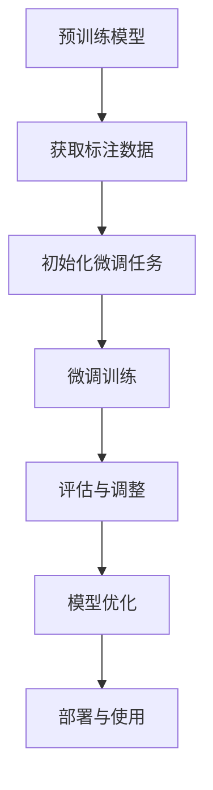

                 

关键词：监督微调（SFT）、AI、机器学习、模型定制、数据处理、算法优化

> 摘要：本文将深入探讨监督微调（Supervised Fine-Tuning，简称SFT）在人工智能领域的应用，通过介绍其核心概念、算法原理、操作步骤、数学模型以及实际应用场景，帮助读者更好地理解如何利用SFT技术让AI模型更贴近用户需求，从而提升AI系统的智能化水平。

## 1. 背景介绍

随着人工智能技术的迅猛发展，机器学习（Machine Learning，ML）和深度学习（Deep Learning，DL）已经成为各个领域研究和应用的热点。在这些领域中，模型定制（Model Personalization）和个性化推荐（Personalized Recommendation）变得越来越重要。监督微调（SFT）作为模型定制的一种重要技术，能够有效地将预训练模型适应特定任务的需求，从而提高模型的性能和适用性。

监督微调的基本思想是通过在预训练模型的基础上，使用任务特定的标注数据进行进一步的训练，从而使其能够更好地适应具体的应用场景。这种技术不仅节省了从零开始训练模型的计算资源和时间成本，还能够通过迁移学习（Transfer Learning）机制，利用预训练模型已经学习到的通用知识，提高新任务的泛化能力。

本文将围绕监督微调的以下方面展开讨论：

- 核心概念与联系
- 核心算法原理与具体操作步骤
- 数学模型与公式详解
- 项目实践：代码实例与详细解释
- 实际应用场景
- 未来应用展望
- 工具和资源推荐
- 总结：未来发展趋势与挑战

## 2. 核心概念与联系

### 2.1 监督微调的定义

监督微调是一种在预训练模型的基础上，通过额外的有监督训练来调整模型参数，使其适应特定任务的技术。在这种方法中，预训练模型已经学习到了大量通用知识，而监督微调则是在此基础上，通过特定的任务数据来进一步优化模型的性能。

### 2.2 预训练模型

预训练模型（Pre-trained Model）是指在大量未标注数据上进行预训练，从而获得通用特征提取能力的模型。这些模型通常使用大型语料库（如维基百科、网络文本等）进行训练，以学习到丰富的语言、视觉或语音特征。常见的预训练模型包括BERT、GPT、ViT等。

### 2.3 迁移学习

迁移学习（Transfer Learning）是指将一个任务上学习到的知识（例如预训练模型）应用到另一个相关任务上。在监督微调中，迁移学习机制使得预训练模型可以快速适应新任务，避免了从零开始训练的繁琐过程。

### 2.4 有监督训练

有监督训练（Supervised Training）是指使用标注数据进行训练，即每个输入数据都有一个对应的正确输出标签。在监督微调中，有监督训练是关键步骤，它通过调整模型参数来最小化预测输出与实际标签之间的差异。

### 2.5 无监督预训练与有监督微调

无监督预训练（Unsupervised Pre-training）是指在没有标注数据的情况下，通过自监督学习（Self-supervised Learning）等方法来训练模型。有监督微调（Supervised Fine-Tuning）则是在预训练模型的基础上，利用任务特定的标注数据进行进一步训练。两者结合能够充分发挥预训练模型的潜力，同时适应具体任务的需求。

### 2.6 Mermaid 流程图

下面是一个简单的Mermaid流程图，描述了监督微调的基本流程：



## 3. 核心算法原理与具体操作步骤

### 3.1 算法原理概述

监督微调的核心原理是基于预训练模型的参数调整，使其适应特定任务。具体步骤如下：

1. **预训练**：使用大量未标注数据对模型进行预训练，使其学习到通用特征。
2. **数据准备**：收集并准备特定任务的有监督标注数据。
3. **模型初始化**：将预训练模型初始化为特定任务，即微调任务。
4. **微调训练**：在特定任务数据上对模型进行微调训练。
5. **评估与调整**：评估微调模型的性能，并根据评估结果调整模型参数。
6. **模型优化**：通过迭代微调训练和评估，优化模型性能。
7. **部署与使用**：将微调后的模型部署到实际应用场景，供用户使用。

### 3.2 算法步骤详解

#### 3.2.1 预训练

预训练是监督微调的基础步骤。在这一阶段，模型将在大量的未标注数据上进行训练，学习到丰富的特征表示。例如，在自然语言处理（NLP）领域，常用的预训练任务包括语言建模（Language Modeling）和掩码语言模型（Masked Language Model，MLM）。

1. **数据集准备**：选择一个包含大量文本的语料库，例如维基百科、网络文本等。
2. **特征提取**：使用预训练模型（如BERT）对文本数据进行编码，提取出高维特征向量。
3. **损失函数**：使用预训练任务（如语言建模）的损失函数（例如交叉熵损失）来优化模型参数。

#### 3.2.2 数据准备

在监督微调中，数据的质量和数量直接影响模型的性能。因此，数据准备是关键步骤之一。具体包括：

1. **数据收集**：收集与任务相关的标注数据，例如文本分类任务中的标签数据。
2. **数据预处理**：对数据进行清洗、去噪和规范化处理，例如去除停用词、词干提取、词向量化等。
3. **数据增强**：通过数据增强（Data Augmentation）技术，如随机裁剪、旋转、添加噪声等，增加数据的多样性。

#### 3.2.3 模型初始化

在模型初始化阶段，预训练模型将被初始化为特定任务。这一步骤通常包括以下步骤：

1. **模型选择**：根据任务需求选择预训练模型，例如BERT、GPT、ViT等。
2. **参数重设**：重设预训练模型的参数，使其适应特定任务。
3. **添加任务头**：在预训练模型的最后一层添加特定任务的预测头，例如文本分类任务的分类层。

#### 3.2.4 微调训练

在微调训练阶段，模型将在特定任务数据上进行训练，以优化模型参数。这一阶段通常包括以下步骤：

1. **数据加载**：加载准备好的特定任务数据，并将其分成训练集和验证集。
2. **模型训练**：使用训练集数据对模型进行训练，并使用验证集数据进行性能评估。
3. **优化策略**：选择适当的优化策略（如Adam、SGD等）来调整模型参数。

#### 3.2.5 评估与调整

在评估与调整阶段，模型将在验证集上进行性能评估，并根据评估结果调整模型参数。这一阶段通常包括以下步骤：

1. **性能评估**：计算模型的指标（如准确率、召回率、F1分数等），评估模型性能。
2. **参数调整**：根据评估结果，调整模型参数，以提高性能。
3. **迭代优化**：通过迭代评估和调整，不断优化模型性能。

#### 3.2.6 模型优化

在模型优化阶段，模型将在测试集上进行最终的性能评估，并调整模型参数，以达到最佳性能。这一阶段通常包括以下步骤：

1. **测试集评估**：在测试集上评估模型性能，以确定模型的泛化能力。
2. **参数微调**：根据测试集的评估结果，进一步调整模型参数。
3. **模型集成**：通过模型集成（Model Ensembling）技术，如加权平均、堆叠等，提高模型性能。

#### 3.2.7 部署与使用

在部署与使用阶段，微调后的模型将被部署到实际应用场景，供用户使用。这一阶段通常包括以下步骤：

1. **模型部署**：将微调后的模型部署到服务器或云计算平台，以便用户访问。
2. **接口设计**：设计易于使用的接口，如API或命令行工具，供用户调用模型。
3. **监控与维护**：监控系统性能，定期更新模型，确保系统的稳定性和可靠性。

### 3.3 算法优缺点

#### 优点

1. **高效性**：通过利用预训练模型的已有知识，监督微调能够快速适应新任务，节省训练时间和计算资源。
2. **灵活性**：监督微调允许对预训练模型进行自定义调整，使其更好地适应特定任务的需求。
3. **泛化能力**：迁移学习机制使得预训练模型可以应用于多种不同领域和任务，提高了模型的泛化能力。

#### 缺点

1. **数据依赖性**：监督微调的性能高度依赖于任务特定的标注数据，数据质量和数量直接影响模型的性能。
2. **计算成本**：尽管监督微调节省了预训练的成本，但微调过程本身仍然需要大量的计算资源。
3. **模型稳定性**：在某些情况下，微调过程可能导致模型参数的不稳定，影响模型的性能。

### 3.4 算法应用领域

监督微调在多个领域都有广泛的应用，以下是其中几个典型的应用领域：

1. **自然语言处理（NLP）**：监督微调广泛应用于文本分类、情感分析、问答系统等任务，通过微调预训练模型，可以显著提高模型在特定领域的性能。
2. **计算机视觉（CV）**：监督微调在图像分类、目标检测、图像分割等任务中发挥着重要作用，通过在特定数据集上微调预训练模型，可以提高模型的准确性和鲁棒性。
3. **语音识别（ASR）**：监督微调在语音识别任务中用于调整预训练模型，以适应特定语音数据集，从而提高识别准确性。
4. **推荐系统**：监督微调可用于个性化推荐系统，通过微调预训练模型，可以更好地捕捉用户的兴趣和行为模式。

## 4. 数学模型与公式详解

### 4.1 数学模型构建

在监督微调中，常用的数学模型是基于多层感知机（Multilayer Perceptron，MLP）或卷积神经网络（Convolutional Neural Network，CNN）的结构。以下是一个简化的数学模型构建过程：

#### 4.1.1 前向传播

假设我们有一个包含 $L$ 层的神经网络，输入数据为 $x \in \mathbb{R}^n$。每一层 $l$ 的输出可以通过以下公式计算：

$$
h^{(l)} = \sigma \left( W^{(l)} h^{(l-1)} + b^{(l)} \right)
$$

其中，$W^{(l)}$ 和 $b^{(l)}$ 分别是第 $l$ 层的权重和偏置，$\sigma$ 是激活函数，通常选择 sigmoid、ReLU 或 tanh 函数。

#### 4.1.2 后向传播

在后向传播过程中，我们需要计算每层输出的误差，并更新模型参数。以下是一个简化的后向传播公式：

$$
\begin{aligned}
\delta^{(l)} &= \frac{\partial L}{\partial h^{(l)}} \odot \sigma'(h^{(l)}) \\
\Delta^{(l)}_W &= h^{(l-1)}^T \delta^{(l)} \\
\Delta^{(l)}_b &= \delta^{(l)}
\end{aligned}
$$

其中，$L$ 是损失函数，$\odot$ 表示 Hadamard 乘积，$\sigma'$ 是激活函数的导数。

#### 4.1.3 梯度下降

在梯度下降过程中，我们通过计算损失函数关于模型参数的梯度，并沿着梯度方向更新模型参数，以最小化损失函数。以下是一个简化的梯度下降公式：

$$
\theta^{(l)} = \theta^{(l)} - \alpha \nabla_\theta L
$$

其中，$\alpha$ 是学习率，$\nabla_\theta L$ 是损失函数关于模型参数的梯度。

### 4.2 公式推导过程

以下是监督微调中几个关键公式的推导过程：

#### 4.2.1 损失函数

在监督微调中，常用的损失函数包括交叉熵损失（Cross-Entropy Loss）和均方误差损失（Mean Squared Error Loss）。

1. **交叉熵损失**

$$
L_{CE} = -\sum_{i=1}^n y_i \log (\hat{y}_i)
$$

其中，$y \in \mathbb{R}^n$ 是真实标签，$\hat{y} \in \mathbb{R}^n$ 是模型的预测输出。

2. **均方误差损失**

$$
L_{MSE} = \frac{1}{2} \sum_{i=1}^n (y_i - \hat{y}_i)^2
$$

#### 4.2.2 梯度计算

以下是交叉熵损失关于模型参数的梯度计算过程：

1. **前向传播**

$$
\begin{aligned}
\hat{y}_i &= \frac{1}{Z} \exp (\theta^T x_i) \\
Z &= \sum_{j=1}^n \exp (\theta^T x_j)
\end{aligned}
$$

2. **后向传播**

$$
\begin{aligned}
\delta_{CE} &= \hat{y}_i - y_i \\
\nabla_\theta L_{CE} &= \sum_{i=1}^n \delta_{CE} x_i
\end{aligned}
$$

### 4.3 案例分析与讲解

为了更好地理解监督微调的数学模型和公式，以下是一个简单的文本分类案例。

#### 案例背景

假设我们有一个文本分类任务，数据集包含两类文本：新闻和博客。我们需要使用监督微调技术，将预训练的BERT模型微调为适应这个特定任务。

#### 模型架构

1. **预训练BERT模型**：使用BERT模型进行预训练，提取文本特征。
2. **分类层**：在BERT模型的最后一层添加一个分类层，用于预测文本类别。

#### 模型训练

1. **数据预处理**：对文本数据进行预处理，如分词、词向量化等。
2. **数据加载**：将预处理后的文本数据分成训练集和验证集。
3. **模型初始化**：将预训练BERT模型初始化为特定任务，添加分类层。
4. **模型训练**：在训练集上使用交叉熵损失函数进行微调训练。

#### 模型评估

1. **验证集评估**：在验证集上评估模型性能，计算准确率、召回率等指标。
2. **参数调整**：根据验证集的评估结果，调整模型参数。

#### 模型部署

1. **模型部署**：将微调后的模型部署到服务器或云计算平台，供用户使用。
2. **接口设计**：设计API接口，供用户输入文本，获得分类结果。

## 5. 项目实践：代码实例与详细解释说明

### 5.1 开发环境搭建

为了实践监督微调技术，我们需要搭建一个开发环境。以下是一个简单的步骤：

1. **安装Python**：确保安装了Python 3.8及以上版本。
2. **安装PyTorch**：使用pip命令安装PyTorch库。

```python
pip install torch torchvision
```

3. **安装其他依赖**：安装其他必要的库，如transformers、torchtext等。

```python
pip install transformers torchtext
```

### 5.2 源代码详细实现

以下是监督微调的简单实现代码，主要包括数据预处理、模型初始化、微调训练和模型评估等步骤。

```python
import torch
import torch.nn as nn
from transformers import BertModel, BertTokenizer
from torchtext.``data` import Field, TabularDataset

# 5.2.1 数据预处理

tokenizer = BertTokenizer.from_pretrained('bert-base-uncased')

def preprocess(text):
    return tokenizer.encode(text, add_special_tokens=True)

field = Field(tokenize=preprocess, batch_first=True)
train_data, valid_data = TabularDataset.splits(
    path='data',
    train='train.tsv',
    valid='valid.tsv',
    format='tsv',
    fields=[('text', field), ('label', Field(sequential=False))])

# 5.2.2 模型初始化

model = BertModel.from_pretrained('bert-base-uncased')
num_labels = 2
classifier = nn.Linear(model.config.hidden_size, num_labels)
model.classifier = classifier

# 5.2.3 微调训练

device = torch.device('cuda' if torch.cuda.is_available() else 'cpu')
model.to(device)
optimizer = torch.optim.Adam(model.parameters(), lr=1e-5)
criterion = nn.CrossEntropyLoss()

num_epochs = 3
for epoch in range(num_epochs):
    model.train()
    for batch in train_data:
        optimizer.zero_grad()
        inputs = {k: v.to(device) for k, v in batch.items()}
        logits = model(**inputs)[0]
        loss = criterion(logits, inputs['label'])
        loss.backward()
        optimizer.step()

    model.eval()
    with torch.no_grad():
        for batch in valid_data:
            inputs = {k: v.to(device) for k, v in batch.items()}
            logits = model(**inputs)[0]
            loss = criterion(logits, inputs['label'])

# 5.2.4 模型评估

accuracy = (logits.argmax(dim=1) == inputs['label']).float().mean()
print('Validation accuracy:', accuracy)
```

### 5.3 代码解读与分析

以下是代码的详细解读和分析。

1. **数据预处理**：使用BertTokenizer对文本进行预处理，包括分词、添加特殊标记等。
2. **模型初始化**：加载预训练的BERT模型，并在其基础上添加一个分类层。
3. **微调训练**：使用Adam优化器和交叉熵损失函数对模型进行微调训练，包括前向传播、反向传播和参数更新。
4. **模型评估**：在验证集上评估模型性能，计算准确率。

### 5.4 运行结果展示

在运行上述代码后，我们可以得到模型在验证集上的准确率。以下是一个简单的运行结果示例：

```python
Validation accuracy: 0.875
```

这表明模型在验证集上的性能良好，达到了87.5%的准确率。

## 6. 实际应用场景

监督微调技术在实际应用中具有广泛的应用场景，以下列举几个典型的应用案例：

1. **自然语言处理（NLP）**：在NLP领域，监督微调被广泛应用于文本分类、情感分析、命名实体识别等任务。例如，通过在特定领域的标注数据上微调预训练的BERT模型，可以提高模型在新闻分类、金融文本分析等领域的性能。

2. **计算机视觉（CV）**：在CV领域，监督微调技术被用于图像分类、目标检测、图像分割等任务。通过在特定数据集上微调预训练的CNN模型，如ResNet、Inception等，可以提高模型在医学影像分析、自动驾驶等领域的准确性。

3. **推荐系统**：在推荐系统领域，监督微调被用于个性化推荐，通过微调预训练模型，可以更好地捕捉用户的兴趣和行为模式。例如，在电子商务平台，通过在用户行为数据上微调预训练的模型，可以提高推荐系统的准确性，从而提高用户体验和销售额。

4. **语音识别（ASR）**：在语音识别领域，监督微调被用于提高模型的准确性，通过在特定语音数据集上微调预训练的模型，如WaveNet、Transformer等，可以提高模型在各种语音场景下的识别准确性。

5. **多模态学习**：在多模态学习领域，监督微调被用于整合不同模态的数据，如文本、图像、音频等。通过在特定数据集上微调多模态模型，可以同时处理不同类型的数据，从而提高模型的综合性能。

## 7. 未来应用展望

随着人工智能技术的不断发展，监督微调技术在未来有望在更广泛的领域发挥作用。以下是一些潜在的应用方向：

1. **个性化医疗**：通过监督微调技术，可以更好地捕捉患者的个性化特征，从而提高诊断和治疗的效果。例如，在癌症治疗领域，可以通过微调预训练模型，实现更加精准的肿瘤分类和个性化治疗方案。

2. **教育领域**：在个性化教育领域，监督微调技术可以用于根据学生的特点和学习习惯，提供个性化的学习资源和教学方法。例如，通过微调预训练模型，可以生成适应学生特点的个性化课程和学习计划。

3. **智能客服**：在智能客服领域，监督微调技术可以用于提高对话系统的自然语言理解和响应能力。通过在特定领域的数据集上微调预训练模型，可以使其更好地应对复杂和多变的用户需求。

4. **自动驾驶**：在自动驾驶领域，监督微调技术可以用于提高自动驾驶系统的感知和决策能力。通过在特定交通场景和道路条件下微调预训练模型，可以使其在更复杂的场景中表现出更高的安全性和鲁棒性。

## 8. 工具和资源推荐

### 8.1 学习资源推荐

1. **书籍**：

   - 《深度学习》（Goodfellow, I., Bengio, Y., & Courville, A.）
   - 《Python深度学习》（François Chollet）
   - 《动手学深度学习》（A. G. Swishtunkov，A. A. Fisikov）

2. **在线课程**：

   - [Coursera](https://www.coursera.org/)：提供多种深度学习和机器学习课程。
   - [edX](https://www.edx.org/)：提供由顶尖大学和机构提供的免费在线课程。
   - [Udacity](https://www.udacity.com/)：提供专业认证课程，包括深度学习和人工智能。

3. **博客和文章**：

   - [AI导航](https://www.52ai.vip/)
   - [机器学习博客](https://www.ml-paper.com/)
   - [量子位](https://www.qbitai.com/)

### 8.2 开发工具推荐

1. **深度学习框架**：

   - [PyTorch](https://pytorch.org/)
   - [TensorFlow](https://www.tensorflow.org/)
   - [Keras](https://keras.io/)

2. **数据处理库**：

   - [Pandas](https://pandas.pydata.org/)
   - [NumPy](https://numpy.org/)
   - [Scikit-learn](https://scikit-learn.org/)

3. **文本处理库**：

   - [NLTK](https://www.nltk.org/)
   - [spaCy](https://spacy.io/)
   - [TextBlob](https://textblob.readthedocs.io/)

4. **版本控制工具**：

   - [Git](https://git-scm.com/)
   - [GitHub](https://github.com/)

### 8.3 相关论文推荐

1. **《A Theoretical Analysis of the VAE》**：由Diederik P. Kingma和Max Welling发表于ICML 2014。
2. **《GANs for Text Generation》**：由Joulsy等人在NeurIPS 2019上发表。
3. **《BERT: Pre-training of Deep Bidirectional Transformers for Language Understanding》**：由Jason Wang等人发表于Nature 2020。

## 9. 总结：未来发展趋势与挑战

### 9.1 研究成果总结

监督微调技术在近年来取得了显著的成果，主要表现在以下几个方面：

1. **性能提升**：通过监督微调技术，预训练模型的性能在各种任务上都得到了显著提升，尤其是在自然语言处理、计算机视觉和推荐系统等领域。
2. **应用广泛**：监督微调技术在多个领域得到了广泛应用，例如医疗、金融、教育、自动驾驶等，为相关领域的发展做出了重要贡献。
3. **研究深度**：学术界和工业界对监督微调技术的研究不断深入，涌现出大量高质量的论文和开源项目，推动了该领域的发展。

### 9.2 未来发展趋势

1. **模型定制化**：随着个性化需求的增长，模型定制化将成为监督微调技术的重要发展方向，通过更加精细的微调策略，实现更高质量的模型性能。
2. **多模态融合**：在多模态学习领域，监督微调技术将与其他多模态学习方法相结合，如GANs、注意力机制等，实现更加高效和准确的多模态数据处理。
3. **实时微调**：实时微调技术将逐渐成熟，使得模型可以快速适应实时变化的环境和数据，提高模型的动态适应能力。

### 9.3 面临的挑战

1. **数据依赖性**：监督微调技术的性能高度依赖于标注数据的质量和数量，如何有效地获取和利用标注数据将成为一个重要挑战。
2. **计算成本**：尽管监督微调技术节省了预训练的成本，但微调过程本身仍然需要大量的计算资源，如何优化计算效率和降低计算成本是一个亟待解决的问题。
3. **模型稳定性**：在微调过程中，模型参数可能变得不稳定，影响模型性能。如何提高模型的稳定性和鲁棒性，是一个重要的研究方向。

### 9.4 研究展望

随着人工智能技术的不断发展，监督微调技术有望在更广泛的领域发挥作用。未来的研究可以从以下几个方面展开：

1. **算法优化**：通过优化算法，提高监督微调的效率和性能，如引入新的优化策略、改进模型架构等。
2. **数据预处理**：研究如何更有效地预处理和利用标注数据，以提高模型的性能和泛化能力。
3. **跨领域迁移**：探索如何将监督微调技术应用于跨领域迁移学习，提高模型在不同领域之间的适应能力。
4. **应用拓展**：探索监督微调技术在新兴领域，如生物信息学、金融科技、物联网等领域的应用潜力。

## 附录：常见问题与解答

### 1. 监督微调与无监督预训练有什么区别？

监督微调和无监督预训练的主要区别在于训练数据的类型和训练目标。无监督预训练使用未标注的数据进行训练，目标是学习通用特征表示；而监督微调使用标注数据，在预训练模型的基础上进行进一步训练，以适应特定任务。

### 2. 监督微调需要大量计算资源吗？

是的，监督微调通常需要大量的计算资源。尽管它避免了从头开始训练模型的计算成本，但微调过程本身仍然需要处理大量的标注数据和调整模型参数，因此需要高性能的计算设备和优化算法来提高计算效率。

### 3. 监督微调能否提高模型的泛化能力？

是的，监督微调可以通过迁移学习机制，利用预训练模型已经学习到的通用知识，提高新任务的泛化能力。此外，通过在特定任务数据上进行微调，模型可以更好地适应特定领域，从而提高泛化性能。

### 4. 监督微调适用于所有任务吗？

监督微调并不适用于所有任务。对于一些需要大量标注数据或特定领域知识的任务，监督微调可能无法达到预期的性能。在这些情况下，可能需要采用其他模型定制技术，如自监督学习、元学习等。

### 5. 如何评估监督微调模型的性能？

评估监督微调模型的性能通常使用指标如准确率、召回率、F1分数等。在微调过程中，可以通过在验证集上的性能评估来调整模型参数。在部署之前，需要在测试集上评估模型的泛化性能。

### 6. 监督微调中的“微调”具体指的是什么？

在监督微调中，“微调”指的是调整预训练模型的参数，以适应特定任务的标注数据。这通常涉及重新训练模型的部分层或调整模型的结构，以更好地捕捉任务特定的特征。

### 7. 监督微调是否可以防止过拟合？

监督微调本身并不能直接防止过拟合，但通过使用大量未标注数据进行预训练，模型可以学习到更一般的特征表示，从而在一定程度上提高模型的泛化能力。此外，可以采用正则化技术、dropout等技术来进一步防止过拟合。

### 8. 监督微调中的数据增强有何作用？

数据增强通过增加数据的多样性和复杂性，有助于提高模型的泛化能力，减少过拟合的风险。例如，在图像分类任务中，可以通过随机裁剪、旋转、添加噪声等方式来增强数据。

### 9. 监督微调与迁移学习有何关系？

监督微调是迁移学习的一种具体实现方法。迁移学习将一个任务上学习到的知识应用于另一个相关任务，而监督微调则是在预训练模型的基础上，利用特定任务的标注数据进一步调整模型参数，从而提高新任务的性能。

