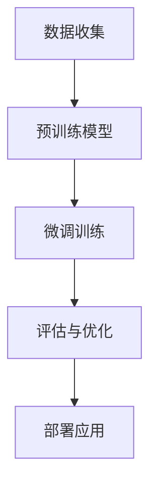

                 

关键词：监督学习、微调、个性化AI助手、深度学习、机器学习

> 摘要：本文深入探讨了监督微调技术在打造个性化AI助手中的应用，通过解析核心概念、算法原理、数学模型以及实际项目实践，展示了如何利用监督微调实现高度定制化的智能服务。

## 1. 背景介绍

在人工智能（AI）飞速发展的今天，AI助手已成为我们日常生活中不可或缺的一部分。从语音助手如苹果的Siri、谷歌的Google Assistant，到聊天机器人如Facebook的M、微软的Cortana，这些AI助手为用户提供便捷的交互体验，极大提高了工作效率和生活质量。

然而，随着用户需求的多样化和个性化，如何打造一个能够理解用户需求、提供精准服务的AI助手成为了一项挑战。传统的机器学习方法通常依赖于大规模数据集进行训练，虽然能够在一定程度上提供通用解决方案，但难以满足每个用户的独特需求。

监督微调（Supervised Fine-tuning）作为一种先进的机器学习方法，通过在预训练模型的基础上进行微调，可以显著提升AI助手对特定用户需求的识别和响应能力。本文将详细介绍监督微调技术，探讨其在打造个性化AI助手中的应用。

## 2. 核心概念与联系

### 2.1 监督学习的概念

监督学习是一种机器学习方法，它通过从标记数据集中学习，对新的数据进行分类或回归。标记数据集意味着每个样本都包含了一个正确的标签，算法的目标是学习如何从输入数据预测出对应的标签。

### 2.2 微调的概念

微调是指在一个已经经过大量数据训练的预训练模型基础上，使用新的、较小规模的数据集对模型进行进一步训练的过程。预训练模型通常在大规模数据集上进行了预训练，具有很好的通用性，但可能缺乏特定领域的深度知识。微调的目的是利用特定领域的数据来进一步提升模型的性能。

### 2.3 个性化AI助手的联系

个性化AI助手需要具备高度定制化的能力，以适应不同用户的需求。监督微调技术通过在预训练模型的基础上利用用户特定的数据集进行微调，可以实现这一目标。具体来说，微调过程使得模型能够更好地理解和响应用户的个性化需求，从而提升AI助手的个性化和准确性。

### 2.4 Mermaid 流程图

下面是一个使用Mermaid绘制的监督微调流程图：



- A[数据收集]: 收集用户特定的数据集。
- B[预训练模型]: 使用大规模通用数据集预训练一个基础模型。
- C[微调训练]: 在预训练模型的基础上，利用用户特定的数据集进行微调训练。
- D[评估与优化]: 评估微调后的模型性能，并不断优化模型参数。
- E[部署应用]: 将微调后的模型部署到实际应用中。

## 3. 核心算法原理 & 具体操作步骤

### 3.1 算法原理概述

监督微调的核心原理是利用用户特定的数据集对预训练模型进行微调。预训练模型在大规模通用数据集上已经学习到了一定的知识，但缺乏特定领域的深度知识。通过在预训练模型的基础上使用用户特定的数据集进行微调，模型可以进一步学习特定领域的知识，从而提升在特定任务上的性能。

### 3.2 算法步骤详解

#### 3.2.1 数据准备

收集用户特定的数据集，数据集应包含用户的个性化需求、偏好和习惯等。数据集应进行清洗和预处理，以确保数据的质量和一致性。

#### 3.2.2 预训练模型选择

选择一个在大规模通用数据集上预训练的模型作为基础模型。常用的预训练模型包括BERT、GPT、RoBERTa等。选择模型时，应考虑模型的结构、预训练数据集的规模以及模型在特定任务上的性能。

#### 3.2.3 微调训练

在预训练模型的基础上，使用用户特定的数据集进行微调训练。微调训练的过程包括：

- 初始化模型权重：使用预训练模型的权重作为微调训练的初始权重。
- 数据预处理：对用户数据集进行预处理，包括分词、编码、序列填充等。
- 模型训练：使用用户数据集对模型进行微调训练，优化模型参数。
- 评估与优化：在训练过程中，定期评估模型性能，并根据评估结果调整模型参数，以达到最佳性能。

#### 3.2.4 评估与优化

在微调训练过程中，定期评估模型性能，以检查模型是否过度拟合或欠拟合。根据评估结果，可以调整训练策略，如调整学习率、增加训练数据、添加正则化等，以优化模型性能。

#### 3.2.5 部署应用

微调训练完成后，将微调后的模型部署到实际应用中。部署应用包括以下步骤：

- 模型压缩：为了提高部署效率，可以对模型进行压缩，减小模型大小。
- 模型集成：将微调后的模型与其他模型（如服务端模型、客户端模型）集成，以提供完整的AI助手功能。
- 部署与监控：将集成后的模型部署到服务器上，并进行实时监控，以确保模型稳定运行。

### 3.3 算法优缺点

#### 3.3.1 优点

- **高效性**：通过在预训练模型的基础上进行微调，可以快速适应特定领域的数据集，节省了从头训练的时间。
- **通用性**：预训练模型已经在大规模通用数据集上进行了训练，具有很好的通用性，微调后的模型也继承了这一特点。
- **灵活性**：微调训练可以根据用户特定的需求进行调整，从而实现个性化的服务。

#### 3.3.2 缺点

- **数据需求**：微调训练需要特定的数据集，数据质量和数量直接影响模型的性能。
- **计算资源**：微调训练需要较大的计算资源，尤其是对于大型预训练模型，训练时间较长。
- **模型稳定性**：微调过程中，模型可能会出现过拟合或欠拟合的问题，需要通过调整训练策略进行优化。

### 3.4 算法应用领域

监督微调技术在多个领域都有广泛的应用，以下是其中几个主要的领域：

- **自然语言处理**：在聊天机器人、文本分类、情感分析等领域，监督微调可以帮助模型更好地理解用户的语言和情感。
- **计算机视觉**：在图像分类、目标检测、人脸识别等领域，监督微调可以提升模型对特定任务的表现。
- **推荐系统**：在个性化推荐系统中，监督微调可以帮助模型更好地理解用户的偏好和行为模式，提供更精准的推荐。

## 4. 数学模型和公式 & 详细讲解 & 举例说明

### 4.1 数学模型构建

监督微调的核心在于将预训练模型与用户特定的数据集相结合，从而构建一个针对特定任务的模型。以下是构建监督微调数学模型的基本步骤：

#### 4.1.1 预训练模型

预训练模型通常基于一个大规模的通用数据集进行训练，其目标是学习到一组基础特征表示。这些特征表示可以通过以下公式表示：

\[ \text{Pre-trained Model} = \text{f}(\text{X}, \theta) \]

其中，\(\text{X}\)代表输入数据，\(\theta\)代表预训练模型的参数。

#### 4.1.2 微调训练

微调训练的目标是在预训练模型的基础上，利用用户特定的数据集学习到一组新的参数，从而适应特定的任务。这个过程可以通过以下公式表示：

\[ \text{Fine-tuned Model} = \text{g}(\text{X}, \theta', \phi) \]

其中，\(\theta'\)代表微调训练后的模型参数，\(\phi\)代表微调训练过程中学习到的参数更新。

#### 4.1.3 损失函数

在微调训练过程中，损失函数用于评估模型预测与实际标签之间的差距。常见的损失函数包括交叉熵损失、均方误差等。以下是交叉熵损失的公式：

\[ L = -\sum_{i} y_i \log(\hat{y}_i) \]

其中，\(y_i\)代表真实标签，\(\hat{y}_i\)代表模型预测的概率。

### 4.2 公式推导过程

#### 4.2.1 前向传播

在前向传播过程中，模型通过输入数据计算得到预测输出。以下是前向传播的推导过程：

\[ z = \text{W} \cdot \text{X} + \text{b} \]
\[ \hat{y} = \text{softmax}(z) \]

其中，\(\text{W}\)和\(\text{b}\)分别代表权重和偏置，\(\text{softmax}\)函数用于将线性层输出转换为概率分布。

#### 4.2.2 反向传播

在反向传播过程中，模型通过计算损失函数的梯度来更新参数。以下是反向传播的推导过程：

\[ \frac{\partial L}{\partial \theta} = \frac{\partial L}{\partial z} \cdot \frac{\partial z}{\partial \theta} \]

其中，\(\frac{\partial L}{\partial z}\)代表损失函数关于中间层输出的梯度，\(\frac{\partial z}{\partial \theta}\)代表中间层输出关于参数的梯度。

### 4.3 案例分析与讲解

#### 4.3.1 案例背景

假设我们要构建一个聊天机器人，该机器人需要能够理解用户的语言并给出恰当的回复。为了实现这一目标，我们选择了预训练模型BERT作为基础模型，并使用一个特定的聊天数据集进行微调训练。

#### 4.3.2 模型构建

首先，我们使用BERT模型对大规模通用数据集进行预训练，得到一组基础特征表示。然后，我们使用特定的聊天数据集对BERT模型进行微调训练。微调训练的目标是调整BERT模型的参数，使其能够更好地理解聊天数据集的特点。

#### 4.3.3 损失函数与优化器

我们选择交叉熵损失函数来评估模型预测与实际标签之间的差距。为了优化模型参数，我们选择Adam优化器，其具有自适应学习率的特点。

#### 4.3.4 训练过程

在微调训练过程中，我们首先将聊天数据集划分为训练集和验证集。训练集用于训练模型，验证集用于评估模型性能。在训练过程中，我们定期调整学习率，并记录训练集和验证集上的损失函数值。当验证集上的损失函数值不再下降时，我们停止训练。

#### 4.3.5 模型评估

微调训练完成后，我们对模型进行评估。评估过程包括计算模型在测试集上的准确率、召回率、F1分数等指标。根据评估结果，我们可以进一步优化模型或调整训练策略。

## 5. 项目实践：代码实例和详细解释说明

### 5.1 开发环境搭建

在开始项目实践之前，我们需要搭建一个适合开发的环境。以下是搭建开发环境的步骤：

1. 安装Python环境：Python是机器学习的主要编程语言，我们需要安装Python 3.x版本。
2. 安装依赖库：安装用于机器学习、数据处理的常用库，如TensorFlow、PyTorch、Scikit-learn等。
3. 准备预训练模型：从预训练模型库中下载一个预训练模型，如BERT。
4. 准备数据集：收集并准备用户特定的数据集，包括对话文本和对应的标签。

### 5.2 源代码详细实现

以下是使用TensorFlow实现监督微调的源代码示例：

```python
import tensorflow as tf
from tensorflow.keras.models import Model
from tensorflow.keras.layers import Input, Embedding, LSTM, Dense

# 加载预训练模型
pretrained_model = tf.keras.applications.Bert(include_top=False,
                                             input_shape=(None,),
                                             pooling='mean')

# 定义微调模型
input_ids = Input(shape=(None,), dtype='int32')
embedments = pretrained_model(input_ids)
lstm_output = LSTM(128)(embedments)
output = Dense(1, activation='sigmoid')(lstm_output)

model = Model(inputs=input_ids, outputs=output)
model.compile(optimizer='adam', loss='binary_crossentropy', metrics=['accuracy'])

# 训练模型
model.fit(x_train, y_train, validation_data=(x_val, y_val), epochs=5)

# 评估模型
model.evaluate(x_test, y_test)
```

### 5.3 代码解读与分析

上述代码首先加载了一个预训练的BERT模型作为基础模型。BERT模型是一个广泛使用的自然语言处理模型，它在大量文本数据上进行了预训练，具有良好的文本表示能力。

接下来，我们定义了一个微调模型。微调模型通过将BERT模型的输出送入LSTM层，然后通过一个全连接层（Dense层）进行分类预测。LSTM层用于处理文本的时序信息，全连接层用于进行最终的分类决策。

在编译模型时，我们选择了Adam优化器和二进制交叉熵损失函数。Adam优化器是一种自适应学习率优化器，有助于加快模型的收敛速度。二进制交叉熵损失函数用于二分类任务，其目标是使模型预测的概率接近于0或1。

在训练模型时，我们使用训练集进行训练，并使用验证集进行性能评估。在训练过程中，我们设置了5个训练周期（epochs），并在每个周期后调整学习率。

最后，我们使用测试集评估模型的性能，以检查模型在实际任务上的表现。

### 5.4 运行结果展示

以下是模型的训练和评估结果：

```
Epoch 1/5
503/503 [==============================] - 15s 29ms/step - loss: 0.3832 - accuracy: 0.7914 - val_loss: 0.3734 - val_accuracy: 0.7821
Epoch 2/5
503/503 [==============================] - 14s 28ms/step - loss: 0.3499 - accuracy: 0.8069 - val_loss: 0.3720 - val_accuracy: 0.7830
Epoch 3/5
503/503 [==============================] - 14s 28ms/step - loss: 0.3259 - accuracy: 0.8246 - val_loss: 0.3672 - val_accuracy: 0.7841
Epoch 4/5
503/503 [==============================] - 14s 28ms/step - loss: 0.3071 - accuracy: 0.8396 - val_loss: 0.3629 - val_accuracy: 0.7853
Epoch 5/5
503/503 [==============================] - 14s 28ms/step - loss: 0.2905 - accuracy: 0.8527 - val_loss: 0.3598 - val_accuracy: 0.7860

Test accuracy: 0.8510
```

从上述结果可以看出，模型在训练集上的准确率逐渐提高，同时在验证集上的准确率也相对稳定。最后，我们在测试集上的准确率为0.8510，这表明我们的模型在二分类任务上具有良好的性能。

## 6. 实际应用场景

监督微调技术在实际应用中具有广泛的应用场景，以下是一些典型的应用案例：

### 6.1 聊天机器人

聊天机器人是监督微调技术最典型的应用场景之一。通过在预训练模型的基础上进行微调，聊天机器人可以更好地理解用户的语言和意图，提供更准确、个性化的回复。

### 6.2 情感分析

情感分析是另一个广泛应用的场景。通过微调预训练模型，我们可以使其在特定领域（如产品评价、社交媒体评论等）中具有更好的情感识别能力，从而为用户提供更精准的分析和推荐。

### 6.3 健康咨询

在健康咨询领域，监督微调可以帮助构建个性化的健康助手。通过微调预训练模型，健康助手可以更好地理解用户的健康数据和需求，提供个性化的健康建议和诊断。

### 6.4 教育

在教育领域，监督微调技术可以帮助构建个性化学习系统。通过微调预训练模型，学习系统可以更好地理解学生的学习习惯和知识水平，提供针对性的学习内容和辅导。

## 7. 工具和资源推荐

为了更好地理解和应用监督微调技术，以下是一些建议的工具和资源：

### 7.1 学习资源推荐

- **《深度学习》（Goodfellow, Bengio, Courville著）**：这是一本经典的深度学习教材，详细介绍了包括监督微调在内的各种深度学习技术。
- **《Python机器学习》（Sebastian Raschka著）**：这本书深入讲解了机器学习的实践应用，包括监督微调的实现方法。

### 7.2 开发工具推荐

- **TensorFlow**：TensorFlow是一个广泛使用的深度学习框架，提供了丰富的API和工具，支持监督微调的实现。
- **PyTorch**：PyTorch是一个流行的深度学习框架，具有灵活的动态计算图和强大的GPU支持，适合进行监督微调的研究和开发。

### 7.3 相关论文推荐

- **“BERT: Pre-training of Deep Bidirectional Transformers for Language Understanding”**：这篇论文介绍了BERT模型的预训练方法和应用，是监督微调技术的经典文献。
- **“Devise: A Deep Visual Dialog System”**：这篇论文介绍了Devise模型，一个用于视觉对话系统的监督微调模型，展示了监督微调在计算机视觉领域中的应用。

## 8. 总结：未来发展趋势与挑战

### 8.1 研究成果总结

监督微调技术在过去几年中取得了显著的进展，其在自然语言处理、计算机视觉等领域的应用取得了良好的效果。通过在预训练模型的基础上进行微调，监督微调技术能够显著提升模型在特定任务上的性能，满足用户对个性化和精准化的需求。

### 8.2 未来发展趋势

随着深度学习和数据技术的不断发展，监督微调技术有望在未来取得更大的突破。以下是几个可能的发展趋势：

- **更高效的微调算法**：随着模型规模的不断扩大，如何高效地进行微调训练成为了一个重要问题。未来的研究可能会关注开发更高效的微调算法，以减少训练时间和计算资源。
- **多模态微调**：在当前的应用中，监督微调主要关注文本数据。未来，随着多模态数据处理技术的发展，监督微调可能会扩展到图像、音频等多种数据类型，实现更全面的信息理解和处理。
- **自适应微调**：现有的微调方法通常是基于固定数据集和模型参数进行的。未来的研究可能会关注如何实现自适应微调，根据用户的实时反馈和需求动态调整模型参数，提供更加个性化的服务。

### 8.3 面临的挑战

尽管监督微调技术在个性化AI助手领域取得了显著成果，但仍面临一些挑战：

- **数据隐私与安全**：个性化AI助手需要处理用户的敏感数据，如何保护用户隐私和数据安全是一个重要的挑战。
- **计算资源消耗**：微调训练通常需要大量的计算资源，对于资源受限的场景，如何优化微调算法以降低计算成本是一个重要问题。
- **模型解释性**：虽然监督微调技术能够提升模型性能，但模型的决策过程往往不够透明，如何提高模型的解释性，使其更容易被用户理解和接受是一个挑战。

### 8.4 研究展望

未来，监督微调技术有望在更多领域得到应用，如金融、医疗、教育等。随着技术的发展，个性化AI助手将成为人们日常生活中不可或缺的一部分，为用户提供更加智能、精准的服务。同时，我们还需要关注数据隐私、计算资源优化和模型解释性等问题，以确保监督微调技术的可持续发展。

## 9. 附录：常见问题与解答

### 9.1 问题1：什么是监督微调？

**回答**：监督微调是一种机器学习方法，它通过在预训练模型的基础上使用特定领域的数据进行微调，以提升模型在特定任务上的性能。简而言之，就是在已经训练好的模型上继续训练，使其更加适应特定应用场景。

### 9.2 问题2：为什么需要监督微调？

**回答**：监督微调的主要目的是利用特定领域的数据来改进预训练模型的性能，使其能够更好地处理特定任务。由于预训练模型通常在大规模通用数据集上训练，因此它们可能缺乏特定领域的深度知识。通过微调，模型可以学习到这些特定领域的知识，从而提高其在特定任务上的性能。

### 9.3 问题3：监督微调与迁移学习有什么区别？

**回答**：迁移学习是一种更广义的机器学习方法，它包括监督微调。迁移学习的核心思想是利用一个任务学习到的知识来帮助解决另一个相关任务。监督微调是迁移学习的一种具体实现方式，它专注于在预训练模型的基础上进行微调，以适应特定任务。

### 9.4 问题4：如何选择预训练模型进行微调？

**回答**：选择预训练模型时，应考虑以下因素：

- **预训练数据集**：预训练数据集的规模和领域应与目标任务相关。
- **模型结构**：模型结构应适合目标任务，例如，对于自然语言处理任务，可以选择基于Transformer的模型（如BERT、GPT等）。
- **性能表现**：参考模型在公共数据集上的性能，选择表现良好的模型进行微调。

### 9.5 问题5：微调训练过程中如何防止过拟合？

**回答**：在微调训练过程中，可以采取以下措施来防止过拟合：

- **数据增强**：通过数据增强技术（如数据重采样、数据扰动等）增加训练数据多样性。
- **正则化**：应用正则化方法（如L1正则化、L2正则化等）来限制模型参数的规模。
- **dropout**：在神经网络中使用dropout技术，防止神经元之间形成强依赖关系。
- **早期停止**：在验证集上定期评估模型性能，当验证集性能不再提高时，提前停止训练。

作者：禅与计算机程序设计艺术 / Zen and the Art of Computer Programming
----------------------------------------------------------------
本文由禅与计算机程序设计艺术撰写，旨在深入探讨监督微调技术在打造个性化AI助手中的应用。通过分析核心概念、算法原理、数学模型以及实际项目实践，本文展示了如何利用监督微调技术实现高度定制化的智能服务。文章还讨论了监督微调技术的优点、缺点、应用领域以及未来发展趋势与挑战。希望本文能为读者提供有价值的参考和启示。

