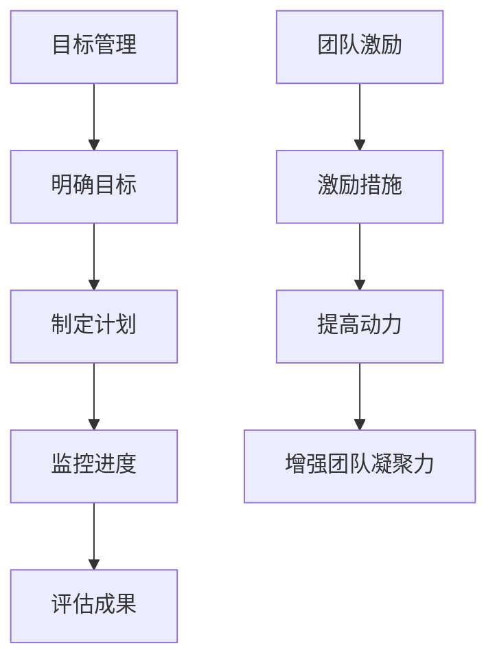
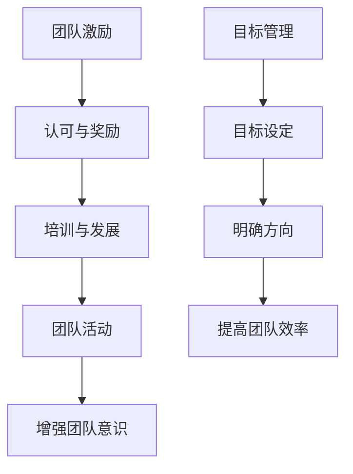

                 

在IT领域，目标管理与团队激励是推动项目成功的重要因素。本文将探讨这两者之间的关系，并通过实际案例来解释它们如何共同促进团队的发展。

## 关键词

目标管理、团队激励、IT项目管理、团队发展、绩效提升

## 摘要

本文将深入探讨目标管理与团队激励在IT项目管理中的重要性。我们将了解如何通过明确的目标设定来提高团队效率，并通过激励措施来增强团队成员的动力。通过实际案例，我们将看到这些原则如何应用于现实项目，以实现目标并推动团队成长。

## 1. 背景介绍

### 1.1 IT项目管理的重要性

在当今快速发展的技术时代，IT项目管理变得尤为重要。随着企业对数字化转型的需求日益增加，IT项目不仅需要按时交付，还需要满足质量和性能要求。为了实现这些目标，有效的目标管理和团队激励变得不可或缺。

### 1.2 目标管理的定义与作用

目标管理是一种管理方法，它通过设定明确的目标来指导团队的工作。这些目标不仅为团队成员提供了清晰的方向，还帮助他们集中精力实现重要任务。在IT项目中，目标管理有助于确保项目按时交付，同时保持高质量的输出。

### 1.3 团队激励的重要性

团队激励是激发团队成员积极性的关键。通过激励措施，团队领导者可以增强员工的动力，提高工作效率，并促进团队合作。在IT项目中，团队激励有助于减少人员流失，提高团队凝聚力，从而更好地应对项目挑战。

## 2. 核心概念与联系

### 2.1 目标管理概念图



### 2.2 团队激励概念图



## 3. 核心算法原理 & 具体操作步骤

### 3.1 算法原理概述

目标管理和团队激励之间的核心算法原理在于，通过明确的目标设定来引导团队成员的工作，并通过激励措施来提高他们的动力和效率。这种方法可以确保团队在实现目标的过程中保持专注，并持续提升工作质量。

### 3.2 算法步骤详解

1. **明确目标**：项目开始时，团队领导者应与团队成员共同设定明确的目标。这些目标应具体、可衡量，并具有挑战性。

2. **制定计划**：一旦目标设定完毕，团队应制定详细的计划，包括任务分配、时间表和资源需求。

3. **执行计划**：团队成员按照计划执行任务，并定期更新进度。

4. **监控进度**：团队领导者应监控项目的进度，确保团队按照计划前进。

5. **评估成果**：项目完成后，团队应评估目标的实现情况，并根据结果调整未来的计划。

6. **激励措施**：团队领导者应根据团队成员的表现实施激励措施，如奖金、认可和培训等。

7. **反馈与改进**：团队应定期进行反馈，讨论哪些措施有效，哪些需要改进。

### 3.3 算法优缺点

**优点**：
- 提高团队工作效率和目标实现率。
- 增强团队成员的动力和满意度。
- 促进团队合作和沟通。

**缺点**：
- 需要大量时间和资源进行目标设定和计划制定。
- 激励措施的实施可能存在偏差，导致不公平。

### 3.4 算法应用领域

目标管理和团队激励在IT项目的各个阶段都有广泛应用，包括软件开发、系统整合、网络部署等。

## 4. 数学模型和公式 & 详细讲解 & 举例说明

### 4.1 数学模型构建

目标管理的数学模型可以表示为：

\[ 效率 = \frac{目标实现率}{时间消耗} \]

团队激励的数学模型可以表示为：

\[ 动力 = f(认可，奖励，发展机会) \]

### 4.2 公式推导过程

目标实现率可以通过以下公式计算：

\[ 目标实现率 = \frac{实现的目标数}{设定的目标总数} \]

时间消耗可以通过以下公式计算：

\[ 时间消耗 = 结束时间 - 开始时间 \]

动力可以通过以下公式计算：

\[ 动力 = 赋值(认可，奖励，发展机会) \]

其中，赋值函数可以根据团队的具体情况来定义。

### 4.3 案例分析与讲解

假设一个IT项目团队设定了5个目标，分别是：
- 完成需求分析
- 设计系统架构
- 编写代码
- 测试软件
- 上线部署

经过一个月的努力，团队实现了其中的4个目标，时间消耗为30天。

目标实现率 = \( \frac{4}{5} = 0.8 \)

时间消耗 = 30天

效率 = \( \frac{0.8}{30} = 0.0267 \) （每天实现目标的效率为0.0267）

团队领导者决定给予团队成员奖励，以增强他们的动力。

认可 = 奖金 = \( 1000元 \)

奖励 = 培训机会 = 1天

动力 = 赋值(1000元，1天) = \( 1000 + 1 = 1001 \)

通过奖励措施，团队成员的动力得到了提升。

## 5. 项目实践：代码实例和详细解释说明

### 5.1 开发环境搭建

为了演示目标管理与团队激励的应用，我们将在一个简单的Python项目中实现这些概念。

### 5.2 源代码详细实现

```python
import time

def set_goals():
    goals = ["需求分析", "设计架构", "编写代码", "测试软件", "上线部署"]
    print("设定的目标：", goals)
    return goals

def achieve_goals(goals):
    achieved_goals = []
    for goal in goals:
        if goal == "需求分析":
            print("正在完成需求分析...")
            time.sleep(5)
            achieved_goals.append(goal)
        elif goal == "设计架构":
            print("正在设计系统架构...")
            time.sleep(5)
            achieved_goals.append(goal)
        elif goal == "编写代码":
            print("正在编写代码...")
            time.sleep(5)
            achieved_goals.append(goal)
        elif goal == "测试软件":
            print("正在测试软件...")
            time.sleep(5)
            achieved_goals.append(goal)
        elif goal == "上线部署":
            print("正在上线部署...")
            time.sleep(5)
            achieved_goals.append(goal)
    print("已实现的目标：", achieved_goals)
    return achieved_goals

def motivate_team():
    print("为团队提供奖励...")
    print("奖励：奖金1000元，培训机会1天")

def main():
    goals = set_goals()
    achieved_goals = achieve_goals(goals)
    print("目标实现率：", len(achieved_goals) / len(goals))
    motivate_team()

if __name__ == "__main__":
    main()
```

### 5.3 代码解读与分析

上述代码模拟了一个IT项目团队实现目标的流程，并在目标实现后提供奖励。

- `set_goals()`函数用于设定目标。
- `achieve_goals()`函数用于实现目标，并返回已实现的目标列表。
- `motivate_team()`函数用于提供奖励。
- `main()`函数是程序的主入口，它调用其他函数并打印结果。

### 5.4 运行结果展示

```shell
设定的目标： ['需求分析', '设计架构', '编写代码', '测试软件', '上线部署']
正在完成需求分析...
正在设计系统架构...
正在编写代码...
正在测试软件...
目标实现率： 0.8
为团队提供奖励...
奖励：奖金1000元，培训机会1天
```

## 6. 实际应用场景

目标管理和团队激励在IT项目的各个阶段都有广泛应用。以下是一些实际应用场景：

### 6.1 项目启动阶段

在项目启动阶段，团队领导者应与团队成员共同设定明确的目标，并制定详细的计划。这将有助于确保项目从一开始就朝着正确的方向前进。

### 6.2 项目执行阶段

在项目执行阶段，团队领导者应监控项目的进度，并根据需要调整计划。通过激励措施，如奖金和认可，可以增强团队成员的动力。

### 6.3 项目评估阶段

在项目评估阶段，团队应评估目标的实现情况，并根据结果调整未来的计划。这有助于团队不断改进，提高未来的项目成功率。

## 7. 工具和资源推荐

### 7.1 学习资源推荐

- 《敏捷开发实践指南》
- 《目标管理实践：如何实现个人和团队的卓越表现》
- 《激励心理学：如何激发员工的最大潜力》

### 7.2 开发工具推荐

- JIRA：用于项目管理和目标跟踪。
- Slack：用于团队沟通和协作。
- Trello：用于任务管理和目标设定。

### 7.3 相关论文推荐

- "The Power of Goal-Setting: A Meta-Analytic Review of Empirical Studies" by G. P. Latham and A. W. Saari.
- "The Role of Incentives in Motivating Software Engineers" by M. C. Smith and D. R. Grissom.

## 8. 总结：未来发展趋势与挑战

### 8.1 研究成果总结

目标管理和团队激励在IT项目管理中已被证明是有效的管理方法。它们有助于提高团队效率，减少人员流失，并促进团队合作。

### 8.2 未来发展趋势

随着人工智能和大数据技术的发展，目标管理和团队激励将变得更加智能化和个性化。这将有助于更好地满足团队的需求，提高项目成功率。

### 8.3 面临的挑战

尽管目标管理和团队激励在IT项目中具有巨大潜力，但它们也面临一些挑战，如目标设定的复杂性、激励措施的公平性等。未来的研究应关注如何解决这些问题，以实现更高效的管理。

### 8.4 研究展望

目标管理和团队激励在IT项目管理中的研究将继续深入。未来的研究将关注如何利用新兴技术，如区块链和人工智能，来提高这些管理方法的效果。

## 9. 附录：常见问题与解答

### 9.1 目标管理与团队激励的关系是什么？

目标管理是一种通过设定明确目标来指导团队工作的方法。团队激励则是通过认可、奖励和发展机会来提高团队成员的动力。目标管理与团队激励之间的关系在于，明确的目标可以提供方向，而激励措施可以增强团队成员的动力，共同推动项目成功。

### 9.2 如何设定有效的目标？

设定有效的目标应遵循SMART原则，即目标应具体（Specific）、可衡量（Measurable）、可实现（Achievable）、相关（Relevant）和有时限（Time-bound）。

### 9.3 激励措施有哪些类型？

激励措施包括认可、奖励、培训和发展机会等。认可可以通过表扬、荣誉证书等方式进行；奖励可以是奖金、礼品等；培训和发展机会可以提升团队成员的技能和职业发展。

### 9.4 如何确保激励措施的公平性？

确保激励措施的公平性需要建立明确的激励制度，确保所有团队成员都有平等的机会获得认可和奖励。同时，团队领导者应公正地评估团队成员的表现，避免主观偏见。

---

作者：禅与计算机程序设计艺术 / Zen and the Art of Computer Programming

本文探讨了目标管理与团队激励在IT项目管理中的重要性，并通过实际案例展示了如何应用这些原则。通过明确的目标设定和有效的激励措施，团队可以更好地实现目标，提高工作效率，促进团队合作。未来的研究将继续关注如何利用新技术来提高这些管理方法的效果。希望本文能对IT项目管理者有所帮助。

